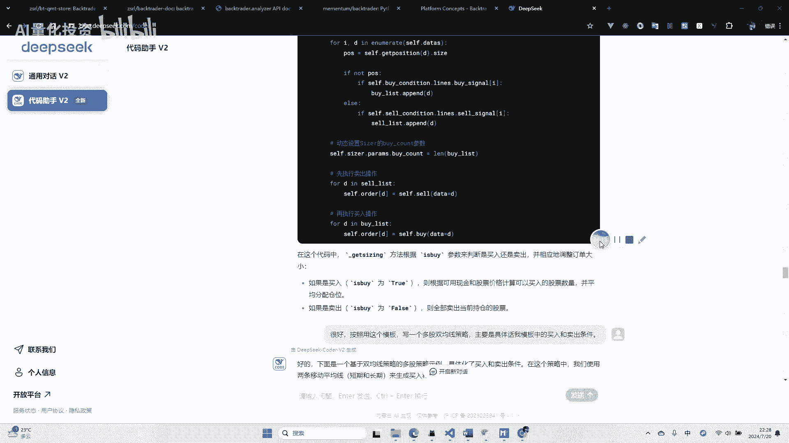
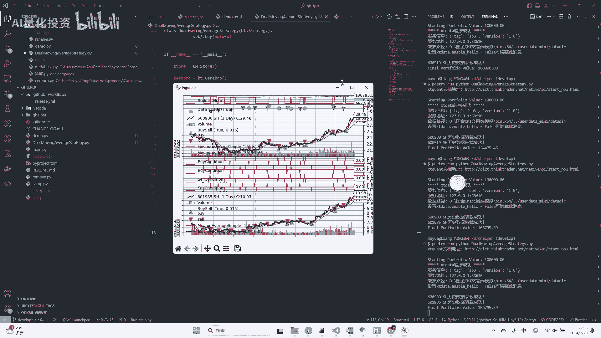
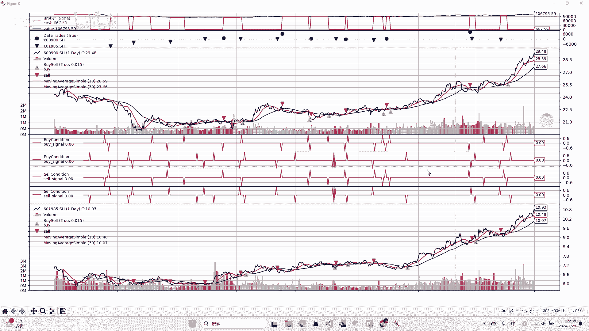
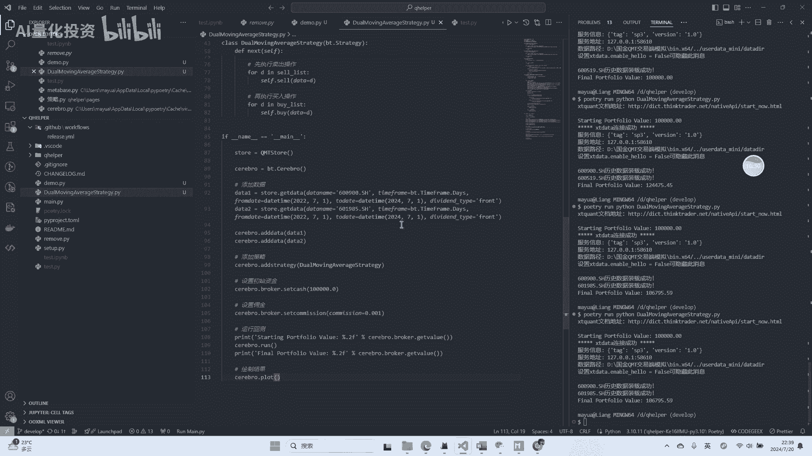
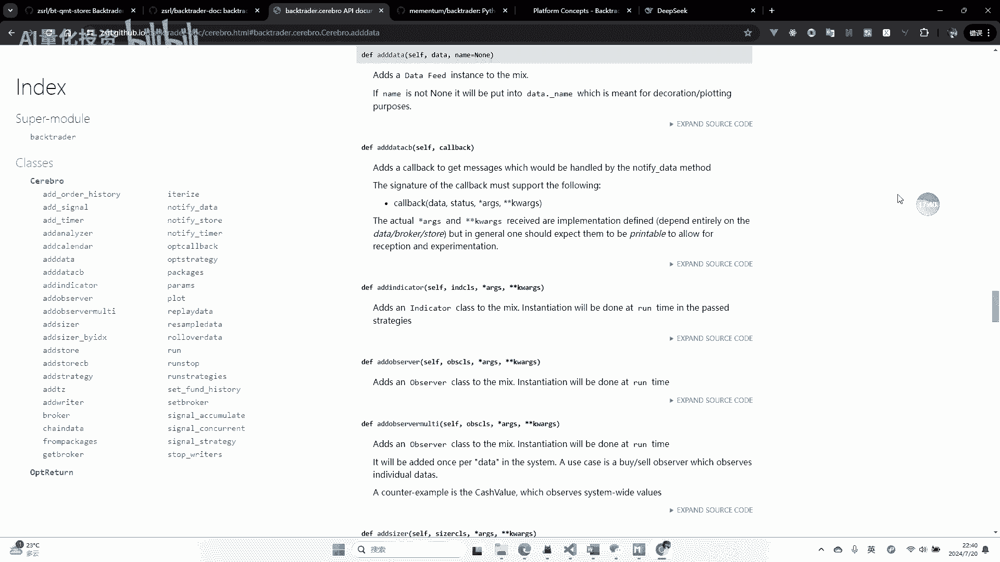
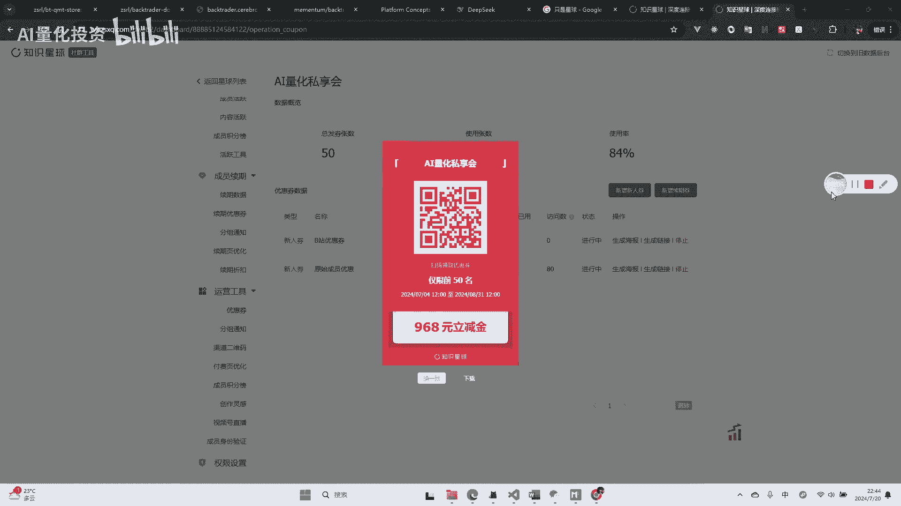

# miniqmt+backtrader如何做量化回测？ - P1：20240720_222143 - 量化投资技术 - BV1pi8resExV

大家好啊，呃最近很多朋友在问，这个mini q mt如何进行回测啊，因为大家知道mini k mt它只有数据获取的接口，和程序化下单的接口，就是免费版的mini k m t呢。

其实呃回测系统是没有暴露出来的，那我们如何能用mini camd数据源进行回测了啊，那这这个工作呢我最近正好也在做，所以跟大家分享一下，嗯这里呢其实我自己开发了一个库。

这个库是可以理解为BACKTRINDER的一个插件啊，嗯他BACKTRINDER有这种呃是store的开发的这种规范，然后我们可以开发一个store，然后就把我们的数据源接入进去啊。

这里我要接入的呢就是mini qumt的数据源啊，那这个库呢，这个视频的重点就给大家介绍这个库怎么用啊，然后还有一些back trader的基础的用法，应该怎么去做，怎么去用嗯，先我们先说一下这个库。

这个库的话呢，它的目目的或者说它的用途呢，就是把嗯mini q mt的数据源，mini q mt数据源，大家可能知道他是用这个，我们先用download接口给download下载下来。

然后用嗯get local date或者get market date，来把它获取回来对吧，然后就可以我们就可以得到一个pandas as啊，the data frame去用了啊。

那这里呢我们我这个包做的呢，就是把mini q m t的数据源呢，再转成这个BACKTRINDER用的数据源啊，嗯把这个封装了一下啊，那这样的话呢我们就可以在BACKTR这里。

很方便的使用这个mini qumt的数据源了啊，这个东西呢肯定别人没给你讲过，因为这个东西是我自己开发的啊，嗯我先说一下这个东西怎么怎么安装啊，嗯首先呢我把这个嗯。

这个包呢已经发到了b y p i pi上，也就用用pip就可以安装了，然后他的在下载的包的名字呢叫做QMT，BT啊，大家用这个命令就可以安装了，然后这里呢引入BACKTRANSER。

然后引入这里有一个q m t store，我这个包里有一个q m store类啊，然后下面呢就是BACKTRINDER的代码了啊，我们也需要新建一个CYBERAL，就是他的大脑。

然后再新建我这个store啊，然后这这里呢就是生成这个数据源啊，我这个store里面有个get data的方法，这里面有几个参数，这个参数其实是也是BACKTRINNER规规定的。

他的data name呢就是啊，这我们这里的就是股票的标的，比如说我这随便写了一个啊，然后下面呢就是这个这个这个字段呢代表周期，那我这里写这个呢就代表是日线嘛对吧，然后再往下呢就是呃他的呃。

开始时间和结束时间啊，这后面还有啊结束时间，然后这是这个呢是复权的参数，我这里用的是前复权对吧啊，然后再往下呢，就是把这个date加到这个several里面啊，就完成了这个。

那我们用把mini camt的数据啊，注入到BACKTRDER的这么一个操作啊，那也就是说这个中间具体这个数据怎么处理的，逻辑呢，我这个包都做了嗯，大家如果想用的话呢，只要把这个嗯调一下。

我这个get类的方法就可以了啊，然后这个包呢也是呃是开源的啊，大家可以看啊，嗯所以这里呢可能我觉得一部分人已经听懂了，就是我们mini k m t为什么不能回测呢，就是因为我们有回测系统对吧。

那那我们想用BACKTRINDER去进行回测的话呢，就是需要把mini k m t的数据源嗯，接入到BACKTRINDER就可以了，那这样的话，我们的回收系统就可以用BACKTRINDER来做了。

那下面呢再给大家简单介绍一下这个BACKTRDER啊，BACKTRINDER这个库呢其实也很久了啊，这是他的GITHUB的主页，关注的人也很多，死star人有啊，1万多啊，三十十三K。

然后嗯他这个库呢其实也不是很新，他在19年的时候基本上就已经成型了啊，19年之后这个库基本上就没怎么改过啊，但是一直在国内呢，它并没有很被很多人去讲解和使用，第一呢是因为它门槛比较高啊。

就是学习成本比较高啊，然后再加上他的文档写的不是很清楚啊，他这个如果只是看他这个官方的文档，一个是英文的，但英文呢还好，我们现在都有各种翻译工具，或者大家英文比较好的话，可以直接看。

但是就是你去把这个文档全读一遍，你可能也不知道这个BACKCHANDER，它每一个模块到底应该怎么用啊，所以这是我们现在嗯国内很多人吧，这个back川，这没有大规模普及的这么一个一个痛点吧。

嗯那我个人呢也是通过各种途径在学习，这个BACKTRINDER，后续呢我也会做一些分享啊，嗯然后我们先简单的看一个效果，呃，这里再说一下呢，就是其实现在我们有一个比较好的事情。

就是我们可以借助AI去学习这个BACKTRDER，即使他文档写的不是很明白，但是我试了一下，包括JPGPT4啊，还有国产的，像这个DPSG嗯，还有一些模型对BACKTRINNER理解呢都还可以啊。

至少啊一些你引导他之后，他的一些策略他是能写出来的啊，比如说我这里呢就是在最近呢就在用deep sick啊，去让他辅助我，一步一步的改改一些策略的样例啊，那我今天要演示这个策略呢。

也是用AI嗯跟我一起辅助改出来的啊。

我们来看一下这个策略样例啊，这个呢还是做一个很简单的双均线策略啊，这个双均线策略嗯，他没有什么太实际的价值啊，他就是一个我们对如何编写策略，去了解它的一个一个工具吧。

啊然后这里呢其实一个BACKTRINDER最重要的嗯，这个是这里面的就是这个啊类啊，这个策略类，这这个呢它这里呢定义了这个类的主体嗯，但是在我详细使用这个东西之后呢，我其实要把它再抽离出来几部分呃。

第一部分呢就是这个我们这是一个自定义指标，这个自定义指标呢，其实你可以看到这个英文by condition，就是嗯我们定义了一个买入条件对吧，那这里的双均线策略呢，我们就是呃定义了一个这个呃啊。

这个额两个均线互相交叉的时候，就产生了这个买入，然后一个金叉一个死差嘛对吧，然后卖出条件同理也是嗯产生交叉的时候啊，反向交叉的时候呢，就是这个卖出啊，那这样的话呢，我们就把这个买入条件和卖出条件。

独立出来了啊，独立在我们策略之外，这样的话就比较好管理啊，再往下呢就是这个sizer，sizer这个东西呢其实也很重要，就是我们要做仓位控制啊，嗯就是在这个策略执行的过程当中呢，我们嗯每次买。

我每次卖要怎样去分配这个仓位啊，那这里呢我给大家也大概说一下，我这个模板里是这样的，就是我识别这里呢我有几个要买入的啊，然后我平均把我剩余的金钱呢，平均分配到这个买入的这个各的各个股票上。

比如说我要买两个呢，那我就一个50%对吧，要要三个呢，就一个30%多啊，大概一个平均分，然后我卖出的策略呢就是我有多少仓，有多少仓位呢，我就都卖出啊，做一个很简单的这么一个逻辑，那目前我归纳之后呢。

其实就是一个策略最重要的几部分，就是买入条件，卖出条件和你的仓位控制这几部分啊，是必须要明确的嗯，再往下呢就是我刚才说的这个策略主体，策略主体，这里呢就是定义我们实际的那这个策略的执行。

策略主体里面呢有两个方法，一个是int方法，一个是nest方法，int方法呢就是这个策略初始的时候，他执行一次啊，那我们可以看到我们这里，第一呢注册了我们的这个仓位的管理器啊。

把它注册到这个size上啊，这是他BACKTRINDER自带的一个功能啊，然后下面的是计算这个两个一个长均线，一个短均线的这么一个指标啊，因为这里我们是模拟了多股策略。

就是我这里不一定是一只一只股票对吧，可能是两只，甚至可能是50只，可能是300只，可能是更多对吧，所以我们这里的所有代码，是针对这个多股来进行编写的啊，可以看到他先计算这个呃每只股票的这个额。

买入和卖出的啊这么一个呃不是买入卖出，就是额计算它长长均线和短均线，然后再计算他的买入和卖出的条件啊，这么一个策略嗯，然后这个初始化完事之后呢，嗯就是要执行nice的方法。

net方法的意义就是它是它其实是一个嗯烂型的，就是它它的数据都是一条烂，就是一条一条线嗯，我们在这条线呢就是一个时间的时间轴啊，然后沿着这条时间轴呢，就是每天执行一次nest啊，因为我这是日线策略。

所以我说的是每天如果你是小时策略，那就是每小时啊，反正这个奈奈奈斯的这个触发的频率呢，是根据你的时间和周期决定的啊，那这里呢我们就先计算啊，嗯所有的买入信号和卖出信号，把它存在两个字典里啊。

不是字典存在两个列表里嗯，然后再在这里呢我动态的设置这个嗯，每次的by count就是我的仓位控制的，by count是买入的这个list的长度对吧，这个大家能理解我得到了三个买入信号。

那我这个呃by count就应该等于三对吧啊，然后这里呢我们先执行卖出操作，因为我们在实际的每日的交易中呢，其实也是你要先执行卖出，再执行买入嘛对吧，这样的话你可以你可以换仓嘛对吧嗯。

然后这里也是可以看到我这里的，这里的卖出和买入呢，并没有实际指定他的他的这个是买入多少，卖出多少，所以这些东西呢，其实我都是在这个size里控制的啊，也就是说把这个整个的仓位控制独立出来了啊。

啊这就是一个简单策略就写完了啊，然后这是策略的定义，再往下就是策略执行啊，这策略执行呢，就是说用到了我刚才说的写的这个库了啊，嗯这里呢我们创建了这个crimd store，然后创建了CYBERO啊。

嗯然后我这里呢是注入了两只两只股票啊，啊我们测试测一下这个嗯，就是多多数据的这么一个情况啊，然后分别把他们给加入到这个CYBERAL里，然后再把策略加入到赛博AL里。

然后这里呢是测试是那个设置初始资金啊，设置佣金啊，这些东西都是可以根据实际的情况，进行一个设置啊，然后再往下呢，就是就是最重要的就是把它run起来啊，就这就是真正的运行了，最后一个是画图啊。

那下面呢我们就来嗯实际的去运行一下，试一下啊，嗯因为我这个是用，是用这个管理的，然后我们要运行一下它这个嗯，就这个策略我试一下啊，哎可以看到我这里打印了数据装载成功，就是我这两个数据装载装载成功了。

然后它运行如果不出错之后呢，它会有一个会出现一个图，这个图是BACKTRDER内置的啊。

这个图画的其实也不咋地，但是他至少给你带了一个图啊，呃这里因为我们有有两只这个嗯标的，所以我们这他给我画了两个，这个大家如果嗯能想到的话，就是如果你要很多只的话，就是50只300只，这个图就没法看了啊。

实际也是这样的，因为这个图呢他本来设计就是为单支设计的，因为呃如果你做这种嗯期货期权的回测呢，可能单支比较多一点，但只股票这块呢，你可能要大规模的去加入各种的数，各种的股票的数据源啊。

所以他这个图呢我们只能简单的用一下啊，然后这个图最最上面显示的呢，就是你的这个这个资金，和这个实际的市值的变化，也就是说我们这个策略到最后呢，是稍微有一点点盈利的啊，啊，也就是说他从啊。

10万块钱变成了10万6000多啊，当然这这肯定是一个这个就是负效应的策略了，因为我我拿的是两个最近涨得最好的，一个是长长江电力，一个是中国中国核电嘛，这么两个股票来试了一下啊，嗯他才盈利这一点。

所以说明这个策略肯定是负阿尔法的啊，但是我们只是为了实际演示一下怎么做回测啊，然后这里呢下面这一块呢是呃表示呃怎么说呢，是啊，每一个额，他的交易是否是是否是那个叫什么盈利的啊，噗嘶嗯应该是这个意思啊。

然后嗯反正就是他会统计每一个时间点，哪个进行了交易啊，然后这个呢是这里呢就是实际的这个线，然后这里是他的买入点和卖出点啊，买入点和卖出点啊，这三条线呢就分别是我们这几条两条均线吧。

两条均线和黑色的是他的那个收收盘价，就是那个股票标的的价格线，另外两条是均线啊，然后这是什么，反正是他带出来画的东西，嗯嗯这个图呢大概就这么看啊。

那这样的一个一个策略呢就运行完了啊，啊可以看到这里，我并没有嗯写它写什么mini qumt的代码对吧，我把它全封装到这里，这只要是我们启动一个这个mini qumt的客户端，就可以了啊。

我这里启动的是一个模拟的啊，嗯因为现在周末嘛，这个正好跟大家说一下，周末的话这个嗯科mt啊，他经常维护啊，磁盘登不上去，所以大家周末的话，可以用模拟盘去进行一些测试啊，我看这个我看群里有人反映嗯。

你这个没办法，这个你只能自己想办法啊，然后。

然后再说一下这个吧，这个我的这个呃主页上还有一个项目，这个项目是从BACKTRINDER里面导出的源码文档，我把它放在了这个GITHUB配置上，这个如果呃深入想了解bike trader的话呢。

也可以去呃了解一下，这里会显示他所有的对象和类，然后比如说这里的嗯，这个我们刚才提到的symbol，它嗯他这里面都有哪些方法呀，啊然后每个方法的详细，其实他的他在源码文档里写的，其实比较详细的啊。

啊虽然是英文的，但是大家翻译一下就行了，比如说拿这个翻译一下啊，这个工具也挺好用的啊，如果感兴趣的可以装一下啊，哎上网搜一下能搜到啊，嗯他会给你翻译一下这个每个参数是干嘛的啊，虽然写的都挺抽象的。

但是也可以作为一个辅助对吧，嗯包括我们刚才用到这个ADDATE怎么用，大概是什么意思是吧，嗯都能查到嗯最后呢如果你看到这了呢。

那我就宣传一下我自己的知识星球啊，刚开始弄，然后现在很很便宜啊，一顿饭钱，然后嗯然后我的相关的代码呀，还有文档都会在里面发布啊，有兴趣的可以加进来来一起讨论，然后获取啊，嗯好的，那这期视频就到这里。

