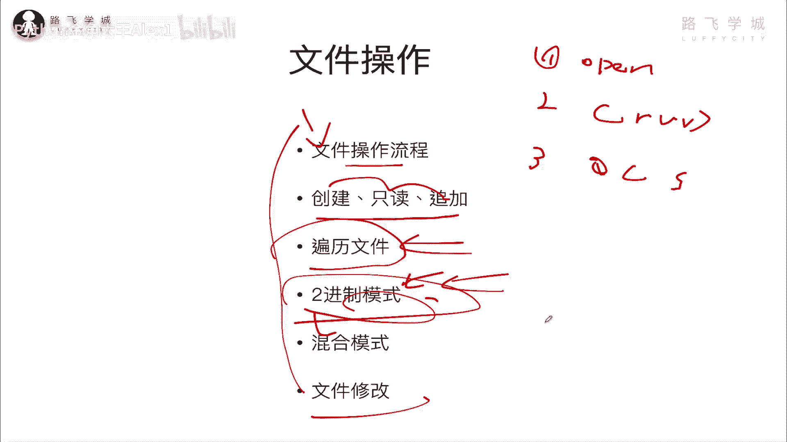
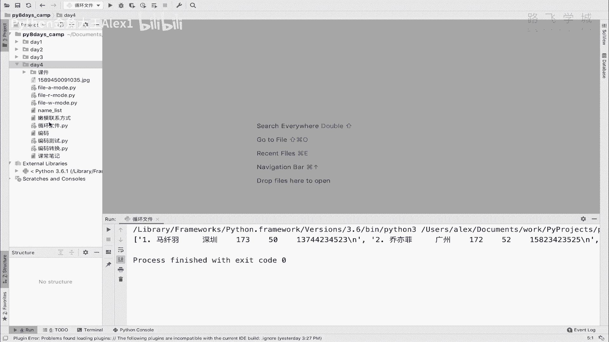
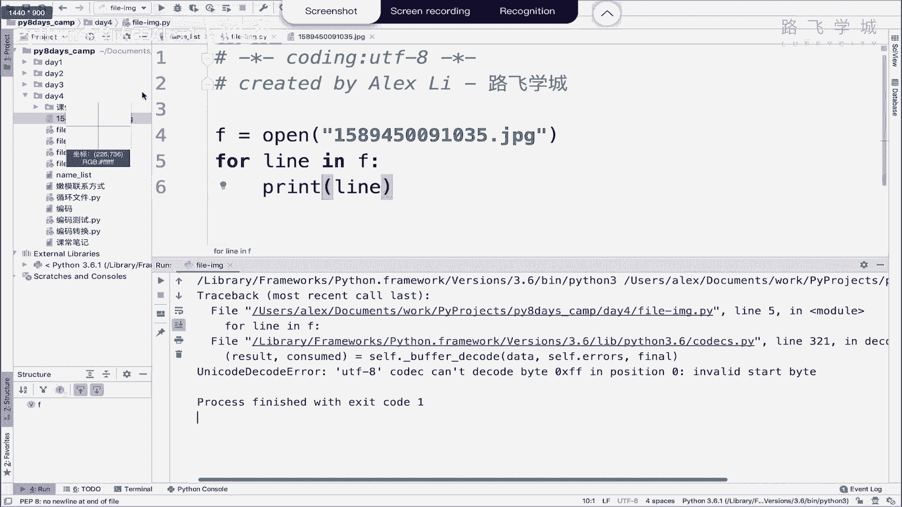
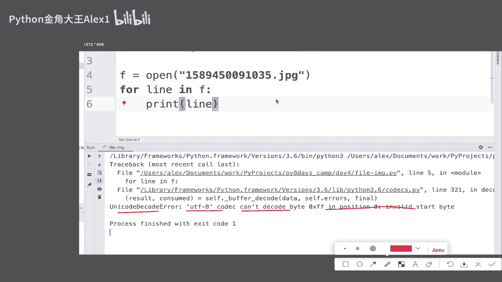
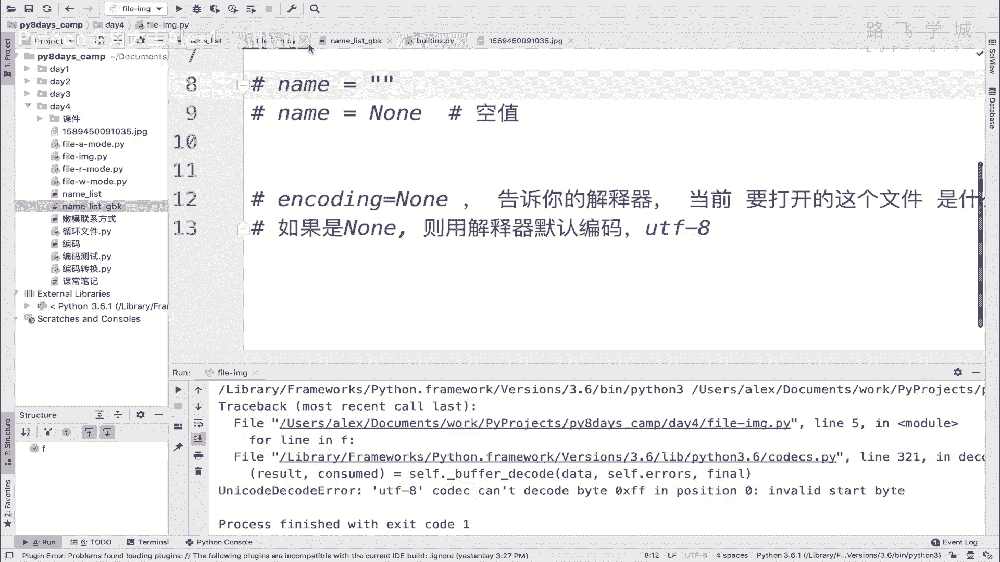
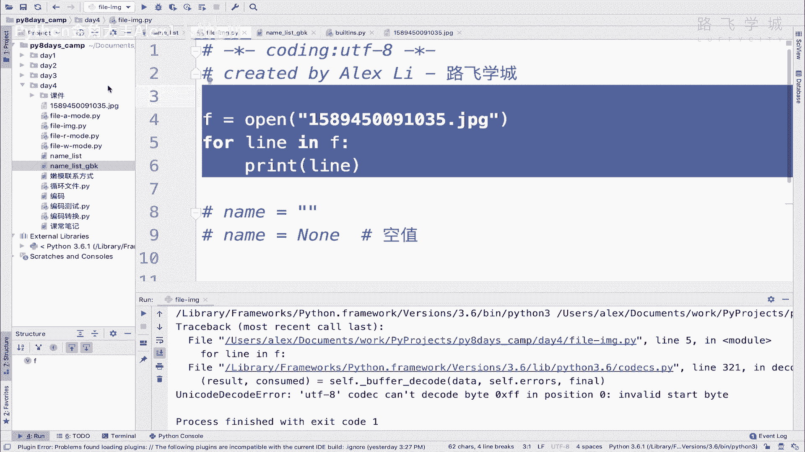
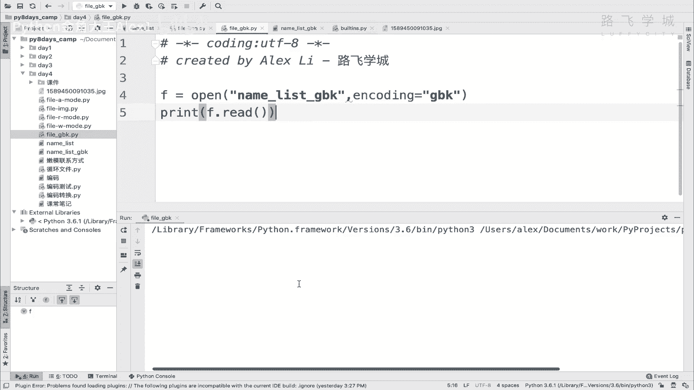
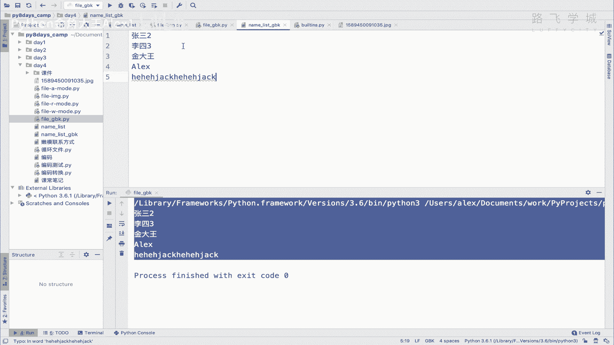
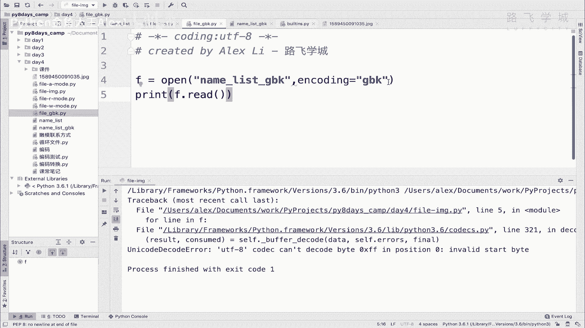
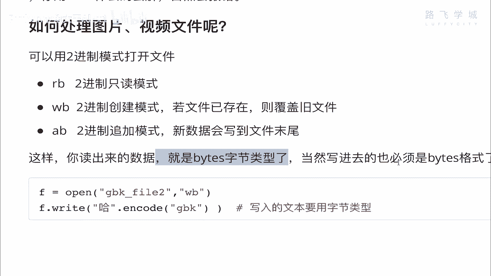

# 【2024年Python】8小时学会Excel数据分析、挖掘、清洗、可视化从入门到项目实战（完整版）学会可做项目 - P48：07 2进制模式操作文件 - Python金角大王Alex1 - BV1gE421V7HF

OK同学们，这个小节呢我们来学啊，用二进制模式去操作这个文件。

那嗯咱们之前呢都是学的这个操作文本。

是不是啊操作类似这样的一个文本，在这里面增删改查，但是还有图片呀，还有视频呀，音频啊这些东西你怎么去弄是吧，那我们用一个呃用Python来去操作一个图片，咱们看看会是一个什么效果好吧。

我们直接就去创建啊啊file file，然后image吧，image啊，这个嗯image，然后呢我在这里直接open，我这里有一张图片，看到没有，我这有一张图片来，这个是我录课的一个一个屏保。

然后我呢把它respect remain copy过来，咱们就操作这个图片，那我一只读模式打开，我就for line in这个F对吧，但我们知道它不是一个文本文件，所以它没有办法，它不应该是一个。

比如说一行一行怎么怎么样对吧，打印它只是它是一张完整的图片，但是这张图片在命令行上他肯定是打印不出来，它这对吧，它它不能是一个啊，呃这种说给你展现出把一张图给你打印出来。

不会它底层还是二进制的这种东西对吧，底层还是0101给他堆积起回来了，那我们这样直接循环打印的话，咱们看会打印出一个什么效果好吧，哎直接执行，大家来看哎直接就报错了啊，报什么错呢。

大家来认真看一下，报了一个错啊，这个错是说unit code decode error，说UTF8不能decode，这个什么什么什么什么哎，什么意思，怎么出现UTM8的问题了呢，咱们这不是一个图片吗。

注意了，咱们UTI8只是涉及到文本这些东西，对不对，这，这这这个这个是图片跟UTIL8有什么关系啊。

图片跟UTL8有什么关系，哎这个地方要讲一个新知识，大家点击这个open这个里面啊，看到这里是不是有一个叫encoding这个东西，对不对，encoding这个地方呢默认是一个none啊，None。

我在这里顺便讲一下，我记得我好像落掉给大家讲了，这个none是个什么东西，none其实就是代表什么也没有啊，啊它就代表什么也没有，那为什么要有这个东西，就是因为你比如说你设置一个变量。

比如说你初始化一个变量，叫说初始化就变成叫name，好吧，这个name呢你现在说你刚初始化的时候，现在说你没有值，因为你现在不知道要叫什么，因为后你的程序后面会给他补上值。

比如说在程序运行个一会儿的时候呢，会给它赋一个值，但是现在没有值对吧，你可能根据用户的指令给这个name赋个值，明白这意思吗，所以你刚开始初始化的时候，就是创建这个name变量的时候，它没有值，没有值。

那怎么办，你直接这样，他会报错的，它不符合语法，所以你能做的两件事，第一个呢是把它变成一个空是吧，这这种啊这种相当于就是一个空字符串，什么也没有吧，这是一种方式，还有一种方式呢是直接给它设置成一个NN。

明白吧，NN就是说代表这是一个空值，明白吧，它就是一个空值，好这种方式不建议的这种方式写的比较野生啊，虽然可以，但是不建议这么写，一般你要没有，你不知道赋什么值的话，就是赋值一个NN，明白吗。

这是专业的写法，OK所以这是N那好咱们在这里看它这个是none，none是什么意思，默认就是空，也就是未指定任何的，这个叫编码，未指定任何编码，也就是说如果你是none的话啊。

那咱们这个呃就先说这个encoding是干嘛的，encoding是告诉你的解释器，告诉你的解释器，我要打开的这个文件以什么，它我要打开这个文件是什么编码的，明白这意思吧，告诉你的解释器啊。

你这个文件是什么编码的，明白意思吧，好也就是说如果你在这里什么也没写，默认就是UTF8，默认就是你操这个解释器的，这个这个默认编码呃，在这里啊写上啊，encoding对吧，这个等于一个NN，对不对。

是什么呢，告诉你的，告诉你你的解释器啊，这个当前要打开的这个文件是什么编码对吧，它就可以用什么编码来解释，如果是none对吧，则用解释器默认编码对吧，解释器默认编码就是UTF8啊。

你不说解释器有默认编码，Unico，那是在内存里啊，在文件里默认编码是UK8好吗，所以呢也就是说我没指定，前面咱们操作文件的时候没有指定UENCODING，所以它默认都是用的这个叫什么呀。

用的是这个UTF8的这个格式，明白这意思吧，那如果那那就要求你这个文本啊，你这个文本必须是一个UTL8的一个格式，比如说你看我这个name list，它下面是一个UTL8，对不对。

但是如果你把这个文本改成一个GBK，那可就完了，你改成一个GBK的话，它直接啊打印就会怎么讲，就是嗯嗯嗯就是你你用文本模式，文本格式打开这个文件，但是这个文件是GBK的个文件。

然后呢你这里又不指定这个东西的话，那它就会报错啊，他又报错了啊，咱们可以来给大家试一下啊，因为因为你解释器用UTL8来解释这个文本，但文本是JBK的，它就会报错好吗，我们可以来试一下啊。

啊我在这里就直接copy一下这个name list吧，name list gbk格式给他改成GBK格式啊，好这个时候这个name list出来了，然后呢他是UTL8，我给他改掉，改成GBK。

全都给它改成GBK，那好这里面就是JPK编码了，JPK编码之后，咱们再来去打开一下这个文件啊。

打开一下这个文件呃，我在这里吧，先不要操作这个图片了，我先把这个图片给它注释掉啊。

那嗯这样吧，那就这样就在这写吧啊，while有GBK行吧，这个时候我直接open，然后呢你这个name list，然后JBK是吧，那这个时候我什么也没指定，所以它默认编码就是UTL8。

我直接print f点read，你看会出现一个什么效果执行，他是不是就报错了，报什么错，也是UNICODE，还是刚才那个错，UNICODEUTF8不能去解码这个什么什么什么，对吧啊，解码不了。

你这个JBK的文件，因为它是一个对吧，这个编码不相符嘛，所以在这种情况下，哎你就当你要去处理GBK格式的文件时候，你必须要明确的指定，明确的指定什么呢，encoding了，说告诉解释器。

我这个文件是GBK格式的，所以你用GBK来去读我这个文件，读我这个name list文件内容OK吗，所以你这样再一执行。

大家看是不是就不会报错了，所以这个是什么呀，呃呃叫encoding的作用，告诉解释器啊，这个文件是什么编码的好吗，OK那同学们这个再回到咱们这个地方。

回到这个地方啊，再还依然执行一遍，说现在你看我们知道这个报错是什么原因了，对不对，报错什么原因了，那好多同学说，那我就在这里给它指定编码呗，对不对，给他指定一个什么编码，那好good question。

指定什么编码，你的你现在是一个JPG的图片文件诶，它可不是一个文本，说可以用GBK呀，UT8UNICODE这些东西，它是一个图片文件，它就有自己专属的这种编码结构编码OK吗，视频编码呀，图片编码呀。

音频编码呀这些东西它不是文本格式的，明白吗，所以呢你在这指定啥呀，你没法指定，你怎么指定它都打印不出一张图片来，这张图片是这样显示的，你不能说，因为它是一个命，现在是命令行。

相当于你你打印的都是这种不是一个图片格式，而是这种对吧，这个这个这个文就是你打印的都是文本格式，所以你你你指定什么编码都不管用，明白这意思吗，所以这种情况就问题就来了啊，你说我不指定呢，他就报错。

指定呢也不知道指定什么，那可怎么办，怎么去操作这种图片的文件啊，那好这里就是咱们要学的二进制模式，那二进制模式简而言之就是说，首先说这张图片底层是不是0101对吧，任何东西底层都是0101。

所以呢既然底层是0101，那好我也不我也不纠结你是什么编码了，我就直接以二进制的模式打开，明白这意思吗，以二进制的模式打开，你也就不报错了，明白这意思吗，所以怎么以二进制的模式打开呢。

怎么以二进制模式打开呢，啊在这里看到没有，跟跟咱们这个文本模式差不多，只不过后面加了个BRBWBAB就是二进制，只读二进制，创建二进制追加，明白这意思吧，这样你你加上这个之后，注意了。

你读出来的数据就是bytes字节类型，就是二进制的字节类型对吧，然后写进去的也必须是BT，明白这意思吗。

所以呢我们在这里就不要再加什么encoding了啊，哎sorry在这里在呃，在这里不要加什么encoding了，你你就直接把这个打写的模式对吧，给它改成一个RB就可以了，你改成一个RB然后再去执行的话。

大家看看到没有，这就是二进制的字节类型了对吧，咱们说咱们已经解释了啊，这是为什么它不是0101，而是显示的16进制的格式，是不是啊，哎这就是字节类型，看前面是不是已经加了一个B了，对这就是字节类型。

那好这就是图片，这张图片里边的这种二进制的东西啊对吧，二进制的东西，那好同学们到此为止啊，咱们就明白了，以后你去处理什么二进制的文件什么的，你就可以用这种对吧，RB模式对吧，去打开它，那打开我们学会了。

那如果去写呢，往那边写东西呢，往里边写东西，同志们啊，这个这个这个往里边写东西啊，这是WB是不是啊，二进制写，哈二进制写对吧，以后你比如说你自己生成一个图片，生成一用Python代码生成一张图片写。

存下来的话就是有WB肯定是啊，那我们可以来试一下，用写的模式的话啊，呃open一个open一个这个wb file吧好吗，然后这里写一个WB，同志们，那咱们现在没有学过怎么去做啊。

怎么去怎么去写这种生成二进制的，这种说是零二进制文件对吧，但是我们学过了说什么呀，咱们看这里你这个什么呀，你读出来的是by词类型，你写进去的也必须是BTS类型，哎我们是不是学过说啊。

可以把编码就是那个那个什么呀，就是把那个呃文本给它编码之后，他是不是变成一个BT类型啊，记得吧对吧，把文本编码之后变成一个BT类型好，那这个BS类型其实就是二进制类型，二进制的格式我们可以干嘛呢啊。

把一个文本变成二进制，就是by斯类型，然后尝试写进去，明白这意思吗，可以的啊，我们试一下，我们这里有一个字符串就叫路飞，行不行啊，然后我们把它干嘛呀，直接F点write s点encode对吧。

S点encode是不是就把它变成一个UTF8了，对不对，或者变成一个GBK吧，行不行，变成一个GBK，然后这个时候我们去尝试去写它，可不可以啊，尝试去写它，那来试一下已执行，大家看并没有报错，是不是啊。

并没有报错，然后我们打开一下wb file看一下，哎，大家看到什么问题了吗，你看这个地方是一个乱码的结构，乱码的结构为什么，因为我在这里写进去的是一个GBK的啊，GBK编码的东西，但是我这个解释器。

默认它都尝试用UTI8来去解释它，所以呢它会它会乱码，它会乱码，明白这意思吗，啊他就看不了，看不了，但是你读进来是没问题的啊，你读进来，你比如说你现在是不是它是一个叫什么呀，啊叫叫这样吧。

我一会再试读吧，我再给你试一下，写一个写一个UTF8的这种啊，这个这个加密的啊，不是加密的，就是就是给它给它变成二进制格式的，写成UTL8ETF八杠八，看到没有，我给他啊，相当于这么一编码。

它不就变成一个字节类型了吗，是不是啊啊变成一个字节类，我这样吧，我先给大家打印一下好吧，估计大家又忘了，对不对，是不是一个字节类型啊，是不是一个字节类型啊，然后我就写进去了，写进去之后。

同志们再来看这个wb file，看诶有同学说这没有错呀，它它这不是文本格式吗，你没你在这里显示的不是这个二进制啊，同志们啊，同志们，你在这里只是以二进制的模式去写这个文件，把文件写进去了。

但是文件写进去了之后，它你编码之后，它还是一个文本，对不对，它还是一个文本，虽然你是以字节形式写的，然后打开之后对吧，你正常文本模式打开，那人家当然就正能正常看了，只不过你写的时候是以二进制的模式写的。

能理解这意思吗，OK好那到此为止，我们就知道二进制，读读这种特殊的文件和二进制和二进制模式，你要想写一个文件，写个文件的话，你必须得注意了啊，你必须得进行这样的编码，你说我不这样编码。

我直接写一个什么呀，我直接在这里写文本行不行呢，看着啊，right写一个叫什么呀，路飞看着啊，注意了，同志们，这个就会出问题了，你写的是文本，但要求人家是要求只能写二进制，看着是不是报错了，说什么呢。

A bytes like，也就是说一个bytes类型的对象啊，是需要的，不是一个STR，你就只能写BS类型，不能写STR，所以你当写了WB之后，你这里只能要编码，你把文本直接写进去，就是写写不进去了。

只能往里边写BS类型好吗，哎这个给大家讲了哈，讲完这个之后啊，你自己可以试一下，去读一张图片，读一张视频，对不对，读一个呃，读一个视频，然后呢用这种二进制的格式好不好。

