# 【2024年Python】8小时学会Excel数据分析、挖掘、清洗、可视化从入门到项目实战（完整版）学会可做项目 - P57：02 函数特性&语法定义 - Python金角大王Alex1 - BV1gE421V7HF

OK这一小节咱们讲语法定义和它的特性，函数的语法定义和特性啊。

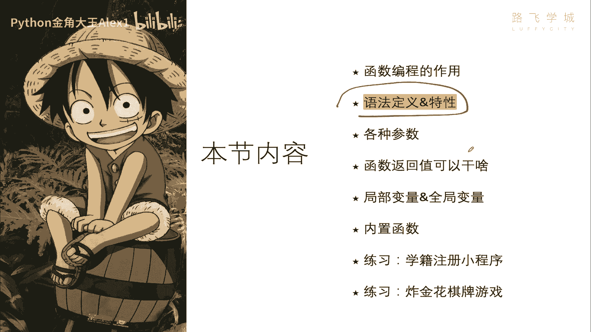

好那函数的定义，函数到底是个什么东西啊，啊首先函数这一词来源于数学，我记得我们应该小学一小学五年级就学了吧，还是初中一年级我忘记了，但在编程中的这个函数概念，它跟数学中这个函数还是有不一样的地方的。

具体的区别我们以后再讲，但是咱们先了解函数中的这个编程，就是编程语言里的这个函数是干嘛的啊，编程中的这个函数在英文中它有不同的叫法啊，在这个什么basic语言，它叫啊sorting，子过程叫子程序。

C语言中叫function，java里面叫method的方法啊，在Python里面它也叫function，叫function啊，Python里面叫function，那到底是什么呢。

哎定义这是这是编程里的函数定义啊，是指将一组语句的集合看看一组语句的集合，通过一个名字，函数名，也就是给它封装起来，封装就是给它包起来啊，跟包装纸一样包起来，如果你想执行这个函数。

只需要调用其他其函数名就可以了。

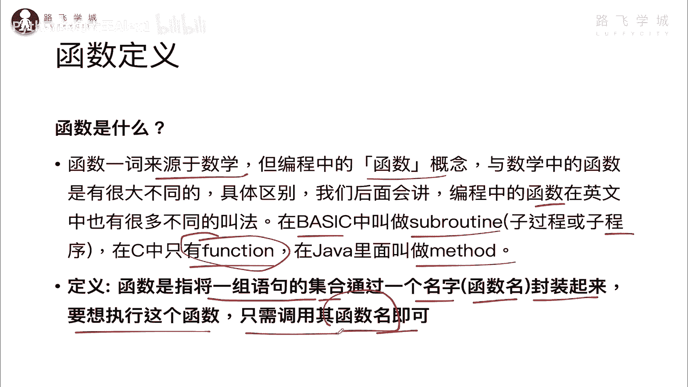

想象一下我们上节课讲的这个讲的这个例子，对不对，是不是把一组语句啊给它干嘛呢，通过一个函数名给它包装起来以后，再想用的时候直接通过函数名来调用，是不是就可以了。

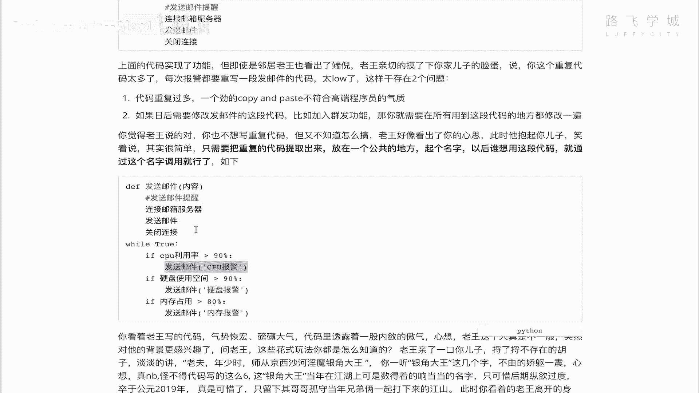

这个东西啊就叫函数好吗，那它的作用到底是干嘛呢。

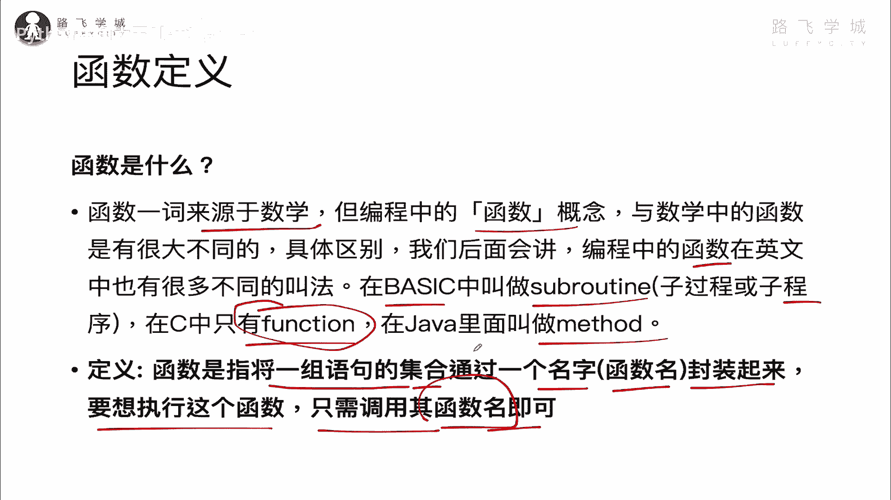

它的就是它有什么特性呢，起到什么作用呢，刚才第一小节已经强调了减少重复代码，这是它最重要的一个功能，另外一个是使你的程序变得可扩展，使程序变得可扩展，这个是什么意思呢啊那大家想一想。

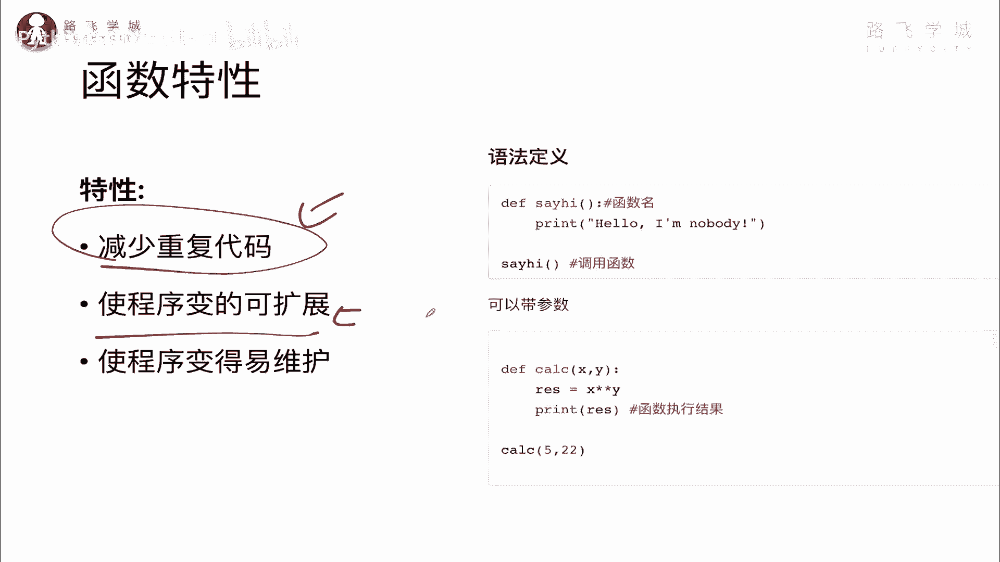

上一小节我们在讲这个发邮件是吧，我需求改成了群发，直接给这个什么呀。

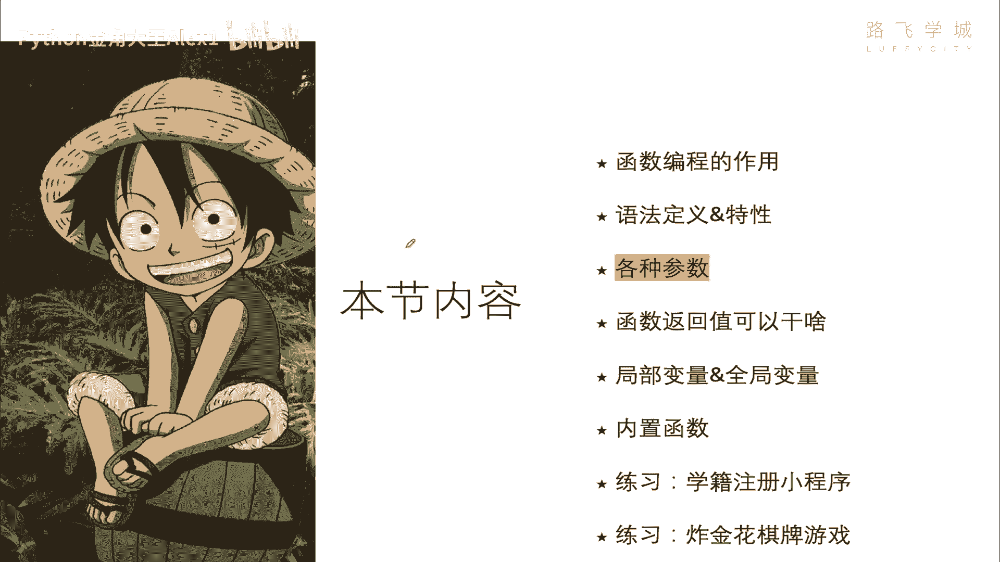

给这个每次发邮件发给十个人，那你是不是要改好几十次，好几十个地方的代码呀对吧，所以呢你并且再加一些其他功能的话，那你这个如果没有函数的话，那你得也得反正改很多，每个地方都改。

所以他就导致你这个程序扩展性很差，明白吗，扩展性很差以后你写的代码多了，你会更有感觉啊，那第三点就是什么呢，是程序编的易维护也是差不多的。

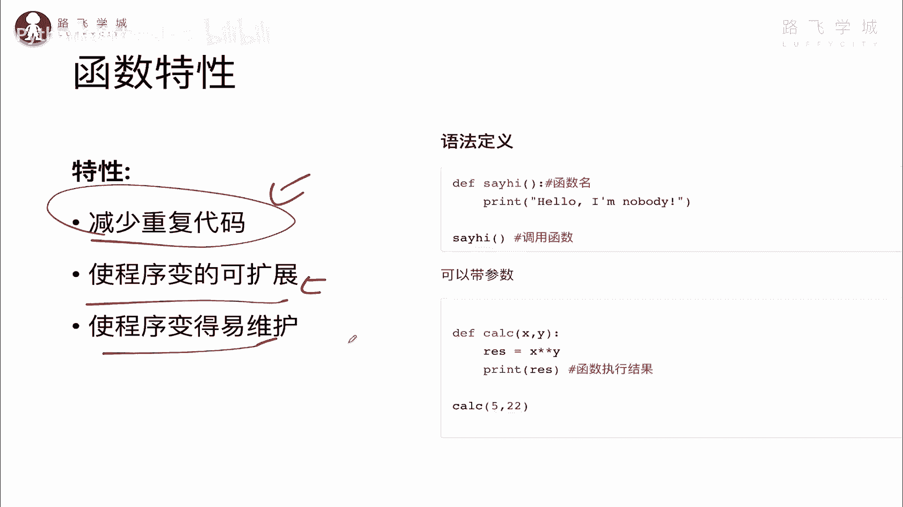

道理对吧，你这个呃你你你就像我们这个地方。

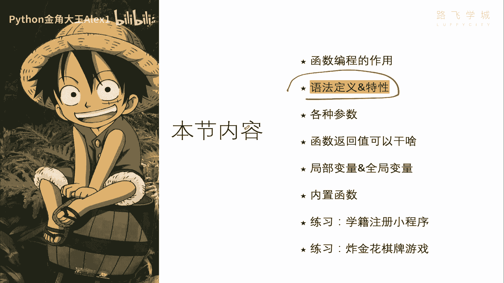

对不对，你要改30处，但是如果你有了函数，你只需要改什么呀，只需要改一处地方，这三个地方就都跟着生效，明白吧，你只要在这里加一个群发，三个地方都生效了。

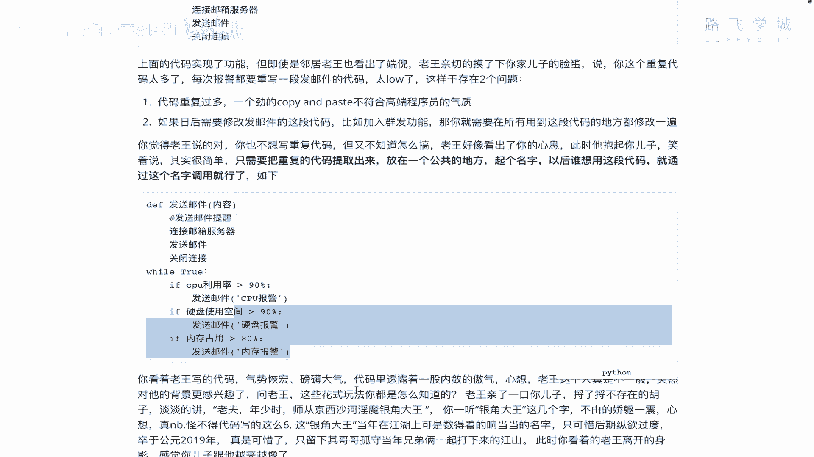

OK所以呢这个就是它的几大特点啊。

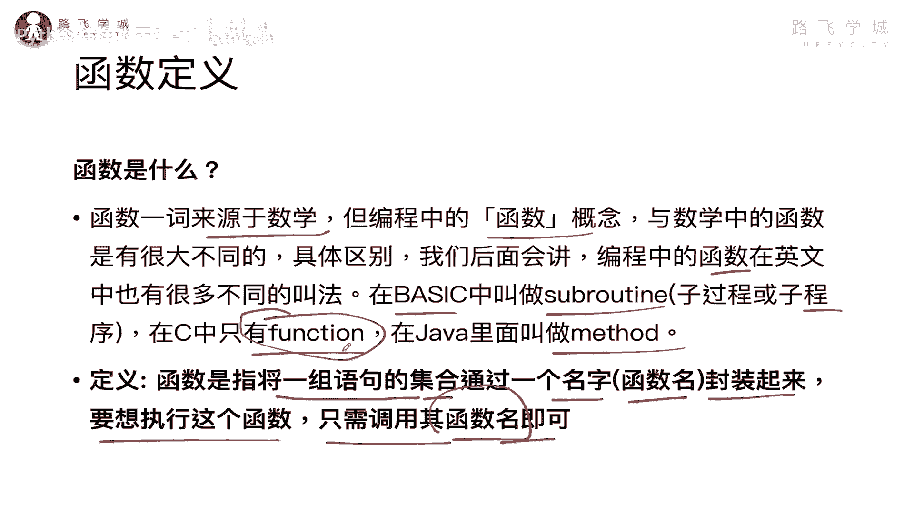

几大特点好吧，然后接下来看一下函数的这个定义的，函数语法的定义，DEF它的全名叫define对吧，我不用写了，这些你看不明白啊，这个这个这个连体define是定义的意思，然后呢这个地方是函数名。

后面的括号是这个标准写法，也就是说你后面如果还这个函数名，后面这个括号里面是可以跟参数的啊，可以跟参数的，就像这个我在咱们在这里对吧，你这里这里是要发邮件发的内容，你这个内容每次调用的时候不一样。

所以你把它当做一个参数传进来，对吧，CPU报警，硬盘报警，内存报警，所以这个啊括号也可以不写啊，不写就是空着的，没有参数里面就是你要执行的语句，可以执行很多很多个，没关系啊，你想调用的时候注意了。

就写函数名，加上括号就可以了，有参数就写参数，没参数就算拉倒，那你也可以写带参数的，对不对啊，他N个参数，所有参加很多参数没关系，里边就可以进行各种操作，对吧啊，对这个参数进行操作。

然后可以打印反whatever，什么操作都可以执行的时候调用，你要把参数数你这里规定了几个参数，这里就要写几个参数，明白吗，那好我们就在这里啊。

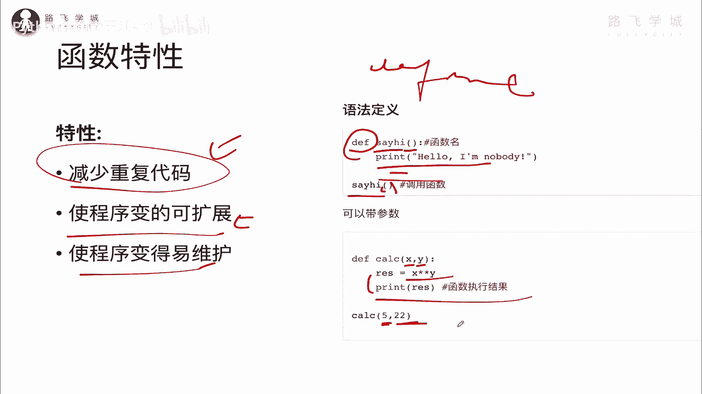

自己用语法来定义一下，定一个最简单的这个函数好不好啊，还好诶，OK我们定义一个啊。

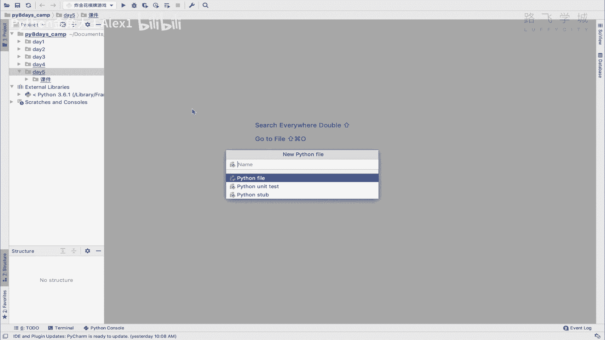

就定一个say hi，定一个OK啊，say hi的一个函数，我们呢首先要它的全它的英文名字，就是这个这个全全拼就是define定义嘛，但是它是简写的，然后say hi对吧，里面可以写你的参数。

你可以写name对吧，然后和age多个参数都可以啊，不写也行，然后你就可以print啊，这个啊，hello对吧，my name is对吧，Name，然后i am多少哦，看到没有。

你这样你的一个函数就可以了，当然你可以写多行代码，对不对，你可以写别的啊，这个无所谓，写多行代码，然后一回车就OK了，这个比较正常缩进的啊，你这个时候函数执行完了之后，你把函数写完之后。

如果你它只是定义好了，就像变量定义完了之后，它只是在内存里有了，你想让它执行，你必须调用，不调用它不会执行，你看没有任何反应对吧，所以你想让它执行，你必须要调用它say hi。

然后你直接不输参数呢也不行，看到没有，你这里定义好了参数，所以呢你必须写ALEX是吧，然后多少岁，然后执行，看到没有，哎，这样的话你的一个函数就写完了，简单吗啊你这里面写N多行代码都没关系。

写多行代码都没关系，好大家这个这个这个也也试一下吧，好快速试一下它的定义语法。

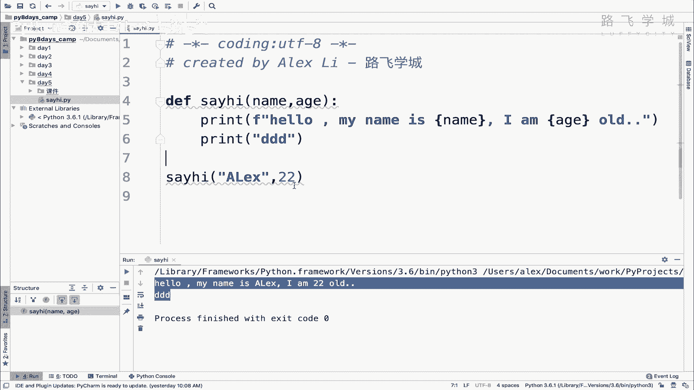

接下来下一节我们讲它的各种参数。