# 【2024年Python】8小时学会Excel数据分析、挖掘、清洗、可视化从入门到项目实战（完整版）学会可做项目 - P76：09 excel文件处理 - Python金角大王Alex1 - BV1gE421V7HF

OK同学们，这一小节我们学一个有趣的就是用Python操作excel，那为什么有趣的，因为我们之前这个学的Python操作文件，只是说操作一些文本文件，对不对，但是excel这个东西它是微软开发的。

它不是一个文本文件，它是个excel专门一个格式的，明白吗，那你直接用什么Python文件打开excel，它里面就乱了对吧，所以你必须要用专门的模块啊去操作excel啊。

这个这个这个就就就就去进行增删改查啊。

那怎么操作呢，咱们怎么怎么学呢，唉有一个模块叫open py excel啊，这个模块这个是一个第三方模块，需要你单独安装的哈啊一会告诉你怎么安装，那你需要咱们要学的是怎么去打开，怎么去增删改查。

怎么去带对里面数据进行遍历啊，修改单元格的样式啊，当然还有很多非常丰富的功能啊，就比如说进行什么公式运算什么，咱就不学了，把常用的先学会就可以了，好那这个咱们就来先把它安装上。

好不好，安装上，我这边呢其实是已经啊已经是给他安装上了。

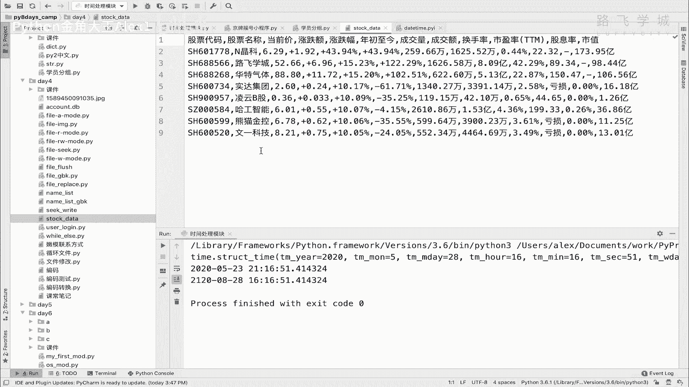

你怎么装呢啊你怎么装呢，其实很简单啊，直接你就用这个PYTHM装就行了，点开到这个到这个啊这个地方，然后啊选解释器这个地方，然后呢选择安装，是不是啊，咱其实我在这个选择装第三方啊。

直接在这里搜open diy excel好吗，你直接这样一点击install就可以了啊，我这是装过了，所以他就没问题，OK装完了之后。

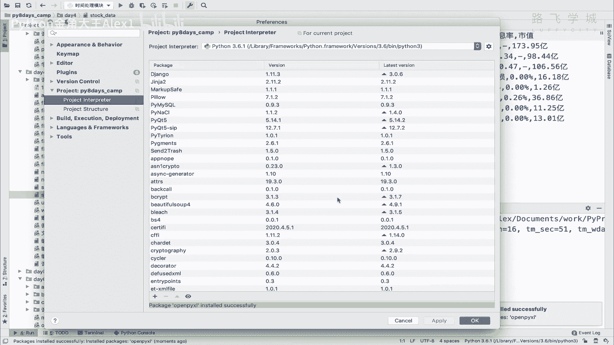

同志们，你咱们就开始了我们的这个操作excel的历程好吗，操作excel的历程打开，然后我在这里操作一个excel嗯，好的好的好的好好好好。

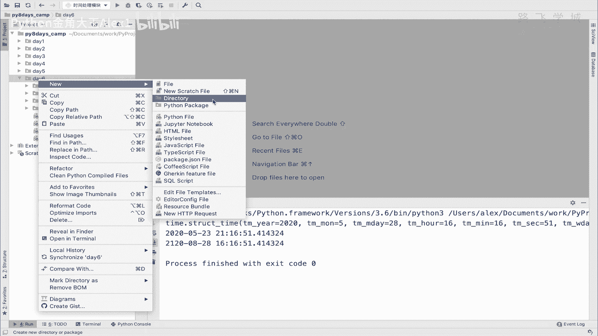

Excel。

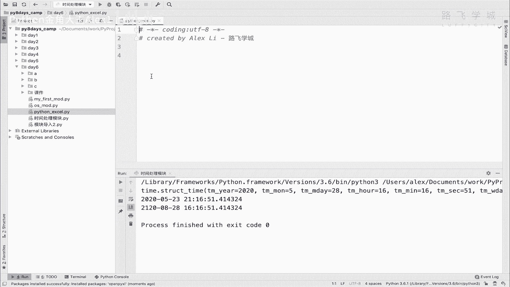

然后呢我们来先学哪些呢，我在这里直接有那个什么什么什么。

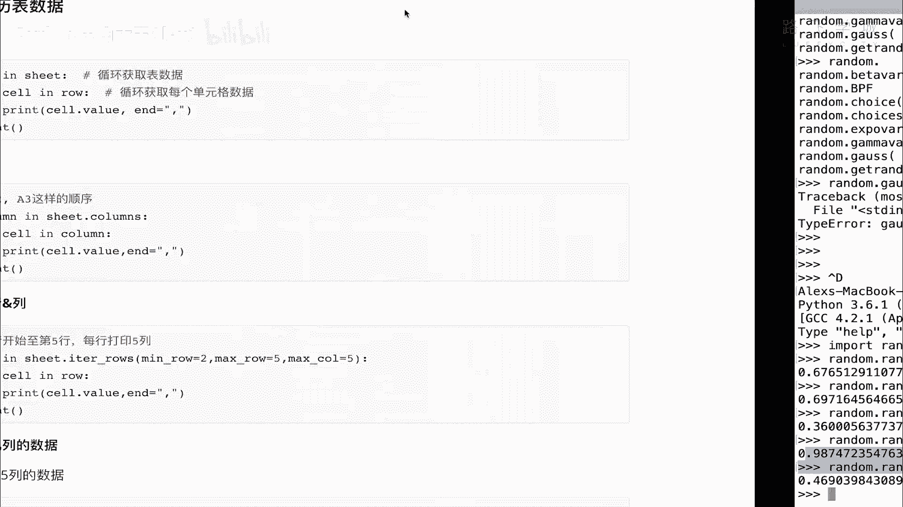

移到这来吧，O大家看我在这已经列好了，咱们先来一点点学啊，一点学，先看怎么去创建一个文安装啊，命令行安装就这样啊，怎么去创建一个文件。

直接是form o open py excel里面import这个workbook，这个workbook其实就相当于打开了一个excel，明白打开了一个excel，只不过现在是打开你内存里的一会。

你要保存起来就行了啊，打开内存了之后，你给他存个名，相当于括号加起来，他说是实例化，这个是实例化，什么意思呢，就是说啊怎么讲，就相当于是创建了一个excel，明白吗。

你就理解是创建了一个excel这个啊，只不过打开在内存里了，然后呢你给它附个名字，接下来你就可以什么呢，excel大家知道它这个这个是什么呀，叫叫叫WB点active是什么意思呢。

咱们看一下我们一个正常的excel啊，好那我来咱们来创建一个excel啊，创建一个excel，我们test一下来打开，随便打开一个文件吧啊对在这创建一个吧好吧。

然后呢大家看一下这下面是不是有一个sheet啊，也就是说一个excel，你打开是不是你可以添加很多个呀，对不对，那这个WD点active啊。

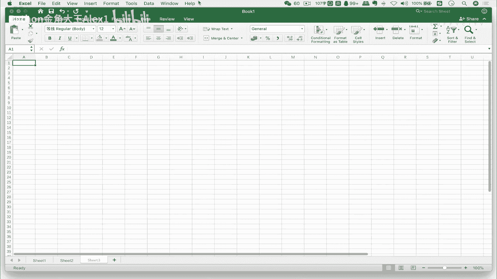

啥意思啊，WD点B点active。

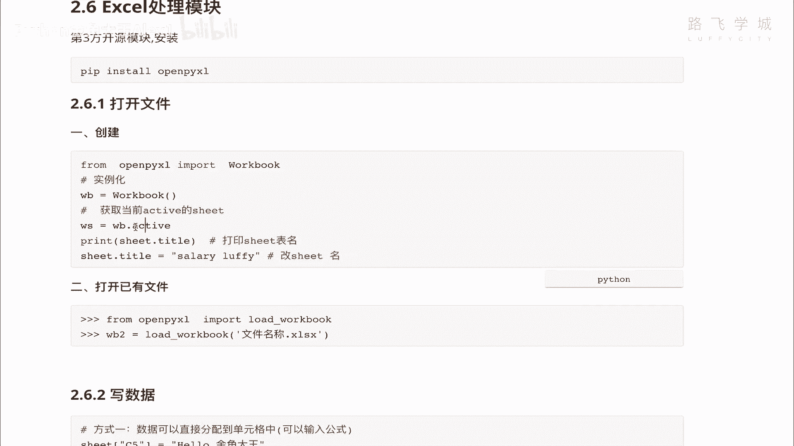

其实就是获取当前你现在是在哪个sheet下啊，哪个sheet下这个叫sheet嘛对吧，在哪个是你比如说是在这个，它就是能获取到对吧。

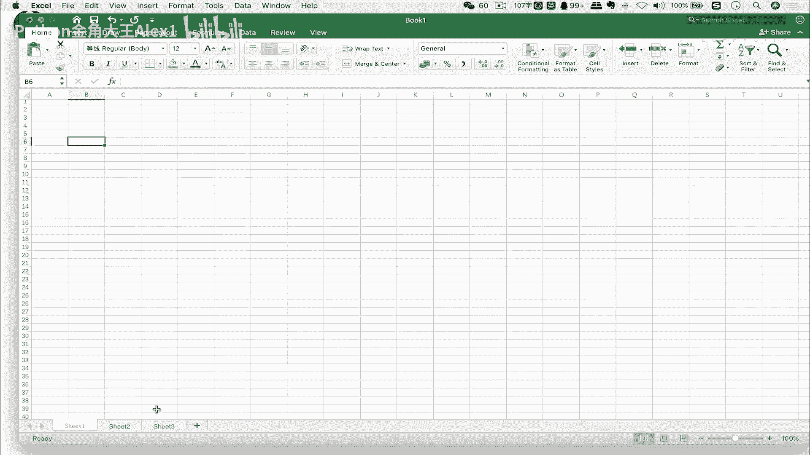

是当前是在这个地方能获得这个，然后呢啊还可以改这个名字，打印这个sheet名对吧，嗯然后还可以改它，看到没有啊，改这就是创建一个创建完了之后，你往里边还可以存东西啊，存东西咱们先创建好吧，好不好。

我就直接嗯from这个把open excel import一个叫workbook，看到没有那个workbook，那现在呢我就先在内存里创建这么一个啊，打开相当于在内存打开那个excel文件好吗。

就是WB吧，叫做啊workbook，看到没有book就行了啊，就创建了一个create an excel file in啊，这个REM内存力是不是啊，那接下来我们干嘛呢。

就获取到它当前的这个活跃的这个什么呀。

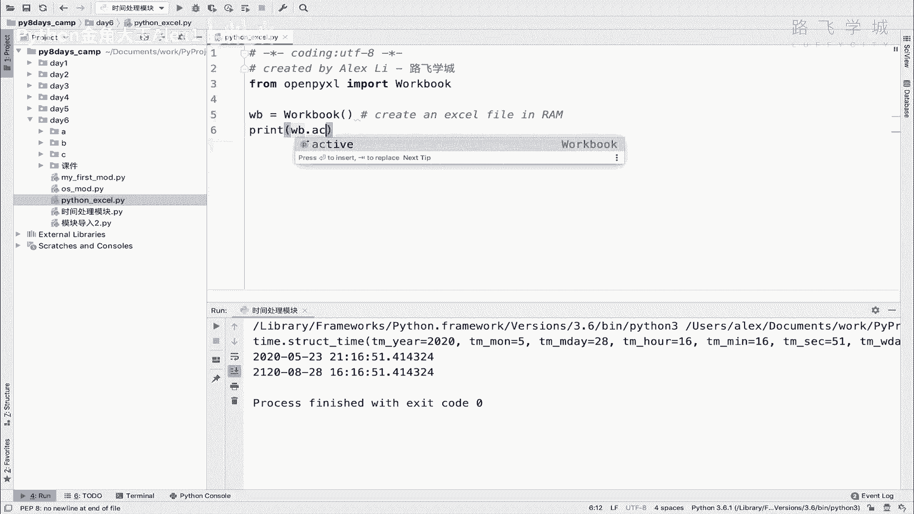

活跃的这个这个这个这个sheet就是对吧，Sorry。

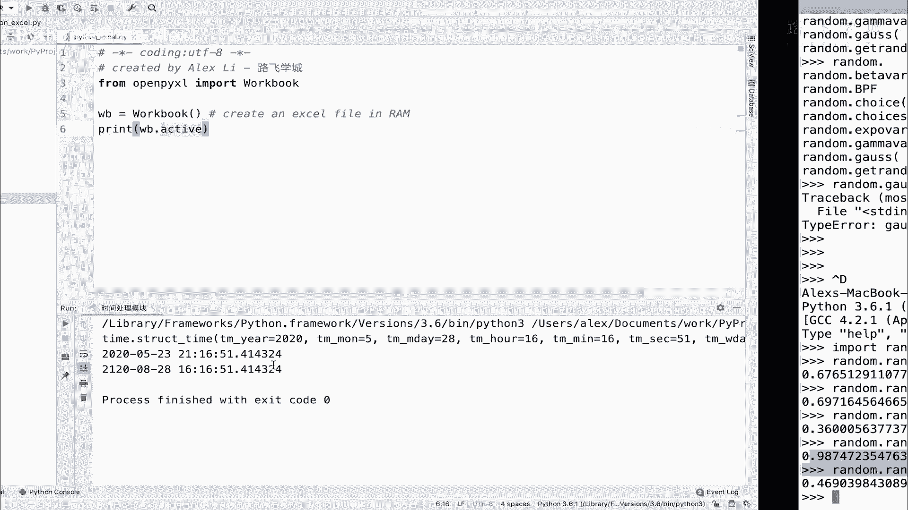

刚才这个嘛是吧，你你默认它应该是就是你刚创建一个新的。

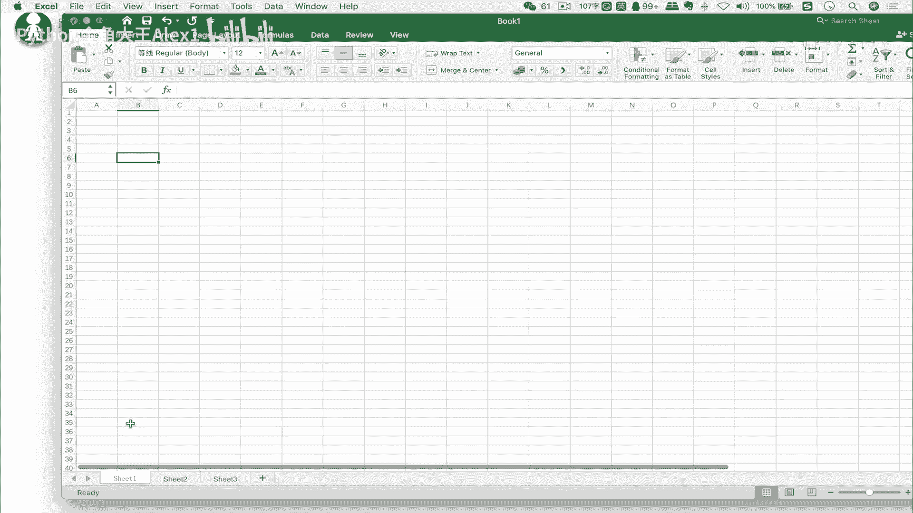

它活跃的应该是在活跃的，就是第一个页面嘛对吧，第一个excel表页面，然后咱们打印看一下，大家大家看啊，他直接就把这个活跃的这个这个，这个这个sheet的这个这个对象啊，给它打印出来了。

然后呢你就可以你就可以往，其实你就你拿到这个活跃的之后，你就可以存那个名字叫sheet对吧，然后一会你就可以往里面存东西，你呢可以print sheet title啊，看到没有sheet title。

Sorry，然后呢他会给你打印对吧。

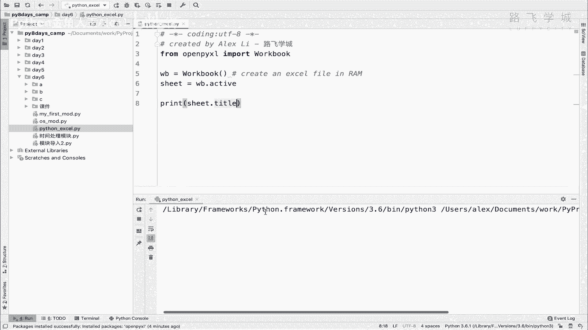

它就叫sheet嘛啊，因为默认刚创建一个的话，它就叫sheet or啊。

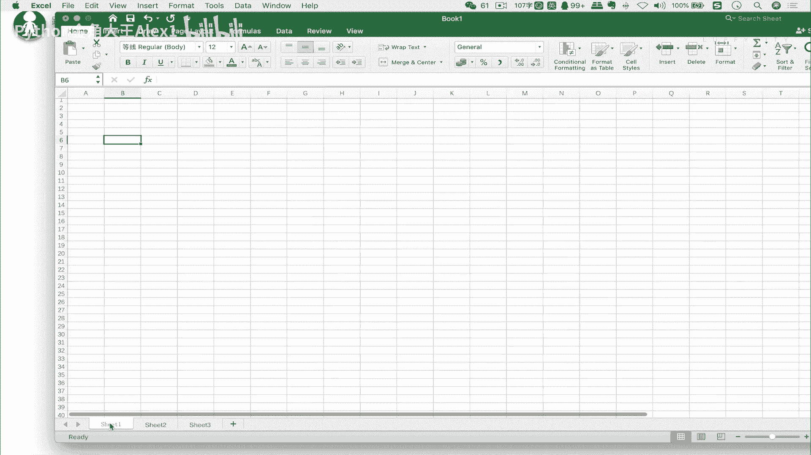

你这人家excel叫sheet1啊，你这个叫，没关系啊，我们可以给他改对吧，我们可以给它改，就直接是sheet，点这个title等一个，比如说嗯这个啊路，啊啊ALEX大王的啊，这个啊姑娘们对吧啊。

找了一个这样的一个列表，好啊，每天先写个牌子，然后你给他起了这个名字之后，接下来注意了，我们其实说白了他现在都是在内存也看不出来，我给它保存了之后，你就可以看出来了，我们可以把它存下来存下来。

存下来存下来保存一个表看呗，很简单，直接WB点save啊，写这个文件名就行了，你想存成什么样，咱们来看一下，直接是WB点save，看到没有，我就存成一个啊这个excel test sorry。

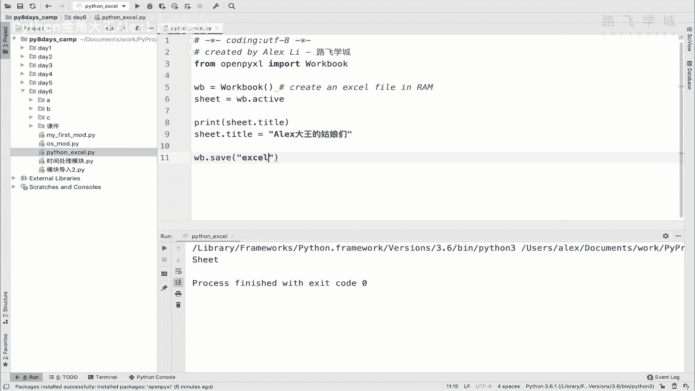

XLSX吧是吧，这个后缀名叫什么。

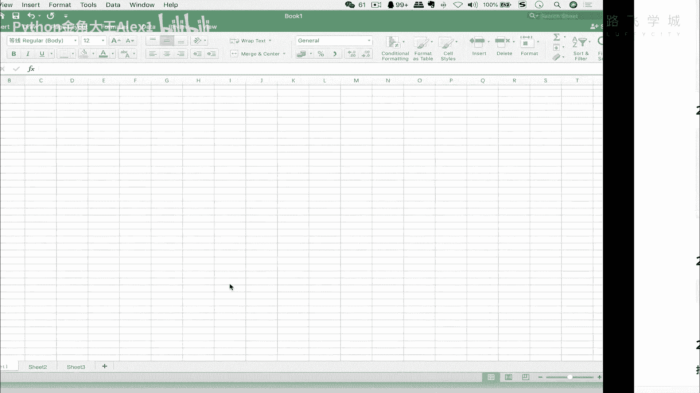

后缀名叫XLSX对，就这样，然后我们直接保存，看到没有，大家看是不是出来一个excel文件啊。

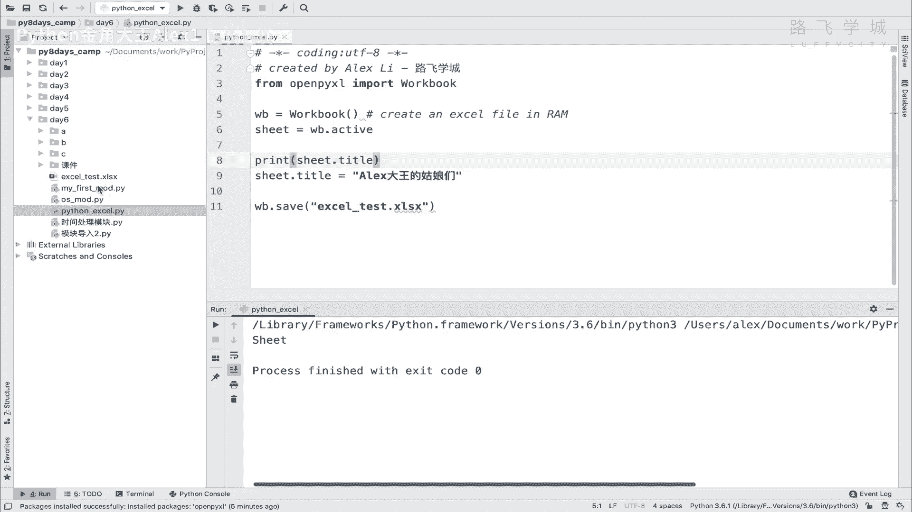

这个excel文件跟我们手动创建的可是一样的哦，啊大家看看到没有，是不是是不是是不是ALEX的姑娘们，就这个就已经创建好了，对不对，你接下来我们是不是就可以往里面写数据，或者是啊读数据了。

是不是写数据和读数据了啊。

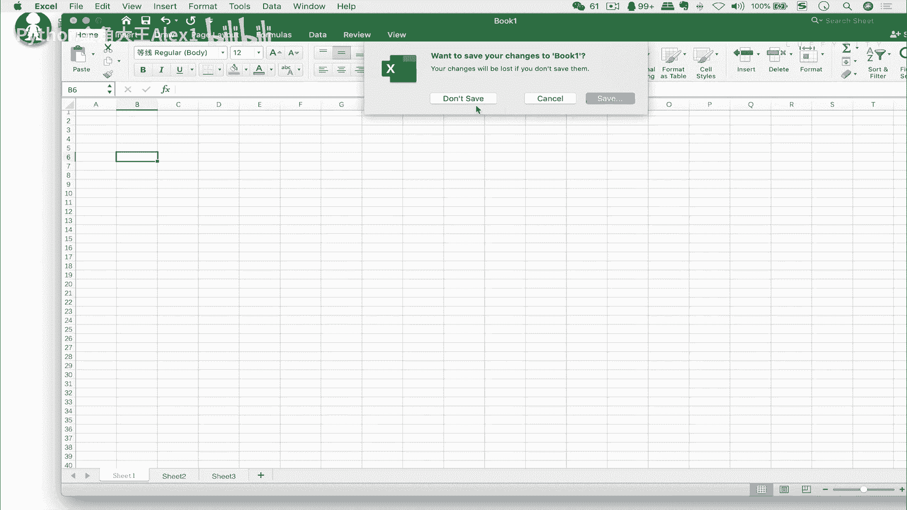

那我们依然哦我先把这个关掉，先关掉啊，然后呢我们来继续看，咱们接下来有什么知识知识啊，呃这是这是创建，我还可以打开一个已经存在的文件对吧，打开一个已经存在的文件也行啊，啊咱们一会儿打开已经存在了吧。

咱们先先依然是啊这个什么呀，现在依然是诶，或者我就直接我刚才是不是已经创建了一个，我就把我刚才创建的那个打开就行了好吧，就叫这叫什么呢，就叫load book，你说这个是创建啊。

这个是你加载一个已经存在的存在的，咱们嗯，Load workbook，相当于前面这些其实都是创建，那现在涉及到了干嘛呀，这个啊加载打开已经有文件了，是不是啊。

那我现在就是依然是WB等于一个load workbook，直接写你这个excel杠test点就可以了，下载完了之后，你可以在里面其实是什么呢啊，就是就是可以往里面啊去去写东西，也可以去读东西啊。

你可以把里面的东西读出来，但是我这里面没东西，没东西的话啊，对没东西，我们先别别别那个什么别加载了好吧，咱们一会儿那个啊，再再那个什么吧。

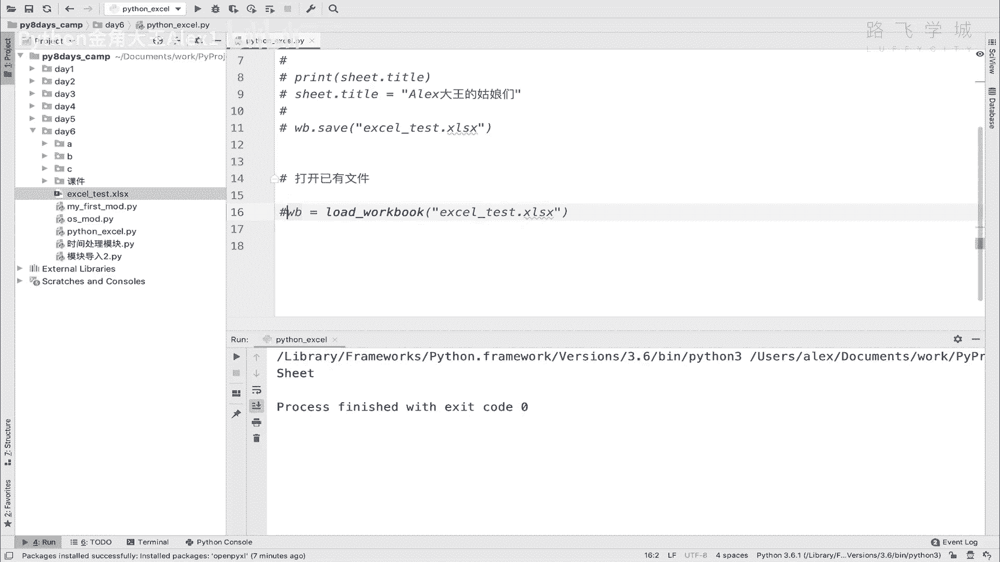

再再加载吧好吧，我们先还是操作这个吧，行不行，操作这个吧。

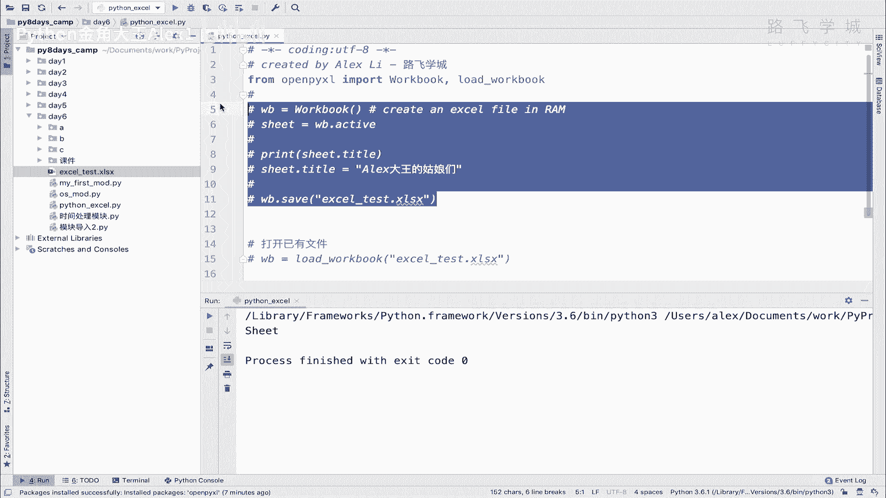

他们往里面写东西吧，那咱们往里面写什么呢，大家来看，你无非就是往里面，就是像咱们一个正常的一个文件一样啊，正常的一个文件一样，咱们就无非就是看着你写东西。

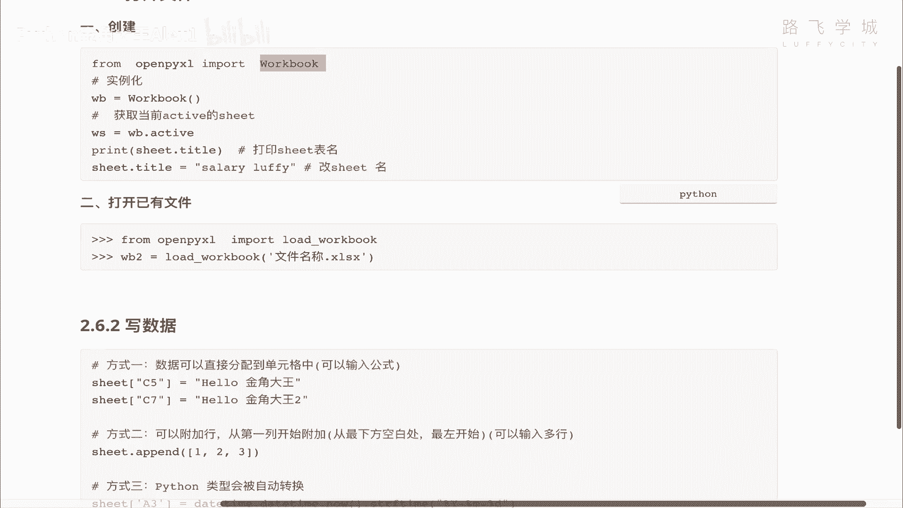

是不是就是按行按列去写啊，对不对啊，咱比如说写到这个地方，写到这个地方的话，那如果让Python来写，他怎么写呢，它其实就是什么呢，去找你是第，比如说案列第几列啊，这是第第二列是吧，然后呢第几行呢。

第八行二列，第八行就是B8B8就可以了。

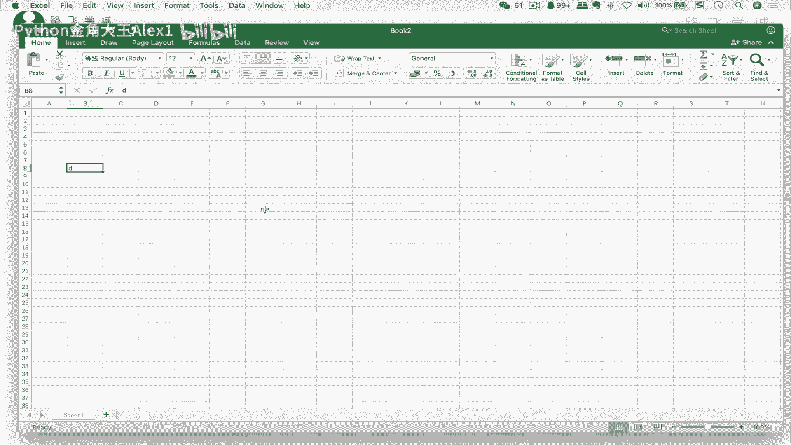

所以呢他写的时候很简单，你看直接这么写赋值就可以了，明白吗，那我们来写一个试试呃，先不要保存，直接在这里是sheet，注意了是sheet啊，你因为这个是整个excel文件。

这个是excel文件里面的一个表，然后打开这个表里面的往里面写，比如说B啊，这个B9吧，B9啊，就跟操作字典似的对，你可以把它想象成一个大字典啊，然后呢B9你在这里面写啊，ALEX的啊，大王的姑娘们。

那肯定第一个有一个黑姑娘，对不对，Black girl black girl，对不对，然后接下来我再写到一个B9，然后我往B9在在在C9对吧，再写他的身身高腰围体重是身高是171是吧，这个体重是啊。

这个50kg啊，就是48kg啊，老瘦了对吧，胸围是多少，83啊，那这个时候我就写了两条数据，写两条数据之后，同志们，你直接一保存看着啊。

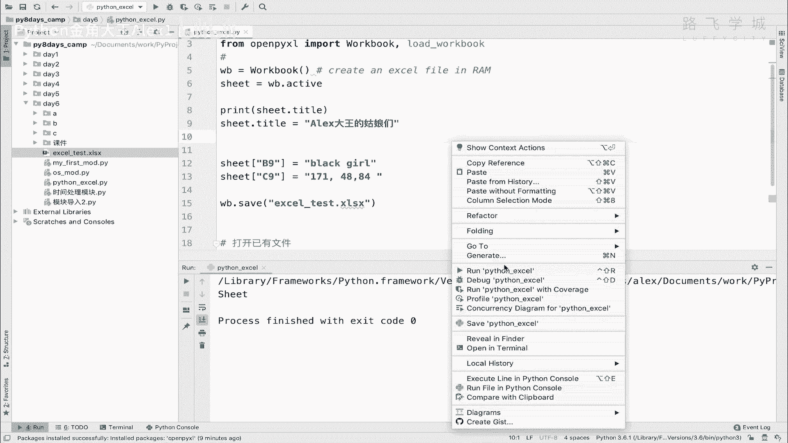

保存哎，对你保存，然后打开excel，大家来看一下，看到没有，是不是这两个数据就出来了，这两个数据就出来了。

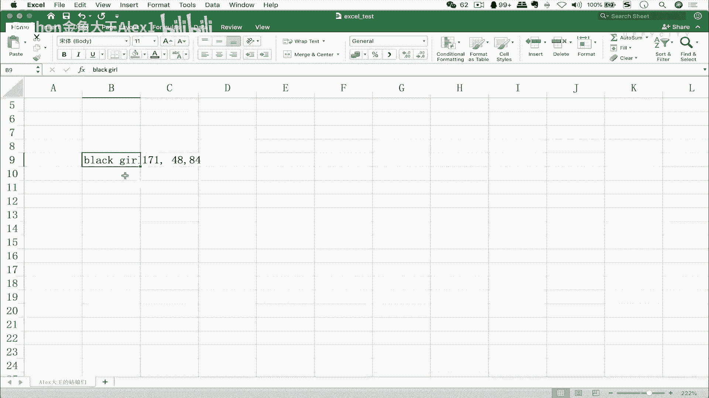

哎就是这么简单啊，就这么简单好，那我把这个写了这么个数据之后，还有什么其他的写法吗，还有什么其他想法是有的，咱们来看一下啊。

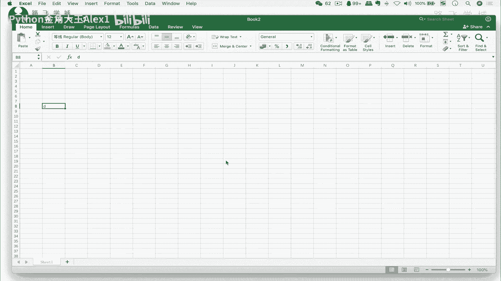

看一下你现在是一条条的写对吧，你还可以干嘛呢啊，直接给你给你什么呀，加那么加那么一行数据，比如说就按就是通过一个列表的形式去添加，然后这一个圆这一个值就是占一个单元格，一个值就是占一个单元格，明白吗。

但是它添加会添加到这个最下方的空白处，什么意思，也就是说你整个啊excel里面就是最下面那一行，最下面那一行啊，咱们来试一下，你就知道了，我在这里添加啊，直接在这里是啊，sheet点append对吧。

然后呢在这里面添一个列表啊，直接写新的一个姑娘，就是这个姑娘叫什么呢，叫啊叫RACHEL，然后她的身高她的身高是170啊，当体重十四十九公斤，看到没有，我一下子加了三个值，是不是啊。

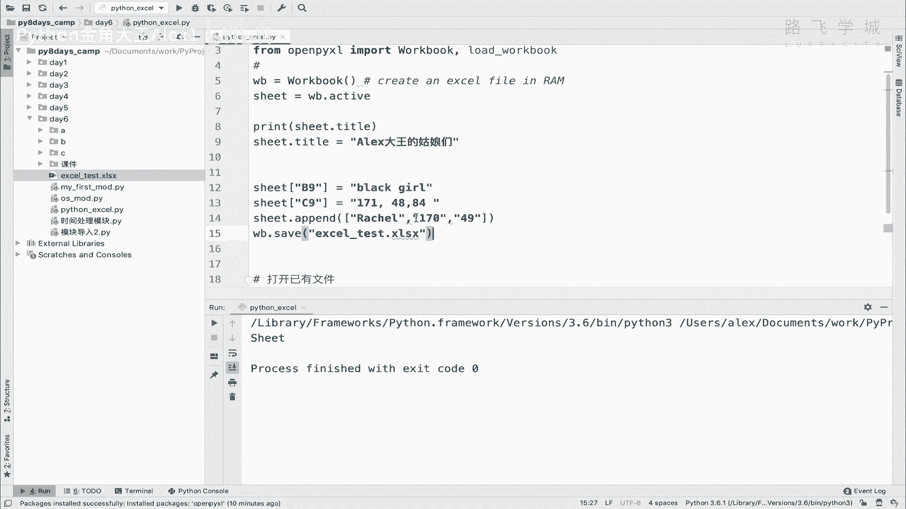

它就会放到三个单元格里，我们执行来看一下啊，来看一下啊。

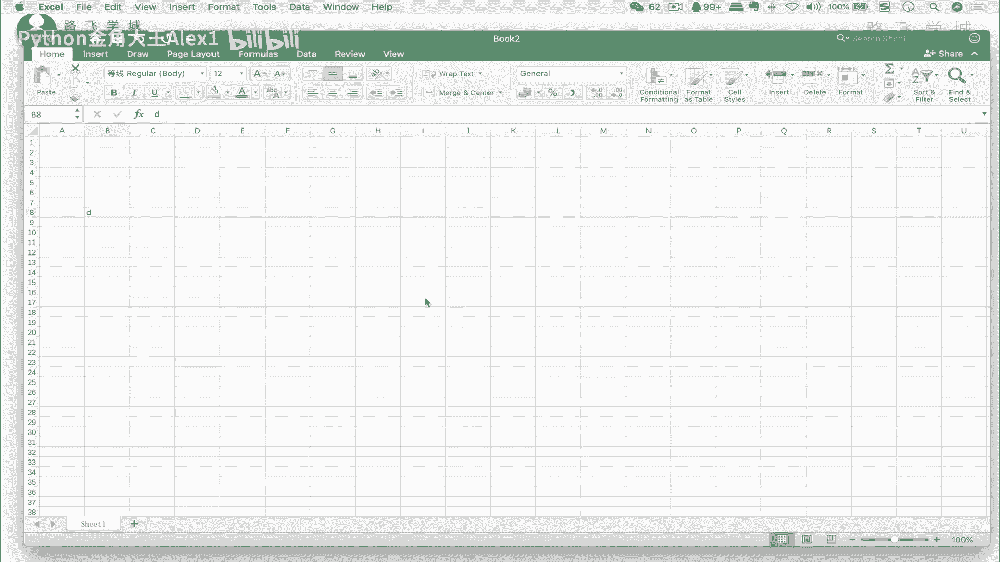

Sorry，我得打开那个文件啊，打开那个文件，哦我的文件怎么打开cl test。

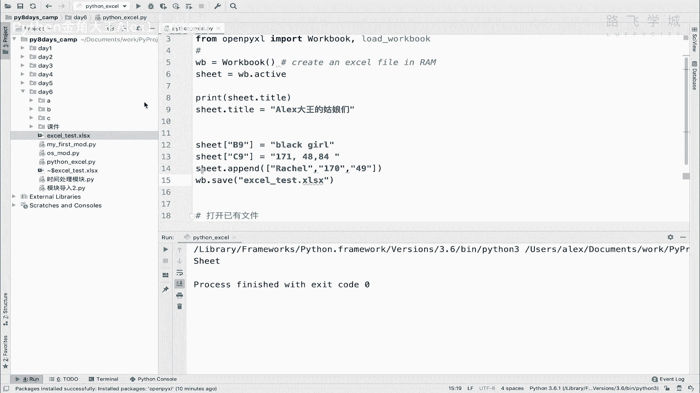

哎大家来看一下，是不是这个文件打开了，你看它添加是添加到整个表格里面，你看你最后一行有数据的，是这是吧，他就从这里往下添加，看到没有，是不是这一下子加了三个单元格呀，明白这意思吗。

啊一下子加了三个单元格好，这个是加成加成一个字符串的格式，其实是咱们可以直接写数字的好吗。

OK咱们就可以就学会了追加好吧，学会了学会了这种加数据。

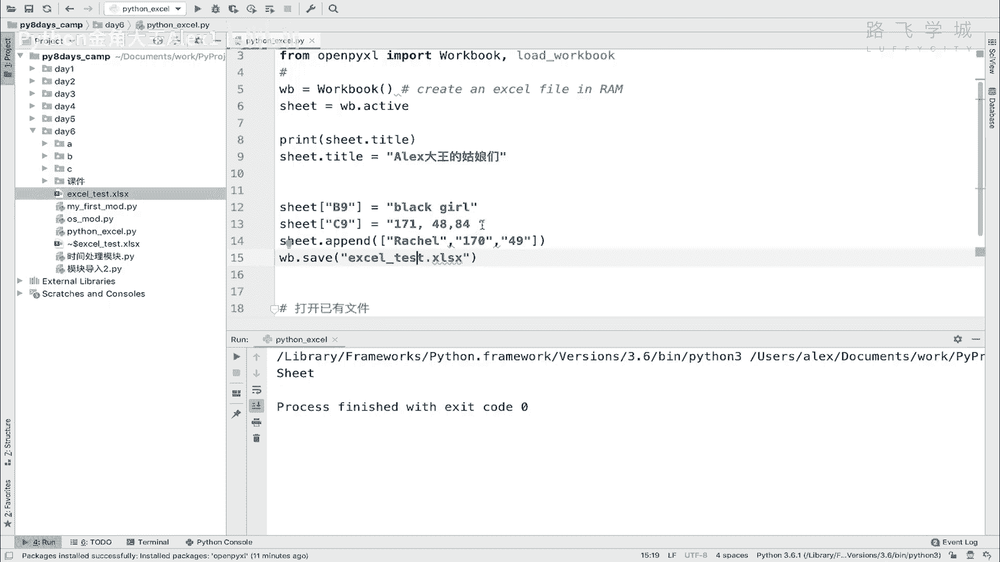

然后看看啊还有什么还有什么数据啊，啊你还可以把时间加进去啊，你看你要加时间的话，你就会放一个相当于是加了一个时间类型啊，你可以自己试一下，那啊接下来我们就什么呀，尝试去打开一个已经存在的啊。

文件已经存在的excel，然后呢这里面就可以去选择里面的很多数据，好不好，常态打开一个已经存在了啊。

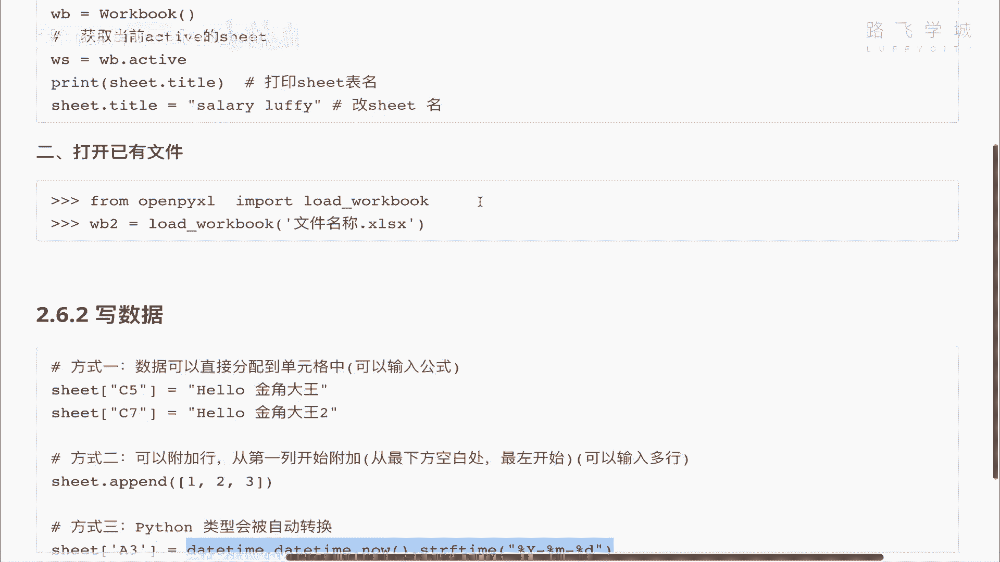