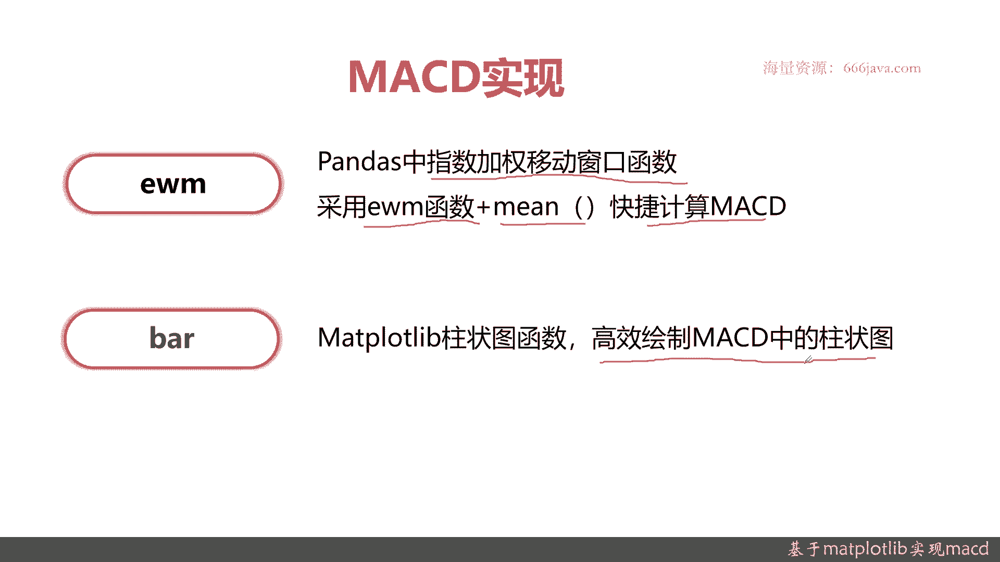
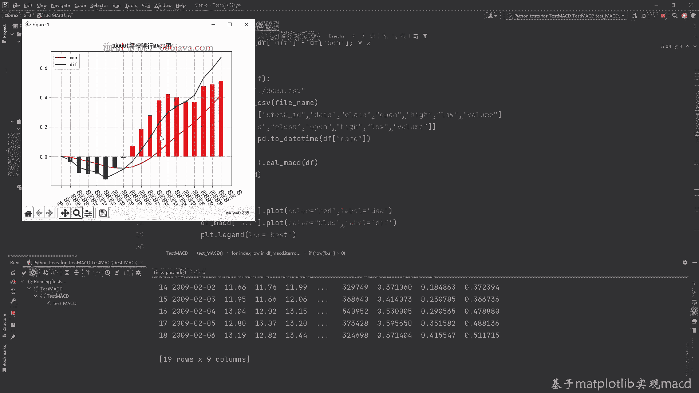

# 基于Python的股票分析与量化交易入门到实践 - P20：6.1 量化交易开发Matplotlib应用-股票技术分析实战_基于Matplotlib实现MACD - 纸飞机旅行家 - BV1rESFYeEuA

大家好，我是米TIA，在上一章呢，我向大家介绍了pandas as股票的处理，比如说pandas as的时间序列处理，还有利用pandas如何去画K线图，这一章呢。

我们将向大家介绍matt plot lib，的相关的一些实战，首先我们将向大家介绍，如何运用matt blab来给大家画MACD，在本章节呢，我们将向三个方面给大家介绍matt plot lab。

如何来画MACD，首先我们给大家回顾一下MACD是啥，然后它有什么作用，接着我们给大家介绍一下MACD的具体算法，最后MACD怎么通过Python和matt plot lab来实现。

首先我们来回顾一下MICD，先给大家看一下MICD的定义，MCACD它的那个全称是movie average，Conversion division，意为一同移动平均线，关键是他刻画的是股价变化的速率。

那么接下来呢我们给大家看一下MACD的举例，这张图就是一个MACD的基本介绍，它分零轴，这是一个加分路路零口，然后绿色的就是跌，其实就是空头的部分，红色的呢柱状图表示涨就是多头的部分。

它分一张白色的线和一根黄色的线，黄色的线是慢线的DA，白色线是快线，DDF其实是不同的指数移动平均曲线，这个具体的到后面给大家算法，给大家解释，记住了，MACD由五个部分组成，然后再给大家看。

举几张例子，当MACD等于常数时候，那其其实就是匀速的，可以看到它是匀速上涨或者匀速下跌，MACD如果大于零的话，它其实就是正正相关的增长速，它其实就是上升趋势，如果MACD它是小于零，在这一块。

那它其实就是下跌趋势，好的，这是一个MACD的简单介绍和回顾，接下来呢我们将向大家介绍一下，MAACD的算法，之前给大家回顾了一下MACD，那MACD重点有五个指标，一个是短期EMA。

长期EMADFDEA和MACD，短期em的意思就是短期收盘价格指数，一根均线，关于指数与更新新内卷，我们在前面两章里面已经给大家详细介绍了，这里就不展开了，这里呢短期EMA一般取的是12天。

长期em其实就是长期的收收盘价格指数，移动均线它是26天，而DF呢其实很好理解，就是短期e ma和长期EMA的差值，DA就是DF线的M日的指数，移动均线一般取的是九天。

而MACD其实就是DF线与DA线的差值，乘以二，这里是后面是具体的公式，那这个是短期EMA的，这个是长期EM其实可以看到，也就后面的参数不一致而已，其实基本的算法都是一致的。

然后呢DF线其实很容易剪一剪就行了，再切成呢DA其实就是九天，最后就是MACD，把那个MACD算法拆解以后，其实数学的公式计算起来非常容易，那么接下来呢我们给大家介绍一下MACD。

关于Python和如何用MACBOOK和lab来画MACD图，MICED实现，通过Python呢有两个重要的参数给大家介绍一下，第一个是EWM，这个EWNM其实就是pandas as里面的。

用来做指数均线的函数，其实本质上它是一个指数加强移动窗口，窗口可以设任意时间，比如说12天十天，26天九天，所以EWM用来取指数，用来计算指数，移动均线它是非常方便。

基本上使用EWM函数加上main函数，就是均平均，可以非常快捷的计算MACD，只需要一两行代码，而且呢因为是pandas as内置的函数，它的性能也很OK，不像有些网上同学教大家用循环来做。

自己去实现的话，性能范围相对来讲差，接着呢是八八呢是埋汰呃，PLAYLION的柱状图的函数，它其实是为了绘制MICD中的，多头和空头的柱状图，待会来给大家进行实战。

那么接下来呢给大家介绍实战也是老规矩啊，我给大家预先定义了好的接口函数，一个是MACD的实际的算法的函数，还有一个呢是实际画图，包括我们整体的测试对接函数，那我们先实现MACD的具体计算函数。

这个函数呢，其实最终我们解决是要解决一个DF，这DF是个入参，那我们的想法呢就是这个函数的定义，输入这个DF，这DF其实就是关于收盘价，就是在这样的panda呃，那个传一个data frame进来。

我们经过计算把结果返回好的，那我们首先要算12日的，也就是短期的短期的指数移动均线，这个计算非常容易啊，就是收盘价好，这效果我们说过EWM就可以了，还有个函数，这EWM可以给大家看一下，那。

非常的方便啊，这是一个pandas面面带的，还有这些参数，我们其实主要知道span adjust一般就可以了，具体的同学跟其他同学呢，感兴趣的同学可以去具体去详细看pa4的源码，好这是12张。

这个呢就把给求出来了，短期的移动均线好，下面求长期的移动均线，还是26天，我们呢在这里把短期的，长期的，还有呢要算那个DA的，也都已经定义好了，好老样子，还是其实还是求图中心线函数都一样。

其实只是入参不一样，我们之前已经定义了入参，那现在只要传参就行了，好的长期移动均线测了好，下面我们定义DF把它给算出来，直接剪一下就行了，很容易啊，有pandas这种实现起来都非常方便。

而且它是向量级运算，性能非常好，好，我们现在算DA1A一样的好，DA也算完了，那最后就是MACD，其实我们定义它叫八，其实就是各种柱状图嘛，也就是这两列相减，这在之前的公式里面都给大家写过了。

我们就直接实现就行，好的，那这样来说，这个计算MACD的函数我们就写完了，其实也就几行代码是不是很简单，接下来我们给大家实验一下数据，还是用我们老数据，在这里我们已经已经给大家预先定义好了。

我们先把MACD的给算出来，然后看一下结果，假设它是一个新的DF，好的我们把MCD给取出来，好之前的数据就出来了，这就是具体的M四D四DI8，这样看它是一个二维的矩阵，看起来不是那么的直观。

那我们后面要通过meal pla把它给算出来，我们下面来编程，把这个DF这个MACD的df data frame给它给画图，画图还是老样子啊，先要声明这个画布，然后再声明各种的颜色。

这个其实就是表征多头的，我们给它赋红色，然后告诉他是，DA这里这就是多头，DA其实表示是多头，然后呢我们给他看，绿色空投，哦不好意思，这是线出错了，我只有100，然后呢给大家把图例给定义好。

下面呢就是要画MACD的柱状图了，我们先声明两个数字，一个是正向的数组，Positive，我就简写了，好再来一个呢它的index，因为八的用法，大家自己可以看到这个具体的数组数值。

还有它的index是必须的，然后下面呢是讲的是negative，就是负向的，好这声明好了，然后我们通过循环这种写法呢，额数量不是大的时候还比较，但是还比较好，但是如果是几万，几10万甚至几百万的。

最好就不要用这种写法，方便两下用户的循环来进行便利，这是常见DF的便利方式，好我们判断一下MCT的具体值，根据它的具体值的布布结果，我们的柱状图要付不同的数据，当拉云的时候，好，我们把index也复制。

然后else，等于零，其实else和单位都一样，其实都无所谓，好，那这样呢，就把八二这两个额八所需要的数组给声明好，下面呢我们来画柱状图，我们给它MACD大于零，就是表示波头，我注释一下。

首先呢先给大家看看它的用法，X轴高宽，Bottom allegend data，那具体是什么呢，给大家举个例子，大家很快就懂，这就是为什么我要先生成index，这是X中的index。

然后他的每一个每一个柱状图的高度，然后宽度都一样，0。5就行，具体的color我们就用red，好我们现在剩下的表示空投，Controh h，也是0。5看了呢，就是green，好那柱状图生成好了。

那下面呢我们要是声明那个X轴和X轴的坐标，还有标签，先定义好基本的变量，因为我们不是我们的那个数据量不是特别多，只有20几个周期，所以X轴展开还是比较OK的，那如果数据量比较大。

比如说你选用的是一年或者几年的，那你可能要取一下鱼，比如说每十天呈现一次，这个具体都是可调的，这是按时间周期来呈现好，这个设置也好，然后我们来给它再画布上呈现出来，好X轴的一些相关方。

然后呢我们来设置网格线，然后画图的名称，这个呢还是这样的，他呢我们一直没变，然后设计它具体的字体参数，好接下来呢就可以直接看结果了，好那么接下来呢我们这段代码就写好了，我们来看一下结果是什么，报错了。

报什么错啊，Li，To the objects are in no property current，看哪一行哦，这好哦，这里拼错了这种的属性，大家一定要看他们的命名好吧，然后看下它的提示。

然后再run一下好，这个呢就是MACD图。

大家可以看到时间放大一点，可以大家看一下，这个部分是一个明显的，也就是1月14号到1月15号，这两天是一个明显的多空交替的事件，可以看到一个明显的上涨，然后呢，因为它的均速其实它的上涨的频率不高了。

其实也就到这里，后面那位基本上就保持了，就是它没有一个加速度的上扬的空间，这是一个交叉值，所以MACD其实是一个非常好的判断股价上涨，沟通交替的一个技术工具，一眼就可以看出来。

OK以上呢就是MACD的Python的实现，下面呢进入本章小结，首先呢我们给大家回顾了什么是MACD，M c d e，其实最重要的，大家记住它是衡量股价变化的速率，尤其是股价变化的正向速率和负向速率。

进行交替的时候，是非常好的一个买入和卖出的信号，接着呢我们给大家回顾了MACD是啥啊，接着呢我们给大家介绍了MACD的算法，他有短期的EMA，一般是12天，长期的EMA一般是26天，然后呢这两个算好算。

DNF其实就是长期和短期EMA的差值，这个长期和短期线EMA算，算完以后，就DFDF，算完以后可以给大家算DEADEA呢，其实就是DNF的M日的指数，一头均线其实一般是取九天，这些都算完。

DA和DF算完了以后呢，其实就是MACD其实是具体的一个计算了，其实就是DEA和DF的差值乘以二，一般呢你可以乘以二，因为看上去更好一点，你不乘以二其实也一样，一般都是乘以二的MICD算法介绍完以后。

OK就是代码实现了重点呃，pandas as有两个，一个函数是EMA，EMA加上min，这个函数可以快速算出指数移动均线，无论是九天还是12天还是26天，代码其实都一样，其实就是一个入参的不一样。

刚才也看了，其实EWM其实就是一个根据时间窗口，这个窗口你可以选九，可以选12，可以选26，接着呢给大家进行了matt plot的画图，里面有个重要的柱状图八的画法好了，本期呢MACD实现课程就到这里。

我是米tea。