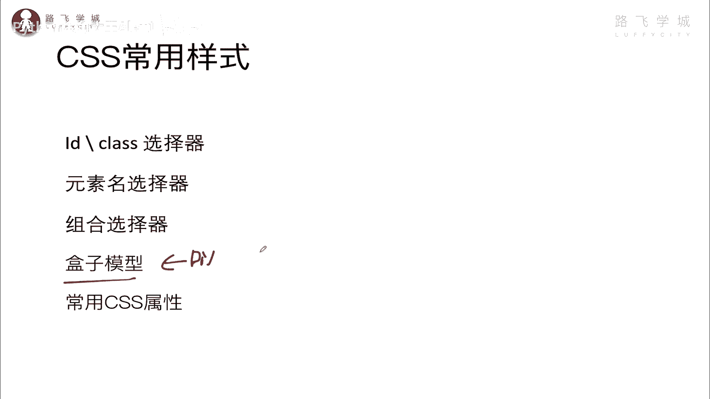
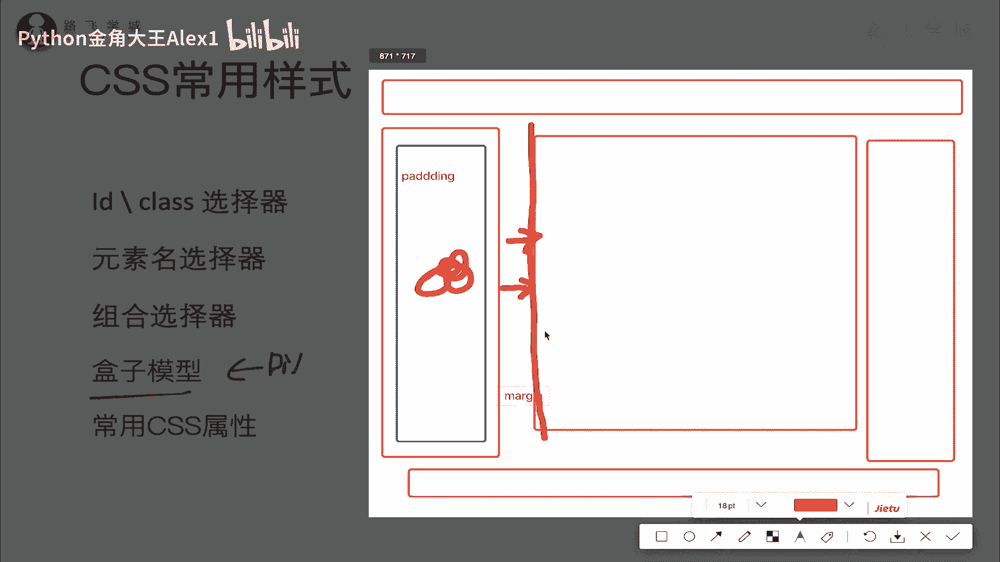
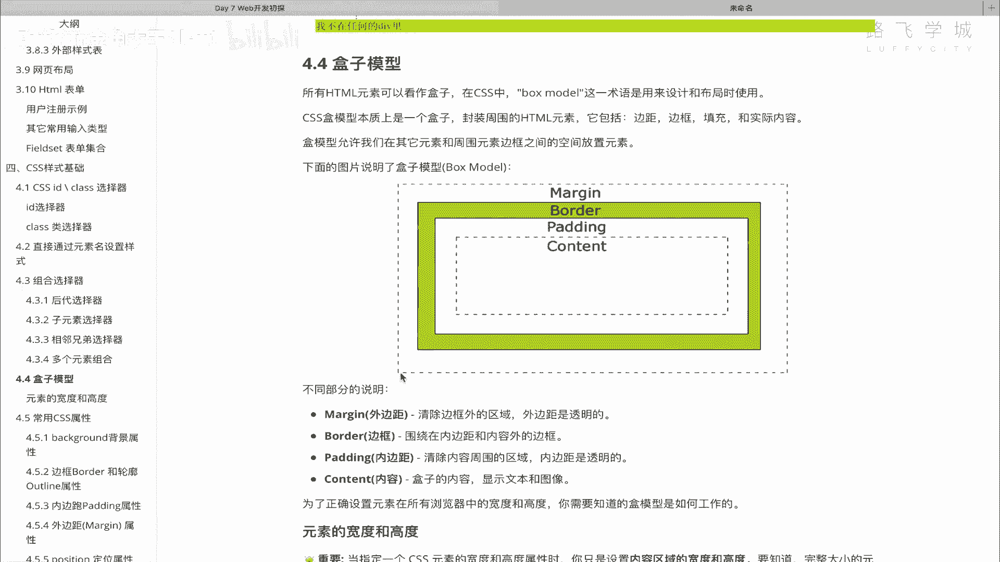
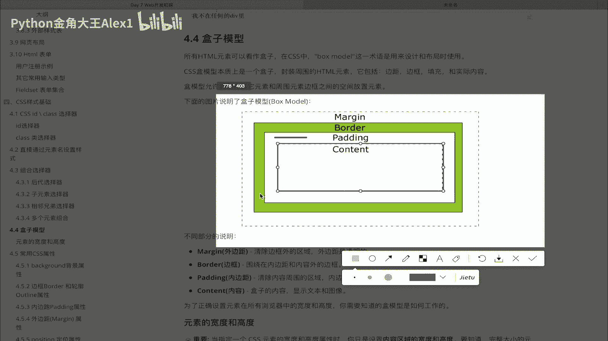
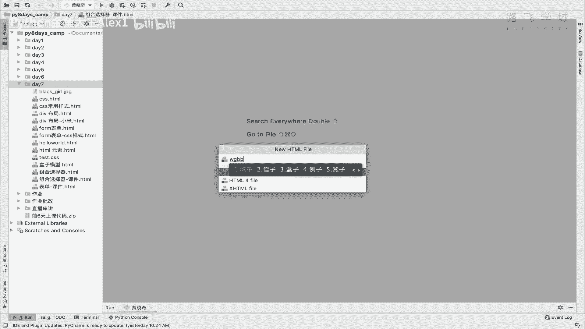
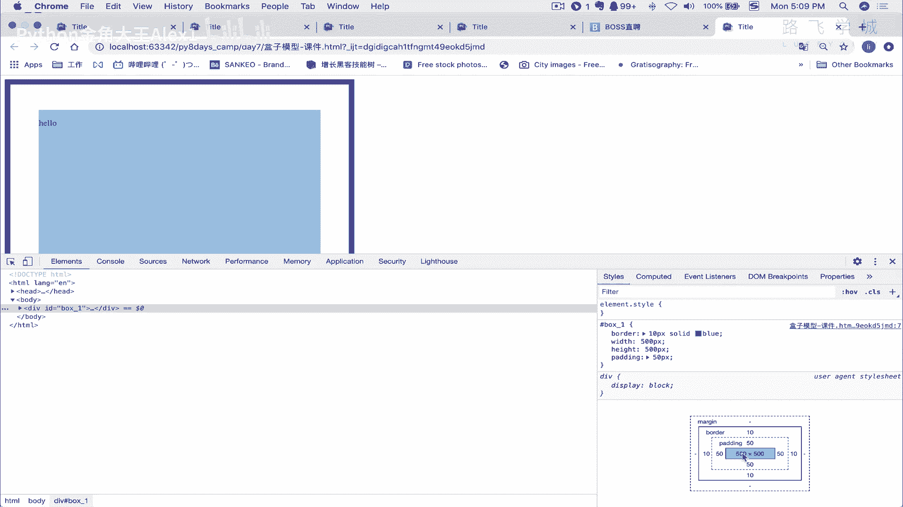
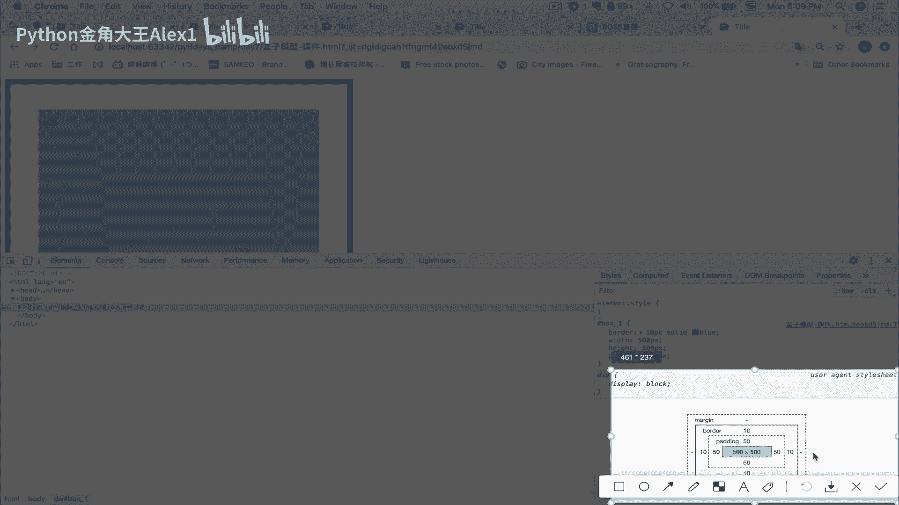
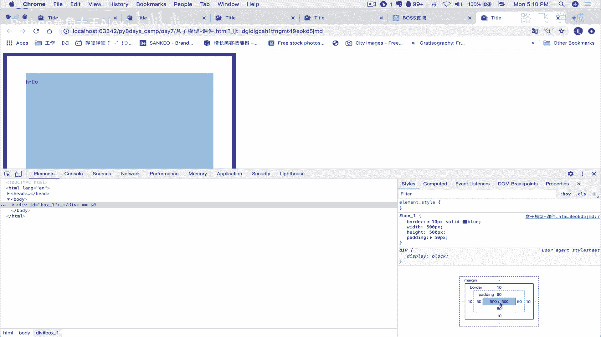
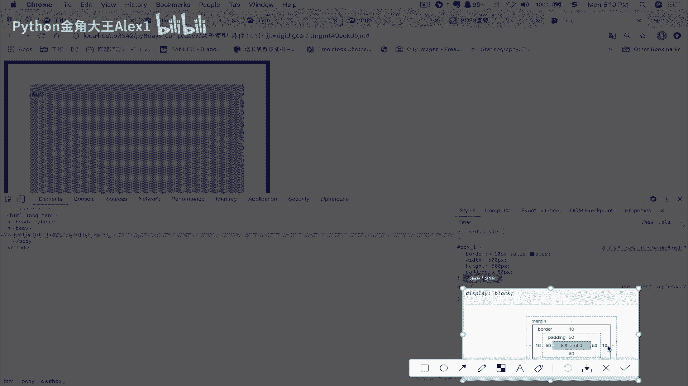
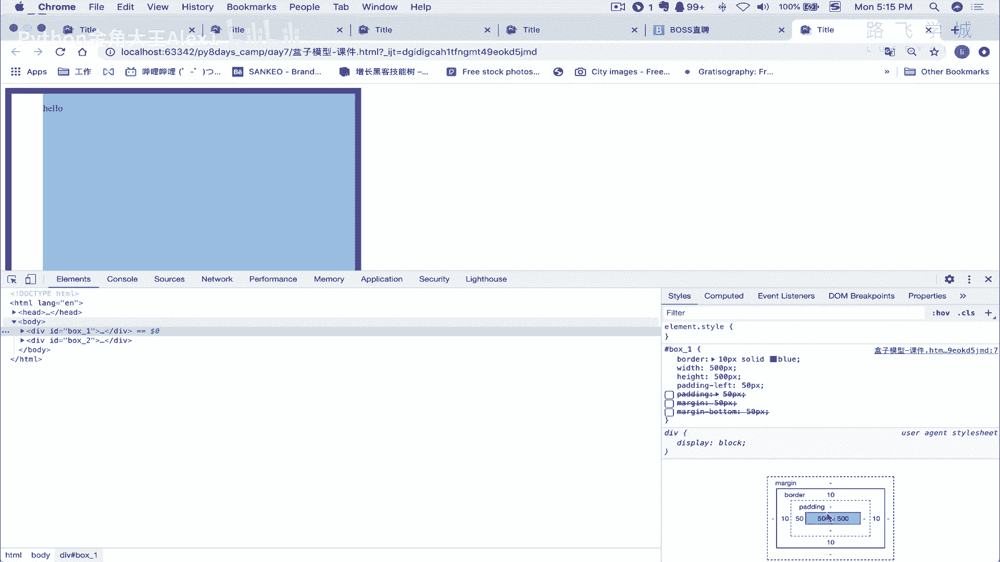

# 【2024年Python】8小时学会Excel数据分析、挖掘、清洗、可视化从入门到项目实战（完整版）学会可做项目 - P92：10 网页布局盒子模型 - Python金角大王Alex1 - BV1gE421V7HF

OK同学们，这一小节呢咱们来学这个叫盒子模型，那什么是盒子模型呢，其实就是咱们在讲用div，来进行网页布局的时候呢。

需要了解到的一些东西啊，那首先我们在用，假如说这是一个网页，对不对，上面有这个啊嗯按钮对吧，这边有这个侧边栏，这边有这个中间的内容是吧，这边可能还有一个左边侧边栏，这边有尾部好吧。

哎这个相当于我们在讲布局的那一节也说了，就是用一个个的div包起来了，对不对，那除了div包起来，我们当时为了区分我们是不是给div设了背景，设了边框是吧，能让你清晰的看出来。

互相之间的这个这个这个边界是吧，那接下来要说的就是这些div之间注意了，就是我相当于其实是不是就这一个个容器，就像一个个盒子一样，在一个这个整个的那么一块区域里，我放了好几个盒子是吧，放了好几个箱子。

对箱子啊，那这个箱子这个箱子里面装菜特别难，这个箱子里面装内容，这个墙，那每个箱子它都是要占地方，注意了，这个除了占地方，也就除了这个内容，现在我们知道从肉眼可以看到的，是说有这些内容的东西。

还有一个边框，是不是啊，这是我们肉眼可以看到的，但其实除了这个之外，还有两个东西，一个叫什么呢，记一个叫内边距，一个叫外边距，注意了，内边距外边距什么意思，你比如说我现在虽然搞了一个箱子对吧。

但是这个箱子呢，我要求说你不能紧贴着我的箱子放东西，明白吧，我要干嘛呢，你离我这个箱子比如说都是5cm，看到没有，你也就是说你你这就是一个内边距，看到没有，我给他上个颜色，啊啊啊唉sorry啊对。

也就是说你看比如说这个红色到蓝色之间的，这个东西，它是不能放东西的，这是我的编剧啊，我规定好，你只能你的内容只能放在这个蓝色边框之内，这个东西就叫内边距，看到没有叫内边距，它的写法叫什么呢。

拍ding啊，pd叫内边距，除了内边距之外，我咱们还有一个东西叫什么叫外边距，外边距是什么呢，你看现在他俩是吧，左边咱们讲布局的时候，是不是左边和右边这两个的div是紧贴着的对吧，紧贴着。

但是现在我的要求来了，我不能让你紧贴着，我让你留出来一点距离对吧，流出来，就比如说中间留出来这些的距离，中间留出来的这个距离，就可以通过叫外边距来解决，也就是说我可以干嘛呀。

我可以让我这个啊左边的这个div干嘛呢，强制设置好外边距，也就是说这个比如说2米之内不能近人是吧，这意思就是一样的，就是这么在这么一这么一小块的区域里啊，是我这个的依然是我这个div的势力范围。

你是不能进来的，你后面的这个div，右面div，你只能从我这个外边距这个地方往后往后排，明白吗，这个叫外边距，外边距的东西叫什么呢，叫margin啊，这就是它的写法就叫margin诶，写错了。

margin ok吗，哎所以有一个叫内边距，外边距，那整这个东西就叫做盒子模型，OK那合同模型呢我们要了解。

既然它有内边距，外边距，它就是可以设置得到，对不对，就可以设置。

那怎么设置呢，你看他这里其实也跟你讲了，这个图也是看到没有，这个里面是你的真正的叫啊啊啊啊，这个叫叫什么呀，内容放内容的，然后看到没有，这个是边框，边框到内容之间的这个叫内边距，看到没有。

这是内边距好吗，然后呢去看那个绿色的是你的边框，你的边框可以设得很粗，这都没问题，那边框之外叫外边距，它就是那么几个情况，内容内边距，边框外边距，OK好，那接下来我们就可以设置什么了。

根据这个搞一个搞一个div。

我们来实际看一下它的效果好不好，OK好，接下来那我们就用实例来给大家演示一下啊，这个盒子模型啊，我们来创建一个创建一个盒子模型。

OK课件，然后呢，我在这里写一个div，好吧，div呃，我们这随便说句话吧，啊哈喽，给它起个名字叫id等一个box1吧好吧，在这里给它设置一个样式，style type text啊。

咱们看一下怎么去设置什么设置边距，设置边框对它产生了一些，对这个盒子产生的影响，好吧，OK接下来我们是呃行box1，然后给它先设置一个边框吧，border等一个呃10PX吧，看着粗一点。

然后solid solid就是实实心的啊，就是实心的边框，solid solid这个啊black blue也行，蓝色，然后然后这就可以了哦，对宽度高度等于一个，比如说500PX，hat等一个也等一个。

500PX都是500一个正方形好吧，我们来看一下这个效果，哎确实是首先出现了一个这样的一个方框啊，那接下来呢，你看咱写这个文字是紧贴着这个什么呢，紧贴着这个开头的啊，有同学说你这个没有紧贴着。

不应该在这吗，那他这里已经不到一行了啊，他这其实就是上面一空就就挤不出一行来了，他就是从这开始，OK那接下来我们就可以干嘛呀，给它设置一个叫啊内边距，先看内边距啊啊啊对，先看那边距吧。

OK那边就叫什么呢，叫padding，OK吧，我们的padding要想看出来效果，我可以加一个50PX好吗，50PX的话，大家来看一下啊，现在是在这对不对，看看他应该咱们说啊，他如果那边去。

他一个文字应该往里边挤嘛，对不对，往里边挤，那我们看一下啊，应该也就是说我这个文字会移动，对不对，诶卧槽卧槽，同志们发现了一个什么东西，你发现首先文字是不是往里边挤了，没错，蚊子往里面挤。

但是你发现咱们这个盒子是不是变大了呀，是不是变大了呀，哎我们想的不是不应该只是往里面挤就行了，盒子怎么变大了呢，这怎么回事呢，诶你这个时候还没有我的讲解，你可能就蒙逼了。

这个时候注意右单击打开审查元素啊，你的中文应该叫审查元素在谷歌浏览器上，然后啊注意啊，做前端开发一般建议用谷歌浏览器，别用他妈360，可恶心了啊，360什么IE那不行，注意到哎，打开审查元素之后啊。

这个element这个应该就是元素中文的，然后呢在这个地方看着啊，在这个地方开一个style了吗，然后往下滑往下滑诶，看到没有啊，注意了，你看啊，它这里有一个叫这个东西，看到没有。

这个东西就是他给你谷歌浏览器的调试器，给你搞出来的一个一个一个一个什么呀，一个就是这个盒子模型的一个什么呀，可直观看到的，你看你这是放到哪，它就哪里就高亮了，对不对，你就会发现为什么它变大了变大了。

首先你看一下啊，咱们说盒子模型，首先包括内容，包括内边距，包括边框，包括外边距对吧，大家来看一下这个，看到这个了吗，看到这个这个地方，你看我这个鼠标这个地方再看这里啊。

鼠标这个地方这个是不是一个500×500啊，是不是500×500啊，注意了，very good好，你的内容，也就是说我们在这里设置的这个宽度，高度是500，是不是啊，你以为是设置的整个啊，整个这个页面。

整整个这个div就永远就是500500，不是它只是设置的内容这一块，就内容这块区域是500×500，这块不会变，明白吧，它并没有包含你的内边距或者是外边距，或者是你的边框。

所以你会发现你设了一个50的padding。

看到没有，他这里已经给你显示了，你设了一个50的padding，这个50他自己也是占空间的，所以就导致你整个框给你挤大了，明白吗，整个框给你几大了，因为你的边框是在pd外面嘛对吧。

所以整个框相信这些相当于是边框是十，padding是50，是不是极大了，明白这意思吧。

所以这就是为什么极大的一个效果，OK那这个时候啊有这个时候，那接下来啊明白这个道理了之后，那样，那你就啊知道你的这个相当于内容区域，只限制这一块，但是你整个div的大是大小是多大了。

是不是嗯相当于500，再宽的话是500+50，再加十，这是560，这边再加60，相当于是多少啊，七百七百七呃，560再加再加60是620。

对不对，620，大家来看一下我这个是不是一个620呢，是不是一个620呢，点一下这个地方看啊，在这个地方，然后看到这个了吗，显示了吗，你只要把这个鼠标移到这儿，它就显示一个620，看到没有，620啊。

好那接下来知道这个为什么扩大之后，我们再来设置什么呀，可以设置这个叫啊外边距，外边距外边距是什么呢，叫margin margin，你如果也给他设置一个50的话，大家来看一下它的效果，看着啊。

他就会把左边这个边框往右移了，看着啊，上边也会移，它是四面都会设置，大家来看一下，我没有啊，对你看是不是四面都设置了，整个的它从上到下到左都有，都都是啊，挤出来50。

有些同学说你怎么确认右边和左边挤了50呢，啊右边你要想搞这个div，它就是在对吧，要并排，他得搞那个浮动，咱们之前讲过了，我们给大家快速的演示，像下面这个你就知道了，我比如说我在下面再搞一个div。

我在这里再搞一个div叫box to是吧，我这里面啥也不写，我就box to的话，我在这里，我在这里怎么讲，这个这个这个这个这个我我就先我就直接pink，这个都不写，我只是给他加一个re可以吗。

啊我又写了一个div，大家来看一下，你看他是不是直接往下给它挤了对吧，咱们讲过这是一个外边距，是不是外边距margin，你看一下啊，大家看大家啊，稍等得box1box1大家呢啊，我这个配合我这个怎么。

大家看看到没有，你看我这个一点MARIN是不是这个黄色棕色的，对不对，是不是看到没有，这里是不是也跟着什么了，哎这个就是外边距好，通过这个你就发现哎就有点意思啊，你就可以你这个设置盒子的时候。

你就注意了啊，你比如说想让两个盒子之间出现编剧，你是不是就得用什么用margin，而不是用padding，对不对，用margin明白意思吗，好别弄混啊，别弄混，你要把这个MARIN去掉。

那他肯定这里就不行了对吧，又接上了好吗，哎理解这个之后，同志们啊，理解这个之后，我想一想，咱们接下来干嘛呢，哦对了，你看我现在设置的这个padding也好，MARIN也好，都是四个边一块设置的，对不对。

比如说我设置padding，你看他这上下左右都给都跟着往下缩了，我可以这样，我可以不我可以不上，我可以不上不下，不左不右，我可以只只搞一个，只从左边开始把这个判定拉出来，就把这个左左左边去给他拉出来。

怎么办呢，哎你就不要用这个整个的padding了，你可以用这个叫什么呀，Padding left，下载padding left，看到没有，Padding left，right top都可以啊。

Padding left，你等一个50也可以看到没有，这个时候同志们，你看你整个框也会变小，是不是因为它只是生成了左边的这个边框，理解吧，那你的margin也是，你比如说我不想我不想上面去去去去。

这个也空出来，我只是想跟他下面这个红框拉间距怎么办呢，你就直接啊margin啊，你你或者是在这里设margin bottom，或者是在这里设margin top都可以，margin bottom是吧。

等一个50，大家来看一下是不是出来了是吧，同样的，你在这里设置一个margin top是一样的道理对吧，margin top就会导致下面的这个啊跟上面拉开距离，大家来看一下，你看是不是没有变化。

只不过是说它改成了改成了改成了什么呀，这个margin是没有的，但是这个看到没有，是不是有一个有一个50的，一个棕色的这个东西，有一个边框，没错吧，好这个就是margin的意思啊，啊外边距。

然后可以单独的设置，然后我比如说给他设置设置左边左边也移动，那不就左边也会，你可以同时掉啊，比如说margin left搞个100对吧，那它就会往右移OK吗，所以大家了解这个东西就可以知道了。

通过margin来去实现这种你的框子左移右移啊，或者这种东西就可以了，All right，这个就叫咱们的盒子模型，其实就是内外边距，这些东西知道就OK了，好吗啊，计算注意了，计算你这个一个div的大小。

一定要把这几个东西都包含住，看到没有，这几个东西都包含住啊，才才不光是内部的这个你的高度和宽度啊，内部的高度宽度只是记录你这个什么叫内容的，那个负责内容这一块就是这一块是吧是吧，负责他只是他。

只是他只是他只是他只是这一小块，对对吧，它只是这一小块，OK你还要把外面的东西加上all right。

