# python+ai支持多票信息查询(上) - P1 - 程序员在囧途 - BV1yaCqYZEvw

好这节课我们来讲一个这个思路啊，是支持多股票信息查询，那在我们上节课演示的这个agent啊。

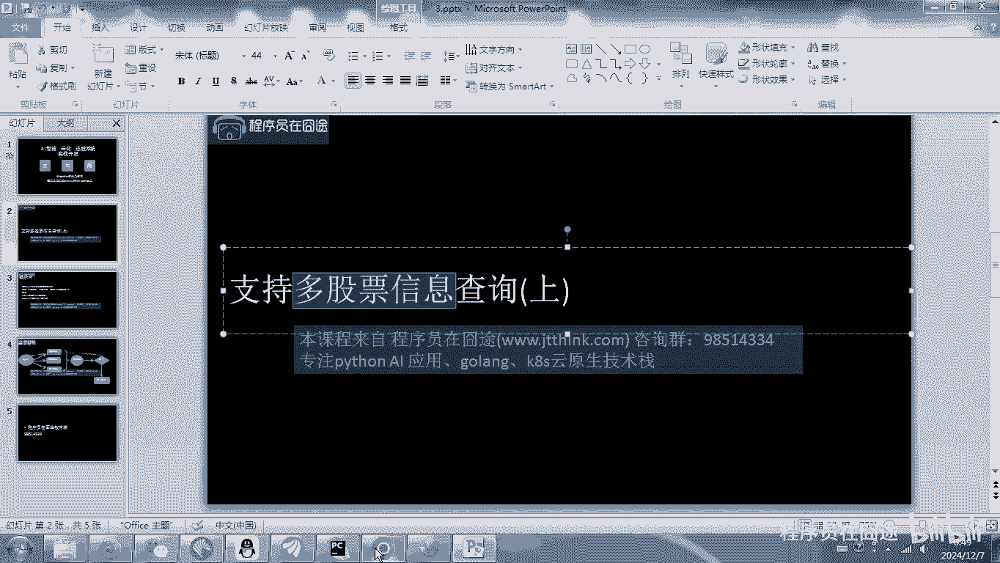

现在我们只是使用define来无代码来构建啊，后面我们会写代码，那这块呢我们是如果你输入啊，比如说这个茅台，那这肯定是没有问题啊，如果你输入茅台和平安啊，或者多个这个然具有问题。

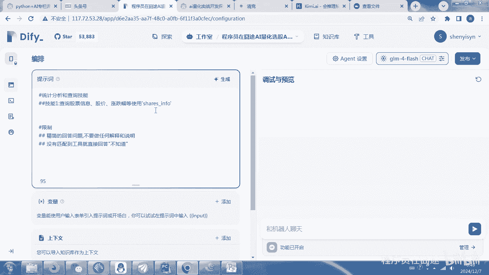

那他查不到，那今天我们来说一下这个思路啊。

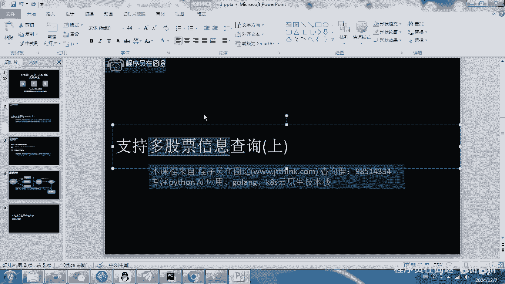

一共分两步啊，其实第一步就是我们这程序，程序本身在我们上节课它只支持一个啊，我们上节课是call的啊，这个其实只要把额规定啊，规定我们等下我们再写一个专门的这个工作流，的时候。

只要规定这里面传入的时候呢，可以逗号分割啊，就可以通过pandas啊来进行查询啊，这个课件大家可以课后向我要一下啊，因为这个是我课前写的。

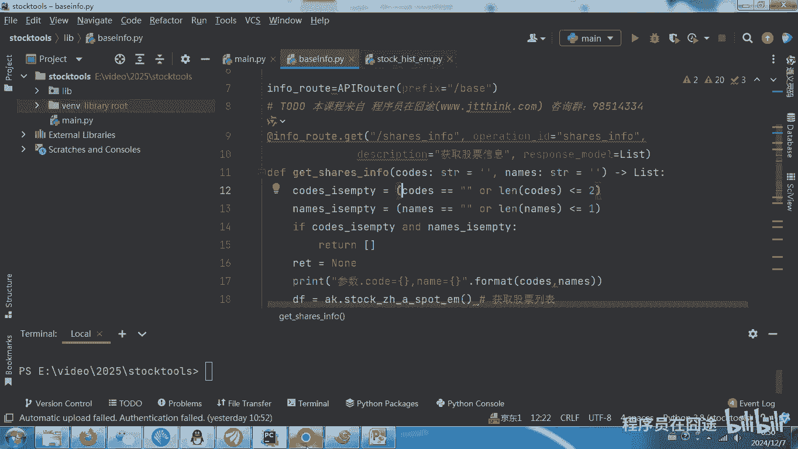

然后给大家说一下这里面应该怎么做，我们先把这个所谓的agent先放开，先不管啊，到这里呢，我们需要创建出一个工作流来解决这个问题，好这里呢我写工作流啊，这个是L量AI量化啊，这个股票信息查询啊。

就这样吧啊就这样创建一个工作流，那其实等下在我们下节课，需要把这个工作流合并到我们上节课写的这个，agent里面，这时候才能实现多个，因为这里呢我们首先对它进行提取，这个在我们之前基础课程没有讲过啊。

所以我给大家演示一遍怎么去做，首先呢我加入啊，对这看菜单啊，加一个这个加一个段落吧，啊比如说这个是问题，然后这个叫做query，这个200啊，200，然后点保存，也就是说我啊单独去运行这个工作流。

需要填一个问题啊。

这个问题可能是啊在我们上节课写的啊，可能是类似这种问题啊，他这里面只支持一个安硕信息。

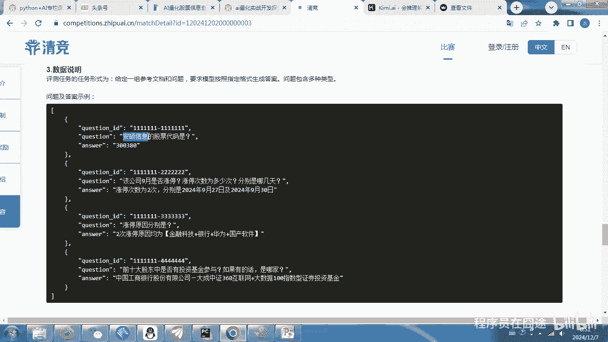

那我们要支持多个注意点啊，是多个，所以在这个地方我们加入一个什么呢，加入一个变啊，参数提取啊，是这个内容啊，当然我们可以把它改成免费的啊，改成这个flash就是免费的，这个时候我们就输入变量。

把这个query，就是我刚才开始设定的这个参数进行绑定，绑定好之后来到这儿写个提取参数，那么其实这里面就是让你去定义你的参数，像我们这定义什么呢，cos啊，这个这个参数描述要写的啊，是股票代码啊。

这个添加一下，然后再来一个这个是names，这个呢是股票名称啊，他其实是按逗号分割的，好这步其实两个变量就可以了啊，在这里面写上我们的指令，这个指令就类似于我们的提示词啊，这里面怎么写呢。

我在这给大家一个示例看一下啊，我在这里面，就是因为他是绑定了我们这query的啊，所以在这只要写上，解析出上市公司的名称或被代码示例啊，我这里写了一个中国茅台啊，中国平安什么什么的啊。

这个就是结果是cause等于什么。

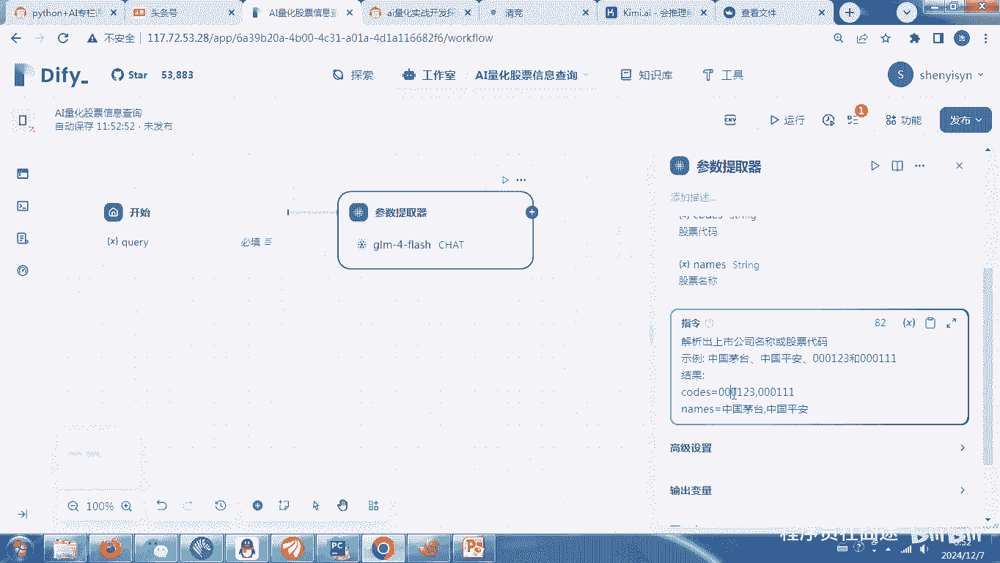

names是什么，通过逗号来进行分割，那我这个程序里面也是通过逗号来进行解析。

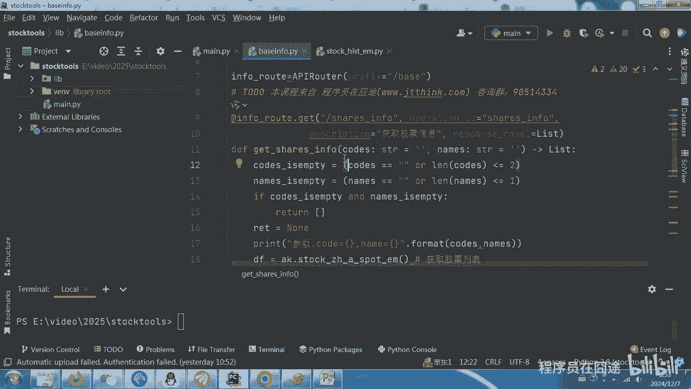

注定啊逗号来解析，然后这个地方呢我们写个高级设置啊，这个不用不改啊，输出变量是cos和names好，接下来我们给他做一个测试啊，放到这里面接加个结束节点，然后把这个这个cos和这个names给干出来好。

接下来我要干的事情就是来运行啊，比如中国啊这个茅贵州茅台吧，茅台和中国中国平安的股票代码是什么，然后开始运行啊，大家这里可以看到啊，在这个地方会出现cos是空的啊，没有，因为我没有没有提问这个问题。

然后names是贵州茅台和中国平安，或者有可能我们问的问题呢更加啊，这个比如我们要问的是茅台和五粮液啊，五粮液哪个股价高，当然在这里面其实查询的不是股价，而是对这两个内容进行提取。

所以这时候开始运行也是一样啊，这个这个结果都是一样，这里面这里面啊可能就有问题了，这个时候我们就需要把这个模型给改一下啊，这个就是贵州茅台和五粮液，刚才第一次运行就有问题啊，这有问题，这个问题怎么解决。

后面再说啊，后面再说，暂时其实在这里面呢，如果你使用更高级的模型可能更好一些，那如果你使用的像我这种使用的免费的flash，可能就会出现问题啊，这个时候就需要验证这个验证后面再说啊。

其实这里面提取啊这部分就需要验证了，说明这个模型还是有些欠缺啊，使用这个L可能会好一些，但这个不是免费的，我再看一下啊，啊这个就是一下子就出来了啊，当然我们在测试的时候。

你为了因为这里面可能需要调用多次啊，你可以选择flash来做一些免费的啊，但也是有补救措施的啊，后面再讲好，那有了这一步之后呢，我们就可以把这个先去掉啊，把这个先删掉，然后在这里面再加一个。

我们在上节课改的这个工具自定义啊，选择这个struts info啊，cos绑定cos，也就是我们的参数提取器里面的cos，然后绑定names，然后这个输出变量不管了啊，不管了。

好这个就可以了，这就是我们上节课做的什么做的这个工具啊，做的这个工具同样我们在这里面啊。

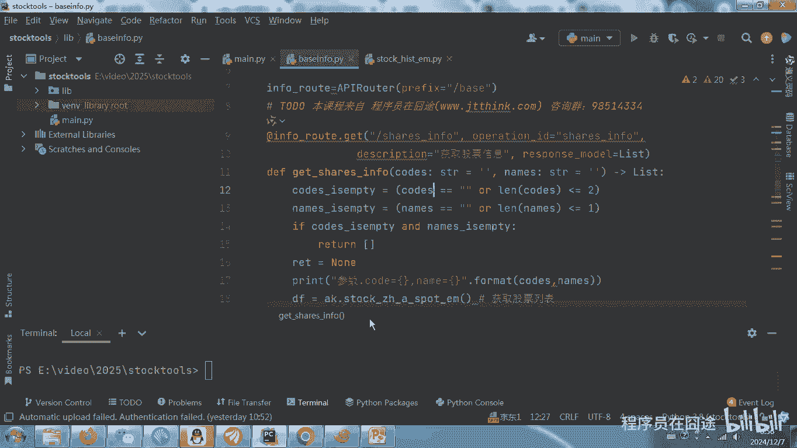

这里面呃为了演示这个效果呢，我把这个加个结束节点，然后把我们刚才这个工具的text给显示出来，好搞定啊，我们在这儿写一个啊，这里面我们呃这个我就写这个运行一下吧。

啊这个是没有吗，我看一下啊，哦这里会有一个逗号，这里会有个逗号嘶啊。

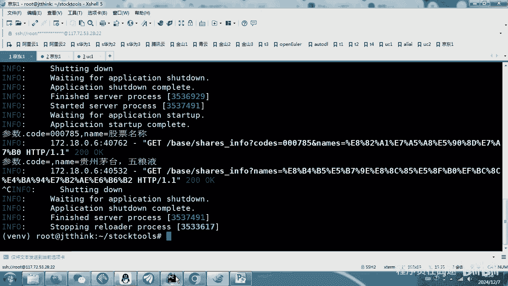

这个我就不在这里面，我想一下啊，这个我只在程序里面做一个。

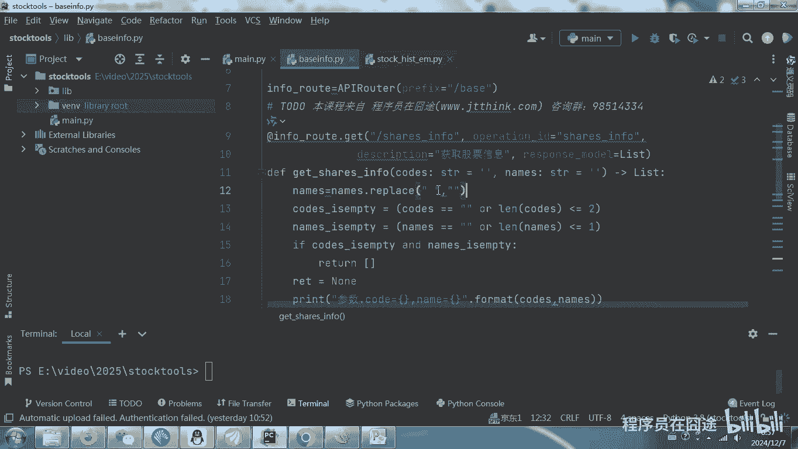

他把这个这个这个中文逗号给干出来了啊。

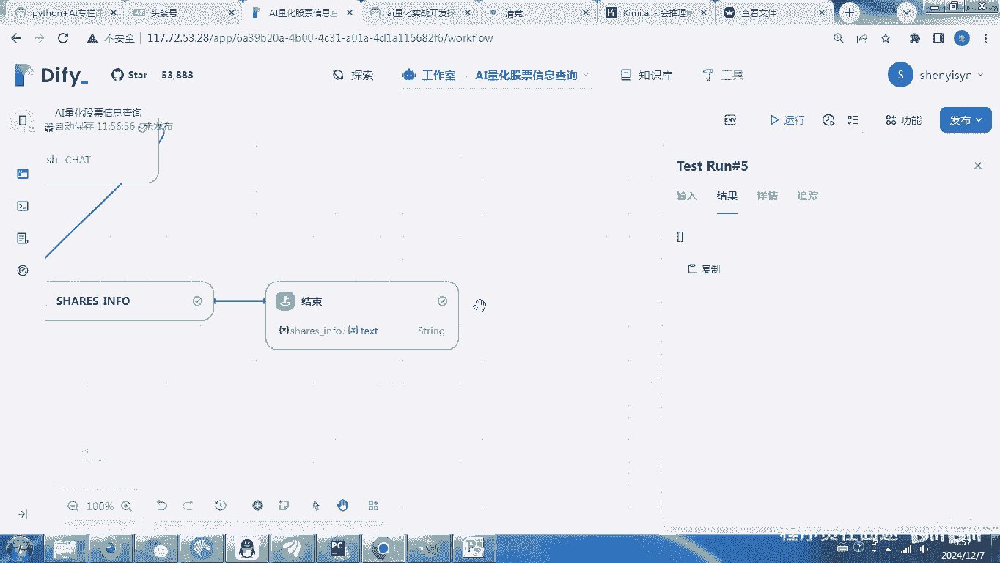

这就是模型的问题啊，这就是模型本身的问题，这个在我之前也碰到过啊，也碰到过，那我们就特殊处理一下啊。

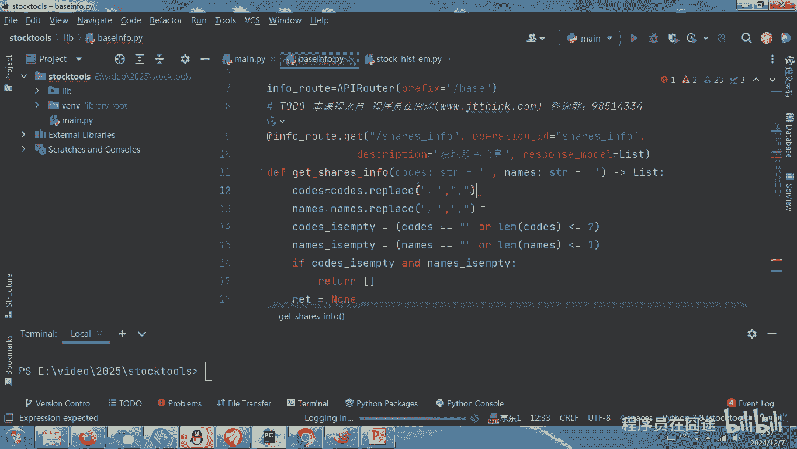

特殊处理一下，然后运行再运行一遍啊，这是我们的工具啊，在这里面我是通过这个二进制程序来运行的。

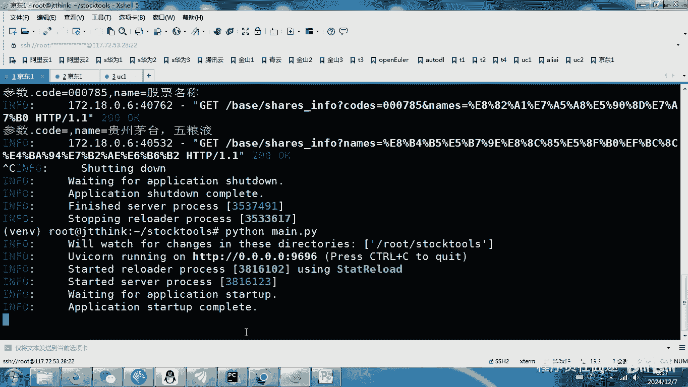

这个后面我们需要把它放到容器里面，K8S里面都可以啊，随便的啊，好这时候再来。

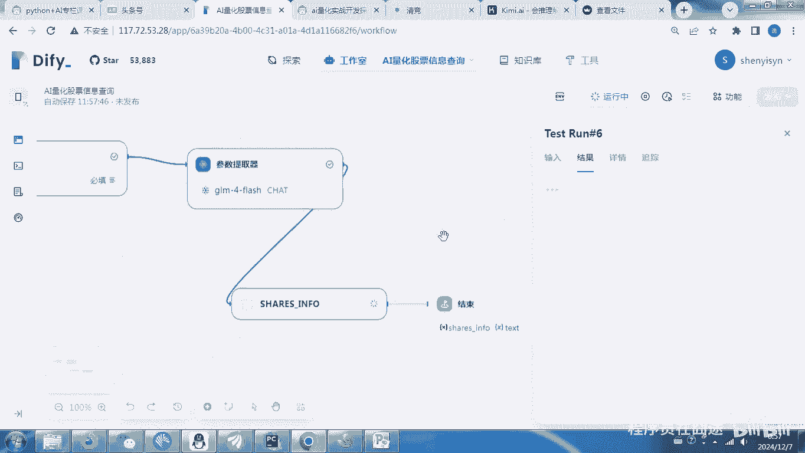

这里面应该出现五粮液和和这个茅台两个，我看一下，好像茅台在哪，啊就是这两个啊，其实就应该同时出现这两个，至于说哪个价格高，是由我们啊上节课讲的agent来进行处理的，这个不是我们在这儿工作流处理的。

那工作流做好之后，接下来怎么办啊，做一个课后思考题，课后作业啊，要回去做一下，其实那下节课我们来讲怎么去做好这课，说到这儿啊。

