# python实战开发金融行情分析、量化管理系统(第一波) - P1 - 程序员在囧途 - BV1WDm7YUEUc

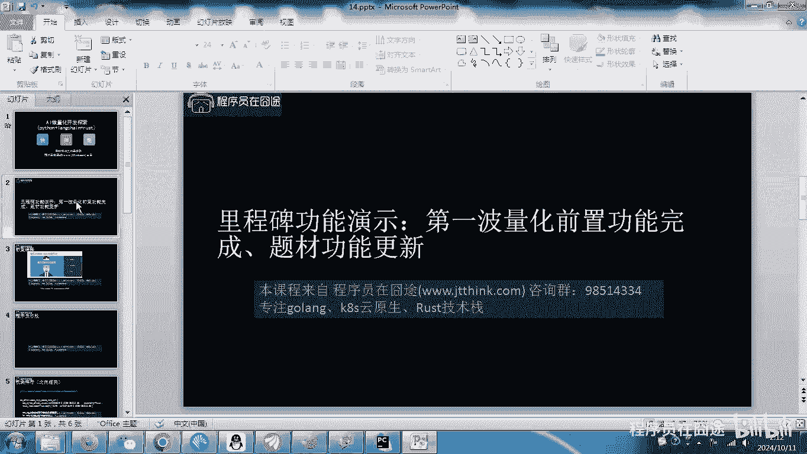

今天这个是我们快速做一个里程碑功能演示啊，在我们这课程录的时候呢，可能大家会看到我录的比较快，而且呢这个有些功能我是在课前就做了，因为基本的原理和基本代码啊。

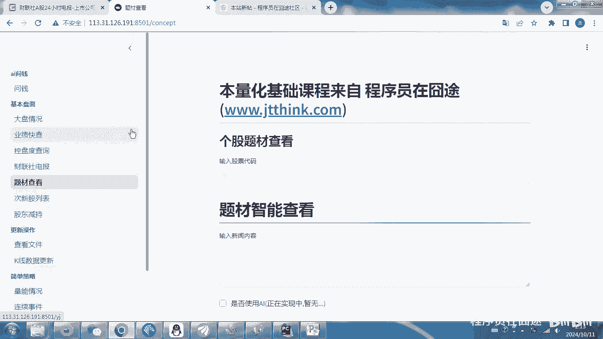

之前都讲过了啊，所以今天这课时呢，我们做一个啊里程碑式的演示，后面我们的更多功能啊要结合AI来完成，那首先我们这个课程在这啊。

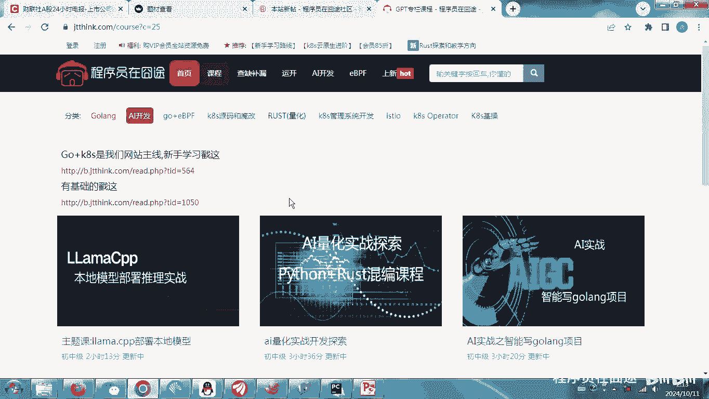

在这那我们后面的rust混编还是有的啊，还是有的，当然这个课程rust不是主要部分啊，主要是我们的Python部分，但看这课程，那肯定得学啊，如果你是啊，这个这个就就想就想干这个这个项目的啊。

如果你对金融知识一点不懂。

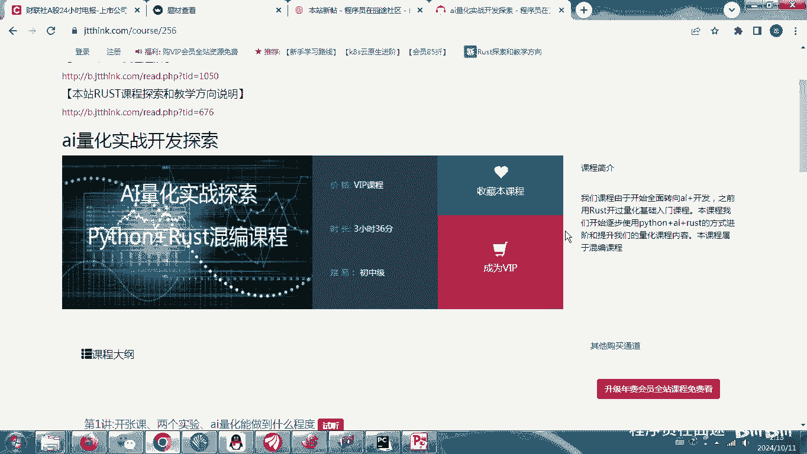

肯定不行，那今天我们这块主要演示一下，我们目前的一些这个系统的功能啊，这课程的所有功能，那其实在这儿还没有完成，还有2/3啊，只做了1/3，这还有个问前功能啊，这个还没做完啊，后面我们再来继续开发。

以及这个原理是什么，后面再做啊，今天我们主要讲的这个题材啊，题材什么是题材，之前我们课程有讲过啊，什么是题材，那在我们这个比如说我们随便找一个新闻啊，随便找一个啊，我使用财联社啊，彩联社随便找一个啊。

比如说这个是哎，这个这个这个好像和我们没有关系啊，找一个国内的国内的，因为在我们的不管是彭博社还是财联社，还是其他一些新闻网站啊，很多时候出现一些消息的时候呢，当我们看到的时候。

很可能已经是已经是滞后消息了，但是啊我们程序员做这个金融和股票，有个什么优势呢，得到信息比一些普通网民，普通的股民要快那么一些啊，快那么一些，所以我们如果掌握了什么啊。

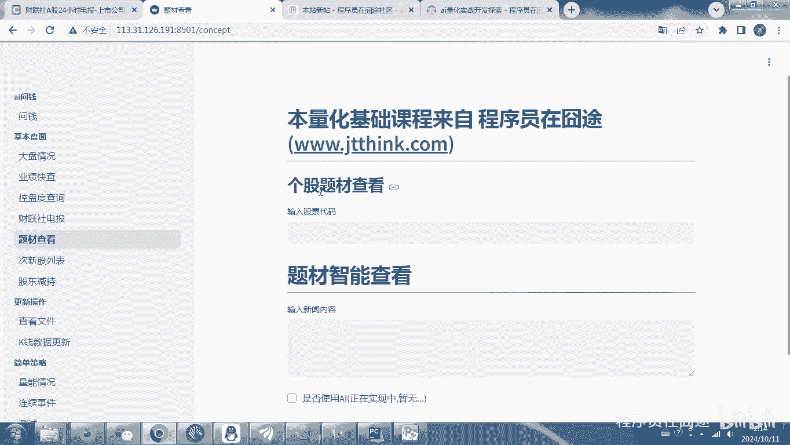

其实这个也是之前我们在在群里面，给大家讲的啊，这个是顶尖人员啊，顶级人员我们可以认为是机构啊，这个然后还有一坨内容啊，还有一坨人到我们啊，到我们属于属于这个技术炒股人啊，技术其实后面还有啊。

后面还有什么类似于这个大妈大爷之类的啊，我们比他们是要高一级的啊，高一级的有同学可能会讲到啊，这个网上有很多这个大妈大爷讲的很准啊，讲的很准啊，不要去信这种消息啊，好我们到这一步啊。

其实我们只要信息比他们快，比后面托人快啊，还有这个新手，还有新手新股民什么的啊，啊其实作为这个金融啊，或者说炒股这个这个本质是什么，本质是我们比后面这拨人要厉害一些，信息快一些，操作犀利一些啊。

或者我们的这个技术储备也多一些啊，那我是能赚到后面这一坨人的，当然后面一坨人不代表没有高手啊，也有高手的，他们这些人是割我们的啊，是割我们的，所以我们只要记住这个本质是什么，本质他就是一个零和游戏啊。

零和游戏，所以在这个程度上啊，我们只要不在最底端，不在最最底端，其实新股民里面也有啊，也有潜在的这个啊潜在的这个高手啊，暂时还没成为而已，所以我们需要有一个什么。

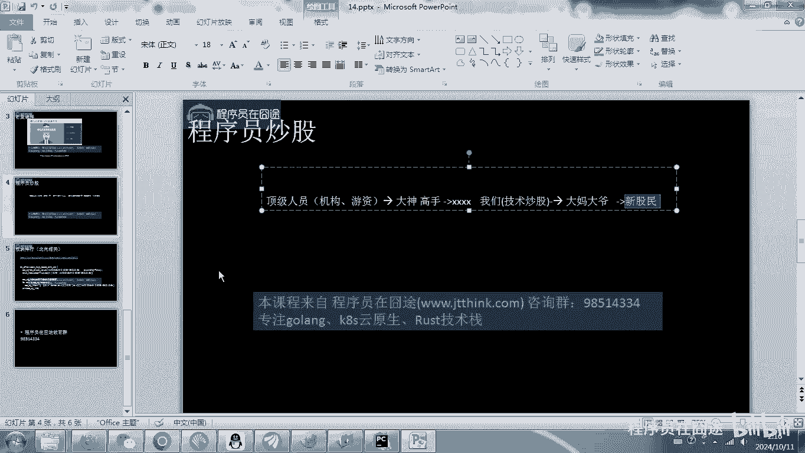

有一个技术工具来完成，我们对啊，这个这个不管是盘面还是数据，个股的一些查看啊，包括我们对它进行一些数据的分析，都是需要的啊，都是需要的，其实这课时我们主要讲的是这个啊，在这大家可以看到有大盘情况啊。

业绩快查，比如说我们选择某一个啊时间段啊，选择比如说这个600519啊，茅台看一看啊，茅台看一看啊，贵州茅台这个营业收入啊，财报啊什么，其实我们要做到能够去独立啊。

分析和判断财报还是需要一点业务经验的啊，仅仅技术没有用啊，没有用，然后这还控盘度啊，控盘度60519，这个就是我们的控盘度，那现在已经啊，截止到我这个录课程只到10月10号啊，10月10号财联社电报啊。

这些都是我们需要看的啊，需要看的，今天我们主要讲的是这个题材啊，这个题材，那其实这个是作为什么作为什么啊。

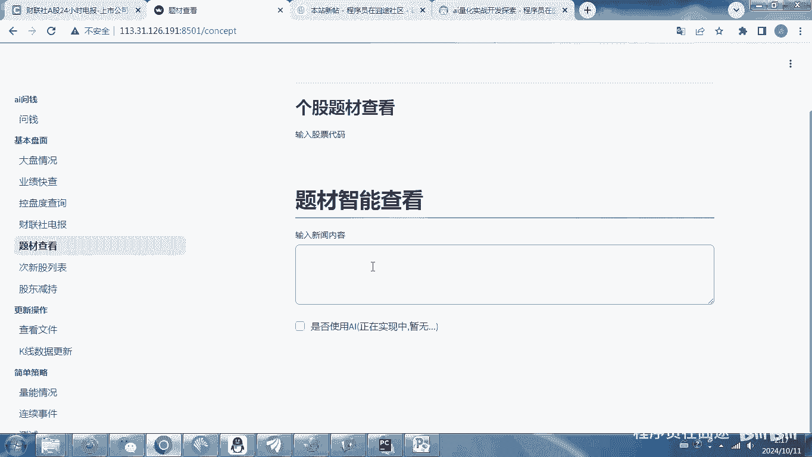

我们先看一下啊，牛市熊市熊熊市还有是中间阶段，在他们之间是有中间阶段的啊，这个有结构化行情，这个阶段这个阶段其实是我们技术人员的啊，技术炒股的这个这个最佳时机啊，其实牛市很难赚钱，熊市不说了啊。

没法赚钱啊，但这个熊市有的时候也有啊，有时候也有在中间阶段，其实我们作为技术人员要抓的是中间阶段，而不是这个这个很难赚钱啊，大家不要认为牛市就一定能赚钱，这个这个也不说了啊。

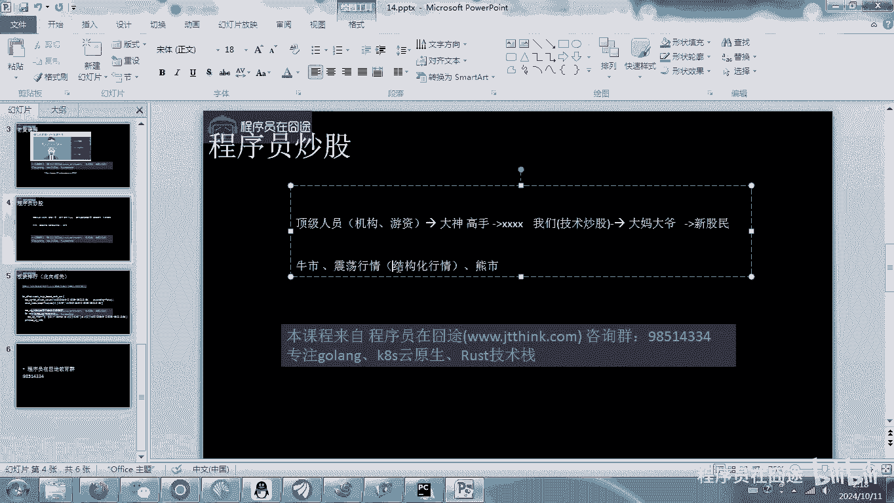

所以在这个时候呢，我们需要做一个题材，所谓题材就是对我们当前的热点信息。

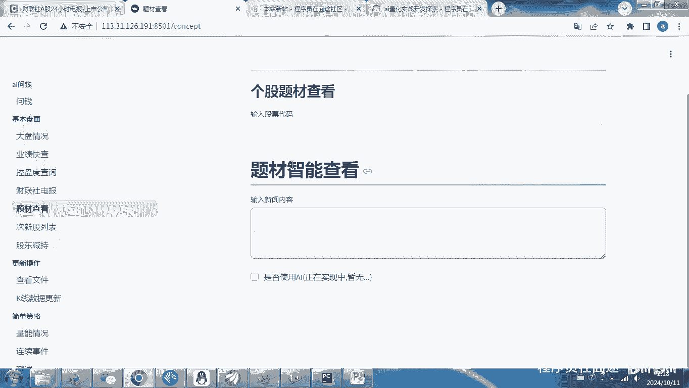

在我们得到七八手信息之后啊，能够比他们快一点之后把这个信息分析出来啊。

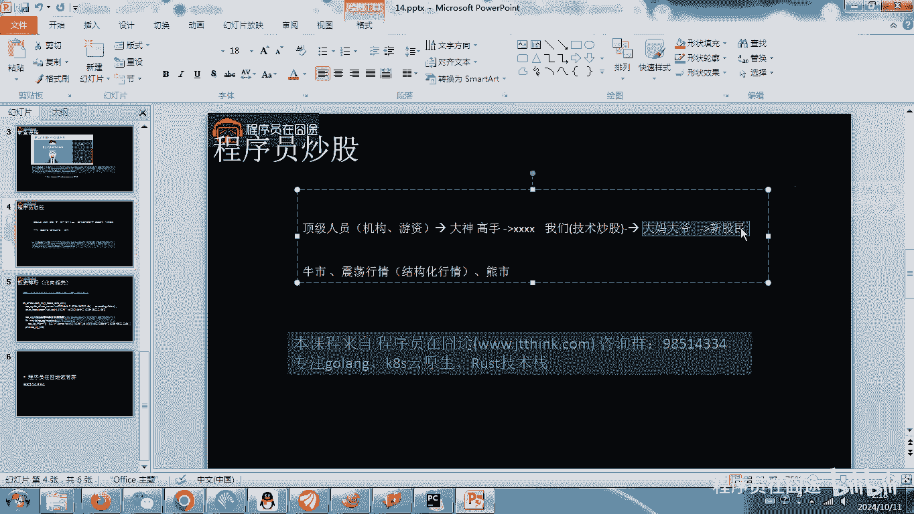

能够得到和我们哪些股票相关联关联度啊，能够相对精确一些，所以在这个时候呢，我们就需要做一些，这个我还是要找一下啊，找一个国内的，国内的这个其实也不是国内的，随便找一个吧，随便找一个往这一贴啊。

往这一贴大家可以看到啊，这个时候正在处理啊，诶这个是有，啊在这个地方大家可以看到啊，跟这个一坨内容啊，通过分析啊。

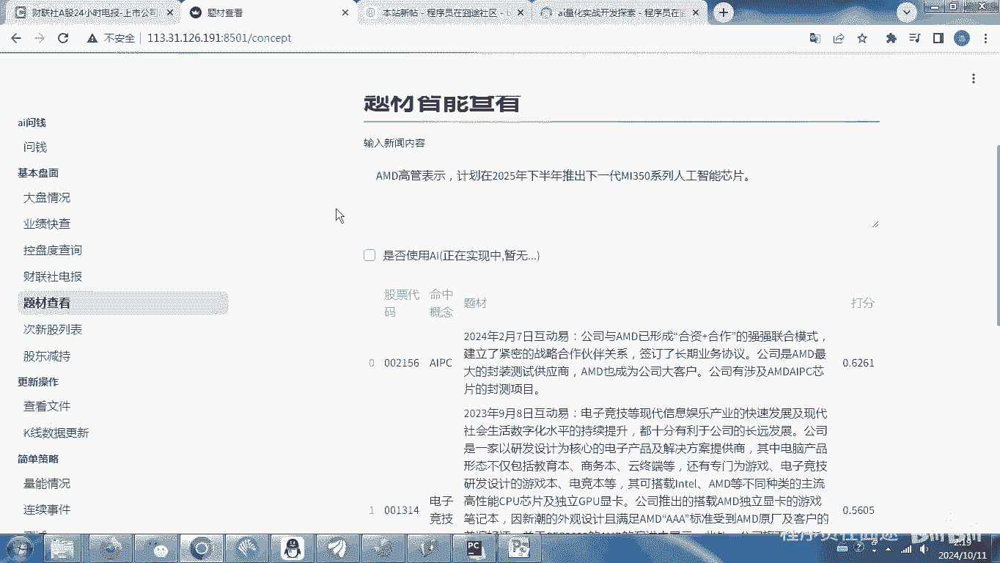

通过我们之前讲的这个rag，那可以看这个课程啊，看这AI啊。

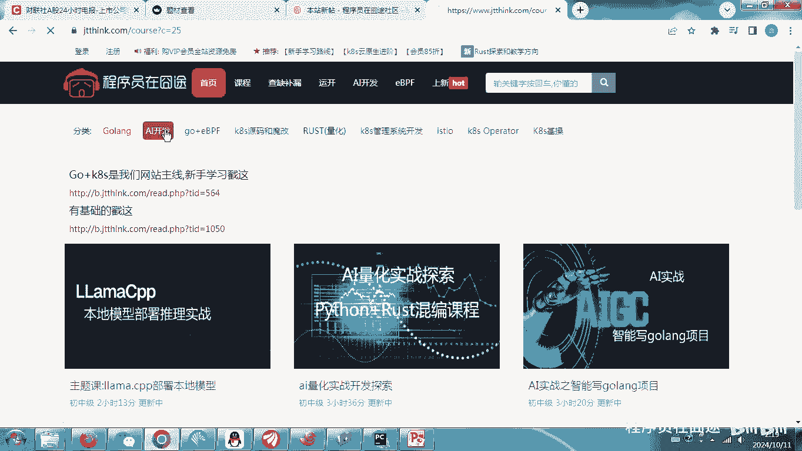

这个粗暴入门篇有一个rag啊，在这里面类似的功能啊，类似的功能啊，不是agent好，第20讲啊，这里有个传说中的rag是什么啊，基本代码写法，其实我们也是利用这个方式来对我们的概念，题材进行匹配啊。

通过它呢我们可以快速找到一些这个代码啊，这代码是啥，我就不给大家看了啊，大家自己去通过通过这个这个财富软件啊去看，根据这个，他可以判断出有哪些是和它进行匹配的，然后这个是打分啊，这是打分。

最后我们还需要结合AR啊，结合AI来对这里面内容进行进一步的判断啊，得到更加精准的内容，但这里还涉及到一些这个数据训练什么的啊，这里面的功能在我们之前的这个课程第20讲，全部讲过啊，全部讲过。

然后我们只要把我们所对应的新闻，随便输入就可以啊，随便这个这个这个就没法输了啊，穿的肯定不准啊，肯定不准，我们可以找一些这个找一些这个技术文章，那技术文章，比如最近有一些这个服务器啊。

包括啊这个啊这个大家可以看到啊，AI加速器需求规模，然后在这里面输入就可以，这里面出来就是和我们人工智能是有关系的啊，是有关系的，所以这个是芯片概念和华为的一些概念啊，通过这些呢。

我们就可以非常呃相对来说比他们有针对性的。

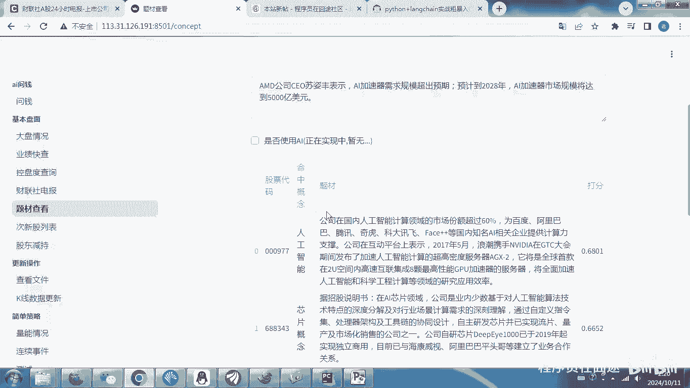

找到个股啊，找到个股啊，这个数我们大概就介绍到这啊，其实这里面呢是我们第一阶段啊。

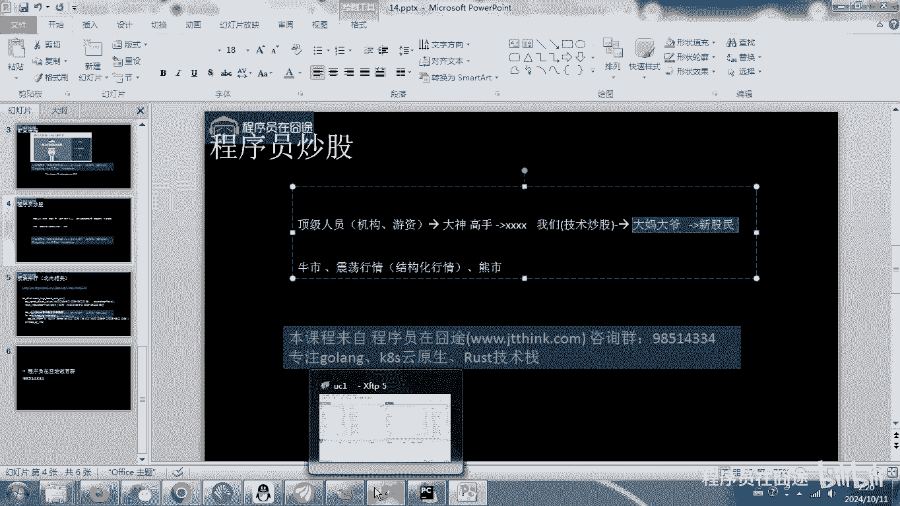

大概就完成了，那后面我们在做这个录制课程的时候，一边是会有课件，那大家向我索要课件啊，索要课件呃，然后这里面业务知识有什么不懂的啊，可以向我提问啊，个人提问就可以啊，因为这个目前我还正在做啊。

一边做一边完成这里面的功能好，这就说到这儿啊。

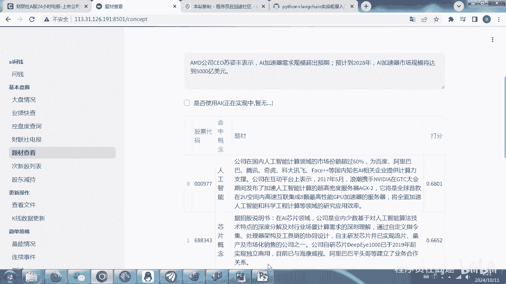