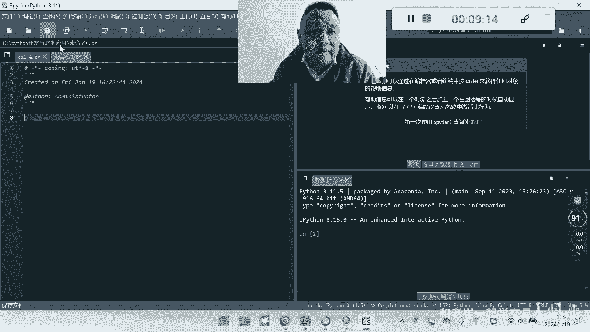
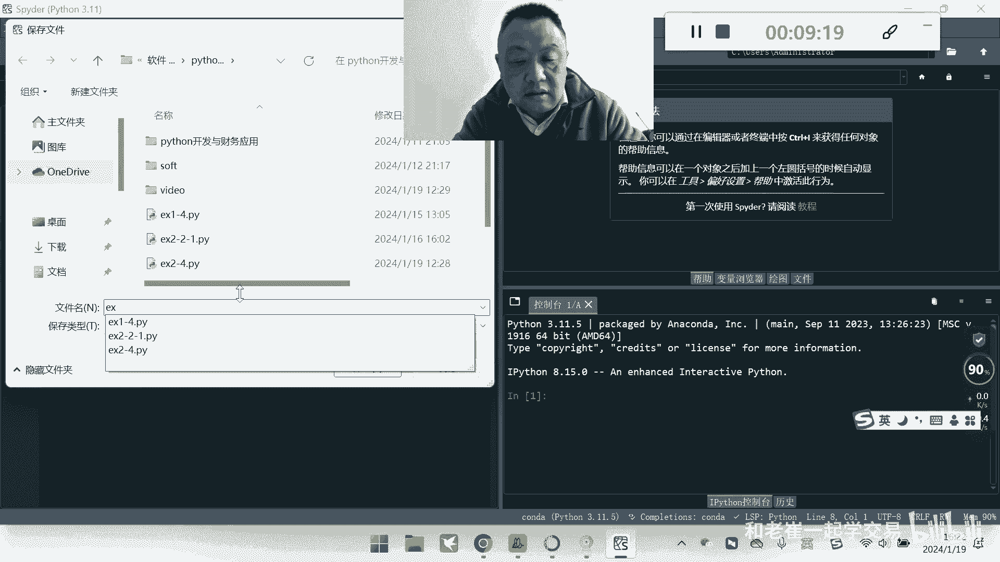
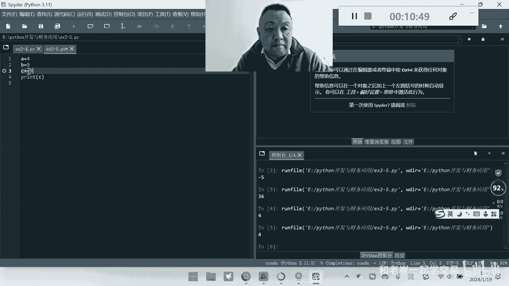
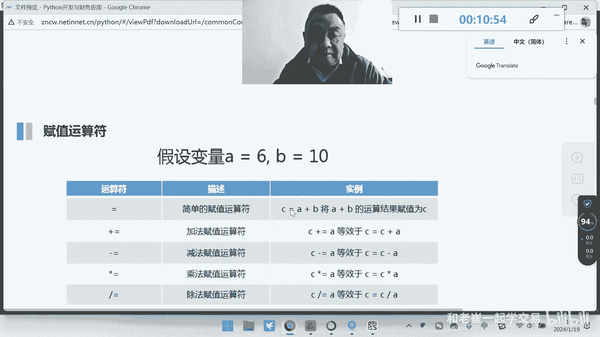
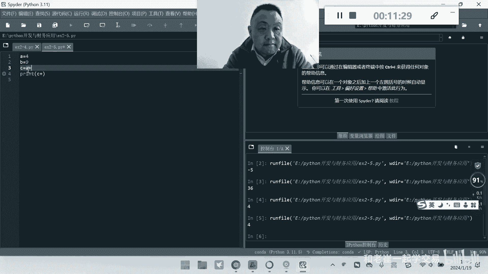
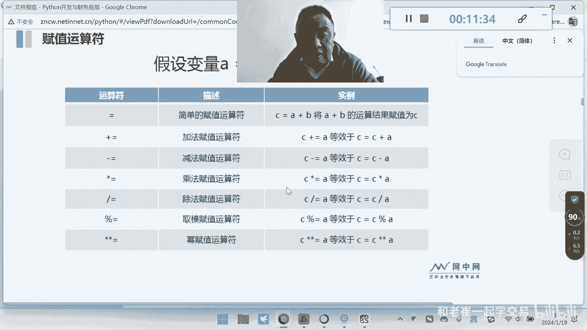
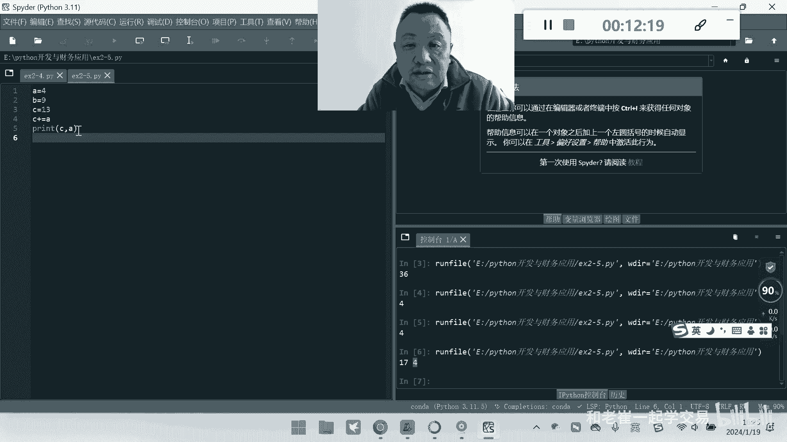
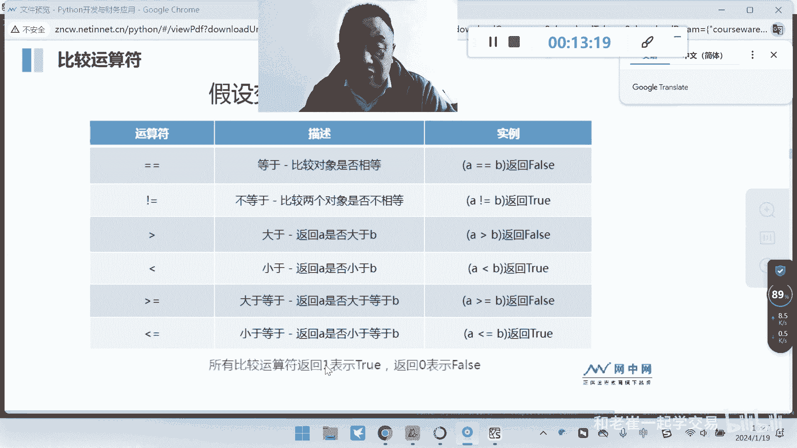
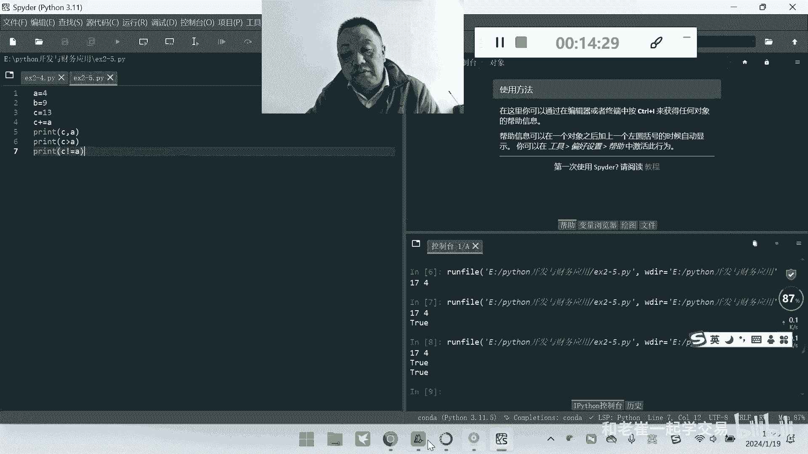
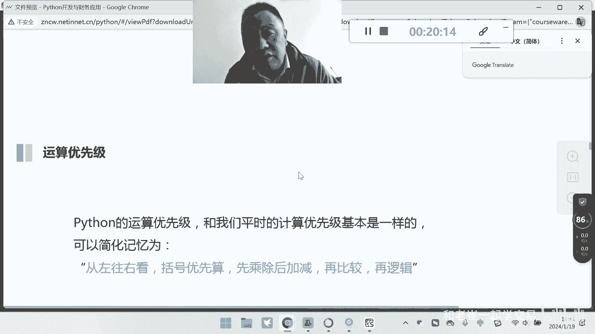

# python开发与财务应用2-5 数字与算术运算符 - P1 - 财富书友会 - BV1cW421w7Ch

感谢各位同学对崔老师的关注和支持，那今天呢我们来看啊，Python里面的第二个项目的第三节的任务呃，从第三节课开始呢，我们要介绍一个非常重要的概念，叫做数据类型，额，数据类型呢是我们在编程的过程中。

经常要用到的一个重要的知识点，从数据类型的名称上大家就可以看到，实际上它是解决数据的种类的呃一个概念，就比如说我们日常处理的数据，有的时候是文本，有的时候是字符，有的时候是数字，有的时候是日期。

有的时候是逻辑，就是我们把现实中的这些信号符号呢，分成各种各样的类型，那么这种类型呢我们就给它一个名字，比如说如果这种类型是数字，我们就叫数字型或者叫整形，如果这种是中文或英文的字符，那我们叫做字符型。

而整数整形和字符型它的定界符是不一样的，那我们在编程的过程中呢，就要对这些类型进行一个区分好，那首先我们来先看一下课件，课件上呢，我们这是我们的第二个任务里面的，第二个小的这个任务啊，基础数据类型。

第二章的尾巴呢，实际上我们是有两个内容，一个呢叫做基础的数据类型，另外一个呢叫做呃扩展，或者较为复杂的这种数据类型，那我们来看一下基础的数据类型里边啊，啊注意看基础的数据类型呢。

实际上就是啊两种数据类型，数字型和字符型，而高级一点的或者叫复合数据类型的，我们只是讲列表和字典啊，当然还有一个东西叫做岩主对吧，他这个书上也提到了，那今天呢我们先看数值和字符啊。

那么首先大家要了解一个基本的概念，就是计算机啊怎么去存储我们的数据，通常的情况下都是采用这种啊，呃二维表的方式来进行存储的，我们举个简单例子，比如说学生的成绩表，那么学生的成绩表。

我们把这个数据啊进行存储的时候，我们通常一行就是一个学生的数据，比如说嗯一号同学张三的数学75分对吧，那这一行就是一个数据，那么通常的情况呢，在我们的呃计算机里面。

就是以这种有行有列的这种数据来进行存储，因为它有行有列，所以呢我们称为二维表啊，注意这个地方两个坐标，那么大家在以前学习的过程中的啊，像数组数数轴300 01234567，只要一个坐标。

所以我们就叫做一维一维表，那么两个两个维度上的有X轴与Y轴的，这种叫做二维表，在计算机里面呢，大家要注意，我们都是以二维表的方式来进行存储，那么每一个元素呢它有不同的数据类型，比如说姓名。

大家看我们是用的object对吧，年龄我们用的是integer啊，就是我们的整形工资，我们用的是浮点型，你看姓名，我们可变数据类型是字符的，年龄就是数字，而工资呢它有小数位对吧好。

那么常见的四种数据类型我们就说了，比如说数值型，你简单理解就是数字啊，不论你是整数小数对吧，正数负数啊，我们都叫做数字型，那么只是说我们带小数的这种，我们叫浮点型啊对吧，有单精度和符合双精度啊。

那么数字那我们就叫数字型，那第二种呢就是除了数字以外，我们有的时候还会用中文和英文的字符，那么这个呢我们叫做字符，那么字符型这种呢通常我们是有定界符的，我们在前面的课给大家讲过，由单引号，双引号。

双引号引起来的这种这种文本，那我们称为字符型对吧，大家注意啊，单引号双引号还有三引号，那么我们在做单行文本和多行文本的时候，就会说到单引号和双引号呢，就是解决单文本诶一行的这种单行文本。

三个三个单引号都起来，这种呢我们就是多行文本，那么系列呢这个地方我们就是讲到这个，比如说啊有点像我们的数组啊，大家都后期会知道这个数组啊，就列表这种方式，而字典呢通常我们讲的是一个对应关系啊。

这个地方就是我们由某一个值对应某一个数，有这种对应关系，我们到后面再详细的给大家讲好，那么这是我们的数值型，大家看有整数，有小数带小数的啊，True force。

那么true force呢我们叫做布尔型的，由于Python语言，它很多的基础实际上是来源于C语言，那么零和一也可以代表我们逻辑里面的真货价，就是一代表的是真数，零代表的是假数啊。

出不force true是真的，force是假的好，那么这个地方算术运算符，那么什么是算术运算符呢，就是我们用来连接两个数字型的两端啊，那么这种就算数，比如说5+6，两端是什么意思，加号的左边是五。

右边是六，5+6，那么这种运算符呢，我们就是能够连接两个数值的常量和变量，那么这种连接符呢，我们就叫做数学一算术运算符，有这么几种，加法减法乘法除法，求一求次幂的这种方法对吧，那么这个大家注意。

那么这个地方大家要知道，就是我们在考试的过程中呢，还会考到这种嗯，就是在应用的过程中，我们知道加法和减法啊，谁在西安就先算谁的对吧，加减啊，哪个在前面，我们就算哪个，如果是加减和乘除在一起。

那我们是优先算乘除对吧，我们在这个地方，包括我们的求一求次幂，我们都是按照顺序来算的，但是如果跟加减碰在一起的时候，我们是先算这种高阶的，然后再算低阶的，那如果在计算的过程中遇到了括弧怎么办呢。

我们是算的关于这里的加减乘除乘方和嗯，求密呢我们这里就不提了，我提重点提一个运算，这个大家不常用到的百分号对应的是求余好，大家看A是六，B是十，那么A对B来除求余，我们怎么求的呢，请大家注意看。

那么实际上它是用，你看用这个什么10-6=4，这就是求一求的是一数对吧，求的是一数啊，那么在这个地方我们商几呢，上10-6啊，一下四求的是一数，那么这个地方大家要注意，很多同学在读程序读不懂。

看别人的程序看不懂的时候，就是因为大家基础没打牢，对吧啊，这个地方大家一定要打牢掉啊，到底它的啊它的定义是什么啊，我们要从底层去找到啊，这个定义你才能去看别人程序看得懂好，这是大家知道的算术运算。

那第二呢我们来看一下这个赋值运算，赋值运算就是简单的一个一个等号，我们还不能叫做等一，就这就是为什么我在前面的课给大家讲，不要用等于你不要说A等于六，而是应该把六付给谁，因为A等于六，我们来解释的时候。

我们通常会讲成双的，就是问A4不是等于六等于六返回一个增值，不等于六返回一个价值，那我们讲的是一个关系运算，而不是去讲它等于，因为很多同学在初学者在读程序的时候，会把它读成等级。

那么这个呢就就会理解不对啊，好复制号对吧，你看这个就是把A加B的结果给到C对吧，把A加B的结果先把它加起来，得到C好加等加等于是什么呢，比如说C加等等，C等于C加A这个是左边的等一啊。

这种加等减等乘等除等，启蒙等密等，那么这个地方都是我们的等号呃，那么等一下我们写程序的时候，再再给大家看一下吧，有同学老师，我现在就要看一下程序啊，学Python不看程序，我难受对吧好。

我们启动一下spender啊，我们来写几个吧，让大家看一下，大家前头有个数啊。

好的，那我们来新建一个新建一个程序文件新建，比如说这个地方我们保存。

嗯ex2杠五好。

接下来我们把它删了啊，真是不要了对吧好，比如说A等于四，B等于九，然后这个时候我们比如说C等于A加B对吧，然后呢我们把这个什么打印出来啊，把这个C打印出来好运行一下看看对吧，9+4=13。

那么如果C不是这样等于减呢，啊我们来执行一下，大家看4-9五没有问题对吧，那么我希望同学们来去试一下，这些基础的运算符啊，去理解，你看36啊对吧，没有问题好，那我们来看一下这个地方求模。

就是我们的百分号好，A除以这个啊，你看结果是四，为什么是四对吧，你你要自己去想，这个留给大家啊，我这里就不说了，好这是算术运算符，接下来我们来看另外一个运算符叫加等减等，那么好这个怎么用呢，啊注意看。

比如说C加等于九，嗯注意看我们这个运算符啊。

我们用这个加载啊。

C加等于A我们来看这个C加等于，他这个不对啊，C加等于A加C应该C画不出来了，我们这我们直接用这个C加A，C等于。

嗯这什么情况下会用到这个。

啊这个时候你要给谁一个值啊，不能直接等，比如说看着啊，我们在这里来，C等于13，然后C加等于A这个时候我们来看一下，那么我们同时把C给他打出来，然后我们把A打出来给大家看一下。

这个时候你就知道结果是什么，我看两个A是没有变的，A是没有变的，A还是四，因为加等在后面谁被改成了C，初始值等于13，13+4就等于17。

就加等，那么其他的几个运算符呢，大家进去试一下，但是你要理解这个运算符的用法，对吧好，那么接下来我们来看，除了它能够做算术运算以外，那么这个时候我暂停一下，好，外面声音太吵了，我把窗子关起来。

接下来接着看，那除了我们日常的这种算术运算符呢，这个时候我们有的时候还会用到，这种比较运算符，那比较运算符是什么呢，就是我们要去判判断A和B的关系，那么这个时候就有等于我们这也叫做恒等于啊。

那么这种关系运算符呢它只会有两个结果，对还是错对吧，对还是错，对，就返回一也叫true，错你就返回零也叫force，那么这就是我们的比较运算符，那么大家注意比较运算符我们有什么呢，有很大有不等。

有大于小于等于和小于等于好。

我们来写个程序给大家看一下好，请问print对吧，我们来这样，print直接给上C大于A吗，好不要急着去执行程序，有同学一写完程序就执行，大家猜一下这个地方真的还是假的，就它会返回真值还是假值对吧。

你看C现在等于多少，C现在等于你看一下A对吧，C现在等于17，A现在等于四，那么请问C是不是大于A对吧好，我们来执行一下，看看true，看到吗，真的好，那么这个地方我们就来啊。

比如说print我们还可以，C不等于这个叫不等于啊，注意英文状态下不等于A吗，C等不等于A，它也是不等于的，因为C是等于多少，17A是等于十，它是不等的，所以大家要学会去用这种运算符。

那么这里呢我只是做一个提示，那么大家去试一下，这个是好，逻辑运算符是什么呢，逻辑运算符呢又是一种运算符，那么这个呢，它是在两个关系表达式之间来做这种判断啊，就是两个都是真的用这种语音算。

我们通常用一和0and的这种运算呢，我们叫做与运算，那么通常的情况下，你可以当做乘法，乘法就是要么就是1×0，0×1，0×1，0×04种吧对吧，最后一种就是1×1，那请大家注意，因为零乘任何数都等于零。

听懂这话的意思啊，零乘任何数都等于零，也就是零和零在一起做与运算，它结果还是零，零和一在一起做啊，这个已经算它还是零，一和零做已经算它还是零，那么只有一种情况下它是真的，就是两岸的左右两边都是真的。

那么它才是返回真值，其他都返回假值，就这句话了，你看只有当A和B都是真的时候，那么A和B相遇才会返回真，其他的都返回假，就是记住老师给你的这句话，一乘任何数等于任何数，1×1=1，而其他情况都等于零啊。

好这是乘法，那么第二种或运算呢就是加法啊，大家记住加法只有在0+0的基础上等于零，其他的三种情况，1+11加零，0+1，这三种情况下，它都是等于10+0400，其他三种情况下都是等于一来。

你看看这些地方或运算是什么，只有当两个都为假的时候做或运算，它的结果才是假，其他都为真，那么这就是或运算，记住底层的东西，你一定要记住掉啊，你不记住底层的东西，你去看程序的时候，你会看的很晕啊。

然后第三种运算我们叫做非not运算，not运算就是非真就是假，非假就是真，那么在这里大家要去注意啊，好那么我们今天呢因为只讲理论啊，我们后面再详细的给大家讲个例子，你就知道好，这里有一个优先级的问题啊。

课本上呢希望大家把这句话画一下，我记一下，在15页，15页这个地方有一个东西叫记住这句话，我练一下，从左往右看，从左往右看，这种优先级在一起的时候，从左往右看，先乘除后加减，然后做比较，最后做逻辑。

注意如果是有数学对吧，有数有括号，有数学有逻辑这种情况下，那么请大家注意从左往右靠，括号优先先乘除后加减，再比较，再逻辑注意这个点是考试的点啊，大家要小心这个点啊，好这就是第一种运算符啊，注意这句话啊。

这句话大家一定要记下来啊，从左往右看，括号优先先乘除后加减，再比较后逻辑对吧好，这是我们今天讲的第一个内容，就是数值型，数值型的数值型的运算，那我们讲了几个内容，请同学们注意。

第一我们告诉大家什么是数值，数值就是数字数值里面我们有三种整数，小数和逻辑，你要这是你要搞懂的，第二我们讲的运算符对吧，我们讲了运算符算算术，运算符加减乘除乘方开方求一对吧，我们讲了。

然后关系运算符我们讲了，大于小于等于不等于对吧，我们讲了，然后逻辑运算符里面我们讲了已或非，所以第二点希望同学们掌握，就是这个里面的运算符有些什么，第三第三我们讲了这个优先级。

就是一堆运算符在一起的时候，我们到底先算谁，后算谁，按照顺序来，那么记住这句话，从左往右看，有括号先算，然后乘除加减比较，最后再逻辑运算好，那么感谢大家关注和支持，崔老师。

希望这节课呢大家能够对运算符呢有所了解，从今天开始的课呢正儿八经进入编程了啊，可能有一点难，那么希望同学们来反复的看，如果在看的过程中有问题，关键是大家不要只看视频，重要的是你要下去要去写。

要去读程序代码啊对吧，光看不去练，最后边这些知识都支撑了啊，眼上看看不过老对吧，有的人眼眼睛只过眼啊对吧，都不过嘴，不过耳不过脑，那么这些东西你很难去接受，所以希望大家脚踏实地的去写一下。

书上呢有程序代码，有程序代码，你们去照着抄的，用一下写一下，那下节课呢我们再带大家写代码，写关于算术运算符的代码，写上一节课，那么大家肯定要了解一点好，感谢你一直以来关注和支持，崔老师，祝大家学有所成。

学有所获，身体健康，心情一下节课算术运算符的程序代码。

