# python开发与财务应用2-6算术运算符实例 - P1 - 财富书友会 - BV1Nr421n77a

感谢大家关注和支持，崔老师，那今天呢我们接着看关于Python的数据类型，那么上节课呢，我们把数据类型的这个基础的理论，已经给大家讲了，第一种数据类型就是数字型的数据类型。

在Python里面的数数据类型的种类啊，它实际上就大力上来说就是分为两种，一种是数字，一种是字符，那数值里边呢实际上它又分为整整形，就是我们的整数，然后浮点型的就是我们的小数，他把逻辑就是真或假了。

也把它当做整形的处理，就是零或一，那么分别介绍了这三种数据类型的情况下呢，我们在上节课还讲了这三种呃，就是数据类型的这个运算，就是我们也要算术运算，比如说我们整形有加减乘除乘方开方，求一对吧。

求幂啊这些，而我们的关系运算符里面，我们会有大于小于等于不等于，大于等于小于等于包括印，而我们的逻辑运算符呢有我们的已或非对吧，上节课都讲过了，那今天呢我们来做一个小实验啊，做一个小实验。

那我们首先来看一下这个里边的一个微课呢，我们就不看了啊，我们看一下案例啊，好他说这个题啊，这个是变量定义的题目对吧，哪个是合法的，这个我看过了，好注意看一下，比如说这个题money等于100。

money等于100，money等于50，是5+44，请问money等于多少，首先money是等于100的对吧，然后呢money又等于5544，那么这个时候也就money的值呢是已经修改了。

所以这个时候一定是99的对吧，好第三题啊，下列哪些变量是满足，那什么意思呢，就是我讲的这个程序员写程序的，有的时候就会把自己的程序搞忘了对吧，特别变量名字搞忘了，怎么办呢，我们要给它名字啊。

所以这个时候大家看这几个词，ABC你肯定不知道它的意思，123你也不知道他的意思，四个A都不知道他的意思，只有这个total是总和，是他的意思好，那么下列哪个是驼峰命名法，什么叫驼峰命名法呢。

我们在上课的时候给大家讲过，这个驼峰就是每个单词的首字母要大写啊，大家注意看score对吧，成绩这个单词的首字母要大写好，下列哪个词是属于Python的特殊单词，就是我们在变量命名的过程中。

有一些词是不能被用的啊，不能被用的这种词我们叫做特殊的对吧，大家可以看到啊，乙或非的鱼就是and的对吧，这个就属于特殊的单词好，这是我们的一个，题目啊，那我们来看一下这里的实验好，那么这个实验呢。

我们接下来要把这个以及啊输到Python里面，让大家去感受一下这个对吧，我们来试一下，今天就是把这个输到Python里面去，我不建议大家，因为课程的平台呢很简单，你点一个执行对吧，这个你就出来了。

但是我们要理解是为什么是这样，所以我们要把这些代码输到Python里面去，我们在讲过用笨办法学Python里面，我们反复的给大家讲过啊，就是不要偷懒不要偷懒啊，现在我们很多同学在在学程序的过程中。

就是想走捷径啊，如果你想走捷径，反而最后的话这个捷径走不了对吧。

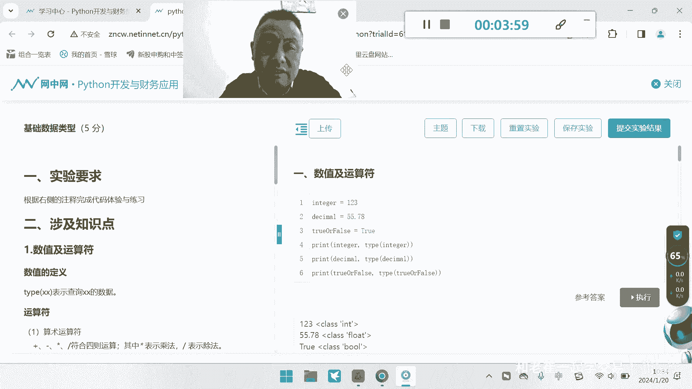

对自己的伤害是最大的啊，我不建议大家去呃，就是呃走捷径啊。

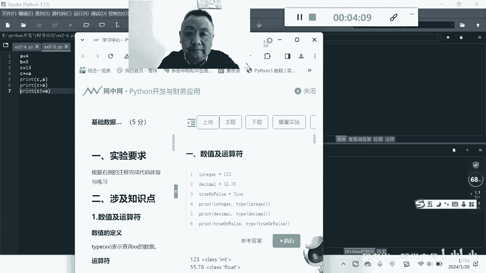

大家稍等一下。

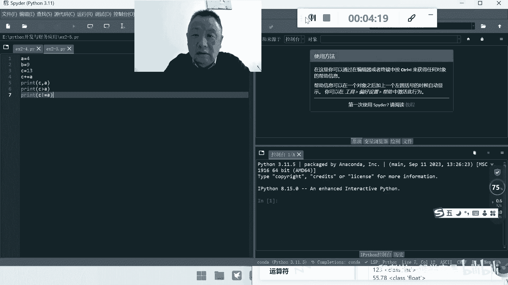

我调整一下这个窗口。

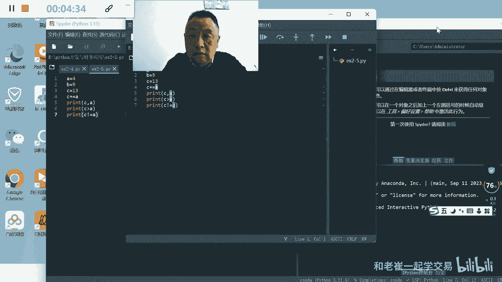

我把这个窗口先给他推下，然后把这个窗口最大。

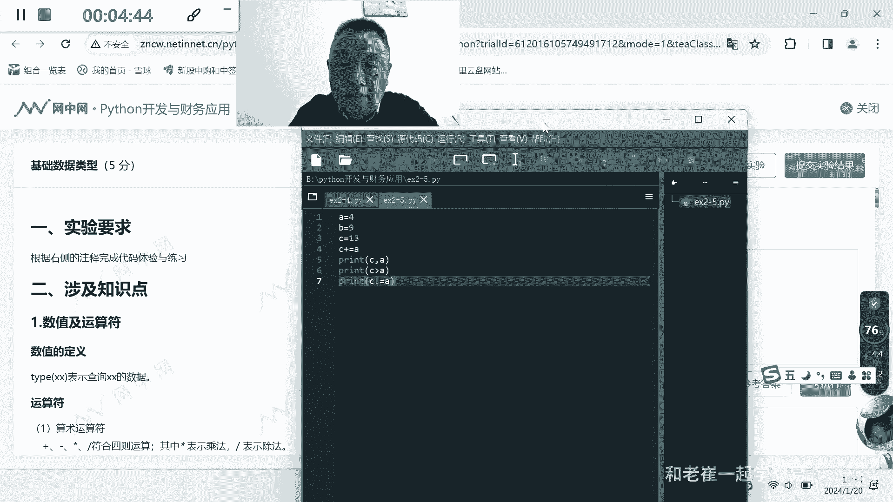

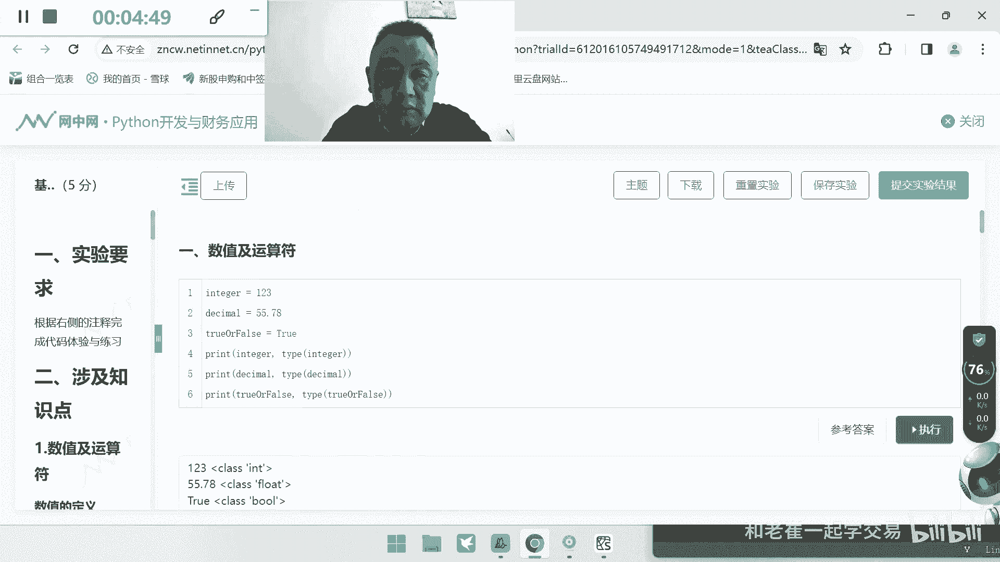

好这样就可以了啊，好接下来我们新建一个程序啊，live fire保存，养成个习惯对吧。

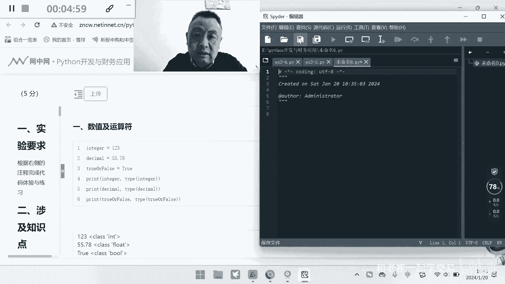

做完之后我们就要保存啊啊这个是ex2杠六，那么这个地方呢比如说就是我们运算符对吧，运算数字运算。

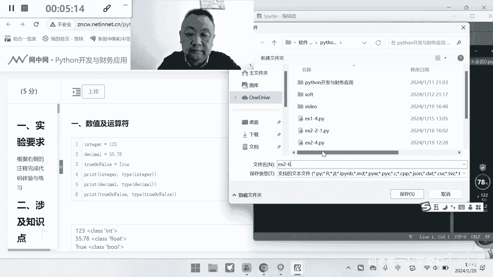

好做好了，这个地方我们先把它去掉啊，好来运行啊，第一我们来看一下这个题啊，叫做integer啊，他给了一个整形注意啊，建议同学们这个等号的一啊，前后呢也给他呃做成空格，这样看上去更好看啊。

Demo d c i n，等你，你没有这个等号也是没有问题的啊，也是可以的，这个地方我要数点七八，然后呢下面这个呢是我们的初TRE啊，注意看这个地方就是驼峰命名法啊。

false那么这个地方呢等于等于true，好接下来这三种数据类型，我们做完之后，我们要PRINT对吧，我们把它打印出来，然后这个地方比如说这个这个变量INT对吧，这是我们刚刚定义的一个VV是什么意思。

这就是我们刚刚定义的这个变量啊，V这就是变量的意思啊，然后呢TYPETYPE是个什么呢，TYPE是个函数，那这个函数可以干嘛呢，它就是可以测试一下我们定义的这个变量，返回这个变量的数据类型啊啊好。

下面一个一级PRINT对吧，那我们来看这个DEC，按tab键就可以啊，TYPE括号DEC，好print，那我就是建议同学们在学习这个Python的时候，就是TRUE，你照着敲程序。

然后呢去读别人的程序对吧。

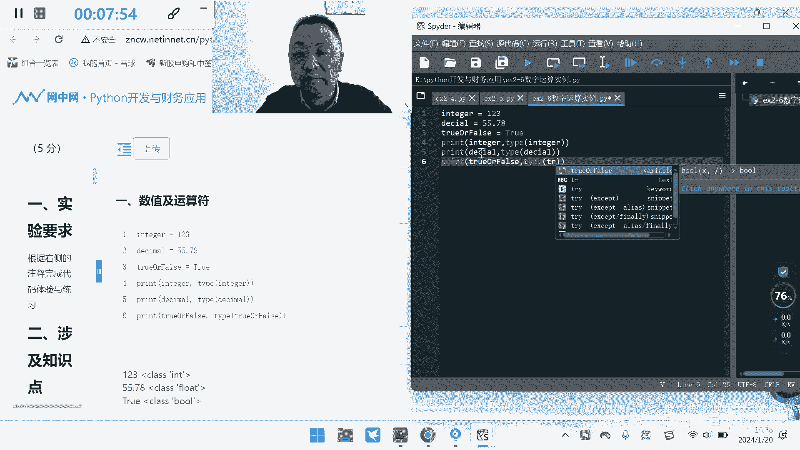

好，然后呢我们来执行一下这个程序啊。

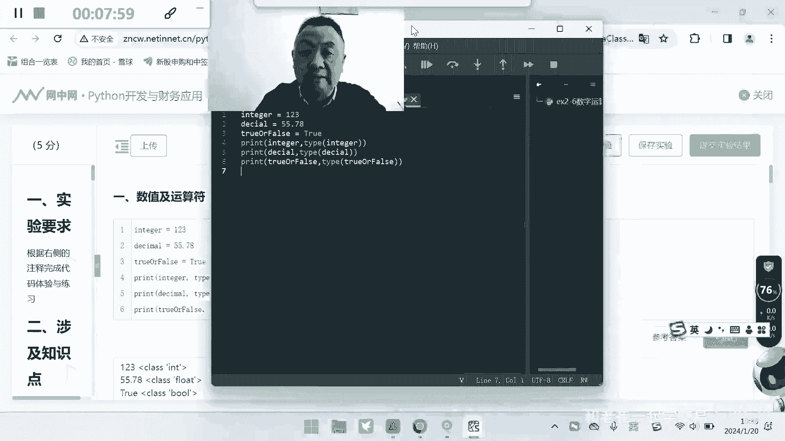

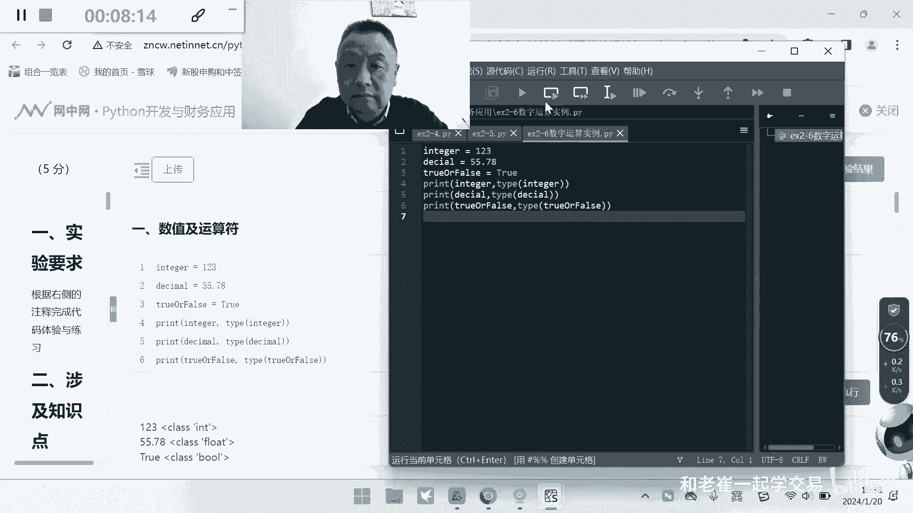

啊这个执行的结果在这里大家可以看到，这是我们的另外一个窗口，控制台窗口123123是什么，123是整形对吧，我们可以看啊，这个窗口不好拖啊。

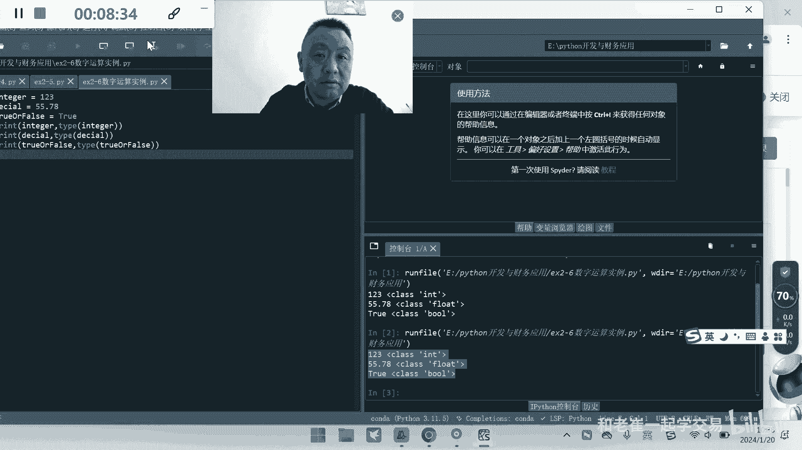

你看123返回的是整形integer对吧，55。78反馈的是float，看到这里是float，那么说明他是个浮点型，而true force是真的，那么用这个返回的是BR。

而这里的class class代表的是数据类型，这就是我们好，那我们说了啊，这个地方呢希望同学们写一点注释啊，写程序时经常要写初始啊，TYPE适用于测试，变量的数据类型的函数对吧。

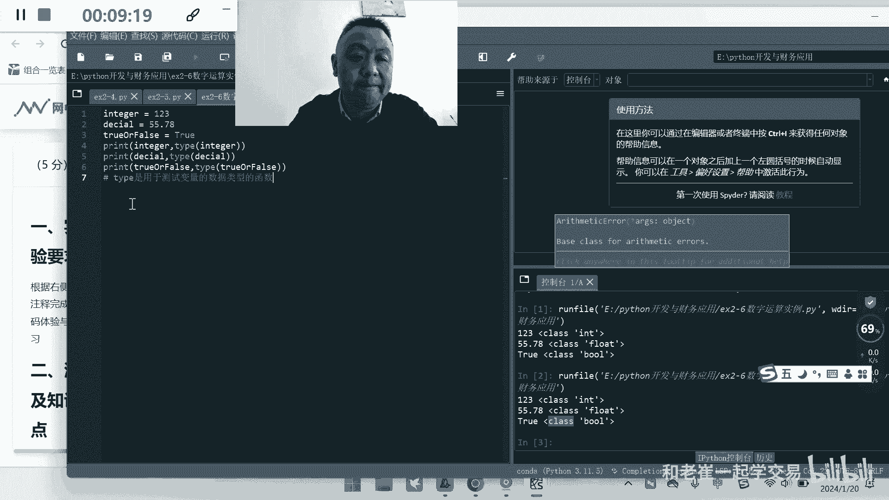

这是我们的这个题啊，好接下来我们来看下一个题啊，好算术运算符，那么这个时候大家注意看他给了两个两个值，A等于六，B等于十，然后我们来算加减乘方开方好，那么这个地方我们来做一下这个程序啊。

接下来好，A等于6B，B等于十，好那么接下来我们来测试一下加法啊对吧，加法，好然后呢PRINT打印出来打印什么呢，打印A加B好，来运行一下看看啊。

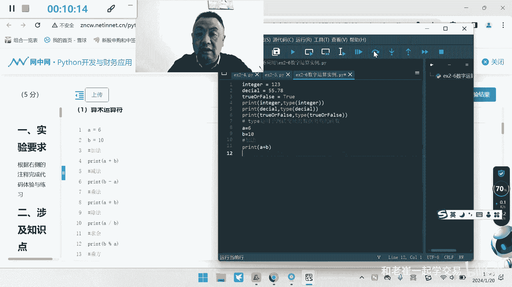

等下要回到主窗口才能看得见，看到吗，16是那前面的怎么出来了，老师我能不能全面的给他全部不要啊，好注意看啊，如果有的时候我们为了横幅，把前面的前面注释掉，还记得吗，我们怎么用的这个指令啊，先记住啊。

123对吧，然后在这个结尾的地方，123好，我们再来运行，大家可以看，那就只有一个字了，16前面这些就没有了，对吧好，那么这是加法，那么接下来我们来看减法啊，呃我留一点减法，做完以后。

我其他的话我就不给大家做了啊，呃大家去学着做啊，加减乘除乘方开方对吧，包括求仪啊，这些你看对吧。

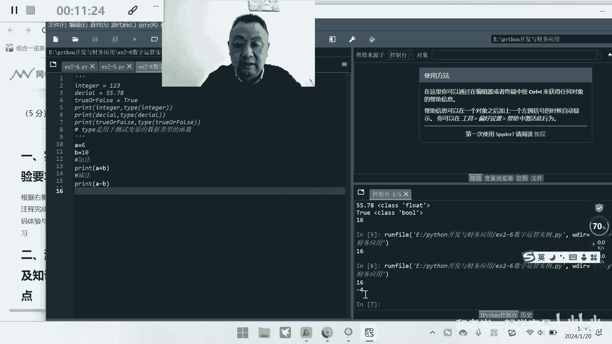

6-10四好，这个呢就留给大家了啊，这个地方对吧，我们这里就执行一下，看看好，下面我们来看这个题啊，叫做赋值运算符，这个我们也讲过什么加等减等。

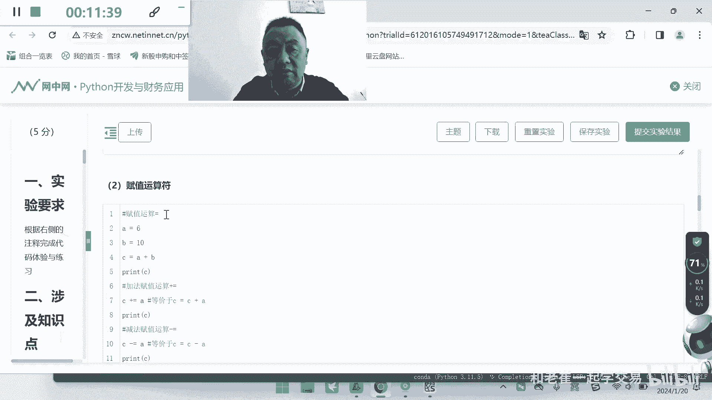

这个对吧，我们也做两个给大家看啊，好这个地方我们来接下来测试，就是我们大家学会经常写啊，测试赋值运算符啊，我们现在在做测试赋值，哎这个父子二，我用的是五笔啊。

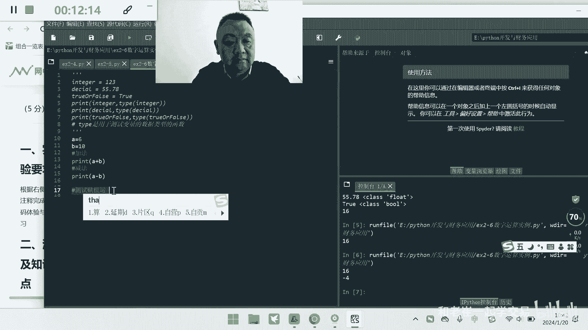

好，那么注意看，就是我们这个这个以及加等赋值运算符。

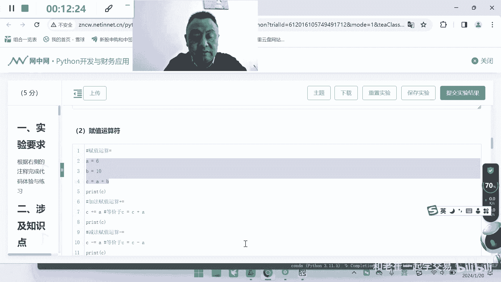

你看第一个例子对吧，A等于六，不是啊，这个地方他A等于六，B等于十，那C赋值为A加B对吧，然后呢，我们print。

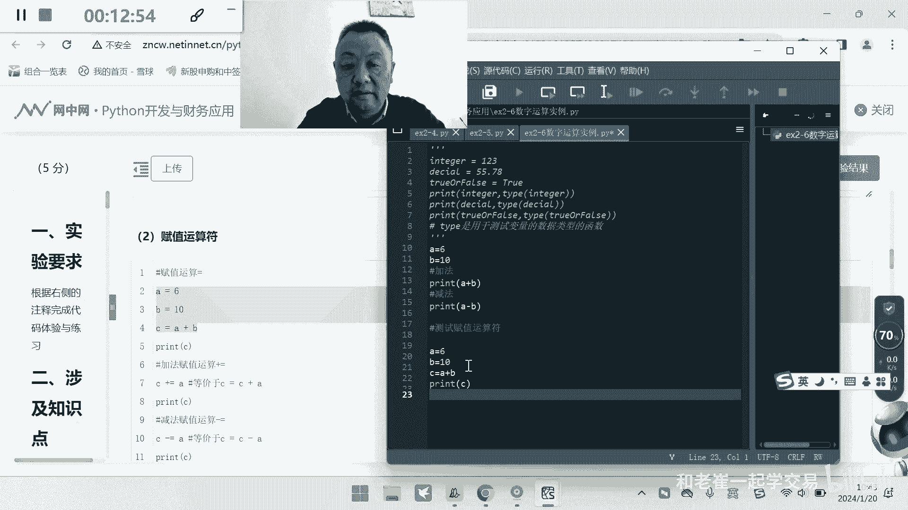

对我们来运行，然后回控制台去看结果好，注意看C等于A加B对吧，就是10+66，同样的我们把这三批给它拿过来，这个地方它就不执行了啊，16对吧好。

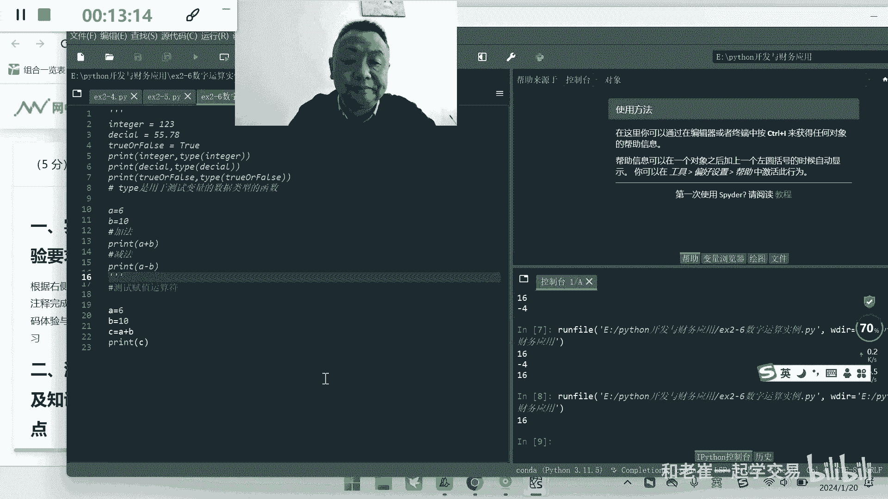

那么后面大家测试一下加等减等啊，这个乘等啊这种方式。

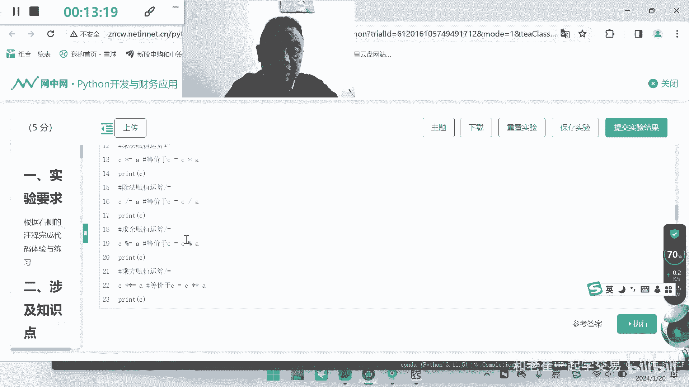

那第三种运算符呢是比较就大于小于这个啊，我们来测试一下，测试，测试这个不叫大于小于运算符关系运算符对吧，好注意，看我们还是一样的啊，ca等于六，B等于十，Now print，A大于B我们A大不大于B。

大家先看着你再告诉我啊，A大不大于B，好保存，CTRL加S啊，A是不大于B的，所以它是假的对吧，那么同时呢比如说我也建议大家用这个，比如说啊那A大于B，那我们就可以A是不是小于B了对吧，A小于B。

那这个时候大家应该看，应该出来一个什么结果对吧，应该出来一个真嗯，诶这个地方哦哈哈，这个地方不是我说什么，我做错了对吧，大家学会去看这个做错啊，这个不是B这是六啊，所以我们要不要啊对吧。

一定要找到原因在哪里看出好，这是我们的关系运算符，那我们这里呢还有第四种啊。

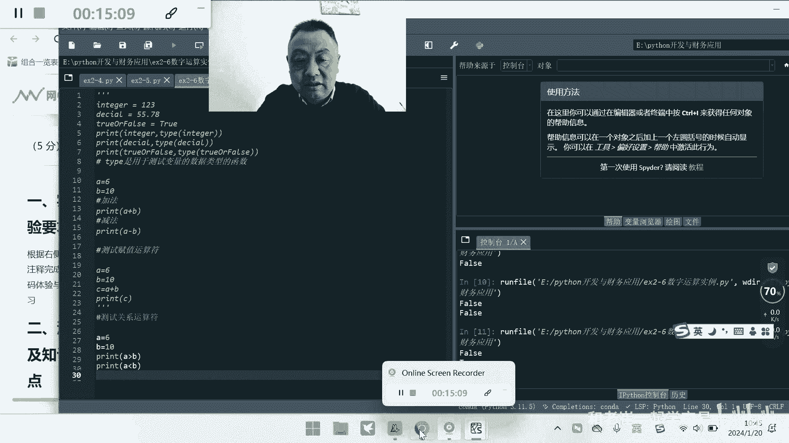

逻辑运算符就真假这种对吧。

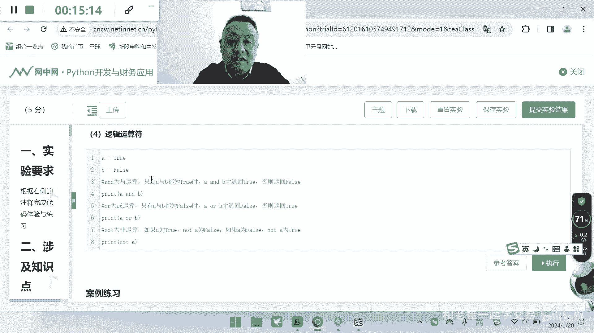

以后飞的啊，我们来看一下，好测试，好我们来测试逻辑运算符，我们先把这三品拿过来对吧，前面我们都不执行，他这里拿过来，我们怎么弄呢，一样的A等于true，就是我们的真，B等于我们的force。

然后print p r i n t，来a and b，真的和假的做与运算，它的结果应该是什么。

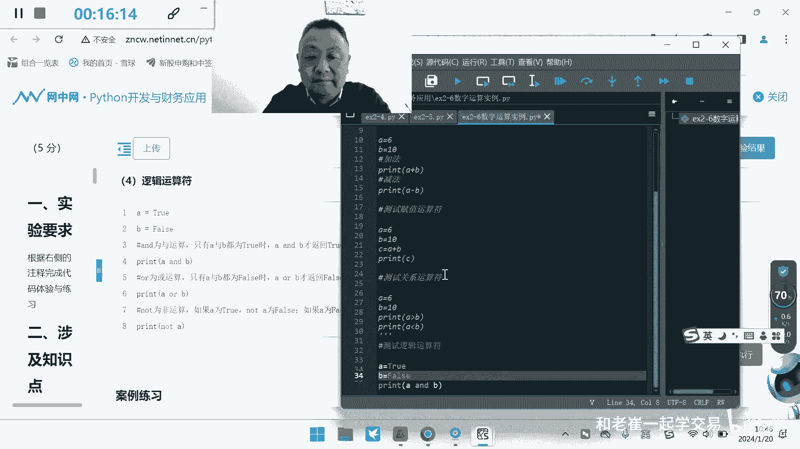

你要自己学会去做啊，看是什么force，那在什么情况下，这个才会变成真呢，啊注意看我们要在这个地方变成什么，不好我们再来一次，真的啊对吧，所以希望大家去做一下这个运算，今天这个例子呢。

说白了就是书上有很多的例子对吧，书上有很多的例子，希望大家去吧，我们所学的加减乘除大于小于等于嗯，已或非对吧，甚至这几种混合起来，大家都去做做这个运算，好感谢大家关注和支持，崔老师。

第二节课我们就说完了，那第三节课我们将会介绍字符串类型啊，字符串的也是我们比较常见的一种类型啊，希望下节课能够再遇到，大家好，感谢您一直以来关注和支持，崔老师，知字符串的运算。

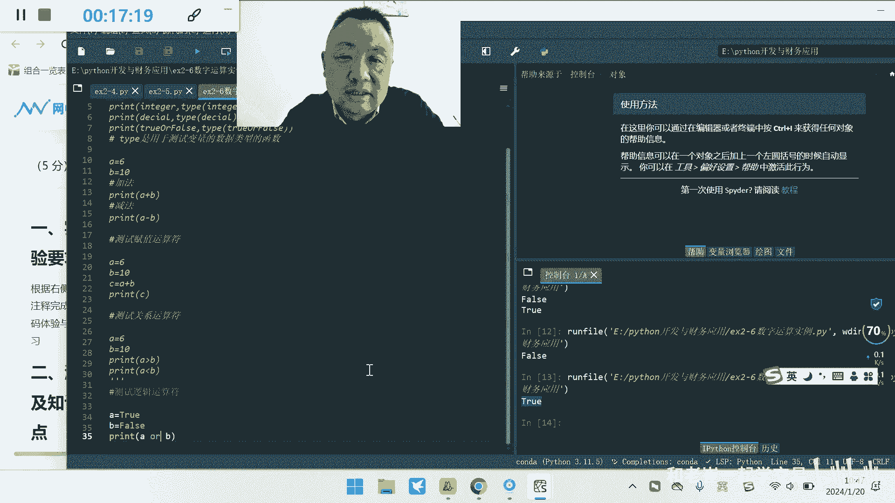