# python开发与财务应用2-7 字符串变量及format - P1 - 财富书友会 - BV1CZ421t75k

欢迎大家来崔老师的课堂学习Python的知识，上节课呢我们也介绍了关于运算符啊，就是数学运算符，那我们知道了加减乘除，乘方开方知道了大于小于等于等于啊，知道了乙或非嗯实力也做了，那上节课有个小尾巴。

我们先把它尾巴剪掉，然后呢，我们讲今天的一个重要内容叫做字符串啊，好那么这个小尾巴是什么呢，题题目是这样的，大家看就是说小明今天吃早饭，中饭晚饭分别花了那么多钱，请问小明一天花了多少钱。

每顿餐花了多少钱，好我们来编程实现这个小程序。

好啊，我们来做一下这个小程序啊，所以被挡掉了，稍等一下，那首先呢我们用第一顿饭，第一顿饭等于多少呢，等于6。5元对吧，是6。5，第二顿饭啊，我们叫做13。65页呃，第三顿饭。

啊我们把这个头同法用起来对吧，啊第三顿饭等于多少呢，十块295啊，然后请问总的花了多少钱呢，让我们用个total加上FEI等于什么呢，等于first，你看啊SPA好在哪里呢，就是你打完一半以后呢。

它就会出来这个变量，然后我按一下tab键，你就不用打了对吧，SEC那加上TH可以，然后我们看average啊，a v a g e free等于什么呢，等于上面这个数等于total，除以三等分对吧。

然后呢我们就输出了啊，Print，输出啊小明，总共花了多少钱呢，用我们上节课学的内容对吧，A total free，嗯这个输入法要关掉啊，然后平均花了好输入法关了啊，Average，然后再加个圆。

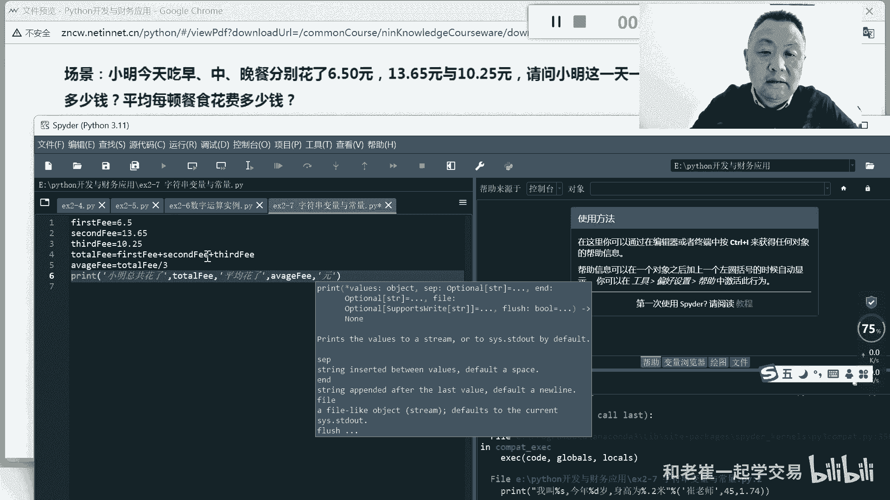

好然后我们运行一下程序，注意看对吧。

就是这个程序，当然现在这个很烦对吧。

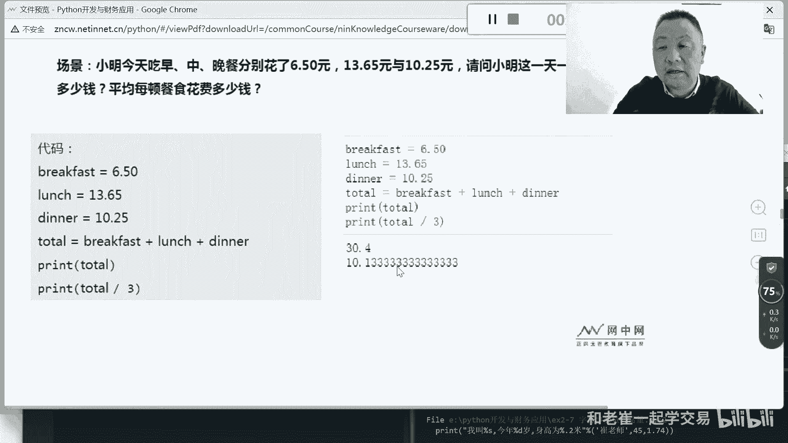

有很多的老师为什么跟他们不一样。

你看人家的输出啊对吧，人家只输出了这个子。

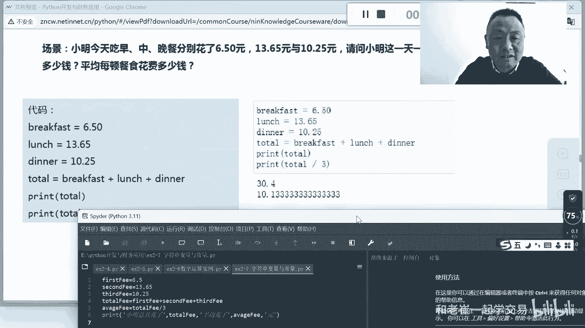

本身我是把这个也输进去了，所以你要搞懂啊对吧。

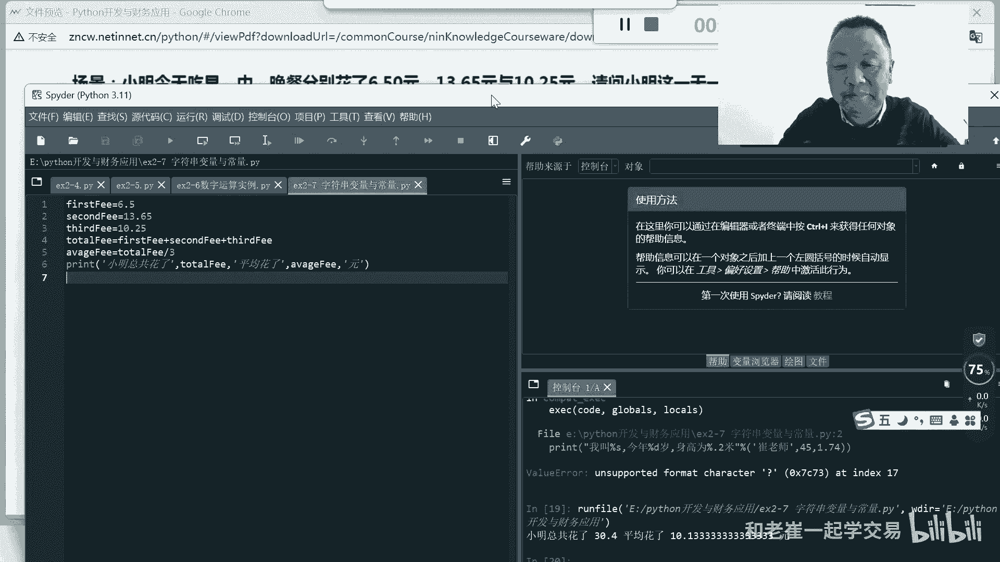

有的同学对你有这个心很对的对吧，你要知道老师的程序为什么跟他的不一样，输出对吧，他在这里好，接下来我们来看这个，啊我的笔记本快没电了，稍等一下，我把电接上啊。

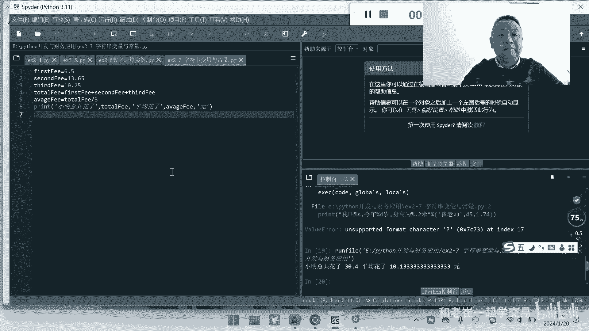

好那么下一个呢我们来看这个啊内容，他说这个小数位很烦，所以呢给了大家这个呃一个小函数啊，叫run r o u n d这个函数，那么这个函数是干嘛的呢，啊对第一个数值起几个小数位好。

那么这个地方我们回来看啊。

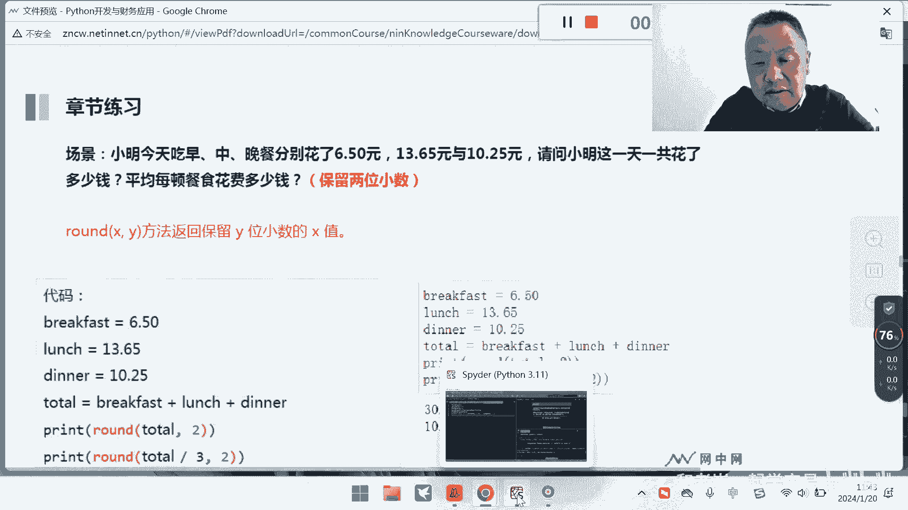

那我们要怎么办呢，啊这个地方有两种办法，第一种办法你可以在这里用这个函数，你看ROUN我们起一位吧对吧，然后我们这个地方七位好，这是一种办法，第二种办法你可以在这个地方起，你看啊看啊ROUND。

然后这个地方起一位，好我们再来运行，啊他说这个玩意没有被定义过啊，少了个什么，这个出错大家要学会看了啊，不能什么都等着老师name啊，name round is not defined对吧。

那说明这个单词有问题，那你就回来找这个类型嘛对吧，那就建议少了个什么嗯，好大家看两种方法都是可以的，你可以在这个地方用这个函数来做，也可以在这个地方用这个。

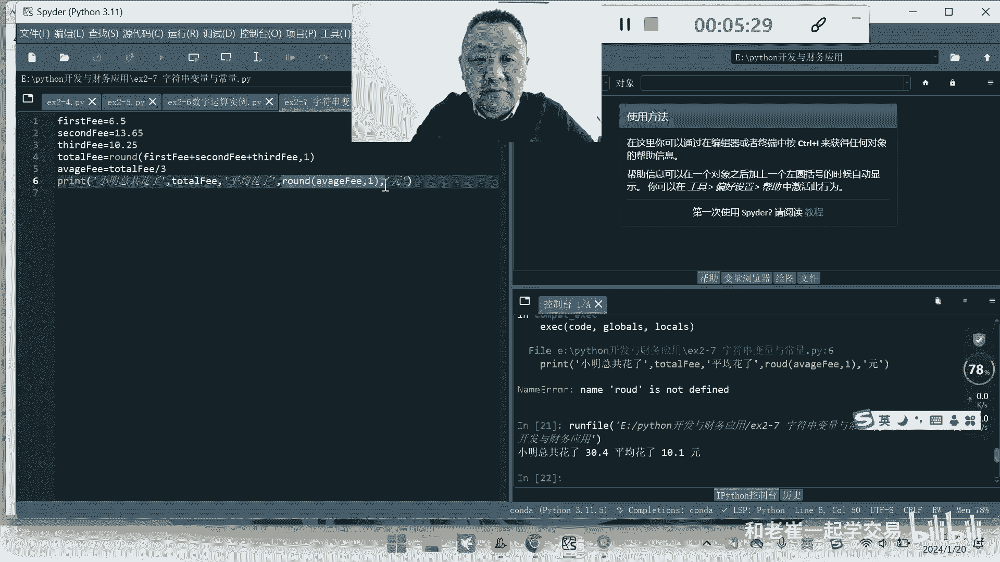

对吧好，这就是这个粒子状的，好接下来我们来看字符串的一个内容啊，字符串是什么啊，就是我们日常生活中在处理计算机，在处理数据的时候，两种常见的数据，一种是数字，另外一种是字符，用字符是什么呢。

字符是单引号，双引号括起来的任意文本，这句话简单的，实际上大家还可以加两个词叫做常量，请大家注意常量，常量是什么，常量就是我们不会改变的量，不会改变的符号啊，这种叫常量，单引号，双引号括起来的。

但是有的时候没有办法呀，如果我们这个字符串本身里面就含有这个什么，单引号，双引号啊，换行啊，反斜杠杠这种符号怎么办呢，那我们加一个反斜杠来进行标识，比如说反斜杠加单引号就代表单引号。

反向克加双引号就代表双引号，那么有用到的时候，你要学会用这个反斜杠的方式来进行一个表达，那么字符串的常量我们说了，那什么叫字符串的变量呢，他是首先来说它是一个变量，是自定义的一个变量啊。

这个地方你要注意知道我们去定义的啊，某一个符号，它的变量它本身可以传字符串的常量，那么这种变量我们要字符的变量啊，你要清楚对吧好，那么字符串里面有这几种常规的操作啊，一种呢就是从头从左到右的。

这个我们叫做正索引啊，从左到右的啊，012345，因为Python语言它很多是根植于C语言的，它的数组的这种方式，就字符串这种定位啊，索引这种我们有的时候叫下标，那这种方式呢它是从左到右开始数的。

0123456，但是呢同时Python也提供副索引，就倒回来的这个数字啊，就是一负二负三负四负五啊，这种方式，但是没有零之说啊，请大家注意，没有零之说，所以它可以正着数，也可以倒着数。

那么通常我们用一个字符串加上某一个数值，那就代表的是某一个字符串，里面的某一个子串啊，注意这个地方，比如说我们这个地方讲name1，它就代表的是B对吧，比如说啊我们的name4啊。

name4就是F它就代表的是一个它子串，在这里大家注意好，这是求求定位，求某一个位置对吧，那字符串还同时还提供了四种操作，注意只提供四种操作啊，那叫什么呢，叫A加B我们叫做连接，什么叫连接啊。

这个是A这是B两个在一起碰在一起啊对吧，在其他语言里面还提供减法，但是Python里面目前为止啊，它提供加法啊，那加法是什么意思，加法就是两个完全连接起来，减法呢在呃这个PSP里面，它是叫做不完全连接。

它会省略一部分空格，但是看上去两个都像一样的对吧，加法那第二种方法呢是乘法，乘法是重复输出，比如说A乘上某一个数五，那就把五个A打出来啊，注意这个地方好，第三种呢就是通过索引来起。

那么这个索引呢就是下面我们要给它一个数值，找这个位置啊，找这个位置的值是多少，比如A5就是第五个位置的A4，就是第四个位置的A3，就是第三个位置的，然后呢还有一种呢叫做切片，就是用一个冒号。

冒号代表的是什么，从什么位置开始到什么位置结束，请大家注意从什么位置开始到什么位置结束啊，比如说1~4，那么是从第一个位置开始起到第四，但是不含最后那个位置，请大家注意啊，这些细节你要小心啊。

那么这是运算，那第三呢我们就要来讲这个字符串的格式化，什么叫字符串的格式化啊，就是我们要用一些方法，来对字符串进行一些规范啊，这个地方第一种规范就是百分号的方式啊，我们叫它隔号啊，带百分号。

那么有这么几种常量啊，第一种百分之D代表的是数值，百分之D数值，那么这里呢我有两点要提醒大家注意，因为你们在做字符串格式化的时候，有的时候有中文，有英文，请大家务必小心。

要用英文状态下去输入100%分之20，百分之F，百分之D代表的是整数，百分之S代表的是字符，而百分之F代表的是浮点型，浮点型就是小数，小数呢有的时候会带一个数值，数字代表的是小数的位数啊，这是第一种。

就是用百分号的方式来做，那么注意有两个地方有百分号，你看目标位置有百分号，后面也有一个百分号，把它框起来对吧，第二种方法呢就是我们用大括号啊，有三个有几个大括号无所谓啊，有几个大号。

那么后面呢会增加format这个函数，那么它是用对应的关系对应，就第一个大括号就对应的第一个变量，第二个大括号就对应第二个，那第三就在format里面呢，我们也可以起定指定你是第几个。

第零第一第二第三个对吧，你也可以是什么呢，用数字的格式化来做，就这个地方啊注意看啊，我们用数字的方式来做这个格式化好，这是我们的一个字符常量，请大家注意这个format format的一个一个小时好。

我们来看一下作业，好，作业里面呢大家注意看有关数据类型，说法是Python的数据只包含数字字符和布尔型，整形就是数字型，对的对吧，这个是字符串的，只有这两种值，对不对，答案是谁，对吧。

答案是A2字符串啊，A等于二，B等于四，那么请问用来计算，A的四次方，下面你觉得可能实现的是，首先你说B对不对，诶D对不对，你就带个数字进去看看嘛，对不对，这个是立方对立方肯定是不对的。

关键是A和B和B和A对吧啊，这个我也拿不准啊，等一下大家进去算一下就知道了啊，好第三题，真或假，这个与运算，那么这个不用看了，因为一乘任何数等于任何数，关键看这个二大于三吗，不大一，所以这个是假的对吧。

二等不等于五不等于，所以它是真的，所以后面就不用看了对吧，所以答案是B好，第四题还是有意思的对吧，A字符串连接运算，但是这个地方他看你想不想先算谁对吧，先看谁，你是先上这个还是先上这个。

哎这个呢大家等一下我们试试看吧，留点悬念给大家好，能不能被同时三和五同时整除，那么这个地方就是百分号，你用IT除以3%等于零，就是整除了同时同时嘛，所以要用and同时它又被无能够整除的数对吧。

这个是用位置去定位第一，第二个位置012对吧，C2到四，请大家注意这是230123，从零开始啊，0~3就是0~3，注0~3，第一个0123就是你要记住它是从零打头，就可以3~5，注意不含五啊，不含五好。

那么这个呢是我们的一个呃小小的一个呃，就是我们第二节的第一个问题，就是我们讲字符串，那么好，我们来做几个实例给大家啊，大家心里有个数啊，好我们写一下这个代码吧。

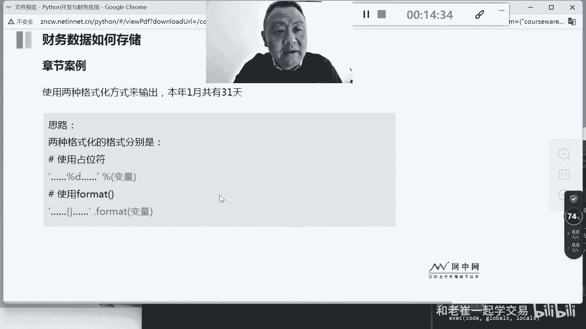

好这是字符串的这个啊，那我们就用这个吧，就用这个小时内，好下面我们来看啊，这个实例我们要用的是，Print，我们用百分号定义符对吧，作为定制服好，那我们来写了啊，PRINT对吧，然后单引号啊，我是。

百分之S，今年注意啊，注意这个中英文状态对吧，税，升高，好这个怎么把它拼进去啊，注意看是用百分号给他拼进去，然后呢我们带括号好，第一个出于老师对吧，好书法，关了第二个45岁，哎呀暴露年龄了1。74对吧。

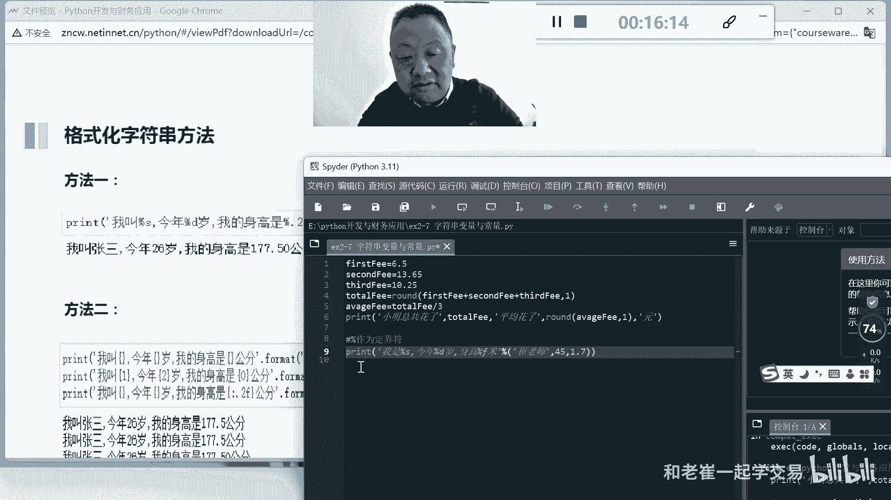

好我们来运行一下这个程序，对吧，你看他就可以把这个替换掉，替换掉，第一个变量在这里，但是你们发现没，这里有好多个1。74000，原因在哪里呢，原因是这个地方对吧，我们没有说小数位有几位好，我们两位好。

打两位对吧，这个是小数位数好，那第二种方式呢，我们用这个format format来做，定制服，好我们来看一下这个format做定接符的啊。

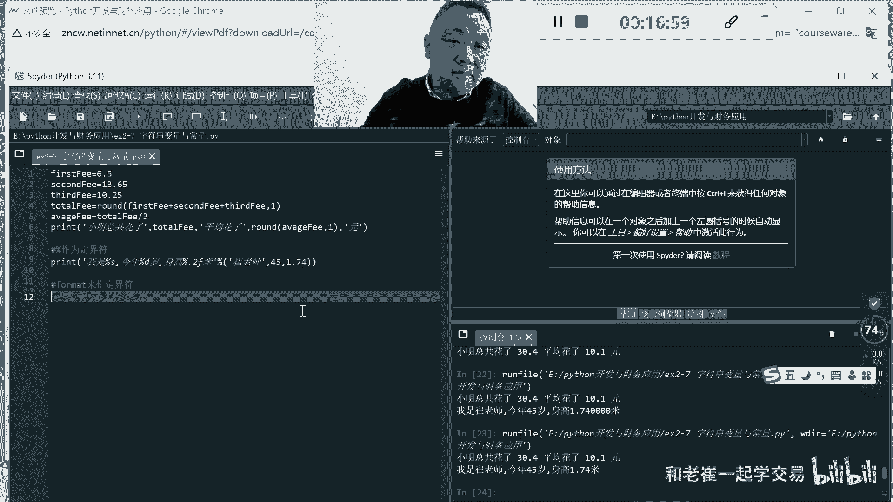

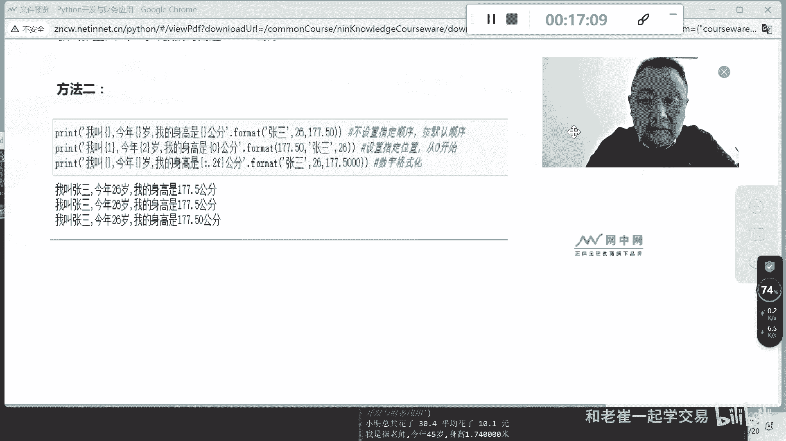

好我们来写这个程序pr啊，不要偷懒啊，对吧，我讲课可以偷懒，但是你们不要偷懒啊，这个是用大括号啊，请点，身高，对吧，然后这个地方我们就要用到一个函数，叫做d format，好第一个变量啊，崔老师对吧。

好第二个变量啊，嗯45，所以第三个变量1。74好。

我们运行一下，看，但是米没出来对吧，这个地方我们还要来一个米，好看TRLV对吧，这是第一种定界符啊。

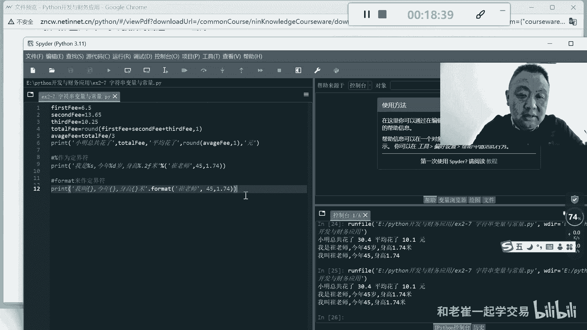

呃这个呢留着大家去了啊。

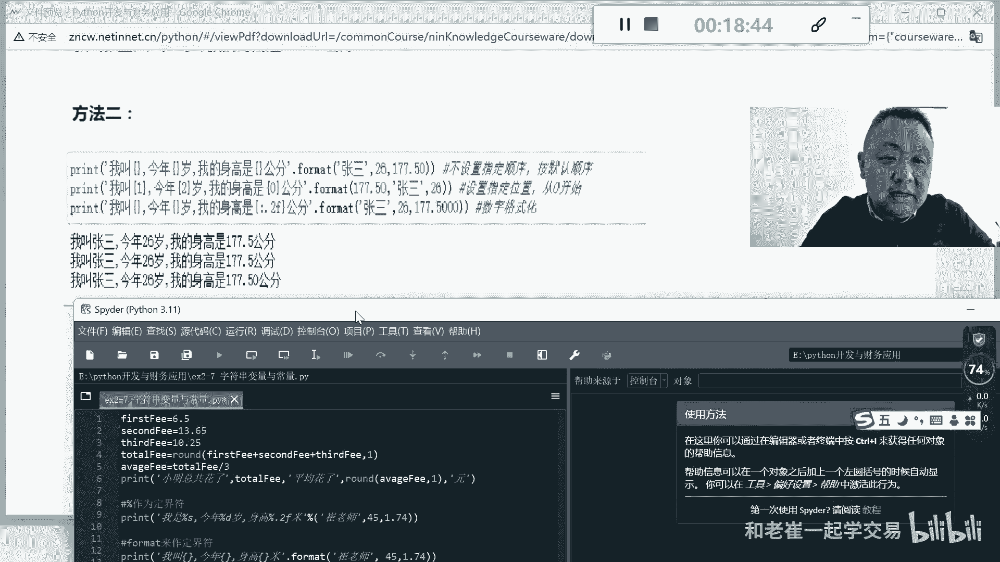

就是我们不用不讲了啊，这两个大家自己去看。

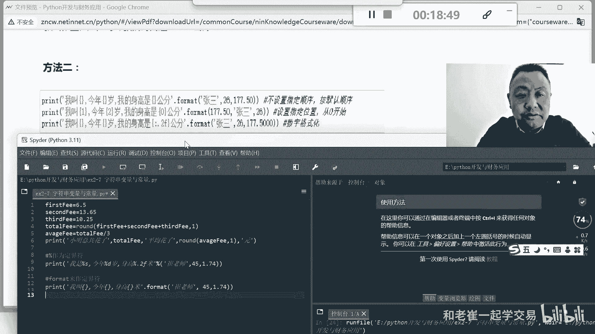

书上也有对吧，好，这是用format来做啊，那接下来我想给大家看一下这个题嗯，我们来看一下这个A等于二。

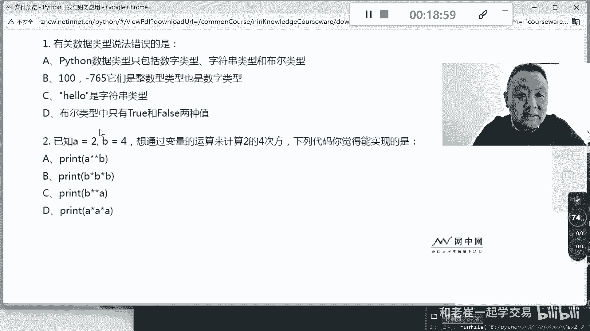

这个我们要算二的四次方，A等于二，B等于四，Print，A乘B，然后B，B a，Print，A乘，好啊，重点是哪一个对吧好，大家看二的四次方对吧。

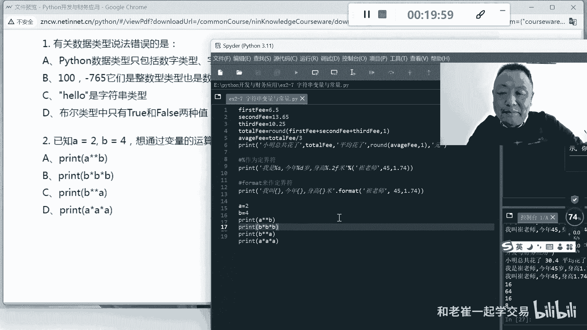

答案是谁。

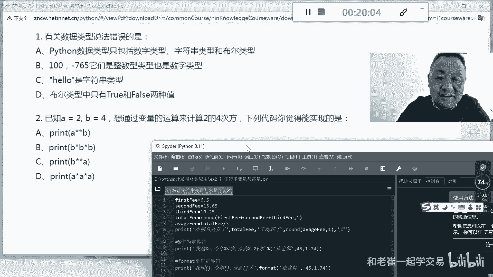

注意二的四次方和四的平方不是一回事哦。

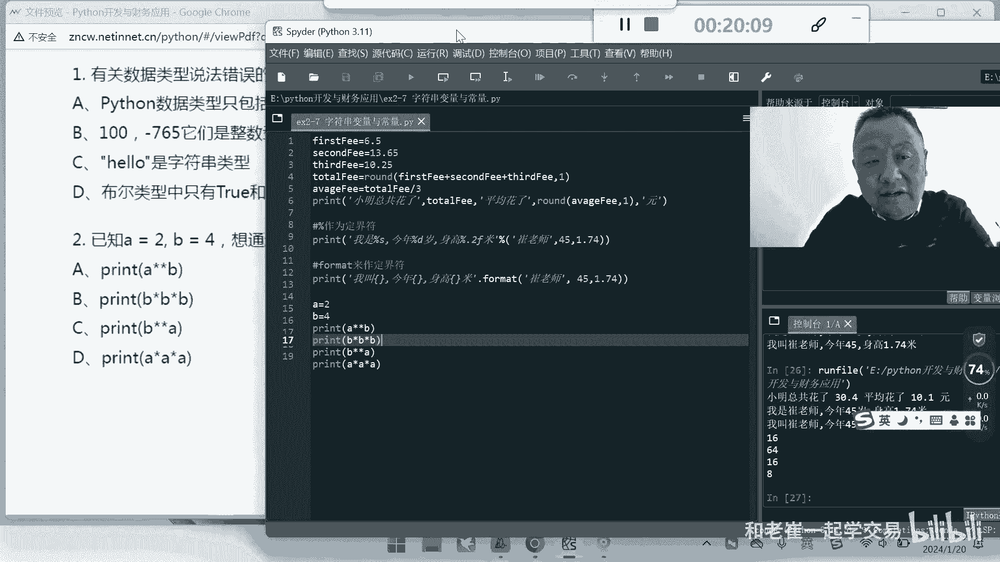

请大家注意二的四次方和四的平方，结果两个都是一样的。

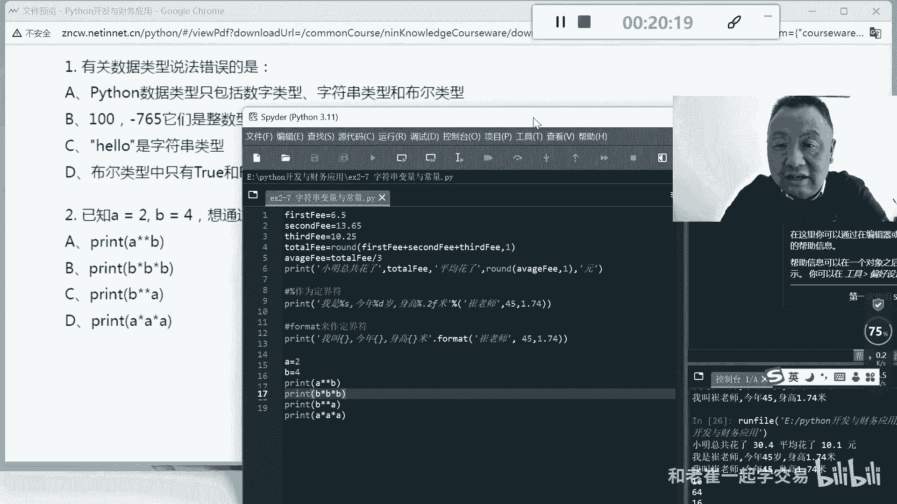

你看这个挺厉害，在哪里对吧，那是那我怎么知道哪个是哪个呢，简单吗，你把这个数换掉，他们就不，哎有的又开始纠结，老师二的平方乘二的平方对吧，4×2也是这样的啊，不是的，你要理解啊。

到底二的四次方是哪一个对吧，你理解的了就可以去做了，好那么这是给大家的一个例子。

我们还是要请大家看这个例子，我觉得这个也很有意思。

就是print我们直接输出了啊，双引号ab加上C乘以二，我们看他先算谁，重点是这个地方，我们先算的是谁，我先算的是CC对吧，我们先算是cc啊。

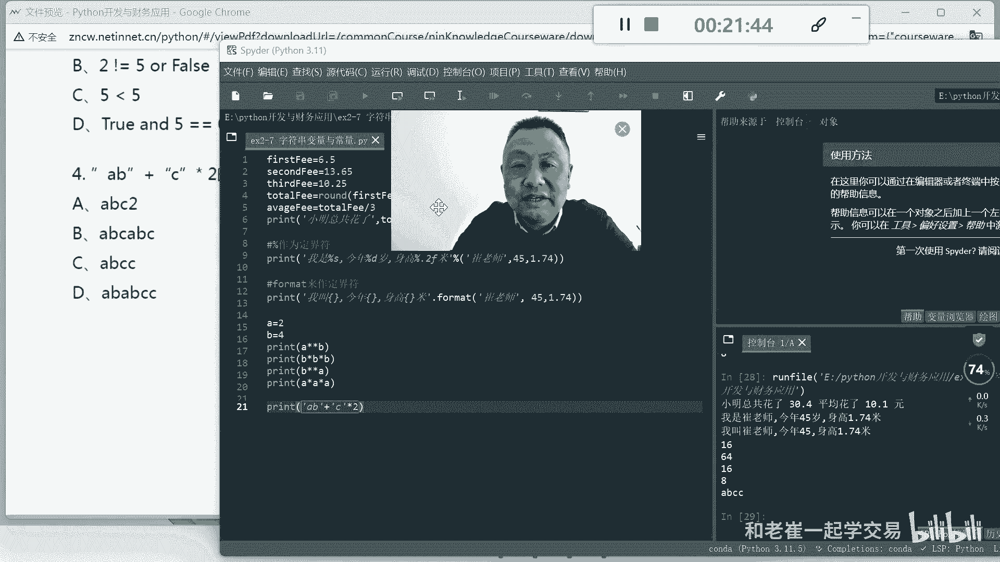

好那么感谢大家关注和支持，崔老师，关于字符串部分呢，我们就说完了，那么下节课我们将会介绍高级数据类型，普通型的我们就讲完了呃，高级数据类型啊，这里要说一下，因为下星期我要去旅游对吧。

准备去苏州杭州转一下，所以这个视频会更新，今天明天会更新的稍微多一点，下星期大家慢慢学对吧，我会把第二章啊，在我出发之前把它更新完掉啊，让大家心里有个数啊，让你后面的高级数据类型呢有列表，有原主。

有字典，有三种类型对吧，然后尾巴上面有一个数据类型的转换，主要是介绍常规的一些数据类型，给大家好，感谢大家关注和支持，崔老师啊，祝大家学有所成，学有所获，也希望大家在学习的过程中，如果有问题。

那么给我留言啊，你们的互动啊就是老师前进的动力啊，我觉得老师存在的意义，就是要跟学生解决他们在学习，学习过程中的啊各种各样的问题好，祝大家开心快乐，提前祝大家春节快乐。

