# python数据科学工具-025-pandas-向量化字符串操作 - P1 - Vivianzjzjwwy - BV1ChD5Y1EUA

Python的一个优势呢是能够，他能够比较方便的去处理字符串数据，那么在这个基础上呢，pandas呢提供了一整套完整的向量化，字符串操作，就是vectorized string operation。

那么在我们在处理这种现实世界的数据时候呢，我们需要有时候需要清理这些数据，那这个时候呢这种操作呢是必不可少的，那么这里呢我首先看一下这些操作对吧，我们把这操作都走一遍，然后呢我们再拿一个例子。

这个例子呢是一个从互联网上搜集过来的，一个食谱数据集，它里面的数据是相当的混乱，那么我们呢可以做部分的清理，那么前面呢我们已经看到了像南派呀，pandas这样的工具呢，我们能够把数学运算呢进一步通用化。

所谓的通用化是我只需我能够很快的啊，在一个数组上，在他任何成员上，全部成员上执行相同的运算。

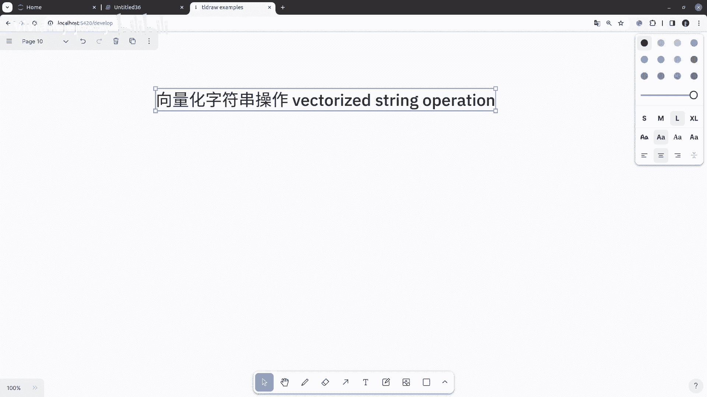

而譬如说，我们有个数组mp点LA，嗯2357十一十三，Yeah，Ok，那么你原来这个算术平算只能在标量上进行，也就是简单数据类型上进行，那我现在用整个数组去乘以二，实际上是在数组的每一个成员上都成立了。

那这种操作我们前面已经讲过了，它叫做向量化操作，在这里他是通过广播来实现，那么有了这种操作以后呢，我们在处理数组的数据时候呢，我程序写的很简单啊，我们不需要考虑，并且呢不需要考虑这个数组的大小也好。

形状也好，我们只需要考虑我们想做什么运算，对现在这里我们只考虑只要做乘法运算，我就直接写个乘就好，但是呢对于字符串这样数组呢，能排是没有这样的能力的，他没办法这么简单的去做这些这样的事情。

那这个时候你就要回到原来的哎循环，或者你要用列表包含去做，譬如说我有这样的data，对啊，这对他这大小都不好，那我想对他做清理，让态度比较整齐，那这个时候你只能用列表包含S这。

And i capitalize，Yes，For s in d，这样就干净多了，当然有的时候你这样就可以了啊，我用列表包含或者用循环做就OK了，但是如果这里面有缺失的值，这种方法就行不通了。

譬如说这样里面有个缺失的字，这个时候如果你还是用列表包含的话。

那就出错了，因为NTYPE对象它没有这个capitalized的这个方法，这个NN是nine type对象，那么pandas0他就提供了一些，它提供这样的功能，它可以呢哎进行向量化的字符串操作。

而且呢它能够正确的处理这种缺失数据的情况，那它是通过series或者通过index对象的STR属性啊，我们看个例子，首先我们从前面这个缺失了，有缺失数据的data里面。

我们创建出一个cs对象来PD点release data。

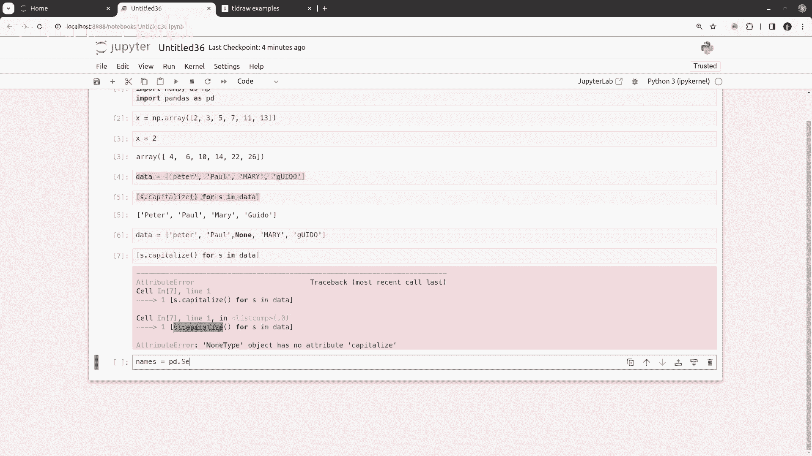

啊这个他就有一个其中NN他是没值的缺失的，现在呢就可以用他的STR这个属性，有了这个属性以后，我就可以调用，你可以简单的认为他是在调用，类似原来的这个string上的这个capitalize。

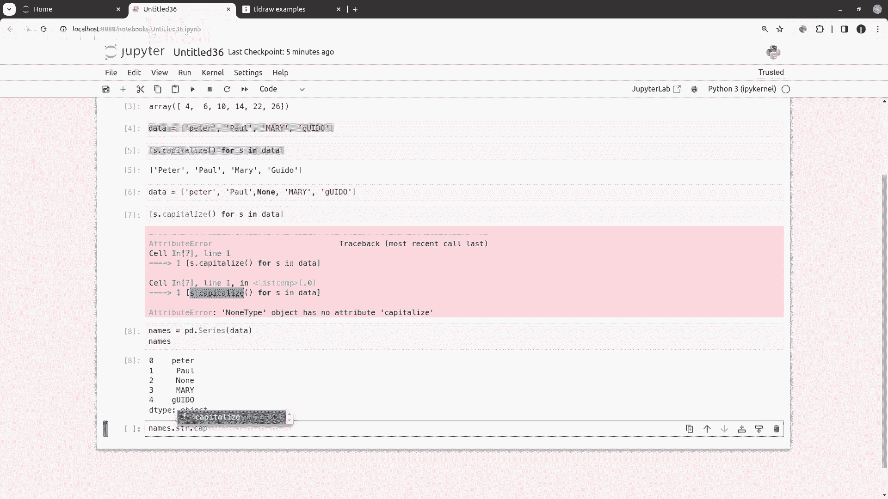

这个时候你看，哎全部做好了，那么你还可以看一看name，点STI，点tab键，几乎你能看到的string上的，原来string上的方法呢，现在也都在这里，都在这个SSTR属性下面都有对吧。

那我们下面来看一看到底有哪些。

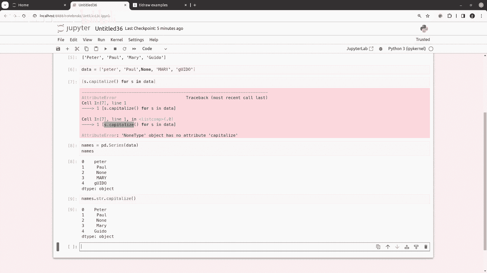

在这之前呢，我们先建一个数字符串，后面可以用啊，这个字符串，好那有哪些函数呢，就是说这些函数实际上看起来呢，是跟原来这个字符串，Python的字符串函数呢是一模一样的。

但是呢它其实呢是通过这个CDS对象的，SSTR属性，它映射过去的，我们看看有哪些函数。

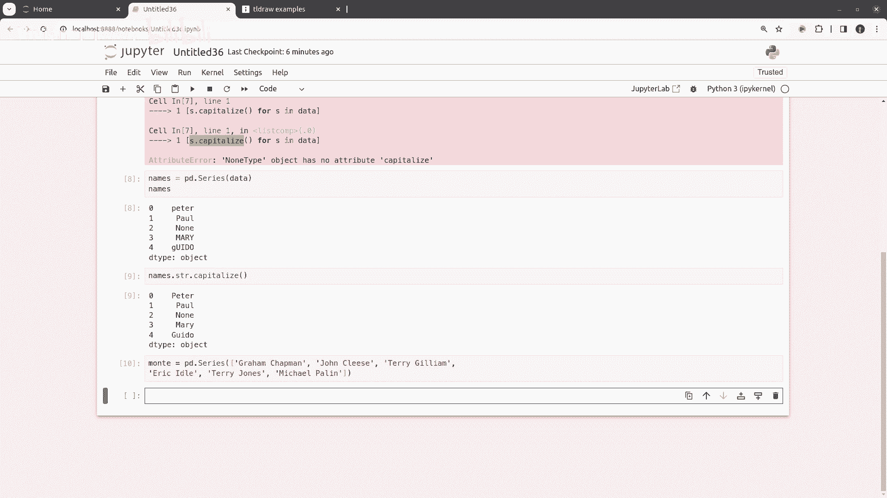

这个大便这边有这些呢，基本上映射了原来咨询上的一些，大多数的一些方法，但在这些方法里面，你要看它返回的值不太一样对吧，我们如果以原来是string对象上的方法来看呢，这个LX他就会返回一个整数，Loa。

当然仍就返回一个字符串，那像sties s它会返回一个布尔值，还有呢像spirit这种，它会返回一个列表，那么这也体现在我们的这一个好的。

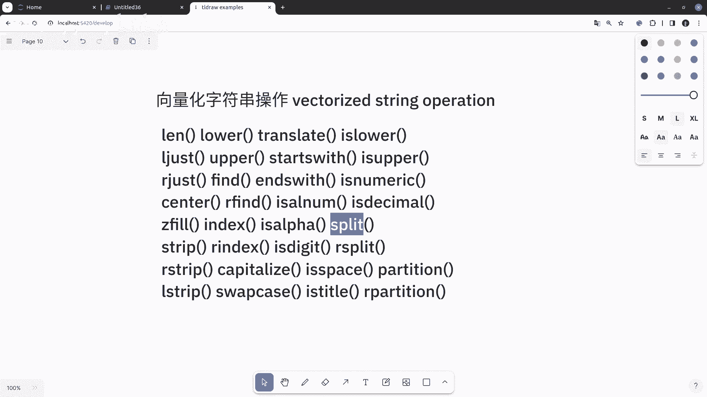

string属性的映射出来的方法上，is a str点lower，这样他当然是返回一个string的series，但是如果我们是length，他就返回一个整数的一个series。

或者我们是点start with啊，Starts with，Stars is，这样就返回一个关于布尔的一个CVS，对布尔的一个CVS，甚至是我们我们点spirit，那他就返回一个关于列表的一系列。

那后面这种关于列表的系列四呢，我们会经常会看到，另外呢还有一些方法呢是接受政治表达式，他们可以检查每一个字符串成员的内容，然后呢，它的函数的使用方法呢，也是跟Python内置的这个IE模块。

正则表达式模块是一样的，那么我们可以看看他们这个映射对应关系。

实际上也就是我们刚才就讲了，在pandas s str上的这些方法呢，其实是映射到额对应的Python里面的方法啊，像这里我们映射到RE模块里面的方法和函数。

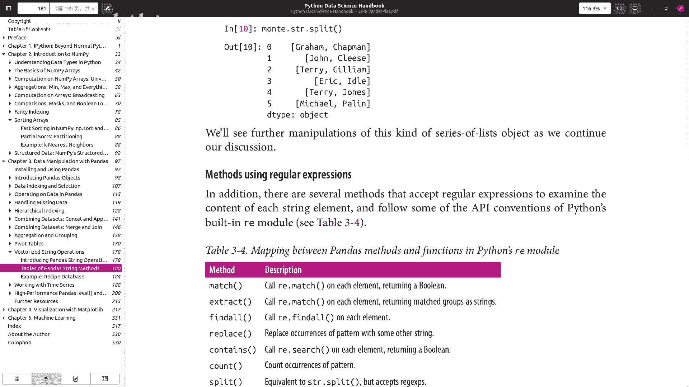

但是呢它区别就在于，它是在每一个层面上都去做这个事情啊，比如说这个match，这个match原来是在某个字符串上去做的，那现在呢我可以在每一个成员去做，然后呢返回一个值。

因为这个match本身是返回一个布尔的，那最后呢在每一个成员上做了以后呢，它返回一个，布尔的series，而不是单独一个布尔，其他都一样啊。

像这extract extract是他在每一个层面上做个match，然后呢你在这个正则表达式等下，我会看到例子，在正则表达式加上组，加了组以后呢，就把返回的组呢呃，就把匹配的组呢作为字符串返回出来。

I find out，也就是我们分派到R1模块的方案，到二上去，只不过在每一个成员上都去执行，那replace也一样，我给他一个模式啊，然后给他要他要替换的这个字符串，那这个时候呢找到模式以后。

找到模式以后呢，我用字符串去匹配，匹配到了那个字字符串content，那就是先用search，用search i点search，在每一个层面上进行设计。

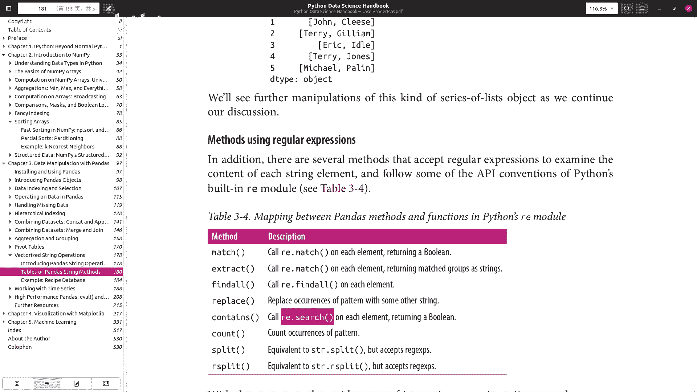

返回的也是一个BD的series hunt呢，我给他一个模式，分子表达式模式，然后计算这个模式出现的次数，只不过也是在每个上，那么spirit就是spit，但是呢他接受这个IE政治表达式。

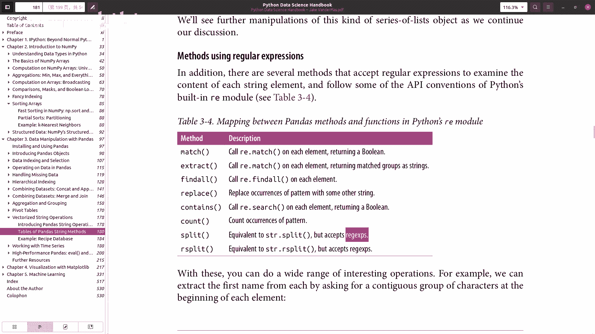

i spit也应那有了这些操作以后，这些运算以后呢，那么你可以做很多有趣的事情，譬如说我想去找这里面他的first name，想找他每一个成员的每一个人的first name，那如果是。

我们用一个extract，如果这个extract对吧，我们如果是用match，我们如果使用match的话呢，他是你可以在这个正则表达式里面，给他提供一个组啊，比如说你提供一个组，组呢是括号啊。

这是一个组，现在呢我相当于是match这个用主去match以后，我就得到主的内容，所以说我们是A到ZA到Z键，这样的话也就是我这个组匹配什么呢，匹配是大写的英文字母，小写的英文字母。

一个或多个的大小写英文字母啊，像这里这个就被匹配了，这空格没法匹配对，那所以就匹配到这里为止了，匹配到这里为止，匹配到这里为止，那么我这样子就他是作为一个组的成员，然后把这个组的成员。

就像第一个我就匹配这个作为组的成员，那么这个时候他会做一个字符参考，那当然你也可以，P1说是P配，我就匹配一个空格哎，这样因为你匹配了两个组，第一组是匹配的first name。

第二组的second name中间是空格，那他这两个组匹配他了，那第零个组他就以列零返回，第一个组呢以列一返回，这是用足把足作为字符串返回这个最后呢，他是当然是个给他free，啊，其实你只放一个组。

A day of me，Dance wt，他如果只你可只给他一个组，那他就只有一列，那么你也可以做一些更复杂一点的东西，譬如说我用find的哦，假设我原来有字符串，P说是这个字符串。

我可以去寻找这样的字符串，以辅音字母开始，以辅音字母结尾，那么这个时候我们用find of，用find owner去寻找这里面所有的有辅音字母，开始辅音字母结束的这些名字，I包括first name。

Last name，那这个时候呢我可以给他一个，模式，那如果我们不是用这个SSTI，不是向量化的字符串操作，如果我们用我们的正则表达式的话，那么是比如说我们可以编一个正值表达式。

I can come pine，我们提供一个正则表达式来匹配一个字符串，这个字符串呢是以大写的辅音字母开始啊，大写的小小写的辅音字母结束，那么就是说我现在是我们用lost string。

所谓的lost string就是假设有些，我后面用的这个正则表达式里面，有些这个原字符就是有特殊含义的字符呢，我们一般还是用lost string，那么这个时候呢字符串的开始是个字符。

字符串的结束呢是dollar，那么什么开始呢，开始后面跟的是中括号呢，表示一个字符类，所谓的字符类呢是我是匹配一个字符啊，然后里面指数我要匹配什么东西，那如果光写A1IOU的话呢。

那它就是匹配AEIOU里面的一个，它只匹配一个字符，但是呢是匹配这里面的一个，但是如果在中文括号里面再开始加上一个，开头的时候，对中括号紧跟着左边的中框加一个T字符的话，就表示正好反一反。

也就是匹配一个字符还是但是匹配不是所有，不是这里面的字符，也就是说我能匹配不是A也不是一，也不是I也不是O也不是U里面的一个字符，那就是实际上就是匹配的辅音字符，那么点星号就表示任意字符。

最后呢要匹配一个不是AEIOU的，也就是不是小写元音字母的这么一个，就是这么一个模式，那如果我用这个re EG去匹配的话，去find the all的话，这find out，那我找一个这个P数是。

I know，对他返回的是，这样的东西对，飞A飞A哈，那如果我们去FO这个正则表达式的话，他就能返回，你看是这个开始看辅音字母开始，然后是辅音字母结束，但是有些它不是辅音字母开始，辅音字母结束。

譬如说像这里，像这个它是元音字母结束的，所以他没有跟这个模式匹配，那么这样的话呢，这个地方反过去就是空了，当然你也可以，比如说他可以返回返回，假设这里面只能是A到C，A到C，A大啊。

这样的话把所有都给匹配掉，一个都没匹配掉，哦我加了一个字符串的开始和结束，这不用开开始结束，那这样的话你就能返回这个，两个成员对，那如果你把这个用到这上面去的话，所以他最后他是返回每一个成员。

CD是返回CDX对象的每个data frame，这是，A success，它返回的cs对象里面是一个列表，对吧，那因为我刚才为什么没有的话，因为是我现在这个里面，我指定了这个，开始字符串的开始和结束。

所以你是整整个字符串匹配的，在这里我就没加了，那他就能翻到，因为我会返回列表对吧，所以你如果搞额不是很清楚的话，你就先用这个正则表达式模块去测试一下，结果怎么样呢，那他只不过是一个映射。

他是在自己在每一个程序上，做这个反导运算以后，然后呢他把他作为一个SERI，整个世界是反馈过来，那么能够做这样，能够把正则表达式，在西里斯和data frame的每一个条目上。

每一个成员上去去做这样的事情的，那当然在我们清理和分析数据的时候，就会很方便，那么其他呢还有一些函数，能够提供一些比较方便的功能。

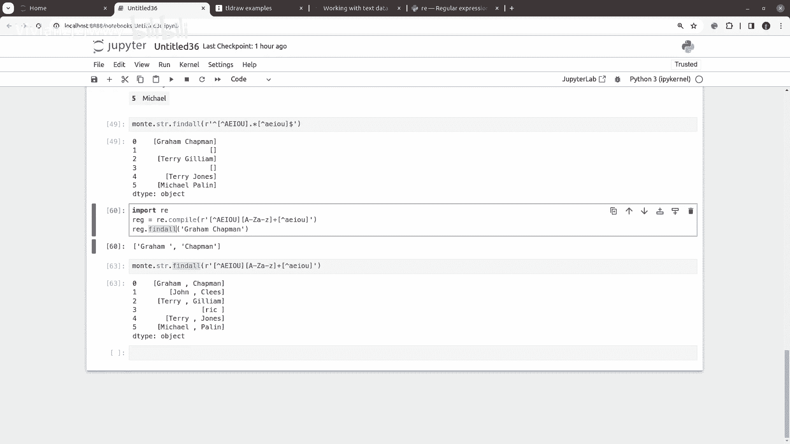

那这些函数呢也也有一张表格在这里，那么大概可以看一下这张表格，这个get啊，这两个我们等一下会讲，实际上这个呢，就是我怎么样在每一个成员里面进行索引，譬如说我在每一个成员上取这个字符串的第，几个字符。

啊slice呢就在每一个字符串成员上，因为你是个相当于CD，是相当于是个一维数组嘛，或者pandas a p d是个二维数组嘛，那么这个data frame，那么你怎么样去取每一个字符的某一个成员。

某一个字符，整个每一个字符串的里面的某一个字符，或者是每一个字符串里面的某一片，那么这个也一样的，Slides the place，然后是cat是连接repeat，是重复字符串等等等等。

嗯这里面还有个get damies，哎，这个也比较有用，我们等一下会看一下。

啊这就是其他的一些方法，那我们先来看一下这个get a slice，那如果对于一个字符串来说，譬如说我这一个字符串，对啊，如果你一个字符串是等于这个样子的话，那你可以用name点name。

譬如说零或者name1，你可以去索引它第一个字符对吧，然后你也可以分片嘛对吧，比如说0~3，pandas提供的STR点或者STR或，直接取0~3，这样的是每一个成员，就是我这个。

如果你把这个4月4看作一个又一数字的话，是取每一个成员的0~3这个分片，或者你直接去他的某一个字符，比如说每一个成员的第二个字符，那就是每个成员的电子，当然这两个方法它分别，它对应的其实是它的同义词呢。

分片的同义词呢是slice，The slice lindsa，然后这个直接用索引的这一个他是点get，哎所以你也可以用这个函数形式去调用，或者呢你直接用跟Python本身自身的语法，一样的方法去调用。

南派也是这样的啊，分片就是用中括号索引，也就是中括号里面一个索引啊，这就是这是同义词，你们都可以，那么当然你可以组合了跟前面那个那些，譬如说跟带正则表达式进行组合，比如说你，嗯特点SSTR啊，记住啊。

别忘了这个SSTR点，RT这个你可以得到把这个对吧，把他的first name和last name给它分开，如果你想现在只想得到last name，对那你就可以去取他的，因为这是一个关于列表的一个。

cities there关于列表的一个cs，所以呢你就可以用get get什么，最后一个一，我这里忘了，s t s t i get get free啊，你把后面的一个名字取出来。

那这种组合就很方便了对吧，那么还有一个函数一个方法呢，我们就是get大米，get dame这个方法呢我们稍微稍微解释一下，假设你有呃某一个这个pd里面啊，就data frame里面有某一列呢。

它是里面呢是一些指示指示的一些东西，据说是一个标志指示标志，举个例子，譬如说你A你表示一个意思啊，表示是男举手啊，P这女男FM那AP说是英国出生啊，美国出生，B1P是英国出生啊等等。

你只是用个标志为表示这个人相关的信息啊，表示这个数据相关的信息，这个时候呢，这get丹尼斯呢，可以把这个标志位很方便的给它拆解出来，那我们举个例子，据说假设我说P说A，美国出生对吧。

那B譬如说是英国出身，CP说是男DE啊，这个难哦无所谓，C1批在哪，第一批说是嗯像气势一样啊，这个都无所谓，随便来一个，那么，这个时候你就可以来一个，我这个名字呢pd点data frame。

我这个名字呢就是我前面的这个嗯嗯，然后呢我给他一个信息，这个人什么是什么信息，这个人相关的一些信息对吧，他的出身啊，他的男女啊，他喜喜不喜欢气死啊等等啊，那么我就给他这个，这是你看一下这个哎。

如果B表示这个，在英国出生，那么C表示喜欢cheese对吧，DE表示譬如说我是个男的啊，这个反正我们意思随便了，那这个我就只是这个人相关的某些信息了，对不对，这个时候我希望把这些信息都抽抽出来。

变成一个贼大free，那这个呢其实我们在呃人工智能里面，在机器学习里面，在训练数据的时候也经常做类似的事情，当然不一定是用这一个pandas，是点get damise做的，但是呢可以用这个去实现。

如果你去把他这一列取出来，info这里取出来，你如果给他来一个get the miss，STR6on点get damage，那位是他是用什么分隔的，如果是用这样，这里面显然是用这个竖线来分割的好。

那我就得到这样一个dear flame，那这个呢就是很方便，其实我们以后你用到的时候，你就会发现很多时候都需要展开成这样的形式，那么有了这些函数啊，我作为他基本的一个构造块的话呢，你就可以在这上面构造。

很复杂的这种数据清理程序，或者是数据整理的工作做，那么这里当然我们不可能讲了太多的东西，那么你可以到这个pandas的官方文档里面。

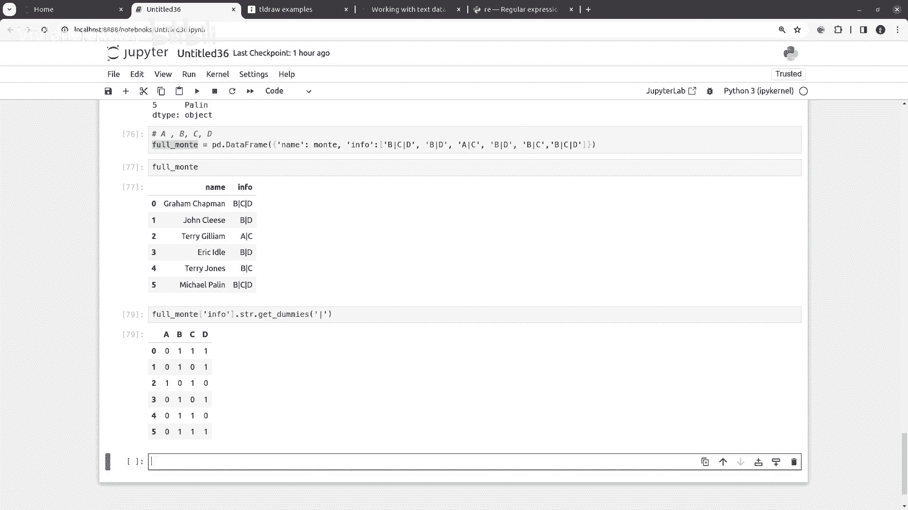

你去看一看这个user guide里面呢有一个text点HTML，需要去搜索一下，Working with data，ta text data pandas的这个文档里面，你就可以找到这个。

这里面有非常完整的每个函数，每个方法的这个解释，还有很多例子，当然你一般学习的时候，也不会一下子把它全看完，如果你需要处理的时候，那么你仔细去看一下。

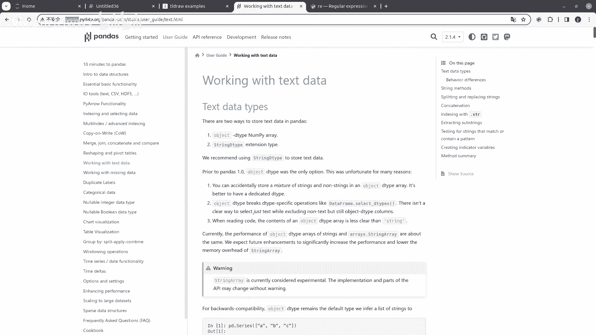

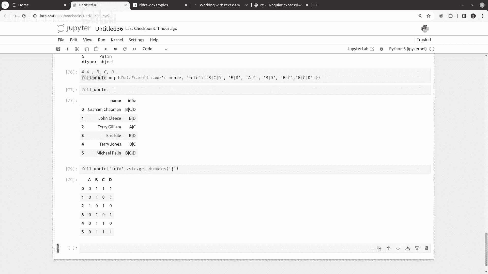