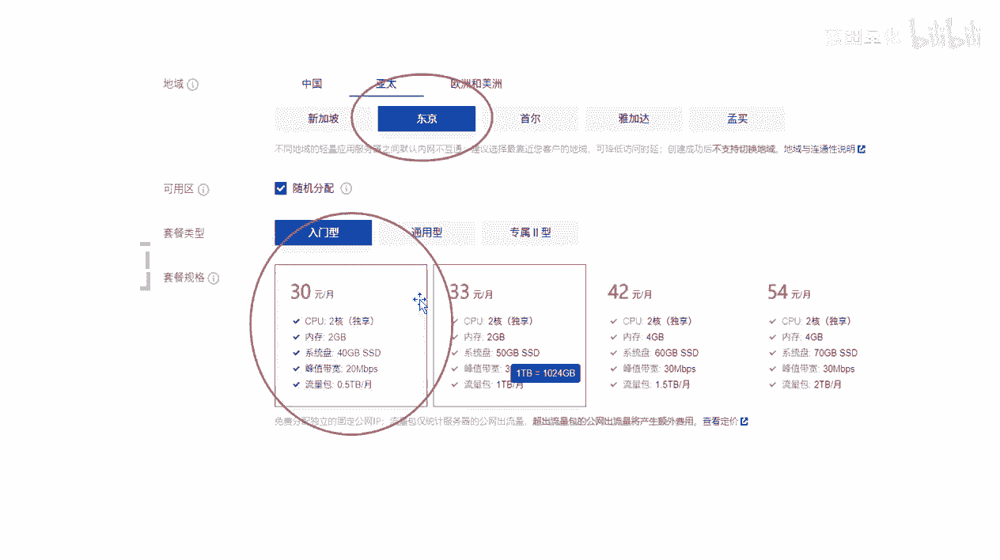
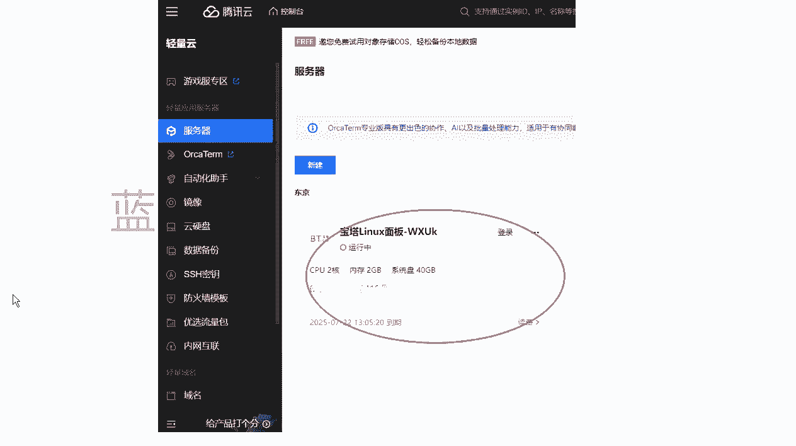
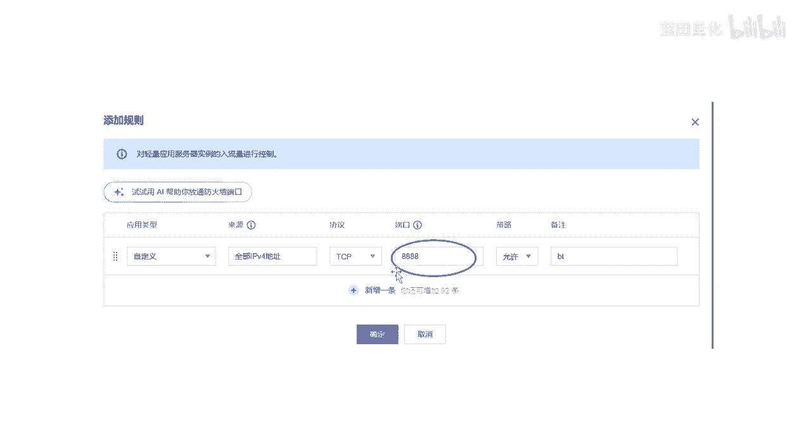
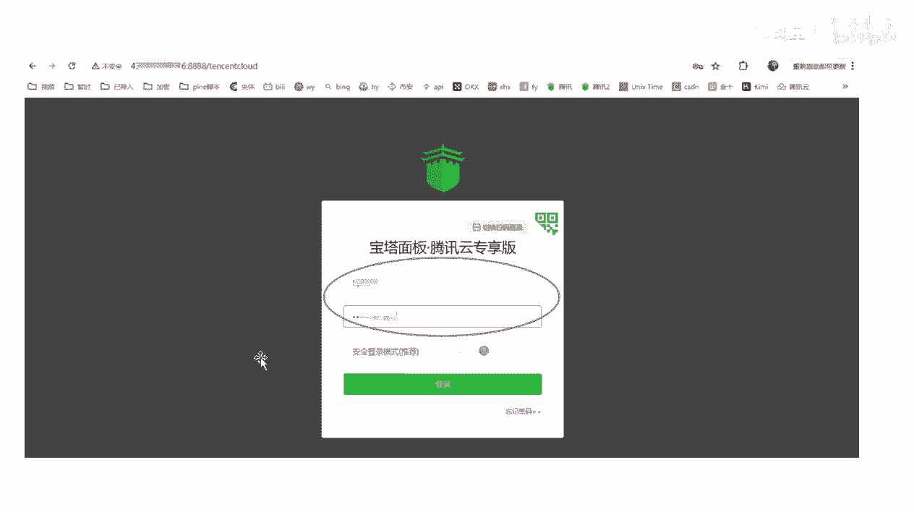
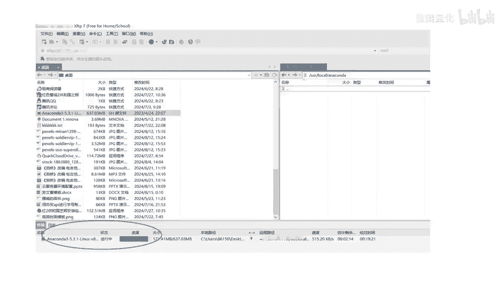
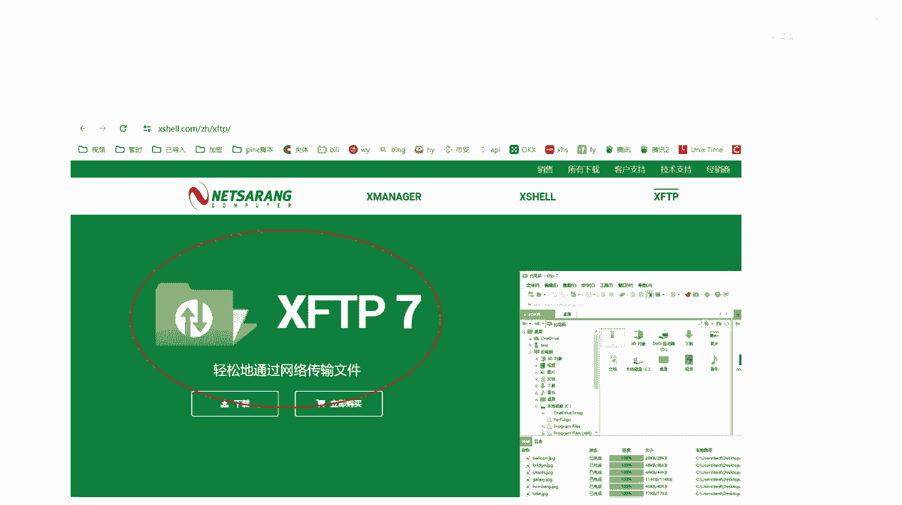
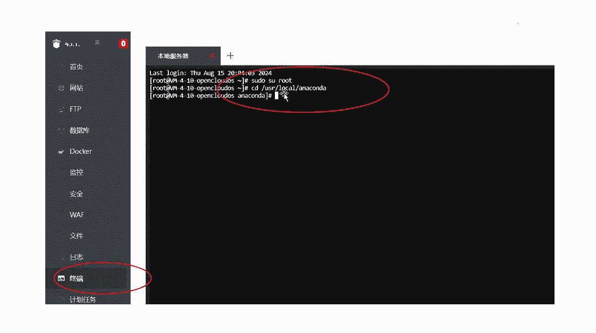
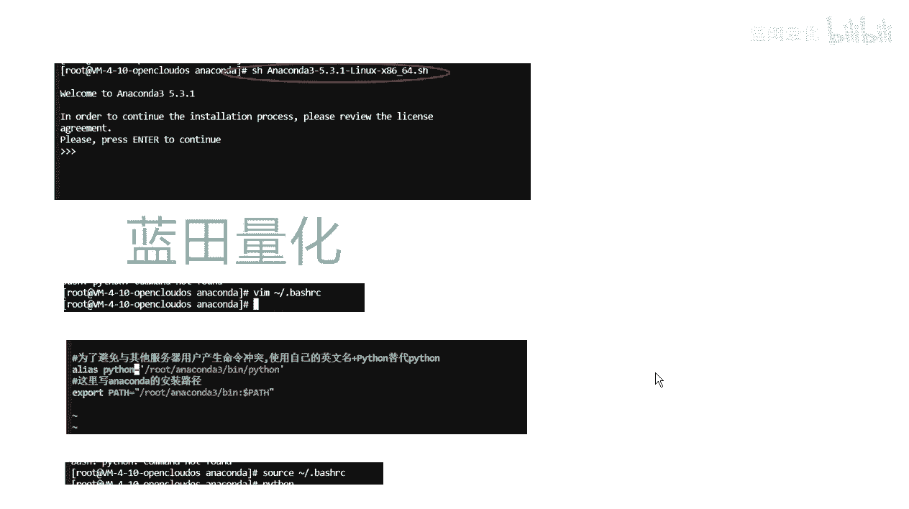

# python虚拟货币量化交易云服务器环境搭建 - P1 - X蓝田Chef - BV1KcebeiEPM

大家好，今天来教大家用一下，量化交易云服务器和环境搭建，首先我们，推荐使用腾讯云的轻量应用服务器，然后选择宝塔LINUX面板，并且我们推荐使用东京的选择型号，我们选择个30块钱的入门型的就够了。

然后买完云服务器之后。

我们我们进入我们的控制台。

然后选择应用管理，我们进行登录，登录之后，我们再把这个命令给粘贴下，就可以看到我们宝塔面板的那个，那个密码和用户名和密码，然后我们把这个命令进行粘贴，然后就可以看到我们的用户名和密码。

然后我们在在登录我们宝塔面板之前，我们首先需要设置一下防火墙，往往前添加规则，我们把添加个8888是我们宝塔面板的端口。

然后给添加进去，然后我们就登录登录我们的面面板进行操作。

登录进去之后，首先我们需要它会将你绑定宝塔的账号，你就进行绑定一下，之后就是这个样子，然后我们宝塔面板就安装好了，然后我们再进行Python的环境搭建，因为我们需要主要用Python进行额交易嘛。

所以我们就需要进行Python的环境搭建，我们这里首先需要进入and code官网，然后我们下载一个看到cod，注意这版本版本，我一我一般是用这个版本就出过了，下载好之后，我们在我们的文件夹里面。

然后的优势文件夹进入，然后我们进入我们的logo文件夹，然后新建一个按照code文件夹，新建好这个文件夹之后，我们再再把我们下载好的，按照cod传输到这个文件夹里，然后我们进行传输这个传输的工具。

我用我用的是XFTP杠七。

可以你们可以进去官网进行下载，下载一下，传输好之后，我们就就进入我们的终端进行安装。

然后我们进入我们的终端，首先输入这两个指令，一个是录的权限，方便我们后续的操作，另一个是嗯就是跳转到这个文件夹。

然后我们进行安装，安装指令是是这个安装好之后，我们，还要修改一下，进入我们的这个设置里面，然后我们添加添加这么一段的指令，最后再输入这个指令，然后剩下14个我们刚才添加进去的内容选项。

最后我们这最后我们就搭建好我们的环境，那我们就可以在我们的呃服务器上运行，我们的的交易代码了。

