# python量化1：外汇实时交易1 - P1 - LuQuant - BV1ix4y127LY

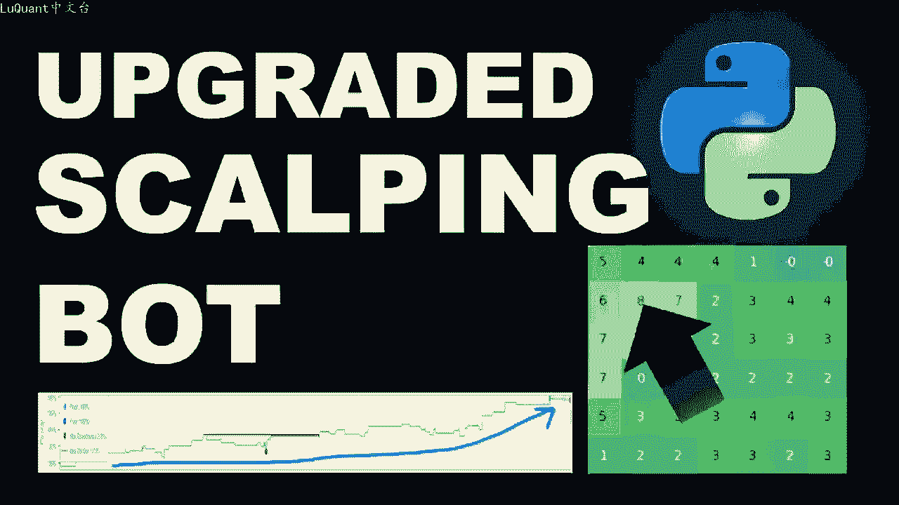

大家好，欢迎今天我们正在检查我们的实时交易机器人或我们用于外汇交易的实时交易策略。这是我们使用亚马逊云服务在云上编码和部署的策略。快速提醒我们，使用历史数据，优化了该策略回溯测试线。😊。

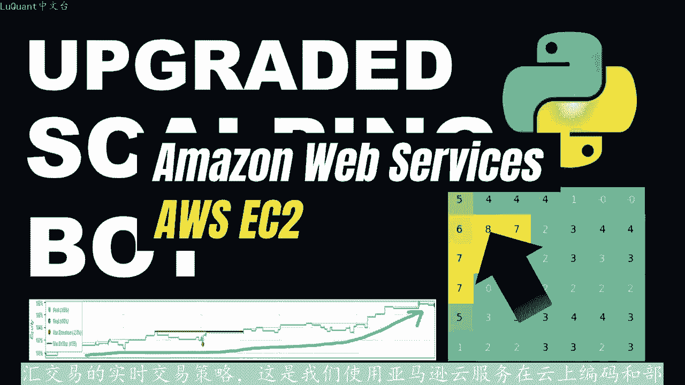

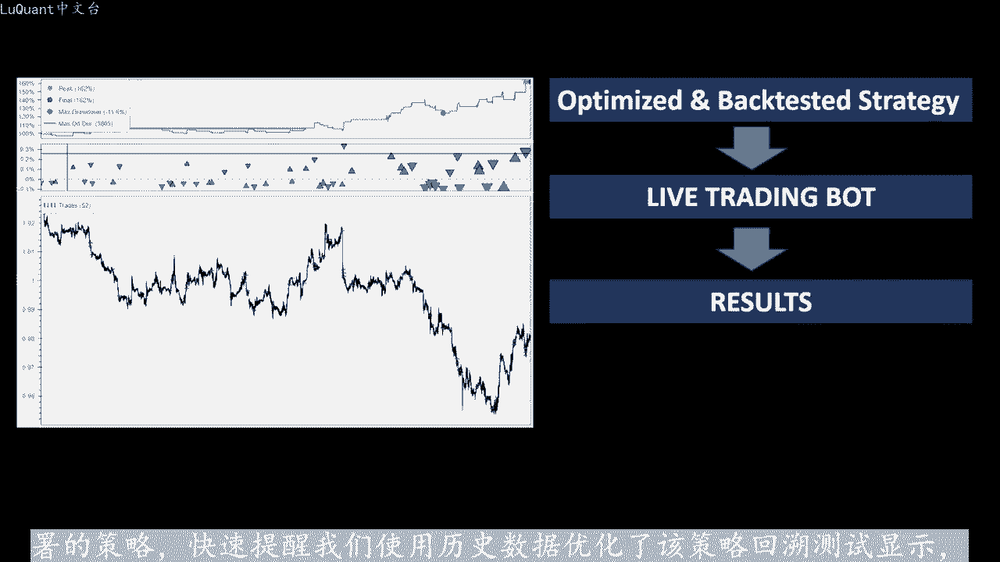

股票走势呈正向3个月的交易回报率约为60%。该策略依靠两条移动平均线来检测趋势，并利用布林格代在我们回溯测试的趋势方向上生成入场信号，使用拍放的历史数。我们使用平均真实范围来微调止损和止盈距离。

以考虑市场波动。好吧。那么我们今天在做什么事实证明，在前两个视频中，我们错过了一些正在放缓的细节我们的交易机器人。在前两周开始表现良。

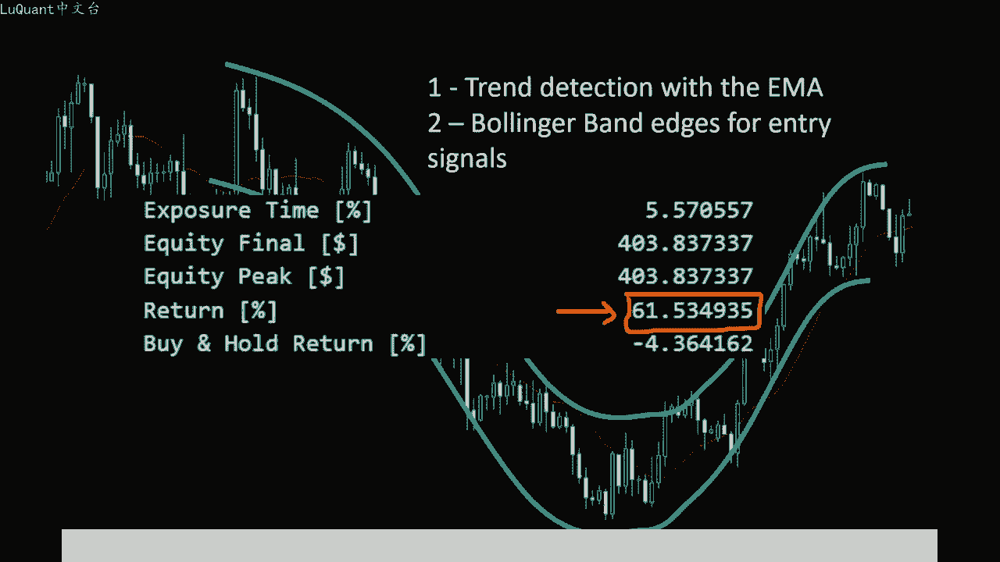

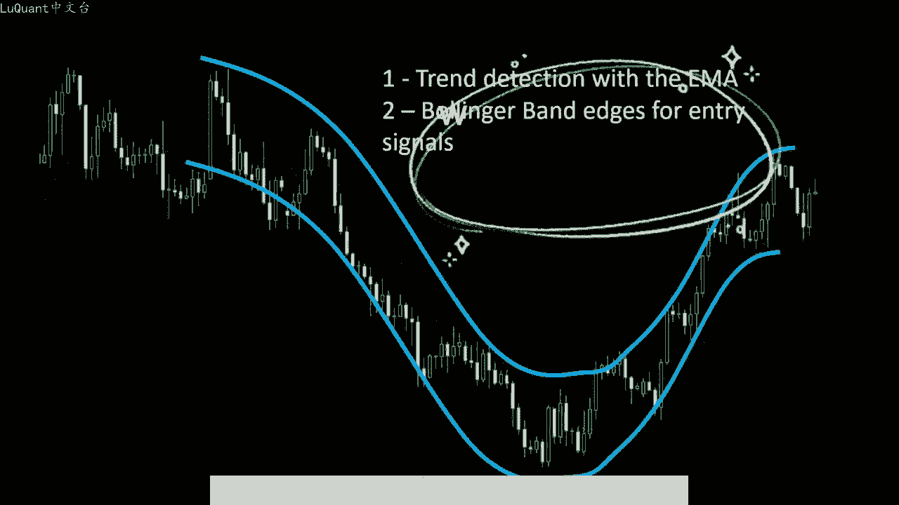

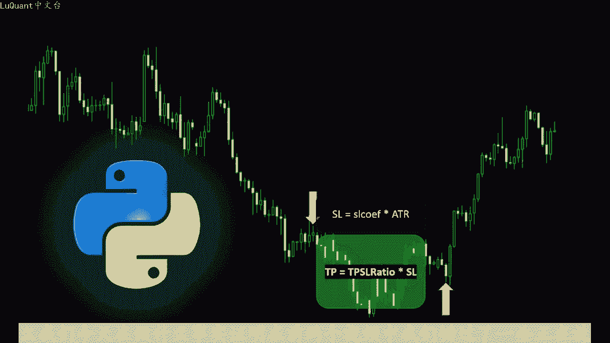

但现在已经三周了，他表现的不太好。如果有办法，我们可以改善我们的结果，看看这个蜡烛快速移动平均线高于慢速移动平均线。所以我们处于上升趋势，蜡烛开盘价低于80格带曲线下线，所以这是我们的入场信号。

这是一笔很好的交易，它很快就平仓了，我们赚了一些利润，但随后出现了另一个信号，相同的技术情况，但我们的机器人没有打开此时进行交易，这是我们错过的绝佳机会。那么我们如何提高系统的效率，这并不。😡。

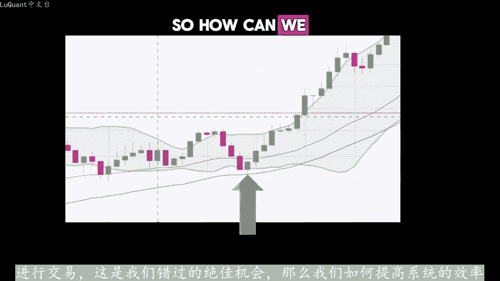

我们对历史数据运行优化算法已获得最佳止损和止盈参数的全部，但这些是使用2019年至2022年之间的数据获得。因此，当时我们认为在3年内提供良好结果的相同参。也应该在未来发挥作用，这并不完全错误。

但是如果我们尝试根据更新的数据或数据来优化策略会怎样？实际上，在我们继续之前，如果您对策略详细信息、pyython代码、回溯测。方法和实时交易机器人感兴趣，我将在下面的描述中留下之前视频的链接。

以便您可以浏览详细信息，下载编码材料，并将其用于您的实验。我们将使用的第一个改进式RSSI来确认趋势。请注意在。

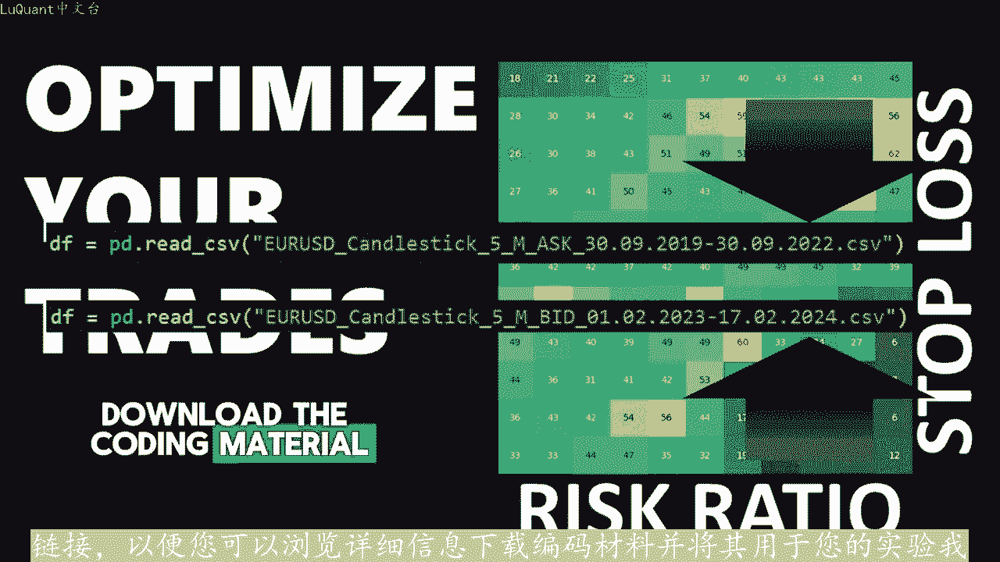

事例中，RSI大多高于50%线，并且这种情况发生在价格攀升的地方与移动平均线相比。RSI在正方向上通常更快的捕捉到趋势的变化。它使用不同的公式。因为长度参数通常比移动平均线短。

所以我们希望使用RSI来避免不确定的趋势，一个附加过滤器。为此，我们将考虑时间片窗口上的所有RSI值，因此我们不会使用1个RSI值。当前蜡烛的最新值，我们将检查当前值之前时间片内的所有值。

如果最后10个RSI值高于50%线，则确认上升趋势。反之，如果所有先前的RSI值低于50%。现则我们可以确认下降趋势，前提是快速移动平均线也在低于慢速移动平均线。这是一个典型的例子。

显示使用RSI确认可以避免亏损交易的情况。该蜡烛在巴林格区线上方开。

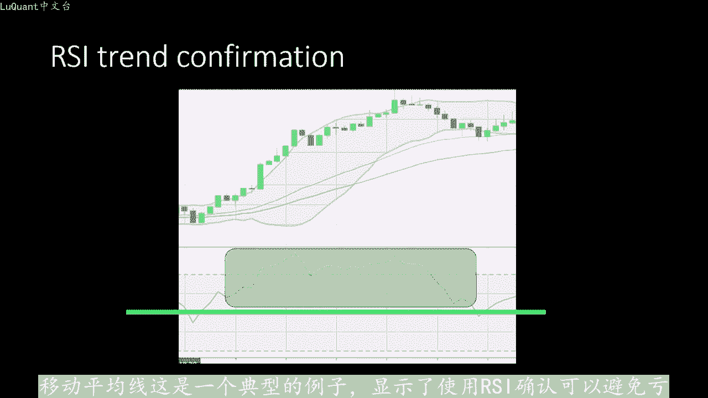

红色的快速移动平均线，颜色低于白色的慢速移动平均线。所以机器人认为这是一个下降趋势，这是一个空头头寸，具体取决于ATR止损显然太接近了，这最终导致了亏损。因为我们打开了这笔交。但我们被阻止了。

因为在我们之后，价格继续小幅攀升开仓，以避免通常在趋势结束时发生的情况。在反转期间，我们可以查看RSSI如果最后的值不低于50，那么我。不允许空头头寸，因为趋势尚未得到确认。

RSI看起来势头正在向上升趋势转变。这里的情况就是这样，请注意几根蜡烛的RSI高于50。因此，该蜡烛的RSI约为55到50。在这种情况下，我们可以不再确认下降趋势。尽管红色区线。

红色快速移动平均线低于白色移动平均线，所以我们需要这两个指标来确认趋势。宾格代表现的很好，所以我们不会改变任何东西，我们只需要一些东。😡，可靠的检测趋势，并避免趋势反转或特征发生某种变化的区域。

我们可以应用于交易系统的另一个修改，是我们将根据最近。

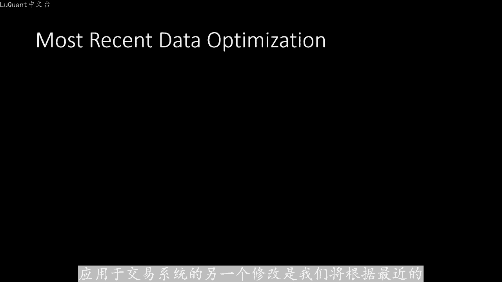

数据和数据来优化止损和止盈系数。为了测试这一点，我们将使用与应用机器学习算法时相同的方法，我们将在时间片周期内优化或拟合系数。然后我们在以下时间片数据上使用相同的参数应用前项测。

这样我们正在使用新的和看不见的价格数据测试我们的模型。因为你和仅在前一个时间段进行，但实际上这不足以确保我们的系统可以在更广泛的时间范围内进行推广。我们可以使用滑动窗口音。如果这是我们的第一次测试。

我们可以保存结果，例如返回百分比dden等。然后我们滑动窗口，并使用新的优化拟合和新的测试再次重复。这也揭示了我们可以聚合的新结果。在之前。测试中我们继续这样做，直到我们收集到足够的信息。

了解我们的模型是否可以在更广泛的时间范围内推广。实际上，我们必须更新我们的优化部分。例如，在使用机器人进行实时交易时，每两周更新一次，这意味着更。😊，基于上周价格走势的止损和止盈系数。

这样交易模型将始终跟随市场更新参数，您可能会称之为过渡拟合，但只要它有效，那为什么不呢？这还不是我们没有完成的全部优。对于那些一直关注该系统实时交易新闻的人来说，我仍然有一些关于该实时交易系统的亮点。

我已经发布了一些屏幕截图。你已经知道我们到目前为止有良好的积极几周和一些消极的几周。在这一点上，最好再次回顾一下我们的回溯测试结。😊。

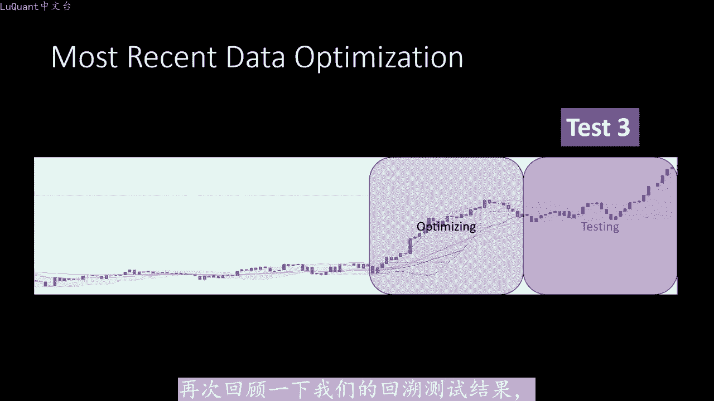

只是为了管理我们的预期，请注意该股票曲线上的下降期和最大下降持续时间约为385条，这意味着大约3177小时，因此大约为13至14个交易日。自从我们谈论市场开盘的交易日以来的三周，换句话说。

如果系统连续三周亏损，根据我们的回溯测试，这在某种程度上是正常的，不应该像我们可能会出现一两个那样频繁几周的下降。有时也许没有，我们将拥有一个完美的月份，所有交易都处于积极状态。

或者所有几周或所有交易周都处于积极区域。也就是说，任何交易系统都会有一个下降期，整个月以负数结束，这是完全正常的。最重要的是，如果我们在年底之前坚持使用该系统，我们将有更多的积极月份。

并且只要该系统经过彻底的回测，并且有效。总体结果将是盈利的。从长远来看，在我们系统的新版本中，我们的目标是缩短下。

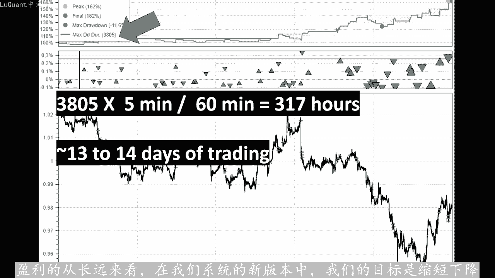

七和下降值在此测试中，最大下降率为2%，最大梦持续时间为1135根柱。因此几乎有4个交易天，完整测试应用了近3。5个交易周。应。

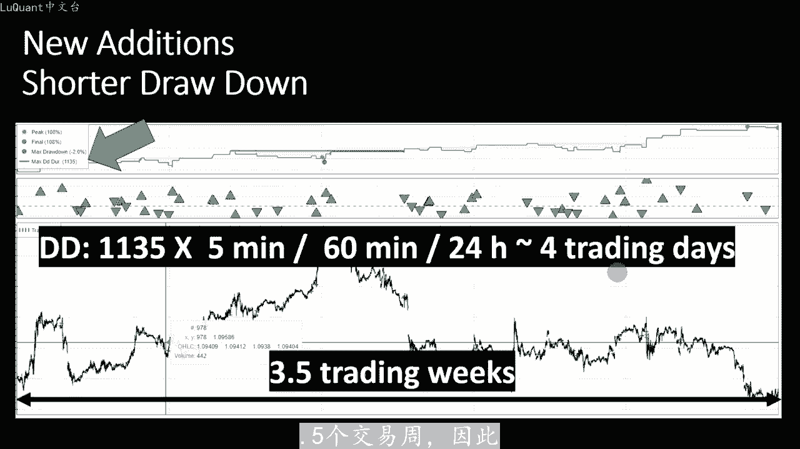

我们的交易时间几乎有3分之1处于下降期，我们可以在交易管理上应用另一项改进。我们可以使用收支平衡方法。因此，当价格达到一半时，只盈距离，我们将凭掉一半的利润交易并。

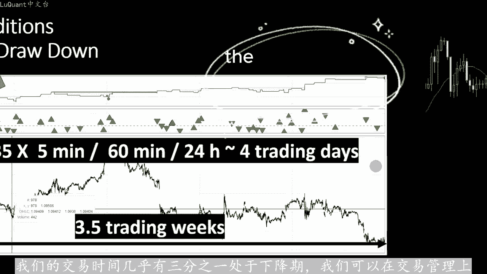

止损值移动到建仓价格。这样如果价格反弹，我们可以保留一半的仓位作为利润。如果他继续朝着获胜方向发展，那么我们将凭掉另一半头寸，以获取利润，这称为盈亏平。方法它通常会限制下拉值，这就是下一个视频中的视频。

我们将通过所有这些修改便利pyython代码并讨论结果。也许我们可以更新我们的实时交易机器人，并观察未来几周的实际结果，直到我们的下一笔交易安全为。

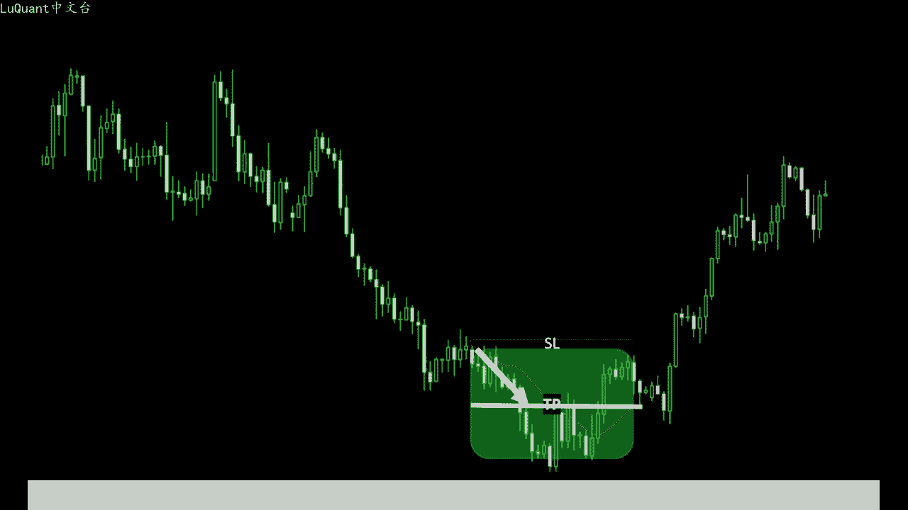

下次。

