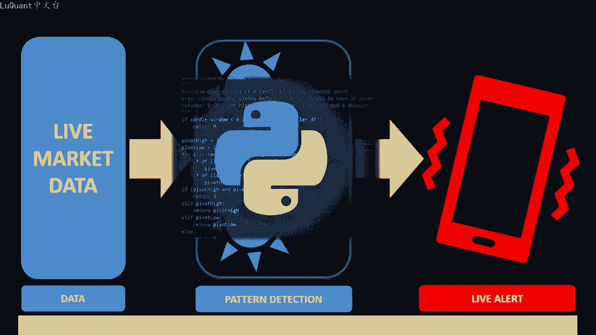
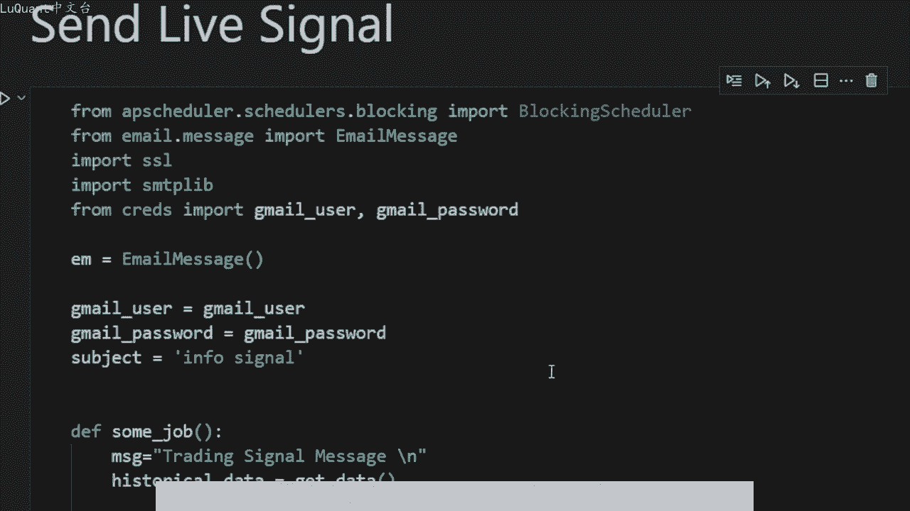
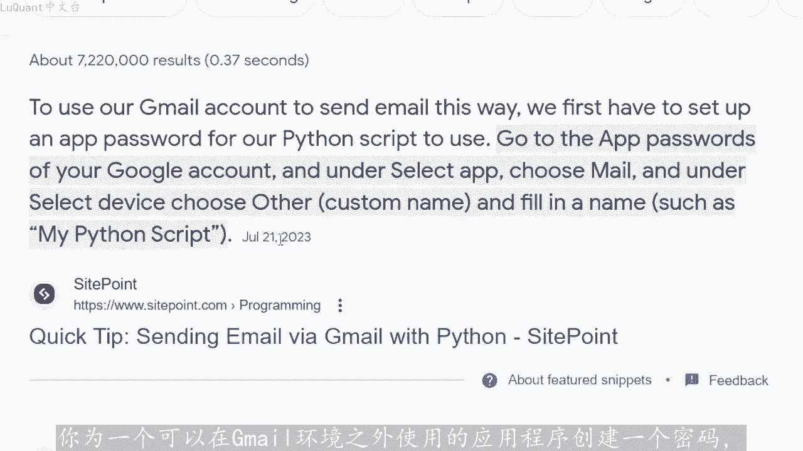
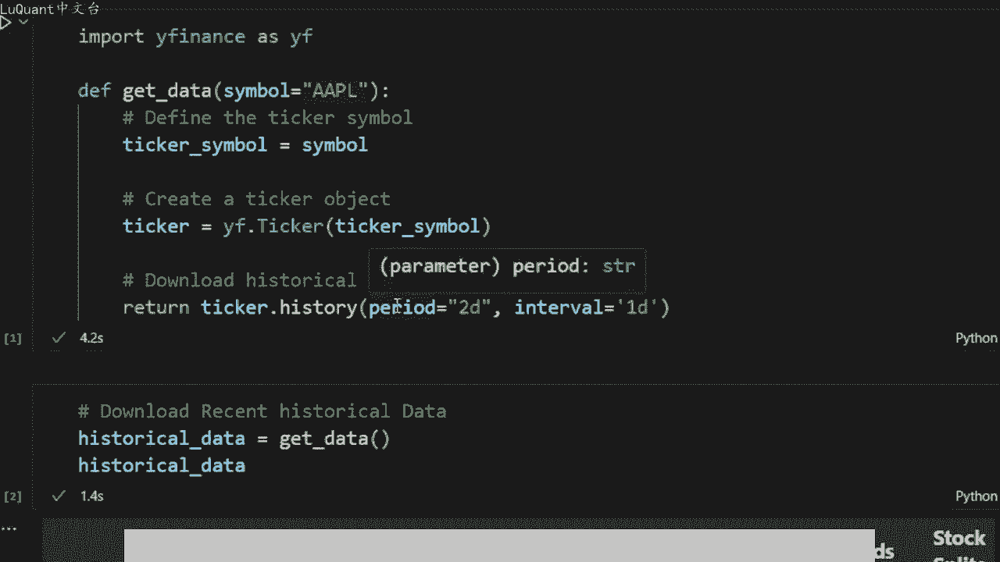

# python量化10：外汇交易的技巧 - P1 - LuQuant - BV1qx4y127S2

大家好，今天我将向您展示如何流式传输实时市场数据，将数据输入到您的分析代码中，并在市场上确认机会时向您的手机或电子邮件发送警报。所有这些都可以在pyython中自动化，这样您就可以免于设置在屏幕后。

观察图表并等待特定模式形成的时间。通常我会收到很多关于算法交易和使用智能程序自动交易任务的问题。在本视频中，我将向您展示如何构建自己的实时交易使用拍放语言，以简单的方式构建系。

所以让我们从编码部分开始，这是我们的jupyter笔记本文件，这是整个代码。我想向您展示的第一件事是代码的大小，它非常小，而且非常简单，它可以结束到目前为止。如果你想测试多种资产。

只股票我们可以继续使用这部分。所以你可以看到，这不是一个很大的代码。如果你不是很有经验或不熟悉pyython，你仍然可以按照代码进行操作。这非常简单了解，第一个单元格中的不同部分，我正在使用wifi。

😡，包并且定义了一个名为d data的新函数。它采用我们想要获取数据的符号，并且该函数将下载或流是传输数据最近的开盘价、收盘价和低价数据它。使用这些参数返回一个数据框。所以在这里我使用今天的周期。

所以我只下载最近两天的数据，我们会看看为什么间隔是一天，意味着我们下载的时间范围是每日时间范围。然。😊，要下载数据或流式传输实时数据，我可以简单的调用函数获取数据。默认情况下，我使用apple符号。

我们可以使用亚马逊或来自外金融的任何其他符号。您可以下载不同的数据。因此，为了确保我。功能正常工作，我正在打印历史下划线数据变量。这是我将数据放入的数据框，这是我们得到的是。

我们有高开低收、交易量、股息和股票分割等等。所以我。首先运行单元格定义函数，然后我们调用该函数，我们将看到我们的数据，这是昨天的数据。我在19日记录这是昨天和前几天的数据。所以我们是。

每日时间范围我们可以看到，昨天和前天有两个柱形图，只是为了这个例子和这个代码使用一个函数测试吞没。所以我正在测试我们是否有看涨吞没模式或看跌吞没模式，使用这里的这些条。😊，所以我不会详细介绍所有细节。

我假设什么是看涨吞没模式，看跌吞没模式。因此，这些是由这些条件定义的。如果是看跌吞没模式，则返回一。如果是看。😡，吞没模式则函数返回。如果我们没有任何特定模式，则返回零。

我们可以尝试现在要对我们刚刚下载的历史数据运行该函数，看看该函数是否正常工作。所以现在我们返回零。暂时没有任何看涨或看跌吞没模式。所以请记住，我只使用苹果股票价格在过去几天里。

所以如果昨天形成看涨或看跌吞没模式，我们将在程序中得到信。我们今天可以开始我们的头寸。例如，在这个单元格中买入或卖出，我只是制作了一些价值，只是为了确保该函数确实检测到看涨和看跌吞没模式。

因此它运行良好，我做了我。测试我认为这非常简单，所以我们现在不应该担心他是否有任何信号通过看长或版本高尔夫模式检测到，我想向自己发送一封电子邮件，无论我身在何处，该电子邮件都会在我的手机上发出警报。

在这种情况下，我可。😊，登录我的交易平台，并进一步分析市场，并检查是否。我现在可以以多头或空头头寸为例，只是为了更具体的了解吞没模式。这只是一个例子。为了这个视频，我只是。吞没模式为例。

您可能想要制作更完整的东西复杂。因此您可能想测试围绕支撑位和阻力位发生的吞没模式。例如，使用移动平均线在某个趋势内，您可。在这些函数中添加任何内容，并定义您自己的系统。但最重要的部分是。

当你有市场上形成某种模式，您可以向自己发送信号或电子邮件。您可以在手机上收到该信号或电子邮件。然后您可以登录进行交易。为我使用gmail的API。因此您需要gmail用户名和gmail密码。

这些是在我刚刚创建的凭据pyython文件中定义的。我将我的凭据放在那里来创建这些凭据。您必。

拥有Gmail账户，并且必须创建一个应用程序密码。所以更多信息你可以用谷歌搜索一下，然后检查一下，这是一个简单的过程。你基本上登录到你的电子邮件，然后打开一些选项云。

你为一个可以在Gmail环境之外使用的应用程序创建一个密码，这这就是我获取此应用程序的Gmail用户名和Gmail密码的方式。然后我正在创建一个我将要使用的电子邮件实例，我正在定义。

称为信息信号的主题，这基本上是您将要发送的电子邮件的标题正在接收。我将所有内容放入一个名为some job的函数中。目前该消息将是交易信号消息，稍后我们将把信号连接。该消息的正文中。

以便历史数据等于获取数据。我现在正在流逝传输数据。因为每次我们调用该函数时，我们都应该更新历史数据变量中的数据。如果考虑。我们刚刚下载的历史数据的测试吞没等于一，则意味着我们有看跌信号，有看跌吞没模式。

我们将更改消息电子邮件文本正文为看跌信号。在相反的情况下，如果我。有等于二的信号，我们也会发送此消息，所以信号太乐观了。然后我们创建电子邮件的内容和所有需要的参数。例如。

我们有从Gmail用户到Gmail用户的电子邮件。我基本上给自己发送了一封电子邮件，我们可以将内容设置为我们刚刚创建的消息，基本上就是信号。然后我们创建一个上下文变量，它等于SSL点创建默认上下文。

我们使用带有这些参数的GmailSMTP服务。因此，465，并且上下文将等于上下文。然后我们将再次使用凭据，将当前用户的电子邮件作为字符串发送给当前用户，然后关闭服务器。

因此我们称之为some job的函数，其中包含所。这些所有这些都将发生。因此，我们正在流逝传输数据，检查是否有信号，然后我们向自己发送一封电子邮件。如果您想检查多只股票或多种资产，这会变得很有趣。

这就是您可以，而不是。😡，一个符号的地方可以使用符号列表，因此，apple andvidiapaypal为在此列表中添加了这三只股票。然后我们不是检查一个符号。

而是检查这些符号中的任何一个或这些股票中的任何一个是。返回看涨信号，吞没或看跌吞没信号。当所有这些都完成后，我们会将消息或信号连接到一封电子邮件的一个正文中。因此，对于所有交易品种中的交易品种。

检查每个交。品种的历史数据如果有的话，只需进行数据测试吞没模式。如果是这种情况，只需将此信号添加到我们的消息正文中。如果是看长吞没模式则同样的事情，然后我们向自己发送。

电子邮件就像我们在前一个案例中所做的那样。所以现在当我调用求和工作时，韩数将获取最近几天的三支股票数据，检查是否有任何信号，并将所有这些数据发送到电子邮件中。现在理想情况下，您不想每小时运行一。😡。

因为我们使用的是每日时间范围，所以你需要安排这个，这就是为什么我在这里使用调度程序，所以从APPS调度程序导入阻塞调度程序等等。所以这部分代码。安排启动这个功能。

所以我们需要在这里评论这部分我们的一些工作，我们将安排每天在午夜启动此函数一次。现在我们可以取消这部分的注释。它的作用是首先创建一个调度程序。添加某个函数的作业，因此它将启动所有内容。

但它将在周一、周二到周五0时0分0时启动它。所以使用UTC时区是午页，并且每天只会发生一。使用15乘以60秒的宽线时间。所以大约15分钟。所以换句话说，您可以启动此程序跳过此单元。

因为此单元仅使用一只股票，如果您想列出股票列表，只需使用此单元，它就足以为您测试。探测市场，并将其发送给您午夜通过电子邮件发送的报告这么说吧。如果您早上醒来，您会检查一次电子邮件，如果您有任何登录信号。

您会进行交易，否则您可以离开去工作并继续您的生活。那就是关于这个我要告诉你的一切。😡，希望你发现这些信息有帮助，并且你像往常一样喜欢这个视频和内容，任何你想分享的任何想法。你希望我们讨论。

请留下评论、点赞和支持。该频道，非常感谢您的关注，直到我们下一次交易安全。下次。😊。

