# python量化11：Flag Pattern Trading - P1 - LuQuant - BV1t1421Q7KN

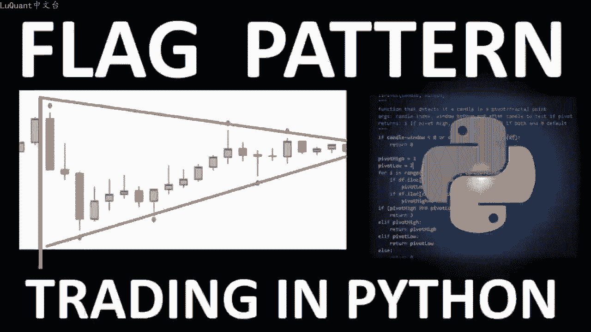

大家好，今天我将向您展示如何自动检测标志模式。我们将以一种简单的方式看到这一点。如果您在这里学习编码部分，您可以从以下链接下载python代码，与往常一样，交易中的骑行模式适当价格开始上下波。😊。

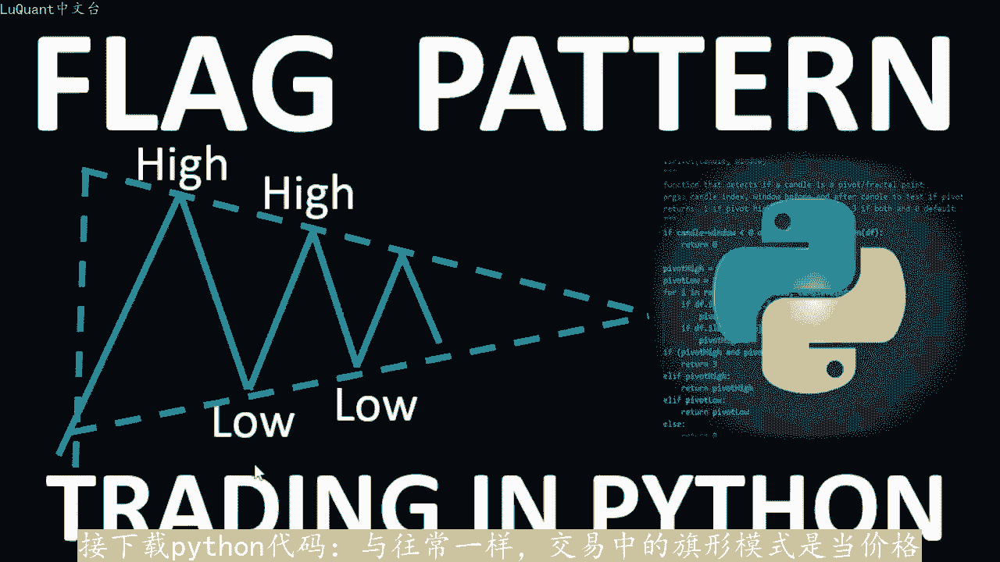

并在总范围内下降时，如果高值可以大致沿递减斜率对齐，而低值可以沿递增斜率对齐。那么在这种情况下，我们有一个形态看起来就像一面旗帜，这在交易中很重要一。我们可以预期价格遵循两种情况之一。

或者它继续外推三角形旗帜内部的形态。我们可以通过在三角形内进行快速交易，来利用这一点三角形范围。我之所以说只有一笔交易是因。当我们可以清楚的看到，骑行价格的形成时，已经非常接近突破其模式。

因此我们不想冒险，但我们仍然可以侥幸逃脱一笔交易快速交易，这会导致第二种情况。即价格突破骑行上方或下方通常会。支撑区域突破反弹后回撤。正如我们在此示例中看到的那样。

并在我们可以应用的相反方向上采取短期上升趋势对称逻辑，价格跌破骑行回撤，从阻力区反弹，然后才。

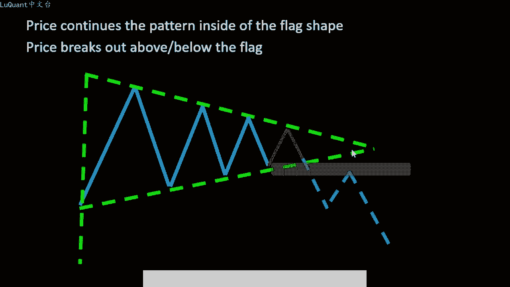

短期下降趋势，我们可以使用pyython语言自动检测此模式，这是通过我们将在本视频中看到的算法检测骑行的事例，向您展示如何用pyython编写此代码。如果您喜欢使用这种交易。

我将提供一些额外的提示来改进简。代码算法的工作原理如下，首先我们检测书轴点，这些是价格的高点和低点。如果一根蜡烛之前和之后都高于它的邻居，那么它就是一个书轴高点。如果它低于它的邻居。

它被标记为一个书轴低点这些。

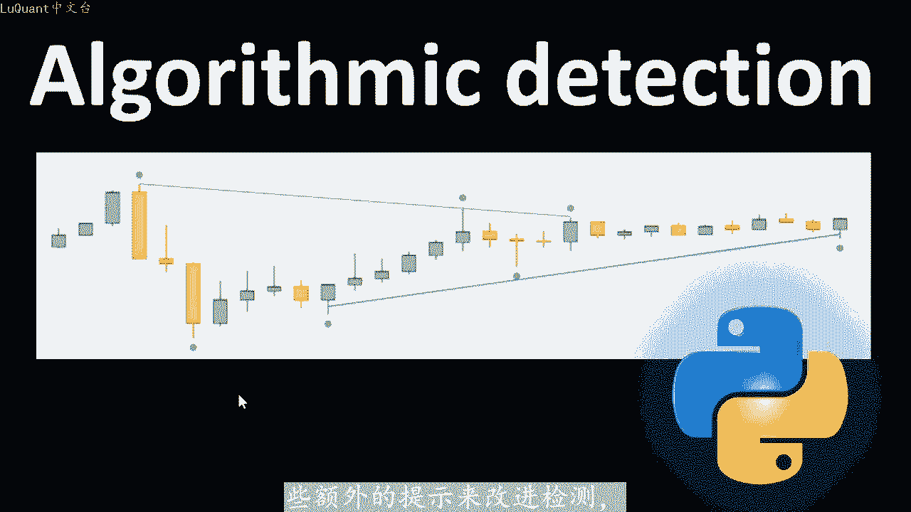

我们的算法检测到的这个例子中的紫色点，然后我们尝试将高点拟合到线性斜率检查它们是否对齐。如果斜率是负值或下降，我们也对低输轴点执行相同的操作，它们必须对齐并。如果在时间窗口的切片中满足这些条件。

则他们必须对齐并遵循递增或上升的斜率。然后我们检测到了标志模式的近似值，让我们进入编码部分，看看它在pyython中是如何工作的这。

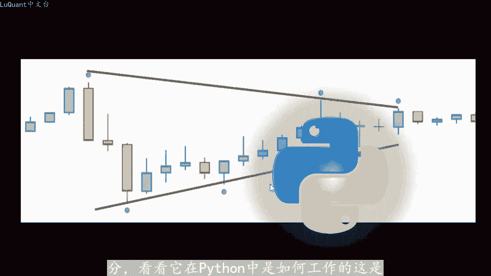

这个单元格中的dptter笔记本文件，我正在从CSV文件加载数据。我有欧元美元1小时时间范围买入价。从2020年到2023年，几乎有3年的数。劣势开盘时间、高点、低点收盘时间和交易量，所以我正在清理。

没有任何交易量的蜡烛，所以没有价格变动。这些是周末休息日，市场休市。我正在重置索引，我正在检查市。😡，有任何缺失值，并且正在打印数据框的前十行，这就是我们的数据的样子。然后我定义一个名为书轴ID的函数。

它采用当前蜡烛的数据针或蜡烛想要测。它是书轴高点还是书轴低点，因此它是索引N一和N2是在测试的蜡烛和测试的蜡烛之后，所以E和N2可以更改这些是。可能想要试验的参数，我通常使用像之前三个和之后三个。

最多5个之前和5个之后。所以如果蜡烛高于前三个邻居和后三。邻居他被认为是高位书轴，并且对称的。如果他低于这三个前三个邻居和后三个邻居，他被认为是低位书轴，所以这个函数可以测试蜡烛。

知道它的索引和数据针并。他将如果它是书轴低点则返回一。如果它是书轴高点，则返回2，在任何其他情况下返回零。如果两者都是，则返回3。所以我们不希望一根蜡烛同时高于和低。所有数字因为在这种情况下。

如果我们不能将其视为低书轴或高数轴，那么我将使用此函数，将其应用于所有数据框型，并将结果保存在名为书轴的星列中，以观察我们的情况获得。

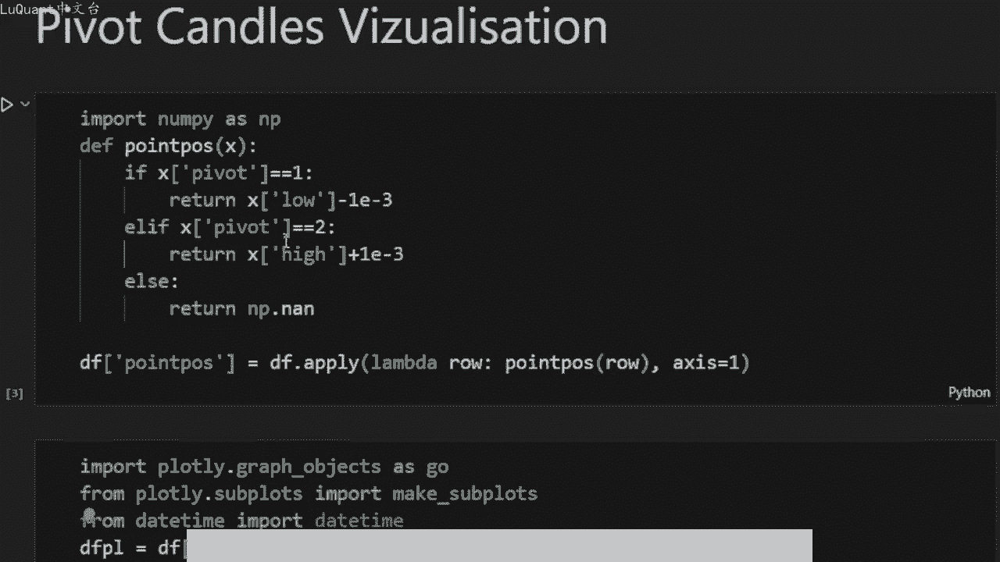

我们可以用蜡烛将这些点绘制在图表上，这就是我们在这里看到的。所以我们可以看到紫色点是书轴，它工作的很好。所以我们的算法正在做我们想要做的事情，我们可以验。

从视觉上看，算法是如何工作的，这就是所有魔法发生的地方。所以这是一个称为检测标志的新函数，它采用蜡烛ID或蜡烛索引，后面蜡烛的数量、窗口和绘图标。默认情况下等于false。

如果您想要绘制此函数检测到的标志，因此这里要注意的最重要的事情是我们有蜡烛ID，还有后面的蜡烛，后面的蜡烛是一个参数用。定义要显示的窗口或蜡烛片在当前蜡烛之前，考虑尝试检测骑形形态。回顾这个例子。

如果这是我们当前的蜡烛，例如这里的红色蜡烛，我们正在尝试测试试。

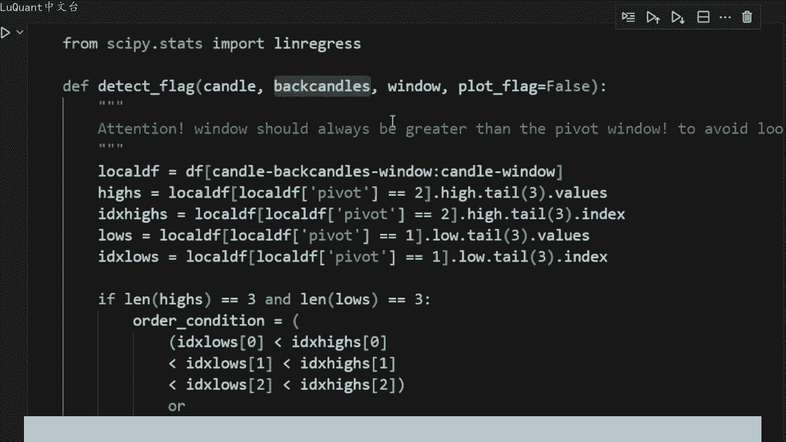

存在骑形形态的形成。那么我们我们将查看这些蜡烛的数量，因此这是后面蜡烛的数量。如果您注意到哪个窗口，则还有另一个参数，该窗口用于避免前视偏差并。

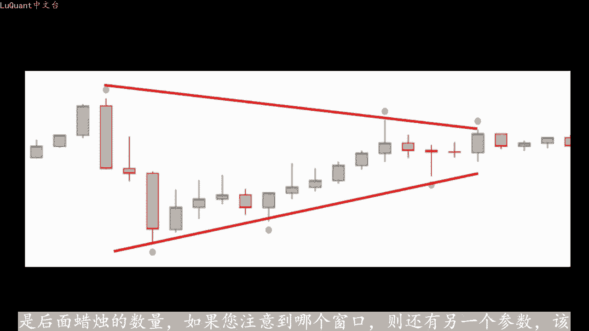

确保我们使用的窗口非常重要，正在使用的直大于我们在数据透视ID函数中使用的NN1和N2，只是为了避免前瞻偏差。因此，如果我们在之前和之后采用三个邻居，那么在这。

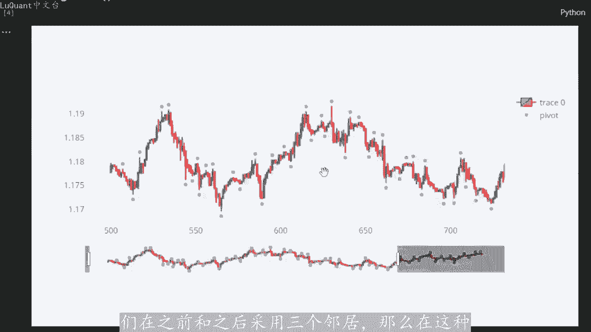

情况下，这里的窗口应该大于3，应该是四或5。所以回到这部分的函数，我们检查高点和低点及其所引。所以这些是数轴高点和竖轴低点，我们只考虑尾部3一位。书轴点的最后三个高点和最近三个低点。

如果我们有三个高点和三个低点，如果这个条件正确，那么我们将查看这些高点和低点的顺序是交替的。我们必须先有一个高点，然后是一个低点，然后是一个高。然后是一个低点，以此类推，这就是我们在这里定义的。

或者如果我们从一个低点开始，我们会得到一个低点，然后是一个高点，然后是另一个低点，然后另一个高点等等。他们可以像两个低点后跟两个高点一样被打乱。当我们确保这两个条件得到验证时。

我们不可能寻找完美的三角形形状。我们现在可以将这。😊，点与高点和使用回归的低点，因此这是使用线性回归函数的线性回归。我们提供低点的索引和低点的值以及高点的索引和高点的值。我们有兴趣记。

最小值的斜率和最大值的斜率以及R最小值和R最大值。因为当我们对这个因子求平方时，我们将看到拟合的效果如何。如果这些点分布在一个非常大的范围内，它们的线性程度如何非线？方式我们试图将它们拟合到一个斜率中。

我们将得到非常低的R最小值或R最大值。但如果这些点非常接近于一个线性段上的同一个斜率，那么我们将具有接近于一的R最小值或R最大值。这就是为什。我在这里放置另一个条件，所以如果我们有顺序条件。

然后同时R maxax的平方高于0。9，并且RM的平方也高于0。9。所以我们对上斜率和下斜率有一个完美的拟合，并且。斜率正在增加，而上斜率或最大值正在减少，所以它是一个负数。在这种情况下。

我们有一个三角形，或者我们称之为该视频的开头是标志。如果参数。参数绘图标志为真，那么我们将绘制它。如果不是我们只是跳过并返回一个。因为在这种情况下，我们刚刚检测到带有这些参数的标志。

并且对于特定蜡烛或特定蜡烛之前。

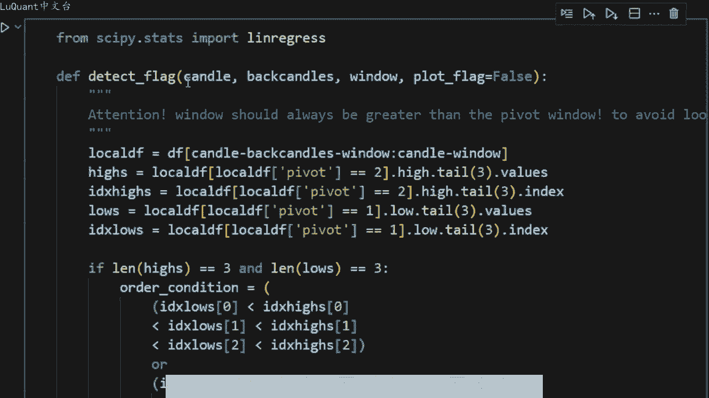

现在我们可以调用函数检测标志，提供蜡烛的索引。我们窗口中后面蜡烛的数量，如果我们将绘图标志设置为true，那么我们可以看到这个检测到的三角形，它不是一个完美的检测但。

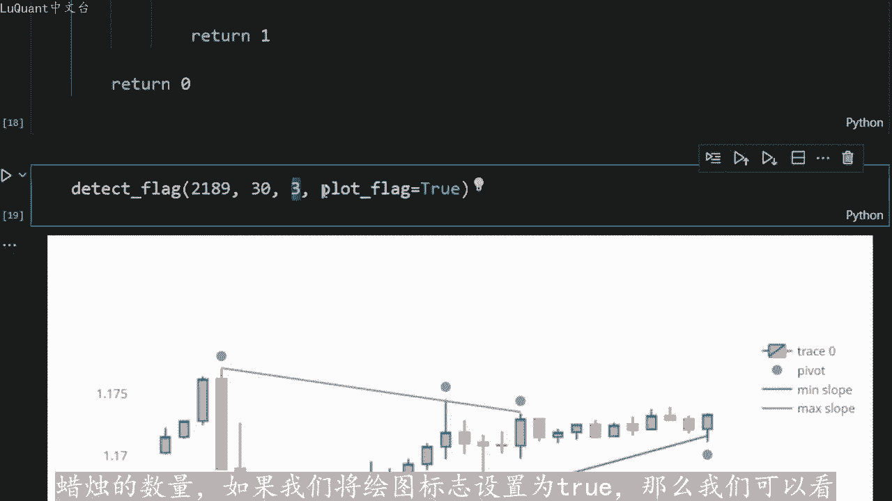

仍然是一个三角形，因为这里我们只取三个点，理想情况下，我们有4个点。所以如果我们取4个点，我们会有一个更好的三角形形状。所以现在我们可以应用这个函数。

数据真的所有行和所有蜡烛，我们将把结果存储在被调用的标志中。所以如果在某个蜡烛之前，我们检测到标志形成，我们将返回一个。所以函数是将返回一，这将保存在列标志。😡。

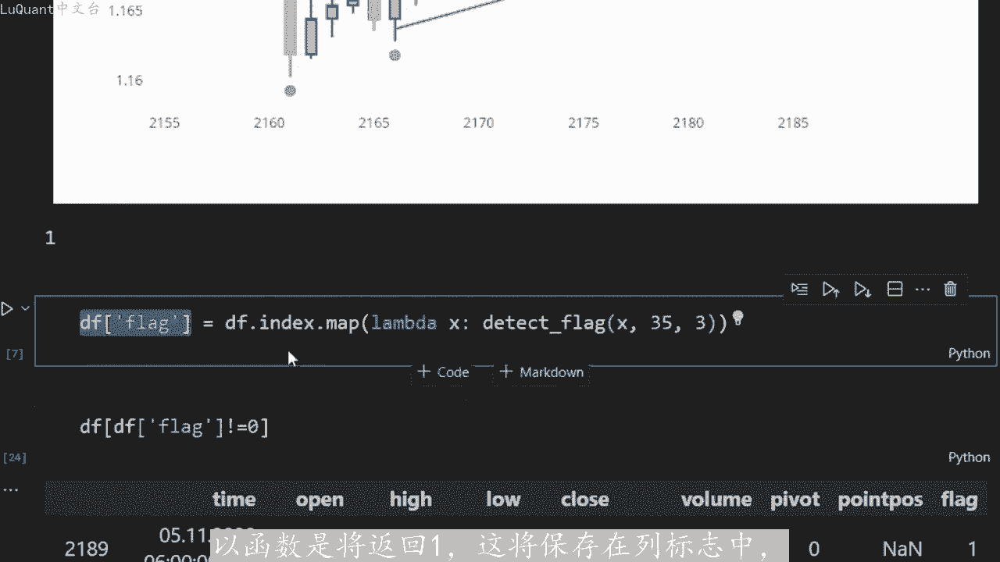

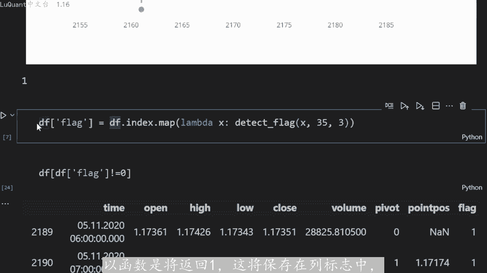

然后我将打印标志不为零的所有数据针形，这样我们就形成了这些三角形。我们可以在这里看到它们，以便我们可以识别我们有哪些蜡烛。您可能会注意到，比如我们有2180。190919293。

所以有一系列行在他们之前有一个三角形，这是完全正常的。因为在这根蜡烛之前，我们有一个三角形，并且它是完全相同的三角形。我们刚刚检测到以下蜡烛。然后是第二根蜡烛，第三根蜡烛和第四根蜡烛，以此类推。

我们在14000处，还有另一根蜡烛，以此类推。因此，我们可以在整个数据帧上运行此函数，并记录索引或蜡烛数量。

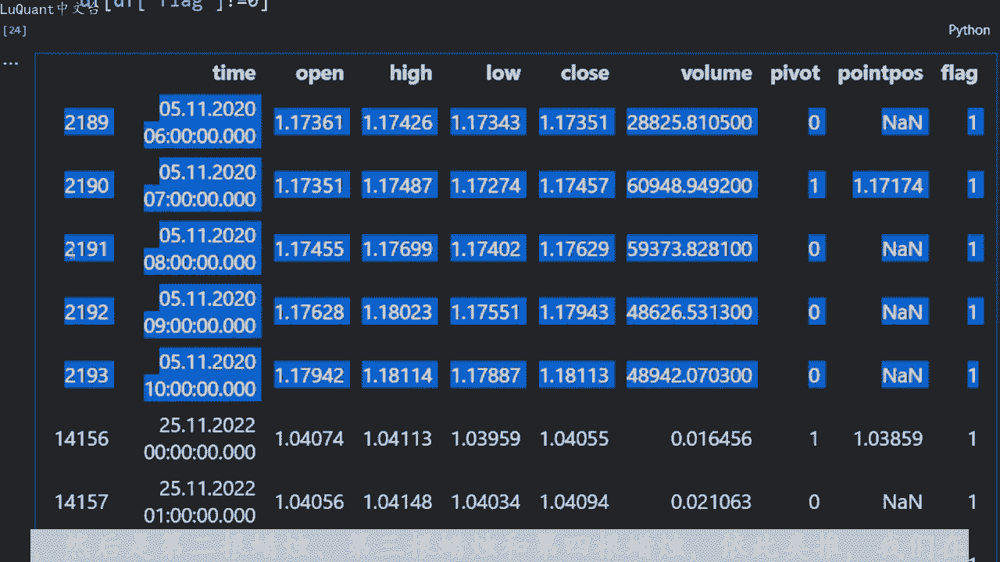

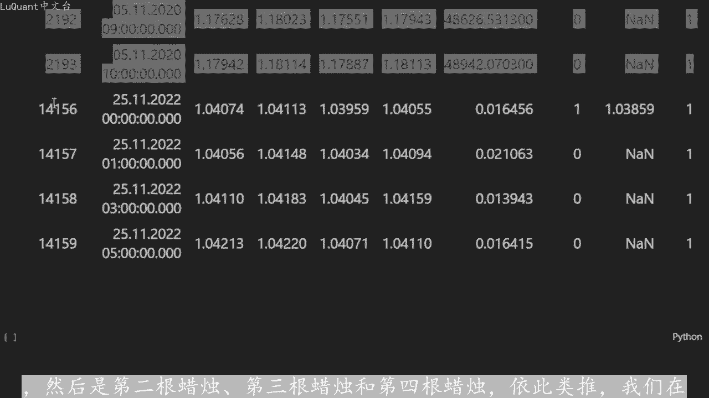

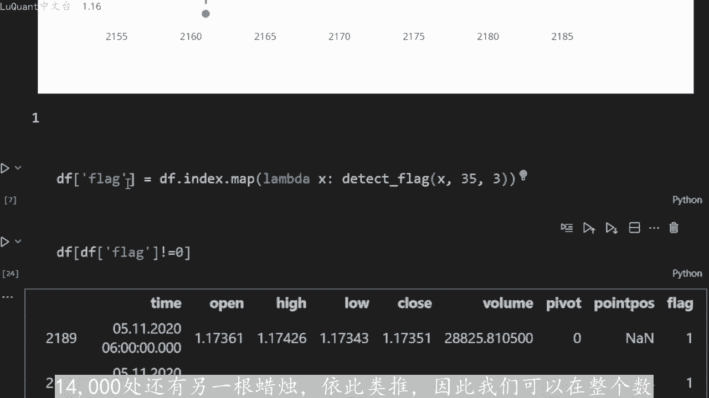

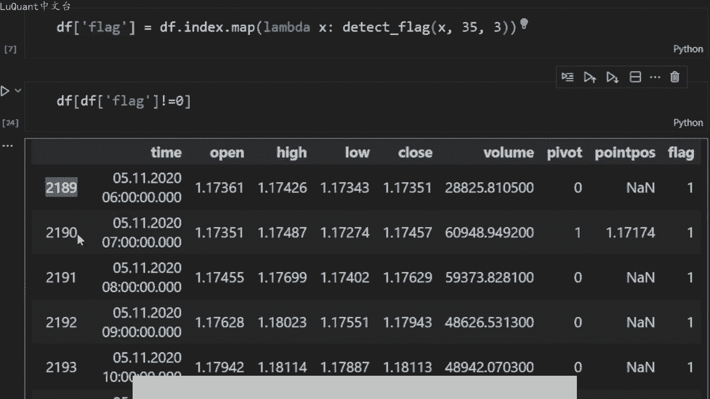

识别蜡烛之前我们有一个三角形，我们回到这里，我们将索引放在这里。😡。

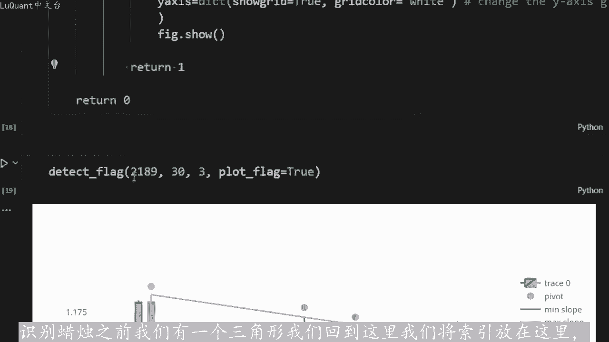

我们可以绘制它，我们可以看到他现在是如何工作的理想情况下，您可能想使用以下参数模型后蜡烛的数量、窗口。数轴，您可能需要更改这两个参数，N1和N2。因为我们使用了3个和3个。

您可能需要根据您的品位和方式选择更具选择性或更宽容的参数，想要定义您的标。

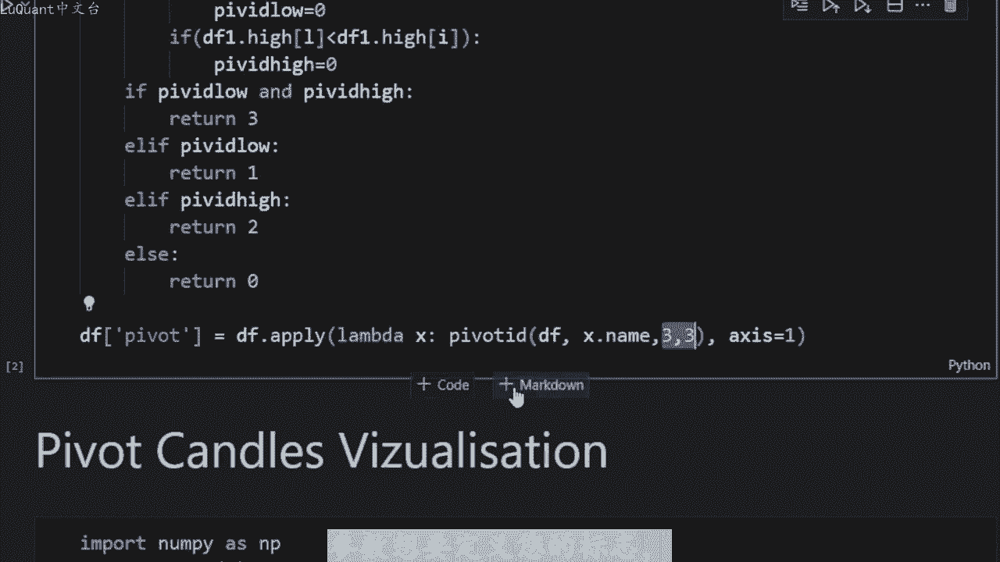

这就是我要告诉您的全部内容。我希望你们喜欢他，并发现这些信息很有帮助。直到我们下一次视频交易安全，下次再。😡。

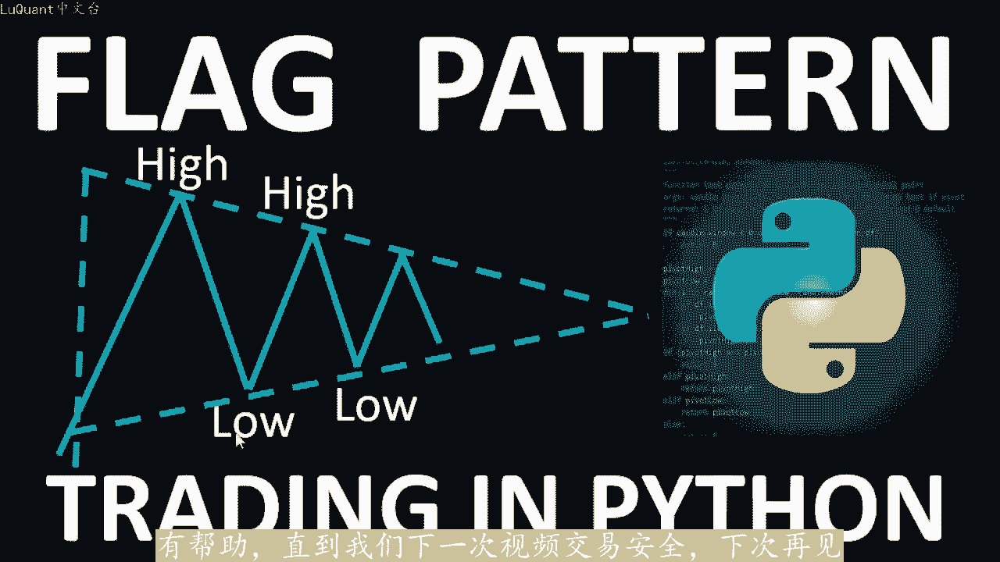