# python量化13：CHOCH 指标 - P1 - LuQuant - BV13x421Q7ux

您好，今天我们正在编写字符指标变化，也称为模式变化。这通常发生在您有一个清晰的模式，显示更高的高点和更高的低点，并且在某个点发生变化，表明趋势的潜在变化。我们可以在python中自动执行此检测。😊。

在本视频中以完整策略进行回测，我将向您展示如何用pyython编写该指标。您可以从下面描述中的链接下载代码，或者如果您有任何有趣的想法，您也可以尝试并应用您自己的修改要分享，请发表评论。

因为这也表明您对该通道的支。😡。

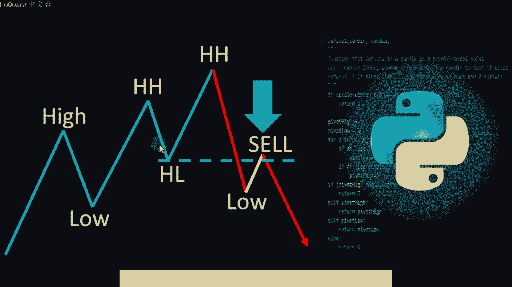

我们将研究的第一个模式是价格处于某种趋势中，具有更高的高点和更高的低点，但最后一个低值将跌破前一个低点，发出打破通常趋势模式的信号，通常会出现小幅回。回到该值旁边的某个支撑位或阻力位。

这是一个很好的空投入场位置。第二个设置也显示了模式的变化或特征的变化。当第三个I低于前一个高点，表明市场上的买家。某种程度上感到疲倦，卖家可能会介入。因此我们有一个较低的高点。

随后是一个较低的低点或低于前一个低点的低值，这也是等待回撤至新阻力区。在此时，采取空头头寸的绝佳机会显然方向相反，一切都是对称的。因此，如果我们看到下降趋势，价格可能会发生模式变化。在这种情况下。

我们会等待多头头寸。现在假设当前蜡烛是这个我。😡，需要首先检测模式是否发生变化。我们需要检测趋势，我们可以通过检查蜡烛是否高于蜡烛来做到这一点本例中的移动平均区线。如果上升趋势得到确认。

我们可以寻找分型或输轴点及高点和低点输轴。

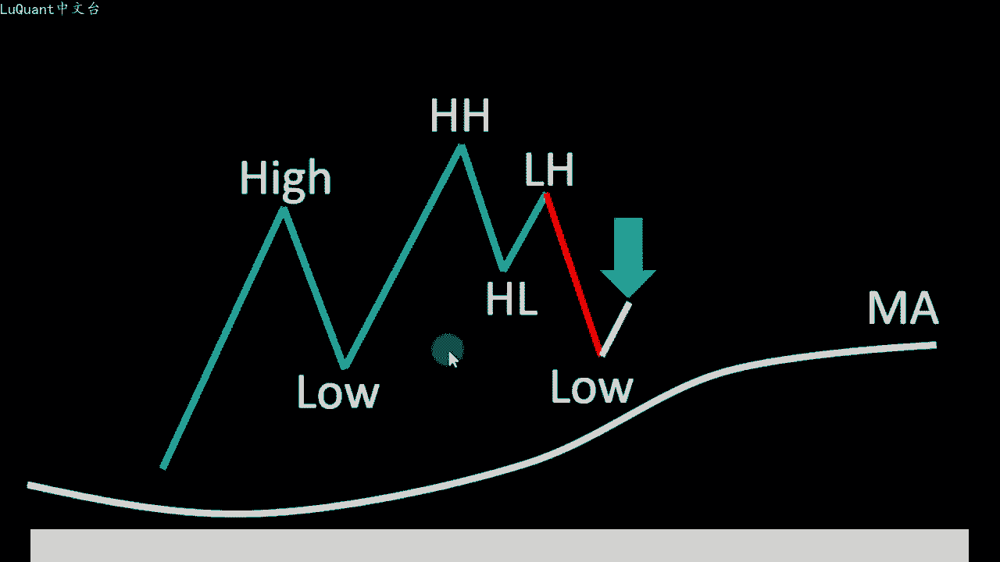

我们对一定数量的后蜡烛线执行此操作，在当前蜡烛线之前，留下一小段蜡烛线窗口，以避免出现在我们的测试中。有一些条件值得一提，输轴点应该遵循一定的顺序来验证模式的存在。7。

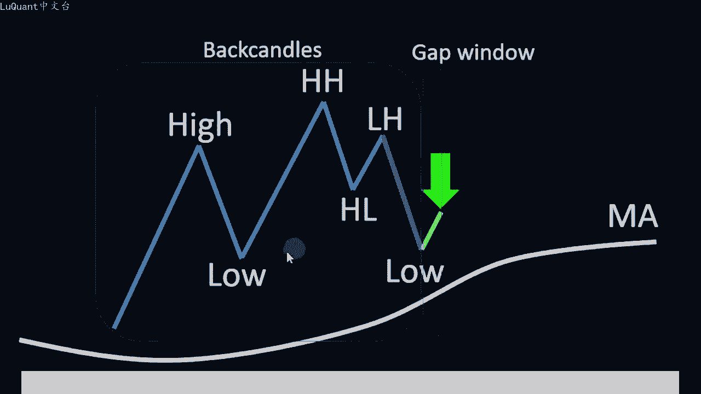

条件描述了我们正在寻找的模式的变化，让我们看看如何编写所有这些在pyython中验证我们的指标效率。所以这是我们的jupiter笔记本文件。首先我们加载数据，我有1个U美元烛台，其中包含。

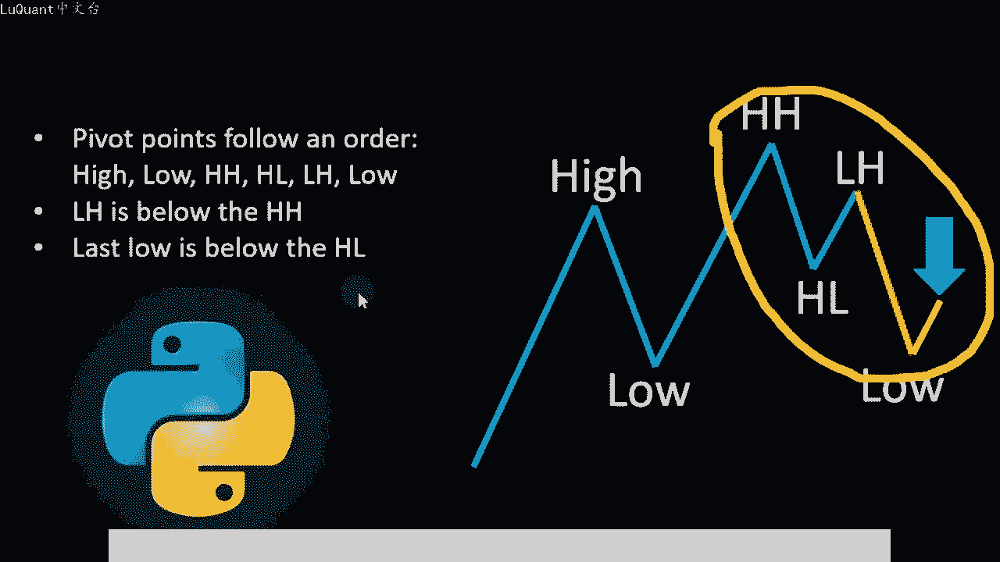

2003年至2023年之间的1小时时间范围数据。然后我还使用pas技术分析包来计算RSI和移动平均线。所以我使用指数移动平均线长度150。对于RSI，我在这里使用等于12的长度，只是为了该视频的简单性。

我只是切掉了一部分数据框，所以我只使用5000根蜡烛，您可以使用整个数据框，但计算部分会花费更多时。我们要做的第一件事是使用移动平均线检测趋势。我正在使用后手柄15。

这意味着我正在查看当前蜡烛之前的15个连续蜡烛，以检查它们是否都位于移动平均区线之上或之下。因此，如果所。这15根蜡烛都位于移动平均曲线之上，我们就处于上升趋势中，并且处于上升趋势中。相反的情况是。

我们在移动平均线下方有15根反向蜡烛。在这种情况下，我们认为我们处于下降趋势，因此信号要么等于一，表示下降趋势，要么等于2表。😡，上升趋势或等于3。如果价格上涨。

下面我们将此信号存储为数据框中的一个新列，称为M码信号。我使用的第二个函数是一个称为书轴的函数，它将减。当前蜡烛或具有特定索引的蜡烛是否是书轴，重点是它是高位书轴还是低位书轴，如果它是高位书轴。

函数将返回一个，因为这是一个高位书轴之后通常是下降趋势。如果它是低位书轴，那么我。预计在这个数轴之后会出现上升趋势，然后我们返回或函数在任何其他情况下返回。因此，如果当前蜡烛既不是书轴高点。

也不是书轴低点，我们返回零，并且该指标或该函数的结果。作为星列存储在数据框中，它被称为pivot。同样重要的是要注意我在此函数中使用的窗口等于5参数，因为它需要当前蜡烛的索引，但也是一个窗口。

该窗口是我们在当前蜡烛之前和之后查看的蜡烛数。为了确定它是高点还是低点，所以我们将蜡烛与其之前的5个邻居和之后的5个邻居进行比较，以确定它是高点还是低点。

或者都不是我们可以使用M将所有这些可视化这两个孩。所以我只是围绕书轴创建新点，将这些点放入数据框中的新列中，然后仅取数据框的一小部分，并可视化它们。我们可以看到那些紫色点，它们是书轴点或书轴蜡烛。

所以我们有一个书。

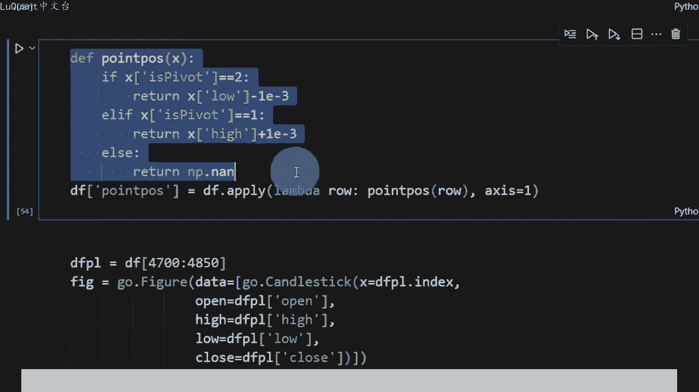

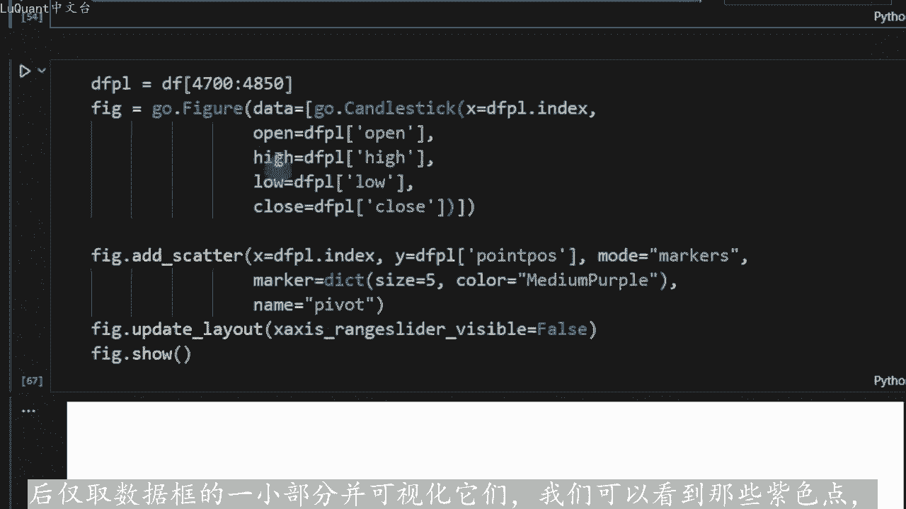

高点一个数轴低点等等。我们可以看到代码运行正常，功能运行良好，我们有数轴高点，有数轴低点，我对我的结果非常满意。现在看到这里，我们可以继续下一步了。现在我们必须定义一个新函数，所有神奇的事情都会发生。

😡。

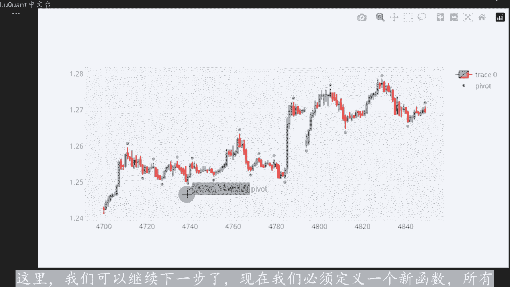

意味着我们检测这些字符的变化，所以我们需要检测趋势，更高的高点、更高的低点，以及正如我们在本视频开头所描述的价格正在突破这种模式。我们首先需要提供当前蜡烛的锁。😡。

但我们还需要定义后面蜡烛的数量和一个我们不会在其中操作的窗口。为了避免前瞻偏差，我们使用这些切片参数的方式是，我们将截取数据真的一个切片，其中蜡烛减去后面。蜡烛减去窗口是蜡烛减去窗口的第一个参数。因此。

我们正在获取与当前蜡烛相关的数据帧片段，我们需要测试它是否是先于形态突破或先于字符变化的蜡烛。

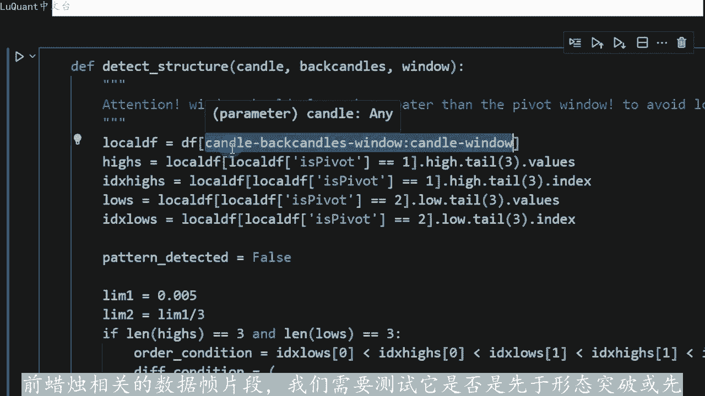

回到我们的演示，这就是我们正在做的事情，正在采取就在感兴趣的蜡烛之前的这个切片。所以如果这是我们的蜡烛，我们将切片缺口窗口和后蜡烛的数量，我们将仅检查该区域的高点和地。😊。

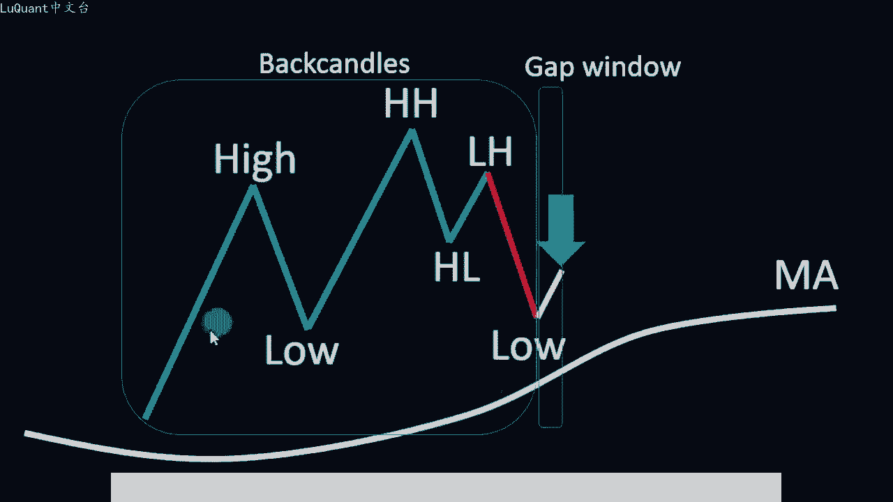

因此，现在将从我们的切片窗口中的本地数据框中选择高点，这些都是书轴等于一的蜡烛。我们只取最后三个高点的尾部，我们不需要更多，只需要最后三个高。我们记录这些高点的索引是一样的。

因为记住高点和低点的排列顺序，对于确定模式和模式的突破非常重要。然后我们就有了正在检测的低点数轴等于。书轴参数或数轴信号的低点，我们还采用该行中的最后三个值或最后一个负载。我们正在记录低点的索引。

我们将使用这些高点指数和低点以及低点的指数来检测形态应。形态是这样发展的。首先我们需要测试是否有三个高点和三个低点，这些是形成该形态所需的最小点或输轴点订单条件。如果我们。第一个高点之前出现第一个低点。

然后是另一个低点，然后是另一个高点，然后是另一个低点，然后是另一个高点。那么我们需要遵守的第一个条件如下，所以我们需要这个条件是正确的。那么我们还有另一个条件，我们需要添加第一个条件，确保我们有一个负。

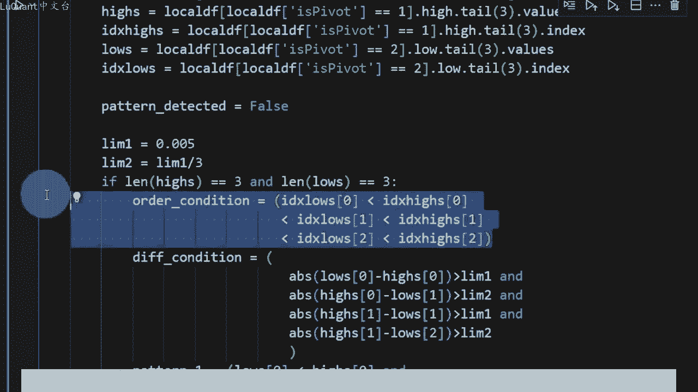

和一个高，然后低比高等等。所以第二个条件与这些高点和低点之间的差异，以及更高的低点更相关，和之前的低点等等。所以更多的是在外轴差异。

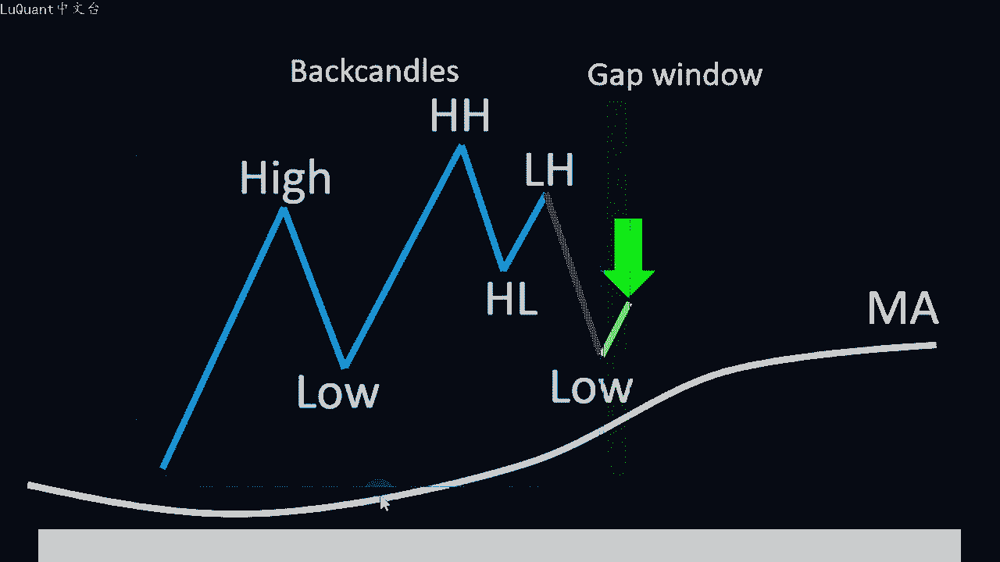

第一个低点和第一个高点之间的差异应该高于一定的限制。这是因为我们不希望价格的那些小波动被混淆一个模式，所以我们需要过滤掉这些，并确保我们只是采取价格的高位变动。

将设置这个条件及第一个低点和第一个高点之间的绝对差值应该大于限制一个值，这将取决于您正在处理的资产。因此，对于欧元美元，我发现这是一个很好的值，您可能想尝试这。参数，所以这就是这里的绝对值。

应该高于的限制限制一和高点的绝对值。第一个高点和第二个低点应该高于限制。2。请注意，如果我们在这里取这部分，那么我们。

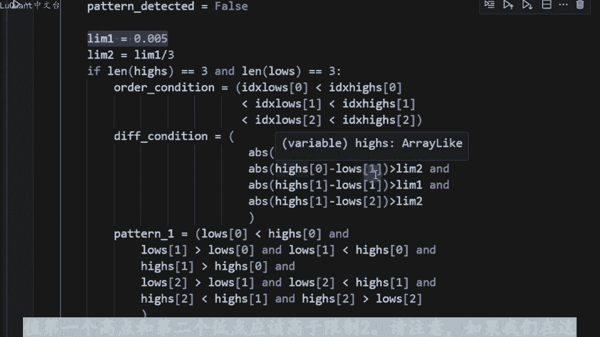

这个低点和这个高点之间有很大的差异，但是这个高点和第二个低点他们受到更多挤压，彼此更接近。因此，在这种情况下，我们需要一个不同的限制，该限制比之前的限制更宽容或更小。所以我们需要两个限制，一个用。😡。

上升趋势运动，一个用于回撤运动，我采取了第二个限制，此处为限制2等于限制1除以3。您可能还想对该变量的不同值进行不同的实验。无论如何，最高点和最低点之间的绝对。

第二个低点高于限制2，然后再次是最高点，一减低E应该高于限制一，这是第二个向上运动。正如我们在这里看到的，然后这个运动应该高于限制2。正如我们在这里看到的所。

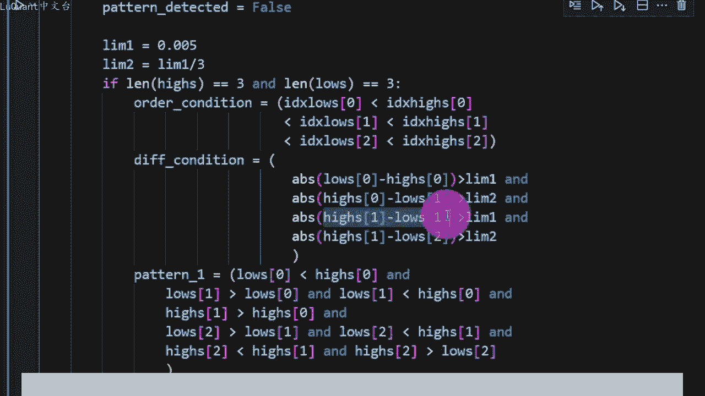

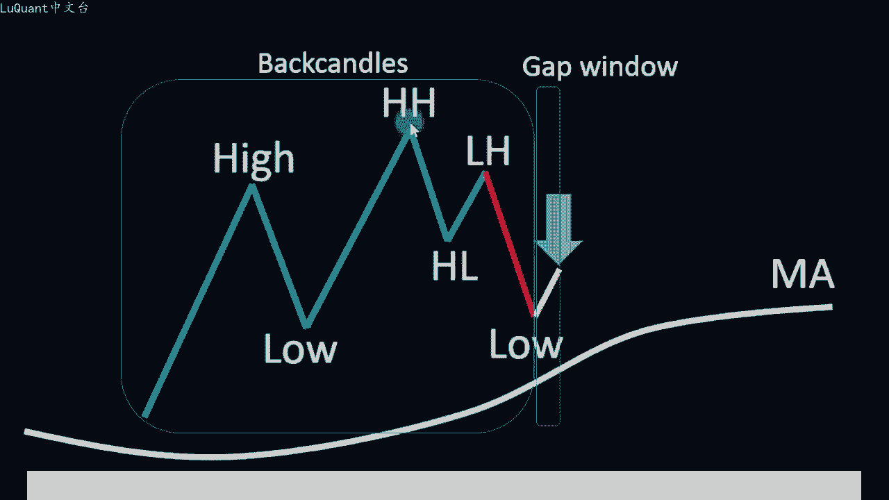

目前我们已经定义了定义该模式的参数。我们现在发现我们必须突破该模式。我们已经证明有两种不同的方法可以突破这些模式。第一种是从较高的高点突然下跌到非常低的水平。然。

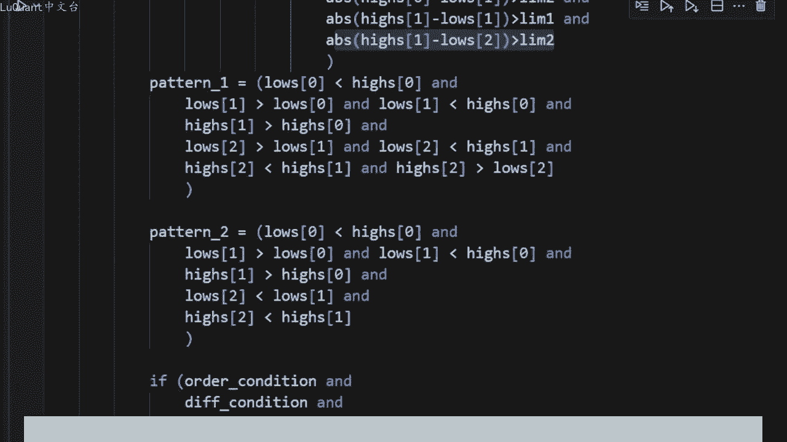

跌破该模式，这里更高的低点。第二个是当我们的最后一个高点低于前一个高点时，就像买家在市场上失去了动力，然后价格突然下跌，跌破前一。第一点，这也是另一种情况很好的机会。所以我们将对这两种模式进行编码。

以突破上升趋势模式。这两种模式在这一系列条件中定义。所以现在如果我们有订单条件和差异条。

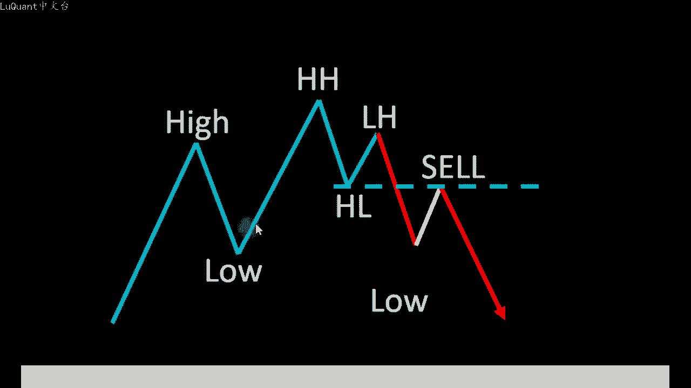

而且还有这两种模式之一，如果在这种情况下出现模式一或模式2，则我们的模式检测到的参数或变量等于true。在任何其他情况下，我们返回一，如果我们没。

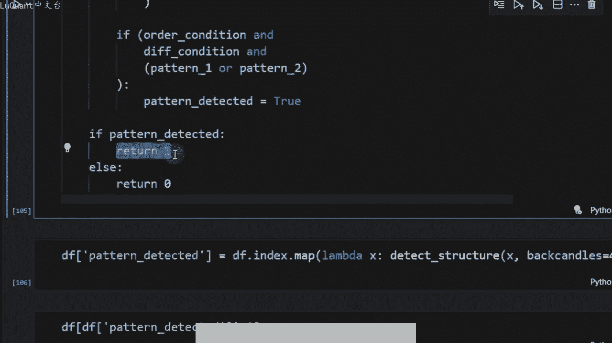

检测到此模式或中断模式，我们返回零，这就是整个函数的作用。所以现在我们可以对我们的数据运行这个函数，并将结果存储在模式检测列中。我只是向您展示我们有信号的型。所以我们。

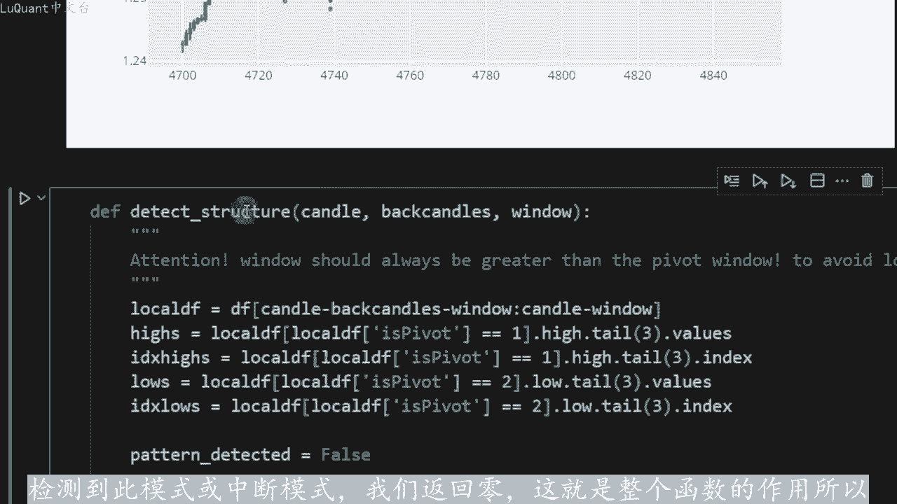

这行索引376等等，这样我们就可以测试，并将这些信号可视化。例如这里我们有4779，它是检测到此突破模式的第一根蜡烛，后面紧随其后的是4780818283到80。

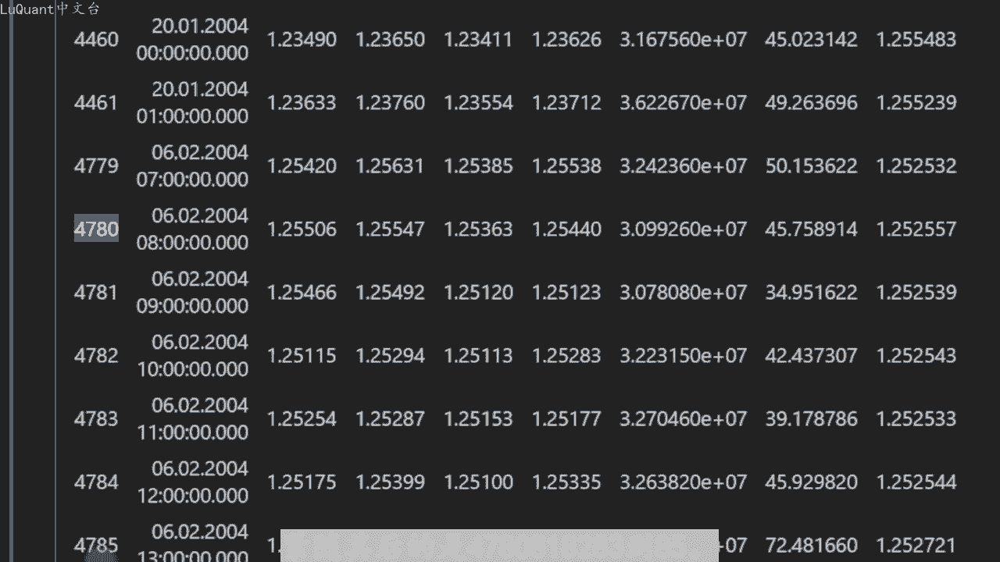

所以我们不必采用其他蜡烛，因为显然我们需要为了尽早检测到信号，让我们将第1个4779返回到我们的绘图单元。所以我在4700到4850之间绘制，这是一个切片，我们将常。

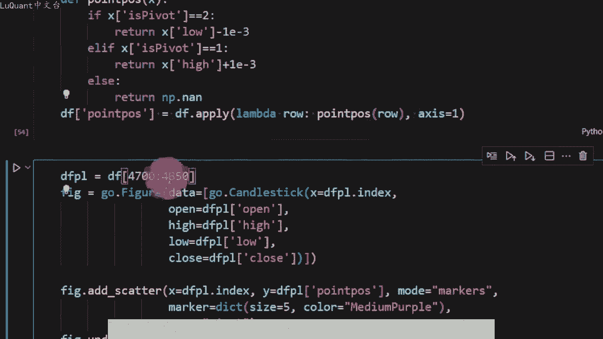

找到蜡烛4779，所以它应该就在这里。我们可以看到该模式。因此我们先有一个低点，然后是一个高点，然后是一个更高的低点，然后是一个更高的高点，然后是一个更高的低点，然后突然出现的高。低于前一个高点。

所以我们假设买家失去了动力，然后又出现了另一个高点高点也低于前一个高点。所以我们确实检测到了这种模式。这里我们有一个小上升趋势，高点更高，低点更高，在某种意义上被打破。所以我们在这里的性格发生了变化。

😡，当然我们可以看到，这是接下来是绿色的长蜡烛，所以这是第四个信号，但代码工作正常。它正在检测这些模式，就像我们可以在不同的蜡烛上测试它一样。所以我选择376，所以这里的第一行。

例如我窃骗我的新数据框为300到450。这就是我们在这里可视化的内容。因此376应该位于此处附近。因此该蜡烛显示可能的模。

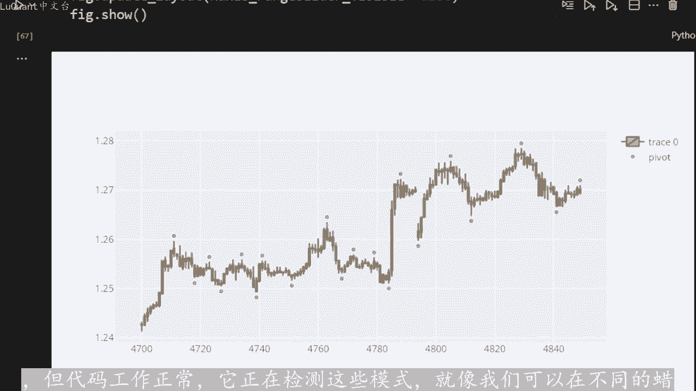

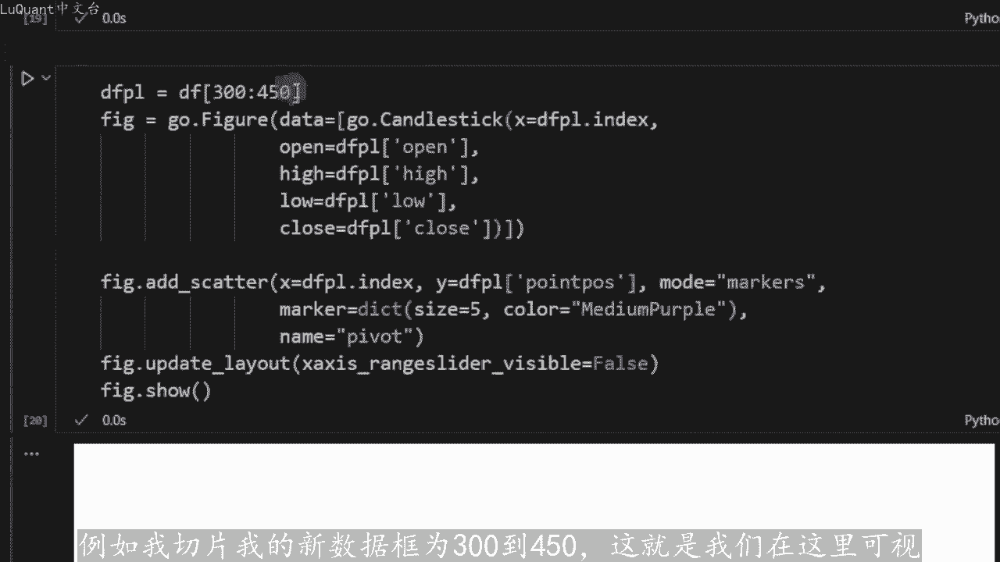

向下降趋势变化，但奇怪的是，它发生在这个蜡烛图上，所以我们有更高的低点、更高的高点，然后更低的低点突破该低点。然后我们在416处看到这个精确的回。我们将进入市场，正如我们在该视频的介绍中所描述的那样。

但是对这些模式的检测将高度依赖于我们在代码中使用的参数。请记住，我们已经使用了限制一和限制2。我们。

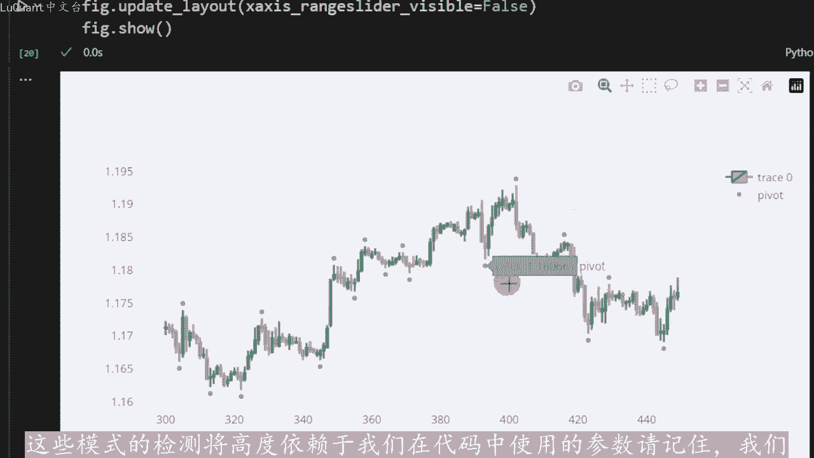

书轴窗口我们有用于检测此模式的后手柄，我们一直在使用等于40的后蜡烛参数。我们正在检查前40个和6个窗口。您可能想对这些进行实验，我还建议您非。谨慎的使用这些限制，不要非常严格的使用这些限制。

因为您将限制之前检测到的信号数量，我结束了这个视频，我要感谢你们所有人的支持批评，以及我们在评论中讨论的有趣想法。😊。

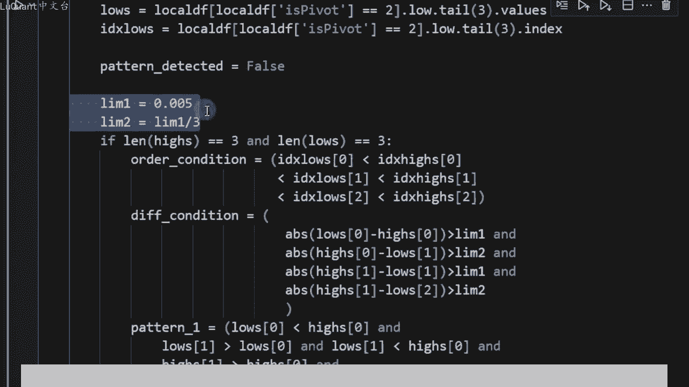

你们中的一些人甚至分享代码片段，感谢你们的帮助。我非常感谢你们对所提供的内容的兴趣，和这就是我要向您展示的全部内容。我希望这些信息对您有所帮助，并且您可以在内容中找到一些灵感，直到我们下一次安全交易。

下次再。😊。

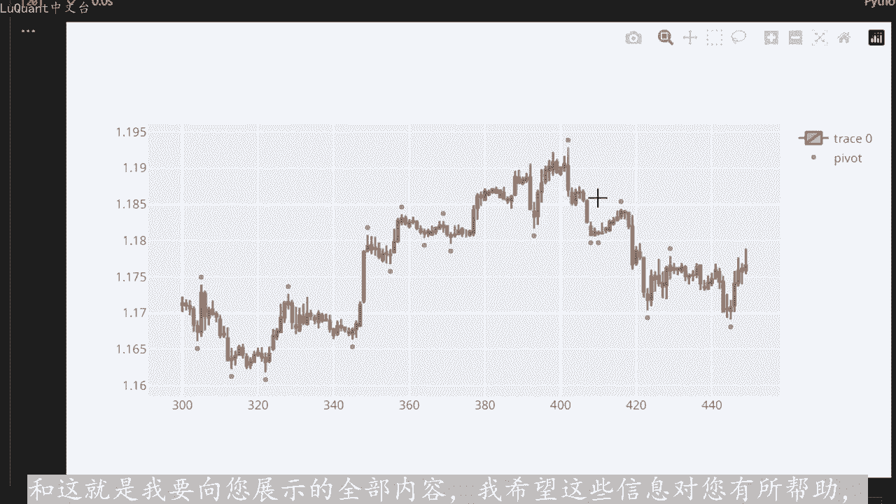

