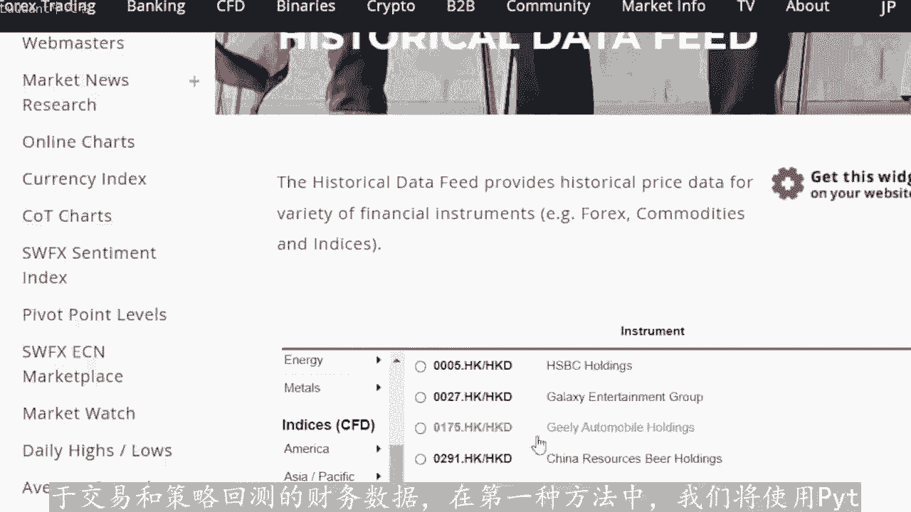
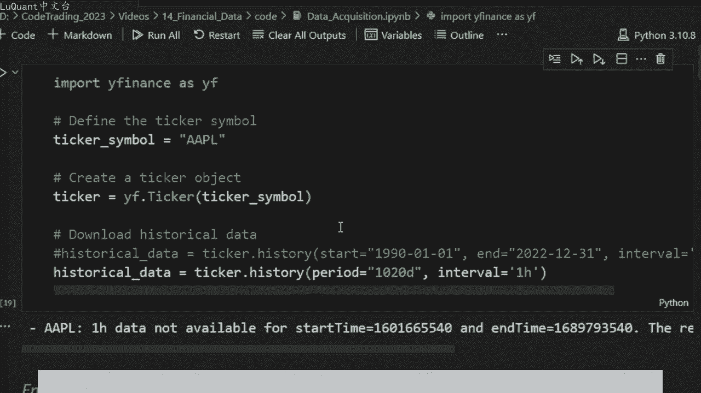
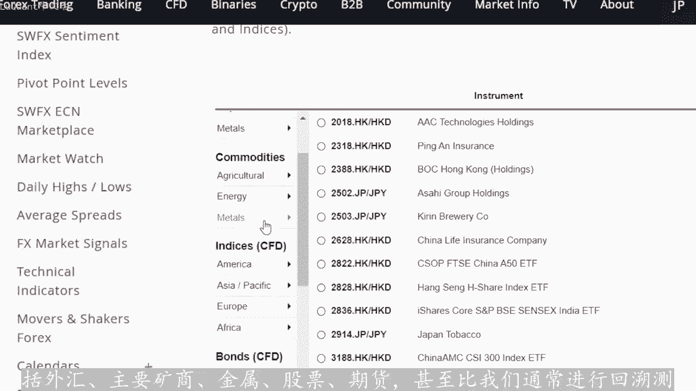
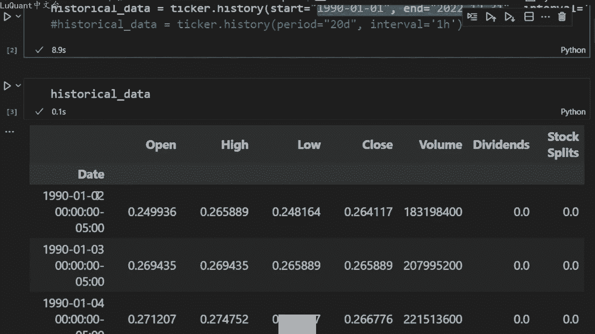
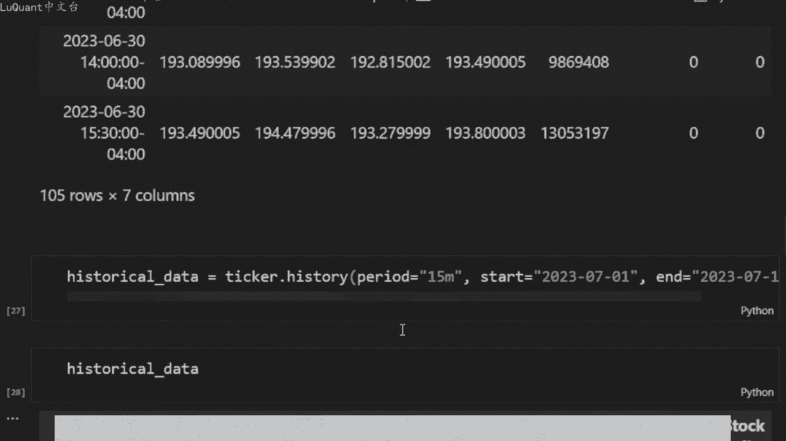
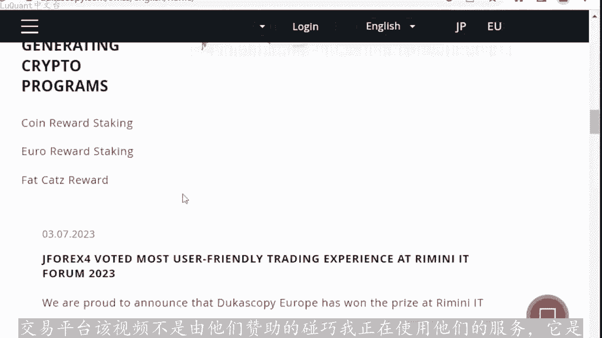
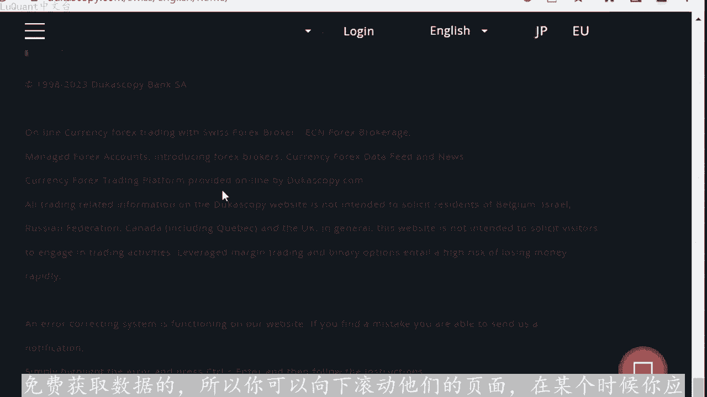
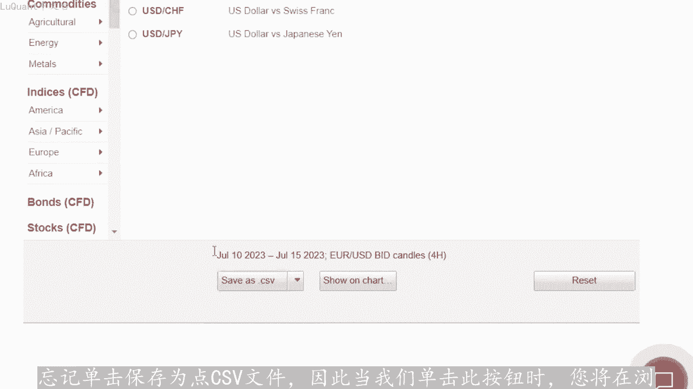
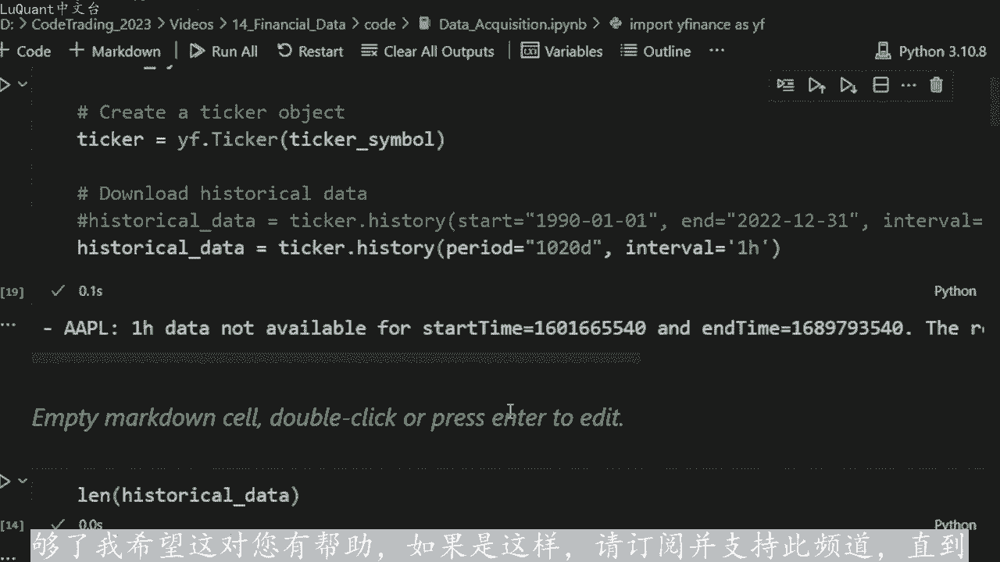

# python量化14：数据问题 - P1 - LuQuant - BV1yx421k7gi

今天我将向您展示两种免费且简单的方法，您可以使用它们来下载用于交易和策略回测的财务数据。在第一种方法中，我们将使用pyython代码。您可以从下面描述中的链接下载脚本。第二种方法是使用代。

免费账户的ccake平台，您可以免费访问大量数据，其中包括外汇、主要矿商、金属、股票、期货，甚至比我们通常进行回溯测试所需的数据还要多。我制作此视频的原因是我收到的关于这个主题的请求数量，很多人都问。

从哪里获取数据？所以让我们从第一个方法开始，这是直接来自python的最简单的方法，请确保在运行此代码之前安装wifi库，通过使用PI pin story finance。所以我这样做的方式。

你可以在你。代码或vis code中打开一个终端。如果你没有终端，你可以piep安装它，你也可以在你的jupiter中执行此操作笔记本，只需打开一个代码单元。您可以输入感叹号并标记。

然后pyping story of finance，所以我不。运行该单元。我想，如果我运行它它应该显示我已经安装了该软件包似的，所以他已经满意。在您的情况下，他将安装这个。

然后您可以像任何其他库或任何其他包一样导入wifi。然后我们手。指定您感兴趣的股票的股票代码。在此事例中，我使用AAPL，我认为它是以苹果股票为例，然后我们创建一个更厚的对象。

因此这是使用wifi ticker。完成的该函数将股票代码作为参数，因此它取决于您要下载哪只股票的数据，然后我们可以使用历史函数，要下载该叫粗符号的历史数据。我们指定间隔和一些其他参数。如您所见。

因此我们。开始日期结束日期，然后是我们可以在此处看到的间隔。因此在这一行中，我正在下载使用间隔一天的开始和结束日期，这意味着它是每天的时间范围。因此，为了向您展示它的作用，我将评。😊。

我们现在不打算使用的第二行，我将运行它，我们可以等待数据下载，然后我们可以打印数据框。该数据框应该包含这两个日期之间apple的数据，所以它是1990。到2022年。

这是很多数据让我们打印这个我们可以看到，我们有现在有8315行，这意味着我们刚刚下载了开始日期和结束日期之间的apple股票价格，并且我们有8315天的数据。因为每。

时间范围内的每一行对应于一天，并且还有另一种方法可以做到这一点，可能已经注意到第二行。在这种情况下，我将命令第一行，所以我不只是指定开始和结束日期，而是输入据点。我使用perio。

参数这里的据点等于20天，所以这会做什么？它将下在过去20天的每小时时间范围。如果您想直播，这很好。所以如果。使用每日时间范围下载过去20天的数据。我将再次运行历史数据的内容。我们可以看到。

我们应该有20天，所以我这里没有长度，因为他打印了所有行，所以我将打印历史数据的长度数。😡，它应该等于20，这正是我们所拥有的。因为我们刚刚下载了20天的时间段，意味着过去20天，并且间隔等于一天。

所以我们刚刚下载的每日时间范围下载了过去20天的数据。这一切。😊，进入了我们可以在此处看到的数据框历史数据，您应该注意一些限制。因此。

可用的时间范围为一分钟、2分钟、5153090分钟、1小时1天、5天等等。最多3个月。但是。分钟的数据。因此，如果您想使用一分钟的时间范围下载数据，则只能检索最近7天的数据。除了最近7天之外。

您无法访问任何内容，并且日内任何内容，因此少于一天，每小时时间范围4小时等等。仅适用于过去60天。因此，如果我们尝试下载，例如一分钟时间范围，那么EM或最后8天，我们通常应该有错误。

就是我们在这里可以看到的内容。因此，对于一个索引的开始时间和另一个索引的结束时间，一分钟数据不可用。因此，消息的其余部分仅允许显示7天的一分钟力度数据，现在按请求获取。如果我。再次开始使用7天。

它应该可以正常工作，这就是我们所拥有的长度约为2664。请记住，wifi包将清理中。和休息日，因此我们只能获取蜡烛或数据。如果我们尝试较长时间的15分钟时间框架，假设是70天，我们执行此操作。

我们可以看到15分钟数据不。用让我们看看请求范围必须在最后一个范围内的限制60天。所以如果我们将其减少到最后60天，我认为它会起作用，而且它起作用了。所以我们现在可以打印数据帧的长度，所以它。😡。

1547，所以这是15分钟的时间范围。我认为更多你增加时间范围，你可以访问的数据就越多。例如，如果我们回到1小时的时间范围，我们打印60天，我们肯定可以访。😊，这个让我们尝试将其增加到120天。

也许仍然不错，320天还是可以的。我认为大约700天是限制，或者我们可以将其增加。1000多天让wifi告诉我们限制，所以1小时的时间范围是730天，这是wifi的又一个限制。

我们应该意识到它不是雅虎的官方产品。因此这意味着它依赖。网络抓取，并且可能并不总是提供准确或最新的数据，并且这是由第三方开发的有关维护的信息。我们也不知道，在某种程度上。

无论是否继续需要注意的另一点是您可能会受。可以使用它进行的许多查询的限制。因为这依赖于网络抓取方法。因此，如果您重复查询，这意味着，如果您只是构建像这样的策略，尝试回溯测试等等。

它不应该给您带来任何问题。我的意思是，如果您查询1020或100次，这不。问题问题是，如果您构建一个机器人，并且您尝试在24小时左右的时间里连续多次查询每分钟。因此，系统可能会在某个时刻对其进行标记。

目前它正在公。很多交易者正在使用它，而且目前效果很好，我们现在可以享受它了，我将继续使用下一个方法。该方法也同样简单，并且使用coque平台也是免费的。所以杜高斯贝是美国银行集团提供。

交易平台，该视频不是由他们赞助的，碰巧我正在使用他们的服务，它是免费获取数据的，所以你可以向下滚动他们的页面。在某个时候你应该找到这个历史数据源。所以我。😡。

点击它它将打开这个界面，就在这里，您可以在其中选择您感兴趣的数据。因此我们有外汇，我们有主要金属的交叉盘等等。你有商品指数债券股。任何您想要的东西，我从来不需要任何不在此列表中的东西。例如。

我们要选择欧元美元，所以我要选择外汇主要货币欧元美元，我们要选择这个，然后我们可以选。刻度数据或者假设我选择我们的时间范围。例如。我现在正在下载4个小时的时间范围。

您可以选择是您想要的出价还是要价以及开始日。和结束日期的日期，我们还可以选择过滤公寓，意味着周末和休息日。所以我禁用这个我只是想保留所有数据，然后过滤pyython日开始时间中的所有内容。

我通常使用UTC时间到GMT已获得世界时。精度可能是数百万或数千，然后你只需按下载，并这是您必须创建一个账户的地方。它是免费的，没有钱创建这个账户，您可以选择免费选项，只是您需要一个登录名和密。完成后。

您只需单击下载即可登录并单击下载。您可以获得CSV格式的文件文件正在下载。我刚刚登录，所以有时下载文件时会卡在50%，然后不。忘记单击保存为点CSV文件。因此，当我们单击此按钮时。

您将在浏览器或下载的文件中获取该文件，这基本上是两种免费且非常简单的方法。您可以在其中获取历史数据。我通常还使用第三种方。

经纪人这样，如果您想更频繁的查询数据，您可以从经纪人流逝传输实时数据，这样您就不会被禁止使用wifi或任何其他方法。但为了回溯测试，如果您只想拥有CSV则可以进行回溯测。

文件或下载数据真来测试指标或策略的想法。我认为这两种方法应该足够了。我希望这对你有帮助。如果是这样，请订阅并支持此频道。直到我们的下一个视频交易安全为止，下次。

