# python量化15：回测与管理 - P1 - LuQuant - BV1ix4y127rg

这是我想告诉你的一个故事。十0年前，我开始和我的一个朋友进行外汇交易。我们想出了这个天真的聪明想法。我告诉他，当我做多时，我会让他知道他应该做空在同一资产上。同时换句话说，如果我买他就会。😡。

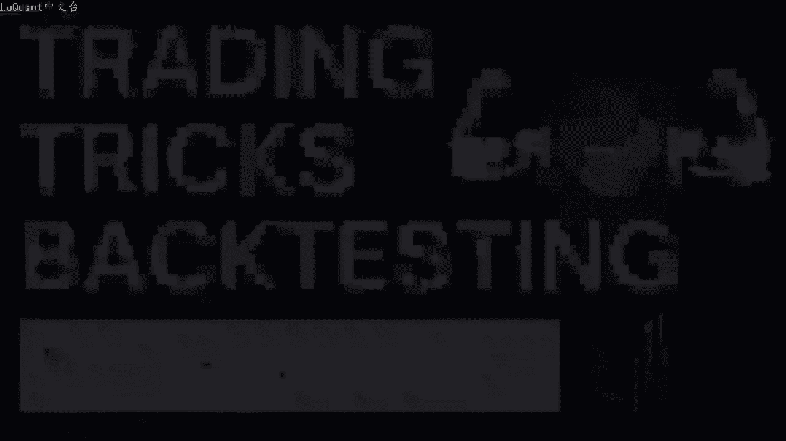

相反，如果我卖他应该这样买，如果我输了，他就赢了。如果他输了，我赢了，至少我们中的一个人将成为赢家。这个有趣的实验。当我开始交易时，显然一开始，人们认为这是一种简单。😡，赚钱方式或赚钱机器。

所以我选了几门课程，读了几本书，我还写信给我的一个朋友介绍这个爱好。他发现这个想法非常有吸引力，所以我设法说服那家伙和我一起通过这种方式赚一些额外的钱，但不用说投资的钱。😡。

消失了这些课程在现实生活中没有多大帮助，我和我的朋友一直定期擦拭我们的账户。当时的3年多时间里，我们仍然认为交易是一件容易做的事情。尽管我们从未真正获得可持续的利润。但我们只连续三年不走运。

所以我们想出了这个聪明的想法，即我们每次都朝相反的方向前进。一次我们以这种方式进行交易。如果我输了，我的朋友就会赢，如果他输了，我赢了，我们中至少有一个人会成为赢家，我们会以这种方式击败市场。😡。

我们再次抹掉我们两个账户的原因是什么？告诉您这个故事是为了强调交易管理的重要性。这种情况发生在交易开启后，大多数初学者交易者都在寻找完美的神奇指标或最佳信号。忽略了可能影响我们大部分交易结果的交易管理。

因此，首先要记住的一点是，大多数交易发生在交易已经打开之后，市场是动态的，可能会。一两个小时内发生变化，因此您的交易条件可能也必须改变，以跟随市场的变化，固定的止盈和止损水平是不够的。因此。

这对于任何交易来说都是一个良好的开端。但您需要使其更加动态。即使您拥有世界上最好的指标，也不意味。您的策略将会盈利。如果您的交易管理不善，想象一个指标在这个特定点触发多头信号，价格上涨。

达到您此时的止盈。并且您在这种情况下进行了一笔很好的交易。在类似的情况下，您会得到完全相同。指标触发同样的多头信号，但这次价格确实上涨了一段时间，但没有达到您的止盈水平，然后反转下跌，交易停止。

尽管他在一段时间内是赢家，这是一种令人沮丧的情况。您可能会开始后。保持仓位开仓后，通过更好的交易管理，可以避免这种损失，这是降低损失风险的交易管理方法的一个事例。因此想象一下，此时您收到相同的买入信号。

您以固定止损和获利水平时。然后价格上涨，并且在上涨过程中，您决定兑现一半头寸，而不是等待价格达到止盈水平。因此至少您口袋里有一半，您可以平掉一半头寸。买入价和另一半仍处于开仓状态的止盈价之间的中间位置。

您可以修改止损值以匹配买入价。这样万一价格下跌，您可以实现盈亏平衡，并且仍然保持0。5作为回报在这。情况下，您的交易不可能在未来给您带来任何损失，所以接下来会发生什么？如果价格继续上涨。

您仍然会赢得另一半交易，但如果价格下跌，交易将被停止，不会造成任何损失，这样您只能保。😡，初始仓位一半的胜利，该仓位较早平仓，因此，要么您赢得0。5。在这种情况下，这是最坏的情况。

要么您可以赢得整个仓位及整个仓位，这是您可以管理自己的仓位的多种方法之一。在本视频中的交易中，我们。😡，使用pyython以数字方式测试交易管理思想，只是为了向您展示如何以算法方法执行此操作。

并揭示常见事例之间的一些差异。我们可以测试的第一个也是最简单的事例，非常基本。使用固定的止损和止盈值具有固定的。盈止损比率。那么第二个，我们可以使用追踪止损，其中止损值将跟随价格。

只要它与我们可以持仓的方向相同，还包括在我们的代码中。当价格达到止盈水平的一半时，平仓一半的头。正如我们在本视频开头提到的，我们还可以添加修改剩余一半持仓头寸的止损水平的变化，也可以变得巧妙。

尝试将止盈水平分成三个或更多相等的水平，而不是两个这。我们就可以在每个水平上关闭3分之1的未平仓头寸。所以在本视频的其余部分中，我将向您展示如何您可以用pyython编写所有这些不同的商标管理事例。

并将它们包含到您的回溯测试和算法交易中，这是我们代码这是jupyter笔记本文件，您可以从视频描述中的链接下载该文件。因此，在第一个单元格中，我们正在加载数据。因此我将其加载到pas数据框中。

我使用的是SP500美元价格。这。

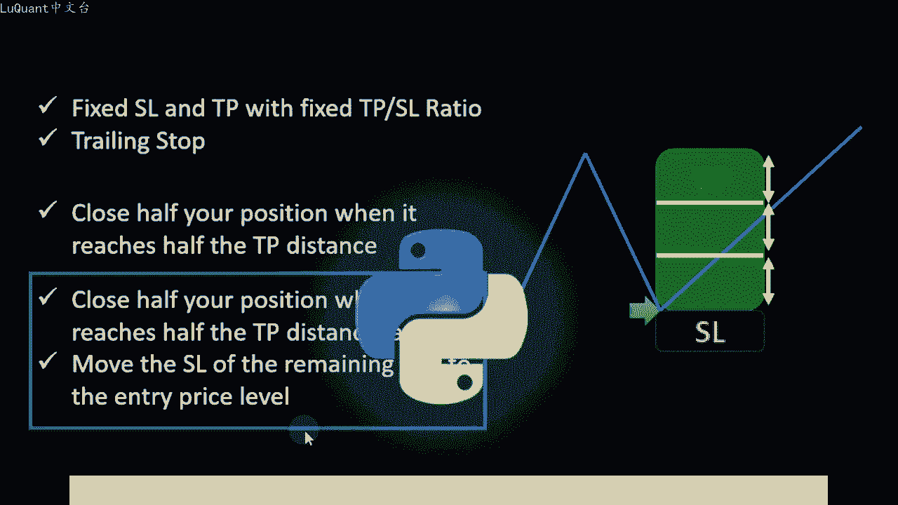

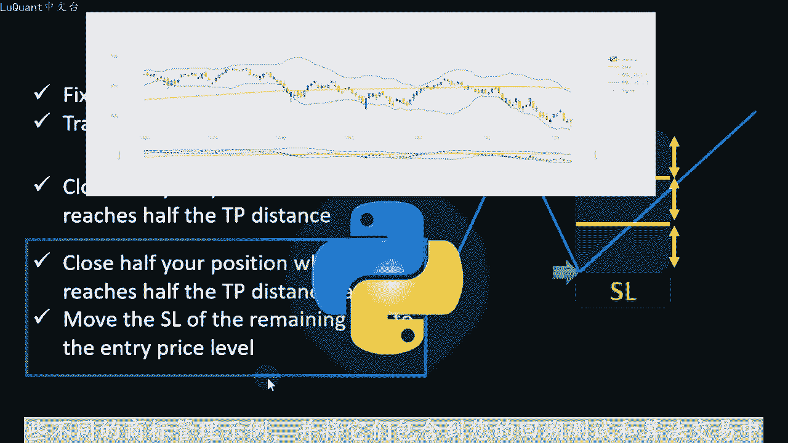

日线图，因此是2017年至2022年之间的每日时间范围，这是我们数据的内容。因此我们有时间我们不打算在这个视频中使用它，我们有开盘价、收盘价、收盘价和交易量。然后我使用pandas技术分析包来计算一。

平均线，这是一个简单的移动平均线函数，长度为200。我正在计算还有长度为2的RSI。因为我使用了使用RSI的策略，我们将向您展述。

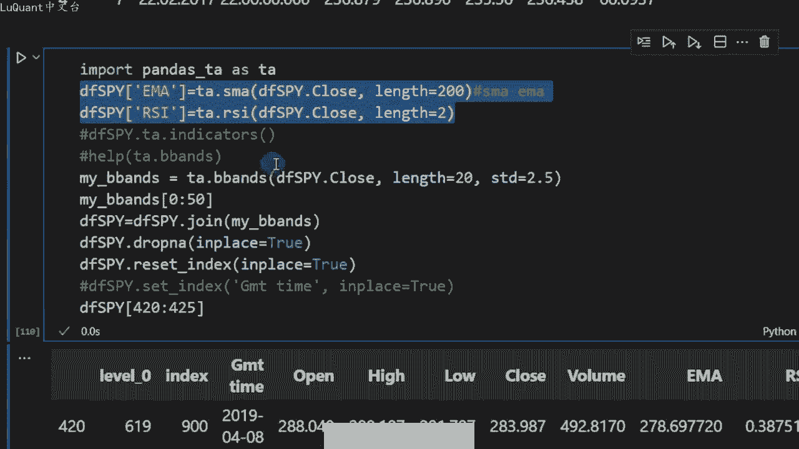

使用布林线的策略的净值，以及这些是背面测试结果，以便我们可以拥有正增长的净值。正如您在几年中看到的那样，我正在使用布林带，这是Rno C使用布林带发布的策略。正如我们所说，所以。

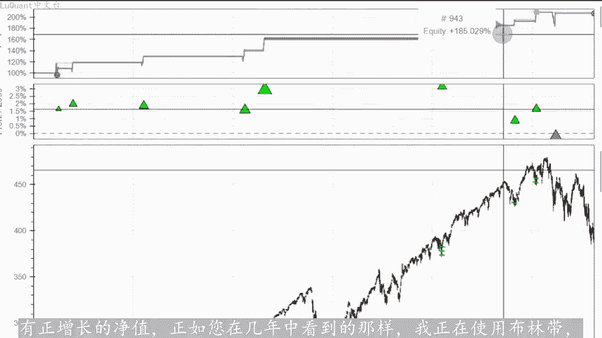

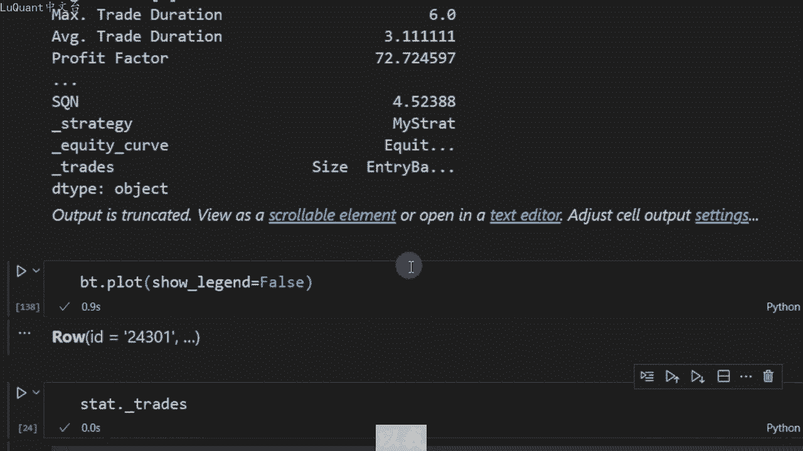

将向您展示详细信息。我以此为例的策略以及移动平均线和RSSI我使用的是布林带长度20标准差2。5这些。

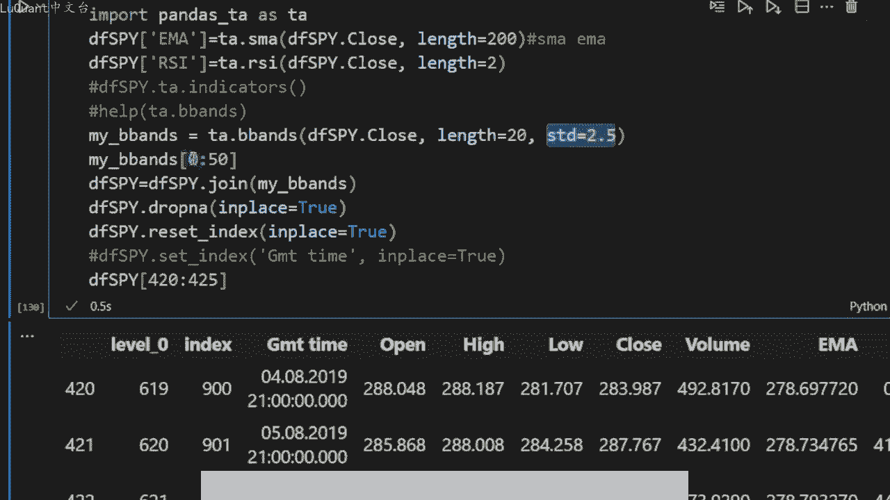

我们的数据框中存储为新列。因此，如果我向右滚动在数据框架内，我们有价格交易量移动平均线RSI布林线下轨、中轨、上轨等该策略的第一部分。检查蜡烛是否高于或低于移动平均线。如果这些高于移动平均线。

我们正在寻找上升趋势，我们只寻找多头头寸，这意味着我们只在这种情况下寻求买入。而在相反的情况下，我们的蜡。低于我们正在寻找的移动平均线曲线下降趋势。因此，在这种情况下，我们只寻找单元格位置。

因为我们使用每日时间范围，我正在寻找高于或低于移动平均线的三个连续蜡烛来举。趋势。所以如果我们处于根据移动平均线规则呈上升趋势，同时，当前蜡烛收盘于布林带下线下方，则这是买入信号。因为我们处于上升趋势。

并且价格回撤。布林带下线下方，并且在相反的方向。如果艾或移动平均线确认下降趋势，那么我们将等待价格收于上方线或布林带曲线之上，这样它就会向上回调。我们预计它会反。向下跟随趋势。所以在我们的例子中。

这是一个单元格位置或迈出信号。我们将这些信号存储为数据框中的附加列。因此，我要确认这一点，我将滚动到右侧，并检查哪一列是数据框中的最后一列。这种情况下，我们有一个订单信号。

它是我们根据我们的信号决定进入市场的价格，同时考虑到MI信号和布林带信号。请注意，如果DMA等于2。

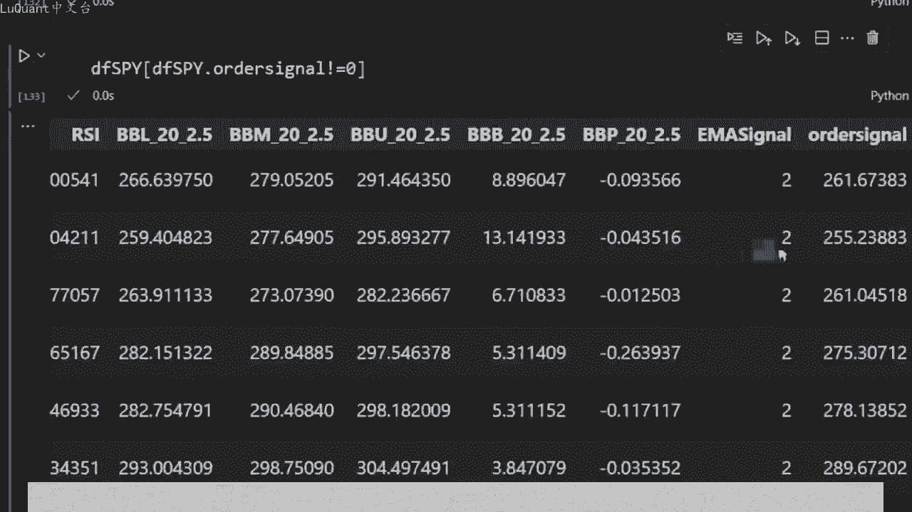

意味着它是买入或多头头寸信号。如果它等于在这些事例中不可见的信号，那么它是卖出信号，但它不可见。并且我在这里展示的示例，我们可以明显的可视化这些信号，只是为了检查代码是否正常工作好吧。或。😡。

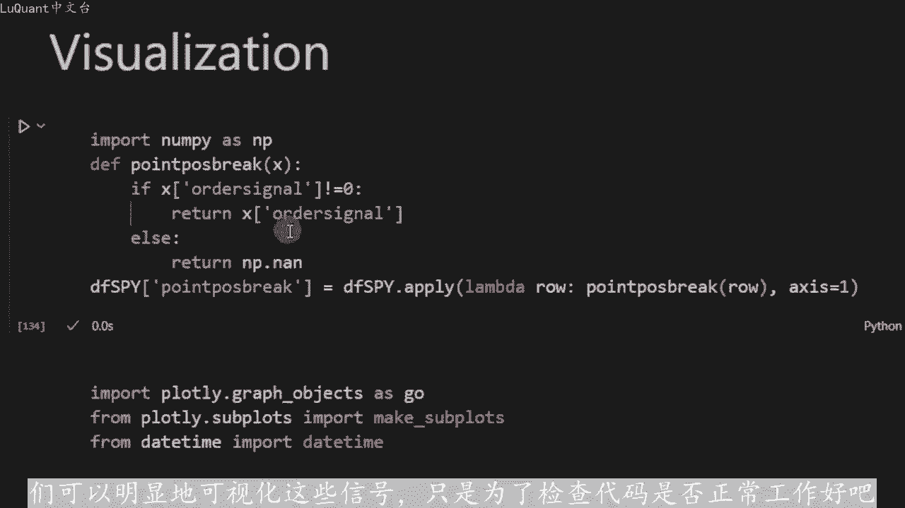

正如预期的那样，我将这些紫色点作为信号，如果紫色点低于蜡烛，则意味着这是买入信号，这是多头头寸，如果高于蜡烛，则意味着卖出信号，让我们放大这一点，以便我。在这里可以看到小紫色点，这是一个信号。

意味着当该蜡烛收盘于布林线下方，同时所有蜡烛均高于该移动平均线时。因此我们处于上升趋势，该回撤表明价格可能出现未来反弹。趋势再次出现，这就是实际发生的情况，这是一个很好的信号。

我们显示的大多数信号都是成功的。因此，在这些信号之后，我们可以看到价格反弹，这是一个故障信号价。😊，正在回调，我们是MI区线或移动平均线上方的上升趋势，但价格并没有立即反弹，而是继续回撤。

所以现在我们确信信号正在按预期工作，并且我们的代码中没有任何流。

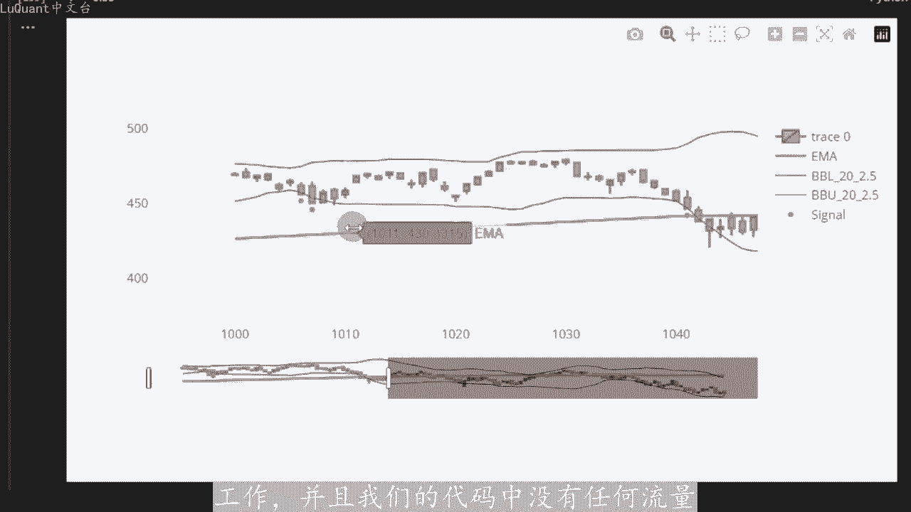

我们可以继续并回测这些策略以及不同的交易管理方法。我正在使用back testing pie包，我们投寸的初始规模是我们权益的5%，并退出交易。已关闭我正在等待的那些未平仓投。如果是多头头寸。

则RSI会高于50。相反，如果我有空头头寸，我会等待RSSI低于50。这样我们就可以根据RSI平。以避免过度平仓。当我们开仓时，我们也会设置止损。因此，对于买入头寸，止损将等于性。在空头情况下。

该信号几乎是开仓价格除以2。因此当我们卖出时，我们设置的止损等于我们卖出头寸的信号价格乘以2倍。因此它应该高于市场价格和其余的3倍价格，我使用1万美元作为企保证金为1到100%没有佣金。

只是为了能够将其与我们已经在该渠道上预先测试的其他策略进行比较。我正在运行这个，这些是我们的结果，所以总的来说，我们有100%的回报。所以100。106-18的最大回撤百分比，这是巨大的，只是提醒一下。

如果我们减少保证金，假设是10分之1，在这种情况下，我们仍然可以保留一些回报。所以我们现在的回报率为7。7%。最大回撤是仅负2%。因此，当您增加保证金或杠杆时，您会增加回报，但也会增加风险和回撤。

当您进行交易和开立账户时应考虑这一点。这种情况下，胜率几乎为89%，这还不错。但是这个策略的缺点是它不会打开尽可能多的交易。所以几年的数据中，交易总数是9个。所以如果我们回到我们的数据文。😡。

我们可以看到CSB文件这是从2017年到2022年之间，所以我认为每年大约只有两笔交易。现在我们可以使用不同的交易管理方法进行回测。就像我们在视频开头所描述的那样，所以我采取完全相同的条件。

5%的净值作为入场仓位相同的信号，完全相同的信号。我只是要改变我们使用止盈和止损值退出交易的方式。在这个例子中，我采取的止损等于当前蜡烛的收盘。减去相同价格乘以一定的百分比，例如减去当前价格的2%。

这就是我的止损的差值。在这种情况下，我的止损与我当前的入场价格分开了2。价格本身，所以这是设置止损值的一种方式。那么止损差是止损之间的绝对值。所以这里计算的任何值减去平仓过程，这就是入场重新定位。

止损之间的距离。我我将使用此差异和止损差异来计算止盈。止盈是使用止盈止损比率计算的，在本例中，该比率设置为2，因此我的止盈是止损距离的2倍，并且我。第二个止盈，因为我将把我的头寸分成两部分。

其中一个将比另一个更早平仓。因此第一个的止盈将等于止损距离的2倍。第二个的止盈将等于止损距离的两倍，将提前平仓。盈恰好等于止损差。因此，我们不会将止盈止损比率用于第二个止盈的第二个切片。例如，好吧。

现在当我想要食药开仓，我不会开一个仓位，我会开两。仓位因为这是两个半仓位，所以第一个仓位我要买一个止损仓位，但我使用的是止盈仓位。而且大小相同，所以零点抱歉，我当前净值的500分号0。05。第二个。

要开第二个仓位，止损相同，只是止盈不同。我在这里使用TP2好吧，也是当前净值的5%。所以所有总而言之，我正在开仓10个当前权益，并将他们分。两部分两者都使用相同的止损值，但其中一个将提前平仓。

另一个将赌博并等待其达到两倍的止盈止损比率。好吧，我希望这在这一点上是有意义的。相反的方向。相同的。所以当我们有一个单元位置时，我们也有两个止盈和一个止损值。

我们可以计算这个我们可以使用与之前完全相同的条件进行回测，能够将这些放在一起比较。所以我有。万美元的现金和1%的利润让我们运行这个并检查结果。所以在这种情况下，我们的回报率为81%。

低于我们之前获得的106%。但是让我们检。回撤并比较最大回撤值，这样我们在前一项中得到了-18，平均回撤为-5。6%。而在这一回中，我们有付37最大回撤和负十。平均回撤。我认为这并不比前一个策略更好。

之前的策略使用RSI作为交易管理工具，现在我们可以转向第三个变体，所以我们也使用5%做。我们正在使用的初始头寸规模，通过将百分比更改为0。08，我们可以将止盈止损比率设置为2。

实际上我们可以将其设置为相同的值。因此，如果这里的止损值为2%，我也会将其设置为百分。这里的差异是这样的，我们可以在这里看到的部分。所以请记住，我们同时开立两个头寸，获得两个不同的指盈。

多头和空头头寸的情况下，一个将比另一个更早平仓。但在这种情况下，我应该市场上总是有两个为平仓头寸，除非平仓。所以如果一个平仓。😡，而我在市场上只剩下一个未平仓头寸，我将更改7质。😡。

值并将其设置为它等于入场价格。这是我们在本视频开头讨论的盈亏平衡策略或交易管理方法。这是将其包含在我们的交。管理方法或回溯测试方法中的简单方法。所以只要您如果您注意到，我们在市场上只有一笔交易。

这意味着我们的后半仓位已平仓。在这种情况下，我们只需修改市场上剩余仓位的止损并。其设置为等于入场价格，我再次以完全相同的条件，1万美元和1%作为保证金。我们将运行这个并检查结果。因此，在这种情况下。

我们的回报率为-6。7%，所以我们不没有任何。-34的回报率，所以效果不如以前那么好。我需要在这里提一下，这完全取决于您根据指标进行交易的策略。这并不意味着这些不同的方法，将始终以这种方式表现意味。

将RSI作为退出策略总是更好或更有利可图。但事实并非如此。如果您使用这种盈亏平衡策略，它并不总是负面的这取决于您使用的指标。您正在交易的资产以及市场是什么？这就是为什么回溯测试在这种情况下非常重要。

例如，如果我在这种情况下将止损距离的百分比设置为8%，并且我重新运行该策略，我可以将其作为回报，我们可以将其提高到320。百分号80的回撤真的很糟糕，我不建议任何人以如此大的回撤进行交易。

只是为了说明当您一起更改这些参数时，事情会如何变化，所以我不会在本视频中进一步讨。😡，因为我认为该消息，您知道如何测试这些不同的贸易管理方法吗？

您可以将这些方法包含在pyython的回溯测试中并检查结果。这就是我要告诉您的所有内容。我希望你们喜欢它。所以如果是这样，请支持该屏道警。😡。

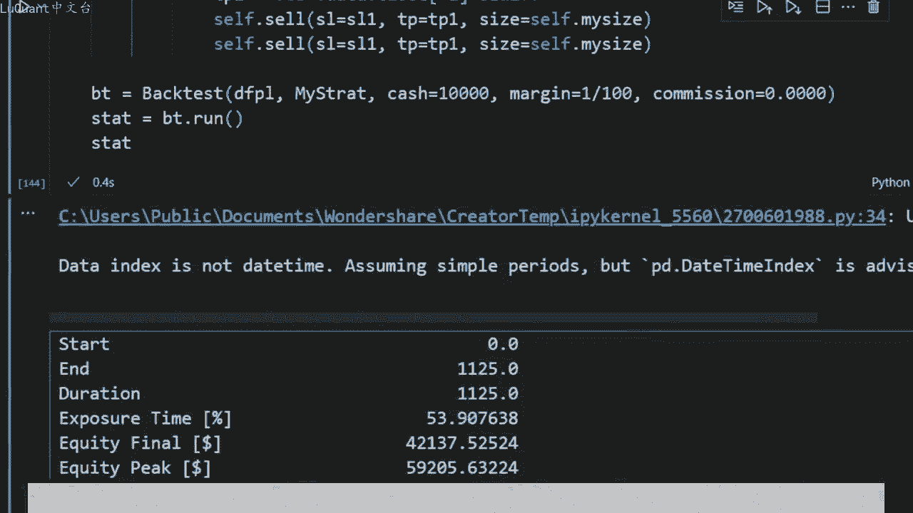

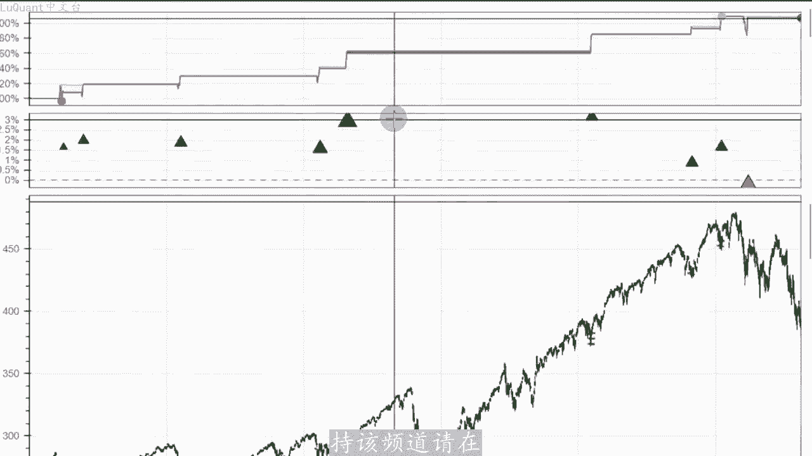

下面留下您的评论，直导我们下一次安全交易，下次再。

