# python量化16：Fibonacci Retracement外汇交易指标 - P1 - LuQuant - BV1mw4m1R7VT

大家好，今天我们正在测试斐波纳器回撤，它是在pyython中完全自动化的。即使您不喜欢编码部分，我认为也值得检查我们的回测和结果，以了解这种方法的潜力。您在这里是为了编码部分。

仍然可以从描述中的链接下载原文。😊，斐波大气这个名字来自一系列数字的数学类型，通常这种方法可以帮助交易者决定何时建仓，它只有助于入场点决策，所以它不会猜测趋势，也不是未来价格。

如果我们可以识别两个竖轴点或分行点，并且我们已经知道趋势方向，那么它对趋势市场的趋势市场有很大帮助，挑战是知道何时执行我们的头寸何时进入市场。因此，例如，如果我们已经知道趋势是上升的。

并且我们正在继续前进，我们想要买入，但我们也需要最小化我们的风险。😡，最大化我们的利润，这就是斐波纳器可以成为一个有用的方法。我们可以识别斐波纳器水平，并等待回撤到黄金区域的价格大约是60%的回撤。

距离。知道很多交易者可以在这里了解这些微小的细节，比如黄金区域大约是62%，下降到64%，或我认为的任何其他微小变化市场噪音太大，无法限制在1%或2%精度内，有时60%效果很。

有时价格可能会回落至70%的回撤位，只要您坚持系统化方法，您就应该能够获利并降低你的风险。这种方法有效的原因，主要是回报风险比率通常高于1。5超。

趋势的方向发展并不是价格总是将我们旋转到这些水平或神奇数字。我们不知道价格到底在哪里会反弹。但在我们对市场采取任何行动之前，斐波纳契规则在确定我们的奖励风险方面发挥着重要作用。好吧。

现在所有这些听起来都很高兴。但让我们测试一下这种方法，看看他在python中的表现如何。所以这是我们的jupiter笔记本文件，我们将加载从2003年到2023年的1小时欧元美元数据真我正在过。😊。

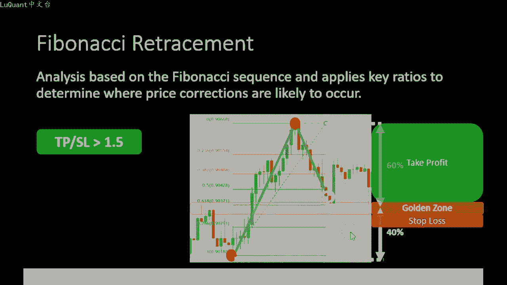

我们没有任何交易的零成交量蜡烛，所以这些基本上是市场在这些蜡烛期间收盘。然后我使用pas技术分析包计算两个技术指标及RSI。移动平均线，我们将用它来检测趋势作为实验。我只使用2000根蜡烛。

从计算角度来看，速度更快。因此稍后当您建立了某些内容后，我们可以在整个数据帧上运行它。现在我们可以从检测趋势开始，这是一种非常简。直接的方法，我们可以检查最后15个反向蜡烛是否在上方或低于移动平均区线。

如果它们高于移动平均区线，我们认为我们有上升趋势。如果这15个反向蜡烛低于移动平均曲线线，我们有下降趋势趋势函数反。三个不同的类别。其中之一，所以我们有下降趋势上升趋势，它将返回2。如果趋势不清楚。

我们返回三，请记住这些参数例如后蜡烛图可以从15更改为20或40，具体取决于您使用的时间范。并取决于现在我们可以生成斐波纳器信号，这是在此函数中完成的。因此。

生成信号需要数据针当前蜡烛的索引来测试它是否是信号蜡烛后蜡烛。检查的后手柄数量对于差距，我们将解释什么是差距以及区域阈值和价格差距阈值。首先让我们检查一下什么是差距和后手柄后手柄很容易理解。

我们已经使用它们有一段时间了。因此考虑当前手柄之前的蜡烛数量间隙。但是蜡烛的数量有限，不会延伸回整个后手柄数量，它只是小间隙或我们需要包含已检测的蜡烛数量，最后一个书轴。

因此，在本例中，为了检测该梳轴点，我们需要多个后手柄及后手柄的总数，但我们还需要当前蜡烛和该梳轴点之间有一个小间隙，以便能够检测到这一点。并且然后我们可以设置斐波纳汽水。

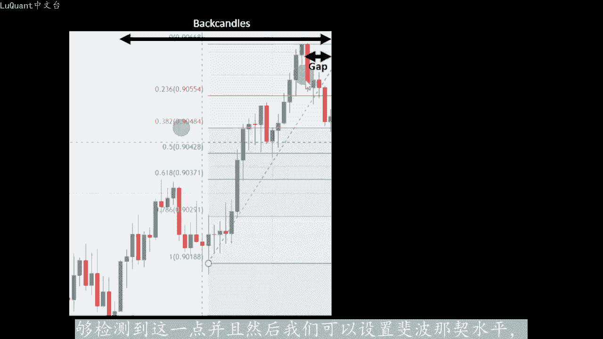

看看当价格继续变动时，我们是否可以采取任何未来头寸。因此，这些是该函数的后手柄和缺口，我们将以此方式进行测试。因此，如果我们有M信号等于2，所以我们处于上升趋势，我们正在寻。

多头头寸，然后我们将测试最小值或分型的指数，最小分型的指数是否小于最大分型的指数。换句话说，最小分型出现在最大分型之前或。后面跟着最大分型，这通常是我们在这里查看的事例。因此我们这里有一个最小分型。

后面跟着最大分型，因此顺序很重要，我们不这样做，必须以相反的顺序排列这些，除非我们有下降趋势，但我们也行。

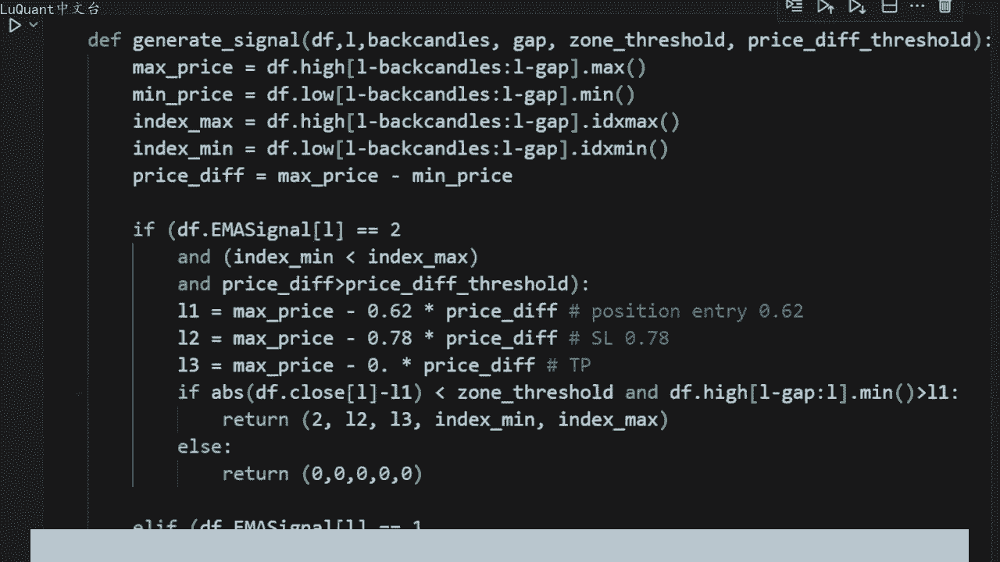

最大数轴和最低书轴或最小数轴之间的价格差异应该超过某种不能太小的阈值。像这里这样的书轴，就像你有一个低书轴和一个高书轴，并且价格受到很大的挤压。这不是真正的回撤。要发。回撤，你必须有一个大的运动。

并且这个运动应该超过油下室设置的某个阈值用户，这就是这个价格不同阈值参数在这里所做的，它是函数的参数，我们用它来减。

不同书轴或不同分型点的水平之间的差异。所以如果您想检查如何，我是否检测到分型及其索引，所有这些都在函数中。因此我们的最高价格是某个切片中的最高价格或最高最佳价格。然后我们。最低价格类似的。

它是较低价格之间的最小值蜡烛，然后是这两个的指数，然后价格差是最高价格和最低价格之间的差。所以我们必须有一个上升趋势，我们必须。不同的分型之间有一定的顺序，并且我们必须超过价格不同的阈值。

考虑最高分型和最低分型。如果满足所有这些条件，在这种情况下，我们可以开始检查斐布拉气水平。因此L一等于最高价。减去价格差的62%，水平二是最高价格，减去78的价差与第三级相同。目前我将其保留为0。

因此负0。最高价格乘以价差，这是我们的止盈，这将是我们的止损，这将是我们的黄金区域。如果当前蜡烛的收盘价减去L一之间的差值，则我们有一个头寸入场。应。黄金区域小于分区域值。所以请记住。

我们并不是真正采用一个水平，例如62%。我们采用的是围绕这个62%的较小区域，它可以是61，也可以是60或63%。所以我们在它周围有一个特定。区域因为我们正在考虑市场的噪音。

这就是为什么我们在这里包含这个区域阈值参数，也作为参数传递给函数。因此这些是您的LE水平附近的几个。如果当前蜡烛的收盘价减去LE之间的绝对差值，小于您的LE水平，您会认为这是您的黄金区域区域值。

因此它包含在区域内。同时我们需要。

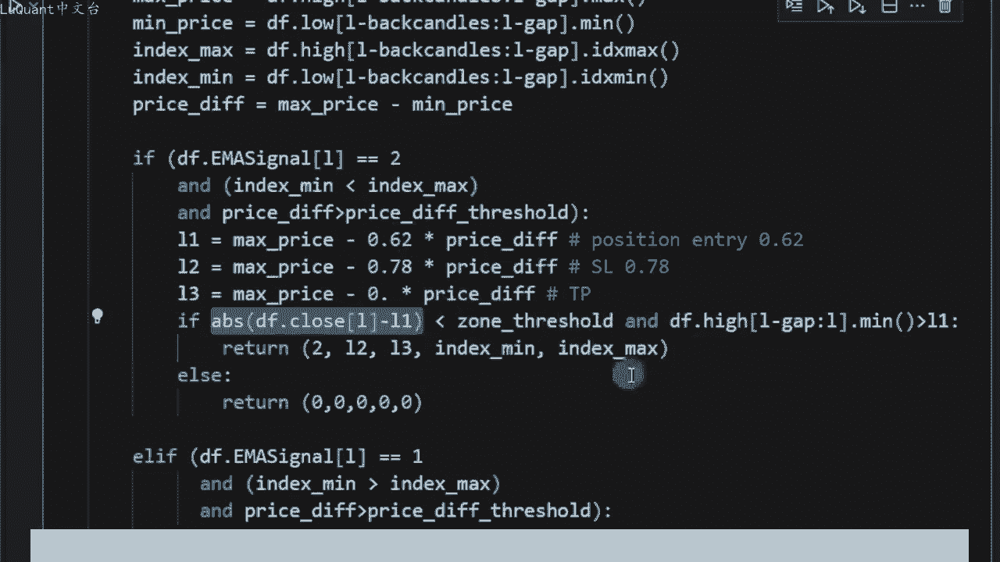

当前蜡烛或黄金区域中的蜡烛之前，拥有这些蜡烛的所有所有高点，它们必须高于黄金区域。因此，在其他区域中在上升趋势中，这些蜡烛应该从黄金区域上方下降，它们不能从下向上。

因为否则我们将开始出现种信号想象我们有这种模式，然后价格下跌，然后再上涨时它稍微穿过黄金区，然后我们将触发另一个斐波纳气信号。但这不是我们正在寻找的。我们正在寻找弹跳点。所以所有这些蜡。

高点都应该高于黄金区，并且这种情况，这里将确保L的高点减去缺口，直至L圆仅取缺口切片点最小值。因此，当满足所有这些条件时，这些蜡烛的所有这些高点的最低价。

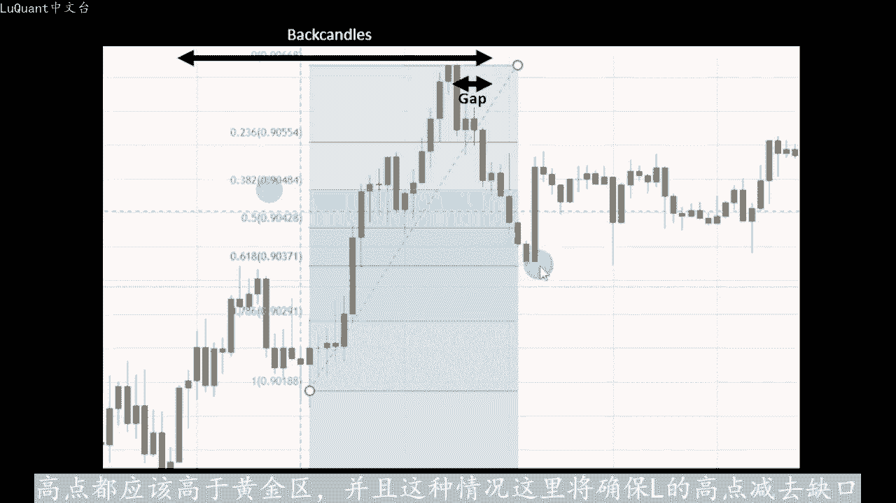

应高于LE水平返回属于类别的信号，我们返回L2L3，以获取止盈和止损，返回最小值索引和最大值索引，以防我们稍后想要会。信号。所以所有这些稍后可以使用此函数中的信息来绘制我们的信号，并验证我们的结果。

甚至可以使用此函数作为交易回测的信号。如果不满足条件，我们返回零。对于下降趋势，我。仅应用相同的方法在对称条件下，所以我们必须处于下降趋势，指数应该以相反的顺序排列，并且价格差异仍然高于价格差异阈值。

请注意，我们更改了此处的标志等等。我将让您详细了解细节，以保持这一点是。尽可能短。因此，对于该视频的测试，我在每小时时间范围内使用5个间隙蜡烛图和40个反向蜡烛图。并且我正在创建不同的列表。

我们使用ar生成信号函数来生成这些列表不同的信号。我们现在可以检。数据框中生成的信号。因此我打印前10个信号的一小部分，其中信号不为0。我们可以看到这些蜡烛。如果我向右移动，我们可以看到M麦信号。

然后是。

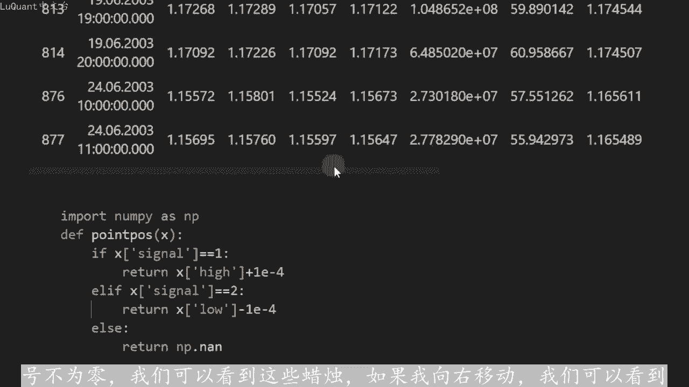

信号以及止损值、止盈和其余信息。现在我们可以可视化这些信号，我将把这些信号绘制为蜡烛上的点。您可以检查我们这里有一个买入信号，当该点位于蜡烛下方。😊。

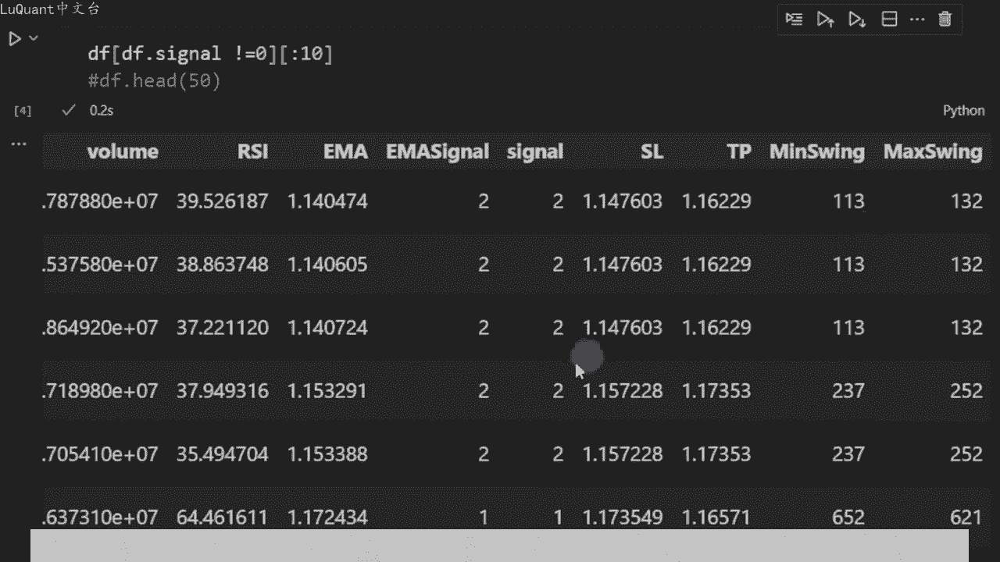

为多头信号，如果该点位于蜡烛上方，则为多头信号，因此这是一个多头信号，我们这里有两个信号，我们这里有两个多头信号，这是完美的这些都是极好的信号，让我们检查其他一些。所以。

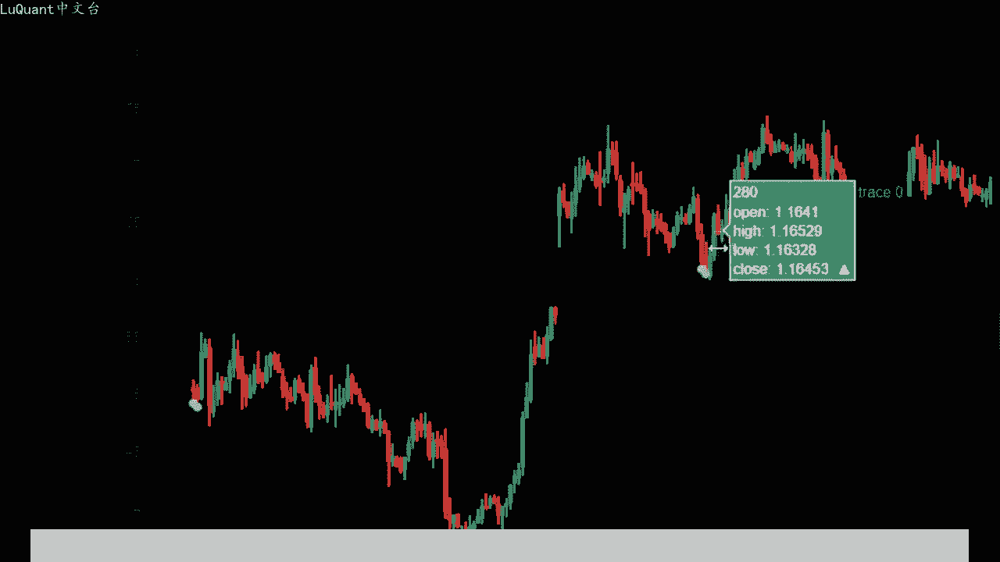

在我的数据框中检查这些信号的索引，让我们检查这个信号。例如659，我将绘制600和700之间的切片，让我们绘制这个哦，例如这个是一个完整的信号，这是价格上涨的一个短期信号原因。😊。

当我们出现这种短暂的突发下跌趋势时，我们正在寻找单元位置。显然，我们回撤到该数轴和这个或这个可能之间的黄金区域之一。并且。

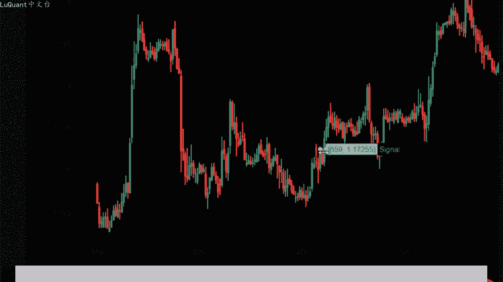

813章所。

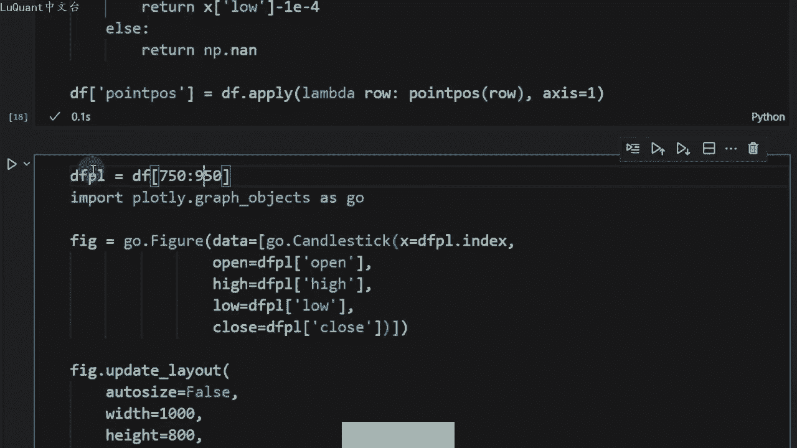

这非常好，这也是一个很好的信号。然后我们在这里有另一个回撤，这在某种程度上是一个完整的信号，因此入场位置不是完美的效果，因为然后价格在这里上涨到这个水平以上，所以对于手动来说也会更加急。😊，交易它。

我们不能把一切都归咎于算法。我的意思是，有时对于手动交易者来说，如果您对完整的回溯测试感到好奇，那么这种波动性就会变得具有挑战性。我在这里留下了部分代码，用于我正在使用的回溯测试性。😡。

函数从数据帧调用信号，我正在使用回溯测试库或包来回溯测试我们使用的这部分数据帧的策略，因此仅在1000小时内止损和获利。来自数据框架，因为我们使用斐波纳契水平计算了这些，但对于每笔交易。

我决定使用两个止盈，一个接近价格，所以它是另一个的一半。注意我们有两个止盈值和一个止损值。银一是从斐波纳契水平获得的，然后止赢二作为较短的一个，他将平掉我们一半的头寸。我回来测试时只用100美元的现金。

保证金为1比100。如果你将其余买入并持有回报进行比较，我们将获得大约140%的回报。它是-3。68%。所以我并不是说这是一个很好的指标或任何你必须检查回撤的指标。我认为它是74，这是巨大。

我预计瑞利比率会非常。该指标看起来非常好，但它必须与良好的交易管理相结合，这是我们必须付出大量努力的地方。这就是我们的股票在这1000小时内的样子，有趣的是在这里检查这些美丽的交。

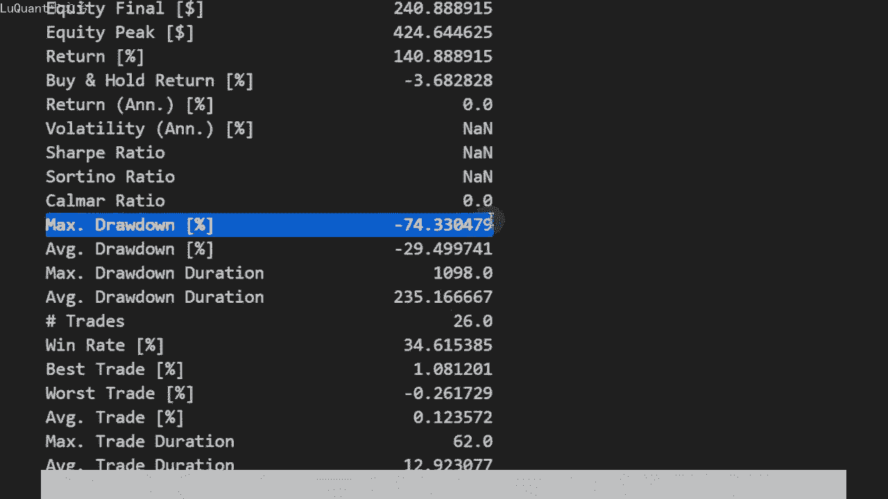

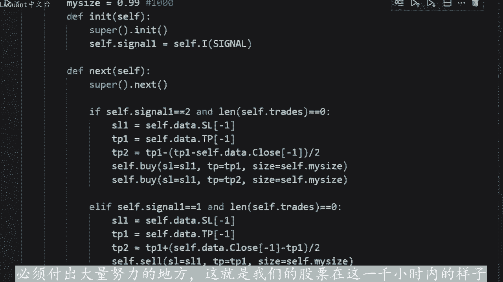

例如，这个交易是从价格最低到最高价格的代码，所以这里的斐波纳契比率真的很有帮助，也许是另一笔交易，这是一笔亏损的交易。例如这是一笔交易出色。交易它利用了所有斐波纳器水平。我们可以看到。

我们在最高点对价格进行了编码，然后我们购买了我们的头寸，并将在最低点重新预定我们的头寸。其他一些交易也关注这一点。所以我们在这里我们将价格称为最。😡，水平的最高价格，然后我们几乎以最低水平出售。

他工作的很好，在某些情况下效果不太好。所以我们预计在交易中会出现这种情况，但我认为与手动交易相结合，这可以。一个优秀的指标，我使用该指标的方式是首先手动评估市场模式。然后在我们有足够的条件时。

启动这些回撤的自动检测。这样机器人会在回撤完成时向交易者发送通。以便交易者不必在屏幕前浪费时间，机器人将进行等待和观察，并且只会通知交易者回调是否完成，且机会存在，交易者可以登录并检。他是否可以采取。

无论是否进行此交易，这就是我要告诉您的斐波纳契回撤的全部内容。我希望您会发现这些信息和这些视频对您有所帮助，直到我们的下一次视频交易安全，下次再。😡。

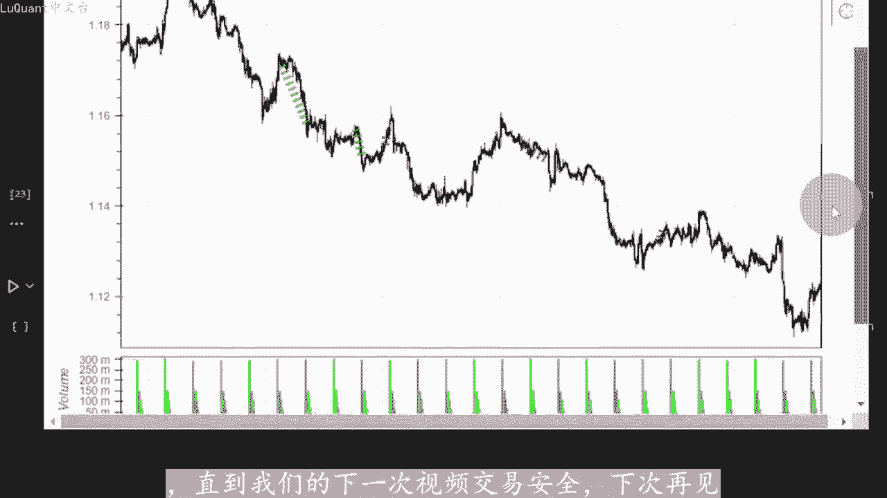

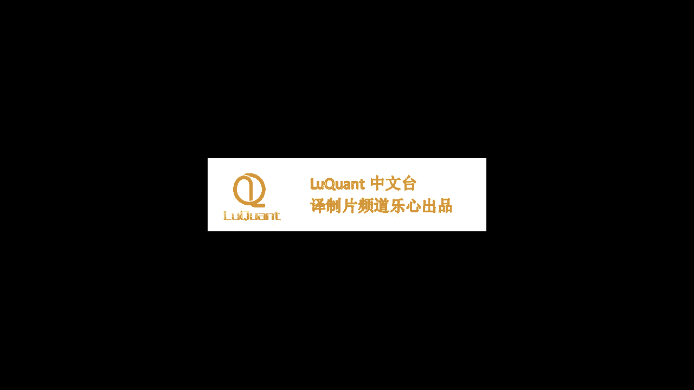