# python量化17：Facebook Prophet与外汇交易 - P1 - LuQuant - BV1mx421k7g8

大家好，今天我们正在测试facebook盈利模型以进行金融交易数据或历史价格数据的时间序列预测。在我们的事例中，我使用欧元美元外汇价格，这是我们每小时时间范围内的预测收盘价与实际收盘价的事例。我们将。

往常一样，在pyython中执行此操作，您可以从描述中的链接下载代码文件，这样您就可以跟随视频和我们的分析，而不必担心编码部分。利润是facebook开发团队发布的一种算法，它可以处理时间序列数据。

并提供对未来价值的预测。

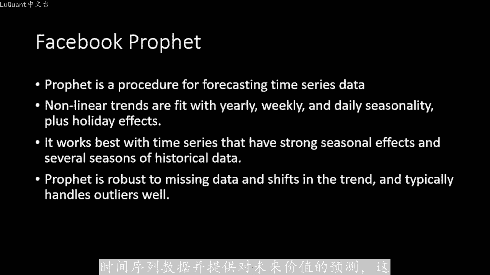

对我们交易者来说非常有趣。有趣的是，他考虑了每年每周和每日季节性的总体趋势，包括假期影响。这样你就可以看到它的走向在某种程度上，它最有效对于季节性数。

不同的趋势在某种程度上很明显，这在交易中可能不是100的情况。需要知道的是，该模型对于缺失数据和异常值具有乳棒性，这在我们的情况下非常重要。有时我们会通过很。奇怪的值异常值和丢失的数据。

这不是我们必须担心的事情。因为模型会自动处理这个问题。我们使用这个工具的方式，如下想象，我们想要从这个蜡烛或从这个小时开始，我们将考。😡。

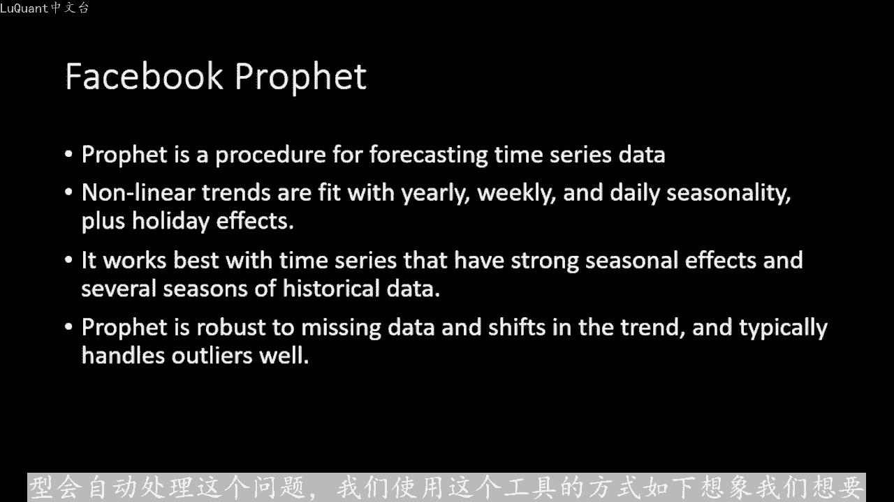

一些后面的蜡烛，这些是最后20、30或40根蜡烛。例如我们将允许利润算法运行并适合后面的处理数据。然后我们调用未来几根蜡烛的预测函数，蜡烛模型提供了带有上限和下限的估计。因此，我们有一种预测窗口。

而不仅仅是值。在我们的程序中，我们预测的后蜡烛和未来蜡烛的数量保留为参数，以便您可以对这些进行实验。当你下载代码，并检查它如。影响结果时，好吧，现在我们将浏览pyython代码，然后我们将检查结果。

看看如何使用这个工具进行交易。顺便说一下这个想法是由某人提出的评论部分。所以如果你有一些异国情调的疯狂想法，请告诉留下评论，我会看看我们能做什么，这是一个经典的过程，我正在导入pandas。

我正在再次阅读CSV文件，从2003年到2023年的欧元美元烛台一小时数据框架。😊。

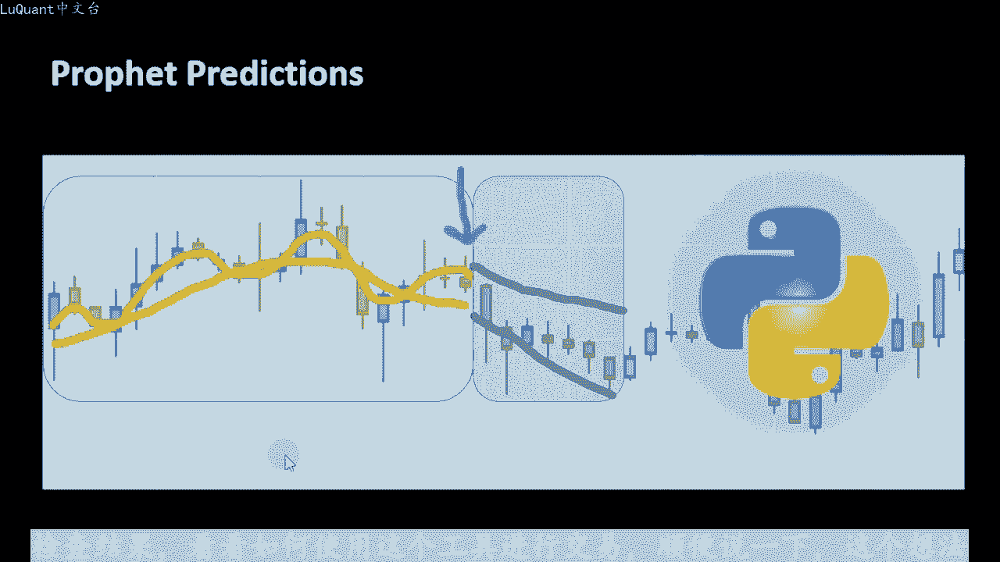

我们不。使用整套数据，因为它需要很多时间来运行，但我的意思是，我将共享CSV文件，并且与您一起使用python代码，以便您可以自己尝试。然后我将过滤所有交易量为零的蜡烛。因为这些是假期的蜡。

并且市场没有开放，所以我们在期间没有任何交易这些蜡烛，我们正在重置索引。我们正在检查是否还有一些缺失值，现在我们不会使用它，我只是选择了一。1000根蜡烛，因为您要看看当您运行此利润指标或利润模型时。

需要一些时间来计算这些蜡烛。我不想在整个数据帧上运行它，我们将仅在一小部分上运行它作为实验。然后当我。决定一些参数级。如果您想深入了解利润模型和预测，以及他们建议的时间序列的细节。

我们可以在整个数据帧上运行它他们的网站上有文档，但在这个视频中。

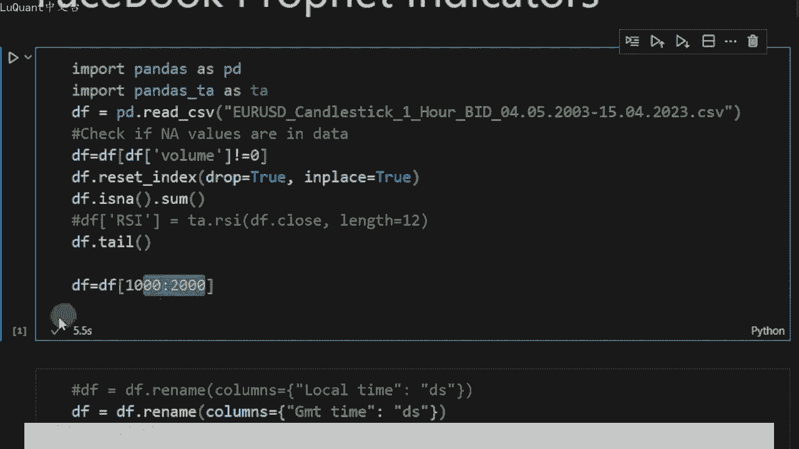

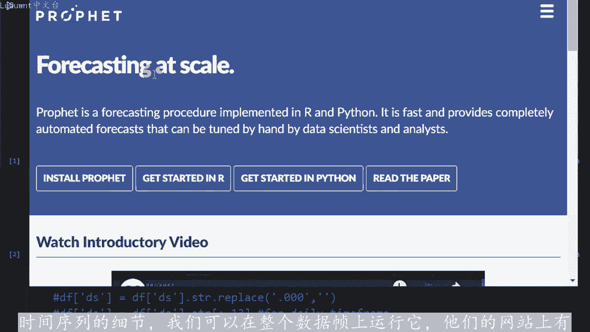

要知道的重要一点是利润基本上需要两列，一列是日期字符串DS另一列是目标Y。因此，原始数据框具有这些列，这就是我在CSV文件中的内容息落开盘价成交量。

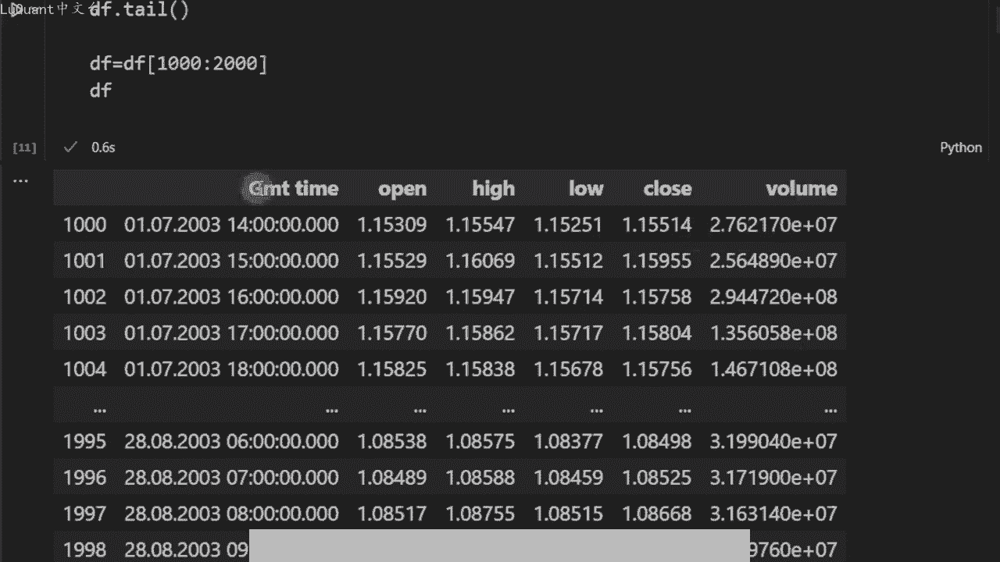

以及GMT时间。因此，此时我们将GMT时间列重命名为DS利润模型所需的日期字符串。然后我们将创建一个名为Y的星列，它等于对于蜡烛的收盘。

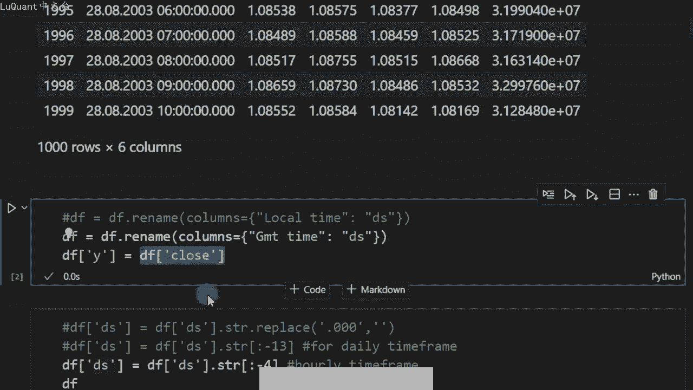

我不在这里重命名收盘栏的原因是我想保持其完整，我不想弄乱名称，我只是创建一个具有相同值的新名称，但是基本上是一个不同的名称。并且根据您拥有的数据，您将不得不进行一。

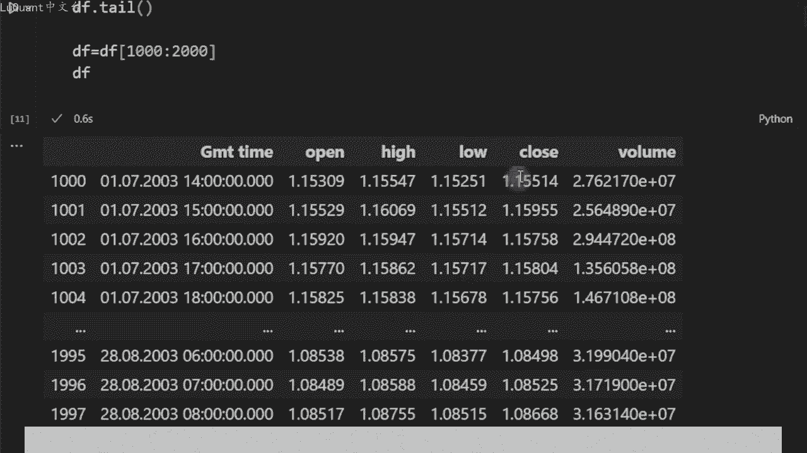

经理，在这种情况下，我们必须在最后删除这四个字符。所以这些是我们不需要这些的描述。所以我只是选择日期字符串列的一部分，删除最后四个字符。我们还可以注意到我们刚刚添加的新。😡，Y列它等于结束列相同的值。

现在我正在转换该列DS根据特定格式来日期时间。因此，我们有日月年小时分钟和秒。利润甚至padas都不会自动猜测您插入数据的格式。因此您必须提供此信息，以避免任何错误。

然后我们可以定义一个称为利润信号的新函数，它需要一个数据真蜡烛，所引后。

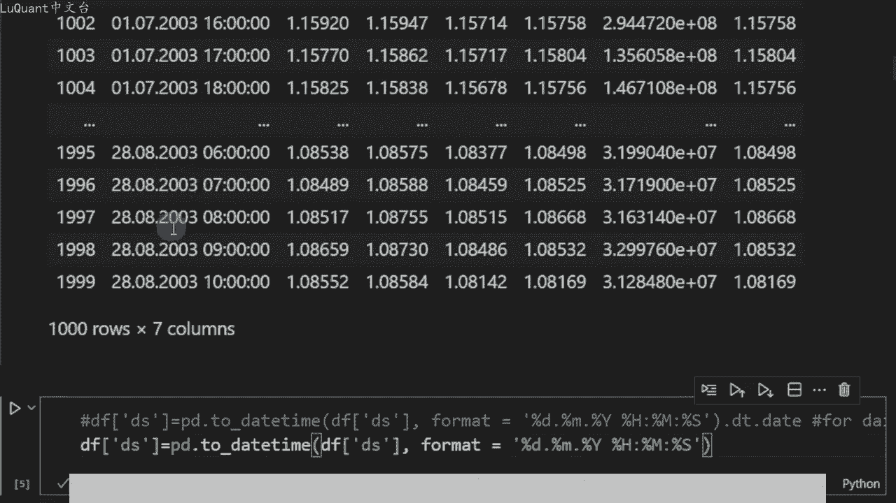

蜡烛的数量，前面预测的数量或未来蜡烛的数量来预测差异限制的只是呃作为我们稍后要讨论的参数。但现在我们还没有使用它，然后我们也有一个信号，所以我们不。立即讨论这些，我们将稍后讨论这些。

现在我们可以只是使用这四个参数。所以首先我在函数中对数据帧进行深度复制，这样我们就有了一个本地数据帧，所以我不会。任何方式更改我们作为传递的原始数据帧，然后我定义模型变量，它等于利润，我们必须导入利润。

如果你没有利润，你必须pipingt它，你可以只输入其中一个单元格，pipingt profit。将安装利润你的系统。所以我们再次定义等于利润的模态变量。然后我们将使用你和函数进行拟合。因此。

DEF分割数据框利润上的model fit需要两列，它不。

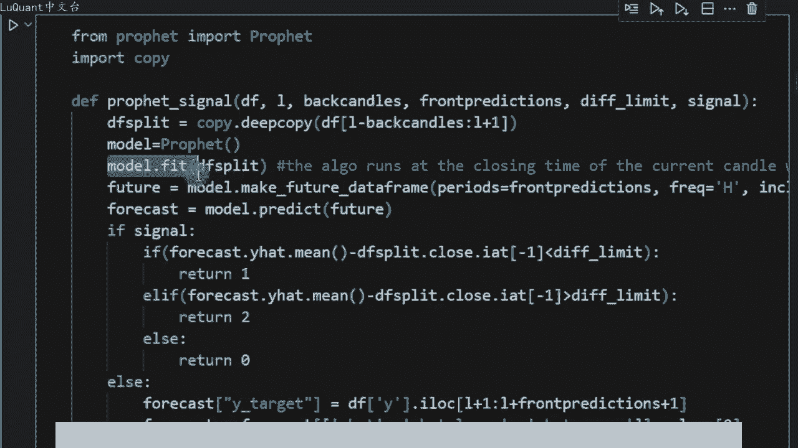

读取开盘高低和收盘价或成交量价格至少会查找两列。因此，DES是日期字符串Y是目标或因变量。我们应该在数据框中包含这两列，并且利。

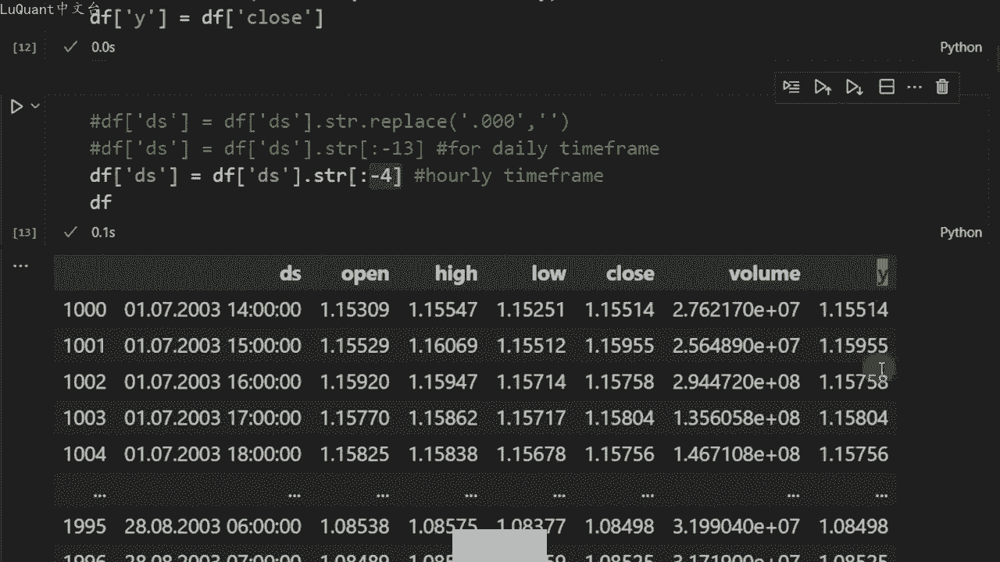

将会看起来对于这两列，它将读取这些列并，将其适合这些列。因此，DES将是自变量Y是未来的因变量。我们将创建一个未来。比如说数据框或数据字符串。

future等于model dot make future数据框period等于front predictions。我们刚刚传递的参数。所以如果它是5，那么它将是字段future中的5个周期。

如果它是十，它将预测十未来的时期等。频率是我们的，因为我们默认按小时时间范围工作，利润将考虑每日时间范围，因此它每天都有效。如果您使用的是不同的时间框架，那么我们包含历史等于false。

基本上是如果我们想要在预测的数据框架中包含后面的聚柄，或者您想要放弃这些。一旦我们定义了我们的蜡烛图，就对未来的蜡烛进行一些预测我们的数据框的未来日期字符。我们可以使用模型及利润模型运行预测函数。

因此预测等于模型点预测并预测未来。所以基本上未来包含一个没有任何预测的数据框，但它只。形状这一部分中有趣的数据框，然后我们使用预测函数在第二行中应用模型进行预测。然后我们将跳到这一部分。

因为我们将使用此函数来进行预测两个不同。事物要么预测分类特征或分类目标，要么预测精确值。因此，函数的这一部分将提取预测的Y值。根据不确定性提取未来的预测外值以及下边界。上边界由模型提供。

现在我可以调用该函数，只是为了测试它利润下划线。幸好我正在提供数据框架，让我们说蜡烛的索引，我想从200。后手数量100个正面预测，只有一根蜡烛来预测未来，我只想预测下一根蜡烛的收盘价。

这两个变量暂时不会影响我们的结果。我只是将信号设置为false，只是为了预测歪貌以及下边界。边界，这就是我们的结果。我们的Y帽子未来预测值是1。13，我们的下边界是1。128，然后1。1315是上边界。

现在我们可以在1000个蜡烛的切片上运行。这个记住我。数据框进行了切片，只从1000个蜡烛中取出这些蜡烛最多2000。所以我们可以运行这个函数来预测it low和一 high这将需要一些时间。

你会注意到这很耗时，我认为你将不得不等。大约5到10分钟，在这里调整过程1000根蜡烛。我们将把这些预测值移动一个单位，这样我们就可以直接在绘图上将这些值与实际值进行比较。我正在绘制值。

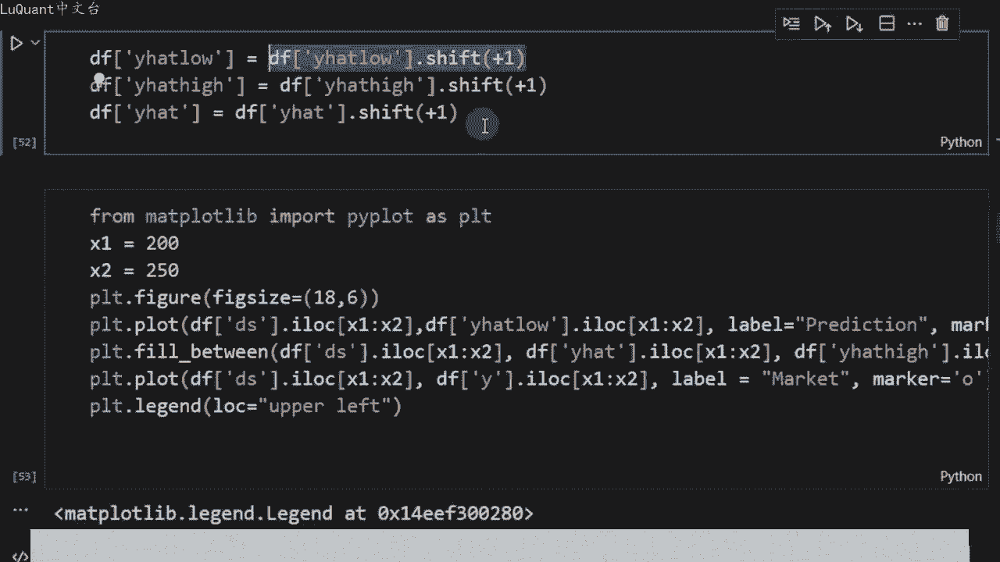

200到250指数之间的一小部分，记住这些只是蜡烛的收盘价，所以我们不知道蜡烛期间发生了什么，但无论如何，这些都是预测值与实际值相比。作为第。😡。

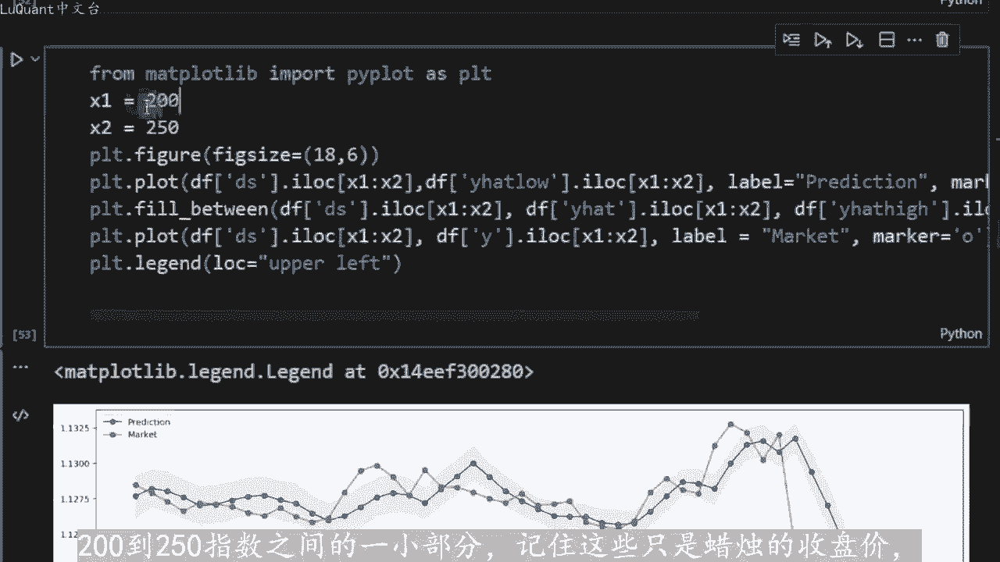

印象这些结果可能看起来不错，但对于交易来说，这首先还不够好。我们在某些时候偏离了好的或真实的数据。所以我们可以在这里检查这两个例子。比如这两。😡，三四点，他们与真实数据相差太远，最重要的是是预测的趋势。

让我们看一下。例如，此时我们可以说以某种方式进行了遥远的预测，因此趋势下降。实际趋势下降了，预测的趋势再次下降，但现在实际价格上涨了，这就是下一步中预测的趋势上涨预测持续上涨，这意味着利润预。价格上涨。

而价格下跌这些分歧时刻是可怕的部分。所以如果您有预测或指标告诉您价格正在上涨，最有可能的是你会做多。所以我们正在买。而实际上，价格正在下跌，所以在这种情况下，这不会有帮助。这里不是很重要。

我的意思是没关系，因为基本上预测正在发生方向相同，所以它是积极的价。上涨只是上涨幅度超出了我们的预期，而且很可能您会达到止盈。因此从交易角度来看，这是可以的，但这些发散时刻才是可怕的部分。

所以就其本身而言，它并不是。😊，令人印象深刻。老实说，我们正在你和100根蜡烛，我们只是要求模型预测一根蜡烛，而不是更多。如果我们将来预测两根或5根甚至10根蜡烛，我确信我们将会得到更糟糕的结果。

所以这是最好的也。😡，我们能得到的最接近真实结果的结果。在我看来，这不是一个很好的交易工具，这对我来说非常有意义。记住我们在facebook模型的简介中所说的配置文件。

它最适合具有强烈季节性影响的时间序列。😊。

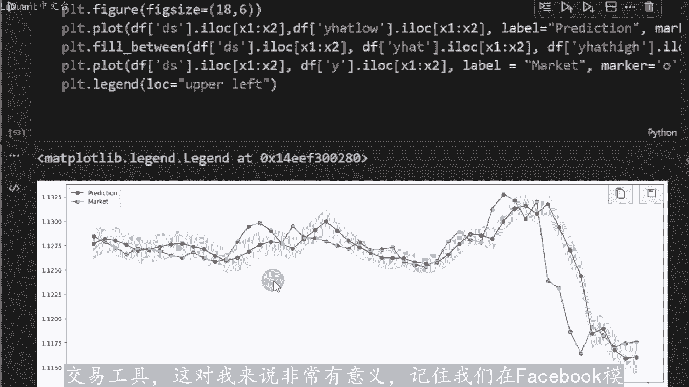

几个季节的历史数据，我们没有任何年度趋势或每周趋势，也许我们有每日季节性，也许我们有某种模式，它可能是一个代码通过模型，但我们没有这。非常结构化的每年每周和每日模式，因此模型可以捕获这些并有效预测。

所以在我看来，我们可以停在这里，但我有不同的想法，我写进了函数，这就是为什么不尝试预测某些分。

病毒而不是预测Y hat以及上限值和下限值的原因，让我们放置一个简单的类别过程或类别方法。因此，如果变量信号等于true，这就是我们使用信号的原因。在这里我们。

检查下一个或预测的下一个值是否高于或低于当前收盘价，至少跌限制值。因此，如果它上涨810至3或下跌810至3，我们。返回表示下降趋势。二表示上升趋势0，如果它正好在0。008的范围内。

这样您的函数将以某种方式为您提供一个分类结果。它是01或。如果您想要更确定的是，您可以在此处增加此差异限制，以便我们可以将其增加到0。01等等，以便您可以自己尝试这个我不相信这会起作用。我不知道。

这只是我个人的直觉跟。😡，经验，我可能是错的，如果您尝试这样做，请告诉我们，如果您有不同的想法，我想听听您在评论部分的想法，请让我们知道与我们分享您的想法实验。如果出现任何有趣的事情，那么为什么？😡。

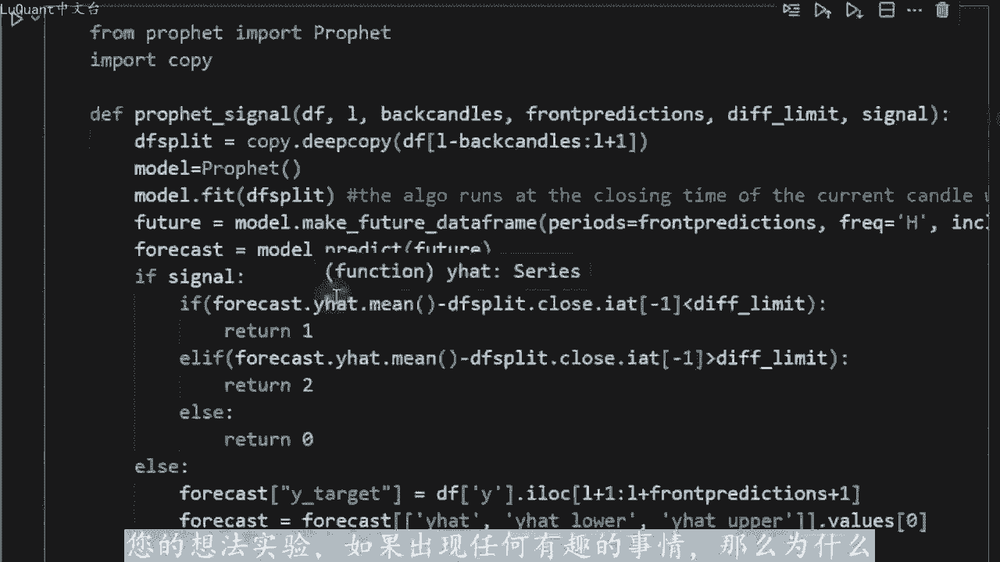

不，这就是我要告诉你的，直到我们下一次安全交易，下次再见哦。还有一件事，如果你还在这里，我忘记了，我们还有另一种工具称为神经网络再次从facebook获里。它使用神经网络，在后台使用不同的算。😡。

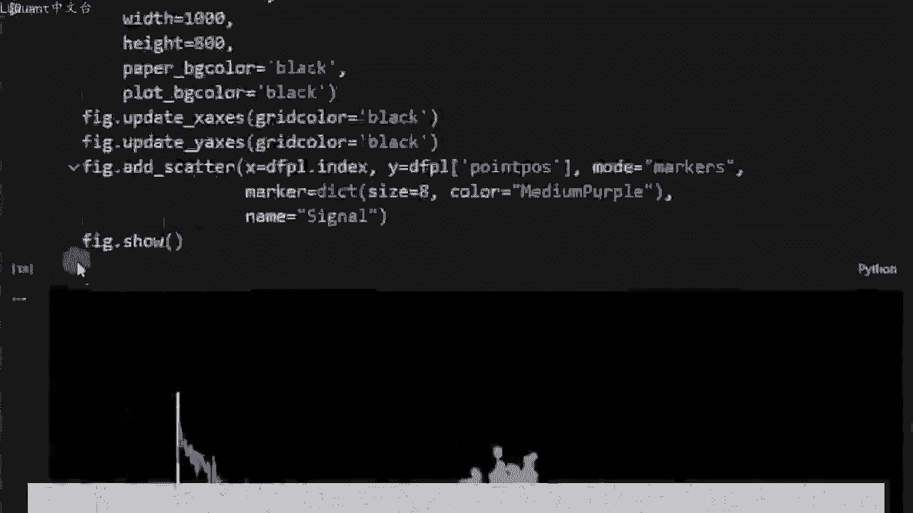

该算法的问题在于，要适应神经网络，需要花费大量时间。因此，我们无法对历史数据进行回溯测试。我们可以在实时绘画中使用它，这是可能的。因为如果我们使用每小时。时间范围我们将每小时拟合呵预测一次。

但如果您打算在一组1000或更多的集合上回测，该指标则非常耗时且非常消耗CPU我不认为无论如何，我认为它不会在简单的笔记本电脑或普通机器上工作。我只想让这个我会将其保留在代码中，我将在链接中与你分享。

😊，直到我们再次安全交易。下次。

