# python量化18：阻力与支撑在外汇交易 - P1 - LuQuant - BV1px4y1U7qP

您好，单独创建RSI寻找超卖和超卖区域的经典方法，根本行不通。有一种更简单的方法，将支撑位和阻力位与RSI一起使用来改善我们的切入点。但问题。

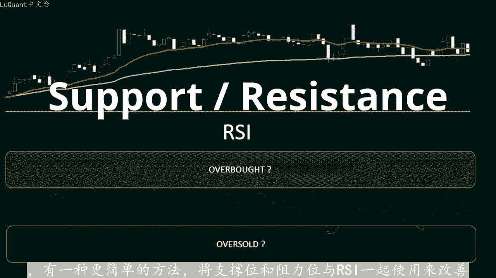

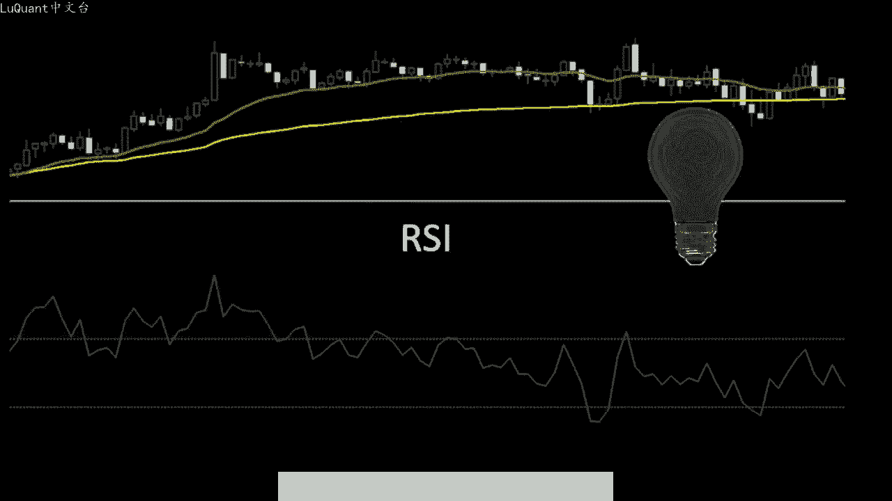

我们不使用超买和超卖区域，而是将使用RSI来检测趋势动量。这与我们迄今为止在经典在线交易教程等中学到的内容相反，但它似乎更有效。当我在pyython中尝试此测试时，结果在本视频中似乎更有趣我。

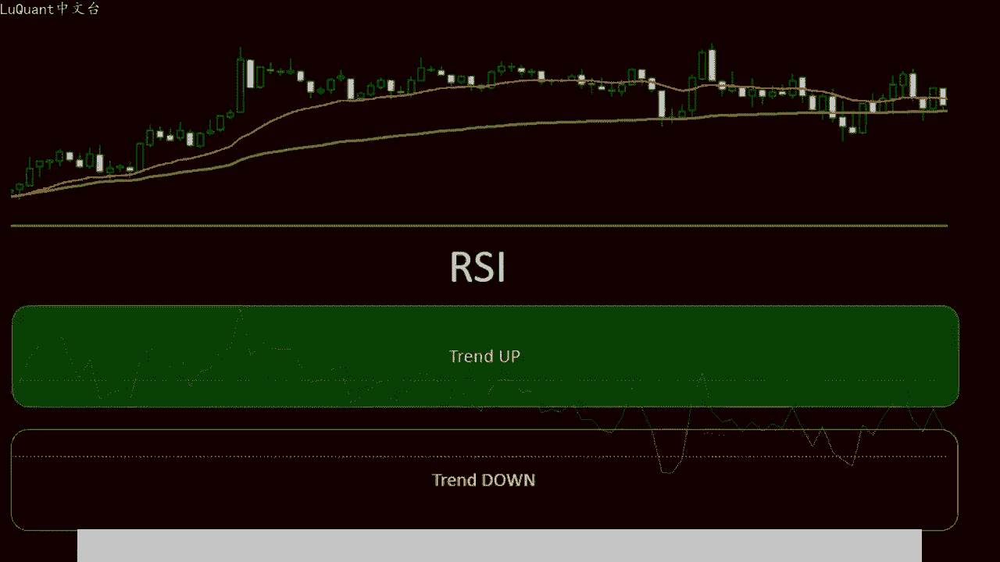

将详细介绍交易策略，并测试我们的方法。我们将在pyython中自动化我们的指标，检查图表上的信号，并评估我们获得的结果。您可以从下面描述中的链接免费下载pyython代码，我总是分享这个频道上的代码。

就像我之前的视频中所做的那样。如果您真的喜欢编码。如果您喜欢算法交易，也可以使用该代码，并应用一些修改来生成交易警报。这也是我们交易系统的一个很好的补充。因此，首先我们需要检测支撑位和阻。

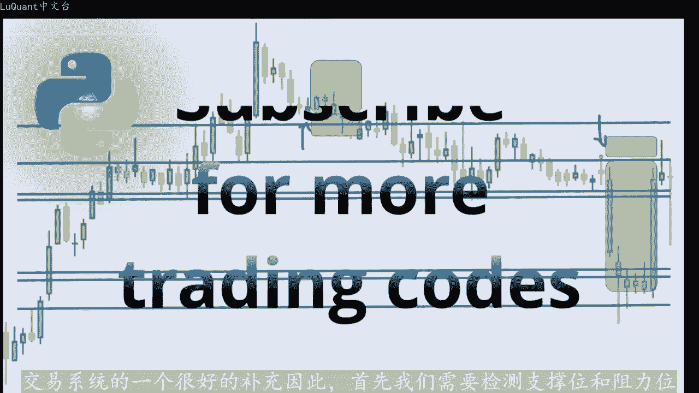

为此，我们将首先检测与相邻蜡烛相比，显示极高值和极低值的分型或蜡烛。例如，该蜡烛的高值大于其周围的蜡烛，并且数量要比较的蜡烛数。在我们的代码中保留为变量。

因此我们可以与中央蜡烛左侧和右侧的四根或5根或任意数量的蜡烛进行比较。我通常在每侧使用4到8根蜡烛对于这种比较，这是另一个例子，我们有一个第。行，它低于左侧的其他蜡烛和该特定值右侧的未来蜡烛。

有时如果您想的话，我还添加了蜡烛芯长度的条件，对分型非常有选择性。您可能希望选择选。强烈拒绝运动的蜡烛。因此，蜡烛芯超过特定阈值，这基本上是我们代码中的变量，可以被视为强烈拒绝运动。

所以现在我们有了第一组支持和用这些分型检测到的阻力水平。我们可以注意。某些水平彼此非常接近，因此他们可以合并为一个水平，实现这一点的方法很简单，就是通过计算不同水平之间的差异或距离。

如果这个差异低于距离阈值，我们可以合并这些水。方法是用平均值水平替换它们或者简单的删除重复的水平，并只保留一个。所以最重要的是我们探测水平醋，然后用一个值替换他们。因为我们有了我们的关键水平。

我们就可以计算我们的凡。信号这是基于三个假设完成的。首先我们需要一根带有灯芯或尾部的蜡烛，其距离支撑位或阻力位足够近。并且如果蜡烛的主体是支撑位或阻力位，那么蜡烛的主体应该包含在该水平中。

支撑线的主体应该高于该水平。如果它。😊，阻力位则蜡烛的主体应该保持在该水平下方，只有竹心会接近或超过当前水平。我们还需要之前的蜡烛被阻力支撑所包含水平，意味着它们应该位于当前蜡烛体的同一侧好吧，让我。

在一个例子中看到这一点，我在这个例子中采用这两个水平，我们可以看到检测到这些水平的分型。所以我们有一个高和一个低则价格变动，达到满足条件的点。我们有一。接近支撑位的极值，蜡烛的主体完全高于支撑位。

对于之前的蜡烛都包含在同一根蜡烛中，也是如此关键水平，并且在拒绝蜡烛的同一侧，这是一个典型的反转信号。如果我们天。酌心条件，我们会有一个长期的拒绝反应。我们可以看到价格反弹并被同一支撑多次拒绝。

并且在现实生活中，诚实我可能已经考虑过将这些反弹拒绝之一作为切入点。因此，如果我们将这。

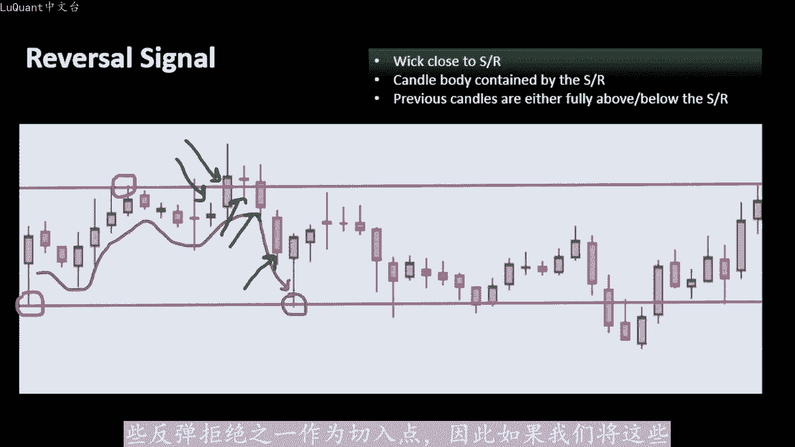

条件应用于历史数据。我们可以在该图表上看到信号。当紫色信号点低于蜡烛时，这意味着这是看涨反转，相反，则意味着看跌反转。注意我们获得的信号数量不可能用图表上的所有这些信号进行交易。其中一。是极好的切入点。

有些当然不太令人印象深刻，所以这是一个非常好的信号。所以我们有一个看跌信号，随后是强烈的看跌走势，这是一个很好的信号。我们有一个看涨信号，随后是一个良好的看涨走势，以此类推，但其他信号效果不佳。

如果RSI较高，这就。😊，我们需要RSI来过滤这些信号的地方，低于阈值。我们有上升趋势动量，因此我们只保留看涨信号。反之，当RSI低于下限阈值时。有下降趋势动量，我们只保留看电信号。

这样我们只保留正在发展的信号趋势。因为我们认为趋势是我们的朋友，所以拍放时间让我们将所有内容写入代码，并测试我们的指标。这是我们的jupiter。

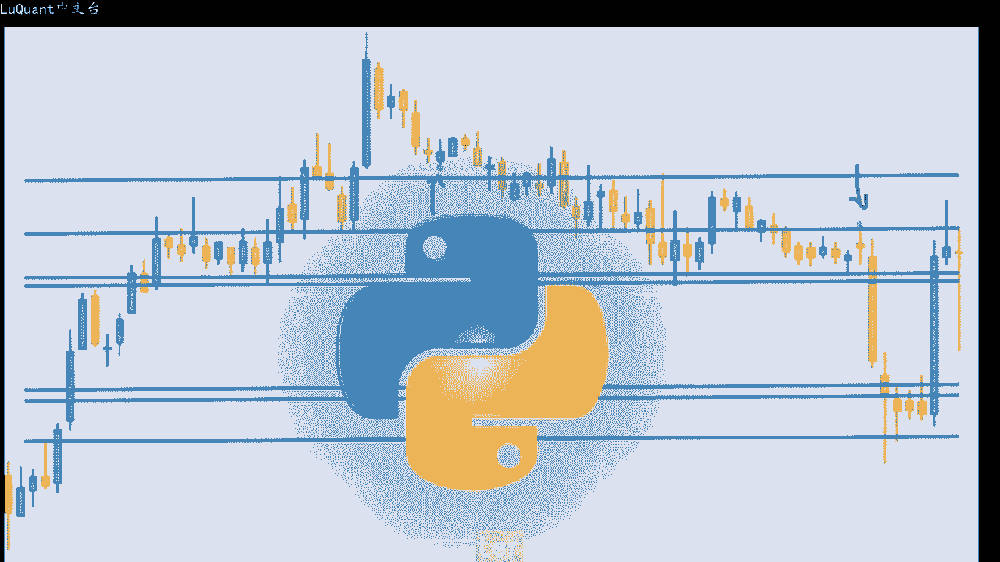

笔记本文件，我正在使用2003年到2003年之间，1小时时间范围的欧元美元烛台。2023年，这就是我使用padas加载的整个数据框架，过滤我们周末没。交易市场的零成交量蜡烛，我正在重置指数。

并使用pandas技术分析库添加RSI和只是为了这个演示。我只考虑2000行，我没有获取整个数据框。这样当我们绘制这些数据来检测分型时，我们可以有一个清晰的可视。我们正在使用我们拥有的这两个函数低分型。

我称之为支持。所以我们有一个支持函数，它将检测低分型蜡烛，并使用此函数检测阻力蜡烛。请注意这些函数将数据真做。参数，然后测试当前蜡烛指数。如果它是支撑或阻力蜡烛或分型。

然后NEN2是要与当前蜡烛之前和之后的蜡烛数量进行比较。因此请记住，我们正。比较高灯芯或当前蜡烛的最高价格或最低价格。当前蜡烛与相邻蜡烛的最低价格。因此，N一是左侧蜡烛的数量。

N2是右侧蜡烛的数量以便进行比。然后我们还有其他两个接近阻力和接近支撑的函数。这些函数他们将检测某个蜡烛是否足够接近阻力位，并考虑到我们在本视频前一部分中已经解释过的条。因此，请记住。

我们需要使蜡烛的主体高于支撑位，并且我们需要更芯足够接近特定的关键水平。无论是支撑位还是阻力位，这些函数都采用当前蜡烛的指数。我们要测。它是否足够接近我们要提供的阻力位或支撑位一系列级别。

因此这些是关键级别，值价格，其中级别是限制，意味着我们将考虑住。足够接近这些级别之一的距离，以及所有数据所在的数据框存储良好。所以现在我们有了这四个函数，到目前为止，我们可以检测分型支持分型阻力分型。

我们可以根据需要添加入阈值。但对。这个演示我没有添加，它我只是设置了一个非常低的阈值，所以基本上所有分型都是。然后我们有另一组函数。如果蜡烛足够接近，并且包含在支撑位或阻力位中，则他们能够返回。

现在我们还需要测试。之前的蜡烛，因为记住我们需要三个不同的条件和最后一个条件，一是相邻蜡烛或当前蜡烛的前一个蜡烛也应包含在相同的阻力位或支撑位中。这就是我们测试的位置。该函数采用。

它是我们正在测试水平的当前蜡烛的指数下划线后，手柄是我们想要测试的后蜡烛的数量。因此您可能想要测试，例如前3456甚至10个后蜡烛，这些蜡烛也应该包含在相同的支撑。阻力位中。

我们有我们愿意测试的级别和包含所有数据的数据框。因此这两个函数将检查不是当前蜡烛，而是之前的蜡烛。如果它们包含在我们要在此处传递值的关键级别。作为参数，现在我们拥有生成信号的所有元素。

我正在定义一个名为检查蜡烛信号的新函数，它需要当前蜡烛的索引。我想测试N一和左侧和右侧的两个参数蜡烛被认为。后蜡烛的数量以检查它们是否包含在相同的关键水平和包含第一部分中所有数据的数据框架中。

我们将声明两个列表为空列表，支撑位和阻力位列表，以及我们将使用支撑。阻力函数来计算这些水平，并将它们附加到这些列表中。因此我们有两个列表，一个包含支撑水平的列表，一个包含阻力水平的列表。

我们将合并所有水平在代码的这一部分中彼此靠近。我正在考虑这里的距。0。0001，所以这是针对您的美元，如果您愿意可以更改距离，并从这里进行实验。我们可以通过两种方式进行，或者我们保留这些两个列表分开。

因此，支撑位和阻力位分为两。不同的列表，我们将分别对待他们，或者我们可以认为同一水平可以同时充当支撑位和阻力位，具体取决于价格的走向。因此，在这种情况下，我们还可以将两个列表合并为阻力位和支撑位。

这是一。新列表我们对其进行排序，我们可以进一步改进我们的合并。因为一些支撑位非常接近一些阻力位，这些阻力位基本上是相同的区域或相同的水平。在我看来，这是正确的做法，拥有最少的关。水平将澄清您的图表。

并避免具有如此多水平的所有混乱。因此，在代码的这一部分中，我们将连接这些阻力位和支撑为列表，然后我们合并那些非常接近的水。然后我们使用接近阻力和接近支撑函数来生成一个小信号。

我们结合这条线中的所有内容来生成一个新信号。所以如果我们有一根蜡烛接近阻力位，并且其相邻蜡。或之前的蜡烛低于之前6根蜡烛的阻力，同时，当前蜡烛或之前的蜡烛的RSI低于45。那么我们返回一。

这是一个看电信号，因为我们正在接。蜡烛线下方的阻力位正在上升，那么我们有一根蜡烛非常接近该特定阻力位，同时我们处于下降趋势，或者我们有下降趋势动量。因为RSSI低于45。现在我正在考虑，也许您可。

最后4根或5根蜡烛的RSI平均值，这可能更有意义。我在这里添加一个小注释，这样我们就不会忘记，以防您想对此进行实验。然后我们可以用同样的方式计算看场信号。但这次我们需要高于55的RSI这些值是实验性的。

可以更改此处的任何参数，并检查代码发生了什么情况。我还需要在此处使用一些常量。那么一根蜡烛应该与该特定水平区域中的阻力位或支撑位有多接近。所以所有这些都。您可以根据您的偏好进行微调的参数。

现在我们可以使用之前的函数来计算信号。我取N一意味着左边前面的蜡烛是8个来考虑支撑或阻力关键。N2等于6后手柄数140英尺。对于每根蜡烛，我会在该蜡烛之前140小时查看。我们正在研究每小时的时间。

请记住，140小时几乎是5天或一周。这组。为该特定周建立足够的支撑和阻力水平，我们可以采取更多的时间，我们可以采取两周或三周的时间，具体取决于您使用的时间范围。仅此而已。

基本上我们可以计算运行检查聚丙信号函数的信号。正如我们所见，我们得到了信号。😊，只是计算我们在这里得到的信号数量，所以我们得到了多少信号裸信号。我们得到了多少看长信号。同时，我们有24个看长信号。

更好一点的是，我们有42个看。😊。

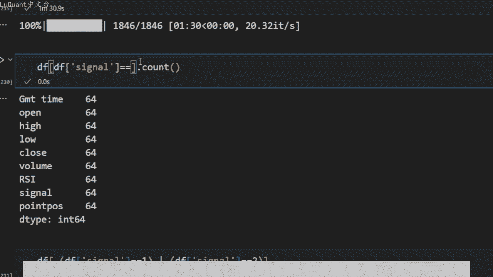

信号在这里，我打印了生成这些信号的蜡烛，所以我们有指数为179180的蜡烛，以此类推。这允许我绘制图表上的那些信号或那些特定的蜡烛，让我们绘制例如100到300之间的蜡。

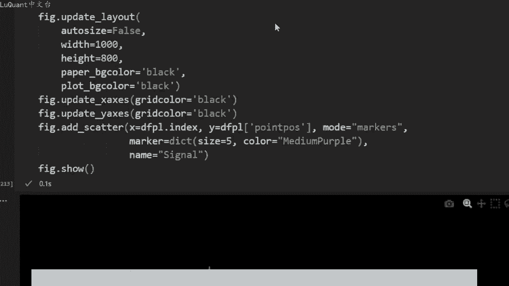

因此，我们将在这里可视化所有这些信号，因此我将选择100到300的切片来绘制它。我们可以看到那些我们可以增加尺寸的紫色点，也许尺寸等于8，你可以看得更清。

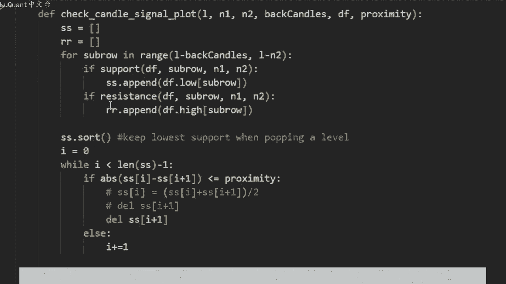

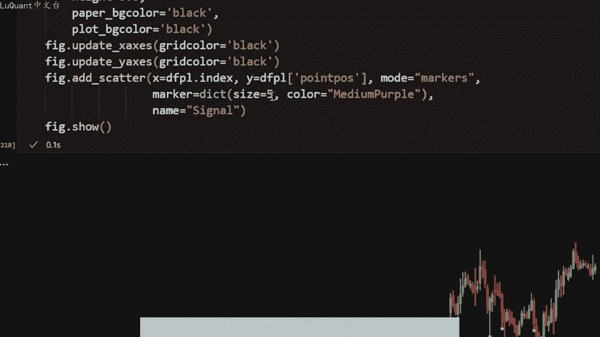

所以我们有这些紫色点是我们的信号，我们可以看到条件得到满足。例如在这些蜡烛上，所以我们有一个看见信号，这是完全正确的。因为我们在这里有一定的支撑位。😡，我们第三次触及的阻力位。

然后似乎所有条件都得到满足。我们正在从下方接近阻力位，所有蜡烛和当前蜡烛都在足够接近，所以我们产生了一个看跌性。如果你看一下，如果你把我们的入场位置设置在收盘点，那么这实际上是一个很好的信号。

所以对于这个蜡烛，我们的止损可能就在这里附近的某个地方，我们可以把很容易达到2比1的止盈止损比。所以我们的风险回报。😊，非常大。在这种情况下，这些不是好的信号，所以我们会在这里停止。

因为我们处于下降趋势。而且似乎这是一个支撑位，已经被突破。此时，我们正在稍微逆。我们预计价格会在这个成为阻力位的支撑位上反弹，并继续下跌。说实话，在现实生活中，我会将该交易视为空头头寸。

我不会我们没有在这里持有多头头寸，因为我们显然处于下降趋势，而且我。😡，显然正在接近支撑阻力位。所以在我看来，这将是一个很好的空头头寸，但市场并不总是站在我们这边，这是其中之一。你可以看到。

即使是人类和算法同时失败的情。那么我们就有这些情况，所以这些信号是我们预期的看涨信号。通过价格它处于上升趋势，它在支撑阻力位反弹。所以我们得到这些信号很多次，然后价格最。同时反弹。

所以他们并不是非常糟糕的信号，但在这些信号之后，价格没有太大变动。所以我们不能总是控制价格将持续多长时间。在当前趋势下，我们无法总是控制市场的波动性。所以也。这些是很好的切入点，但是您在哪里设置止损。

在哪里设置止盈，如何管理交易则是另一回事了。为了更容易的测试特定蜡烛，并检查他们的信号，我制作了另一个与前一个非常相似的函数。只是这次他。😊。

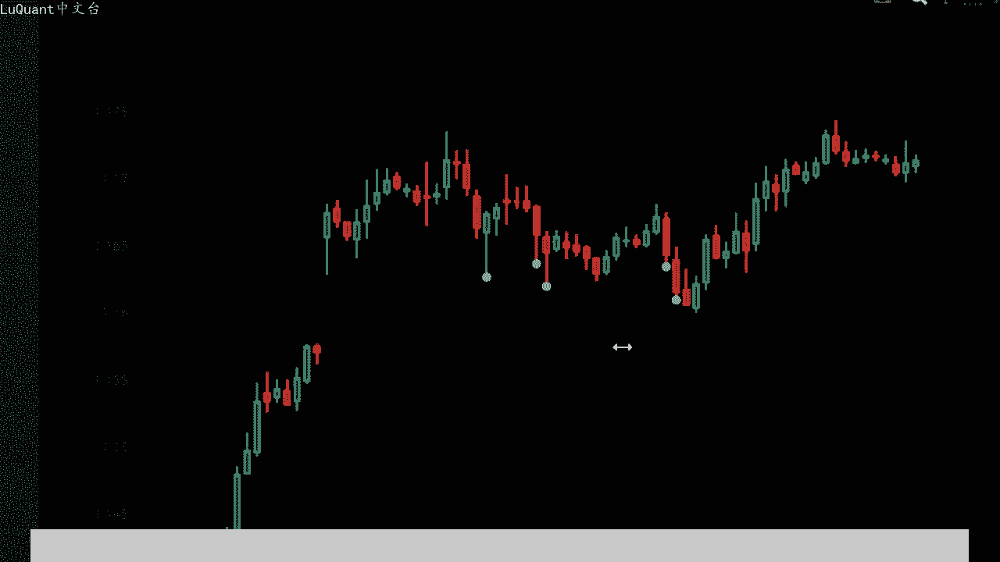

几个参数。您会猜到这些参数是什么？因为它们与到目前为止，我们在这段代码中使用的参数，它采用我们想要测试的一根特定蜡烛的索引，并且它将用当前蜡烛绘制图。

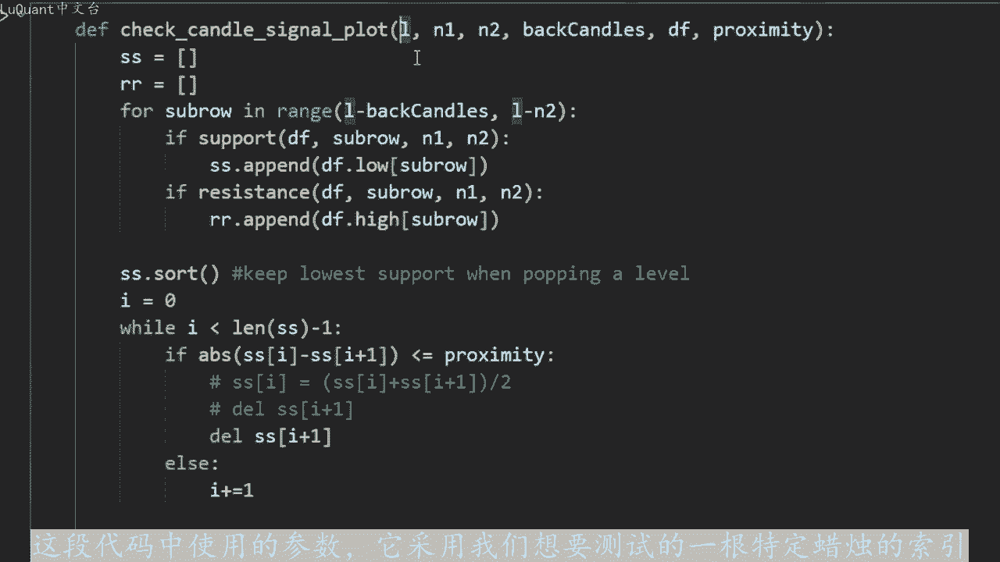

我们正在考虑我们的支撑阻力水平算法已经找到，并且它将返回当前蜡烛的信号。所以这里我们有一个看跌信号，看跌反转，让我检查我正在运行哪个蜡烛。所以它是蜡烛231。所以如果我检查230。😡。

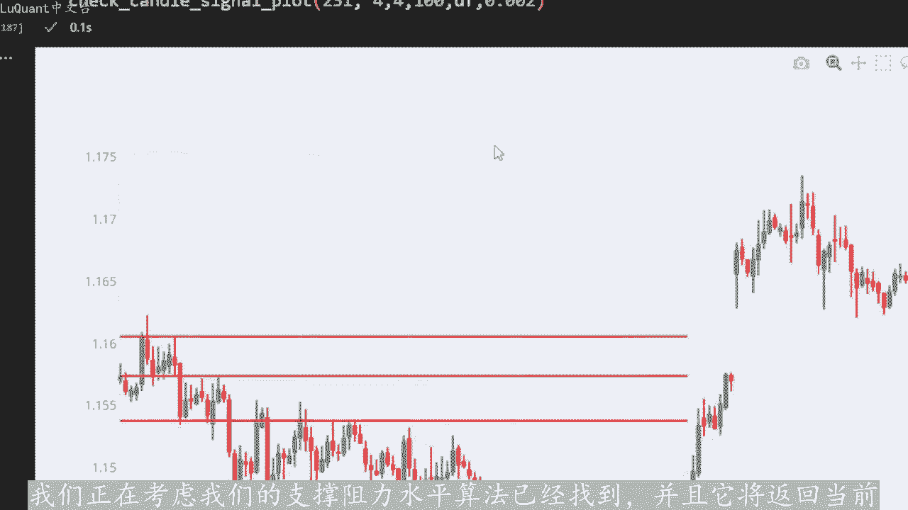

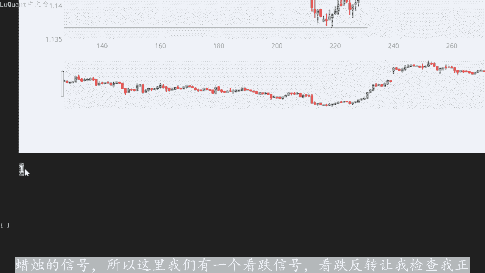

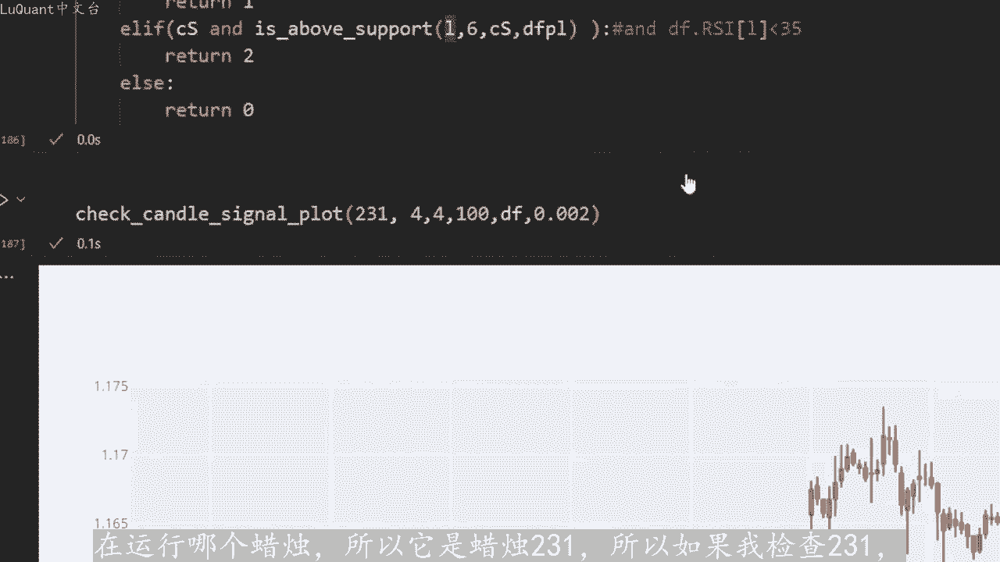

它就是返回的蜡烛一个更好的信号，因为我们有一个下降趋势，并且该蜡烛足够接近支撑阻力位，这是一个相当强的水平。实际上，价格确实在同一区域反弹了很多次，但这与我们突破这。特定水平的情况完全相同价格大幅上涨。

这就是本视频的内容。我希望它能帮助您检测策略中的关键水平，并将其纳入您的算法交易者中，以便您可以改进和增强您的交易只。

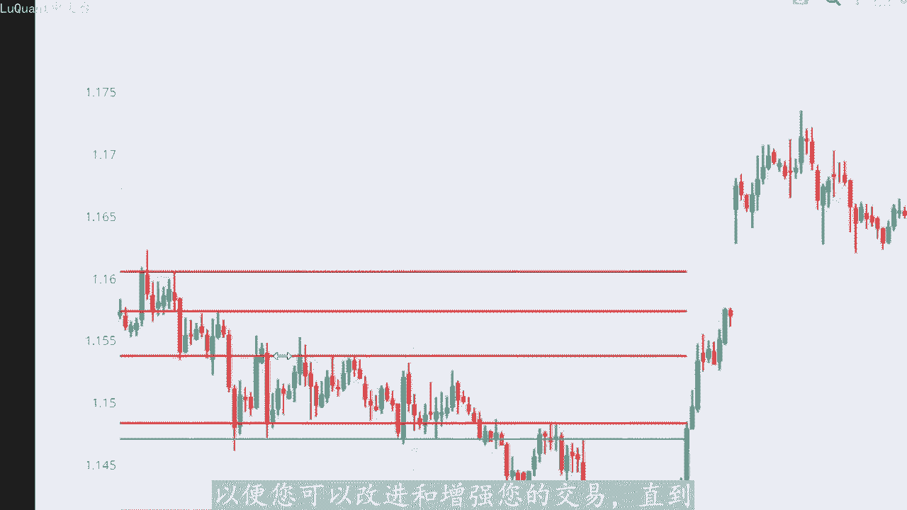

我们的下一笔交易安全并看到下次。

