# python量化19：VWAP平均线策略 - P1 - LuQuant - BV1uZ421t7gu

大家好，今天我们正在比较交易和算法交易的V web和移动平均指标。我们将使用这两个指标来构建交易机器人。我们将在比特币数据上进行回测。我们将在本视频中使用的策略的利润回。

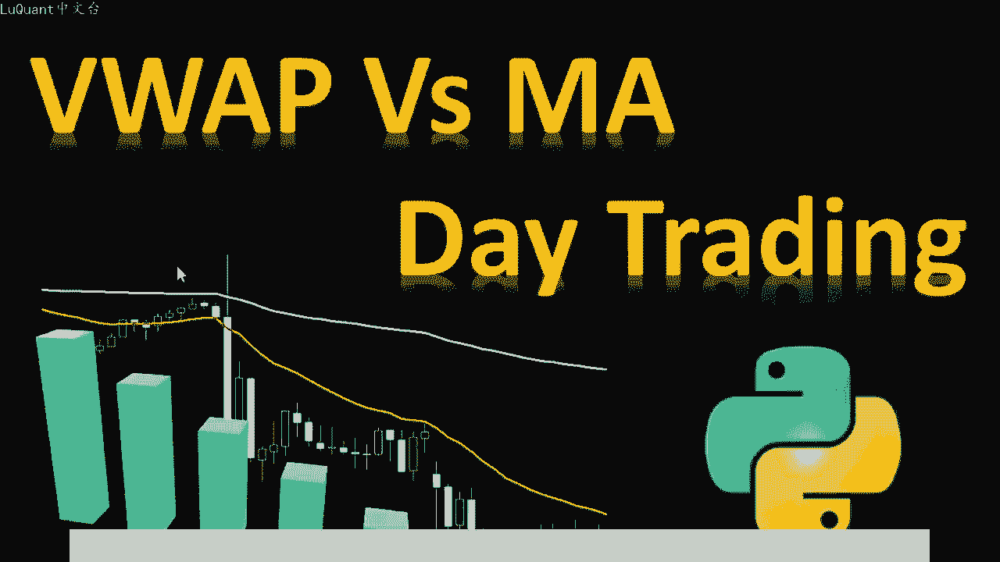

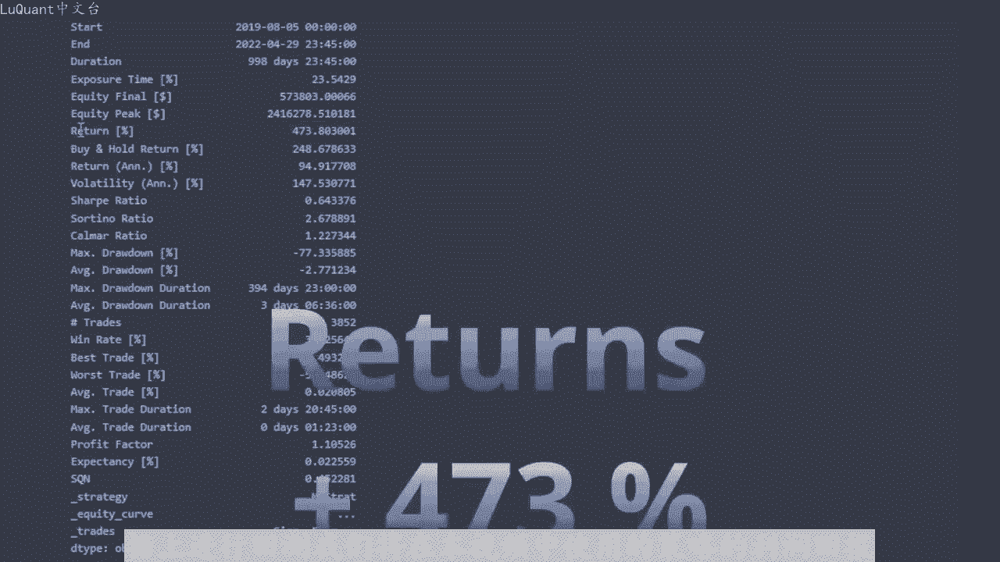

如果您也对编码部分感兴趣，那么三年数据的回报率可能从大约20%到高达473%不等。回测是使用pyython语言完成的。我将在描述中留下一个链接，以便您可以下载jupipyter笔记本文件。

并且可以访问我将在整个视频中使用的相同代码。除了是我最喜欢。😊。

交易指标之外，为什么查看应用程序很重要？这里查看可以帮助交易者确定证券是否以公允价值进行交易，这是至关重要的信息。因为这意味着，如果价格高于viewap区线或远高于视图应。曲线则可能表明该证券被高估。

反之，如果当前价格低于试图上升区线，则可能表明该证券处于高估状态被低估。所以简而言之，我们总是期望价格在某个点收敛回Vwe水平这就。我们在这个例子中看到的，其中。

价格蜡烛和黄色V网络曲线之间的差异在之前的这一点上增加价格收敛，回到试图应用程序级别，并再次从黄色曲线反弹。我们可以清楚的注意到，移动平均曲线和VI。黄色曲线之间的差异来计算VU up。

我们可以使用以下表达式，让我们看看它等于累计平均价格乘以交易量除以累计交易量，其中平均价格只不过是最高收盘价和最低收盘价之间的平均价。因此，我们只需将这三个值相加，然后除以三并除以累积一词。

我们的意思是，自交易时段开始以来的总金额，可以根据我们的目标时间范围，每天每周或每月。所以我们现在可以看到，它与移动平均线计算完全不同。我认为它通常比简单的移动平均线。

只是因为它包含有关交易量的更多信息。请注。视图应用程序表达式中包含的两个与交易量相关的术语，我们还可以使用视图应用程序来确定交易的最佳进入点和退出点。因为它也充当动态，随价格变动的支撑位和阻力位。

这就是我。在本视频中展示的策略中，使用V up的另一个提醒。如果您是这个频道的新手，我们总是在说明中分享pyython代码，您可以下载视频，并自行尝试更改参数，并优化您的交易。我们将使用的策略如下。

首先我们将查。低于或高于V的一系列或一定数量的蜡烛wep曲线或移动平均曲线。无论我们将使用哪个指标进行比较，如果蜡烛位于曲线下方，那么我们将查看空头信号，并且当蜡烛组。接近我们的曲线时。

将确定入场点在这种情况下进行比较。如果我们采用移动平均曲线及本例中的黄色曲线，我们可以说有六或7根蜡烛完全低于移动平均曲线。因此我们处于下降趋势，我们将寻找空。头寸。因此。

如果这些蜡烛紧随其后的是接近移动平均线的蜡烛，我们预计价格会在此动态阻力位反弹并继续下降趋势。因此，如果我们使用V，则我们在此时进入空头头。V曲线。然后我们将应用相同的方法。所以我们这里有这部分。

我们在V app曲线下方有一系列蜡烛，然后某个蜡烛弹跳非常接近Vap水平。我们在此时进入空头头寸，并在相反的情况。当我们蜡烛位于曲线上方，并且某一根蜡烛向下并弹跳非常接近曲线时，我们进入多头头寸。

以便进行比较。我们将在本视频中应用，我们将使用相同的策略依次依赖在移动平均曲线上，另一个时间依赖于Vap区。这将允许进行简单的比较，这是我们的jupiter笔记本文件。首先我们正在加载我们的数据。

比特币美元烛台2019年至2022年之间15分钟的时间范围，我们是清理单元格中的数据格式，然后我们使用panda。

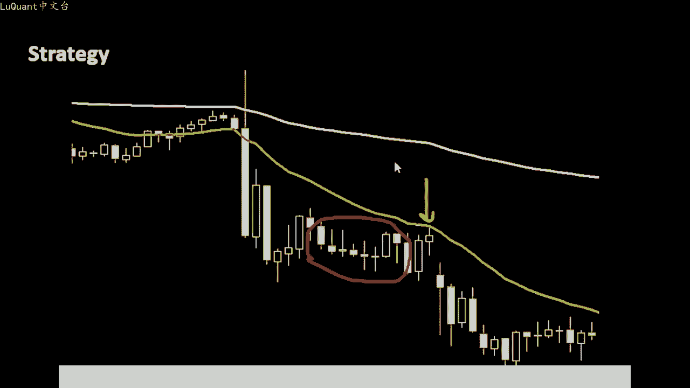

技术分析模块来计算V网和艾，然后我们可以计算我们的信号。因此我们使用一定数量的后手柄，这是连续蜡烛的数量，应该测试它们是否高于或低于曲线。无论我们使用的。移动平均线还是view app区线。因此。

在这个单元格中，我们使用指数移动平均线。我们正在计算我们要计算的每个反向蜡烛的MI信号测试，它们是否都高于或低于特定区线，然后我们将信号存储。数据框中称为MI信号的新列中，信号值将等于整数或类别。

如果我们不这样做，则等于零或3没有特定的信号。当我们有明确的短期或长期信号时，我们返回两个和一两。作为长期信号，一个作为短期信号。因此这些是我们将在数据中的新列MI信号中找到的值。

然后使用与我们计算Vap信号完全相同的方法。我们将其添加为数据框中的新。显然，如果您想测试10个连续蜡烛图低于或高于的情况，您可以更改背面蜡烛图的数量曲线，web曲线或咪曲线。我们可以在此处更改此数字。

因此现在我们已经计算了mo和视图硬。程序信号我们可以计算总信号，我们将其称为总MI信号和总VY。因此如果我们有任何非常接近曲线的蜡烛，并且我们假。价格将从该曲线反弹并反转方向。

那么这些信号将添加到先前计算的信号之上，因此距离也必须包括在那一个变量。我在这里将其称为比特币美元的近距离。我使用的是100。如果您更改货币，则必须使用不同的值。现在我只是尝试了100。

但我没有时间为了优化它。您可以在下载总MI信号函数中的jupyter笔记本后自行试验这些值。首先我们检查me信号是否等于2，这样我们就有了一个长期趋势。意味着我们测试过的所有反向蜡烛位于MI曲线之上。

如果是这种情况，我们添加另一个条件，这部分将检查蜡烛的最高点或最低点与MI曲线之间的距离是否较接近以。最高点或最低点之间的距离低以更接近猫曲线的为准，低于或等于我的近距离参数。在这种情况下。

我们返回二作为总图像信号，因为这是我们的多投入场点，然后我们在反向中对空头头寸执行相同的操作。我确实这样做总V web信号函数也相同。但这里我们依赖于web值，而不是m或移动平均曲线。因此。

如果您尝试测试m信号部分，我们必须小心此处使用totalim signal功。除非您想使用V up，我们可以用视图应用程序替换此处的em部分。现在我们从em一开始，所以我将保留这种方式。

然后可视化我们可以使用这两个单元格来可视化这些点或信号点。我们可以看。

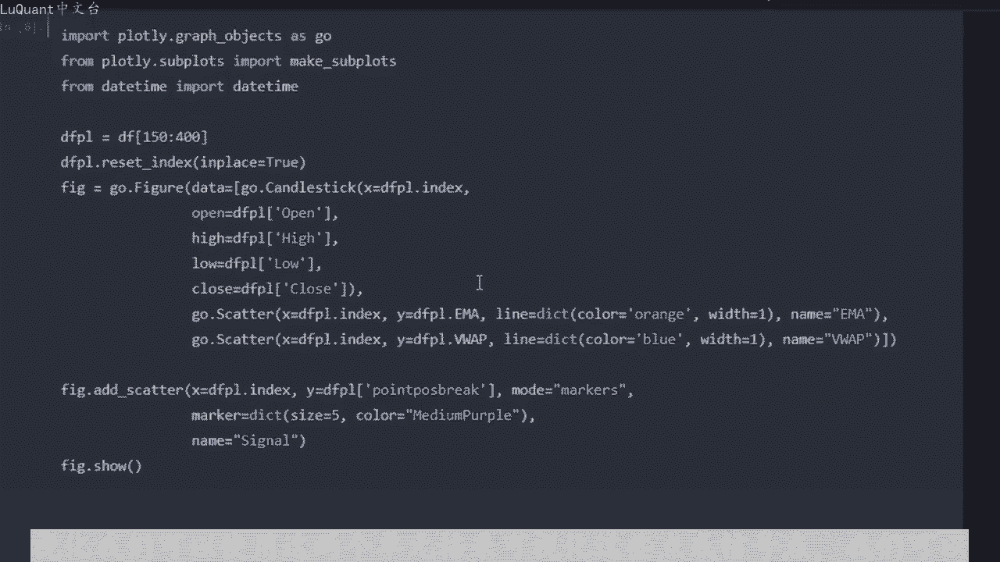

紫色点显示空头头寸，此时空投入场头寸并放大。因此我们在曲线下方有蜡烛，同时蜡烛接近就曲线而言，我们还可以看。一个多头头寸的示例，其中我们在曲线上方有一定数量的蜡烛，然后一根蜡烛的低点足够接近黄色曲线。

这就是现在用于回速测试的M曲线可以使用不同的交易管理方法。所以现在我们使用ATR。所以。

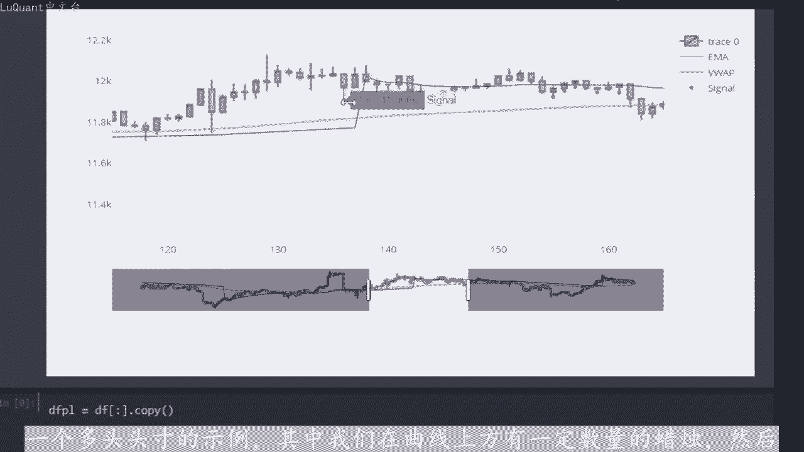

在这里将ATR计算为一个新列，因为我们将使用它来设置止损和止盈止盈水平根据止损距离，我们的止盈止损比率为2。5，止损等于AT2的0。8。因此，当前买入或卖出头寸的止损距离将使用0。8倍ATR计算。因此。

ATR相关对于回速测试，我使用回速测试do派包。对。我们在这里测试的任何内容，它都适用于该视频。因此，如果我们有一个等于的信号，并且我们一次允许一笔交易，那么长度当前交易等于0。

然后我们计算止损和止盈距离。然后我们使。止损和止盈这两个值以及当前净值的50的大小来应用买入头寸。当我们有总信号等于一，所以这是一个空头头寸，我们应用相同的方法。然后。调用我的策略的数据真上启动回测。

这是我们从回测的鸡肋策略继承的类打包10万现金作为开始。我使用1到5的保证金或杠杆。目。我们不包括佣金，因为我们需要能够将此策略与我们之前没有的策略进行比较使用佣金。所以现在我们的回报率为296%。

糟糕的集聚比率为0。6。所以尽管我们有良好的回报，但我们可以检查它。

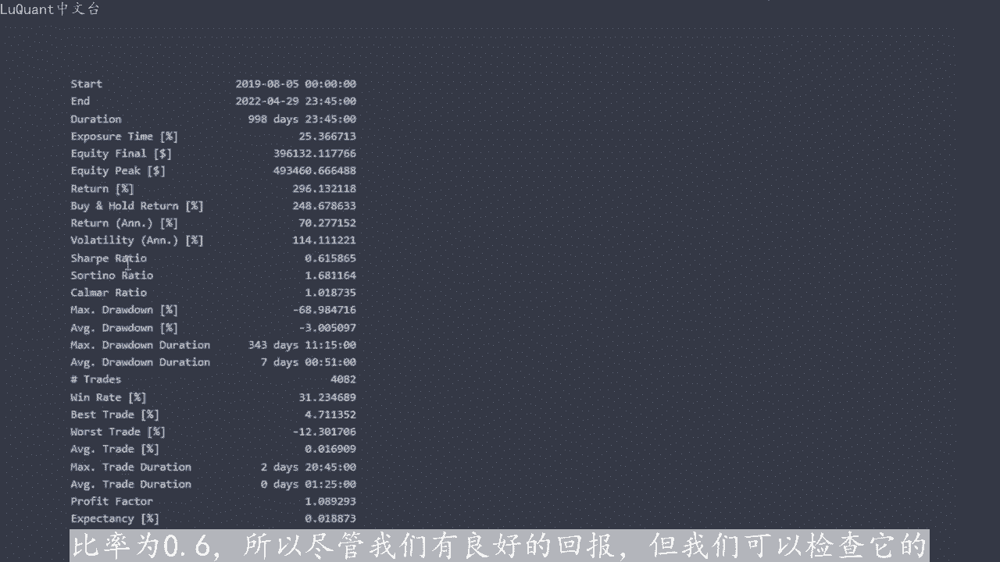

年回报率为70%，正如您在此处看到的这是我们的股本曲线，向您展示如何该模型在三年的数据中表现良好。因此，我们一开始出现了回撤，然后他挣扎了一。办货近两年，然后我们的价格出现了良好的攀升。

当我们看到价格时，这种上涨就发生了这里的波动性增加。所以当波动性非常有限时，这个模型就不能很好的工作。我们可。😊，在这里看到，所以这些是蜡烛和他们之上的交易。所以如果价格没有以足够高的波动性移动。

每当我们有大的运动时，该模型就不能很好的工作。似乎该模型工作的很好，我们开始增。

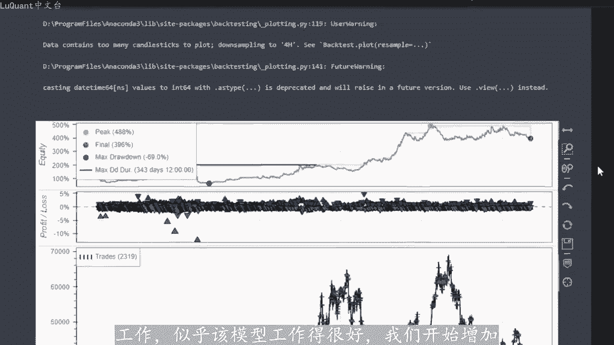

利润现在我们可以尝试完全相同的事情，但使用V网。所以我将在这里替换图像信号，通过PU app调用视图应用程序函数。我们可以在此处重新直观的检查信号。然后我使用与M完全相同的参数，重新运行回测部。

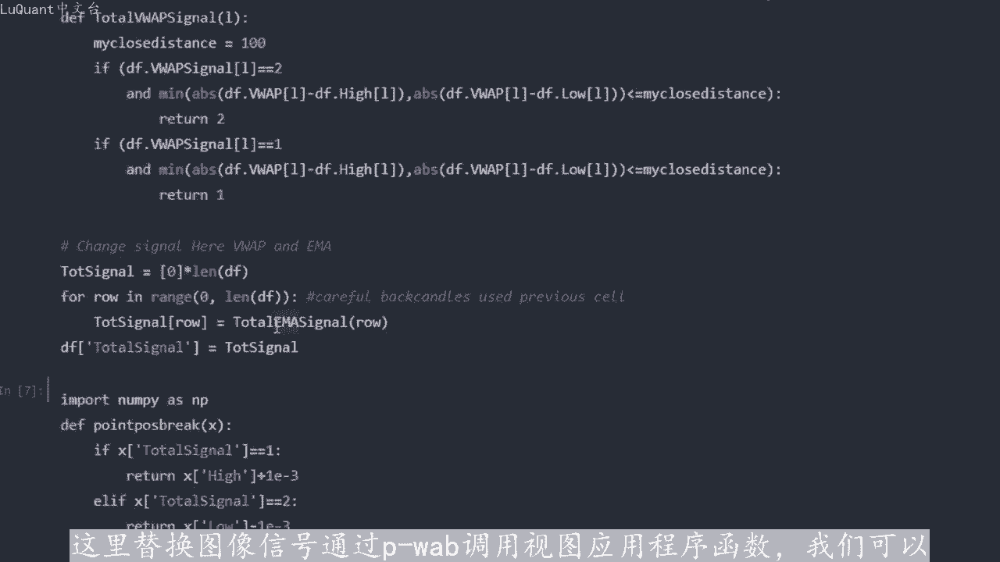

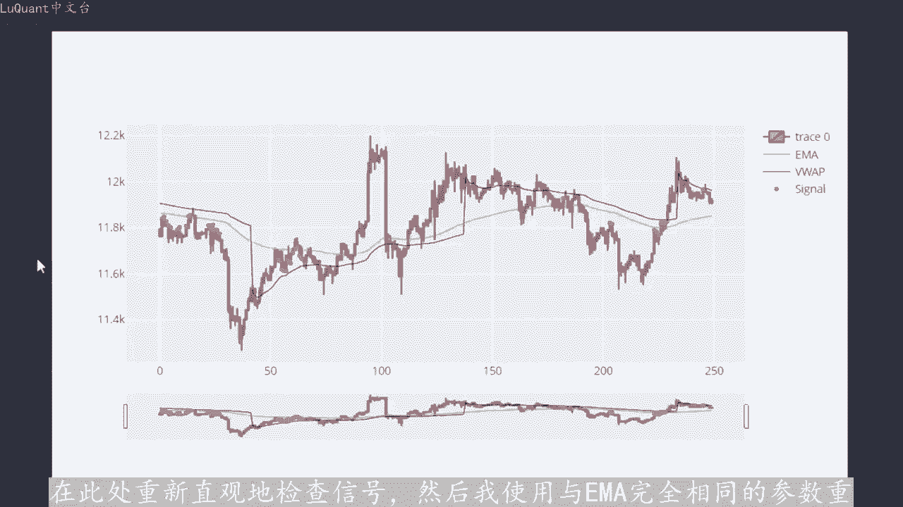

否则，此中的总回报将不公平情况是473%，几乎是我们使用MI曲线得到的两倍，集聚比率几乎和MI信号一样糟糕。而。

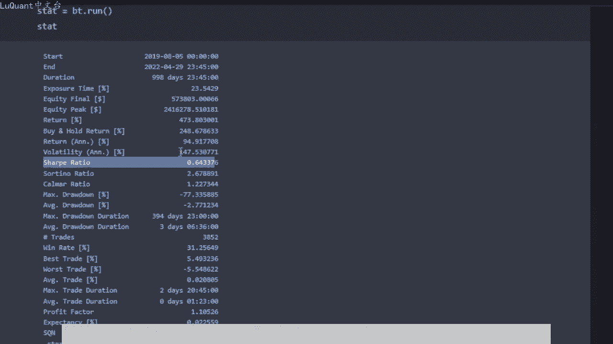

股票曲线确实令人失望，所以我们在某个时刻达到了2040的回报，但后来效果不佳，我们有一个很大的下降。

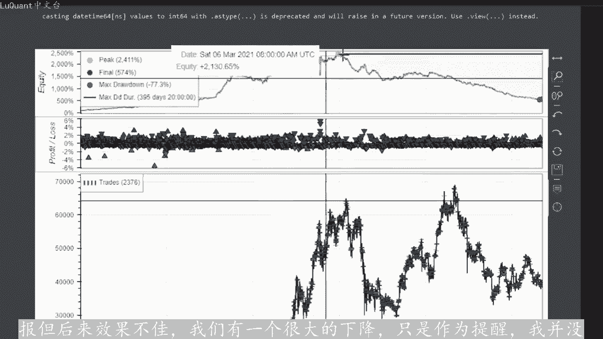

只是作为提醒，我并没有证。

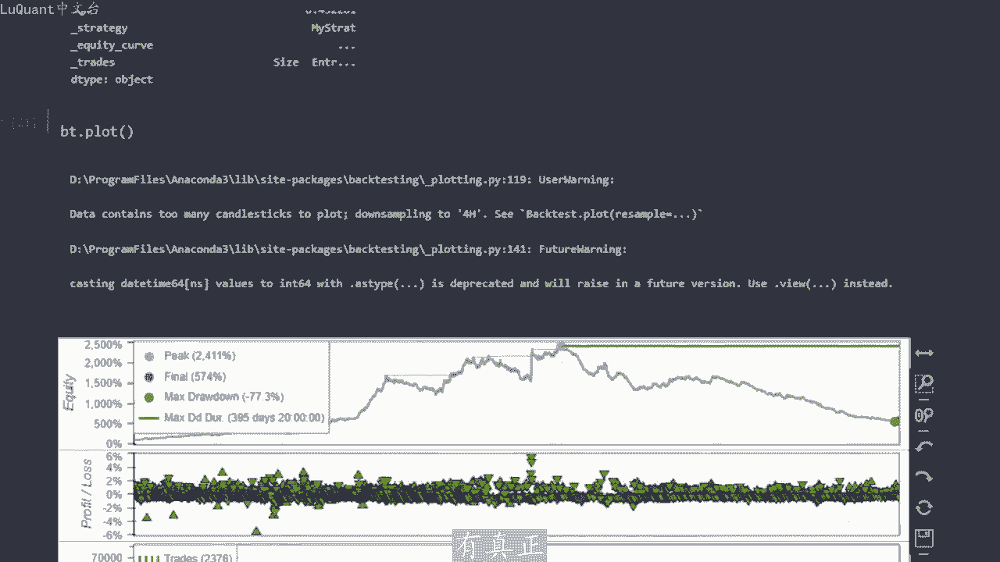

优化参数，我只是简单的输入随机数或净值大小、保证金、止损、获利比率等等。您可能想要更改这些并自行尝试，以及要考虑到后手柄数。和我的闭合距离参数，因此我们有大约4个或5个参数。您可以根据您的风格。

轻松调整和微调并检查。如果您可以在这些参数之间找到一个很好的折中方案来增加我们的锐利比率，并减少我们的毁。

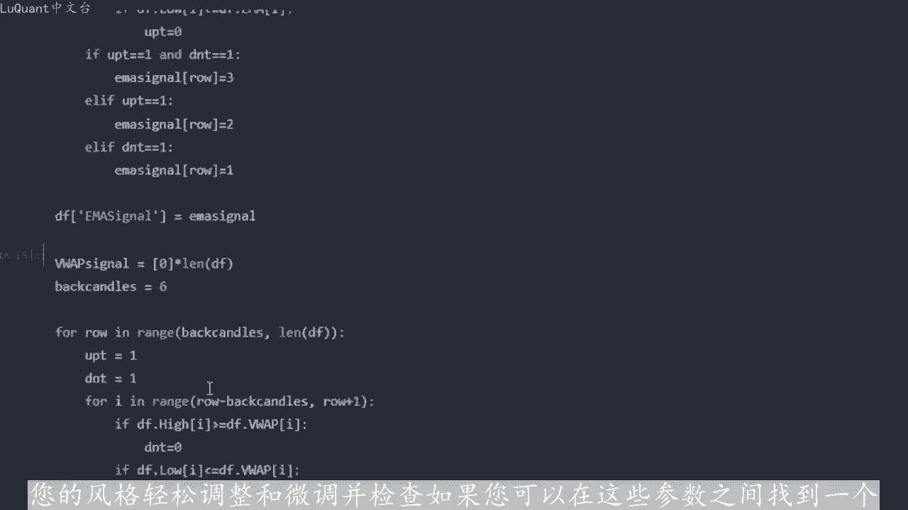

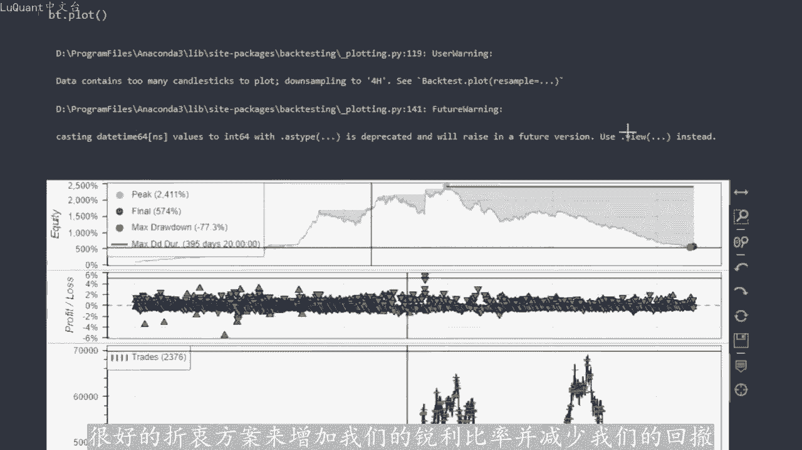

周期如果您想增加锐利比率，通常您想减少您的保证金或杠杆比我们采取2分之1。然后我们运行后面再次测试需要一些时间。所以我们可以看到我们的回报率下降到123%。但是我们。

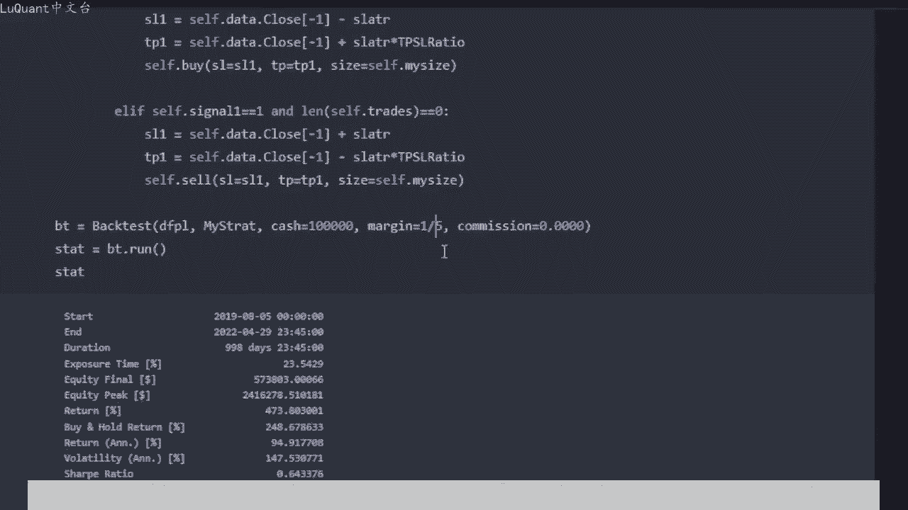

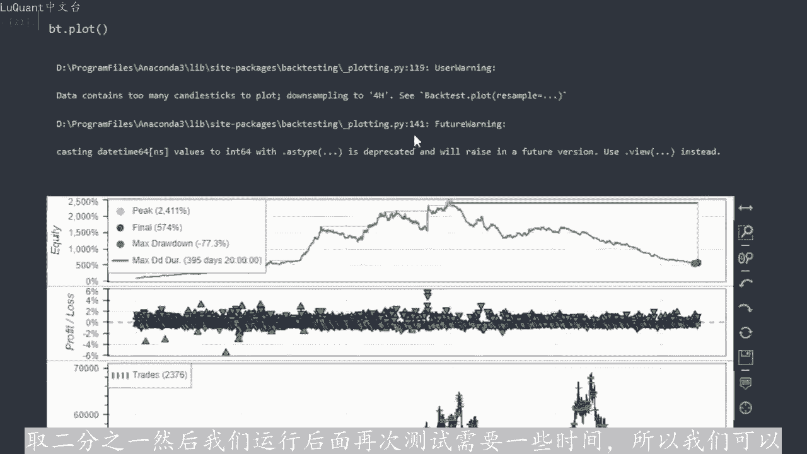

锐利比率从0。6增加到1。02，所以您可能还需要考虑这样一个事实。如果您使用杠杆账户，您会降低锐利比率。因为显然您正在增加风险应。

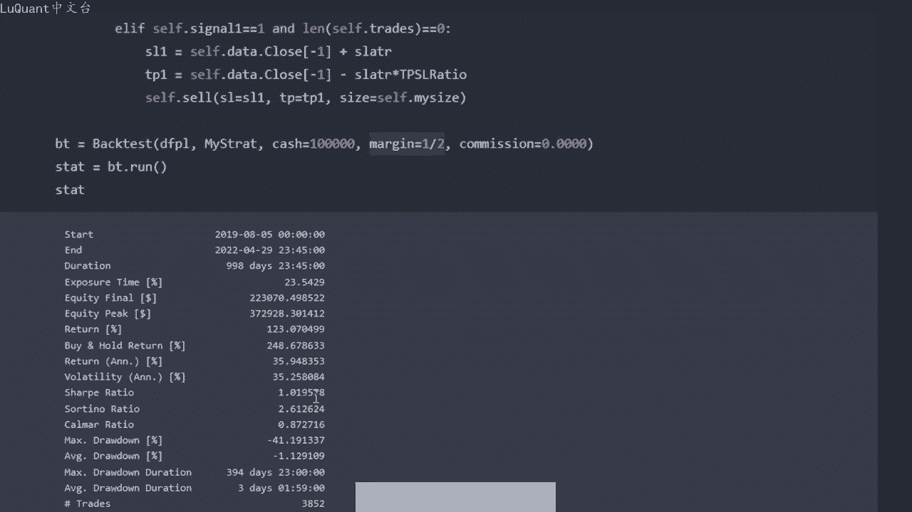

回撤期更加严重，这就是我要告诉您的全部内容。我希望这对您的交易有所帮助，并让您了解V web和V web之间的差异。Vap和移动平均线指标直导我们下一次安全交易。下次。

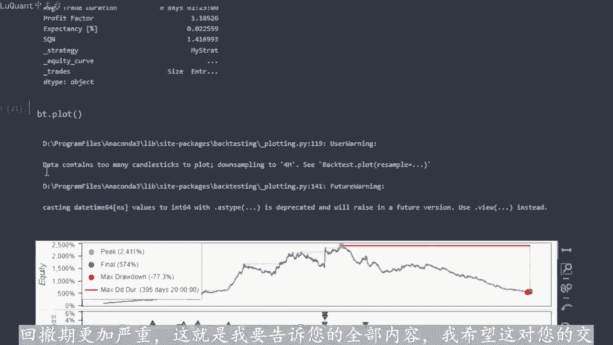

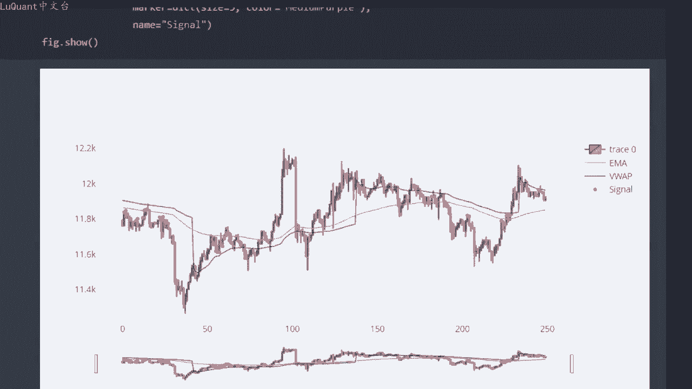