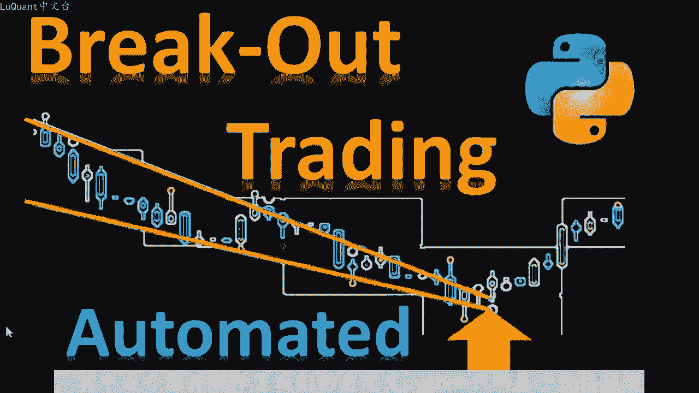
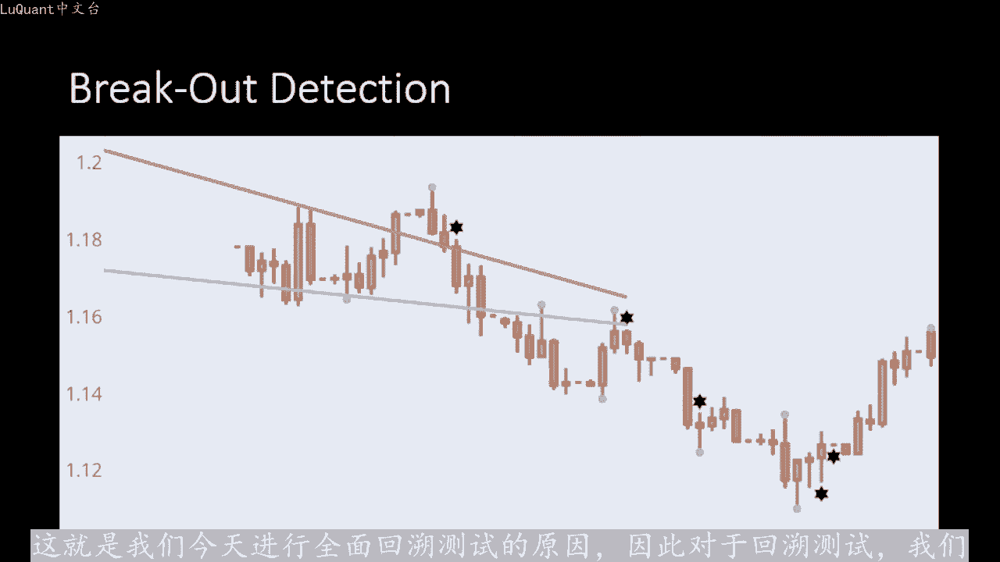
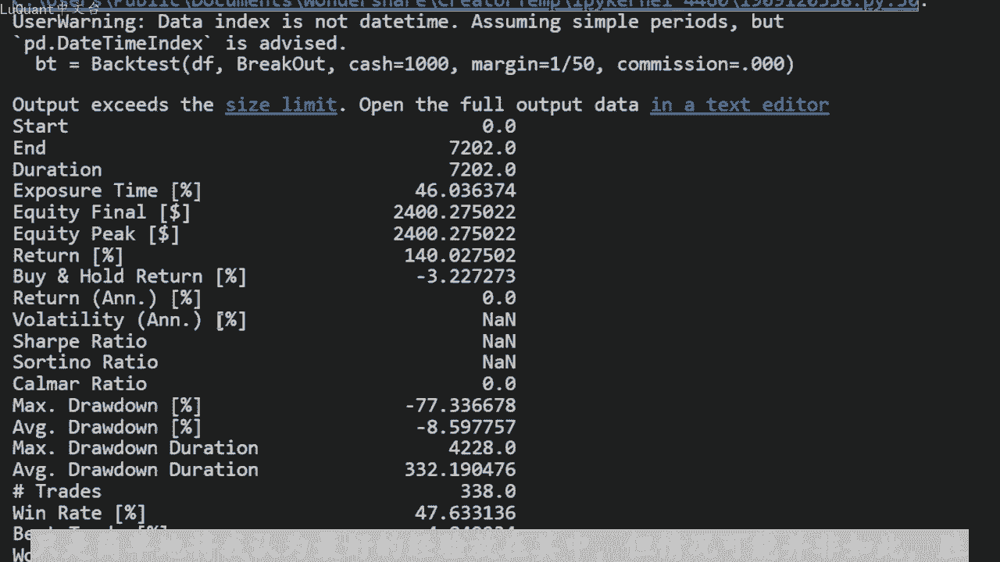
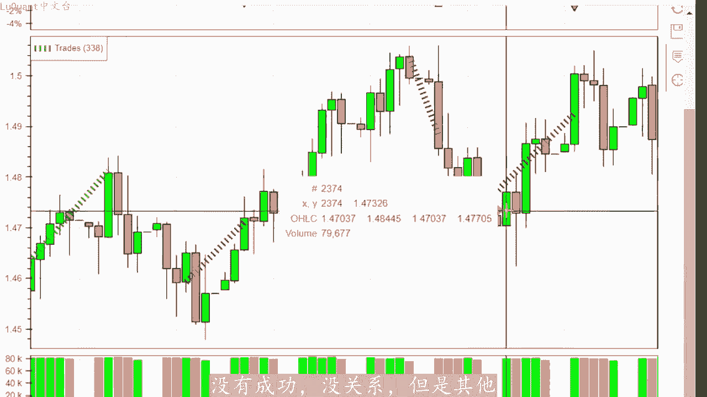
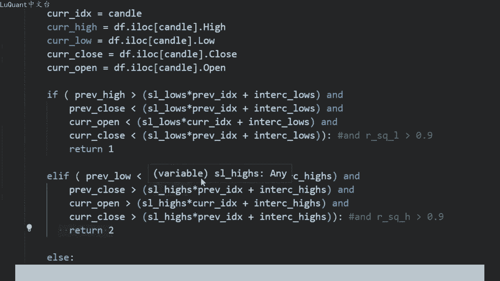
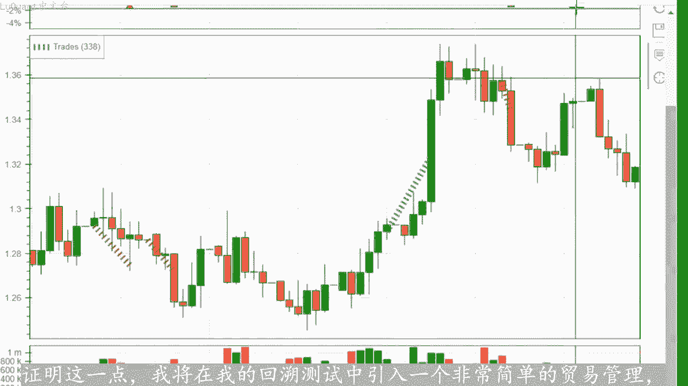
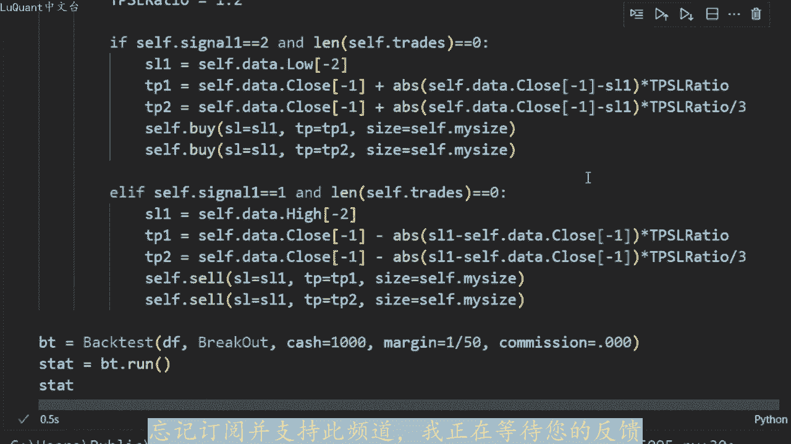

# python量化21：价格突破回测 - P1 - LuQuant - BV1LK421e7P9

您好，欢迎回到今天视频中的我的频道。我们将专注于开发和回测基于价格通道突破的策略。如果您是新来的，我建议观看我们的上一集。其中我介绍并解释了我们的自定义pyython代码基于价格通道指标。

在下面的描述中留下一个链接，现在让我们深入了解今天的主题，进行上一个视频中的回溯测试部分。我们介绍了检测价格通道的代码。简而言之，我们首先检测的是分型，所以蜡烛的高点。蜡烛的低点。

所以分型是蜡烛的一个点。例如它同时高于所有临近的蜡烛，如果它低于所有临近的蜡烛，那么它也是一个低分型。在这种情况下，我们正在检测不同的分型。因此我们正。应用回归来，将这些低点和高点拟合到斜率中。

并将这些斜率保留在内存中作为定义价格通道的通道。然后我们尝试在以下情况下检测突破价格走出该通道。我们假设当突破时，价格。继续朝同一方向发展。因此，如果价格突破通道，价格将成上升趋势，如果价格突破通道。

价格将成上升趋势。进入下降趋势，测试，该指标在视觉上似乎工作的很好。这让我们好奇，它在长期策略上的表现如。这就是我们今天进行全面回溯测试的原因。因此，对于回溯测试，我们使用pyython作为通常。

您也可以从描述中的链接下载代码，这样您就不必从头开始重写所有代码。好吧，我们将加在数。

因此。我们将获取10年20年的数据。2003年到2023年，这也是我们在上一个视频中使用的内容。我使用的是后蜡烛图45，这是蜡烛图的窗口。我们将在其中检测费。高点和低点，我们将检测我们的通道。因此。

我们在上一个视频中介绍的第一个函数也称为书轴。它将检测蜡烛是书轴点还是分行点。该函数采用两个参数蜡烛所引。窗口含义，考虑该特定蜡烛左侧和右侧的蜡烛数量。

以检查该蜡烛是否高于这些相邻蜡烛的所有高点或低于所有低点。我通常在感兴趣的蜡烛的每一侧取2到3根蜡烛。函数是PVt将返回忆，如果蜡烛是一个书轴高点，那么它是一个非常高的蜡烛，高于所有相邻的蜡烛。

如果它是一个书轴低点，它也会返回三。如果两者都是。所以如果蜡烛器最高。高于所有邻居价格，最低价也低于所有邻居价格。在任何其他情况下，在此单元格中，它将返回零。

我们正在应用SP来使用窗口检测书轴蜡烛等于3。我们在数据框中创建一个名为piVt的新。它将返回这个特定函数的信号Pvo，并将其保存为数据框中每个蜡烛的星列。然后我们需要收集通道或检测通道。

所以我们要查看当前蜡烛之前的45个蜡烛。我说四5是因为我将后面的蜡烛数量设为45，这是一个您可以在程序中修改的参数。因此这是一个参数，就在这个单元格中。所以回到我们的通道，我们将检。

每45根蜡烛的高分型和低分型，如果这些分型是高于三的数字，所以如果我们至少有三个低点和三个检测到的高点分型，我们将使。回归将这些线性回归拟合为斜率。此函数收集通道将返回这些斜率的参数。

因此它将返回低点的斜率低点的节距和R值低点以及这些参数，还有高点参数在任何。其他情况下，如果我们在45根蜡烛窗口内没有检测到三个低点和三个高点，我们将返回零。所以现在我们的函数已准备好。

我们可以将其应用到CSV文件中的数。使用后，手柄和窗口从数据框中收集通道或每个蜡烛，这样我们就可以将所有结果保存在名为F通道的新列中，然后再使用一个函数继续我们的回测。它是突破，它将检测何时突。

价格通道。因此，对于数据框中的每个蜡烛，我们将检测保存通道参数的通道列，以便截取斜率的高点和低点以及R平方值。然后我们在以下方法中检测突。因此，前一个蜡烛的高点应该在通道内。

所以它应该是关于缓慢流动和前一个蜡烛的收盘价应低于低点。因此前一根蜡。从通道内部向下突破通道下方，但它仍然与最低点的斜率重叠。然后当前蜡烛当前蜡烛的开盘价完全低于下斜率，并且收。价也完全低于下斜率。

因此我们有两根蜡烛，一根正在突破通道，一根完全在通道之外。当这种情况发生在下斜率下方的通道下方时，我们反。一根蜡烛作为信号，如果它发生在高点或高分型斜率上方的斜率之上，在这种情况下，我们返回两个。

因为我们在通道上方有突破，在任何其他情况下，我们返回零，这样我们就可以在所有蜡烛上运行这个函数并减。结果将结果保存在我们的数据框中名为突破的新列中记住。如果我们有突破一，则意味着这是一个下降趋势信号。

如果是二，则意味着这是一个上升趋势信号，并且该突破信号就是我们要处理的信号馈送到我们的回。😡，策略。因此我定义了一个信号函数，该函数将从数据框中返回is突破列的值。

这是我们将在回测策略本身中使用的信号函数测试时我。像往常一样，使用回溯测试库触始手术大小是权益的10%。然后我们在这里得到信号，信号函数称为止盈止损比率。我目前使用1。2，如果信号等。

2、并且交易长度等于0，意味着我们一次只允许一笔交易，则止损设置为前一根蜡烛的低点。如果是买入信号，则为买入头寸，我们正在采取的。因此我们正。寻找前一个蜡烛的最低点或最低价格。

这将是我们的止损点相应的设置止盈。因此，他考虑了止盈止损比率距离相反的情况。当我们有卖出信号，并且没。任何未平仓交易时，我们将在前一根蜡烛的最高点设置止损，并使用止盈止损比率设置止盈第一次回测。

我使用的是1000美元的缓存，保证金为50分之1。目前没有佣金，因此我们可以将此策略与我们之前的策略进行比较。无论如何，在您没有的每日时间范围内，担心价差并不重要，但我们确实必须担心掉漆。

如果我们隔夜进行未平仓交。从一周到另一周，所以这是未来需要牢记的事情。关键时刻，让我们检查一下结果，我们的全额回报率为140%，买入并持有回报率。-3。22%，我们的最大回撤率为-77%。

这在这一点上确实令人失望。所以我会公平的说，我对策略有更好的期望。实际上我没有花时间优化参数。只是简单的将我认为最好的经验放在其中，但情况可能并非如此，胜率是47哦，这并没有那么糟糕。

所以正如预期的那样，他在可能8年的时间里表现不佳。只有在过去的几年里，我们。😡。

股本才出现这种增长，让我们检查一下我们是否可以改进贸易管理，并使这项工作变得更好。但在此之前，如果我们看看如何我们的指标正在执行，我们可以尝试猜测发生了什么，并尝试纠。😡。

他所以基本上我们正在寻找通道突破这部分。例如，如果我在这里采用像三个最小值这样的最小值，并且我们执行，那么这就是红色的亏损交易一个人为的斜。然后是高点，我们在这里有一个斜坡，这个蜡烛确实是一个突破。

可能表明未来的下降趋势。这就是这里发生的情况。这是一个单元位置，在这个点上被停止。我。可能在这里有一个小通道，所以这是一个高点，它比这里的三个邻居和这里的三个邻居都要高，所以他被认为是一个书轴高点。

这也是一个书轴高点。所以我们有两个书轴高点，可能是这里附近的第三个书轴高点，我没这张图表上有信号。然后我们有三个书轴低点，所以这个也是一个书轴低点，这个也是这个也是发生的情况是我们显然在通道上方突破了。

他可能也在考虑这一点，并且在这种情况更糟。因为斜率的线段或线不太能代表这些蜡烛，因此它还取决于您考虑的蜡烛数量或后面的蜡烛数量，这是非常动态的这就是这。我们程序中的一个弱点。

我们采用固定数量的蜡烛45根，可以是30根，也可以是35根。但实际上它不是固定的，所以市场会改变，形状也会改变。所以我们有找到一种方法，使这种情况更。动态，并且当我们突破这个上升趋势通道时。

我们宣布未来的下降趋势。我们在这里采取卖出立场，此时也停止了。所以在我看来，我认为这是一个更正。😡，我的意思是，我们以这种方式编码这个程序。所以我们有一个上升趋势，我们有一个特定的通道。

然后一个大的柱型蜡烛突破了链通道下方的通道，这是一个卖出信号。我们在这一点上收到了一个卖出信号，没有成功，没关系，但是其。😡。

一些交易可以得到纠正。我想在这里提到的另一点是交易管理，所以，即使信号运行良好，如果我们没有正确管理交易，它也会以失败告终在亏损中，我们可以以这根蜡烛为例。因此我们有一个上升趋势通。

并且显然，一根蜡烛突破了该通道上方。因此，我们宣布上升趋势可能会延续。我们在这里进行交易，这可能是一次尝试。此时利润如此，但没有成功，所以我们被阻止了。尽管在进行交易后价。连续两天持续上涨。

一些信号比这个要好得多。所以例如我们有一个明显的下降趋势通道，然后突破通道和价格飙升。但在这种情况。我们没有利用整个价格模式变动或价格范围。这主要是因为我们没有管理我们的交易，它是在非常简单的方法。

实际上，如果你有一点贸易管理经验，并且为。证明这一点，我将在我的回溯测试中引入一个非常简单的贸易管理，这样我们就可以做到这一点快速的。我们不会使用一个带有止损和止盈的头寸。😡。

而是使用两个头寸和两个指盈。第一个指盈。位于原始止盈距离的3分之1处，所以我们有两个止盈利润和两笔交易。换句话说，我们以3分之1的止盈关闭一半交易。而我们将另一半留给全部止盈潜力。同样的事情我可。😡。

在此处为空头头寸添加此卖出部分到目前为止，我们获得了140%的回报。现在我将再次运行完全相同的参数。现在我们获得了200%的回报，这仍然是一。需要优化的策略，他仍然没有准备好自动化并投入使用。

进入算法交易机器人等。因此，我们知道较大的回撤百分比，但这证明，交易管理在您的交易中发挥着至关重要的作。这不仅仅是关于指标，如果您不实施良好的交易管理，不会增加您的利润。因此，在结束本视频之前。

我将向您指出。可以优化策略的参数，您可能想尝试一下您可能想要的后蜡烛数在窗口参数上也进行实验。我使用等于三的窗口，因此每边都是三根蜡烛。您可能希望在每日时间范围内将其增加到5根，这是非常可以理解。

我认为可能发挥作用的另一个参数是蜡烛的数量，在将它们拟合到斜率之前，您需要考虑的输轴点，我只是在寻找这个。因此在这个例子中，我们至少采用了三个低点和至少三个高。😊，来考虑将价格拟合到一个通道中。

所以您可能想要要将其增加到4或3乘2和2乘3。您可以测试不同的组合，并且您可能还需要考虑。高点和低点的拟合质量进行更多限制。因此，当我们拟合高点和低点时将低点变为斜率，我们需要有一定的R平方值。

并且该值应该高于一定的限制。所以我会说它至少是0。9或0。8。我没有将其包含在本事例中，因为我不想使一开始事情非常复杂，但如果你想加倍努力，你可能想尝试这些。我认为最重要的是你如何管理交易，无论如何。

这是一个不同。😡，主题我们可以在一个完全不同的视频中处理，因为有我们可以通过多种方式管理交易并实现交易管理自动化。我知道您可能有点受骗了，我也对这个指标抱有更好的期望。我过去测试过的所有指标。

一开始的结果都要糟糕的多，然后通过应用一些优化事情变得更好，让我知道您在下面的评论中的想法，请不要忘记订阅并支持此频道。我正在等待您的反。😡。

直到我们下一次安全交易，下次再。

