# python量化22：通道突破指标 - P1 - LuQuant - BV11J4m177XG

大家好，今天我们要深入研究价格通道突破，这些是由算法自动生成的突破事例。稍后我将向您展示代码，您可以从链接免费下载完整的pyython代码在下面的描述中。所以这个心型是一。崩溃之后，我们有一个下降趋势。

然后我们可以检查另一个例子，我们在蜡烛下方有一个突破心型，这表明未来的上升趋势。我们将在一个例子中解释所有细节，简而言之，这是一种技术分析工具。通过围绕价格行为绘制一条通道来帮。😡。

交易者识别潜在的价格突破，该通道代表了一段时间内价格的高点和低点以及价格何时突破通道可以发出潜在趋势变化。

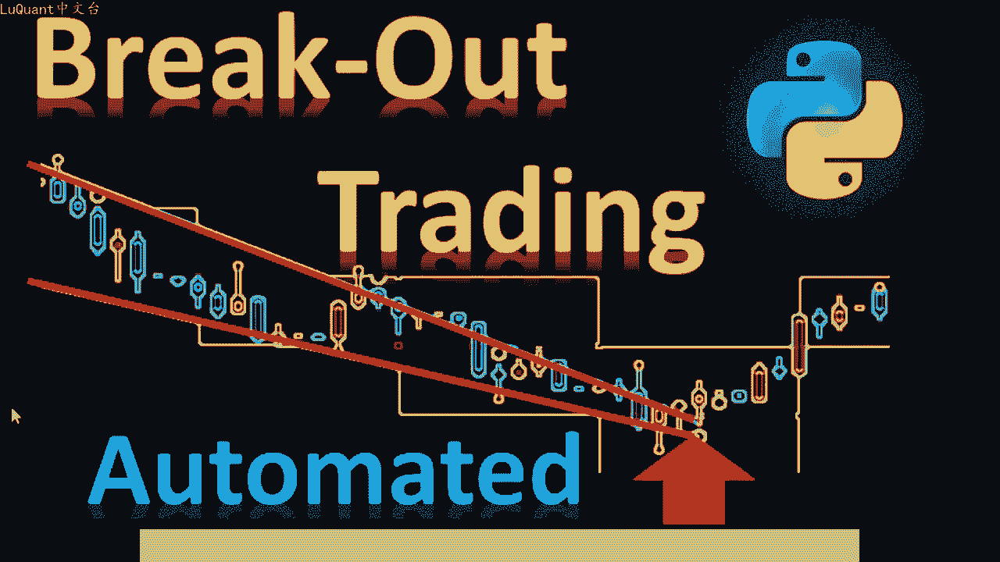

市场机会的信号。有趣的是，在pyython中，我们可以自动化识别通道和潜在突破发生时的过程。正如我所提到的，您可以下载我为此使用的完整pyython代码描述中链接中的视频，我还将加入CSV数据文件。

一此图表上需要黑色星星代表算法检测到的突破。这里的最后两颗星星是用这两条线段显示的该通道的突破。因此，当星位于蜡烛下方时，它表示突破。因此，未来的上升趋势。星型位于蜡烛上方时，它表示未来的下降趋势。

这意味着我们在当前通道下方突破。因此，例如，第一个星形表示，未来的下降趋势因为我们在某个通道下方有一个突破。所以我。不是在谈论这里显示的这个特定通道，它是来自之前蜡烛的不同通道。

这个也显示了在某个通道下方的崩溃。这个也是如此。这两条线与我在这里向您展示的线段相关。因此我们可以检查另一。😊，事例，例如这颗星与算法检测到的该通道相关。当我们在通道通知下方出现突破时。

我们会出现一个小回撤，这就是为什么我们在蜡烛上方有一颗星星。它预示着未来的下降趋势。在这种情况下，它正在攻。注意这个也正在工作，所以这个预测也几乎是正确的。我的意思是，我们仍然可以赚取可观的利润。

这是每天的时间欧元美元价格框架。这两颗星我们已经提到过，他们突破了某个通道，正是这个通。😡，所以我们正在突破蜡烛，突破了这两条线，也表明了上升趋势。

所以我们可以在这些例子中看到使用每日时间框架和欧元美元价格，信号似乎运行良好。因此我们需要进一步测试。引导您完成整个算法步骤和代码，以便您可以修改它并罚款。根据您的交易您的喜好进行调整。

您将在算法中使用它的资产，使用三个检测点进行公。

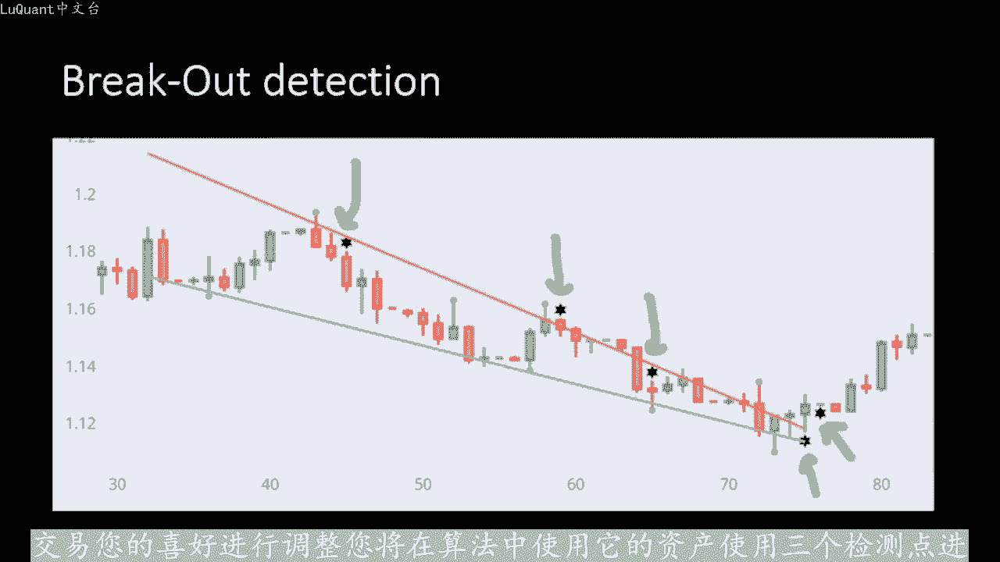

第一个是检测输轴点，这意味着显示的蜡烛相对于临近的蜡烛表现出非常高的值。然后我们检测通道。第三阶段是检测通道的突破。所以假设我们要测试是否。突破例如在这个特定的蜡烛上，让我们假设我不知道。

也许是这个也是算法要做的第一件事，回顾一定数量的背面蜡烛。这是我们可以在代码中定义为用户的东。这样我们就有了背面蜡烛，我们可以更改此参数，它可以是30或40根蜡烛，具体取决于您使用的时间范围。

我们要检查书轴点的第二件是，书轴点只是蜡烛，其中最高点高。相邻点的其他高点，因此我们可以在每侧取两。2蜡烛，并且当较低点时，我们有书轴低点蜡烛的负载，低于相邻蜡烛的其他负载。每侧各取两个。

所以这里我们有一个高书轴，这里我们有一个低书轴，这也是一个低书轴，我在这里输轴，我在这里书轴低，这里低这里的某个地方，这是一个高点。可能是这个点，所以这些点，然后我们将使用它们来进行拟合。

我们将拟合一条线，然后我们为高点拟合另一条线，这将是我们的通道。所以这。第二部分及通道检测。所以首先我们检查输轴点。第二部分我们检测通道，然后对于突破有不同的方法可以做到这一点。

我用过的方法向上突破的是。这是我正在尝试测试的当前蜡烛。因此我希望最低价仍在通道内，但收盘价和收盘价位于前一个蜡烛和当前蜡烛的通道之。我正在测试的蜡烛的开盘价和收盘价应该在通道之外。

以相反的方向突破通道下方。我们可以我们必须让上一根蜡烛的第一个条件是在通道内有上柱。这就是我们的此处的通道，收盘价应低于通道外的通道。并且我要测试的当前蜡烛的开盘价和收。架音位于通道外的同一侧。

在本例中突破下方通道。所以这是您可能想要修改的部分，可以通过多种不同的方式完成，具体取决于您想。寻找的条件具体取决于您尝试交易的模式和资产。但我认为这是一个好的开始。我们之前看到的信号已经足够好了。

所以现在让我们检查一下如何用pyython编写它，这是我们的jupiter笔记本文件。我们正在导入pas。

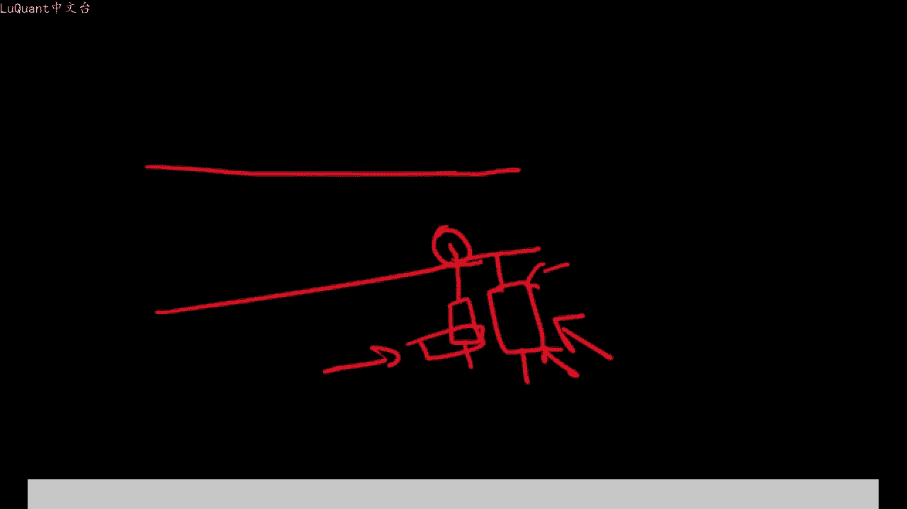

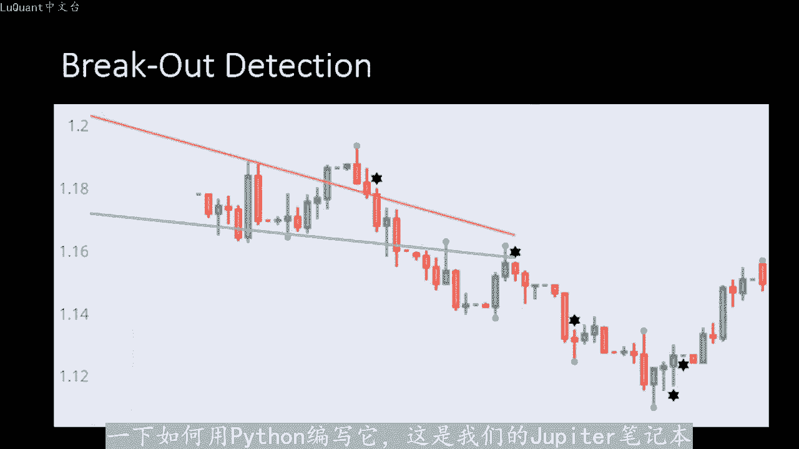

plly因为我们稍后需要这些来绘制我们的烛台，我们将使用s p test模块来拟和数轴点以检测我们的渠道。首先我们导入CSV文件，因此。2003年至2023年的欧元美元烛台每日出价。

因此我们拥有20年的数据和我们定义的第一个函数是检测蜡烛是否是书轴点或分型，它需要两个参数candle是要测试的当前蜡烛的索引，如果它是书轴window是要考虑的蜡烛数量。

当前蜡烛的左侧和右侧只是为了检查最高价是否高于其他蜡烛，并且当前蜡烛的最低价是否低于其他蜡烛。换句话说，窗口参数。左侧和右侧相邻蜡烛的数量在我们的书轴测试中要考虑当前蜡烛的右侧。因此。

如果蜡烛减去窗口低于零，则该函数的第一部分是边缘情况。因此，我们位于数据框的开头或我们位于数据框的末尾。所以我。超出了数据真大小，我们返回零，这不是书轴蜡烛。

否则我们认为两个变量数轴高点等于一个书轴低点等于2。所以当前蜡烛既是书轴高点，又是书轴低点。除非我们发现当前蜡烛的低。高于任何相邻蜡烛的低点。因此，我们取消其作为书轴低点的标签，该低点降等于0。

并且在相反的情况下，如果当前蜡烛的高点低于任何相邻蜡烛的高点，我们还会。书轴高标签，该标签现在等于0，因此可能会发生蜡烛同时是高点和低点书轴的情况。因为如果当前蜡烛的最高点高于其邻居的所有高点。

并且当前蜡烛的最低点也低于所。邻居的最低值，在这种情况下，它将保留书轴高位和书轴低位变量一和2。在这种情况下，我们将其标记为3。因此如果它是书轴高，我们返回书轴高值。所以在这种情况下，它返回。

如果它是数轴低，我们返回二，否则所有默认值返回零，所以这是一个非常好的函数。它接收蜡烛，现在我们可以蜡烛和窗口，现在我们可以将其应用到我们的数据框蜡烛应。😊。

数据框中的新列dfacepi等于我将使用应用函数，在所有索引X点名称或所有索引上使用Spit使用窗口参数的数据框蜡烛。此处等于3，轴等于一，因此，apply函数将在数据框的行上进行迭代。

现在我们可以将其绘制在图表上，但在绘制这些点之前，我们定义一个名为point position的新函数。它在参数中接受一个数据框。我们将查找SP列，它等于2，这意味着我们有一个数轴低值。

因此我们将返回我们的位置。在这种情况下，当前蜡烛最低点下方的点-时到-3点。因为我们谈论。欧元美元，所以这似乎是一个很好的经验值。当我们有标签一核时，我会说相反的方向对于书轴，因此它是一个书轴高点。

并且未来蜡烛正在下降，我们将返回一个略高。当前蜡烛最高点的位置，否则我们返回nP，而不是数字值。我们将此函数应用于我们当前的数据框在所有行上，我们将返回值存储在数据框DEF中的点位置新列。

我们将使用这些位置仅用于绘图，这就是我们将得到的。所以这些是紫色。您在这里看到的点是分型，也有人将这些分型命名为更好的可视化。我们可以增加大小。比如说。

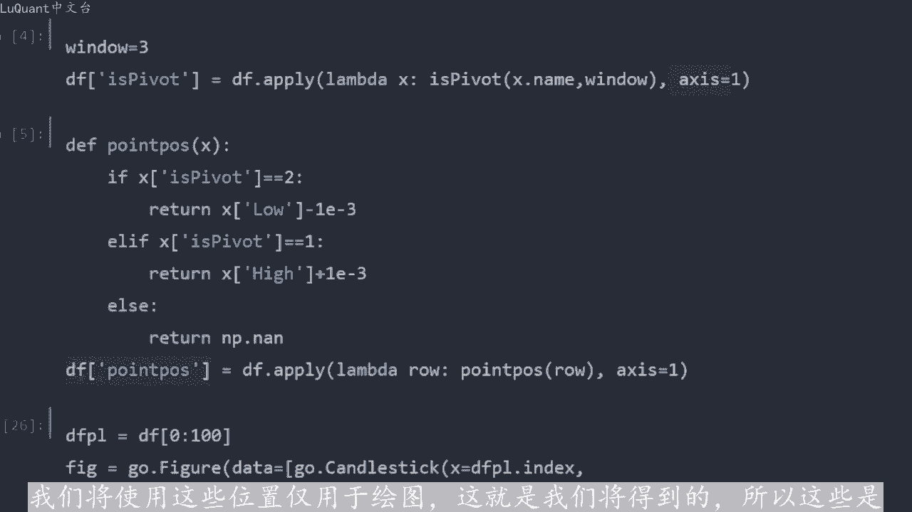

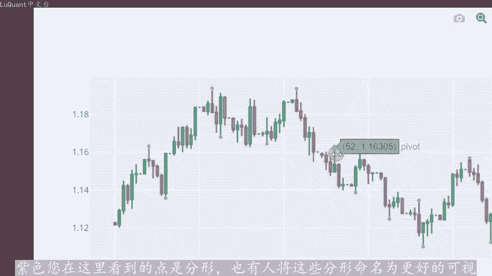

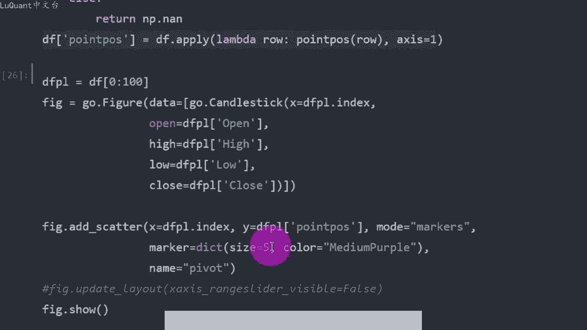

不是5个，我放的是10个，现在我们可以看到这些里拉。所以这些是我们在这里看到的点。我们可以看到该函数工作正常，我们正在正确检测书轴点，我们将这些紫色点放在我们的烛台图表上一。😊。

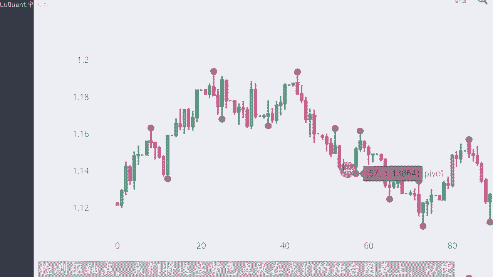

直观的看到这些点，我们可以绘制这些点的方式是使用内部的go figure candlelestick参数，我们传递开盘价、收盘价和收盘价。然后我们在图的顶部添加。想要的任何颜色的点位置以及您想要的大小。

然后我们为这些图例提供一个名称。在本历中，我只取了一部分，我们的数据框是从0到100。我们可以尝试，例如从100到2。

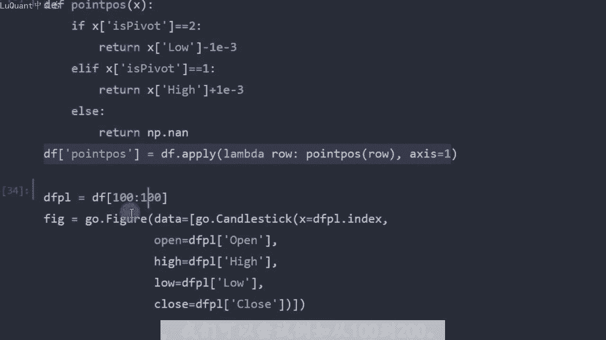

这将提供我们蜡烛的不同部分，这样您就可以看到他或多或少像我们所做的那样工作的很好，增加窗口。例如，我将当前蜡烛右侧的蜡烛和左侧的三个蜡烛进行测试，这样我们就可以如。😡。

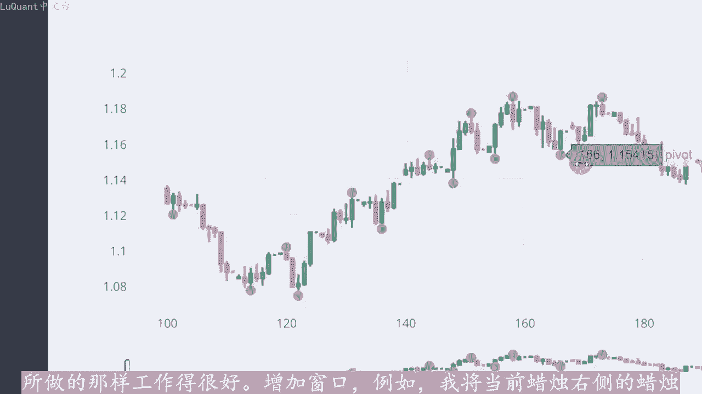

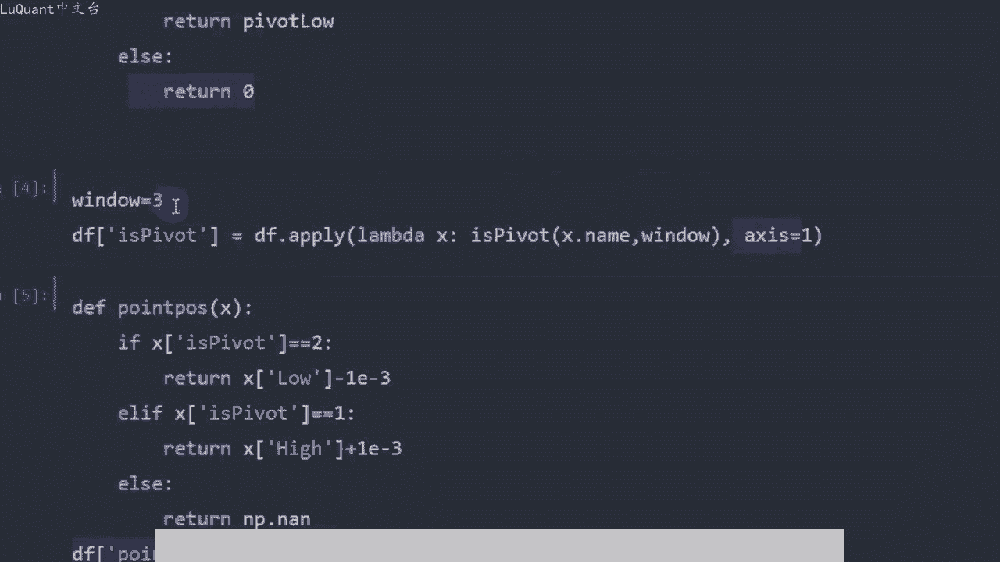

您想要更有选择性，您可以将此窗口数量添加到4或5个。但对于为了这个视频，我们将保持这种方式并继续。所以现在我们需要检测价格通道。为此，我定义了一个名为收集通道的新函数，它需。

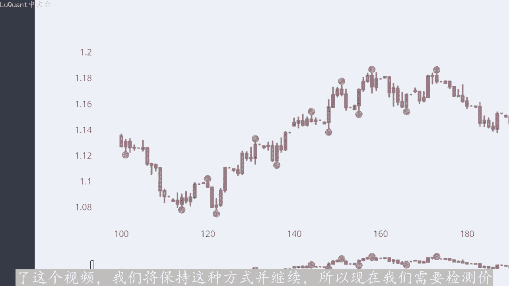

一个蜡烛所引。一些后面的蜡烛和窗口再次参数，我们定义一个本地数据框，它是我们的大数据框的一部分。我们将测试从我们感兴趣的当前蜡。到蜡烛剪去后，蜡烛剪去窗口，直到当前蜡烛剪去窗口和这部分在这里非常重要。

我可能还需要您的帮助来检查我们是否有前瞻性偏差。在这种情况。如果我们正在测试当前蜡烛指数，我们不会提前查看当前蜡烛，这一点非常重要。因为如果我们要在实际交易中使用它。

我们不知道未来这就是为什么我将本地数据框限制。😡，candle minus window并记住，在pyython中，该蜡烛candle minus窗口也被排除在本地数据框之外。

因为切片的右边缘始终被排除在数据真的切片中。因此在这种情况。

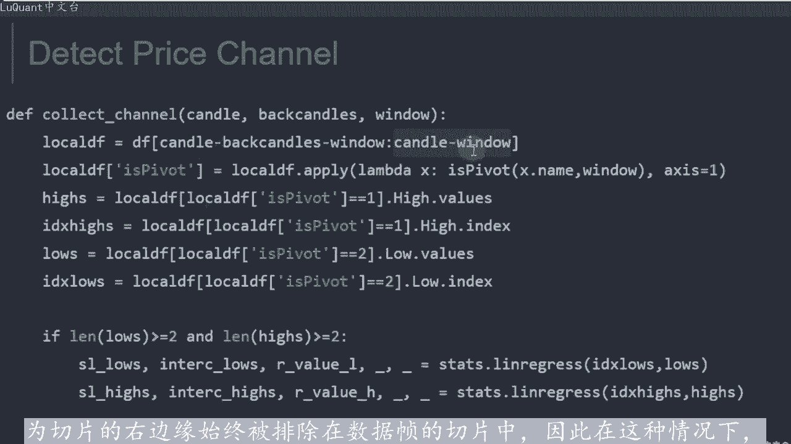

例如。如果我正在测试这个蜡烛，其缩影为160。我采用的窗口等于3，所以160是我们最后一个蜡烛，我们要查找的是150。因为157是pyython中切片排除的边缘情况。

所以我认为我们不会受到前瞻偏差的影响，只是您可能需要在评论中告诉我，您对此部分有何看法，最好有更多的人查看它并验证我们是否。

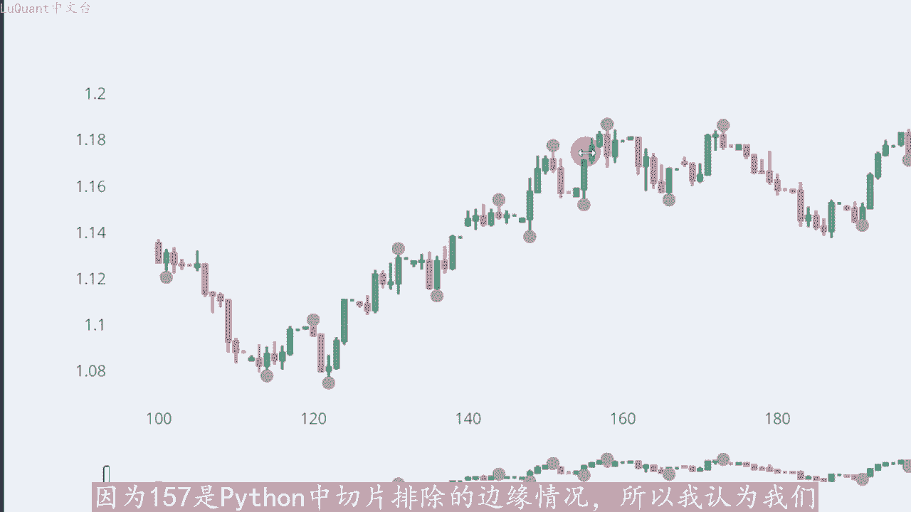

正确的方式做事。然后我们可以在本地数据框中创建一个新列，称为Spi。我们再次应用Spit函数。在这种情况下，它可能没有之所以需要，是因为。列已经在数据框架和更大的数据框架中。

但我们正在考虑未来是否要在实际交易中使用这样的函数。所以我们可能想简单的调用它，它将是每个时间从市场收集数据并计算书轴。或对于这些蜡烛，然后我们隔离高值和高值指数，竖轴的低值和低数轴指数。

如果我们有两个以上的低数。点和同时超过两个高数轴点，我们将适合一个通道。因此我们需要至少两个点、两个高点和两个低点来定义通道。您可能希望将它们更改为3乘3或4胜4个取决于。

您想要的选择性以及您交易的时间范围，然后我们将使用线性回归来拟和低点和高数轴点上的一段或一条线，这将返回负债的线。高点的斜率和这两个段的截距。如果您想让算法更具选择性，您可能需要添加一个条件。

即如果通道小于某个值或某个限制，则稍后可能会使用R。二的平方，您不会考虑到我们没有在该视频中使用它，但如果有人想在这部分上进行实验，那么该函数将返回所有这些值及低点的斜率。然。

高点的斜率截取两个段的二平方值。如果我们没有这个条件，我们就没有超过两个点作为高点和低点，我们将返回零，这基本上。这是将采用数轴的函数，或者他将使用先前的函数计算数轴，并返回当前通道的斜率和节距。

现在我们可以尝试它我随机选取了蜡烛索引，75我收回。聚柄40在窗口三中，我正在绘制蜡烛，就像我们在使用添加分散函数添加位置点或紫色书轴点之前所做的那样，现在我们再其顶部添。收集通道的结果，我们重新检测。

我们正在获取返回参数的通道。我使用高点和低点的斜率和节距来绘制另外两条线，使用ad trace分散轴，这意味。我想要放置的蜡烛的索引在通道内，Y显然等于斜率乘以X加上同时低点和高点的截距。因此这部分将。

通道的下部和通道的较高部分绘制两段线通道，是这里的一个小细节，不要再次被欺骗。当我们使用收集通道函数时，避免前瞻偏差。我们提供蜡烛。当前蜡烛所。后面蜡烛的数量和窗口，并且考虑了它们的前瞻偏差。

在收集通道函数和书轴函数中。但是当我们绘制时，我将我们达到当前蜡烛的斜率延伸，所以这并不意味。我们正在测试蜡烛的未来，这只是为了为了绘制当前蜡烛线和线段，只是为了确保我们能够直观的检测到突破。

所以让我们检查一下结果如何，这就是我们所得到的结果。所。😡。

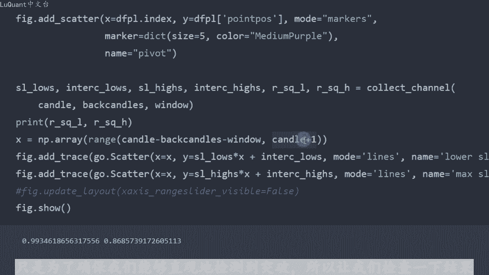

在本例中，我们采用了蜡烛图75，所以蜡烛图75就是这样。因此我们绘制蜡烛图75之前的线段。如果我们谈论的是蜡烛7。剪去窗口即312和3，并且这一点被排除在外。那么我们可以看到与低书轴拟合相关的点。

紫色点不包含在拟合中，所以这两条线使用这一点，这个书轴和这三个点进行拟合这些。使用这三个点进行拟合，所以我会错过这些，但这是为了正确性计算，它似乎并没有打扰我们的检测。此时我们可以尝试使用不同的蜡烛。

假设从0到100进行切片，我们采用蜡烛50。绘制他，所以这是附近某个地方的蜡烛五十在这里。我们有这些通道，显然，蜡烛五十位于该通道之外，因此它并不总是最佳的优。选项也不是完美的通道检测器。

但是当这些点距离拟和线R平方值很远时，您可以更加严格。我在这里打印第一部分，第一部分，然后是高部分，您可能需要添加一。

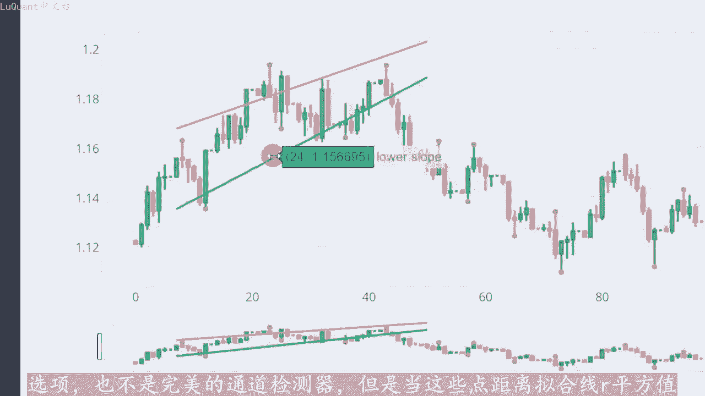

条件例如我们不考虑通道。例如，如果我们的R平方低于0。85或0。9，具体取决于限制性或选择性的程度。你想要的是，但是我们应该知道我们要添加的条件越。我们在市场上拥有的信号就越少。

为了充分利用该视频的这些信号，我不会添加此条件，我只是将这些作为指标留在这里。现在我们可以尝试检测通道的突破。因此，我定义了一个名为突破的新函。😡，它将再次使用后，蜡烛窗口参数测试当前蜡烛。

如果蜡烛减去后，蜡烛减去窗口低于0，我们返回零，这是一种边缘情况，否则我们将使用这三个参数调用收集通道函。因此，我们还需要收集通道的返回值，上段和下段的斜率和截距2值。

以防稍后需要我为前一个蜡烛定义了几个变。指数高点低点和收盘价，当前蜡烛期指数高点、低点、收盘价和开盘价，这些是我将用来检测通道的突破。因此，如果前一个高点意味着前一个蜡烛的高。高于通道段，请记住。

我们在这里使用低通道段。换句话说，前一个巨柄在通道内部和通道处有一些值，同时它收于通道下方。突破了通道下方的通道，并且当前的开盘价和收盘价都低于通道，这意味着我们有突破，并且我们预测未来的下降趋势。

因此，我们返回相反条件的另一个，如果前一个低点低。通道的最高部分，因此，前一个蜡烛的最低部分位于通道内，则前一个蜡烛的收盘价高于通道，并且当前蜡烛的开盘价和收盘价均高于通道。这意味着我们有突破。我们正。

寻找未来的上升趋势，在任何其他情况下，我们都会返回零，我们可以可视化这些突破点。所以我定义了一个名为突破点位置的新函数，就像我们之前使用过类似的函数一。😡，数州点，现在我们可以尝试我们的最终函数。

所以尽管我将蜡烛75放在蜡烛40和窗口三后面。我们只采用这两个参数，并且我们采用数据帧的一小部分。因此FPL相等低。蜡烛减去后面的蜡烛减去窗口减去5，直到蜡烛加上20。

所以我们在蜡烛索引75周围构建我们的数据框架。然后。为我的每个蜡烛创建一个名为突破的心链。新数据框FPL我们将用所有蜡烛的突破函数的结果填充它，将聚柄和窗口参数考虑在内。

或者FPL index中的蜡烛应。我们将便利FPL的所有行，这是我们数据框的一个切片。然后为了可视化突破点或突破蜡烛，我们将在DFPL切片数据框的所有这些行上使用断点位置函数。我们将使用蜡烛可视。

断点使用烛台高开低收作为前面的示例，我们还绘制书轴点，我们将断点添加为六角形。因此这。星星颜色为黑色，大小为8，我将在此处更改名称，以突破。为了给他们正确的命名，我们将使用收集通道。此时不需要它。

因为它是之前计算过。但是我在这里使用它只是为了检查配件的2平方值，以防万一我们想要将此处的蜡烛更改为A，以重新绘制与A相关的通道的芯段。无论我们使用什么蜡烛，然后我。在图中添加通道的段。

这就是我们从当前75根蜡烛得到的结果。所以这是蜡烛75，指数是75，这是通道似乎75被检测。

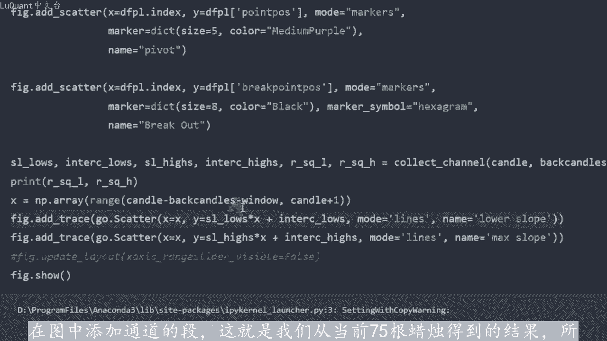

上升趋势突破，这是正确的。因为在该蜡烛之后，我们有一个上升趋势，我们还可以验证紫色部分的最低点穿过大部分较低的点。所以我们必须有一个非常高的R平方值，让我。

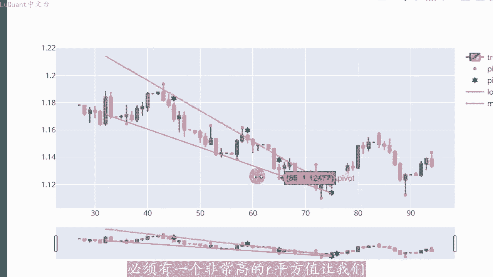

验证这一点，所以我们有0。999，这是一个很好的拟合，上面的点是0。86，所以它离该点有点远，我们可以看到这一点。所以我们有这。

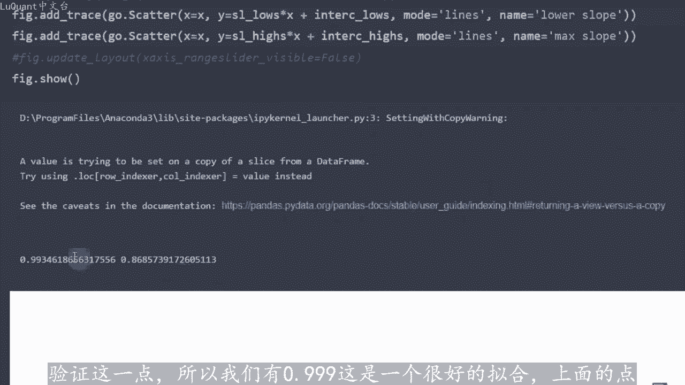

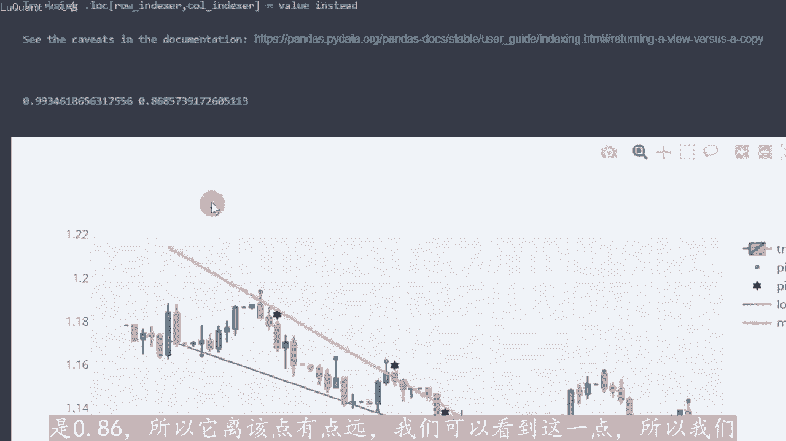

橙色线这些点是这个这个和这个我们可以直观的看到它们距离你和线有点远，我们必须记住。如果我们考虑蜡烛75，窗口是3，所以70。减三我们我们将转到72，它被排除在外。因此这里的这两个紫色点不包含在拟盒中。

这是因为我们试图避免前瞻偏差。如果我们在75蜡烛之前取蜡烛，我们必须。之后取三根蜡烛，并且这是不允许的，因为我们会在未来寻找。而这是我们实际上没有的数据。我们可以尝试寻找我们可以看到的其他星星。例如。

假设这个是45，让我们检。😡，蜡烛45你可以运行，我们可以看到我们有两个拟合0。7和1个R平方，这可能是因为我们在通道的上段只有两个点，所以我们不会查看这。

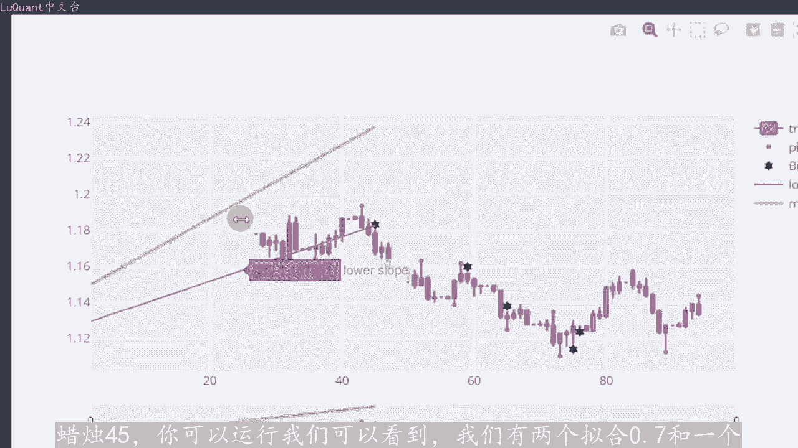

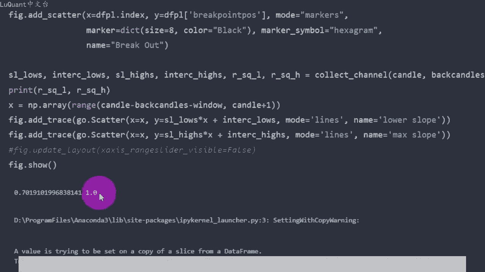

因为我们的数据中没有足够的数据，然而它看起来像是寻找下降趋势的突破，这是正确的。我们可以检查这一根蜡烛5。

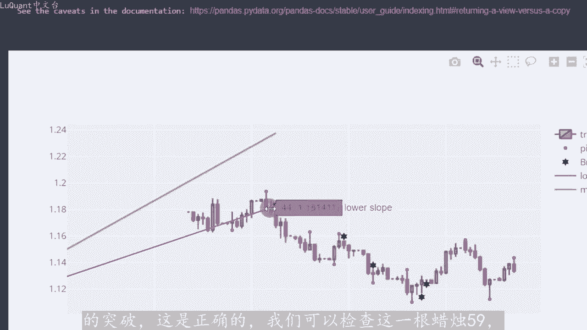

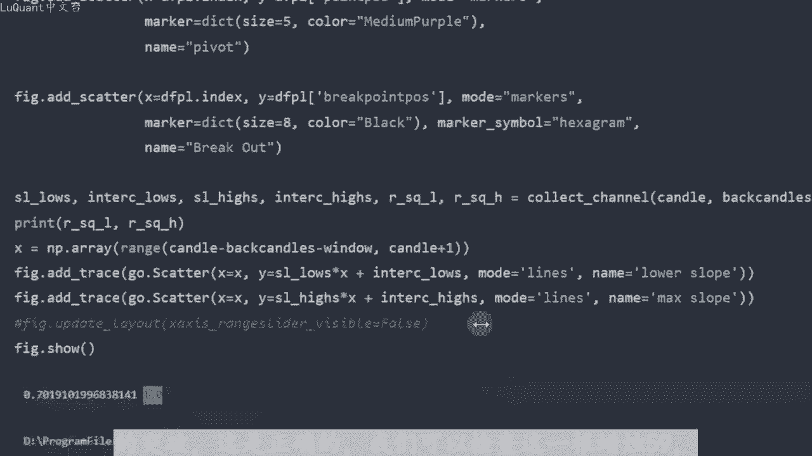

所以蜡烛59再次是突破后的回撤，它被检测为下降趋势突破。我们还可以检查蜡烛65和蜡烛65，我们有一个平行通。几乎平行通道，我们有一个突破和向下方向。因此，前一个蜡烛的高点位于通道内，收盘价位于通道外。

当前蜡烛65的开盘。和收盘价均位于通道外，这就是我要告诉你的关于这个频道的全部内容。如果您希望在完整的交易策略中进行测试，或者我们的小型交易社区可能感兴趣的任何其他相关想法，请在评论中告诉我。

直到我们下一次安全交易。下次。

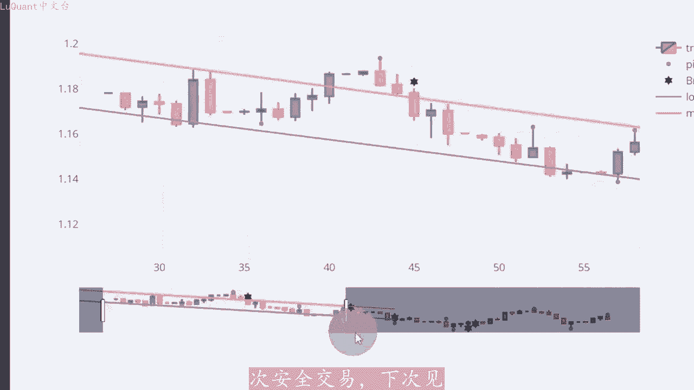