# python量化23：ChatGPT 的应用 - P1 - LuQuant - BV1Hu4m1T7rQ

大家好，欢迎观看我们在本视频中的最新实验。我将把人工智能的力量与真实人类交易者的经验进行对比。我们将探索价格通道突破策略，并挑战我们的人工智能模型充电，看看他在我们得到的情况下会如何表现。任。😊。

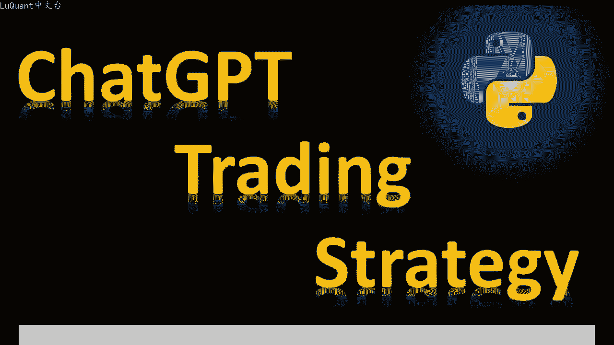

有趣的事情，我将在下一个视频中编写我自己的算法，并稍后比较性能。结果我还将与您分享我将在本视频中使用的pyython代码。您可以从下面描述中的链接下载它。如果您很好奇，并愿意尝试。扩展我们的策略。

那么请坐下来放松，让我们在谈论通道突破指标时享受这一点。我们通常有烛台图表模式，我们有分型点，这是典型的通道。突破碰巧在这里，因为在突破之后，我们预计趋势至少会在一段时间内继续朝同一方向发展。

这就是我们今天在开始艺术之前尝试让聊天GPT适合我们。无论我们今天的聊天内容是什么，GPT。在下一个视频中，以我的方式对价格通道进行同样的策略编程。您会注意到我们对程序中每个细节的差异和控制。

所以请继续关注。是的，让我们开始吧，让我们开始吧。交易主题定义价格突破，这样它就可以生成策略的定交易方法，并确定支撑和阻力的关键水平，这很好。所以当我们突破这些水平时，我们会卖出或买入。这。

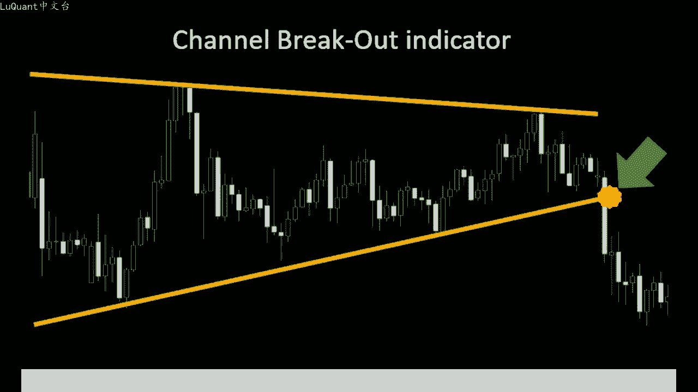

机器人就会意识到使用通道和价格突破的交易策略，这样很好，我们将尝试生成更多详细信息，将机器人放入上下文中，生成相关策略或详细。策略说明，因此，这是实施价格的分布指南。根据聊天GPT的突破策略。因此。

我们确定资产确定支撑和阻力的关键水平，使用技术分析。工具趋势线图表模式，这就是我们迄今为止一直在做的密切关注过去多次测试的水平，并观察这些水平上的价格行为是很好的设置进入和退。规则。

这是策略中最具挑战性的部分决定，您将进入交易的价格水平等等，监控资产价格变动。显然，一旦我们我们将监控这一点开仓使用止损订单来现。潜在损失如果可以的话，然后进入交易，可以管理交易。您必须监控未平仓交易。

如果价格继续按预期方向移动考虑，调整您的退出策略，以获取额外的利。聪明的是，这就是我们到目前为止在这个频道上还没有做的事情。因为我们一直专注于构建完美的指标，所以总的来说，聊天GPT的答案不是很详细。

实际上我们没。一个特定策略的任何具体技术细节，非常笼统的说，这些要点可以应用于任何策略。所以很明显，当我们开仓时，我们必须设置止损并获利了。只要他们开仓，我们就必须跟踪交易并管理交易。

所以到目前为止没有什么特别的，但让我们推送聊天GPT用pyython编写一个关于此问题的程序，您可以提供python代码或突破。价格突破让我们看看我们得到什么。

所以我们将使用pandas和技术分析库读取下划线CSV价格下划线data CSSV所以GPT假设我们有1个CS。

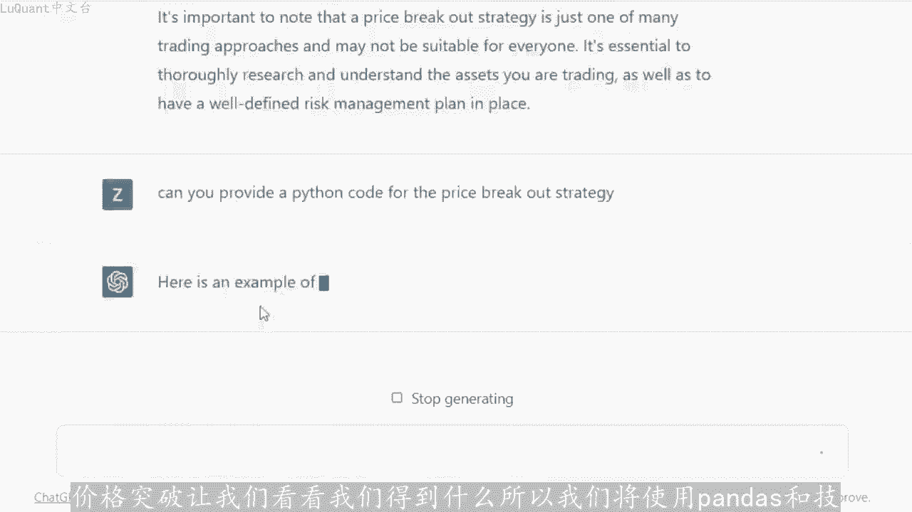

文件其中包含我们的数据，并且它正在加载这些数据。因此我们必须提供此数据或简单的替换代码中的此部分，然后它使用带有窗口的移动平均线，滚动窗口为20个蜡烛。我们有一个上轨线，中轨线。下轨线。

这与现在生成的布林线非常相似。如果价格突破布林线上轨，我们就会买入。如果价格跌破布林线下方，我们就会买入是一个单元格位。那么他将计算策略的每日回报。好吧，显然，他在最后做了一些绘图。

所以我们将尝试复制此代码，我将尝试提供CSV文件。

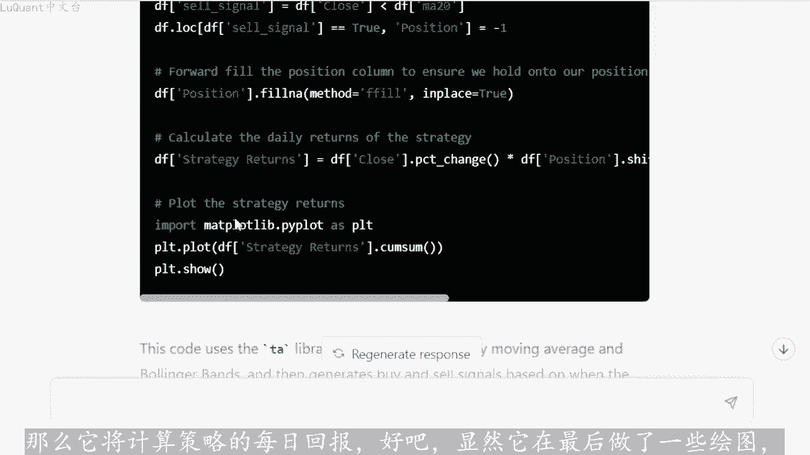

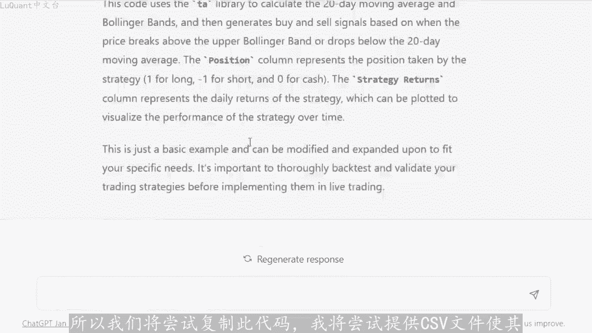

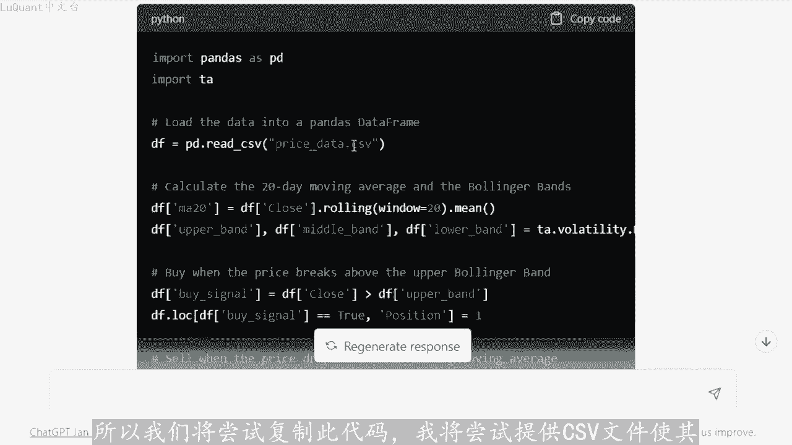

运行，并我们将看一下结果。好吧，所以我将整个代码复制并粘贴到我的jupyter笔记本文件中。我用这一行替换了读取下划线CSV价格下划线data CSSV。我有这个数据文件，CSV文件。

欧元美元2003年至2023年之间的每日烛台图，因此应该足以评。20年来的策略，但当我运行此代码时，我得到的第一件事是没有名为它的模块，这是正常的。我将尝试安装它。

所以让我们进行pypingto技术分析。可能我知道我有pandas underscore。他我不确定它是同一个包，我将尝试再次运行单元格。我们还有另一个问题。

balling bands对象没有可归音的linger。bend，并且这很烦人，因为这意味着正在编写的第一个代码不起作用，让我看看这一行，所以没有名为不。

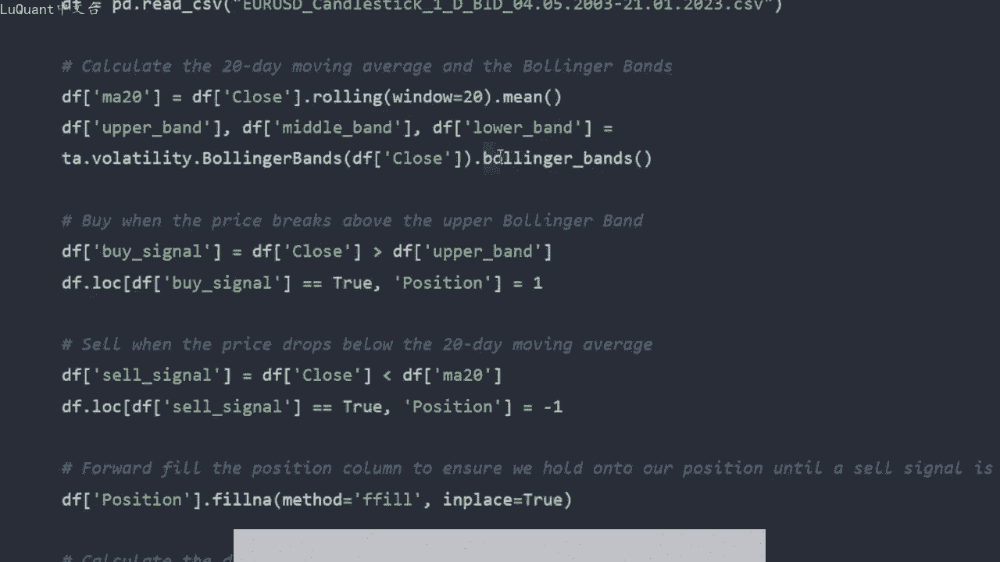

带的函数显然没问题，所以我继续检查文档，似乎有一种不同的方法可以做到这一点，这不是charpy提供的正确语法。我将在此处获取这些信息。这是正确的版本，并且我将把这些信息与我们正在尝试测试的程序合并。

因此，指标下划线布林带等于布林带收盘等于数据框关闭列窗口为20，偏差适量。

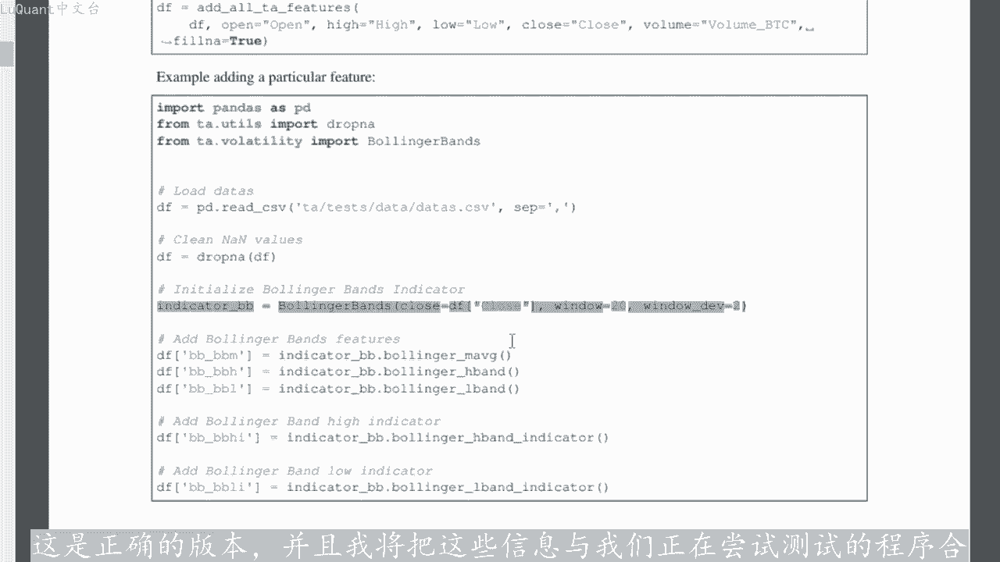

两个标准差，我们有这三列，我将根据任何聊天GPT的偏好来重命名这些列。所以中间带实际上是这个，然后我们有上轨线及高。下轨线就是这个，所以它仍然不起作用，仍然缺少一些东西。所以布林线的名称没有定义。

回到文档，我们必须从ETAvolility导入布林线函数。所以我们。

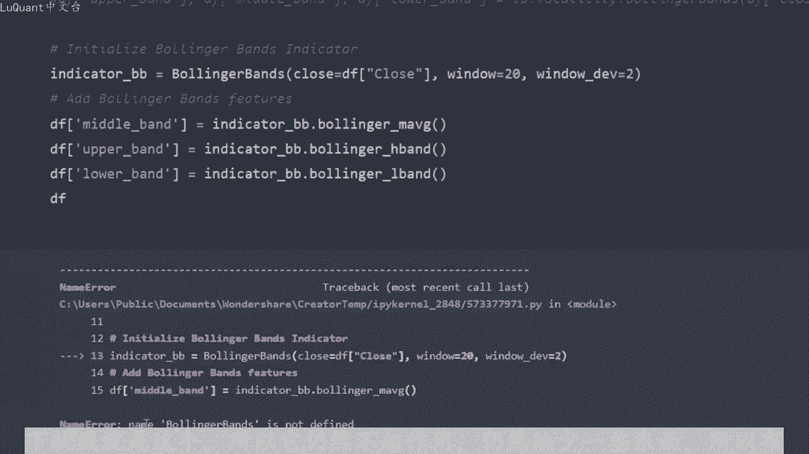

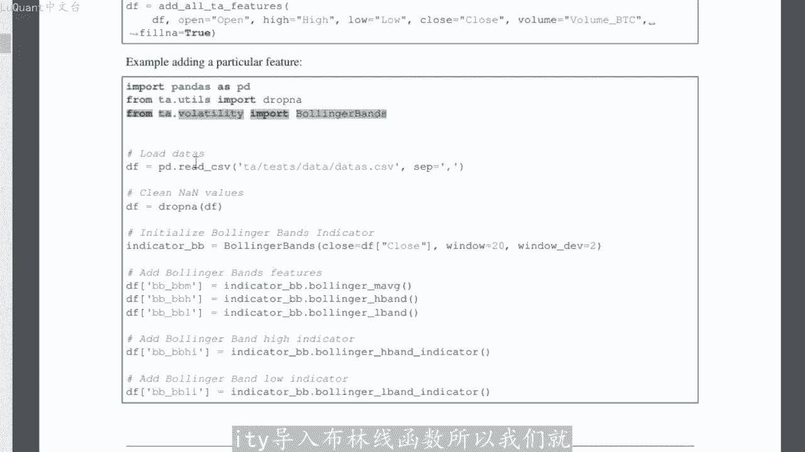

这样做让我们再次运行它。现在我们有了数据框，让我们检查一下是否有上代下代和中代，看起来到目前为止，它正在工作。所以我们有一些东西正在运行。我们。移动平均线超过20天等等。这很好。

我们知道程序到目前为止正在读取CSV文件，并提供20天移动平均线。我们可以删除这条线，我们不再需要它。然后我们现在正在计算布林带程序的另一部。我们在数据框中定义一个新的买入信号列，以防收盘价高于上弯线。

这是正确的。然后我们找到买入信号等于trie的位置或。在这种情况下，列位置等于一，这意味着它是买入头寸。而在相反的情况下，如果我们收盘价低于20天移动平均线，我们将卖出该头寸。因此。

看起来聊天GPT正在尝试仅评估买入策略。因。我们首先有买入头寸，如果我们突破上方，那么当价格跌破移动平均线时，我们就会平仓。然后我们将向前填充头寸栏。这是因为我们想持有定位我们的买。

头寸直到生成单元格信号，此时我们有策略返回列，该函数将计算每行与其前一行的前一。邻居之间收盘价变化的百分比，我们将相乘，这是我们的位置。所以如果位置为一，我们将这个百分比乘以一，因此它是正值。

如果位置为负，我们可以将变化的百分比乘以负。这样我们就可以根据以下公式得到正百分比和负百分比。在我们的交易中，我们将对所有这些进行求和，以获得我们交易的总体结果。这就是为什么我们此时要进行累计求和。

如果我们绘制这些。😡。

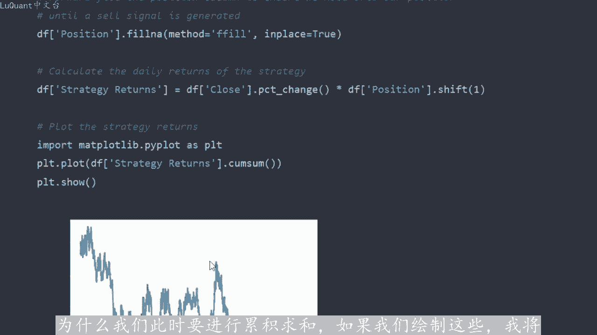

运行所有这些是我们的净值或百分比。所以我们从零开始，它会爬升一点，然后我们会使用char gT为我们提供的内容下降。现在我们可以尝试更具体的使用了。

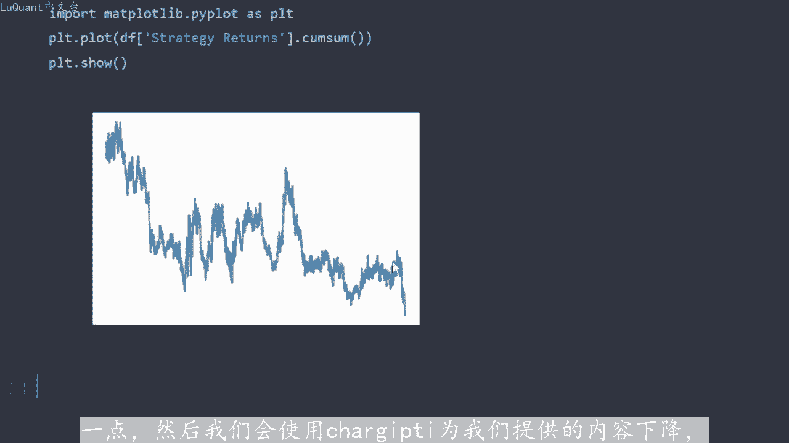

GPT并尝试提供其他信息来实现这一点策略，更有价值，让我们尝试要求它在这种情况下使用分型，你可以重新生成python代码。但是。

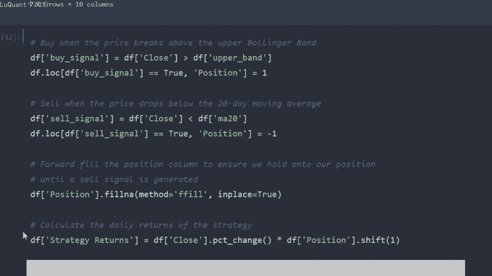

分行点和回归，而不是布灵线好吧。所以它开始生成我们的新版本，它使用了技术，这很有趣。实际上这现。

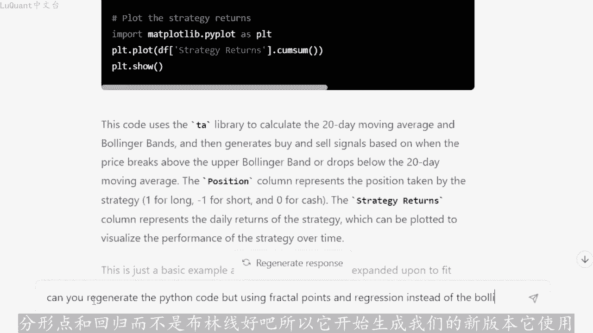

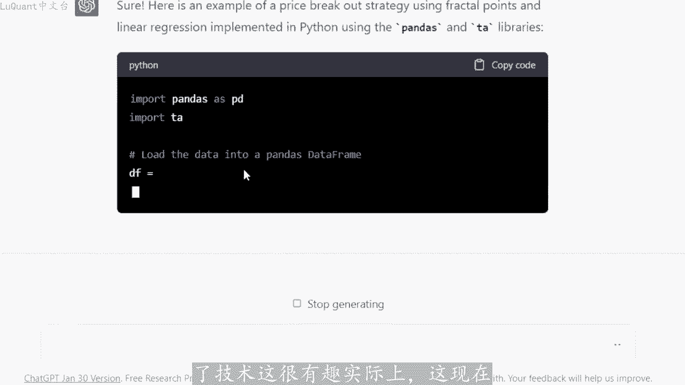

开始变得更有趣。所以它使用技术分析胞来计算分型，这是我正在手动使用的东西。所以我手动编码这些部分，所以我们有高分型和低分。它正在产生购买当价格突破分行高点时的仓位，在这一点上有点意义。但我有不同的想法。

就像我在买入和签署仓位之前有一个回归。无论如何，我们有一。卖出仓位。当收盘价低于时，卖出信号分行低点，再次它将向前填充位置列。此时，它引入了简单线性回归，让我们简。它是否可能是趋势。

所以他点趋势点线性回归，然后使用回归线函数。我假设它在技术分析中，所以我对这个套餐不太熟悉，我们将在一段时间尝试这个，然后。价格跌至回归线以下时，我们将出售。如果收盘价低于回归线。

这种情况下它会生成一个单元格信号，因此它将等于复信号。所以现在它让我感到困惑。因为我们有两个卖。信号现在如果我们低于分行低点也低于回归线，我们将生成脉出信号。

但前项填充方法是在第一个细胞信号之后进行医学应用。无论如何，它都没。考虑到这个特定的销售信号，让我们相信charked并看看它得出了什么。所以这是策略回报，然后是累计总和。就像我们要复制这部分之前一样。

我们将把它带到我们的笔记本上进行测。

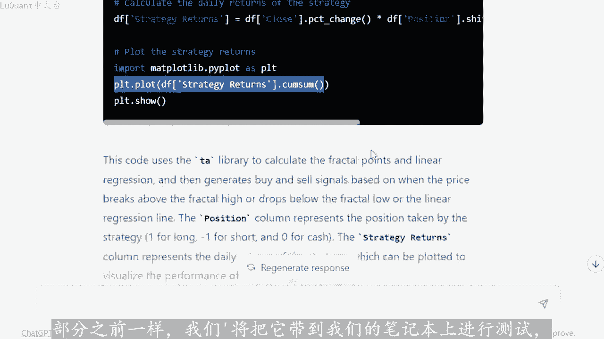

所以我们新的更新程序看起来像这样，我们正在导入CSV文件，然后是分型。我们正在计算分型、购买信号等等。所以我要需。这部分来运行这个。所以我们有第一个错误，我们在它中没有属性分型。

所以我要去谷歌这个并返回我不确。😡。

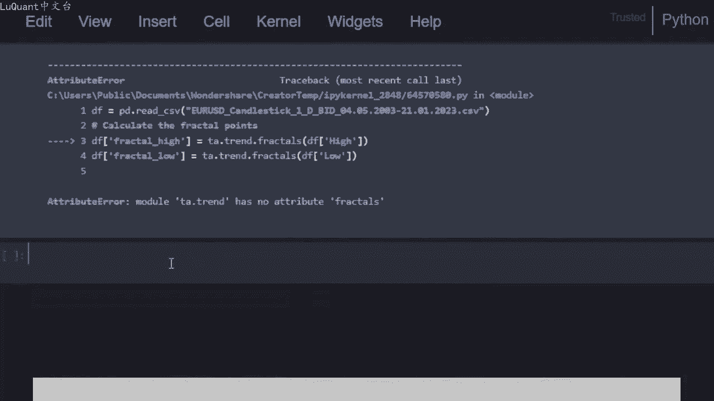

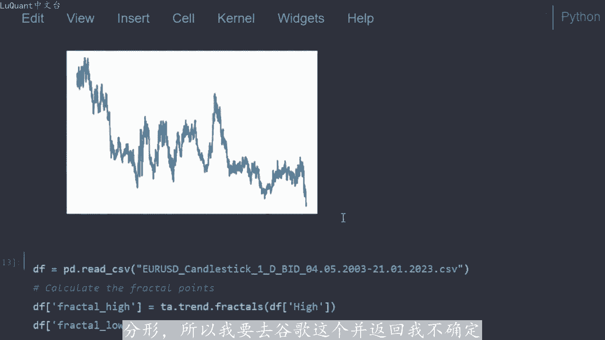

技术分析库的文档中是否有任何分型搜索了一段时间，但我似乎找不到任何函数或任何称为分型的变量，但可能有使用不同的称为技术分析python的包的不同解决方。

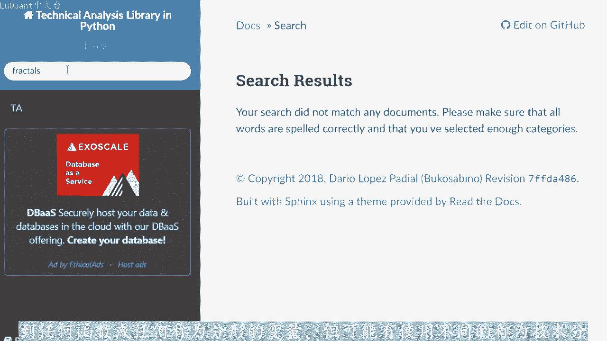

所以我将要求chat仅使用不同的库。所以你可以使用EP模块生成相同的解决方案。好吧，所以它导入了正确的库，在这种情况下，其余部分将几乎相同。我只是采取这一行，我们将看看它是否纠正我们的问题。

所以导入技术分析pyython作为它我。

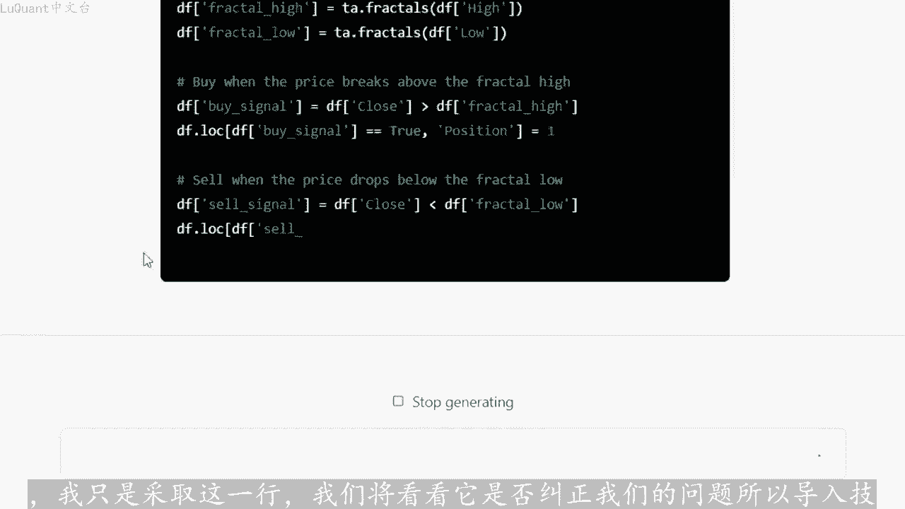

再次加载文件，这些是分型，这些可能会被纠正。所以他点分型，让我们看看它是否有效，所以没有名为TAPI的模块。显然我没有套我安装它。可以了，所以它的工作方式是我们将从TAPI导入到I指标。

然后我们将使用此方法，将指标应用到我们的数据框，这样I就。我们要使用的指标来提供我们的数据框，然后我们调用与我们想要添加到数据框的技术指标相关的函数，我将把它用于分型。例如分型将是列名称。比方。

分型我不知道他将如何做到这一点，他应该不止一列，因为我们会有高分型和低分型，所以他们的手册中有一个函数，这里是第13点函数，我们有果糖，我要检查一下是什么这个函数的菜。

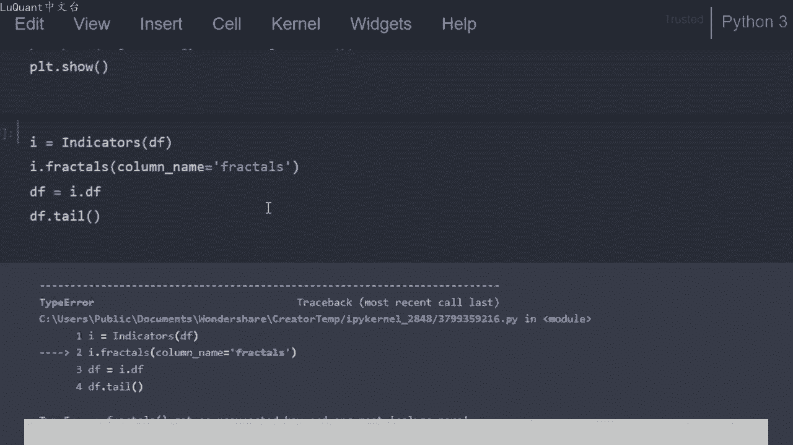

因为我们一直假设它需要为两列列出两个名称，因为我们有高分型和低分型，让我们将他们带入我们的代码中并检查它是如何工作的。现在应该没问题了，所以我们有分型都。

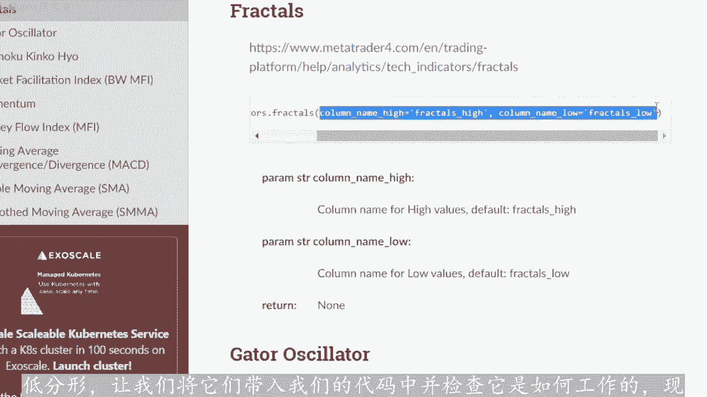

行敌我不知道这个函数如何工作的任何细节，我通常检查一根蜡烛周围的邻居蜡烛，您可以拿两根或三根相邻的蜡烛，看看最高或最低价格是否出现在特定蜡烛内。在这种情况下，它是分。

蜡烛我不知道您使用的这个函数的比较范围或比较窗口，但我们现在要使用它，因为聊天GPT已经提出了这种方法，所以我将采用我们单元格的这一部分，我们将。内容替换这部分，所以这是我们计算分型点的地方。

我认为到目前为止，我们仍然有一些问题，分型高是一个关键错误式的。因。存在差异，所以我们使用分型高友了S让我们使用。现在它正在工作。所以这个单元正在工作，我们有一个带有聊天GPT新命题的数据框。

我们可以使用这个单元测试这个策略。所以现。

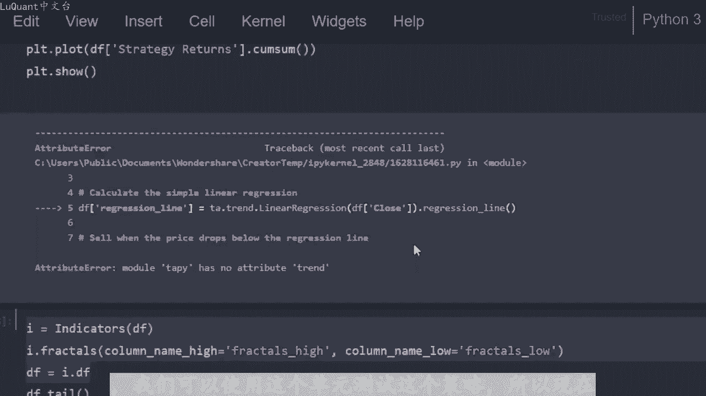

它将是回归线计算，看起来在新版本，他用这一行替换了这一行，所以它看起来更简单，让我们看看它是否有效，我将复制并粘贴它。我们仍然有一个问题，所以现。

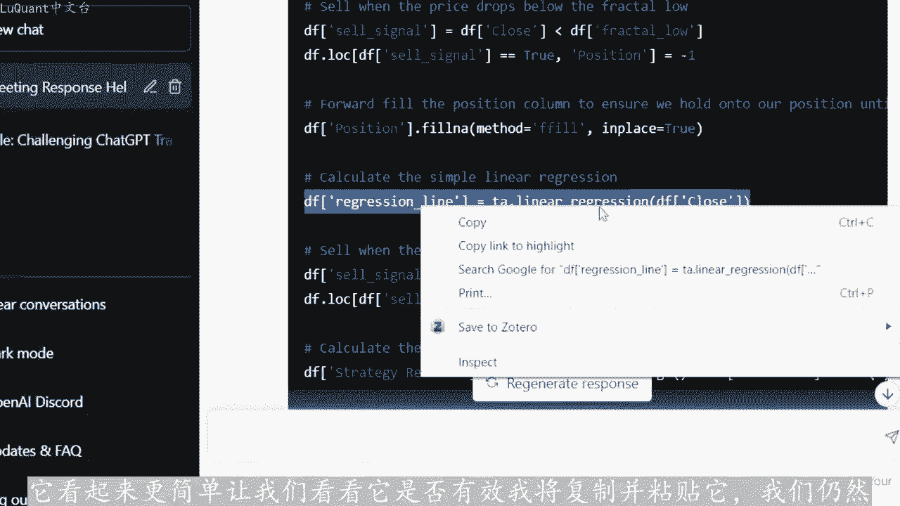

下划线回归函数不存在，完全我们不能使用它是chargi提供的方式。因此，我们最终可以在这种情况下使用不同的库。因为PAP some技术分。

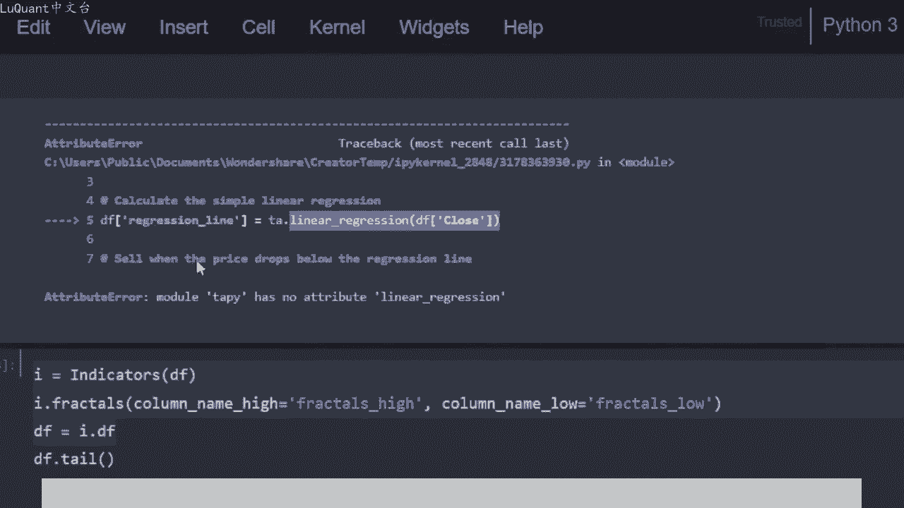

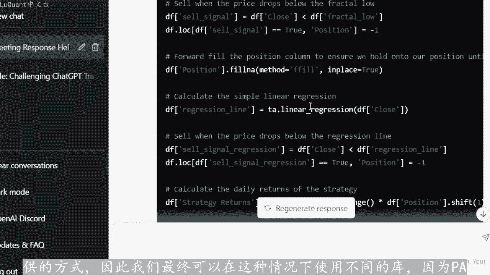

python库似乎没有回归线函数，但我们可以使用sychic learn或npy的pofi或任何统计库，在pyython中做到这一点是的，困扰我的事，我不知道我们要在哪些点以。

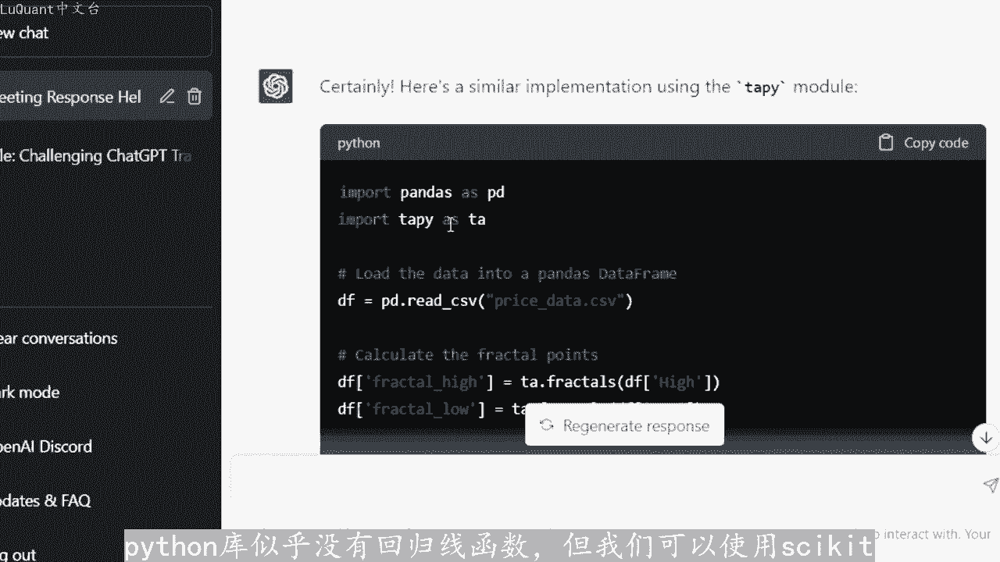

窗口范围内进行回归线，所以这是一个回归线列，已添加到我们的数据框架。我们正在使用任何函数从收。价创建回归线，但似乎charGT正在尝试你和所有之前的收盘价，也许还考虑到未来价格。在这种情况下。

这是一种前瞻性偏差一条线。我不明白这对策略有何帮。并且在回归线生成的这个特定负信号之前，应用了头寸列的前项填充线。我认为这里的整个部分没有对我来说，这没有意义。只。为了让我们的代码正常工作。

删除这部分并尝试运行代码，然后我们得出结论，这很有趣。在第一部分中，我们有大约2000天的时间在攀升作为一种测。

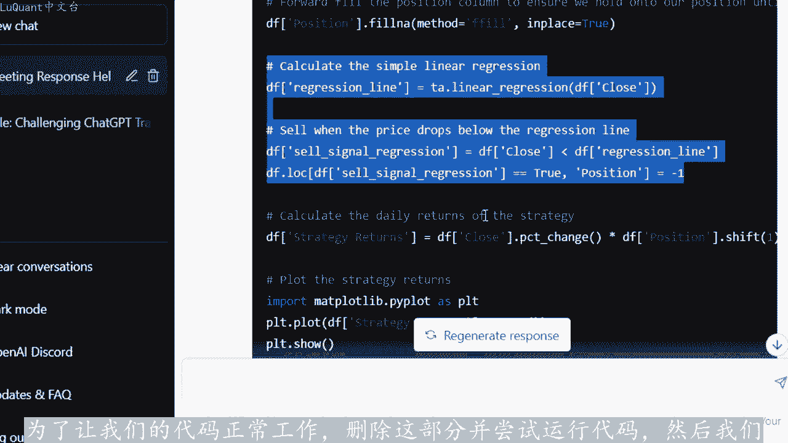

然后它会下跌。请记住，在这种类型的回溯测试中，它并不真正可靠。我们没有采取任何止盈止损比率，我们没有考虑任何杠杆，没有佣金，没有点差费用，它缺乏很多细节。所。😡。

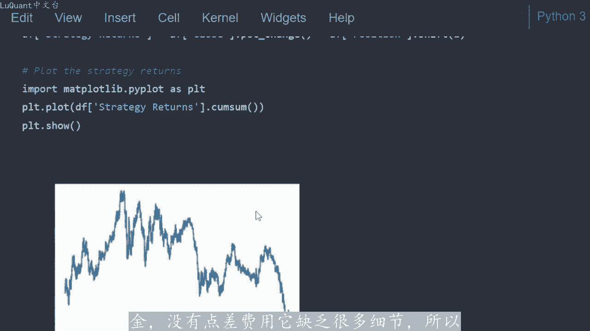

我们可以看到，即使对于当今最好的人工智能模型之一来说，构建正确的交易策略也是具有挑战性的。而且此时它似乎混合了来自不同库的函数。因此它使用了一个函数，例如分。我一开始不知道来自不同的库。

所以我们使用EA库，我们必须去google分行函数。它来自哪里？考虑到这一点，我们必须导入并安装一个新。需要记住的重要一点是charGT接受的培训内容截至2021年。

因此它实际上并没有过去几年最近开发的最新python库。对于任何其他信息，当然包括交易也是如。所以如果您正在寻找过去几年在网上发布的内容。

chargeap目前可能还没有意识到它是一个用于编写文本的出色工具。而且我知道我的许多同事和朋友都非常喜欢在不同领域使用chat取得了成功。但是我坚。我最初的想法，他对于交易策略来说并不那么强大。😡。

而且他甚至无法接近由真人开发的任何交易系统。在下一个视频中，我将对其进行编程，以我的方式制定价格通道突破策略。您会注意。我们对程序中每个细节的差异和控制，因此请继续关注，直道我们下一次安全交易，下次再。

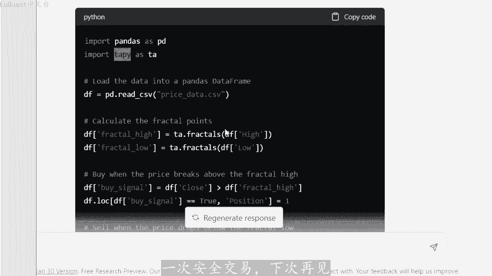

