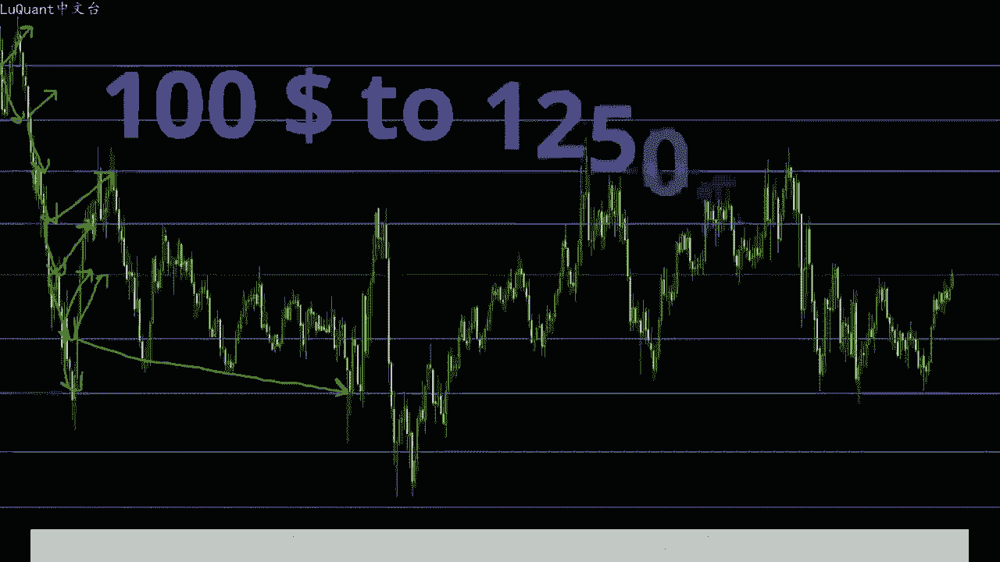
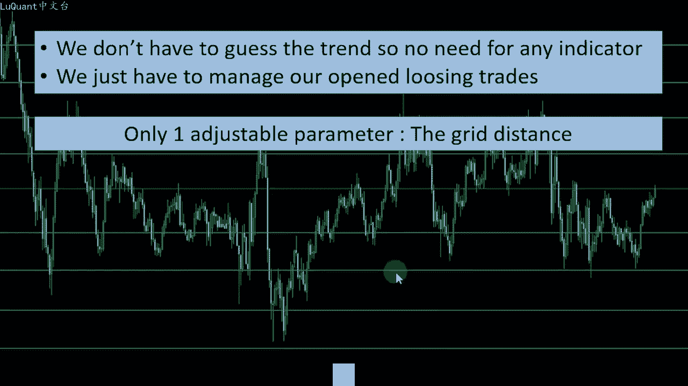
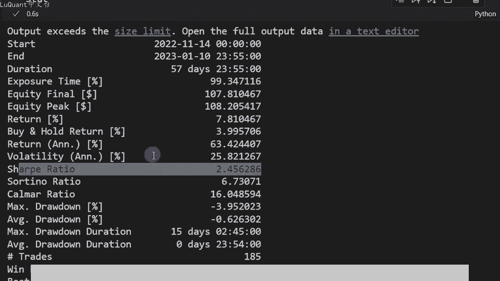
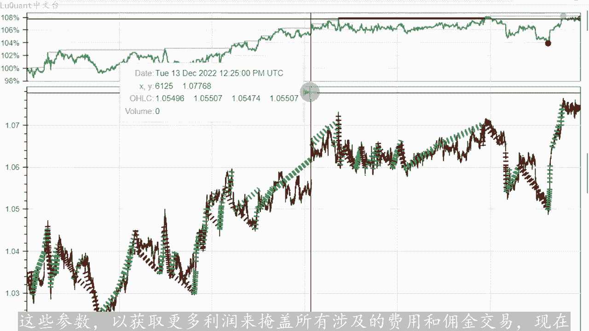
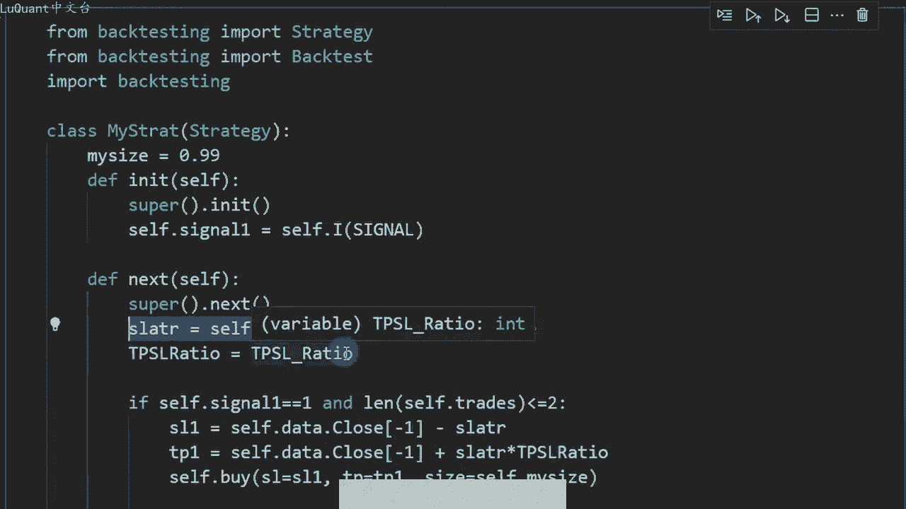
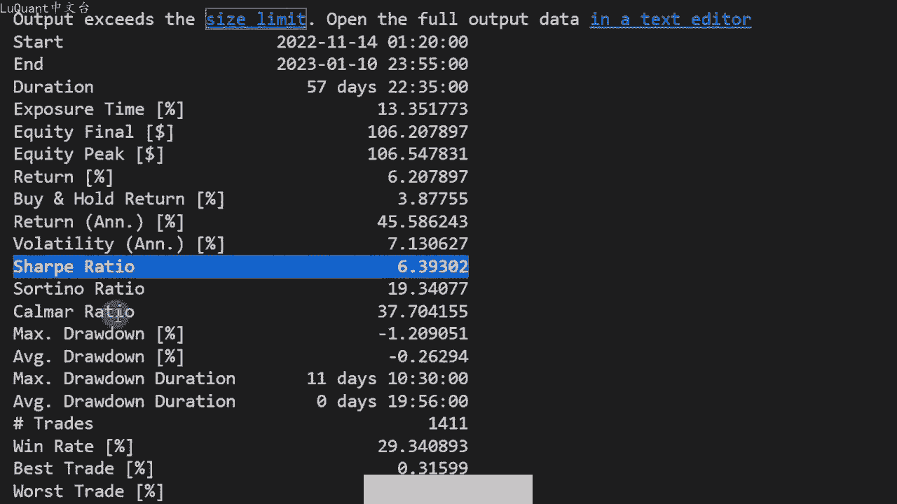
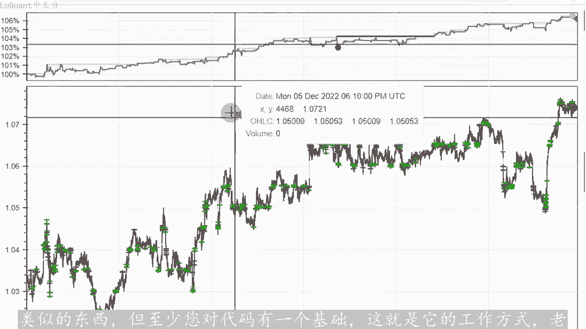
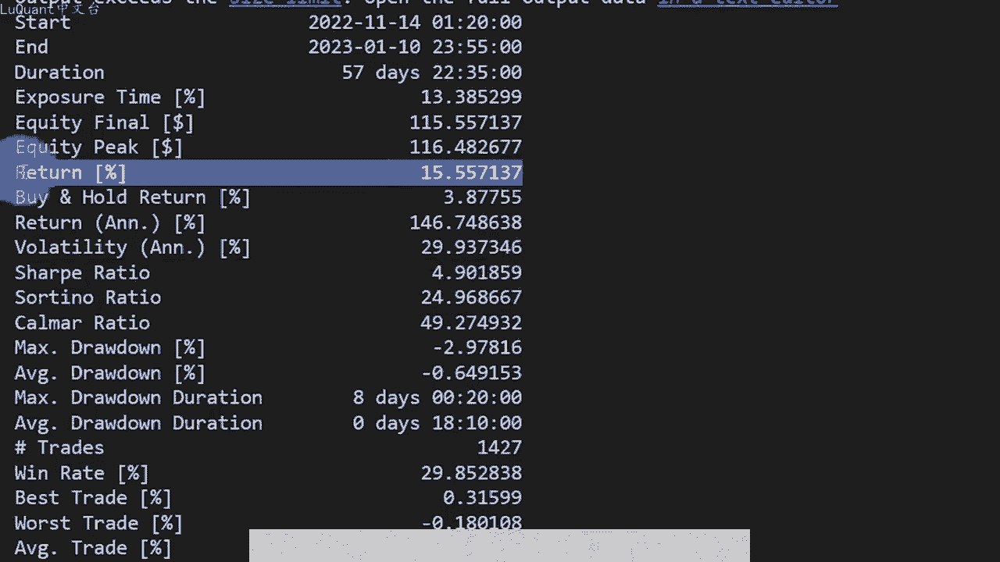
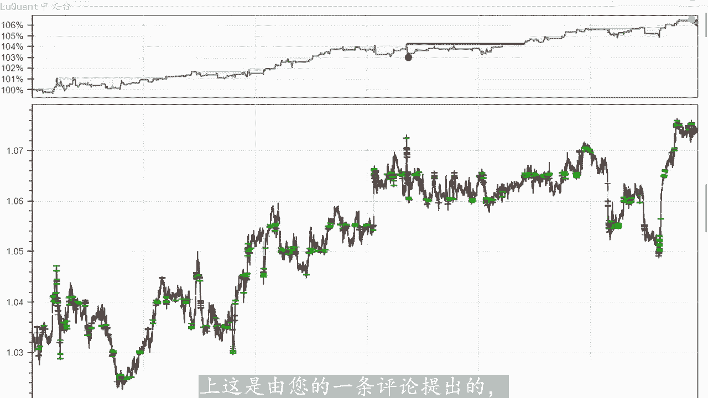
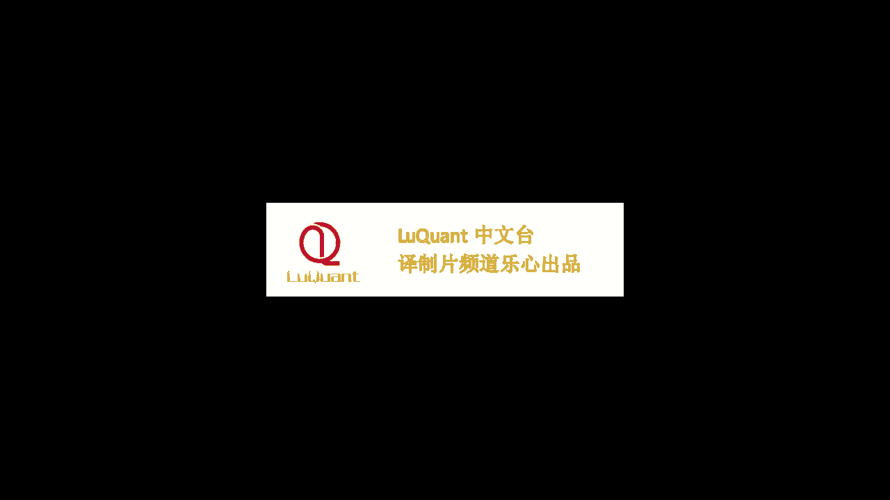

# python量化25：对冲策略 - P1 - LuQuant - BV1Nt421G75m

大家好，今天我们正在测试网格交易策略，这是一种非常简单的方法，不需要任何技术指标来检查趋势。因此，我们不需要提前猜测趋势。因为我们同时进行两个方向的交易算法交易的一个很好的候选。

使用pyython语言进行的回溯测试显示，使用5分钟时间范围的两个月的数据净止稳步增长。它有一组令人惊讶的测试比率，锐丽比率得分几乎为5。7。如果您是对编码部分感兴趣，您可。

从下面描述中的链接下载jupiter笔记本文件。10年前，当我开始将交易作为一种爱好时，我记得在使用该系统进行交易的6周内，我的每分账户将100变成了1250左。

这可能是初学者的运气。但无论如何，我们今天要测试这一点，其想法是在我们的图标顶部创建一个价值网格。每次价格穿过网格线时，我们都会建立多头和空头头寸同时。应设置在每个开仓头寸的下一个网格线上。例如。

如果我们采用此图表，我们将在此处开设第一对多头头寸和空头头寸。然后在下一个网格级别，我们平调或。头寸，然后我们另外开立两个头寸，一个多头，一个空头头寸。每次我们穿过网格线时都会有一笔交易被平仓。

另外两笔交易将被开仓，以此类推，所以一些交易将会立即平仓其他一些。必须等待一段时间才能达到止盈值。我知道您在想什么，这些在我们的网格边缘打开的亏损交易，它可能发生在网格的上边缘，并且在较低的边缘。

其中一。头寸永远不会达到起止盈值，这是该特定策略的困难，有不同的处理方法。一些交易者可能会在交易日结束时的午夜关闭剩余的交易。另一种选择。简单的计算，我们是否处于每6个小时一次的总体利润情况。

然后关闭所有内容并使用新网格重新开始。对此没有单一的解决方案，因为它将取决于我们使用的其他参数，例如时间范。允许的最大平行交易数量以及这些线之间的网格距离等等。

我今天在编码部分要应用的一种方法是使用ATR距离为每笔交易使用止损。可能不是最好的方法，但我们将从这个开始，然后我们可以修改代码，您可以下载它，修改它并尝试什么是您的策略的最佳方案。

这个系统可能在很多情况下工作的原因，这是因为它利用。😊，市场的噪音，因此，只要市场围绕该网格震荡，它就会以多头和空头头寸等方式切断我们的止盈和未平仓头寸。理论上，该系统在较低的位置上运行最。

因为这是噪音进入我们利润的地方，我们正在寻找一个噪音市场，这意味着更多的价格波动。因此，我们预计我们的利润会以这种方式增加，有两个原因使系统具有吸引力。首先我们不。猜测趋势，所以不需要任何指标。

因为无论如何，我们没有遵循任何趋势。在这种情况下，我们只是在两个方向上开仓。第二个原因是我们只需要管理我们没有的未平仓亏损交易，做其他事情。还有一个好。😡，就是我们只需要一个可调整的参数，即网格距离。

这使得该策略更容易编码。显然，我们将选择一个时间范围，但就策略而言，我们只需要一个参数，我们要调整我们在这里看到的网格距离或网格线之间的距。好吧，让我们用pyython编写它并应用回测。

所以这是我们的jupyter笔记本文件。我们正在导入wifi以下，再导入pas和pas技术分析的数据。只是因为我们。

使用ATR，我正在下载开始日期和结束日期这两个日期之间的美元数据。并且我为此使用5分钟时间范围测试，然后我打印我的数据框，只是为了确保所有内容都正确下。开盘价、高低收盘价和调整后的收盘价。

然后我将定义我们将在该程序中使用的三个变量。我们已经讨论过的网格距离。所以现在我对欧元美元使用0。005。记住，这将取决于您使用的时间范围以及您正在交易的资产。只因止损比率I我使用1。55。

但现在让我们将其保留为宜，作为第一次试验，网格的中间价格意味着我的网格将围绕平。价格1。065构建，这又取决于您正在交易的资产。在这里对于欧元美元，这是一个很好的中间价格。可以。

过去30天或60天左右的资产平均价格一样进行计算。然后我创建一个函数define生成我的网格，它将需要这三个值，中间价格良好的距离和网格范围网格范围基本上是最小值和最大。

我想将我的价格范围划分为一个网格，这很容易在pyython中使用nP完成。所以我使用A范围中间价格减去网格范围和中间价格加上网格范围之间的函数。网格距离将定义网格线之间的距离，所以调用这个函数。

我将称之为生成下划线breread，我将提供三个参数。此处的网格范围等于0。1，因此我将拥有一个范。为1。065加0。1的网格，即1。165和1。065减0。10。965。因此。一旦我们生成了网格。

将打印这些值以确保我的函数运行良好，这是将生成我的网格的值数组。所以这些是线或线的位置，我们几分钟前在演示中看到过，正如预期的那样。它。范围从0。965到1。165，然后我们将生成信号。

所以首先我创建一个等于零的信号列表。这意味着没有相同长度的信号。换句话说，对于我们数。框中的镁的蜡烛信号暂时等于0，这意味着我们不会执行多头或空头头寸。然后我们将便利数据框中的所有蜡烛。

我们将检查这些蜡烛是。在长方向或短方向两个方向上穿过网格的任何线，那么该特定蜡烛的信号等于一，这意味着我们正在穿过网格的一条线，这就是我们。同时执行一个空投模拟头寸，只是为了确保我的推理正常工作。

我将打印蜡烛或信号等于一的型。所以他现在工作的很好，我我只是要复制我的数据。以防万一您想要拍摄数据框的一部分，并测试部分数据，而不是整个数据框。但无论如何，在这种情况下，我们只会复制整个数据框数据框。

我正在定义一个信号函数，它返回每行的信号列。然后我们可以将ATR计算为新数据框中的新列。如您所见，我们提供了收盘价的最高价和最低价长度等于16。所以我们使用16作为ATR的周期，在这里我们可以使用。

测包来回测我们的策略，这是我们刚刚定义的函数的信号。因此它将存储当前的信号型放入self signal一中，变量称为信号一。对于每个。信号的蜡烛如果信号等于一，我们将执行买入和卖出头寸。

但首先我们要检查是否有任何未平仓交易，这是我们可以修改的参数。因此。如果我已经。两个未平仓交易，我仍然允许另外两个交易，最大最小值应该有4个交易。在这种情况下同时打开。我们可以增加或减少此交易。

根据我们的偏好。但如果我们增加它，就会增加我们的风险。我们减少它就会降低我们的风险和交易。所以为了打开这些交易，我将定义止损变量。目前我我只尝试收盘价减去sat，我们没有使用ATR。

但我们仅使用网格距离做。止损值止盈将等于收盘价，加上AT2乘以止盈止损比率，当前比率等于一止损AT2等于网格距离。所以我只是只。我们在本视频开头介绍的系统，这是针对多头头寸的。对于空头头寸。

我们将使用相同的策略，相同的方法只是在相反的方向，我们的保证金是1比2，其中明星从100现金开始。可以运行这个我们得到7。8%的回报，这几乎是在两个月057天内，他击败了买入并持有的回报和百分比。

对于那些遵循这些比率来评估。策略的人来说，下普比率为2。45，我们也可以绘制回报或净值。因为我们可以看到净值是增加它达到最大值的8%。我们在这里有一个回撤，然后它再次增加。所以总的来说，我没有调。😊。

任何参数我只是将所有内容放入代码中，这是我在几个月内第一次运行，它看起来它是有利可图的。请记住，我们在这些交易中不包含任何佣金或任何费用。因此您很可能希望调。😡。

这些参数以获取更多利润来掩盖所有涉及的费用和佣金交易。现在有趣的部分让我们用ATR的值替换我们正在使用的止损的网格距离。该值考虑了通。

交易时市场的波动性，如果我们运行它，我们我们将获得6。2%的回报，但比率为6。39，这就是它开始变得有趣的地方。所以如果我们会知。

只是为了可视化我们所得到的，这就是我们得到的回报的百分比是真的不是很大，但权益曲线看起来好多了。在这种情况下，我们的回撤期更少，而且它在不断增加看起。😡。

他与ATR配合的很好，所以我再一次没有真正花费超过15分钟的时间来优化或尝试。你可能想要的花一两天时间或考虑如何退出策略。也许您想使用RSSI。类似的东西，但至少您对代码有一个基础，这就是他的工作方式。

老实说，它可能是我最简单的程序。如果您在交易中取得过如此积极的成果，您可能还想跟。😡。

保证金因为我们在交易中总是采用杠杆，这就是您可以进一步将回报率提高到15%的方法，但它会再次影响您的锐利比率。现在为4。9这个策略。但无论如何，它会增。

你的回报，但会增加你的风险。这就是我要告诉你的关于今天的交易系统的所有内容。我希望你们喜欢他。如果是这样，请支持频道发表评论，提供想法，与我们分享想法。我们是总是愿意接受这些。

实际上这是由您的一条评论提出。😡。

直到我们下一次安全交易，下次再。

