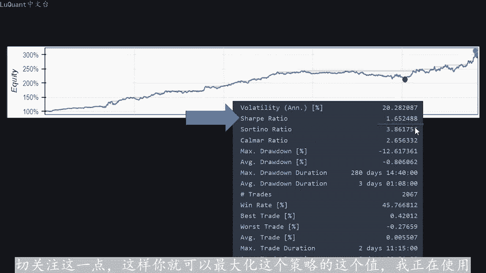
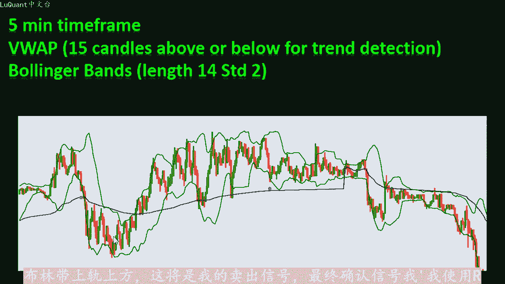
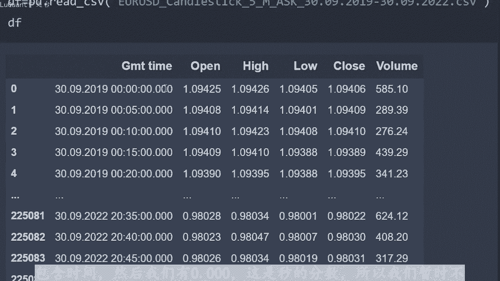
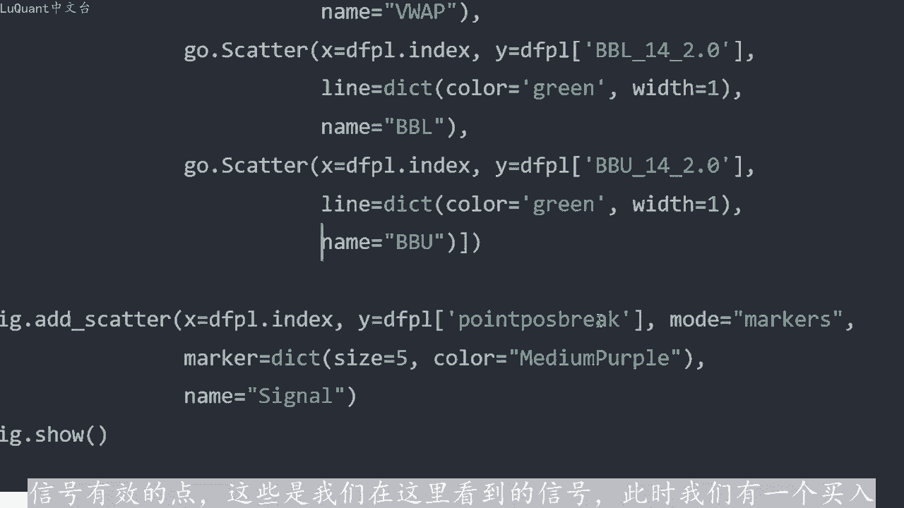
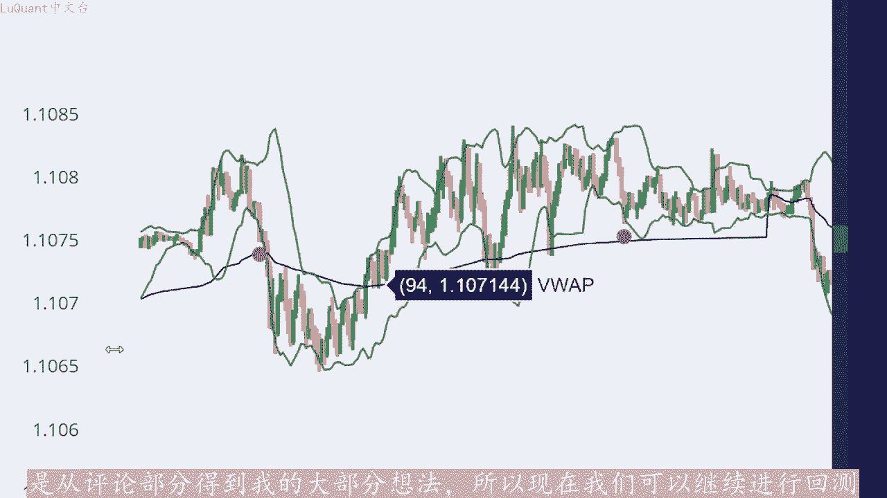
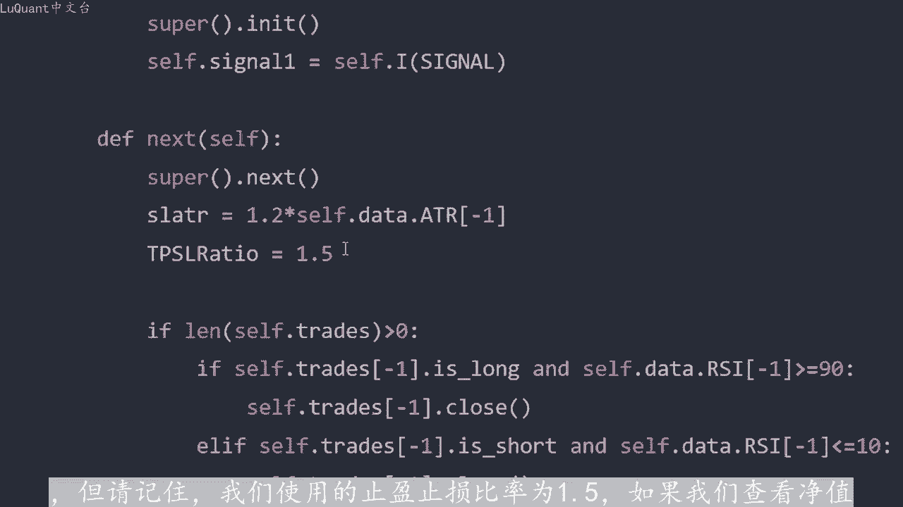
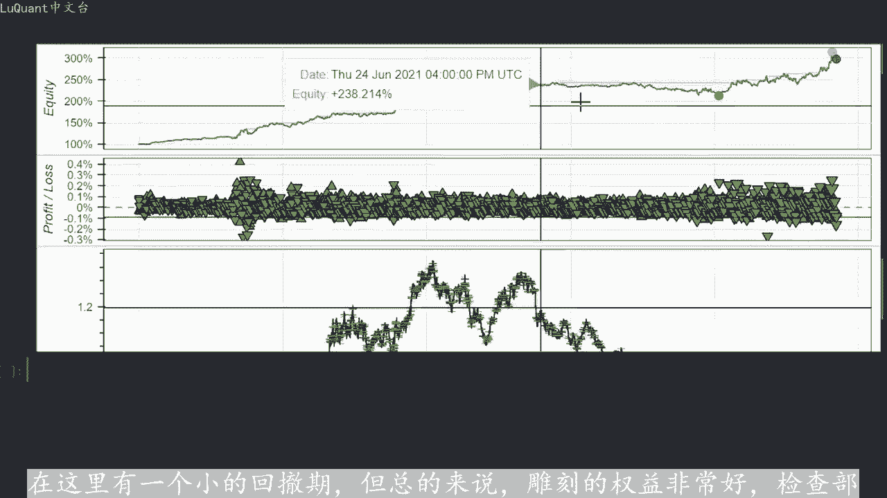
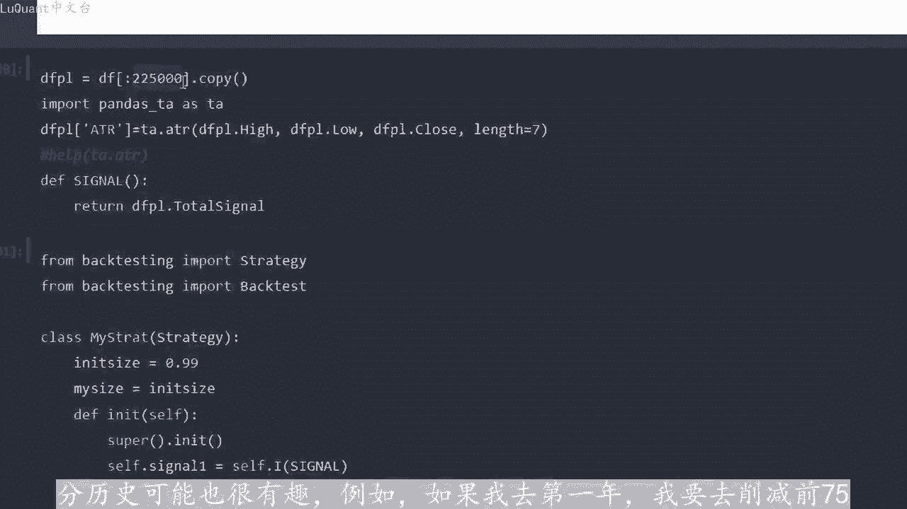
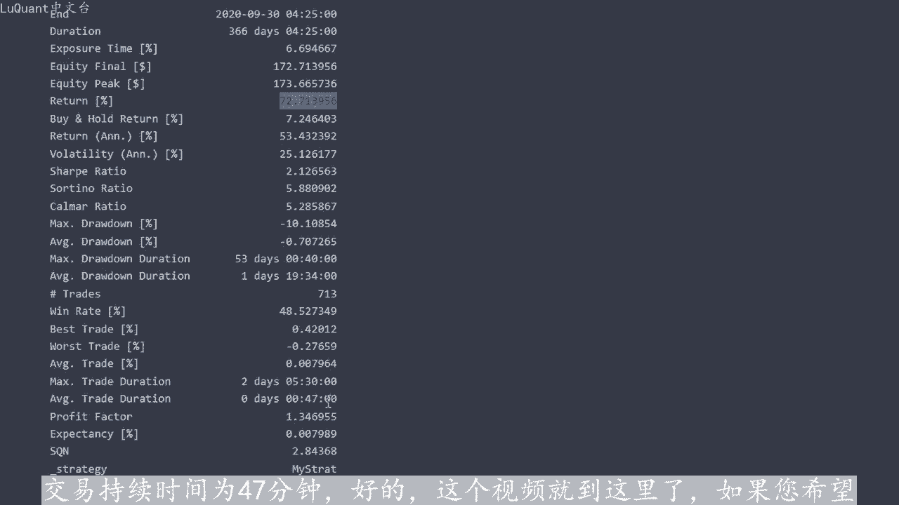
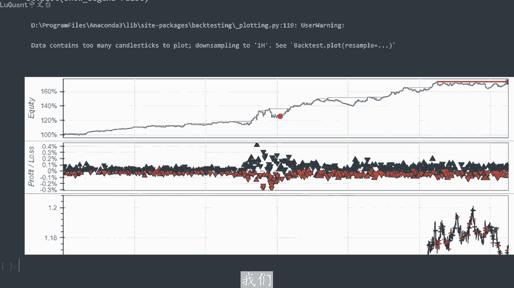

# python量化27：策略回测 - P1 - LuQuant - BV1KK421e721

大家好，今天我们有一个使用V web布灵带和RSSI进行确认的获胜策略。在本视频中分享之前，我对此进行了回溯测试。这是我们在此频道上展示的第一个包头皮策略，因为通常雕刻，对于算法来说非常具有挑战性。

如果您是这个频道的新手，则数据通常在较低的时间范围内很嘈杂，可以从描述中的链接下载pyython代码，并且不要忘记支持和订阅。如果您有任何想法，可以分享总回报，可能会留下评论经过三年的回测。

该策略的成功率约为3%。我喜欢该策略的原因是平均交易持续时间约为51分钟。因此您可以在这条线上看到这一点，因此这是迄今为止该通道上最快的交易平仓策略，这意味着更少的隔夜费用。更少的压力。

因为您可以立即看到执行交易的结果。评论部分的有人询问锐利比率，它也包含在这个策略中大约是0。65个点。这个值可以随着任何参数修改而改。在我们的pyython代码中。

所以当你下载pyython代码并执行它时，你会检查回溯测试，这个集聚比率可能会发生变化。只要密切关注这一点，这样你就可以最大化这个策略的这个值。我正在使5分钟。

时间范围查看应用程序曲线，我正在寻找15根蜡烛，例如位于视图上升区线上方或下方，即我们可以在此处看到的蓝线，它主要用于趋势检测。因此，如果我们在web区线上方有15根蜡烛。

我们如果我们低于视图应用程序曲线，则处于上升趋势，我正在寻找卖出头寸。因为我认为我们处于下跌趋势，然后为我们拥有布林带的交易，建立入场头寸，我使用长度14标准差为两个。所以如。

我们处于pb区线上方的上升趋势，我们正在寻找买入头寸。每当我有一根蜡烛收盘价低于不灵曲线下限时，如果我们正在寻找下跌趋势，这就是我的买入头寸入场信号。所以我们位于VY。曲线下方。

我们正在寻找卖出头寸或空头头寸，我正在等待蜡烛收于布灵带上轨上方，这将是我的卖出信号。最终确认信号我我使用RSSI如果我的RSSI低于45，那么我确认买入信。

如果我的RSI高于55，我正在确认空头头寸或止盈和止损的卖出信号，我正在使用ATR平均真实范围回顾。例如最后7根蜡烛。这7根或8根蜡烛的ATR值，我将其乘以某个系数，这将是我的止损距离。

止盈等于止损距离乘以止盈止损比率，也称为风险回报比率。因此您可能以。注意到有很多参数需要调整ATR的长度系数，止盈止损比率与其他参数。例如，指标参数的比率RSI长度。因此所有这些都。

我们可以在pyython代码中修改的参数，并检查他们如何影响我们在三年数据中的策略。因此，您可以再次从描述中的链接下载代码，并且可以在您的自己看看这些参数如何影响您。

交易策略现在我们可以用python编写所有这些修改参数，并查看我们的回溯测试如何受到影响。这是我们的jupiter笔记本文件。我们正在导入panda SPPD，并且我正在加载我的数据加载我的数据的框。

这是1个CSV文件，欧元美元烛台2019年至2022年之间5分钟要价。因此这是三年的数据。然后我们需要对加载了GMT时间列的时间进行一些重新格式化数。所以这是我们清理GMT时间列之前的数据框。

其中包含日期，但也包含时间。然后我们有0。000，这是秒的分数。所以我们暂时不需要它，我们可以清理它，为了使日期格式更简。

所以我使用这一行删除了这一行的0005正在使用这里的这一特定行调整时间格式。然后我将日期设置为索引，所以我这里将不再有整数索引。将把这个GMT时间更正为索引，我还将丢弃蜡烛的高值等于低值的行。

这意味着我们没有任何蜡烛的移动，在这些特定时刻的价格或市场情。这可能发生在周末，也可能发生在休息日或市场关闭的任何其他时刻，或者我们只是失去了与数据服务器的联系。所以现在我已经清理了我的数据框的长度。

我的数据是20万2000。989，所以这是我的数据框中有多少行，然后我添加了技术指标。所以此时我们添加一个名为view up的列，包含视图应用程序。我提供高低收盘价和这些行的数量，并且视图应用程序。

使用这个特定的库自动计算的，我添加RSI，因为我将使用它，我在这里使用长度16，你可能想改变这个这是你可以试验的参数之一。我使用的布林带长度为14标。差为2。0，这些值没有特殊原因，这是反复试验。

你可能想改变这些自己进行实验。我将向您展示的结果绝对不是该策略的最佳结果。如果您愿意，您绝对可。通过尝试或添加可能的其他技术指标来改进这些结果。那么我们需要计算视图应用程序信号。

我称之为视图应用程序信号，这就是计。完全高于或完全低于视图应用程序曲线的蜡烛数量。例如，如果我们在V up区线上方有15根厚蜡烛，我会认为我有上升趋势，我的视图应用程序信号将等于2。在相反的情况下。

如果我有15个。蜡烛低于视图上升曲线。那么我认为我处于下降趋势，这将是我的V信号。所以无论如何，这个V信号作为新列存储在我的数据框中，我称之为DF web信号。然后我们可。计算总信号。

这是在这个函数内部完成的，我称之为总信号。所以条件如下，我有一个等于二的V up信号，这意味着我正在寻找上升趋势或买入或多头头寸。同时我有一根收盘。低于布林带曲线下限的蜡烛。同时，RSI为低于45。

在这种情况下，我有一个买入信号函数将返回。如果在相反的情况下，我有一个等于一的视图应用程序信号，我希。同时做空市场，我必须在上方有一个收盘蜡烛布林线上线和当前蜡烛RSI高于55。那么我将返回一。

这意味着我有一个空头信号。如。这些条件都不成立，那么我将返回零，这意味着我没有我正在查看的当前蜡烛的特定信号。因此，我们可以计算总信号，并将其存储为数据框中的星链，我们将其称为DF总信。

以确保我的条件正常工作，我将计算我们在数据帧中获得的信号总数。我们有2781个。所以理论上，我们在回溯测试中应该有大约2781个交易。所以如。您一直在观看这个频道。

您就会知道我们总是尝试可视化我们的信号，这使事情变得更容易。每当我有卖出或买入信号时，我将在蜡烛上方或下方创建点，并将这些点的位置存储。数据框中称为点位置突破的新列中。例如，在这个单元格中。

我们将绘制蜡烛图，以便可视化蜡烛图。因此我提供开盘价、收盘价和收盘价，并且还提供V one。我们还可以提供布灵线，还需要添加信号，这意味着我们刚刚计算出总信号有效的点，这些是我们在这里看到的信号。此时。

我们有一个买入信号或一个多头信。

这个紫色点位于蜡烛下方，这是因为我们在试图应用程序曲线，蓝色曲线上方有15根蜡烛，同时我们有这根蜡烛，这根红色蜡烛收盘价低于布林带曲线下限。因此，根据条件，这是正确。我们也可能有上面的RSI以55为例。

我们在这里有一个买入头寸，这个长触发信号是一个错误信号。因为之后我们可以看到价格下跌，但这里是一。很好的信号，因为我们有15个可以高于视图的信号区线，因此我们正在寻找买入头寸。

其中一根蜡烛收盘价低于布林带区线下限。我们可以看到，我们很适合作为买入头寸。所以无论如何，我现在可以说的是。😊，算法的工作原理如下，这是我们提供的条件，并且运行良好，但我们也缺少一些更好的交易。因此。

我们可能已经检测到类似的情况。而我们这里没有信号的原因。因为这些两根蜡烛或这个特定的红色蜡烛，它确实收盘于布林线下轨下方，但同时它穿过了Vwe曲线。我们算法的条件之一不再有。因此。

我们需要最后15根蜡烛，包括当前蜡烛高于Vwe曲线。因此我们正在确认上升趋势，因此也许这是我们可以改进的条件之一。如果你有幸。改进这一特定功能，我可能会在下一个视频中进行一些改进策略，请发表评论。

当我看到你分享想法时，这真的是一个很大的支持。我总是从评论部分得到我的大部分想法。所以现在我们可以继续进行回测部分。为此，我们将需要AT2评。😊。

真实范围来选择我们的止损和止盈值，这就是我计算AT2的地方。我将其添加到我正在使用的新数据框中，这只是我的初始数据框的一部分的副本，只是有。整个数据框有点大，所以我不想等待并测试所有数据。

这需要一些时间，更容易取一小部分。你的实验会改变你的值。然后当你满意时，您可以在整个数据集上运行这些参数。然后我使。😡，回测do派库包或我的回测。在这里我将使用R距离的止损，它等于当前ATR值的1。

2倍。所以。是我在提出策略时所讨论的系数，在这个特定势例终止盈止损比率设置为1。5，我还添加了一个条件。在这种情况下，对于这个特定的情况没有太大区别。这里使用这。参数的策略是，如果我们持有多头头寸。

当前交易是多头，且RSSI超过90的值。其实我还没有达到止盈值。我也会平仓交易相反的方。如果我有空头头寸，并且我们正在跌破RSSI低于时，即使我还没有达到我的止盈值。如果我有买入信号。

并且我们只允许我也会平仓一次进行一笔交易。因此如。当前交易的长度等于0，正如我们所解释的那样，计算止损。我使用止盈止损比率计算止盈，并通过相反的仓位来开仓情况类似。所以当我们的信号等。一时总信号为一。

因此这是一个卖出头寸，我们没有任何未平仓交易，我计算获利的止损，然后开了一个卖出头寸。如果我从100开始作为现金，我使用10分之1的保证金，我们可以进行回。😡，测试我们可以检查结果。

我获得了197%的回报，股本峰值为300美元、313美元，但股本最终约为300也是297。请记住我们。100美元开始，下普比率是1。65。正如我们在开始时提到的。

我喜欢这个策略的原因是这个特定的平均交易持续时间值，这里是51分钟。所以我们的大多数交易都是将。在1小时内关闭，所以你不必等待太久，胜率不是很高，只有45%。但请记住，我们使用的止盈止损比率为1。5。

如果我们查看净值，我们会发现可以看到我们的资本不断增加。😡。

在这里有一个小的回撤期，但总的来说，雕刻的权益非常好，检查部分历史可能也很有趣。例如。

如果我去第一年，我要去削减前70。

000行的数据，我们的瑞比为2。12，每年回报率为53%，因此年回报率为53%，总回报率为72%，然后平。交易持续时间为47分钟。好的，这个视频就到这里了。如果您希望我扩展该策略，并尝试改进它。

添加更多自定义指标等等。请告诉我，我想更多的研究微网络，所以请继续关注我们的下一个视频视频，直到我下一次交易安全。下次。😡。

