# python量化28：蜡烛图也有用 - P1 - LuQuant - BV1U6421F7tg

嗨，今天我们将看到如何在pyython中添加远足灰蜡烛，并尝试两种相关的高能灰光滑蜡烛策略。这些策略是根据我们通常用于交易的普通烛台计算的。每个远足蜡烛是使用以下公式，通过远足收盘价获得的通。

平均当前蜡烛的开盘价、最高点、最低点和收盘价而获得加息开盘价。而加息开盘价是从我们刚刚使用前一个加息阿。蜡烛的加息开盘计算的加息值的收盘价获得的高点可以收盘前一根远足蜡烛的开盘价和收盘价除以2。因此。

我们对前一根蜡烛的开盘价和收盘价进行平均高值，是正常烛台高点中的最大值远足蜡烛的开盘价或远。蜡烛的收盘价。因此。我们取这三个值中的最大值，远足蜡烛的最小值或最低值是当前蜡烛的最低价格中的最小值。

正常烛台远足蜡。的开盘价，当前远足蜡烛和灰蜡烛或当前图标灰蜡烛的收盘价具体取决于我们的方向是红色手柄还是绿色蜡烛。因此，简而言之，除了高值和低值之。蜡烛由平均值组成，这时远足图表具有平滑的外观。

有些交易者可能会发现比普通蜡烛更好或更少噪音。现在该视频的目的不是展示一个获胜的远足系统，而是向您展示如何在pyython中构建这些蜡烛以。如何构建算法策略，并对这些策略进行回溯测试结果。

现在我在网上发现的第一个策略使用两个移动平均线，一个是快速移动平均线，另一个是缓慢移动平均线来确定趋势。因此，如果快速移动平均线高于慢速移动平均线，我们认为我。😡，有上升趋势。

因此我们正在寻找一个买入头寸。在相反的情况下，如果快速移动平均线，这里的红色曲线低于蓝色区线的慢速移动平均线。我们认为我们处于下降趋势，因此我们正在寻找卖。头寸置于我们需要的任何策略触发器或入场位置。

因此，如果我们处于明确的趋势中，并且远足蜡烛在趋势方向上穿越快速移动平均线，则该策略会触发交易信号。例如。这种情况下，我们有一个下降趋势，这里快速移动平均线低于蓝色区线，是缓慢移动平均线。

我们这里有一根远足蜡烛，它从快速移动平均线上方交叉到下方。因此这。😡，收盘价的触发因素，我们在此时有卖出头寸或空头头寸。当然，如果方向相反，我们也可以这么想，我们有上升趋势，我们正在寻找一根绿色蜡烛。

从下方收盘高于快速移动平均线，以触发买入头。该策略的第二个变体是通过添加一个条件来获得的。我们寻找十字星蜡烛后跟短尾蜡烛。例如，这里有十字星蜡烛，后面跟着短周或短尾蜡。就在趋势方向。

这意味着我们有下降趋势，并且有第二根柱线。短周蜡烛开盘价高于快速移动平均线，收盘价低于快速移动平均线。在这种情况下，我们可以触发我们的空头头寸或卖出头寸。

寻找无洲或无尾部蜡烛的原因是它是我们已经抛下或串起的指标上升势头，取决于我们正在寻找的趋势。当然，这些策略中的任何一个都伴随着挑战。哪个时。框架最适合这些蜡烛。

在这种情况下使用的最佳止损位置和退出策略是什么？所以现在让我们看看如何编写pyython中的所有这些细节，并尝试回溯测试这两种策略。这是我们的jupiter笔记本文件，我们正在导入库我们。

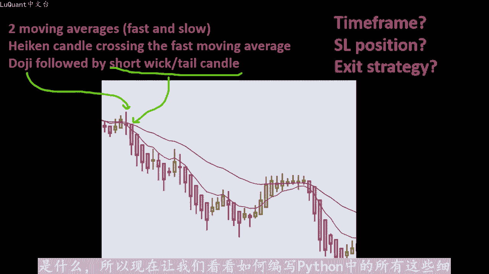

使用这些库夏在自2012年以来十年的russell1000股票数据2022删除眷裂，因为我们不会将它用于此策略，我们不许。他我将在数据框的头部打印前十行，确保所有数据均已正确加载。

所以这是看起来我们有价格日期，这是每日时间范围。我们有开盘价、收盘价和调整后的收盘。然后我删除了开盘价等于收盘价的日期。所以这些就像打碎的蜡烛。换句话说，这些天我们没有任何变动。

或者蜡烛没有显示任何变动，因为市场关闭，我们也。重置索引。因为一旦我们过滤数据，我们就会删除一些行，我们必须稍后重置索引。所以请注意，现在我的索引只是一个整数012等等，日期又回到了列。

就是所有神奇发生的部分，我们将计算徒步履行收盘价列等于开盘数据，加上收盘数据，加上数据最高价和最低价除以4。记住收盘价。当前正常烛台的平均值，但我们取所有4个值的开盘收盘高价和低。

将所有这些值相加并除以4。这就是我们获得收盘价的方法。现在开盘价有点棘手，因为它。从之前的徒步旅行灰蜡烛中获得的，但因为我们还没有开始徒步旅行的蜡烛数据框的，我将把它设置为等于数据开盘价。

这仅是有效的这意味着加息蜡烛的当前开盘。将等于普通蜡烛的开盘价，仅对于第一个值而言。一旦这个值完成后，我们可以在11的范围内调整I的负尔循环，而不是从零开始。因为我们已经有了第一个开盘价和收盘价。因此。

一到数据长度，因此整个数据框是该行的数据图标开盘价I等于我可以开盘的数据I减1。所以前一个远足蜡烛的开盘价加上。可以平仓的数据I减1，所以前一个远足蜡烛的收盘价除以2，这就是我们获得开盘价的方法。

现在对于高价和低价，远足蜡烛的价格比较简单或更容易。它等。正常烛台的高点，远足蜡烛的开盘价或远足蜡烛的收盘价之间的最大值。所以这就是是我们的加息。高点和高点可以低点是这三个值之间的最小值。

正常烛台的较低值。当前高点图标的开盘价，当前图标的收盘价，所以所有这些都将计算远足蜡烛。我们将添加相关数据，这意味着高点可以开盘上涨和收盘，我可以将高点和高点可以低点作为列放入我们的数据框架中。

这就是我们。数据框架的样子，我们有我们的日期让开盘高低收盘价和调整后的收盘价记住，这些已经存在于我们的数据框中。因此，这些与正常烛台相关。如果我们向右移动，我们会看到图标关闭图标开。图标高和高可以低。

然后我们可以使用pas技术分析包添加任何指标。因此，我为此部分添加两个移动平均线，即MI20和M50以及RSI。有人想要使用它，因此长度等于12式验证这一点的最佳方法，一切正常，或者按预期绘制图表。

我们可以绘制数据。这就是我们获得的这些是图标蜡烛。您可。

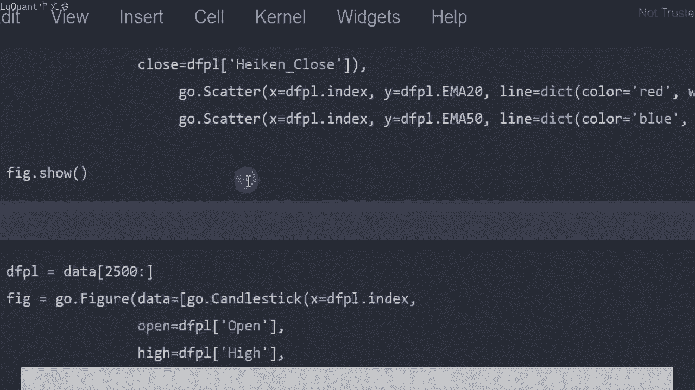

看到我们也有两个移动平均线，并注意到每个蜡烛都是从中间开始的前一根蜡烛的开盘价。因此，此处，该蜡烛的开盘价正好位于前一根蜡烛的主体的中间，以此类推，所有蜡烛都相。

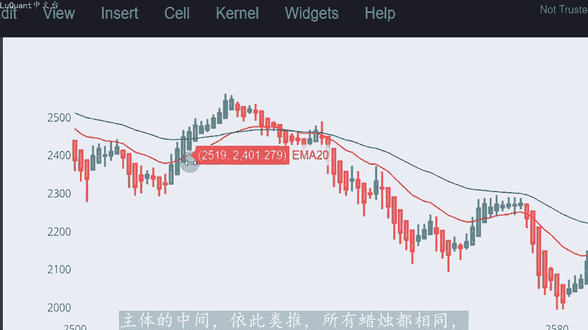

原因是记住高切蜡烛的开盘价是通过以下方式获得的平均M，这是开盘价。它是通过平均开盘价和上一个丑闻的收盘价减去易得到。

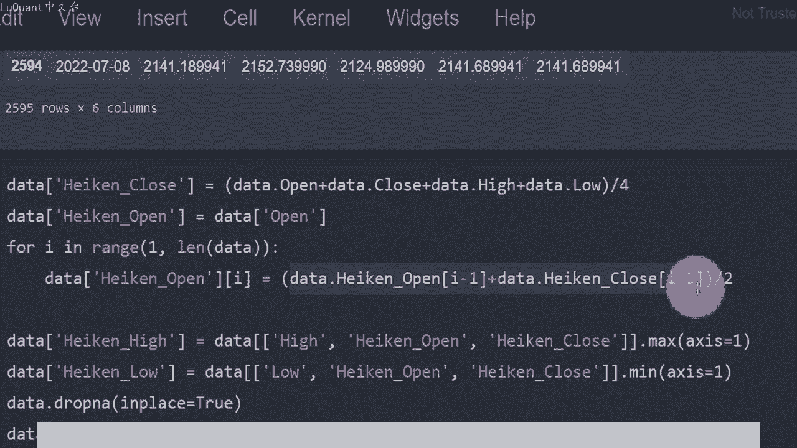

这就是为什么，只是为了确保一切正常，并且我们的程序中没有任何隐藏的错误。这就是为什么我们的蜡烛应该在前一根蜡烛的中间开盘，所以这也是正确的注意事项。对于远足蜡烛，当我们有强烈的向上运动时，蜡。😡。

没有任何较低的灯芯或较低的尾部，并且在强劲的下降势头。我们的蜡烛没有任何更高的灯芯，而且蜡烛主要是红色的，现在该策略看起来运作良好。我的意思是跟。😡，快速和慢速移动平均线。我们有一个下降趋势。

并且我们有一个正在开盘的远足蜡烛，高于快速移动平均线，收盘低于移动平均线。所以我们有一个卖出信号。如果我们在这里卖出，我们可以看到我们有一个很好的下降趋势。所以这。😡，一笔非常有利可图的交易。

我们仍然处于下降趋势。我们有一根蜡烛从上到下穿过快速移动平均线，然后我们也有一个下降趋势。所以我们在这张图表上有两个不错的交易。但。就是这个样本的样子，让我们检查一下回测所有内容。

看看这能带来多大的利润。现在我们可以计算我们的交易信号，所以我调用一个函数总信号，它接受数据帧以及。😊。

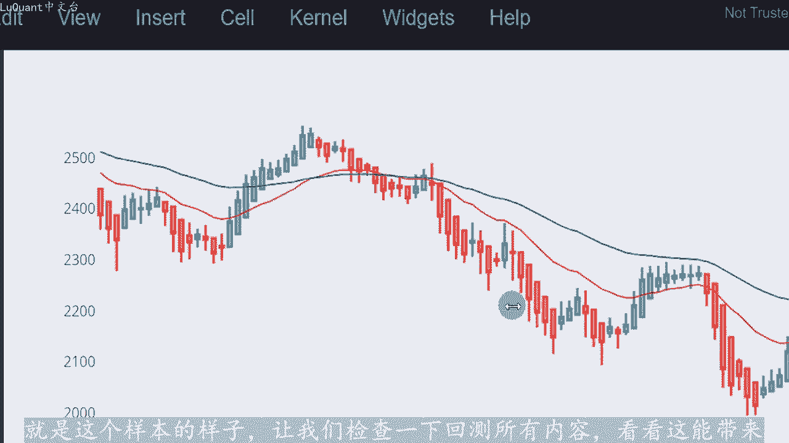

称为订单信号的列表，其大小或长度与数据帧相同。因为我们的信号相等为零时，当我们有买入信号时，它们将等于2。当我们有卖出信号时，它们将等于一应。对于每天的每一行。

我将检查快速移动平均线是否为当前的M820行位于当前行的M50上方。因此，在这种情况下，我们处于上升趋势。同时我们的当前蜡烛的高点开盘。低于快速移动平均线即MI20，同时。

同一图标蜡烛模型的收盘价高于过去的移动平均线MA20。在这种情况下，我们。一个上升趋势，并且一根蜡烛，一根飓风蜡烛从下道上穿过快速移动平均线。这就是我们将如何进行arm订单。当我们有下降趋势。

移动平均线。从上到下交叉的红色蜡烛时，信号在相反方向上等于2。在这种情况下，我们将有一个等于一的订单信号，并且我们将这些订单信号作为新列称为顺序信号。因此我们正在运行此单元格。

这就我们的信号将被计算的地方，并且在实际回溯测试之前。我们正在重置并删除数据框中的无效或空行。我喜欢将事情可视。评估这种情况要容易得多。因此，每当我们有买入或卖出头寸时。

我们都会使用此函数在蜡烛上方和下方添加点。因此，我运行此命令，以在新列中声明这些新点我们的数据。我们正在绘制远足蜡烛和移动平均线，信号是将在图表上绘制的点。这样我们可以看到这里有一个紫色点。

这里有另一个我要添加的点尺寸，只是为了使其稍微更明显。所以我。

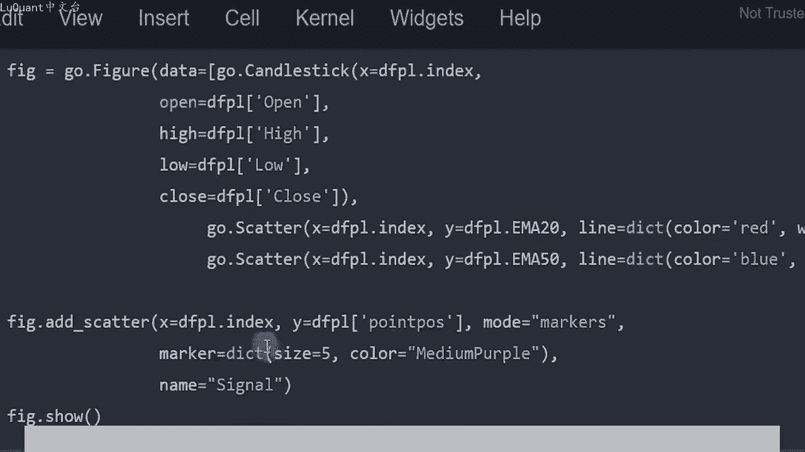

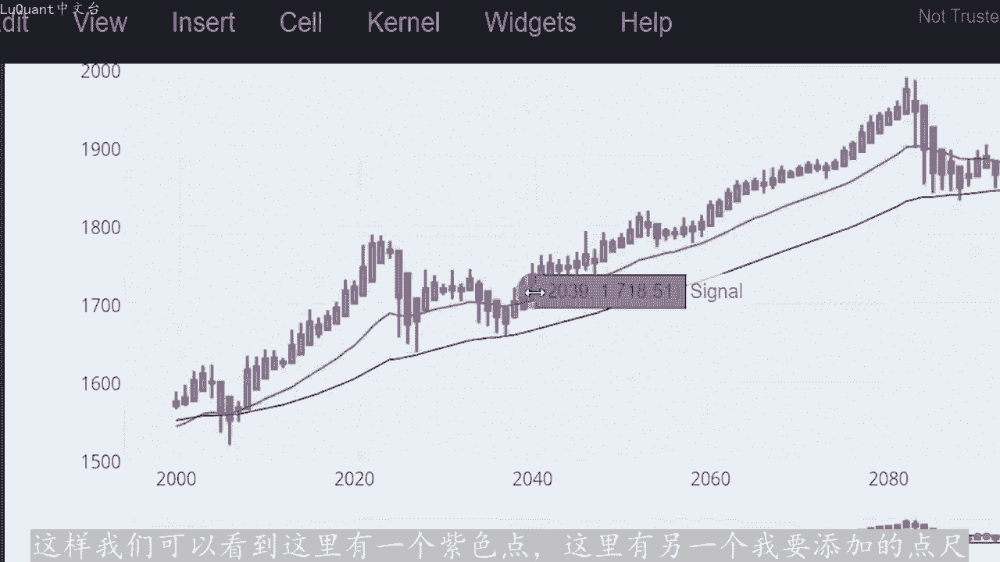

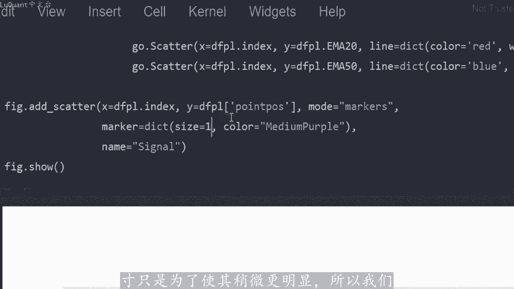

有一个上升趋势，移动平均线，红色移动平均线高于慢速移动平均线，蓝色移动平均线。所以我们有上升趋势，同时看看这根蜡烛，它从快速移动平均线下方交叉到上方快速移动平均线，这是我们有买入信号的地方。应。

子点在这里，这里我们也有买入信号，所以这些信号看起来很好，使用远足灰蜡烛的陷阱之一是，当你有信号时，你不应该在高能RC图表上进行交易或回溯测。因为这些不是市场的真实价值，市场的真实价值是真实的图表。

这里的真实烛台。所以换句话说，接受信号来自hne蜡烛的图表。但。

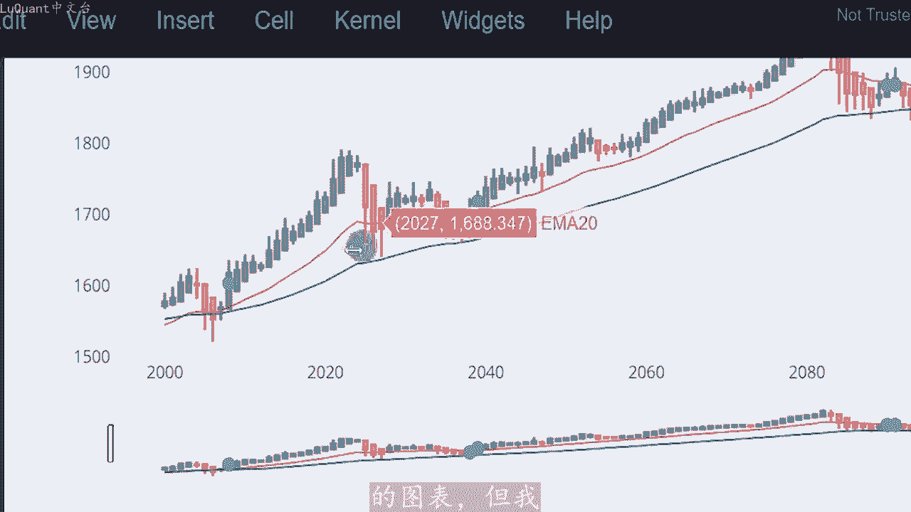

使用的是普通蜡烛的交易，这是我在很多youtube视频中看到的错误。我也在博客等中看到过他，因为这非常棘手，我的意思是这看起来非常好，但这不是现实。请记住，这些是通过对正常烛台的不同值进行平均而获得。

😊。

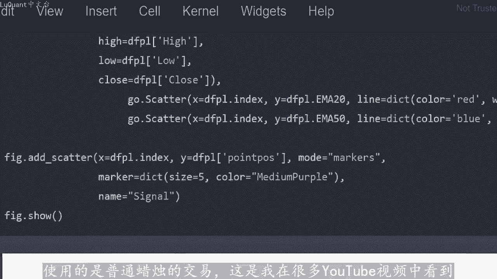

实际值是真实烛台或正常烛台。所以为了检查信号在哪里被真正触发，我要去也添加这个尺寸。所以我们这里有信号，这还不。

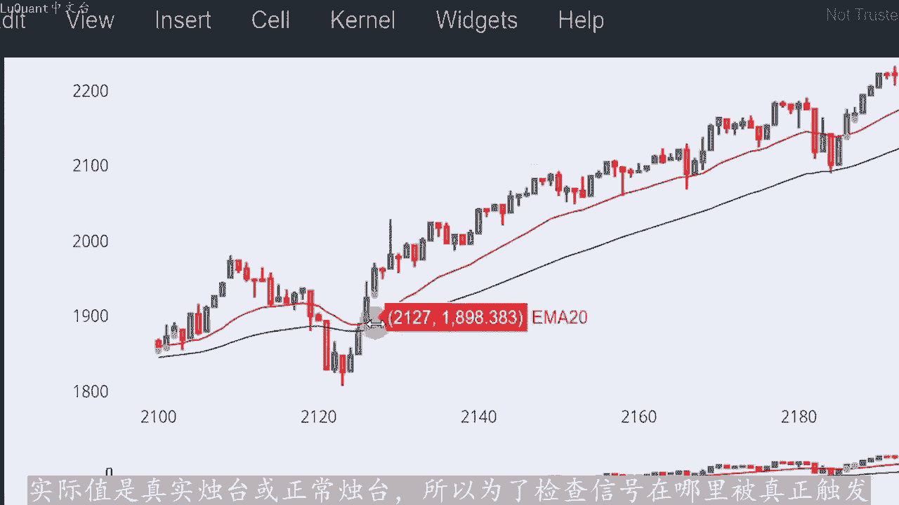

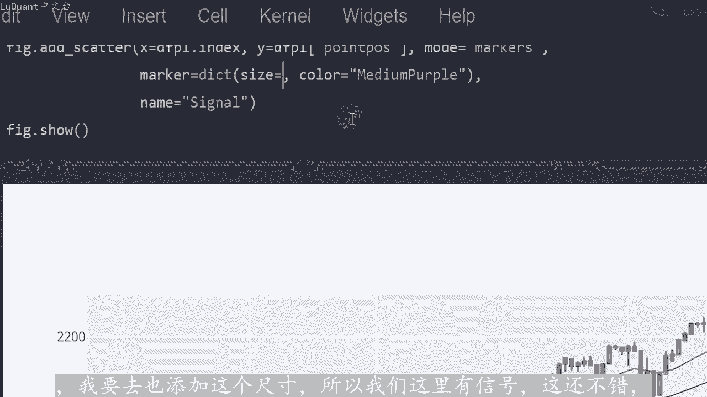

很好，这可能是一个买入信号。所以在信号之后，我们有一个小的上升趋势。我们在这里有另一个信号，所以你可以看到，但这些信号来自使用hcount图表，我们在这里有另一个信号。但我。😊，不需要它。

因为我们会在此时应用或执行我们的买入头寸。然后我们在市场上有上升趋势。因此您可以看到，信号与将一张图表转换为另一张图表。因为显然我们没有使用相同的蜡烛，但。当我们回溯测试时，这些是我们将要使用的价格值。

我们不会使用hine图表进行回溯测试。现在是具有挑战性的部分是选择一个止损距离。我们要做的是，每当我们有一个信号。

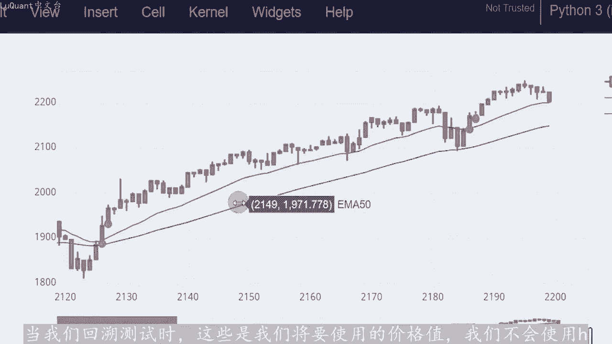

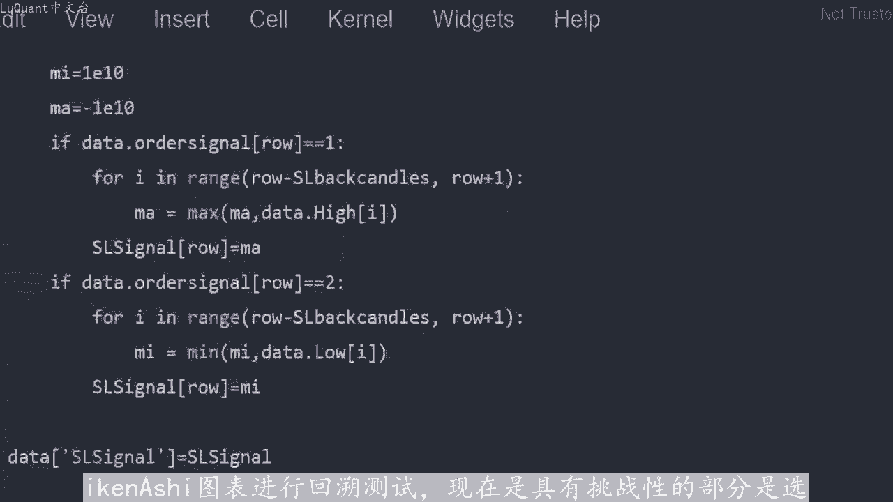

止损就会是。例如，如果我们有一个长信号，如果我采取的话，那么止损将是前两根蜡烛中的最低点。这里的一个例子只是为了让事情变得可见。如果这是一个买入信号，我们的值。将在这里。

因为这是当前蜡烛和前两个蜡烛之间的最低价格，所以这是做你可能想要的事情的一种方式。根据您如何看待退出策略设置固定距离止损或止盈，但这也是一项非常。😊。

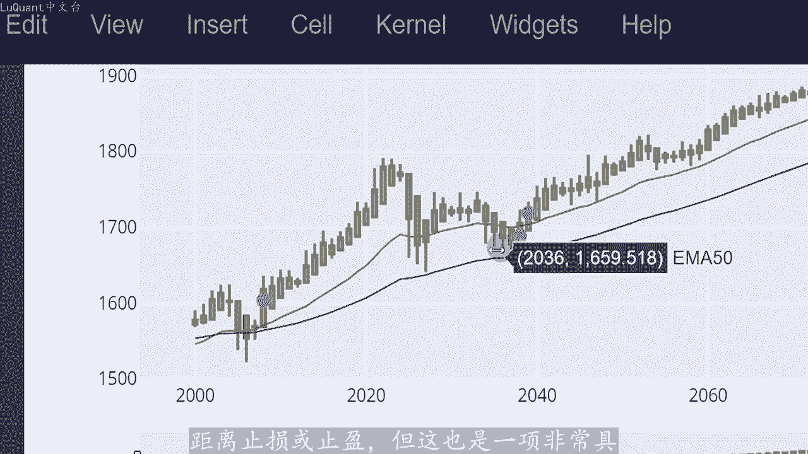

有挑战性的任务可能会极大的改变结果。因此，我们对您管理交易的方式也有很大影响。现在这是我们要测试策略的类，初始规模是2%，我们用2%的资本进行交易。同时指。止损比率等于一，这意味着。

无论我们将相同距离的止损将用于止盈。你也可以在这里更改这部分。例如我们将其设置为1。5，因此我们可以通过两种方式平仓。第一种。通过触及止损，当然还有获利值。但第二个，例如，如果我们处于多头头寸。

并且我们遇到红色远足灰蜡烛，则意味着我们开始减缓向上运动或势头。在这种情况下，我们可以关。当前交易也是如此，如果我们的交易是空头，我们将寻找一根绿色蜡烛，绿色远足灰蜡烛来关闭我们的空头交易。

并打开我们的交易。如果信号等于2，并且我们没有任何其他未平仓交易。记住我们在我们的系统中一次允许一笔交易。我们再次定义止损值和止盈值，考虑止盈止损比率，并考虑止损止盈值和规模来应用我们的买入投。

当信号等于一时，交易的情况恰恰相反，我们正在寻找卖出头寸。我们从1万美元现金开始进行回测，保证金为50分之1或杠杆为1点到50点，无用。目前，我们能够将此策略与之前的策略进行比较。

我们可以运行所有这些来在10年每日时间范围内对其进行回溯测试。这里非常重要的是，对于回溯测试的开盘价和收盘。我们使用的是正常数据框架，正常烛台，我们不使用加西蜡烛和灰蜡烛。

因此我们只是从高位canash图表中获取信号。但对于回速测试，我们使用正常烛台，因此这些是我们不使用的结果有任何。令人印象深刻的回报，所以我们只有50%的回报与当前的米记住，这没有优化。

您可以随时在移动平均线上发挥作用。移动平均线的长度，您可以添加任何您想要的条件，例如使用RSSI。任何其他指标，这只是向您展示如何使用pyython将远足灰蜡烛纳入您的策略以及如何回溯测试。

这就是我要向您展示的所有内容。我希望你们喜欢它。如果是这样，请支持喜欢并订阅更多此类视。

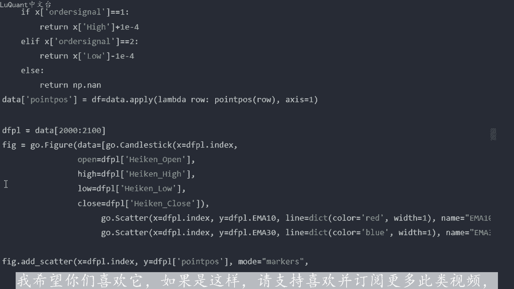

如果您对这个特定系统的改进有任何想法或建议，请不要犹豫，只需发表评论，直道我们的下一个交易安全，下次再。

