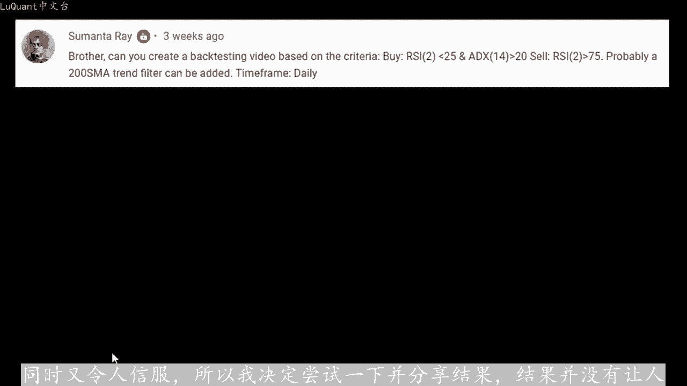
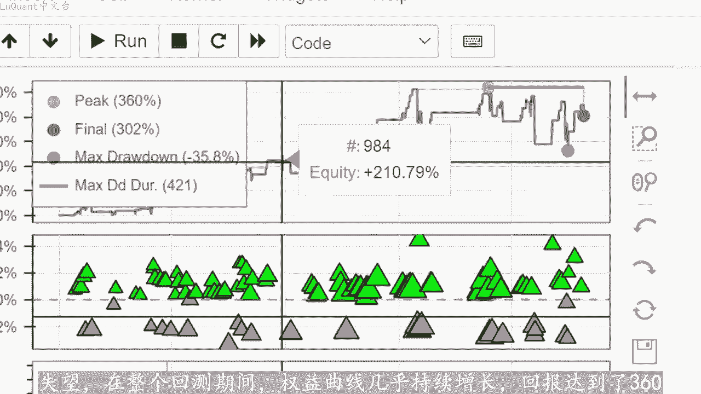
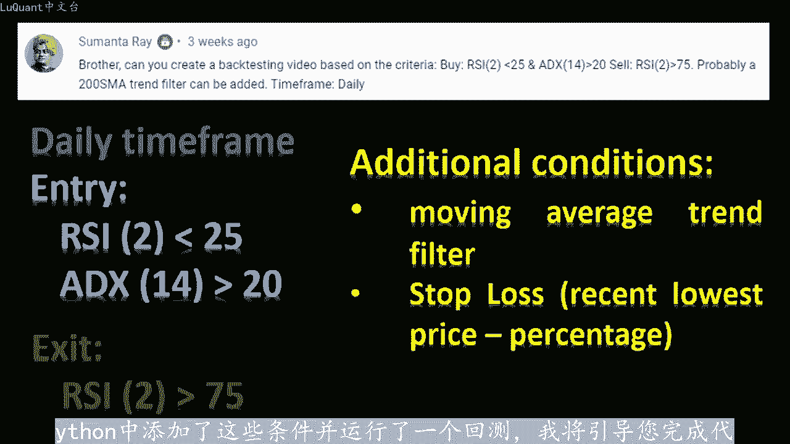
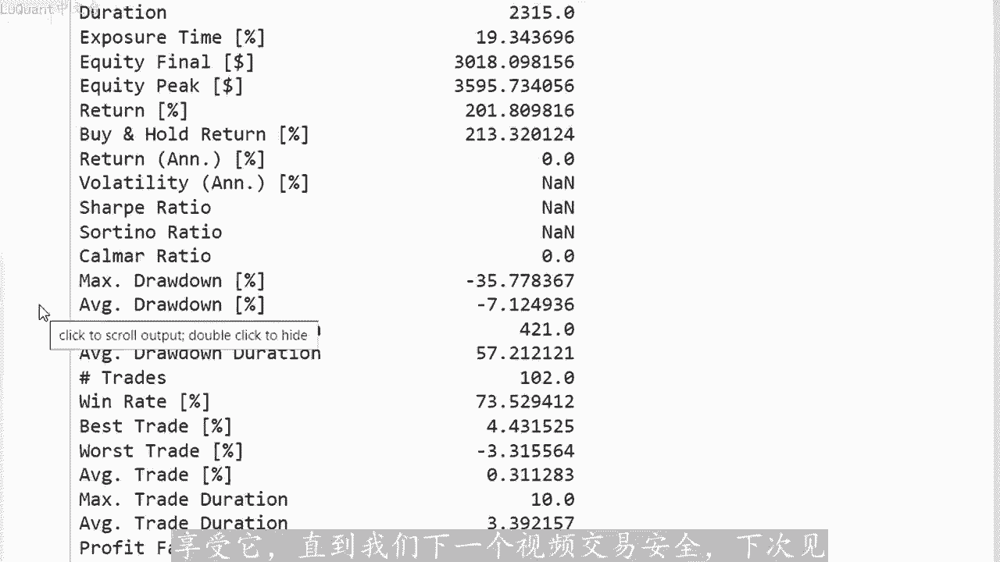

# python量化29：自动化交易 - P1 - LuQuant - BV1Gj421d72H

今天我们正在研究仅使用RSSI和ADX进行多头头寸的单项策略，尽管看起来很简单，但该策略的效果却出人意料的好。事实上，它是由评论部分的某人提出的，而且碰巧参数看起来很熟。同时又令人信服。

所以我决定尝试一下并分享结果，结果并没有让人失望。在整个回测期间，权益曲线几乎持续增长，回报达到了360的峰值。如果您是这个渠道的新手，代码可以从描述中的链接下。😡。

不要忘记通过订阅留下评论来支持我们希望听到新的想法。就像这个视频所讲的那样，所以这个策略如下我们每天使用的时间框架，当这两天的RSI低于25并。ADX14高于20的值时，我们进入多头头寸。

当RSSI跨越75的值以上时，我们关闭多头头寸。在这些条件之上，我必须再添加两个条件，以避免在RSSI低于75阈值时出现虚假信号和交易开仓时间过。因此，第一个是简单的移动平均条件。

当蜡烛在移动平均区线上方交易时，我们有上升趋势，并且只有在这种情况下，我们才允许建立多头头寸。第二个是止损值。该值。视为最后两根蜡烛中的最低价格减去我为此目的而采用的等于2%的一定百分比回速测试。

如果您正在测试不同的值，您可能想要更改此值。但对于此视频，我只取了2%。换句话。当我们进行多头交易时，我们会查看当前蜡烛的最低价格或当前蜡烛的最低价格前一根蜡烛以最低值为准。然后我们减去2%。

这就是我们的止损位置。请注意，当RSI穿越75以上时，交易仍然可以平。但如果没有，我们仍然有止损值，以防市场出现波动下降。所以我在pyython中添加了这些条件，并运行了一个回测。我将引导您完成代码。

我们将看到这个策略将导致什么？这样我们就可以加载任何类型的数据。它可以我正在使用的股票或外汇，从2011年到2021年的罗素1000指数，这是十年的数据，我正在清理没有变动的日子，我们正在重置指数。

我们正在打印我们的数据框，然后我添加。

指数移动平均值长度为200的趋势，检测和长度等于14的RSI以及长度为14的edicix。如您所见，使用此型此处来自pas下划线技术分析包的函数adic。再次。

我们正在清理数据框并重置索引打印数据框的一部分，只是为了检查我们将要使用的列数以及这些列的标题是什么。然后我使用一个名为edymic node函数，我不会简要介绍详细信。就是你说的，例如。

我希望有6根蜡烛在移动平均区线之上或之下交易。在这种情况下，我们返回一个信号，它是上升趋势还是下降趋势，这个数字可以改变。当然我拿了6根，因为我已经在之前的视频中使用了这。😡。

数字和这个特定的函数到目前为止，它运行良好，所以我们将保持原样，并且我们添加一个称为总信号的函数。如果我们是这样的话，这就是我们要计算信号的地方是否。多头头寸的条目或者我的范围从零到数据帧的长度。

这意味着我正在检查数据帧中的每一行或每一天，并且我正在检查当天的RSI是否为低于或等于25。可以删除等号，这对于该策略来说没有太大区别。同时adics高于20，并且我们有一个等于二的艾码信号。

这意味着最后6个连续蜡烛。移动平均区线上方交易。因此，当满足这三个条件时，我们有一个等于二的信号，我正在存储，这意味着我有一个多头头寸的入场信号，我们将其添加到我们正在打印数据的数据框中，框架只是位。

检查我们在哪里有一个不同于零的信号，这意味着我们在哪里有那些买入或多头头寸，这些就在这里，这样我们就可以检查，我们可以在条形图上可视化我们的信号。所以这些是您可以在此处看到的紫色点。

我不会详细介绍所有细节，我试图使该视频尽可能简短。因为这些函数和此方法已在之前的视频中的该频道上使用过多次。如果如果您想查看详细信息只。😡，观看之前的一些视频，其中我们详细介绍了这些内容。

如果您检查我正在教授pyython以及如何使用pyython的不同播放列表，则某些视频可以逐行浏览详细信息算法交易。所以无论如何回到我们的数据。可以看到，我们在这里有这些买入信号。

让我们对数据进行切片或放大，这样蜡烛就在MI曲线上方交易。同时我们在这里满足了条件具有较低的RSSI。这在图表中看不到。我们相信我们的程序同时ADX高于20。

因此这三个连续点或4个连续点几乎是相同的信号。正如我们所看到的，尽管这部分是价格的小幅回撤，仍然是很好的入场信号。如果我们知道和。退出交易。那么现在对于回溯测试部分。

我使用back testing pie包，我也不会在本视频中详细介绍。因为这个函数如果您还记得我们采用的是最低价格减去2%，那么我们在该频道之前的视频中已经反复使用了这个软件包只。止损的百分比。

例如可以在此变量中修改该百分比，所以我我取2%让我们保持这种方式进行回溯测试。首先，如果我们有任何交。正在进行。这意味着，如果交易列表的长度是正数，我将检查该交易的开仓时间是否超过。

让我们比如说1000天或100天或10天，我为您保留了开放状态。我们在此视频中并未真正使用此条件，但您可能希望在此处将其用作附加条。😡，例如，如果您只想打开交易10天，然后平仓，您可以将其减少到10。

现在我输入1000，因此这部分不会干扰我们的回溯测试。平仓的第二个条件是RSSI应超过75或者。有空头头寸在这个策略中情况并非如此，RSSI低于25。我将这些行保留在代码中，以防万一您想改进此策略。

以考虑空头头寸。因此，我保留了您可能想要更改的所有内容。如果信号等于2，则现在应用您自己的修改，这意味着我们有一个入场位置，并且交易长度等于0。这意味着我们没有为平仓交易。

我们一次只允许进行一笔交易在市场上。我们不希望同时打开重叠交易。就是我们要应用止损值的地方。因此，止损亦等于当前蜡烛低点或前一根蜡烛低点之间的最小值，以具有或提供我们将乘以一减。

这个百分比此处为2%的最低价格，我们将使用止损枝和我们的交易规模以买入头寸进入市场。交易规模为我们当前净值的99。用1000美元现金开始回溯测试，保证金为5分之1或杠杆为1到5无佣金。

只是为了能够将此策略与我们之前应用的不同策略进行比较，并在放弃任何额外的策略之前进行回溯测。佣金、吊期和交易费用等参数是回测的结果。我们有200的回报，净值峰值是3595。记住，我们从一00开始。

我们的胜率是70。这非常好，我们有102笔交易，总的来说，这意味着每年10笔交易，这在每日时间范围内也不错。如果我们绘制股票曲线，我们从交易开始，直到过去几年。会说我们有持续增长。

在某些情况下会出现小幅下跌。因此我们可以查看并分析为什么会发生这种情况。我们这里有一个动荡的市场，正如我们在这里所看到的价格急剧下跌，并且需要一些时间才能爬回一。平均线上方，这里需要考虑的非常重要的是。

我没有修改评论部分中建议的任何值或参数，因此，RSSI保持为二，就像评论中一样，X保持为10。😊，M保持指数移动平均值的长度为200。正如我们在这里看到的这些仍然可以调整。

您可能想在不同的股票或不同的市场上尝试这个，也许可以更改这些值，直到您获。更好的结果，并获得更令人满意的东西。这就是这个简单的策略。我希望你们喜欢它。我将在描述中的链接中分享代码。

您可能想下载它并进行实验。这是一个简单而简短的代码。对于该领域的中级或初学者来说，非常。😡，享受它，直到我们下一个视频交易安全。下次。

