# python量化2：外汇实时交易2 Code - P1 - LuQuant - BV1HZ421t7ev

大家好，欢迎再次观看本视频。我们将通过pyython代码来回测我们升级后的交易策略。该策略已在市场上部署了几周。在上一个视频中，我们提出了一些改进措施，以限制风险并增加利润。该视频。😊。

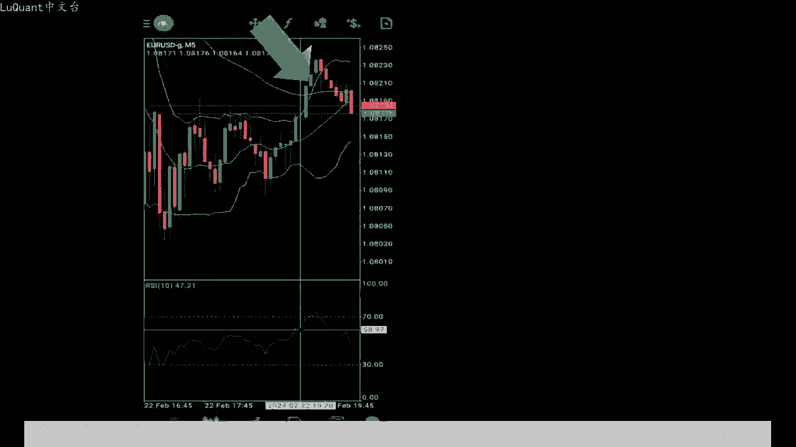

之前关于开发实施交易策略的工作的延续，我们可以在市场上部署该策略。因此，如果您还没有观看上一个视频以及描述该策略细节的视频，我将在下面的描述。所以现在我们将浏览pyython代码。

我们将添加基于rs up的指标。如果这是您第一次使用此频道，我还将。😊。

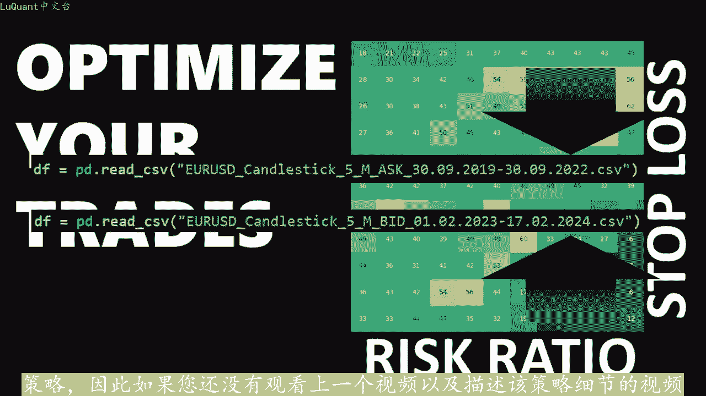

您展示如何应用前向多重测试和盈亏平衡交易管理，我通常共享pyython从下面描述中的链接中获取代码，以便您可以下载代码，并将其用于您自己的实验。您不必从视频中复制它。如果您喜欢该内容，请不要忘。

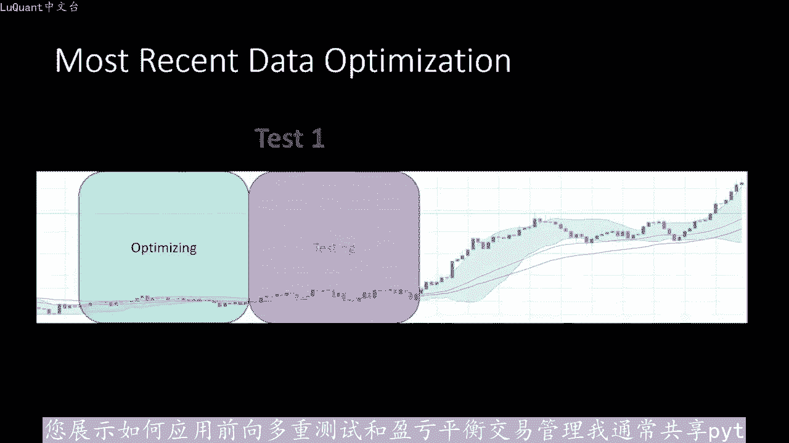

按喜欢来支持此频道按钮，也许可以在快速评论中留下您的印象和想法。好吧，让我们进入编码部分。这是我们的jupyter笔记本文件。我们首先导入CSV文件，欧元美元5分钟时间范围从2023。

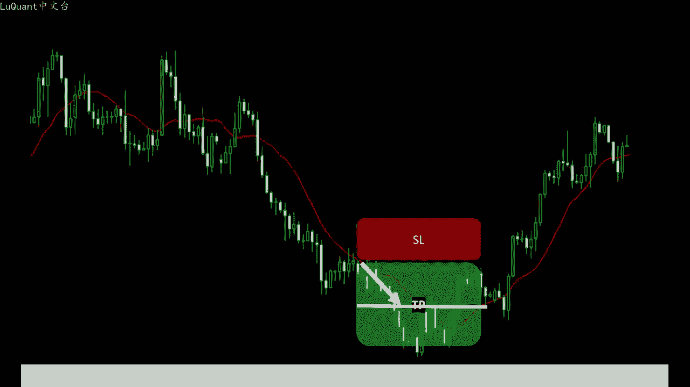

到2024年，所以这如您所见是最近的数据。因此我们没有像之前的视频那样使用较旧的数据。在这些行中，我们正在清理GMT时间列中的描述，并且我们将GMT时间列转换为白天提。正确的格式，日月年小10分钟。

然后秒，然后我们正在清理，没有任何运动的蜡烛。所以这些通常是最高点等于最低点的蜡烛，这些是周末和休息日。所以我们是对这些天不感兴。然后我们也重置指数，因此设置指数GMT时间，因为这将是我们目前的指数。

然后我们应用快速和慢速的移动平均线，就像前面的示例中的RSSI1样，需要biner。带长度15标准差1。5，以及我们将再次用于交易管理的ATR。如果您还没有观看之前的视频。

这就是为什么我要快速处理这些单元。因为这些在前一部分中已进行了解释，为了使这个事。尽可能短，你可以回去，我会留下一些链接，然后先观看之前的视频，但现在我们也可以跟进。

所以我用矢量化版本替换了这个函数M信号工作速度。😊，快得多，因为这次我们需要测试更广泛的数据集，所以我们不会满足于对几千根蜡烛的测试。我们需要超越这个，因为我们需要将前项测试应用为简而言之。如。😡。

快速移动平均线在7根或8根蜡烛或任意数量的后蜡烛中一段时间高于慢速移动平均线。我使用数字7，在这种情况下，我们有上升趋势。如果我们在相反的方向有一系列蜡烛，其中快速移。平均线低于慢速移动平均线覆盖范围。

那么我们处于下降趋势，因此我们返回一个结果，因此这是矢量化版本，它比我们使用apple eye函数的前一个版本快得多。这里这个是对所有型的循环这。效率更高，我还应用了总信号的矢量化版本。

我们有一个M麦信号，一个看涨MI信号，因此等于2。同时，当前收盘价当前蜡烛的价格低于80格线下限，这是买。条件，然后返回二。因此如果MI信号等于一，则这是我们相反方向的买入信号，因此是看跌信号。

同时当前蜡烛的收盘价高于80格线上限。那么我们有一个空。信号，因此可以稍微修改一下，因为我们不必坚持收盘价，它也可以是收盘价或开盘价。可能想要修改这些，并检查他们将影响我们的策略。这是我们之前未包含。

实时交易机器人中的附加内容。所以我现在使用RSSI，这是我们正在添加过滤器的新信号。对于RSSI，我们不仅需要80格代和移动平均信号这两个条件，我们还需要RS。信号是看涨还是看跌。

以及如果您有一系列蜡烛，它如何运作良好蜡烛5根蜡烛，假设RSI始终高于50限制50。例如这里的50。1。那么在这种情况下，我们处于上升趋势，它已得。确认我们将返回二，因此RSSI信号等于2。

这是一个看涨信号。如果在相反的情况下，我们有一系列蜡烛，其中所有这些蜡烛的RSI均低于49。9。那么我们认为我们有向。动量它更多的是向下动量。在这种情况下，我们返回一个。

因此如果MSI信号和RSSI信号显示看涨，那么对于看跌信号来说，这在某种程度上确认了彼此相同的事情。在任。其他情况下，我们返回零，并且我们不考虑趋势。所以我添加了这部分。

这是数据中称为RSI信号的新列帧。然后我们得到总信号，现在也考虑了RSI信号。所以以前所谓的总信。现在也包含RSI信号。现在显然我们会假设在这种情况下，我们会有更少的信号。

所以我们不会像以前那样有大量交易。但我们认为这是一个更好或更多过滤和更具选择性的模。😊。

只是为了确保事情正常工作，我们可以像我们一直在做的那样，在图表上可视化事情。在之前的视频中，请注意这里的紫色点，这是一个看涨信号。事实上，之后我们有一个很好的信号。因此我们。😊。

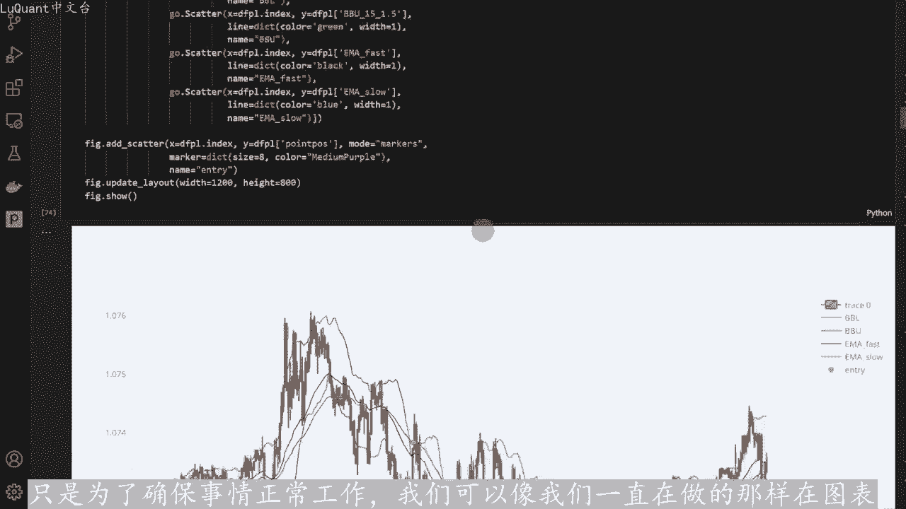

向上的动力，两个移动平均线，快速移动平均线暂时高于慢速移动平均线。让我们比如说7根蜡烛后蜡烛的数量，显然这里没有绘制的RSI在一段时间内至少5根蜡烛也大约是5。并且其中一根蜡烛的收盘价低于狂欢者的下限。

这就是为什么我们产生了这个看涨信号。显然它运作良好，这是一个看跌信号，它看起来也很棒，这是一。😡，看见信号我们确实有一个向下回撤，它不是很宽，这里没有高波动性，但价格仍然显示出之后是红色蜡烛。

正如您所看到的这也是一个看涨信号。因此从这里看到的情况来。😡，它运行良好，我们将在稍后的视频中对此进行非常彻底的测试，现在进行回溯测试。我们可以获取一部分数据框架使用回测。例如，在拍一包中。

我们可以创建一个我的策略类。

在此处定义我们的信号。因此，如果我们有看涨信号，并且我们一次允许一笔交易。因此，交易或当前未平仓交易的长度等于0，那么我们定义我们的止损和止盈，我们应用买入头寸，这样我们就可以通过市场头寸。然后如。嗯。

信号看跌，它等于一，并且我们在市场上没有任何未平仓交易，与我们定义止损相同损失止盈。我们建立一个空头头寸，然后我们定义大小，我们将止盈和止损作为参数传递，然后使用这个类，我们可优化。

我们可以在这里定义一个回溯测试，所以我们从现金250美元开始。比如说保证金为一超过30。所以这是一个1到3的杠杆定义了我的策略。所以我们将我的策略作为输入参数和数据框架传。

其中我们有开盘价、最低价和收盘价，然后我们有统计数据和热度地图，因此我们将使用这些进行优化，并且我们将使用此函数来优化策略，我只是传递一个网格样。

来搜索止盈止损比的最佳参数，因此，风险回报率不知何故，止损系数是基于ATR距离的止损距离。我们将AT2乘以。系数，这就是我们定义止损的方式。该止损考虑了市场的波动性。因此，当我们运行此优化时部分数据。

所以我们只使用5000根蜡烛记住5000。如果我们计算一下，那就是5000时间5分。

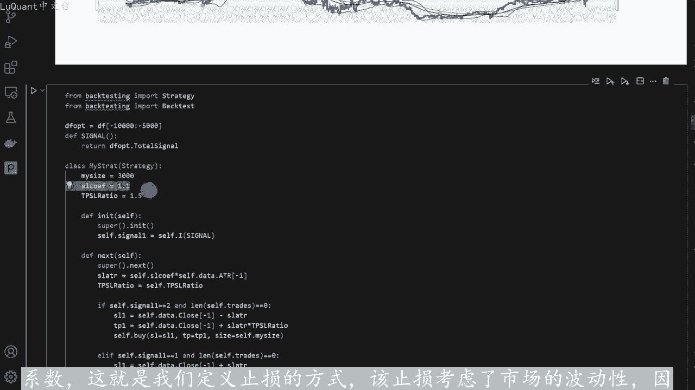

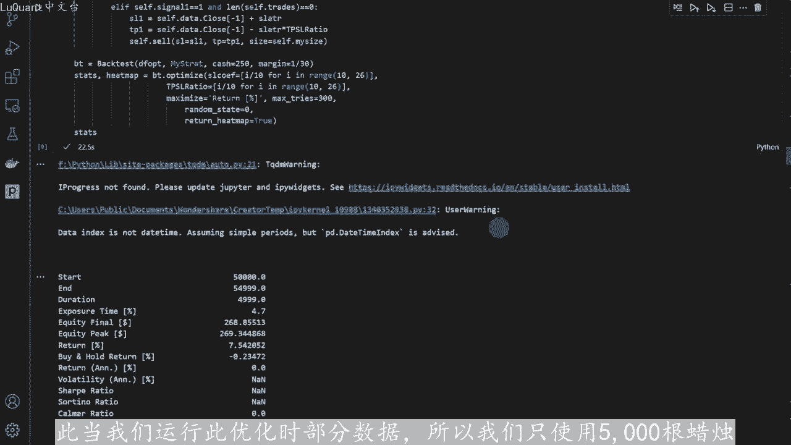

因为我们处于5分钟时间范围内除以60，这等于416小时除以24，大约为17英此。在这三周的近三周交易日中，我们可以获。

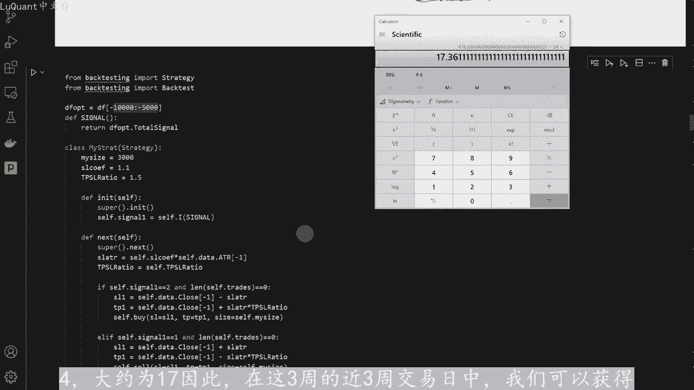

7。5%的回报，而买入并持有的回报为-0。23。我们的平均下降为0。6%，平均或最大下降几乎为负负2%。所以。对于三周的交易来说还不错，胜率达到52。8%，现在这是最好的条件。记住，这些是最好的参数级。

如果我们在应用此测试之前，首先应用前项测试会怎样？我将向您展示参数。所以这里我们这些。优化参数，因此，止损系数为1。1，止盈止损比率也是1。1。如果我们在热图上可视化结果。

我们可以在此处看到止损系数YSX轴上的止盈止损加比率，该区域全部为。

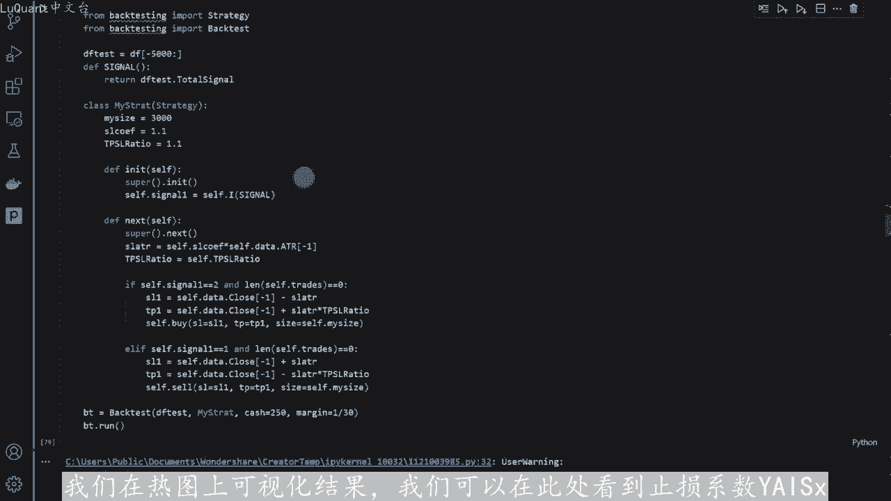

我们应该坚持该区域。因此，我们将使用1。1或1。2的止损系数，以及同样的止盈止损比率11。1或1。2。现在只是为了保持在这个证据。前项测试的想法是在新数据上测试这些参数。

因为显然这些参数将在这些数据上工作，因为我们已经调整了这些参数，并且我们已经使这些参数适合工作在这组数据。

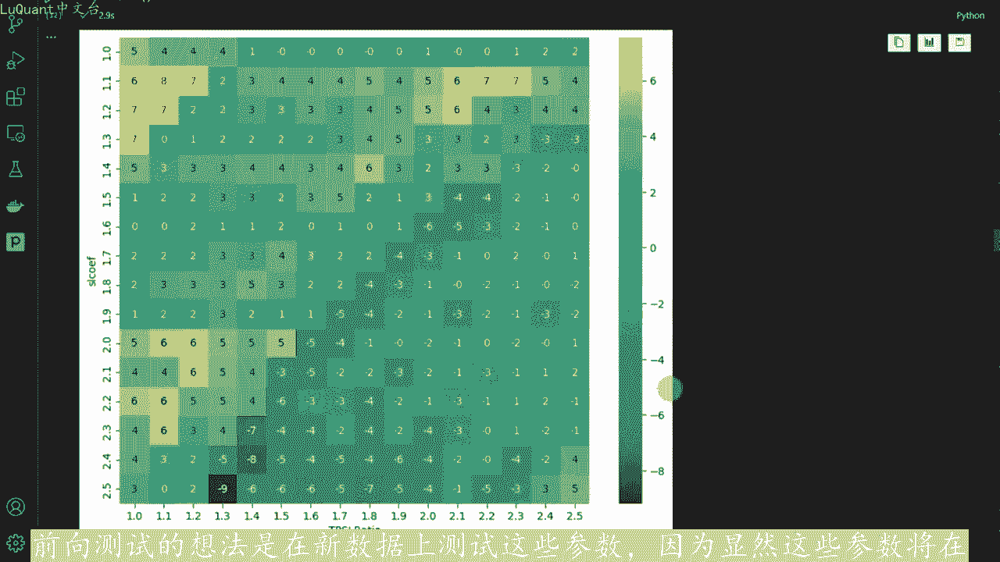

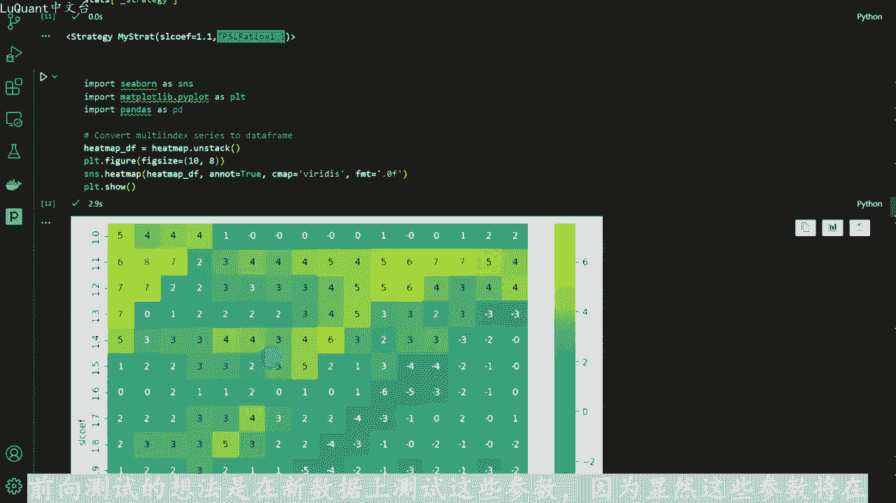

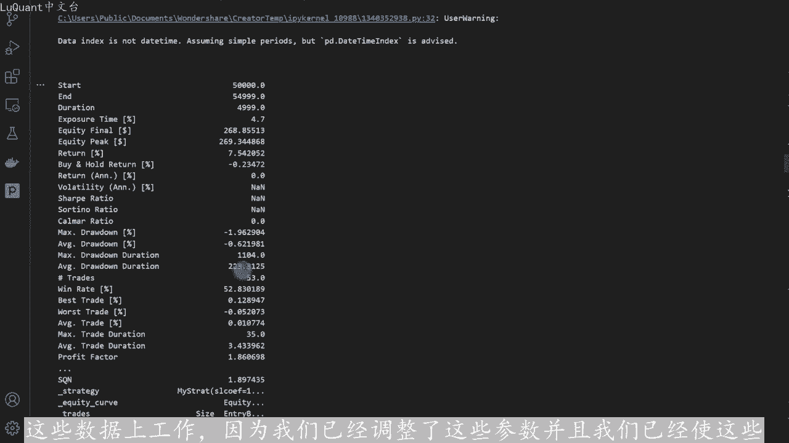

我们讨论的范围在main10000到5000之间。所以这些是我们用来训练模型或你和模型的5000根蜡烛。如果我们现在在大多数情况下尝试相同的参数结果会怎样？最近的蜡烛，所以。-5000到最近的蜡烛之间。

蜡烛的数量相同，基本上是5000根蜡烛。所以我们将定义一个新的切片，一个新的数据框来测试。所以5000到最近的蜡烛最重要的是技。

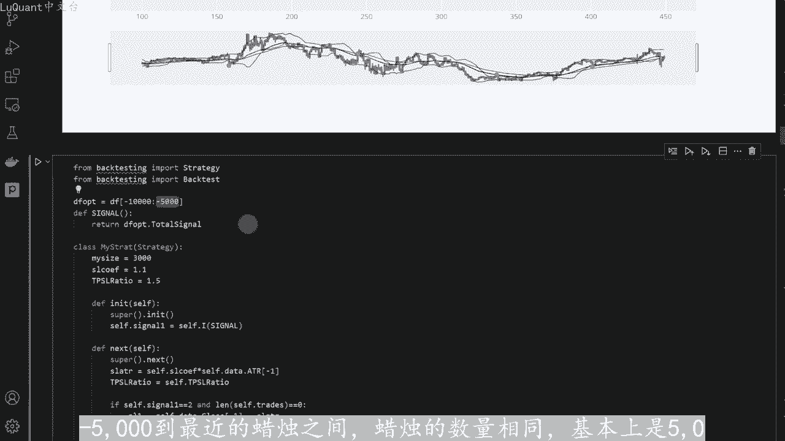

模型回溯测试还没有看到这个数据。所以我们从这个优化中获得了这些参数1。1和1。1。这个优化是在前一组蜡烛上进行。

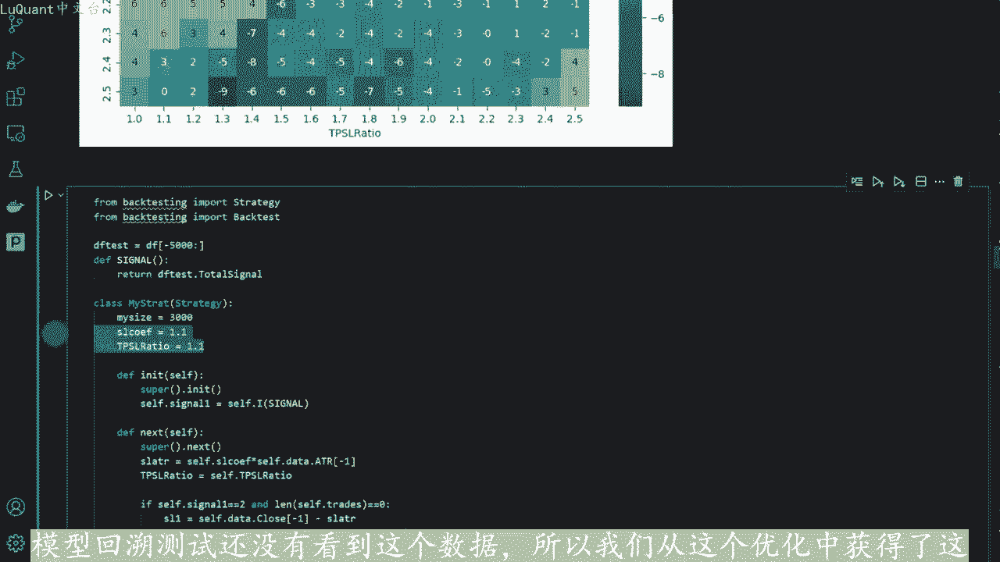

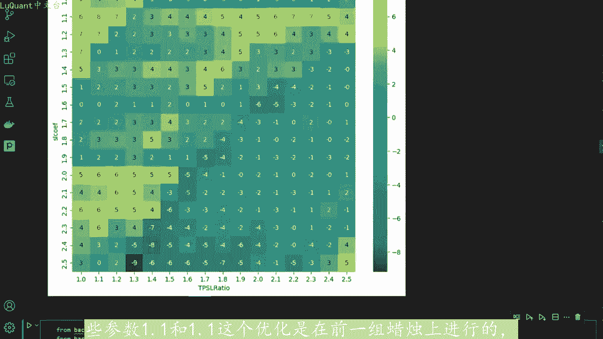

所以现在我们正在模型的未来中运行。如果我们测试这个，我们请注意我们的回报率为8。39%，所以这是一个好兆头。这意味着，如果我们的模型适合当今的市场，并且我。😡，在接下来的三周内使用这些参数进行交易。

我们也应该期待一些积极的结果。因为市场并没有一天内发生变化，通常不会在24小时内发生变化，或者很少发生这种情况。通常需要一些时间才能从一组或一组转换到另一，我们实际上指望市场的惯性，这就是为什么？

如果我们适合过去4个星期，我们预计模型至少可以在接下来的一两周内工作。所以我们将滑动窗口每次试和3到4。

星期并在接下来的两周内测试模型或三周以及绘制资产，它看起来非常有希望。所以我们有一个积极的资产，它总是在攀升。正如你所看到的，我们在开始时有一个稍微下降的时期，但我们可。😊，实际上衡量这一点。

所以它在左右1000只蜡烛或最多2000只蜡烛，所以2000只蜡烛2000只蜡烛大约是5天左右。我们可以再次计算一下，2000乘以5除以60除以24，我们几乎有。天的时间，所以甚至不是两周。

也就是一个半星期。因为我们现在在这里谈论交易日，我们还可以包括收支平衡方法。因此，在回溯测试部分中执行此操作的方法是，当我们想要开立交易时，我们将开力量。😊。

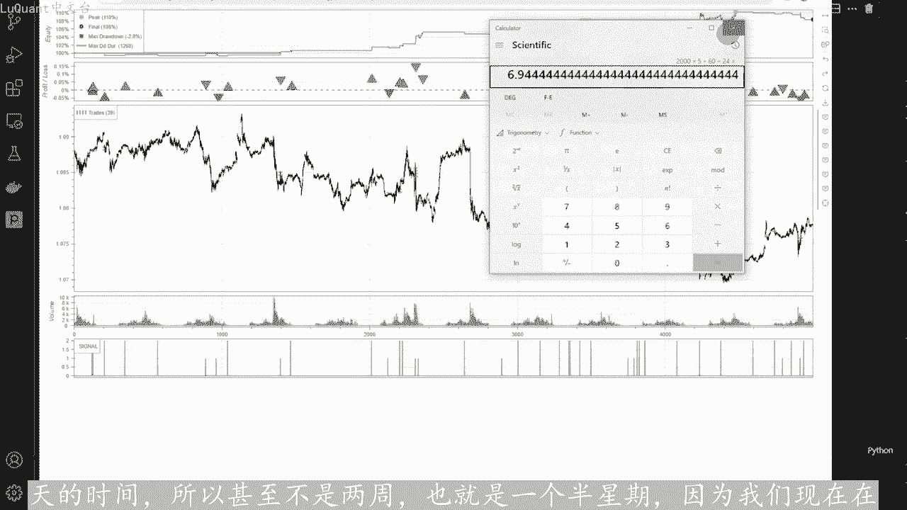

交易，但不使用尺寸，我们要开立两笔交易的手术，但每笔交易的手数各为一半，止损基本相同，止损距离，但止盈不同。第一个是止盈。因此。盈相同到目前为止，我们一直在该策略中使用，但是第二个止盈是其一半。

止盈二等于止盈一减去距离的一半。因此减去ar止盈止损比率除以。因为这是这里只因一等于自我数据。收盘价加上止损ATR时间利润止损比率，我们也可以用不同的方式编写它。因此，止盈二也可以是当前蜡烛的收盘价价。

止损ATR系数比率乘以止盈止损比率除以2，这样我们就添加了距离的一半。以其他方式我们将交易分成两部分，两部分大小相同。我。只是用两个不同的指盈来区分它们，其中一个是一半空头头寸的。

另一个基本上也是相同的，所以它没有太大区别，所以我只是复制使7等于获利2，因为这样更清楚。我假。减去任何除以2的值，我们用一半的距离来指挥这部分，这样我们就可以测试它，我们可以运行它。

我们可以看到我们有2。15%的回报，而采用收支平衡方法，则有8。39%的回。😊，通常我们实际上介绍了收支平衡方法，试图限制下降，所以我们有最大下降百分比为2。8，平均下降百分比为-0。49。

让我们看看我们这里有什么。所以我。有-2。3平均下降，百分比为-0。56，没有做太多的改进，它也限制了我们的总回报。所以2。15而不是8。39。所以我们可以跳过使用它。我们可。在这里测试所有类型的组合。

这就是这段代码的美妙之处，并在pyython中进行回溯测试。因为它是免费，您几乎可以尝试所有您想要的东西，并为您自己的交易提出最佳优化的情况或策略。现在这是一个单。迭代。我们将付1万切成-5000。

我们拟和我们优化策略的参数，我们将这些参数应用于-5000到最近的蜡烛。但我。需要在我们拥有的数据的整个历史上执行此操作。为了做到这一点，我在一个函数中定义这些，这些可以写在更好的方法。

我只是想确保他们尽快工作，以便能够发布视频。但是您可以。😡，类放在外面，将其作为参数传递给函数，并以更优雅的方式编写所有内容。如果我们有任何计算机科学家或软件工程师正在观看这个，请不要因为这个而责怪我。

他可以工作，你可以按。你想要的方式重写它这个称为fi over参数的函数，采用我们称之为数据帧测试的数据帧。所以我们再次定义信号函数，它是一个本地函数，现在它将返回数据帧测试总信。

然后我们定义我的策略类，我们在函数内部进行优化，然后函数返回优化后的止损系数和止盈止损比。所以我们基本上是。优化这个函数，优化，我只是将数据帧传递给我需要使用的数据针切片，然后它将为我提供最佳的参数级。

因此，该函数将执行拟合或训练部分，还有另一个称为测试参数的函。获取用于测试参数的数据帧输入参数。所以这些基本上是我们从上一个函数中找到的那些。它对新数据帧或测试数据帧进行测试，并且它。返回返回百分比。

所以它是将从统计中仅返回回报百分比。这就是我们如何使用它。所以我们调用test store参数，我们给它一片数据帧，我们给它参数，它将显示回报和百分比。所以这。是7。54%，让我们再次运行它。

看看它在小数据集上提供了什么似的。所以它在我们感兴趣的切片上是7。54%，只是为了确保它正常工作，我将把-5000添加到最新的数。使用这些参数的蜡烛，我们应该得到大约800分号8点39。

所以我们找到了与之前相同的数字，这是一切正常的证明。我们现在没有任何错误，这是应用前进的地方。应用测试或前项测试。首先我们需要定义一个周期。因此您需要多少切片？5000个蜡烛切片，6000或1万个切片。

具体取决于您要如何进行测试，然后一半只是一个整数及周期的一半，因此这里将是2500。例如，然后我们创建一个列表空列表，我们将在其中附加结果每个配置的返回结果。然后I的范围在-6万之间。因为这是多少我们。

最大的数据框架或迄今为止拥有的CSV文件中拥有的型。因此，如果您有更大的数据文件，您想要下载一些东西，比如说5年的数据，您可以将其更改为更大的数字。然后我们我们将。-6万到-2倍之间应用这里的周期。

并且不长等于我们打印的半个周期。我只是作为信息，而测试和你和正。运行只是为了知道我们在这个中的位置这个测试和这里的数据帧，我们要应用一个切片。第一个切片成为数据针下划线拟合，因此它在I和A加值。

然后测试部分在未来，所以它是I加周期，最多为A加的两倍。未来一段时间，这里的拟合发生在数据框下划线拟合上参数。A和B这些将用于测试，这是数据框非核心测试。考虑到通过以下方式找到的最佳A和B参数。

然后我们将前面的函数附。到此列表中的返回百分比，稍后我们将使用该列表，因此这将有点耗时，具体取决于您传递的数据的大小。因此在这种情况下，他将我认为不到1分钟或30秒，所以这是每次迭代。所以。要喝杯咖啡。

也许是一块巧克力，完成后回来。所以现在让我们检查列表的内容，所以这些是我们的返回是回报。所以我们有13300分号，500分号6。700分。😊，9%等等。我们可以检查总体总和是46%。

所以我们需要一直处于正数。显然，我们可以为每个时期绘制条形图或我们正在测试的切片。因此我们有。

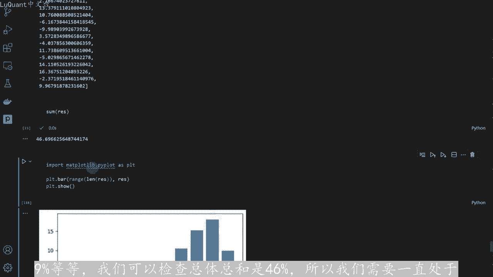

正负回报等等。然后我们还可以绘制整体权益。但是请注意，我们将窗口滑动了一半的时间段。因此，我们重叠了我们的测试，以增加并增加数据的数。和测试的数量我们正在这样做。如果你想这样做。

正确的方法是每次增加这里的周期，而不是半周期或整个周期。在这种情况。我们会以某种方式模仿真实的交易案例。因为每次假设我们拟合两周的数据，然后我们交易两周，然后我们拟合这两周。

然后我们在未来与另外两周进行交易。所以为了做到这一点，我们可以。这里使用T period，现在我们不必再将其乘以2，我们可以将其限制为T period，从U模拟的角度来看，这更现实。

但是如果你想增强您的数据，我们可以按照我们一直在做的方式进行。在我再次运行之前，也许这次我会去吃了冰淇淋，我们需要几分钟，然后我们会回来。所以现在我们有我们的结果。

我们有30百分号、1300分号、6点700分号、1。9等等。我们可以检。我们有34%的总和，我们可以显示每个周期片段的U回报。所以我们有加13减去一些东西，加上减去和正如你所看到的。当他工作时。

工作的很好，有时他也会输，我们可以绘制实际的模拟图。我们有一段时间的停滞的资产，所以这里没有发生太多事。

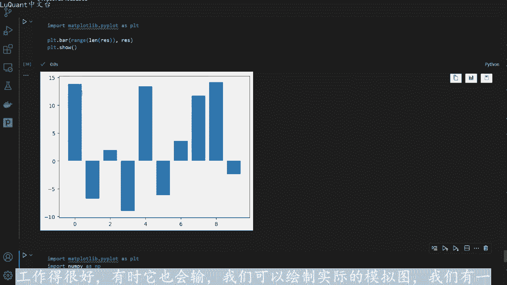

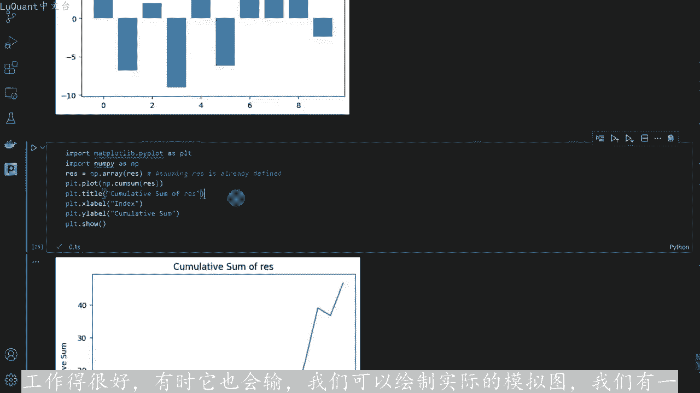

但随后我们有这个尖峰，他保存了结果，我认为这不是结论性的。我们不能说这是一个有利可图的策略。说实话，我们需要在更多的数据上进行回溯测试。比如几年，但至少。😡，那一年，我们考虑了我们拥有的数据。

看起来这是一个有利可图的策略，这是一个有利可图的策略。这包括我们正在尝试适应的前瞻性测试，然后我们将在未来进行前瞻性测试，这是模拟现实生活场景。😡。

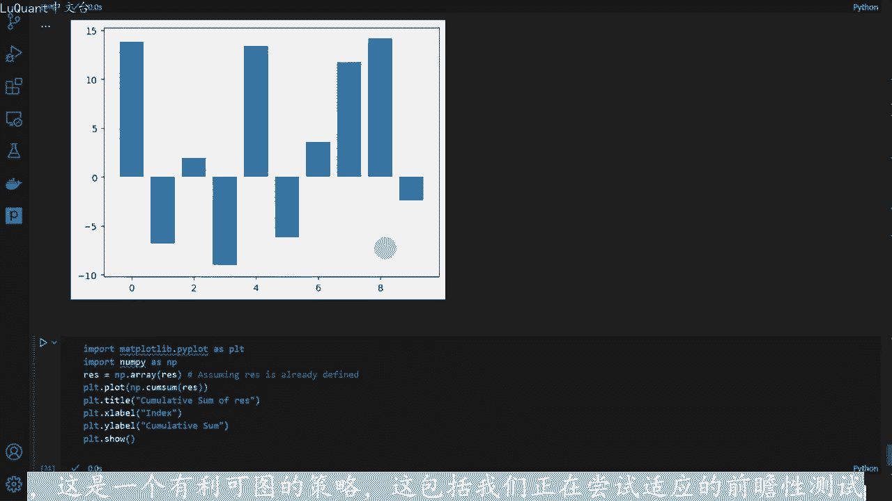

就是我们在现实交易中的做法，我们将尝试适应过去三周的数据，然后尝试使用下个月或未来几周的参数，然后再尝试适应，并再次优。只是为了回答我在评论部分读到的问题之一，例如，多少优化是太多优化，没有规则。

没有严格的规则，但您可以在此处更改切片宽度，以便您可以尝试并适应上个月。最后几个月并使用接下来4个星期的参数进行交易，或者您想要适应最后三周的数据，只需使用数据进行一周的交易。

然后一周后再次适应最近三周等等。所以没。规则没有秘诀，可以很容易的做到这一点。但是无论你采取什么策略，如果策略是公平的，并且是有利可图的。那么他总是在有利可图的一面。所以他应。只要你有足够的数据来适应。

就没有多大关系。所以假设在5分钟的时间范围内，3到4个星期就足够了。这很好的为模型提供了足够的数据来适应并研究市场。然后你可以用这个用这些参数进行交易。假。😡，现在再次你和之前一两周。

如果你对收支平衡方法感兴趣。那么它应该是在这里，你可以实现它并向前测试，它我保留它，你在代码中。所以当你下载代码。你可以使用它，我想让这个视频尽可能短，所以我们不会在这里测试所有的可能性。

一些想法将被优化，不仅考虑到百分比返回，可能会以某种方式最大化主要等。😡，因为它是负数，所以当你最大化它时，你实际上是在最小化drawdown。

也许最大化drawdown或最小化dropdown持续时间或任何其他可能把白天作为所引的事情，这将使我们能。访问夏普比率sino比率和CMA比率，我们可以尝试基于最大化这些比率之一进行优化。例如。

为了增加信号数量，而不是根据收盘。

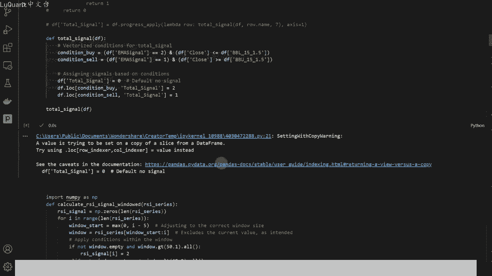

是否高于收盘价生成信号或低于biner带。在这种情况下，如果蜡烛开盘价高于或低于biner带，我们还可以包括蜡烛的开盘价。以此类推，我们可以在此包含和测试许多参数和优化以及可能。策略总而言之。

他应该会带来相当积极的回报，不要期望太多的回报。所以你可以看到几周内你每月或每几个月获得大约10%，只要你正在使。

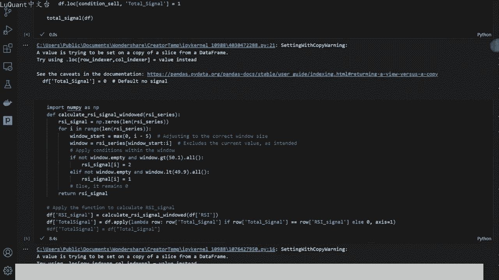

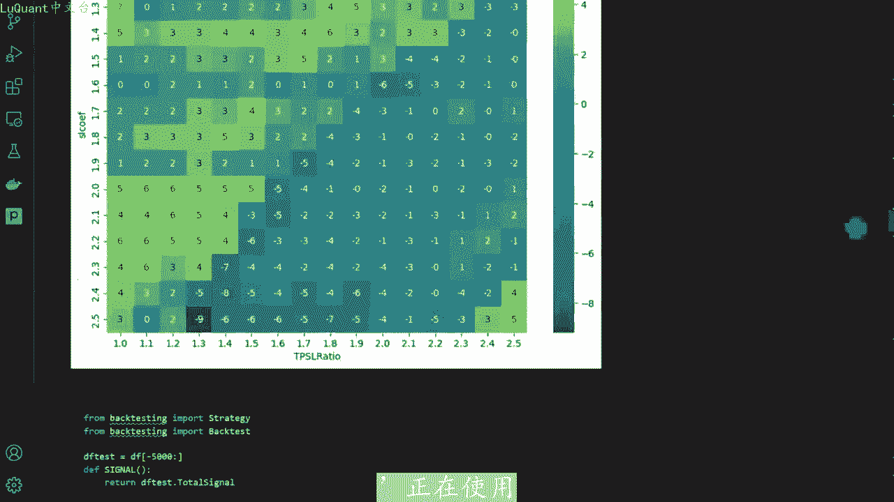

他因为预计会有相当长的下降持续时间，所以我不喜欢这里，我们有1。50005000根蜡烛，所以大约需要3周。所以当我们谈论这部分。

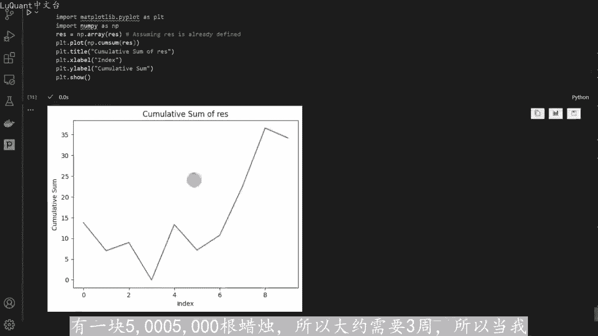

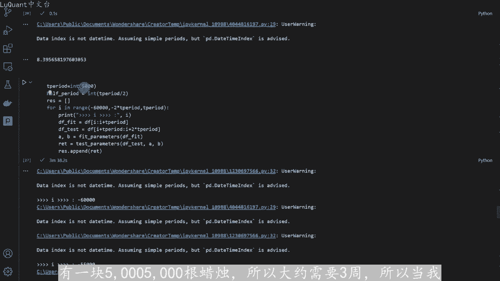

他是三周加六周，然后是9周等等。所以大约4个月了，我们没有看到任何惊人的表现，只有最后的数据片以某种方式挽救了情况。所以你可能还。

改变这里的5000，所以这个切片可以轻松更改。您可以根据您的交易风格放置6000或8000甚至3000，也许尝试不同的时间范围。所以这里我们使用5分钟时间范围，也许15分钟或30分钟可能可。噪音较小。

也许效果会更好。我还没有尝试过这些，所以有很多可能性，但他也有很多工作需要很多时间。这就是这个我希望你们喜欢他，并发现这。

信息很有帮助，直到我们的下一个视频交易安全。下次。😡。

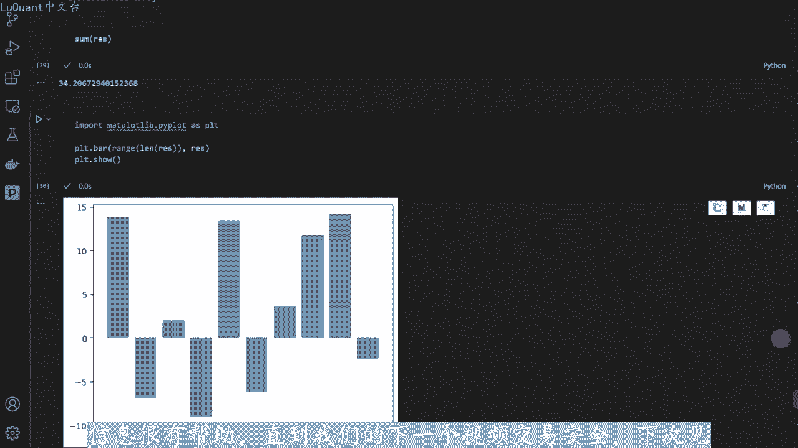