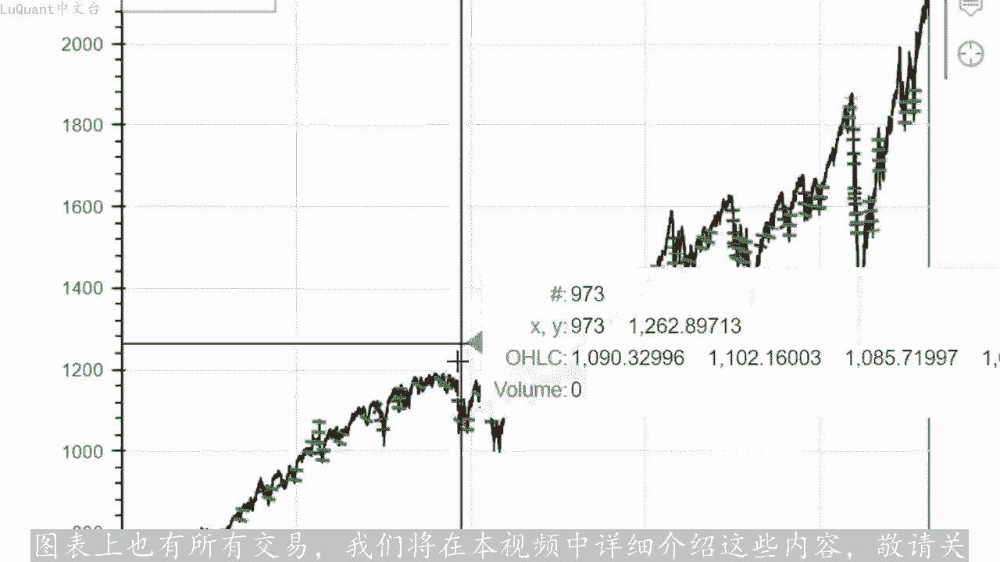
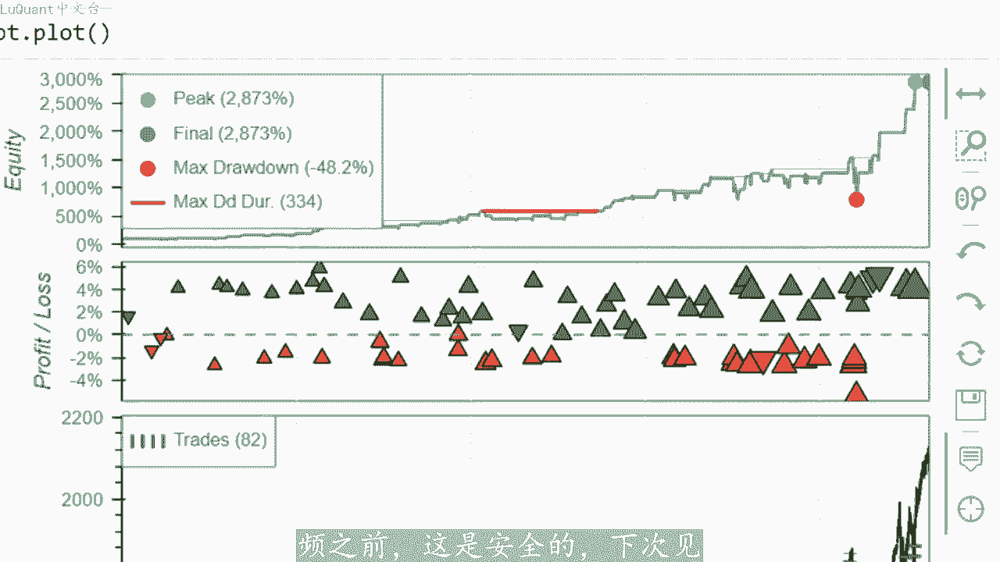

# python量化30：布林带策略 - P1 - LuQuant - BV1s2421P76R

大家好，在本视频中，我们将描述一种极端优化方法，以显示某些参数对我们交易系统的影响。这是迄今为止，我们在这里实现的最佳优化。因此您可以看到我们有大约3000的回报，并且我们有该图表上还显示了不断增加。

😡，交易的股票详细信息，我们将在本视频中解释这些交易。我们在价格图表上也有所有交易。我们将在本视频中详细介绍这些内容，敬请关注请小新。我从该策略中榨取3%万%回报的方。

并不是最安全的使用方式，我绝对不推荐将这些参数用于实际交易。但在我看来，该策略本身是一个非常好的策略，并且它具有出色的性能。如果您是新来的，该策略依赖于针对趋势市场的Rnoing band策略。

我们已经。

第一个视频中尝试过效果极佳。我想说风险很小，我不会再次详细介绍，但您可以按照第一个回测视频来自描述中的链接，并且pyython代码也可用于该视频。如果需要的话，我们将尝试应用极端参数来首先获得相。😊。

较大的回报，因为这样做很有趣。我的意思是，测试很有趣。其次，因为我们可以在这个过程中学到很多东西，也许我们可以达到一个能够带来实际高回报的设置，所以让我们跳进代码，看看一切是如何进行的这就是我们。😊。

Jupyter笔记本文件第一个单元格井用于加载数据，我正在使用外财务，并且我仍然收到很多评论。例如，我们如何加载数据，因此，从历史数据库加载每日数据的最简单方法就是使。wifi模块，您只需使用一行。

即可将数据加载到数据框中。例如，我正在加在2011年至2021年间这只股票的russell1000指数。因此这些是仅使用一行加载的10年数。不管怎样，我们正在清理当天的数据。

我正在清理所有没有任何价格变动的日子，可能是周末、银行假日等等，重置索引并打印数据框的头部，只是为了检查我们是否有正确的数据数据格式，我们正在正。😡，使用此数据框。

然后我使用pas underscoresp技术分析模块来计算技术指标。例如移动平均线，我在这里使用两个移动平均线，并将它们添加为两个新功能进入我们的数据框架。所以我使用200指数移动平均线和150。

移动平均线。因此，如果快速移动平均线M2高于较慢的移动平均线即M在这种情况下，我们处于上升趋势，反之亦然我们处于下降趋势的方向，这是我添加到算法中的第一个修。

然后我使用长度12RSSI以及使用相同的pas下划线踏包。因此这是使用此处的这一行添加的，并将其添加到我们的数据中框架。所以我们有布林带每天的RSSI值，我修改。

reerO本人使用的最后两个视频中的长度20，以及我在这里使用2。0，而不是2。5的标准差。及其原因。我使用这两个参数对布林带进行了这些修改，目的是使系统的选择性降低。我们将获得更频繁的信号。

并且在回溯测试结束时，将获得更多的交易数量。因为那些看过第一个视频的人，您已经注意到这是一个出色的系统，但它的选择性太强，以至于我们的交易信号太。因此，平均每年两次，我们正在尝试在此优化中增加此频率。

而不是像我们在前两个视频中解释的那样使用RDMA信号或指数移动平均信。使用两个MI信号，就像我现在有两个移动平均线一样，一个快，一个被认为慢。正如我们之前提到的那样。

当快速移动平均线高于或低于慢速移动平均线时，我们决定是否。上升趋势或下降趋势，因此再次完成此操作，并将其添加为新信号。我们将MI信号调用到我们的数据框中，这里的函数基本上是与前两个视频相同。简单来说。

我们正在测试收盘价是否低于布林线下。同时是否有MI信号处于上升趋势，例如等于2。在这种情况下，我们有买入信号表明我们精确定位在当前蜡烛的收盘价。正如您所看到的，我们这里有一个参数称为百分比这。

您想要下达买入或卖出订单的位置，但在本视频中，我们使用0。因为目标是增加交易频率，只有当我们能够降低系统的选择性时才提供这一点。因此我。目前将保持0。同时，如果我们有下降趋势，这意味着MI信号等于一。

并且我们的收盘价高于布林线较高线。在这种情况下，我们有一个卖出信号，该信号恰好位于当前蜡烛的收盘。因此，我们可以验证数据框检查的当前状态。无论我们在哪里有一个不同于零的订单信号，这意味着我们有买卖信号。

这些信号显示在最后一列中，这是订单信号。因此我们。收盘价其中确切的信号以及发出信号的价格，我们可以继续并在我们的数据图表上可视化这些信号。这些紫色点是我们可以看到的信号，所以我将放大某个地方。

以便看得更清楚，让我。😊，将他们放在这里，这样我们就有了第一个移动平均线，一个高于慢速移动平均线。同时我们有一个收盘蜡烛低于布林线下轨，所以我们在这里有一个买入信号，这个紫色点是一个买入信号，这里也。

两个买入信号，他们并不全部完美的信号。但我们可以看到，使用布灵带与移动平均线相结合的入场点令人印象深刻。为了继续进行回溯测试，我们需要退出策略或如何关闭为平仓交。

所以首先我们要检查交易是否已开启超过10天，无论如何，我们都会将其关闭。我们不想陷入超过10天的长期交易，我神至发现10天太多了，但为了这个目的测试时，我们将留下。😡，我们将退出交易，我们进行多头交易。

RSSI高于75，或者如果我们进行空头交易，RSSI低于25。现在以防RSSI不足以退出以平。我们还将使用止损，该止损将是当前蜡烛的当前低点或前一个蜡烛的低点乘以一减去一定百分比之间的最小值。

因此我们将。用户指定的一定百分比内低于最后两根蜡烛之间的最低点，这个可变百分比。例如，为了这个特定的测试，我将采用2%，我们将暂时使用2比1的止盈止损比率，以防我们。上升趋势。而当我们有下降趋势时。

我们在相反方向买入，并且我们设置止损。显然，这将是两者之间的最大值。当前蜡烛的最高点和前一根蜡烛的最高价格。我们将。止损价格上添加一定的百分比，因此它将乘以一加百分比，此处为2%，只因为止损距离的2倍。

所以这基本上就是我们添加了一条移动平均。只是为了使用两条移动平均线来检测趋势，它是上升趋势还是下降趋势？当我们拥有多头和空头头寸时，我们将修改方式，我们通过在RSI条件之上添加止损来退出，以防RSI条。

不够，并且我们还减少布林线长度值14，而不是20和标准差2。0。而不是2。5，现在棘手的是部分，是我使用了一笔15的余量，这有点冒险，但这只是一。😡，有趣的测试。

这就是我们如何实现31000百分号或32000几乎作为回报。所以你可以看到我们开始有了1000美元现金，10年内我们可以达到32万的股本风。现在显然这是不现实的。

因为我们没有在交易之上添加任何佣金或任何费用，但是调整参数很有趣，在某种程度上，我们正在增加近60%的胜率等等。所以如果我想变得。现实首先我会减少利润，我不会采取超过5分之1的方式来减少利润风险。

我将首先向您展示结果，所以我们仍然在2700%左右，这还不错，因为十年后的回报。每年约为277%。当我们查看股本时，我们可以看到我们有一条不断增长的曲线。在这1年里，除了少数几个回撤周期外。

大部分时间都是上升的。对于任何算法或任何交易者来说都是正常的。同时我们可以看到，斜率一开始并不那么令人印象深刻，但它达到了在10年结束时，我们可以看一下价格图。我们可以看到这里变得非常波动。

这就是我们开始损失大量资金的地方。我们可以在这里查看那些大额资金，他们显示亏损交易的三角形，但它们的尺寸相对较大，而且我们也。😊，大的绿色三角形显示，在这10年期间结束时的大盈利。

因此我们可以更深入的研究这一点，并检查为什么算法会以这种方式运行最后。因为这在最后看起来非常。但它也有风险，因为这也是你可能损失很多钱的地方，这可以通过以下事实来解释。

我们正在用我们的大部分股权进行交易，及我们的资金的99%，我们采用1到5的保证金。1到5的杠杆，这意味着，当您因为到目前为止一直在赢钱而增加您的净值时，同时您使用5分之1的保证金。

这意味着您正在以大量的钱，这就。为什么只要你赢了，你的跳跃就会随着时间的推移而增加？当然，如果你陷入亏损，损失和赢的都会变小，这就是为什么你一开始的分数很小，可能是亏损交。😡，或盈利交易，这并不重要。

所以这些点相对较小，他们会随着时间的推移而增加。因为您的资本在增加，这就是这种类型的策略或资金管理，意味着使用99的净值进。😡，交易变得危险。但是同时如果你有一个安全的策略，它也会非常有价值。

最有趣的部分实际上是这些交易的数量，它是82笔。我。在10年内实现了82笔交易，平均每年8笔交易。请记住，在第一个视频，我们得到了非常好的结果。随着净值的增加，但问题是交易数量。

所以我们在10年内只有23笔交。即每年两次交易，我们优化视频的目的是增加我们的回报，同时也增加交易数量。因为我们希望得到更重要的统计确认，证明这个系统是值得的。对于那。喜欢赌博风格的人。

因为我们在这里不玩真钱，我们可以增加我们的净值保证金为1分之15。我们可以再次运行。这个我们可以看到我们的图。是的，我们最后有3万3%万。但是看。😊，当你有一个回撤期。

并且你使用了很大的保证金时会发生什么？所以这是您可以在这张图表上非常清楚的看到风险。通过启动方式证明在您面前，就像我们使用它一样，我们使用了5分之1的余量，我们还没有看到如此大。😊，Frow down。

那只是因为我们增加了。现在如果我们的利润率达到20分之1，我想我们可以总计出来。是的，所以我们的回报率为负100%。而我们的算法将无法在回撤其中幸存下来。将绘制此图，我们可以看到回撤期将消除我们的账户。

好吧，所以这就是这个视频，我希望你们喜欢他，我将在这个特定策略上投入更多时间。因为我仍然相信我们仍然可。😊，在以下方面，带来一些改进交易系统的稳定性和安全性，只是为了让事情变得更清晰。

并避免现在的那些小幅回撤。对于那些好奇的人来说，您可能想要购买不同的股票，并在不同的股票上尝试该系统，它可能会稍微调一些参数，而不是不灵贷可能是移动平均线左右。只要你有一个明确的趋势，它就会起作用。

所以它会自动为你做事所有算法的问题，很难应对波动的市场。只要你使用趋势市场，如果你们喜欢这个视频，你们会看到非常好的结果，请发表评论。如果你们有时间的话，请订阅在我们的下一个视频之前，这是安全的。下次。

😡。

