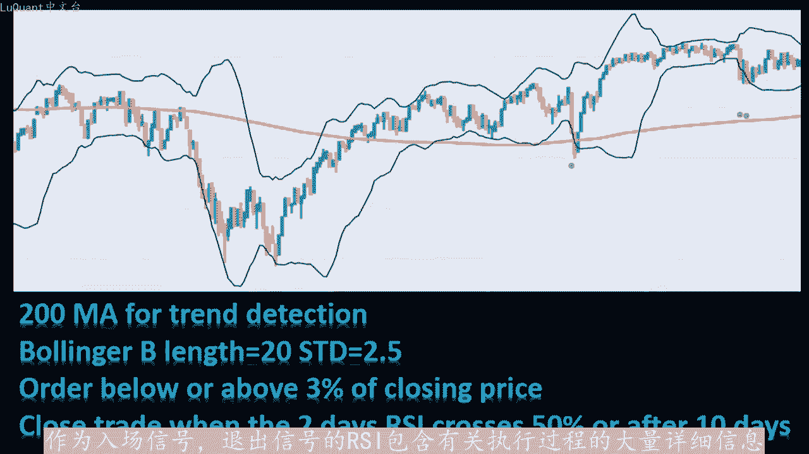
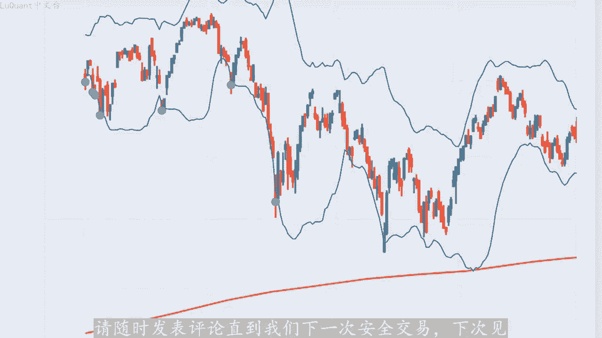

# python量化31：布林带策略2 - P1 - LuQuant - BV1SJ4m177vg

今天我们正在优化我们在上一个视频中回测的莱纳西奥布林带策略。因此，如果您还没有先观看该策略，那么在检查有关优化的这一部分之前，最好先观看一下我将在下面的描述。如果您。第一次访问此频道。

我们总是会发布可从描述中的链接下载的python代码，这样您就可以暂时欣赏视频。如果您对编码部分感兴趣，所有这些都可用于您的实验，该策略具有良好的潜力，胜率为91，并且多年来盈率不断增加。

因此这是10年前。测试我想尝试和优化的原因是因为数量较少。我们可以看到，10年来我们只进行了23笔交易，因此每年大约有两笔交易。这里我们通常有两种解决方案，我们可以在1只不同的股票上并行运行这个程。

每年大约进行20笔交易，但是然后我们需要避免相关市场的问题等等。另一个解决方案是尝试缩短我们的时间框架，并使其获得更多交易数量。该策略使用移动平均线指标和不灵。作为入场信号。

退出信号的RSSI包含有关执行过程的大量详细信息，我不会在这里重复所有这些。因为他们已在上一个视频中进行了解释，但现在让我们跳入该程序，看看它在4个小时的时间范围内可以提供什么？

所以这是我们的第一单元格，这是我们加在数据的地方，我们可以看到我现在正在加在4个小时的时间范围，我们有两种不同的股票，我们将一起尝试。我们也在清理我们的数据，从我们没有任何运动的烛台来看。

我们的烛台最高。😊。

等于最低烛台，这些烛台将从我们的数据框中丢弃，然后我们将技术指标添加到移动平均线。因此我们将其称为MI指数移动平均线。但我们可以尝试指数移动平均线或简单移动平均线。对于这个特定策略没有任何区别。

我们也可以修改具有不同长度的RSI。因此目前您可以看到，我们有移动平均线长度为900900根。RSI长度为12根，而对于日线图，我们使用200M和2天RSSI作为退出信号，布林带我将其保留在日线图上。

因此长度为20和2。5的标准偏差。我们当然也可以对这些值进行实验，也可以测试蜡烛。交易价格是否高于或低于移动平均线。我保留了数字6，因此我们正在测试是否有6个连续的蜡烛高于或低于移动平均线。

在这种情况下，平均区线如果我们正在研究4小时时间范围，6乘4就是24小时。换句话说，如果价格连续24小时。😡，高于或低于移动平均线。在这种情况下，我们可以得出结论。

上升趋势或下降趋势我还消除的参数之一是订单在市场上的百分比位置。因此请记住，我们将订单置于低于或高。当前蜡烛价格3%以内的订单，但在本例中是为了增加我们正在执行的交易数量为0。因此。

如果超过可视化部分的布林线限制。我们会将订单设置为与蜡烛收盘价接近的订。我们可以看到，我们有布林线移动平均趋线趋势是上升趋势。我们可以看到紫色点，我们在这些特定点有这些入场信号，因此这些是买入信号。

我们可以看到，入场点对于趋势市场来说几乎是完美。至少我们可以验证一个这里有更多信号，所以我们有两个连续的信号，这也是一个很好的切入点。我们可以尝试不同的随机位置。比如说从1500切片到1750。

我们可以再次检查。所以我们有这个切入点，这是一个很好的切入。这个也适合买入头寸，这个非常适合买入。而这些则不太好，因为此时我们的市场波动很大，但我们可以看到，当我们有良好的趋势时。

该算法会选择一个极好的切入点。这样我们就可以再检查一下图表上是否还有其。😊，信号这些是买入信号，它们是完整的信号。因为现在趋势是向下的，但我们还没有检测到它，因为我们仍然高于移动平均线。

所以一旦我们低于移动平均线，我们将开始执行卖出信号。我向您展示所。😊，这些的原因是，由于我们的算法中有不同的参数，因此我们必须从哪里开始优化部分和入口点，这意味着布林带相关参数似乎为了完美工作。

我们不必修改有关部。带参数的任何内容。因此，我们坚持使用20天的长度和2。5的标准差。正如我们在这条线上看到的那样，因此我们的长度等于20和标准偏差2。5。不会从修改这些开始，因为他们工作正常。

入口点看起来相当不错，所以我们正在寻求优化算法的不同部分，我不会详细介绍回测部分的所有细节，但有些参数很重要，请注意此处的退出测。取决于建议的RSSI之reer shield在本例中为50RSSI。

如果我们有多头头寸，我会将其更改为65。如果我们有空头头寸，则将其更改为小于35%的RSSI。将是我们的退出策略，它似乎给出了更好的结果。我们很快就会在图表上看到这些结果。

所以这些是针对4小时图表或4小时时间范围优化该算法的第一个结果。我们的购买回报率为424%。😊，回报率仅为49，因此，该策略比购买或投资股票赚的钱更多，胜率约为65%，交易次数为20。

该数据是5年的历史数据。因此10年内它是大约40，我们可以推断并得出结论。使用每天的时间范围，我们每十年有40笔交易。在这10年里，我们只有20笔交易，所以平均每年有两笔交易。而现在在4个小时内。

我们平均每年有4笔交易，所以我们确实增加了交易的数量或频率，这是我们优化的目的之一。当您制定策略时，检查权益行为非常重要。所以对于第一部分，假设我们在两年半的时间里没有这样做前两年半有重要的走势。

我们在这里有很大的回撤。但。我们有强劲的趋势时，算法赶上了我们。我们可以在这里的图片上查看这一点。其中，我们首先有盈利或亏损的交易，值得注意的是，正如我们之前提到的，我们有非常好的切入点。所以看看这个。

即使这是一个买入头寸，我们本可以在这里退出。退出策略退出方法，此时没有给出退出信号，这就是为什么我们在此时进行了一笔亏损交易，我们无法避免这种损失。但同时如果我们手动进行交易。

我们可以看到我们有一个上升趋势，然后我们有一个强劲的下跌趋。所以可能会有一些的交易者会在这里持有多头头寸，我不会这样做。因为这条长红色蜡烛预示着强劲的看跌市场，但这些可以通过其他方式过滤。

我们可以设置一个条件，例如不要有长长的强蜡烛。例如针对当。订单。因此，如果我们有那些奇怪的信号宣布趋势发生变化，其他交易显示出使用布林线作为入场信号的强度。就像这里的这个一样。

那么我们就不会通过该订单一笔成功的交易，因为我们实际完美的进场信。此时我们可以检查另一个交易，我们在这里也有一个良好的进场信号，我们继续。我们在这里也有一个完美的进场信号。

所以我们可以看到该策略提供了一个良好。进场点，这就是使策略免于成为亏损策略的原因。退出信号是平均的，它并不总是完美的。就像这里我们有一个很好的进入信号，但我们可以在长长的向上蜡烛之后的某个地方退出。但。

经检查，RSI似乎不足以作为退出策略的单一条件，再次进行具有完美入场点的交易，但退出点不是很好，因为我们已经在该蜡烛上设置了拒绝点，并且然后沿着看爹蜡烛。这可能。在这里退出的一个很好的信号。

而不是等待下跌。然后在RSI高于65%的情况下上涨。无论如何，我们可以看到该策略有一些优点和一些缺点，我们将继续分析这一点，看看我们如何优化它并取得更好的结果。如果我们看一。😊。

这个特定的交易我们就有一个非常好的切入点，这是一个典型的例子。如何将盈利的交易转变为亏损的交易退出策略。如果我们在这里缩小，那么我。就处于上升趋势中，这是一个强劲的上升趋势，远远高于移动平均线。

而且从视觉上我们可以检查我们是否有这个美丽的上升趋势，这是安全的。我们在这里利用了这个长期获胜。上升运动，但我们亏损的原因是因为趋势开始改变，我们有一个回撤。如果我们缩小，我们可以看到。

在这个长期上升趋势之后，我们有一个强烈的价格回撤，这就是算法开始的地方是。是完全正常的，即使是普通交易者，手动交易者，有时也会对市场感到惊讶。尽管这很好，因为后来我们还利用了另一笔获胜交易。

我们可以在这里看到，但尝试纠正和过滤这些总是更好的亏损交。我们可以做到这一点的方法是在RSI之上添加额外条件。我的意思是，只要市场是趋势市场，RSI限制就会运行良好。

但当我们遇到一些波动的市场或回撤或趋势逆转时，算法开始检测到这一点之前需要一些时。我们的退出策略再次有效，因此也许最好用一些有关烛台图案等的附加条件来支持它。例如，对于这里的这个特定策略。

我们可以检查我们是否有这里发生了一种吞没形态。是一种乐观的宣告。我们刚刚用这三根连续蜡烛进行了向上运动，连续的透镜较短，然后是一根扁平的蜡烛，随后是看跌吞没形态。我们在这里可以看到，这是一个明确的宣告。

这个小向上运动就在这里完。所以我们可以在这里获得一个小胜利。而不是一个失败的位置。现在我们不会在这个视频中这样做，因为它已经太长了，我想让它尽可能短。如果有的话，请告诉我还有其他想法。

但我还想强调另一个可能不容易纠正的弱点及趋势检测的延迟。因此，由于我们必须在这。😡，使用移动平均线长期移动平均线。所以请记住，我们目前正在使用900移动平均线，因此我们可以更改此设置，并对这些值进行使。

一个缓慢的时间框架，我们仍然在4个小时的时间框架内。所以当我们有趋势变化时，系统需要一段时间才能检测到趋势变化。这正是这里发生的情况。我们有一个强烈的向下运动，但事实并非如。算法检测到了。

所以我将再次停止此视频，希望你们喜欢他，并且这些信息对您有帮助。如果您对退出策略或趋势检测方法有任何想法，请随时发表评论，直到我们下一次安全交易。下次。😡。

