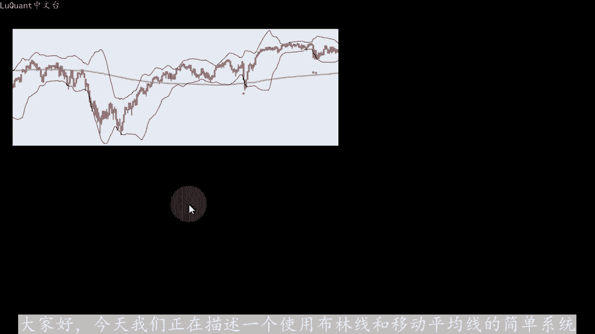
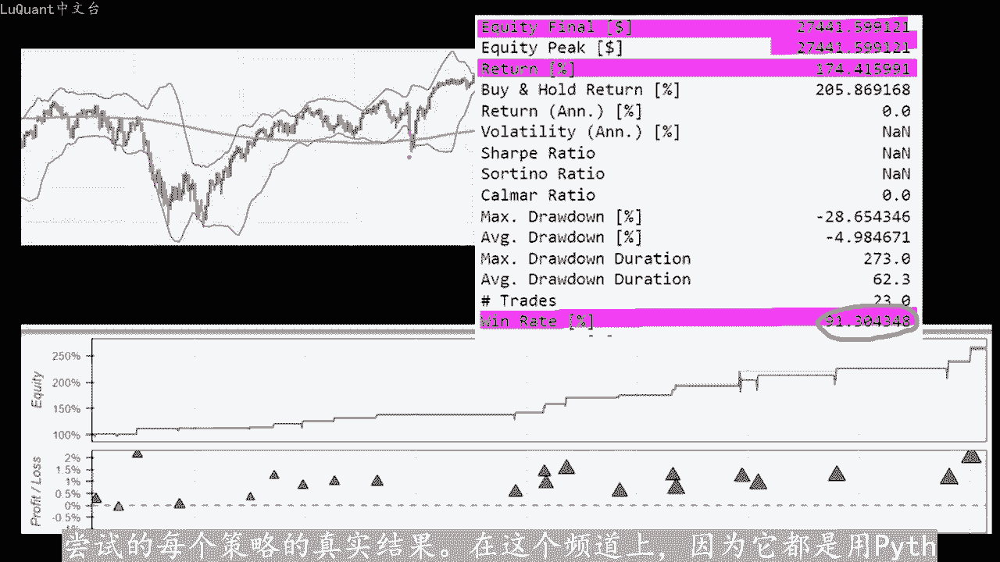
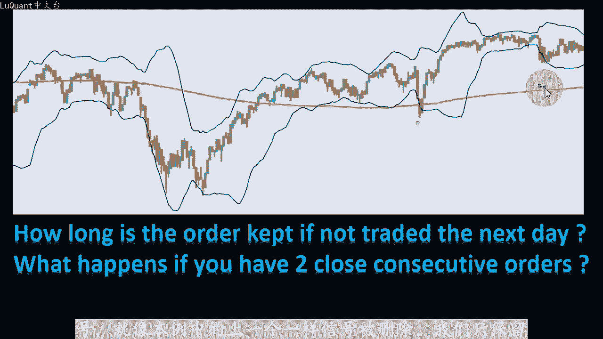
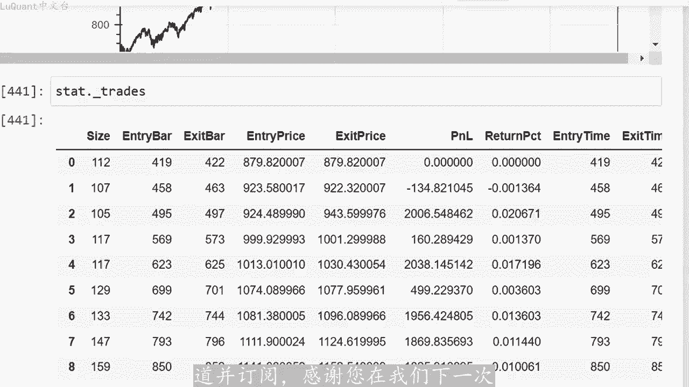

# python量化32：布林带策略3 - P1 - LuQuant - BV1cF4m1F7wp

大家好，今天我们正在描述一个使用布林线和移动平均线的简单系统，这是我们在回溯测试结束时获得的股权样本。我们可以看到，标普500股票的回报为250，没有重大回撤，不同的正回报。

不同的市场上，权益决赛也是水族巅峰，这是令人惊叹的，胜率在91%左右，主要是因为这个系统是非常有选择性的。而且我在某些情况下通过调整也设法获得了10%的胜。😡，系统参数，这不是骗局或某种虚张声势。

那些一直关注此频道的人已经知道我们只通过自动编码做事。即使事情没有按照我们的方式进行，结果也会按原样显示，但只是这样是一个很有前途的测。您甚至可以从描述中的链接下载python代码和数据。

并自行检查详细信息。我们运行代码得到的数字并不神秘，我们会得到我们尝试的每个策略的真实结果。在这个频道上，因为它都是用pyython编码的，所以我们将描。😡。

系统的所有细节和陷阱，我们将调查它的潜力，试图最大化我们的利润。那么为什么首先要测试RinaCO布林带策略呢？提出了这个，我去看了，我被1680。return吸引了，这让我很好奇。

他也被另一位youtube数据科学家algovex测试过。我关注了他的一些工作，我觉得这些工作也很有趣。所以所有这些都促使我尝试我们在这个通道上的做法是，我们将使用每日时间框架和2。😊。

移动平均线来决定趋势。如果蜡烛交易高于移动平均线，那么我们处于上升趋势。如果蜡烛交易低于移动平均线，我们认为这里有一个下降趋势的曲线。重要的是要知道，从数字上讲，这是通过测试来检查。

如果我们有5个或6个连续的蜡烛在曲线上方或下方交易，当然这个数字可以修改，因为它作为变量保留在第二个代码中，我们将布林带曲线的长度设置为2。标准差设置为2。5。

正如Rner C本人在他的频道中所描述的那样。因此，如果我们有上升趋势，我们正在寻找买入头寸，我们将等待蜡烛收盘价低于布林线的下区线，就是这种情况。例。这条红色曲线收盘在布林线的最低区线下方。

我们处于上升趋势。因为这些蜡烛在这条移动平均线上方交易，诀窍是当这个发生这种情况时，我们不会进入交易，而是会。据当前收盘价3%的位置下订单，因为我们正在寻找买入头寸，在本例中。

我们将买入订单置于比收盘价低3%的位置。信号蜡烛就在这里。所以。有我们在图表上看到的那些紫色点表示，这些点与信号蜡烛的收盘价相距3%的距离。我们这样做的原因是我们试图以最低的价格买入。

我们可以在市场上以相反方向获得的可能价格。因。当蜡烛交易价格低于移动平均线时，我们正在寻找卖出头寸。我们正在寻找收盘价高于布林带最高点或高点曲线的蜡烛。在这种情况下。

我们将在信号蜡烛收盘价上方3%的位置下定。然后如果订单完成，并且它转变为市场上的未平仓交易，我们将在两个时间点结束交易天数RSSI跨越50阈值或在相反情况下10天后。这意味着，如果RSI的第一。

条件未满足，那么我们不会无限期的在市场上保持交易，我们将等待最多10天。然后我们平仓。因此，请记住，对于买入交易的买入头寸，我们正在寻找高于50域值的从下道上的RSSI交。相反，当我们有卖出头寸时。

我们正在寻找低于50域值的RSSI在继续编码部分之前关闭交易。我想提一下四个关键细节，这些细节将。我们编写代码式解决。第一个是我们将订单在市场上保留未交易的时间为下一个。

或者我们可以再等几天来增加最终获得的总交易数量。因为原则上这是一个非常有选择性的系统。我们预计每天的交易数量不会很。😊，由于我们正在编码，因此我们将在代码中将其保留为变量，以便我们可以在需要时进行实验。

第二个问题是，当你有两个连续的订单或信号时会发生什么？我们是否保留这两个订单或新订单是否会替换最后一个未交易的订单。在这种情况下。😊，喜欢选择第二个选项，这意味着只允许一个订单。

并且它是最新的或最近的一个。换句话说，如果我们有一个信号，然后我们有第二个信号，就像本历中的上一个一样，信号被删除，我们只保。

市场上最新的订单参数可以优化，以获得系统中的更高回报，这是算法的主要优点之一。我们可以简单的修改一个变量的值，运行代码，并查看结果，就像最后一点一样简单，同时允许多少比为平仓交。

我们是否应该在交易仍处于未平仓状态时，在市场上下另一个订单，或者我暂时投反对票。我们只是想让事情变得简单和评估系统。而不用太多重叠的特征扰乱我们的图表。我只是。😡，提及这些细节。因此，当我们编写代码时。

您会知道并理解所有相关部分。我认为在这个阶段，我们已经准备好执行编码部分，在pyython中进行测试好的这是我们的jupiter笔记本文件。我首先下载或读取数据，我正在使。

padas我正在加载一个数据框间谍美元，这是与SMP500相关的股票市场每日图表和从2017年2月16日到2022年5月21日，我。将在不同的时间段内对不同的股票进行实验。但现在我们从第一个例子开始。

在这里我正在清理蜡烛，其中我们没有任何市场变动，所以这是蜡烛的最高价等。😡，蜡烛的最低价的地方，我正在从我的数据框中删除这些，我正在重置索引，并正在打印蜡烛的第一部分数据框。

只是数据框的头部用于检查我的数据是什么样子。所以我将运行这部分，这就是我们目前所拥有的。然后我导作为技术分析。M计算emma指数移动平均线或简单移动平均线，实际上取决于您只需在此处替换SMA或emma。

您将使用。移动平均线或指数移动平均线。在这种情况下，我尝试了这两种方法，这对我们的系统没有任何影响。在每日时间范围内，您可能需要考虑是否要转向较低的时间范围，例如每小时时间范围或30分钟时间范围。😡。

可能需要考虑更改此设置，并检查它是否确实影响您的结果。然后我正在计算RSI也将其放入我们的数据帧中，长度为2G组。我们使用的是移动平均线200，因此这些是要考虑的细节。然。

还用长度等于20和标准差来计算布林带2。5，我使用join函数，将这些布林带列添加到我们的数据框中。并且我们在此阶段删除NA，这意味。我们的数据框中的控值，因为请记住，对于移动平均线。

例如您需要至少200行获得移动平均值的正确值。在此之前，您没有真正的数值，这些将影响您的图表以。您稍后要做的任何事情，所以我们不需要这些，然后我将重置索引。因为我们有在我们的数据框中提出了一些行。

我正在打印数据框的某些部分，只是为了看看事情看起来如何，以便事情正常工作。我正在。😡，我们在之前的视频中描述的函数是添加移动平均信号函数，它需要一个数据帧和要考虑的蜡烛数量，这是计算移动平均信号的地方。

这意味着，如果我们在移动平均区线上方或下方有一定数量的后蜡。在这种情况下，我们正在决定它是上升趋势还是下降趋势。我使用我的数据框F间谍调用此函数，并且反向蜡烛的数量等于6。换句话说。

如果我们有6个反向蜡烛高于或低于移动屏。曲线，那么我们决定我们是否有上升趋势或下降趋势。您可能想要更改此值，这不是规则六之是我随机使用的一个数字。就像这样，您可以使用午货时，具体取决于您使用的时间范围。

因为如果我们在每日试。😡，范围内有6根蜡烛，这意味着价格连续6天交易在200M上方。我认为如果价格低于曲线，我们可以认为这是上升趋势或下降趋势，那么我们会到达一个有趣的单元格，这时我们添加一个名为艾。

order limit的新函数，它需要两个参数，及我们要分析的数据框，百分比是我们在算法中描述的3%的距离。因此，我们要么使用3%，要么。2%或1%甚至0%的订单意味着信号蜡烛的收盘价。

我将其保留为参数。因此，我们还可以根据我们交易的货币和任何数据框架进行实验和更改它。但是我。这样做的方式是，我们检查每天的每一行是否有等于二的M信号，这意味着我们有上升趋势，蜡烛在移动平均区线上方交易。

同时收盘价当前蜡烛的价。当天低于布林贷下限，我们添加一个新列，一个新列表称为当前行或当天的当前蜡烛的订单信号等于fclozy表示收盘。今天减去今天的收盘价乘以百分比。在相反的情况下，当我们有下降趋势时。

这意味着MI信号等于一。同时，当前蜡烛的收盘价高于较高的区。我们有卖出信号或卖出订单，我们将添加订单值，该值等于今天的收盘价，加上该特定收盘价的3%。因此，我使用此函数添加一个称为订单信号的新。

我们正在使用的数据框架，我使用了3%，正如rener本人所描述的那样，我们暂时坚持初始参数、原始参数，我们可以稍后尝试修改这些参数。现在只是为了验证我的所有内容正在打。订单信号不同于零的型，这意味着。

当我们有订单时，所以这些天我们有不同的订单，它可以是买入或卖出订单。如果我想检查订单实际有仓位的值，所以它是相对于价格。所以我们有256美元，这是我们正在处理的单位，这是一个订单。

这是当天此时的买入订单。如果我将256美元与收盘。264美元进行比较，我们可以请注意它比这个特定收盘价低3%，我们可以可视化我们的数据和曲线。所以我只取一小部分数据，我们无法绘制所有内容。这会。混乱。

所以我不打算描述这些，因为这两个单元格已在之前的视频中使用和描述过很多次。如果您对此感兴趣，您可以返回之前的视频。但无论如何，这就是结果。我们可。😡。

在这里看到图表橙色的MI移动平均线和两个布林带的曲线，我只绘制了高点和低点，因为其他中间区线和其他参数对系统不感兴趣，我们在紫色点处有兴。或者我们的订单，我们可以放大并验证。在这种情况下。

我们的交易高于移动平均线区线。因此我们正在寻找买入头寸，并且这两根蜡烛收盘价低于布林带的最低部分或最低区线。我们有两个买入订。这里的这些特定位置意味着丑闻的收盘价减去3%。请记住，在这种情况下。

我们只保留最新的订单，这意味着之前的订单将因为这个订单而被删除。所以现在我们将使用sign no海。只是为了将我们的订单信号值传递到我们的策略中，并且我正在使用back testing pi包。因此。

对于这个视频，我也不会详细介绍这个包的工作原理，它超出了我们这个视频的范围，只是在这里测试策略。但重要的。这部分因此我们正在测试订单是否已投放市场超过一定天数，这里是5天。所以5天后。

如果订单视未交易的，我们将删除它，我们将取消它。我们可以做到这一点的方法是检查当前时。减去订单创建的时间。如果这个差异大于5或一定数量天然后，我们可以取消订单，并弹出最后一次。

这是一个名为订单时间的列表。我将在每次创建订单时附加订单创建时。我将订单创建时间放入此列表中，只是为了将它们保留在内存中。但是当我提高订单时，我也会提高相应的时间，然后我会检查我是否有为平仓交易。因此。

如果交易长度为证，则意味着。在市场上有未平仓交易，我们将检查当前挖掘时间，交易创建时间或交易进入时间是否大于或等于1。因此，我们在市场上有超过10天的未平仓交。无论怎样，如果他是如果一笔交易是多头交易。

并且同时我们当前的RSI大于或等于50%，则盈利交易或亏损交易也是如此。在这种情况下，我们将关闭交易。并且如果我们有卖出。空头交易，并且RSSI低于50，我们将关闭交易。

因此这些是我们在市场上关闭交易的条件，也是我们关闭我们在市场上放置的订单的条件。接下来的市场，我将这三个条件结合起来。只是为了建立一个买入头寸。因此，如果我们有一个不同于零的信号。

这意味着我们有一个订单信号，要么是买入信号，要么是卖出信号。同时交易数量等于0。因为请记住，我们一次只允许开立一笔交。😡，因此，如果我们想开立新交易，则不需要进行任何交易，同时移动平均线信号等于2。

因为这是我们的买入头寸正在这里工作。所以在这种情况下，我要取消锁。以前的订单，因为我此时已经达到了一个新订单，请记住，我们只保留市场上最新的订单。

现在我正在使用购买back testing pie包中的函数止损，不一定在这里，我只是简单的输入一。虚拟值它并不意味着任何东西，它是信号除以2，所以它是收盘价除以2，它永远不会达到这个方式。但无论如何。

我这么说是因为它是一个参数，在这种情况下的限制将等。已经计算并放入我们的数据框中的信号。请记住，这些是低于或高于收盘价3%的距离价格信号蜡烛的大小。这就是为什么我们必须在此处包含限制参数，并且大小。

是字典初始大小，目前是我们权益的50，这就是我们在市场上下达买入订单的方式。同时，我需要将创建此订单的时间保留到内存中。因此，我将当前订单的创建时间附加到成为订单时间的列表。在另一种情况下。

我也有一个不同于零的信号，并且在同时我没有任何未平仓交易，但我也有一个等于一的移动平均线信号。这意味着我们的交易价格低于移动平均。曲线。因此，我们正在寻找卖出头寸。在这种情况下。

我们必须准确执行与我们对买入头寸所做的相同。这意味着我们将取消所有先前的订单，仅接受最近的订单，并传递一个卖出订。其限制等于当前信号值及收盘价加上3%价格差异和相同规模的交易。同时。

我们还将订单时间添加到我们的订单时间列表中。所。这些是代码的详细信息，我正在对数据帧运行回溯测试，从1万美元现金保证金10分之1，意味着杠杆为1比1，暂时没有佣金，只是为了将系统与以前的系统进行比较。

考虑佣金，我们只有在系统证明哈是获胜的情况下，才会添加佣金策略。当我们运行这个策略时，我们在数据框架上获得了17%的回报。我们已经包含了100%的回报率，但这没有任何意义。因为我们。成功进行了两次交易。

请记住，这是一个非常有选择性的系统。因此您可以看到交易不多，只有两笔交易，但这些都是盈利交易。我们可以使用统计点下划线交易访问交易列表，只是为了检。我们有多少笔交易以及每笔交易的详细信息。

所以现在让我们返回并尝试应用此系统。在较长一段时间内，我将评论这一行，我将使用外财务包下载从2011年到2021年的数据。这是十年的数据，我将运行这个我要下载数据。我们必须再次检查整个笔记本。

看看一切是否正常。现在我们总共获得了14%的回报。我们可。通过减少我们在模型中使用的条件，因此降低了模型的选择性。在这里我删除了我们为市场上的订单放置的3%的距。当我们运行此模拟时。

我们获得了174%的回报。因此我们已经有了更多的东西，我们有更多交易交易数量增加了。我们可以在这里看到，绿色交易是我们在整个图表中都可以看到的获胜交。😊，交易列表就是这个，所以我们可以访问交易列表。

因为我们可以看到我们有大约10年里总共有22笔交易，所以总共每年大约有两笔交易，平均统计数据如下，我们的胜率约为90%。总共有23笔交易，最大回撤是28笔，这并不理想。凭据而言。

回撤百分比为复无有趣的是，我们的最大交易持续时间为5天。因此。跟蜡烛这很好，平均交易持续时间约为3天，我们可以通过增加交易规模来增加回报传递订单的大小。因此，如果我在这种情况下投入99的权益，我们。

回报率为600%。因此我们可以看到，在使用我们用于模型的参数时可以增加回报率。我们可以看一下图表，我们可以看到我们的大多数交易都是盈利的。所以我们这里有一笔亏损交易。这里还有另一笔大额亏损交易。

这是最大回撤。这是每十年发生一次的明显例外的情况。同时我们看到净值不断增加，这是一个非常好的迹象，该系统具有前。如果我们查看图表，实际上我们有近乎完美的切入点。我认为交易者在这种情况下不能做得更好。

所以我们可以在这里看到，但是退出点并不总是从每笔交易中榨取最大收益。我们可以看。有视模型退出的太早，这可以通过添加追踪止损或简单的增加您想要退出的RSI值来纠正。无论如何。

我们仍然没有找到十0年来1%689%的交易回。但我们缺少有关此交易系统的很多细节。例如，当原始交易者开始测试系统时，保证金或杠杆是多少，被使用了，他们交易的手数是多？

这么多细节可以影响你最终的回报百分比。我们可以尝试在同一个股票市场上运行。这个就像我原来的交易者使用的罗素1000指数一样，再次运行一切。我们会看到我们会得到什么。😡，结果此时我们有479%的回报。

请记住。我们刚刚放弃了收盘价和收盘价之间的3%的订单，距离订单价格。我们仍。没有得到1%689%，我并不是说这是一个糟糕的系统。实际上这是一个非常好的策略，我将进一步调查，但是很难重复其他人得到的相同。

结果，特别是，如果您正在使用不同的方法。在此视频中停止，但是我将进一步调查我们在此模型中使用的细节和参数。我相信我们可以在较短的时间范围内尝试此操作，以增加交易数量。如果你有任何想法，也许会找到更好。

😡，退出策略方法，请不要犹豫，只需在下面发表评论。因为您可以看到这是一个非常高获胜的伟大系统，并且不要忘记通过喜欢来支持该频道并订阅。感谢您在我们下一。😊。

士兵交易安全之前留下来，我们下次再。😡。

