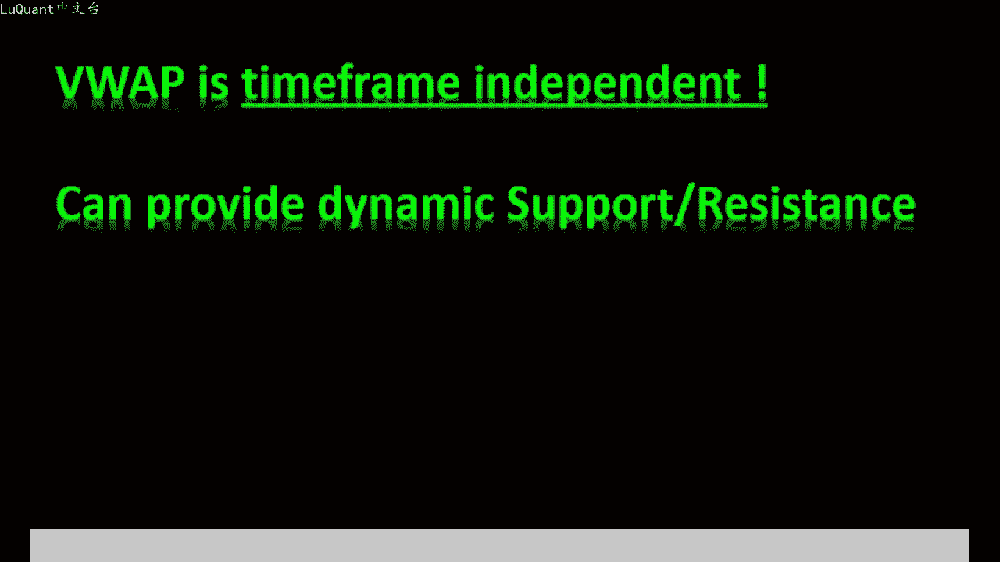
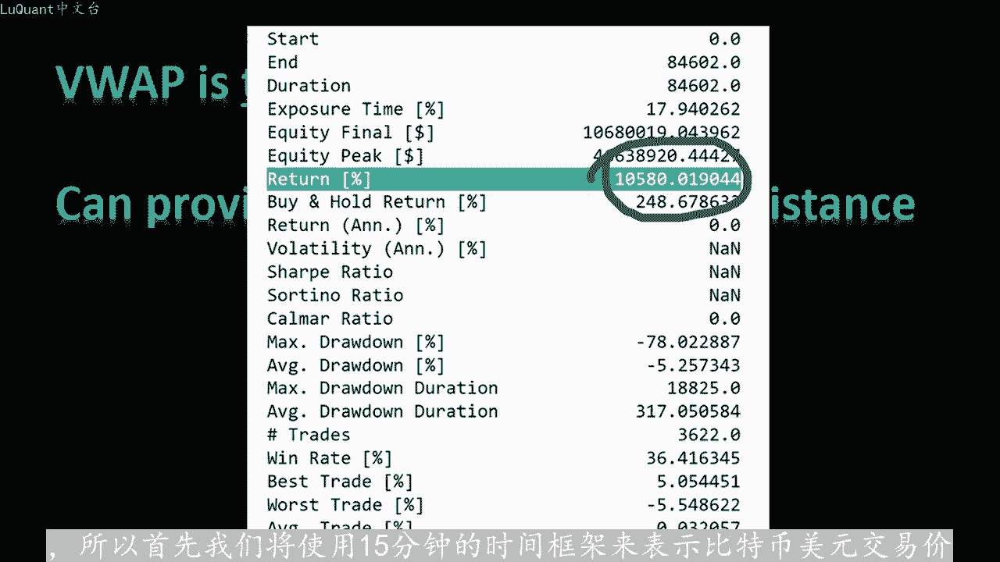
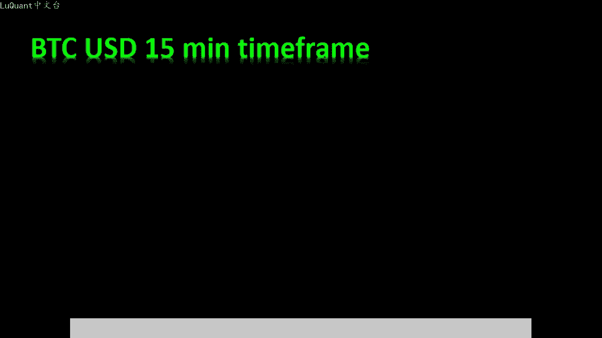
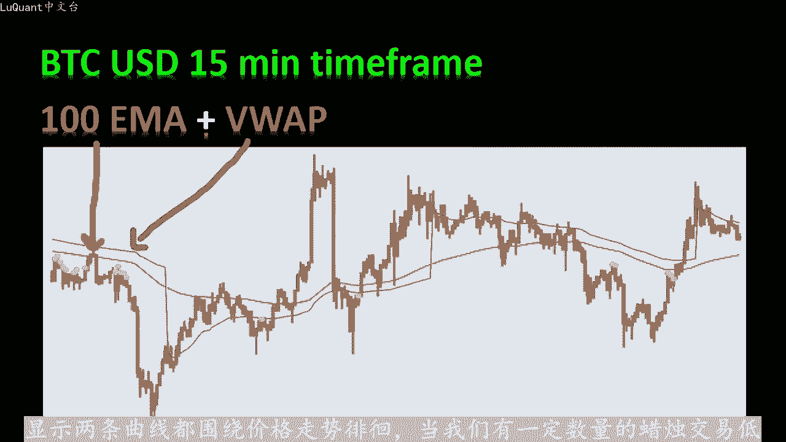
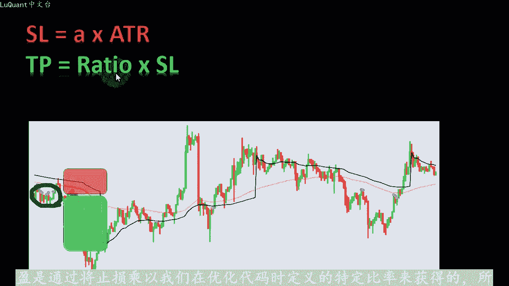
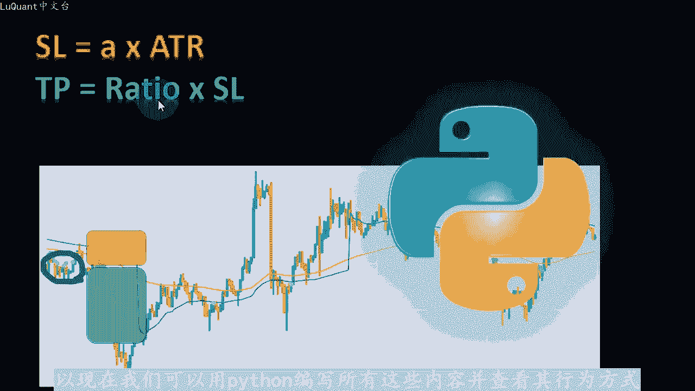
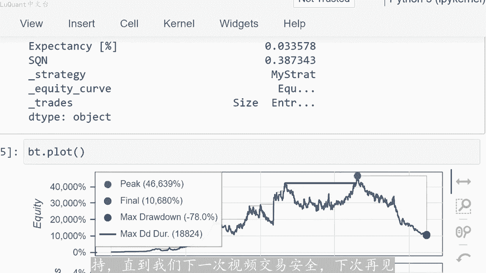

# python量化33：比特币交易策略 - P1 - LuQuant - BV1tA4m1P7wW

大家好，今天我们将探索使用vob或交易量加权平均价格的雕刻策略，我们将使用三年的数据在比特币市场上回测该策略。回测将使用用python编写的算法来完成。您可以。该视频描述中的链接下载。

为什么首先查看应用程序，因为评论部分的有人请求这样做。当我在算法中尝试它时，我对我们将一起审查的结果感到惊讶。还有另一个原因，应用程序对于算法交易可能很强大价值，试图读。与我们使用的时间范围意味着。

如果我们更改时间范围，查看器价值保持不变，仅仅是因为它的计算方式，我将在这里避免数学细节，但此功能是优点，对于算法交易。因为我们在优化过程中少了一个。

担心的参数试图应用程序的重要性还在于它可以提供动态支撑和阻力值，并且它对于算法交易也非常有帮助。因为这些程序的一大挑战是猜测我们如。确定止盈和止损值，这对算法交易很有好处。

当我在三年的数据回测中尝试此策略时，它显示出很高的回报率，这使其成为我们注意力和时间的良好投资。我们将用pyython编写所有内容。

将解释简单的方法，也许我也打算在未来的视频中进一步探索该指标。所以首先我们将使用15分钟的时间框架来表示比特币美元交易价格。我们包括两个指标100日均线和微应用程序。此时。

显示两条曲线都围绕价格走势徘徊。当我们有一定数量的蜡烛交易低于或高于100M时，我们可以得出结论，我们分别处于下降趋势或上升趋势同时。

上升趋势中，我们只寻找买入头寸，而在下降趋势中，我们只寻找卖出头寸。如果蜡烛交易的价格也低于或高于web区线，则这种趋势行为也会得到证实。所以我们再次当蜡烛交易高于100M。和view app曲线时。

我们寻找买入头寸。当蜡烛交易低于M和web曲线时，我们寻找卖出头寸，并且当以下情况触发我们头寸的入场点，价格在一定固定距离内足够接近view app区。例如，这里价格交易低于两条曲线。

因此我们处于下降趋势，同时价格在一定距离限制内接近V web区线web区线。因此我们正在触发卖出信号。我们在这里有另一个信号，因此价。交易低于两条曲线，因此我们处于下降趋势。

同时价格蜡烛太接近或足够接近V圈曲线。所以我们触发了那些紫色点，这是我们的卖出信号。我们可以看到这两个信号是非常好的信号。是一个错误信号，所以我们低于我们考虑的曲线或者算法认为我们处于下降趋势。

我们得到在一定限度内足够接近V实验室曲线。因此我们触发卖出头寸，这是一个错误信号。因此简而言。信号算法使用三个可调整变量或参数，即要考虑低于或高于艾的蜡烛数量，以及在微网络中。

我们定义下降趋势或上升趋势。例如，我们将测试多少根蜡烛低。或高于这些趋线，以确认下降趋势或上升趋势。这两个参数是低于或高于em的蜡烛数量和蜡烛数量在视图应用程序的下方或上方。如果您想简化算法。

它们当然可以是同一个参。第三个参数是考虑价格足够接近vab的最大距离，因此，我们将其称为最大距离接近vab或类似的东西，对于这个视频止损距离与ATR直接相关。

银是通过将止损乘以我们在优化代码时定义的特定比率来获得的。所以现在我们可以用pyython编写所有这些内容，并查看其行为方式。这是我们的jupyter笔记本文件，我们将使用比特。

美元交易价格文件。2019年5月8日至2022年4月29日之间的15分钟蜡烛要价和此单元格就是将时间列放入索引。只是调整格式，并将其用作索引。我在这里不详细介绍，因为它与我们正在解释的算法没有直接关系。

然后我使用paestta包来计算，试图应用程序，将其存储到我们的数据帧中的一列中一。目前长度为100的指数移动平均值，这部分定义了一个新列或一个新信号，我称之为MI信号。

这是算法计算有多少个的地方返回蜡烛，我们在MI曲线下方或上方有多少根蜡烛，只是为了定我们是否有下降趋势或上升趋势。所以在这里每当我们有6个连续蜡烛跌破MI曲线时，我就选取6根蜡烛。

我们认为MI信号是在这种情况下是卖出信号。如果它们位于曲线上方则相反，我们。一个积极或上升趋势信号。在这种情况下，我们会将信号放入数据框中称为DMA信号的新列中。我们遵循相同的方法。

也可以使用fop曲线。但这次我只使用三根蜡烛，只是为了增。我们在交易过程中获得的信号数量，请记住，如果您设置非常严格的条件，您将不会发出大量信号。因此，由于我们正在测试3年多的数据。

我希望有很多交易机会，只是为了同。评估我们正在描述的算法。所以在这里我将后手柄的参数减少到3个。这意味着，如果我们有下面三个连续的蜡烛或在wp区线上方，这是一个确认。如果我们有下降趋势或上升趋势。

也与AMA信号一起公。我将信号作为新的列势图应用程序信号添加到我们的数据框中。然后我们将所有这些合并进入一个名为总信号的函数，只是为了确认我们是否有上升趋势，我们设置了两个条件，即MI信号等于。同时。

fop信号也发出上升趋势信号，您可能想要该信号等于二在这里添加其他条件，检查您是否有吞噬模式，流星或其他您可以暂时在该视频中进行实验的东西。我只是。尽可能简单。

只是为了看看web将在一个简单的情况下实现什么因此。如果我们有上升趋势，我们将寻找买入头寸。但同时我们需要曲线非常接近我们在算法中描述的价。因此，为此。

我们将测试蜡烛之间的距离或价格交易的价格和web曲线。因此，我们检查vi app曲线与当前蜡烛最高点之间的最小绝对距离以。Vp曲线与最低点之间的绝对距离当前蜡烛。换句话说。

我们正在寻找当前蜡烛与Wp最近的点，并且如果该距离低于或等。我定义的参数及我的近距离，我们就会测量该距离。因此，当价格比web曲线的距离限制更近，我们将认为我们有一个有效的信号。

在这里我将其设置为100，这将取决。您所交易的货币以及您所交易的货币的价格交易。因为在这里，例如在比特币的情况下，你作为美元单位的差异，所以它在100美元单位内，你应该接近web区线。而如果你。

交易以泰方或其他东西，你可能想要改变这个为了使其更适合您正在交易的货币。同时，如果我们使用MI信号和VWAP信号，同时收到下跌信号，我们将寻找卖出头。同时，我们将进行检查条件，如最接近的价格。

当前蜡烛与va曲线的最近点是蜡烛的最高点还是最低点，以较接近者为准，我们将检查它是否在与wep曲线的一定距离限制。如果在这种情况下，我们返回一个脉出信号，所有这些都组合成一个参数，我们将其称为总信号。

我将把它存储到我们的数据框中，称为总信号。这就是作为我。卖出和买入头寸的触发信号。此时我们可以在图表上可视化我们的信号。所以我使用这三个单元格，我不会解释他们。因为我们在之前已经解释过很多次了。

最重要的是我们可以看到我们可以。😡，蜡烛图与那些有效信号的紫色点一起绘制出来，这些是脉出信号，因为它们位于蜡烛图上方，这也是一个脉出信号，这也是一个卖出信号。我们可以只是为了尝试而尝试不同的部分，让我。

在这里添加一些零，我会说1900，所以我们将有400根蜡烛。在这里我们也可以看到我们有卖出信号，因为我们处。下降趋势，这些是购买信号，因为我们位于区线上方，同时我们与区线足够接近。因此您可以看到。

我们也可以使用这些参数获得所有信号。但无论如何，只有一种方法可以确定这是否是一个有效。系统是通过回速测试来实现的。为了回速测试，我们将首先定义ATR只是将其用作止损指标。

我将在使用回溯的同时运行该ATR测试库或包。因此我们。在这里定义参数，止损AT2距离将是当前AT2的0。8倍，止盈止损比率为2。换句话说，止盈距离是当前AT2的量。止损距离。

这就是当我们有等于二的信号时，我们如何定义止损和获利。这意味着这是一个买入信号。同时，我们没有任何其他未平仓交易，因为我们在这里一次允许一笔交易同。😡，我们有一个等于一的信号，同时我们一次允许一笔交易。

然后我们可以触发买入头寸或卖出头寸。当然。考虑到止损和止盈值。10万的现金和5分之1的保证金开始。所以杠杆是5，我投入10万的原因是比特币的高价格。因此，如果您希望您的系统继续运行。

并且不会在两次亏损交易中擦除账户。您需要有足够。资金来掩盖，因为比特币的价格很高，这些是我们交易系统的结果。我们可以看到我们有就像1%万%的回报。所以如果我们从10万开。使用比特币3年后。

我们的股权最终约为1000万美元，而持有买入和持有百分比只有248。所以我知道很多人都赚了钱，他们的钱包里有很多比特币，然后比特币价。标升，他们使用这种交易策略赚了很多钱，他们会赚更多的钱。

这是一个很好的指标。如果你将其余简单的投资策略进行比较，现在这个算法是一个非常好的算法。如果我们想会制。这些年来，权益的稳定性，我将绘制权益曲线。我们可以看到，该算法在一段时间内运行的非常好。

但我认为在过去的一年里，这就像一年或10个月，几乎值得花时。但他并没有真正发挥作用，这是算法的问题。通常他们会在几年内工作，然后你会在某些时期陷入困境，因为他们缺乏这种动态思维，试图适应当前市场。因此。

我们构建这些算法的方式是一。非常被动的方式，我们设置固定参数，并尝试在三年内应用这些参数，这不是最好的方法。因为它适用于两年。然后去年效果不佳，但无论如何，总而言之，这是一个非常好的策略。

这是一个非常好的系，运行了很长一段时间。我的意思是，两年来它运行的非常好。当然你可以添加任何附加过滤器任何附加指标来改进这一点，并降低风险。好吧，这就是这个视频。我希望你们喜欢它我真的。😡。

喜欢查看应用程序的想法，谢谢您的评论。它是来自的东西，再次评论部分。如果您喜欢它，请不要忘记喜欢和订阅，这将是对该频道的大力支持。直到我们下一次视频交易安全，下次再。

