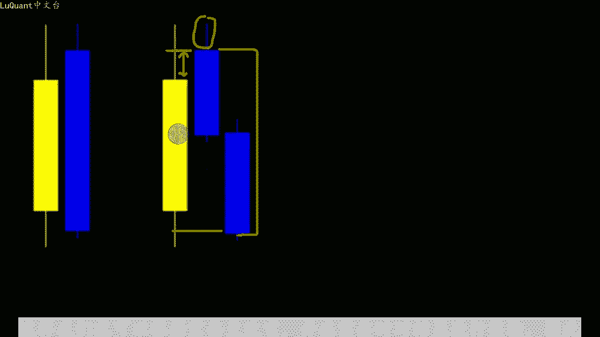
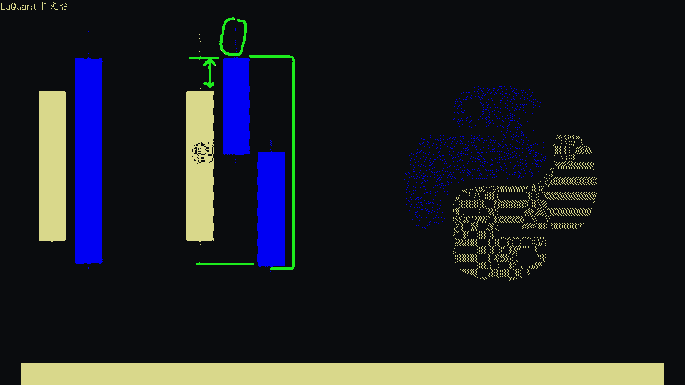
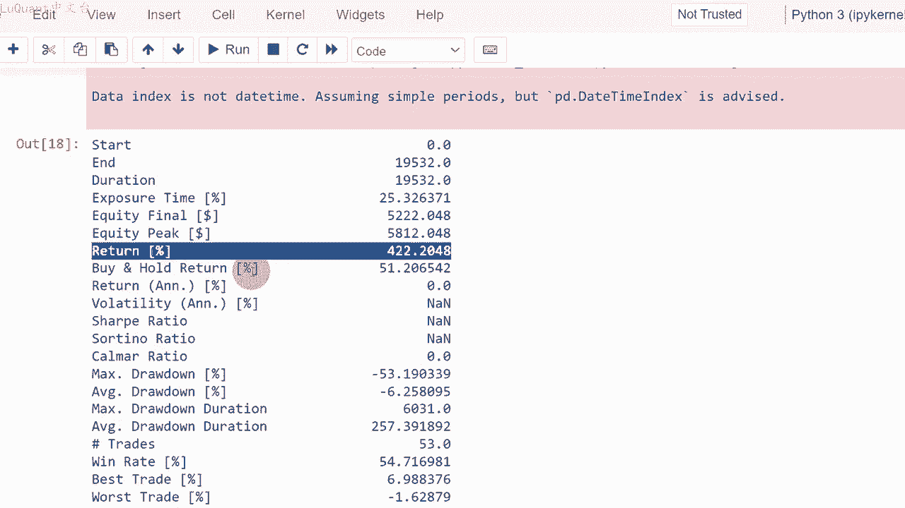

# python量化34：回测的技巧 - P1 - LuQuant - BV1Wp42127DH

大家好，今天我们将使用SP500历史数据测试一个简单的雕刻策略。我们将解释该策略的基础知识，并用pyython编写所有内容以进行回溯测试。我们有三年的数据，我相信这足以有一。

关于性能和我们将获得的结果的第一个想法，像往常一样，代码可以通过下面描述中的链接下载。所以首先我们为此视频使用15分钟的时间范围，您可能想在不同。时间范围上进行实验。

尽管我个人发现较低的时间框架更难以控制，因为噪音和波动通常更强烈，所以我们正在寻找该策略的吞没模式，它可能是看跌或看涨吞。信号我们正在要在这里添加两个条件。

第一个是我们可以在这些蜡烛上看到的最小吞没高度。因此，如果我们有上升趋势，那么我们有一个看跌吞没蜡烛，我们将寻找前一个蜡烛。的收盘价之间的差异以及吞没蜡烛的开盘价。我们将这个距离称为最小吞没高度。

我们将设置一个最小距离来验证信号。这意味着我正在寻找以特定价格收盘的上涨蜡。但随后对于此处的特定价格，吞没蜡烛的开盘价应高于最小吞没高度。因此我需要此距离大。我将在代码中作为变量保留的最小吞没高度参数。

第二个条件是最大主尾，它也作为我们程序中的可调整变量保留。因此我们需要一定的吞没高度和短的或至少有限。主尾长度该长度小于我要修复的最大主尾参数，在我的程序中，请注意。这是对看爹吞没蜡烛的解释。

我们还可以检查看长吞没蜡烛。在这种情况下，吞没距离将未。此处。而我们现在看到的尾部是吞没蜡烛的下尾部，添加太多条件，会降低信号的频率和数量。因此，我们将在这里进行额外的考虑。

以便在整个交易时间内获得更多信。这是正常的吞没模式，其中一根蜡烛完全吞没了前一根蜡烛，这是一种变化。我们还可以引入我们的算法，这样我们就可以获得更多信号。如果它们方向相反。

我们可以允许两个连续的蜡烛吞噬前一个蜡。😡，当然，如果他们验证吞噬的条件，请注意两个附加条件。我们之前已经在该视频中添加了有关吞没高度的内容，并且蜡烛尾部限制仍然适用。吞没级的第一根吞没蜡烛。

这样我们就可以让两根蜡烛从上到下吞没前一根蜡烛。我们可以还想象一个不同的场景，我们允许三根蜡烛实现。前一根蜡烛的吞没，我们也可以允许4根蜡烛，以此类推，因为我们不知道应该允许多少根蜡烛来实现吞没模式。

或者会产生什么效果。这种模式我们将留下允许的蜡烛数量，以实现吞噬作为程序中的变。这样我们就可以根据需要更改它，并在需要时对结果进行实验。因此，此时我们可以开始编写程序并检查回溯测试的结果。好吧。

这是我们的jupiter笔记本文件。我首先将数据加载到数据框中，我称之为DF间谍。

是使用读取下划线CSB函数的数据框变量的名称，并且我我正在加在2019年至2022年之间15分钟时间范围内的出价。因此。15分钟时间范围内三年的数据，因此它应该足以测试我们的策略。

并且我正在设置等于GMT的指数，这是加载到我们的数据框中的一列。因此这将是我们的索引。然后我们有一个被称为吞噬的函数。需要两个参数，数据框，还有L，它是我们当前蜡烛的索引，将测试它是否实现吞没模式。

因此，此函数中的第一个参数是后蜡烛参数，此处等于3这。允许实现吞没模式的最大蜡烛数。换句话说，我允许实现前一根蜡烛吞没的三根蜡烛的最大数量。因此，如果仅用一根或两。蜡烛实现该形态，这很好。

三根蜡烛是最大数量。但如果您要在4根蜡烛内实现吞没，则不允许第二个参数是吞没差异。这已经在本视频中进行了解释。因此。😡，基本上是当前蜡烛的开盘价和前一个蜡烛的收盘价之间的差异，最大为0。01。

这些值很大程度上取决于您所在的股票交易和股票价值。应。对于SP500，我暂时采用0。01，若限制意味着蜡烛的最大尾部长度为0。02。如果它高于此值，如果我们有任何大于此值的值，然。信号被取消。

因为灯芯限制或尾部长度应该小于这个特定值。然后我们将处理我们的条件。因此，对于看跌吞没模式，这是我们返回一个信号作。看涨吞没模式的地方，我们返回两个作位信号。因此，首先使用看跌吞没蜡烛。

我们必须有一个开盘价大于收盘价的蜡烛，这意味着它是一个向下的蜡烛，而前一个蜡烛应该处于相反。方向，这意味着收盘价更高大于开盘价，这意味着它是一根向上的蜡烛。

同时我们有当前蜡烛的开盘价减去前一根蜡烛的收盘价，该参数大于吞没差一猜。此处设置为0。01，还有一个条件，其中当前蜡烛的高点减去当前蜡烛的开盘价，意味着当前蜡烛的灯芯或尾部应该小于看跌方向的弱线。

因此在这。情况下，它应该小于0。02，请注意。我们仍然缺乏一个条件，即我们在当前看跌蜡烛的看跌方向上进行测试，收盘价小于前一只蜡烛的开盘。换句话说，他是否完成吞没形态，这是故意这样做的。

因为我们仍然需要为了测试是否没有在这个特定的蜡烛上完成，我们可能会在第二个或第三个蜡烛上考虑到后面的蜡烛参数。这是在这一部分中完成。😡，我不会详细介绍您可以检查的所有细节。

这四行你自己稍后需要一些时间来理解它。但无论如何，当我们满足所有这些条件时，我们会返回一个看跌信。如果不是我们将打破这个负尔循环，因为我们不目前没有相反方向的有效信号。因此，当我们寻找看长吞没信号时。

我们。相应的修改我们的条件，这几乎是相同的算法。这里没有任何需要修改的内容。我们正在检查，如果我们正在实现吞没模式，则我们将返回不同的蜡烛，否则我们将跳出负二循环，以此类推。因此此时我们有一个海。

来测试蜡烛的索引，并检查蜡烛是否正在实现任何看涨或看跌吞没模式，我将复制我的数据框过滤掉所。最高价等于最低价的蜡烛。因此我会跳过市场上没有变动且没有数据的蜡烛，处理这些问题，通常是周末、银行假日等。

所以我只选取对我的算法感兴趣的部分。我正。复制此内容，将所有这些存储到名为DF的数据框中。我正在定义一个新列表称为信号。对于数据帧DF中的每根蜡烛的每一行含义，我将计算该特定行的信号。因为函数的结。

正在吞噬，考虑到索引行和数据帧DF。最后我是要将这个信号存储到我的数据帧的心列中。所以此时我喜欢可视化我们获得的信号。因此我们使。来自该通道的部分先前代码，我不会详细介绍，简而言之。

我只是检查在哪里以及哪些蜡烛，我有看涨或看跌信号的信号，我们将在蜡烛下方或上方的烛台图表上放置一些。😡，具体取决于我们是否有看长信号或更好的信号，我将放大。

只是为了向您展示我们有一个有效的代码正在运行并执行预期的操作。因此，这里我们有一个看长吞没蜡烛，紫色点位于蜡烛下。这里有另一个信号，我们还可以检查第三个单曲，这是一个看见信号，紫色点略高于蜡烛图。

所以为了让事情变得更容易，我删除了日期GMT时间索引，并将其替换。整数索引，这是有简单的完成的。在这里重置索引。我评论这一行，我正在重置索引并打印头部。这样我们就可以确保此时我们有一个整数索引并。😡。

当我们复制数据帧的一部分时，对于这个特定的数据框，我将重置索引。然后如果我们回到可视化部分，我们可以简单的选择我们可以绘制的蜡烛图，这是我。在4040和蜡烛图4200之间绘制的图，我们可以看到。

我们在蜡烛4100处有一个电池信号，此后价格小幅下跌，但随后价格上涨。因此在这种情况下，这可能被视。虚假信号具体取决于您将止损设置在哪里，以及在您输入止盈值的地方。我们还可以尝试不同的数据片段。

因此我将指数6200一直到蜡烛6300。我们可以看到这里有一根看长蜡烛，带有佛教信号的看长吞没蜡烛，其中这个紫色点和这里的另一个点在这一点上也是一个重复的信号。所以无论如何，当我们收到这个信号时。

我们可以。😊，这一点上同时得到两个信号，并且之后价格会大幅上涨，所以有些可能是误报，有些可能是真实的积极的信号。唯一了解的方法是对策略进行回溯测试，看看他在进行回溯测试时能带来什么回。

我只是简单的截取这个特定帧的一部分，所以它是DFPL它是数据帧，我将进行测试，我还将计算ATR，因为我将使用。在某个点或某个策略的止盈和止损值，因此，信号函数将仅返回信号列。当我们有一个等于二的信号时。

我们将应用一个买入头寸，其止损等。收盘价减去s变量，该变量是在此处定义的，所以我并没有真正使用ATR。此时我只是采用固定止损值或等于三的止损。只盈止损比率等于2。

因此我们将使用等于的缓存来运行它千分之1和3年以上的数据。该策略将带来约213%的回。胜率百分比为43。5%，回撤百分比平均回撤百分比为负5%。这里令人担忧的是，最大回撤百分。达到-60%。

这是一个巨大的数字，这意味着它作为一种策略不是很安全。这可能是因为我们在这种类型的交易中使用了高保证金。无论如何，我们也可以修改代码。如果你不想使用固定。😡，止损距离我们可以简单的取1个ATR值。

比方说当前蜡烛的ATR，我将把它放在这里，我将再次评论这部。如果我们采取两倍的AT2和1。5左右的止盈止损比，也许我们会再次运行这个，看看它是否能提供不错的回报。这样我们就有89%的回报。如果你。

其余买入并持有回报百分比进行比较，是51。2%。我们可以看到这个策略的利润更高，现在我们还可以使用追踪止损，并采用固定距离。所以我将追踪止损距离设置为5，这意味。首先，我们在以下情况下设置止损。

我们买入或卖出仓位，止损值或止损价格将遵循价格和良好的方向。直到价格反转并触及这个特定值，我不会详细介。这些细节因为我已经制作了一个关于追踪止损编程的特定视频，您可以在播放列表中查看该视频。

所以无论如何，我们采取相同的条件，我们有1000美元的缓存和10分之1的保证金，我要运行与教。止损相比，我们获得422的回报，而作为买入并持有策略的回报为51。2。

我们将422与之前使用固定止损获利值时获得的89或2。百分号回报进行比较，以便我们可以看到，在这种情况下，训练止损对于这个特定的股票来说有很大的优势。我们有422%的回报。我们。胜率是54。7%。

如果我们检查回撤，我们的最大回撤百分比是53%，平均回撤为-6%。所以我总。对这些最大回撤值感到困扰或害怕，因为这证明，无论你的策略有多好，如果你以机械或算法的方式应用它，它都不会起作用。

一直以来可能会遇到一些困难事。😡，你的策略或程序会陷入困境，并且会崩溃。你必须要有耐心。最好的方法是让2到3个不同的算法策略并行运行。这样当其中一个策略失败时，另外两个以某种方式补偿当。损失。因此。

如果您想试验这些值并尝试优化策略，您可以将自己的输入带入这些值中。请记住，我在此策略中没有使用移动平均线，您可能需要包括移动平均线的斜率以进行区。确认等等。因此，您可以在此特定代码的基础上构建很多想法。

您可以从描述中的链接下载它。如果您愿意，只需应用您自己的改进，这就是我的全部不得不告诉你这个策略。我希望你们喜欢它，它非常简单，你不必将它用。😡，算法策略当你看到一根带有小周的吞没蜡烛时。

你可以随时进行手动交易，祝你好运，直到我们下一次视频交易安全。下次。

