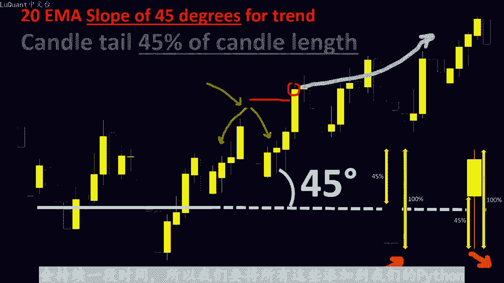
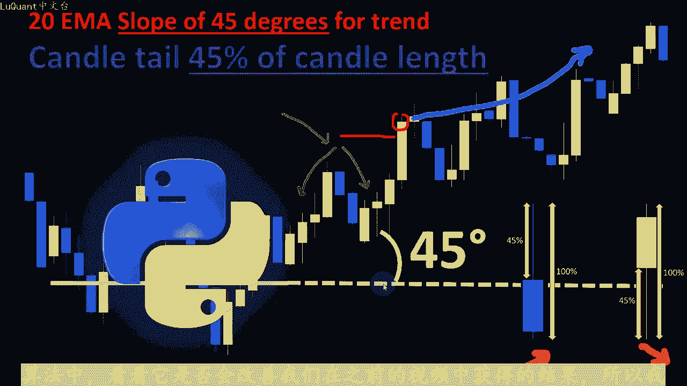
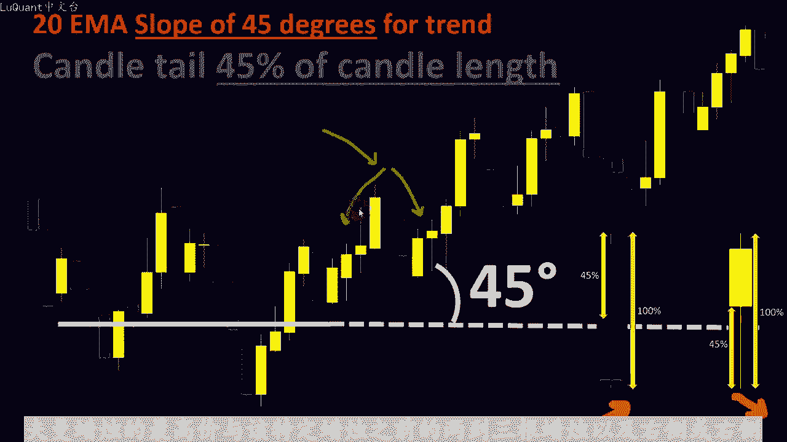
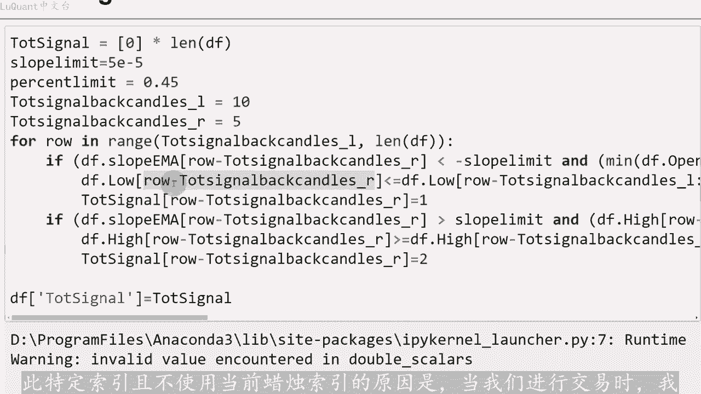
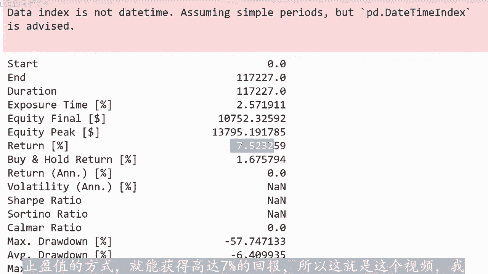

# python量化36：价格行动策略 - P1 - LuQuant - BV11t421G7MD

大家好，这是霍夫曼库存回撤栏上的第三个视频。因为该策略在交易中赢得了很多竞争，我决定再尝试一个视频，看看我们是否可以达到一个自动化版本。在某种意义上它会提供。😊，回报在几个月或者更长的时间内。

我将让这个视频尽可能剪短。因为我们已经在前两个视频中解释了有关此策略的所有细节。因此，如果您观看了两个视频，可能会更容易理解。在深入了解这个视频之前。我还会在该视频的描述中添加一个链接。

以便您可以下载jupiter笔记本文件。如果您对编码部分感兴趣，简而言之，我们将寻找回撤栏，我们正在还保持45度。我们将用于趋势定义的任何斜率。因此，在上升趋势中，我们正在寻找这种特殊的柱形形状。

而在下降趋势中，我们将寻找回撤柱的倒置形状。但是对于在这段视频中，我们添加了一个条件，我们需要该住高。之前的两根或三根柱以及周围的2到3根未来柱。换句话说，当我们处于上升趋势时，我们需要回撤柱。

看起来像高枢轴点。如果我们处于下降趋势，它应该看起来像低书轴点。我想到这一点的原因。因为我一直在寻找试图扭转上升趋势的卖家的最强烈反应，或者买家的最强烈反应。在这种情况下。

当这些回撤线的最高点或最低点被价格突破时，试图反转下降趋势，趋势更有可能继续。同一方向发展，但是将其放入程序或算法交易策略中会有点困难，比简单的用几行解释这个概念更具挑战性。在这个例子中。

我们有一个上升趋势，我们正在识别这个霍夫曼回撤线，它是一个高枢轴点，因为它高。之前的3到4根蜡烛，而且也高于接下来的蜡烛。未来的蜡烛图，同时我们在这个水平上突破了这个霍夫曼的高点。

所以这个蜡烛图收盘在这个高点之上，这意味着趋势的上升方向很可。会持续一段时间。所以我们要将所有这些添加到我们的pyython算法中，看看它是否会改善我们在之前的视频中获得的结果。

所以我不会在这些单元上花费太多时间，因为他们已经在之前的视频中进行了解释。在这里，我们正在加载数据欧元美元1小时。😊。

图表时间框架以及2003年至2022年之间，在此单元格中，我们添加了指数移动平均线和ATR。稍后当我们回溯测试我们的策略时，可能需要使用它们来止损和止盈值。我们还计算移动平均线的斜率即止。移动平均线。

因为请记住，在霍夫曼策略或霍夫曼指标中，趋势与水平线成一定的斜率或一定的角度。所以这是我们在中解释的条件之一。上一个视频，这是我应用我的修。与我们在上一个视频中发布的关于此特定策略的程序的地方。

因此我们添加了两个参数，左侧的总信号返回蜡烛和右侧的总信号返回处理，这是数字要。霍夫曼蜡烛的最高价或最低价进行比较的蜡烛，请记住。

我们需要将霍夫曼蜡烛的最高价与该特定蜡烛之前的2到3根蜡烛以及右侧或右侧的2到3根蜡烛进行比较。

该蜡烛土。霍夫曼丑闻前后比较中要包含的蜡烛图数量。那么此时显然我们包括了我们需要的条件，及斜率低于或高于斜率限制参数5到10减去5等等。我们需要发生霍夫曼丑闻。所以我把它放在这里这些。

在上升趋势中定义霍夫曼丑闻的条件。在另一种条件下，定义下降趋势中的霍夫曼丑闻的条件。所以我不会详细介绍这些细节。该视频中的区别在于，我们需要一个附加条件来检查这个特定的霍夫曼筑是否也是书。点。

这是在此处完成的。因此，如果DF点处于下降趋势中的低位，请记住，我们正在寻找低输轴点。如果该蜡烛的最低值，其索引试行减去总信号后蜡烛，强调R，并且我使。此特定索引且不使用当前蜡烛索引的原因是。

当我们进行交易时，我希望我们例如可以在实时绘画中使用它。因此，如果我们正在寻找当前蜡烛，并且它恰好是祸夫慢筑，我无法遇见未来的蜡。

无法测试它是否也是书轴点或输轴柱，每根蜡烛，我都会检查过去的蜡烛，看看是否有霍夫幔柱。在这里我可以检查该柱之后，到当前蜡烛以及在这个特定。

霍夫慢柱之前，这是否是书轴点柱，这是为什么我在这里使用这个索引，所以它是行检去蜡烛总数下划线2，它应该低于或等于行检去总信号之间这些蜡烛的低。😊，蜡烛下划线L左意味着过去到当前的最远蜡烛蜡烛点最小值。

因此，所有这些蜡烛的最小值应该大于或等于霍夫慢柱最小值。现在可能听起来令人困惑，但如果您花一些时间并尝试了解细节，希望它会在向上变得更加清晰方向。如果我们有上升趋势，我们正在寻找一个书轴高位。

所以这就是为什么我们要测试注中的最高值，而不是最低。如果这些条件之一成立，我们将返回下降趋势的一个。并且我们正在将两个信号添加到我们的数据框中，添加到一个名为tt signal node的星列中。

我通常喜欢通过目视检查来验证算法是否正常功。以便我们可以在图表上绘制我们的信号。我们可以看到我们有不同的信号，这些是紫色点。例如这是一个霍夫慢筑，我们可以看到尾部大于蜡烛总体积的45%。同时它是一个。

😊，书轴点意味着他比他的所有邻居都低，这根蜡烛以及这根蜡烛的紫色点都位于蜡烛上方，这意味着我们正在处理下降趋势信号。而例如，这里的这根蜡烛处于上升趋势上影线。45或更大。在此策略中。

蜡烛总成交量的45%以上。我们假设如果突破此特定值，我们将继续向上趋势方向。因此，无论如何，此图表的目的是验证份。是否正常工作，然后我们添加了之前在之前视频中使用过的MI信号。这意味着。

如果我们在20MI区线上方或下方有几根蜡烛，我们可以确认上升趋势或下降趋势方向。我们趋势的某种确认信号一样，霍夫曼的制动信号函数将检测我们是否在任何特定的霍夫曼柱上方或下方有任何制动。如果有的话。

我们有两种类型的信号在上升趋势方向或下降方向返回一或返回二，并且该信号将被添。到我们的数据帧中，一个名为霍夫曼突破信号的星列，我们可以通过在图表上绘制紫色点来可视化这个附加信号。请注意。

我们现在有很多条件，所以我们不会有大量的信号，我们很少有下降区。一定的斜率。然后我们有一个霍夫曼条形图，看看这个，所以我们有一个很长的尾巴，然后我们有一个条形图，这个向下的条形图收于下方。

并打破了这个特定霍夫曼条形图的最低值。这个尾巴恰好也是算法会这样考虑数轴。因为如果您将它与相邻蜡烛的其他值进行比较，那么它确实是所有这些值中最低的，并注意在这个特定蜡烛跌破该值之后会发生什么？

我们也有另一根蜡烛向下移动。因此我们预。趋势会以更激进的方式继续走向最低价格。但在这个特定事例中，情况并非如此。但我们可以看到，我们的算法运行正常，我们对此感到高兴。现在我们可以回测我们的策略。

我们设置止损和止盈的方。😊，只可以独立于策略或独立于我们使用的信号，而有很大变化。所以我不会详细介绍，有时我们有时会使用ATR值，我们只需检。之前蜡烛的最高或最低值，并将止损值放在那里。

然后采用止盈止损比率来定义我们的止盈。如果您想了解有关这些的更多详细信息，请检查在之前的视频中，我们已经在该频道的许多视频中一遍又一遍的使用此方法。因此使用ATR来定。😊。

止损止盈假设在某个点止损是ATR的4倍，止盈止损比率为1。5。我们正在回测，一次使用一笔交易，1万美元现金作为起始寸。保证金为1比50或杠杆或1比50。此时我们没有真正令人满意的结果。

我们的回报率为负70，我们也有很大的回撤等等。我并不是说该策略不好或指标不好也。😡，资金管理或止损和止盈值没有针对这个特定指标正确设置，这只是自动化一个好的策略，需要的不仅仅是将其写入代码。

我们还必须注意一些可能引。策略结果或最终结果的其他细节。例如，如果我们想尝试不同的方式来设置止损和止盈值，我们可以检查当前蜡烛周围几根先前蜡烛的最高点或最低点。

这样如果我们在相同条件下再次测试它则保证金10分之1万美元现金，以此类推，我们可以检查我们是否有7。5%的回报率并不大。但使用相同的指标重负70%到7。5%是一个巨大的暗示。我们应该小心如。

选择止损和止盈以及资金管理问题。在我们的策略中，您可以看到影响力是惊人的，仅仅因为我们有一个好的指标，这并不意味着您将拥有一个获胜的策略，这是一个完美的例子表。

我们正在从负70%跳跃到负在所有相同的条件下，只要改变我们设置止损。只应值的方式就能获得高达7%的回报。所以这就是这个视频。我只是想与您分享这些结果。我很好奇，如果我们添加这个附加条件。

只是为了使这个自动化模型有利可图，我还想向您展示，有时它并不像我们期望的那样工作，所以我们并。😡。

总是需要有积极的结果，而获胜策略欺骗是一部分游戏，直导我们下一次视频交易安全。下次。

