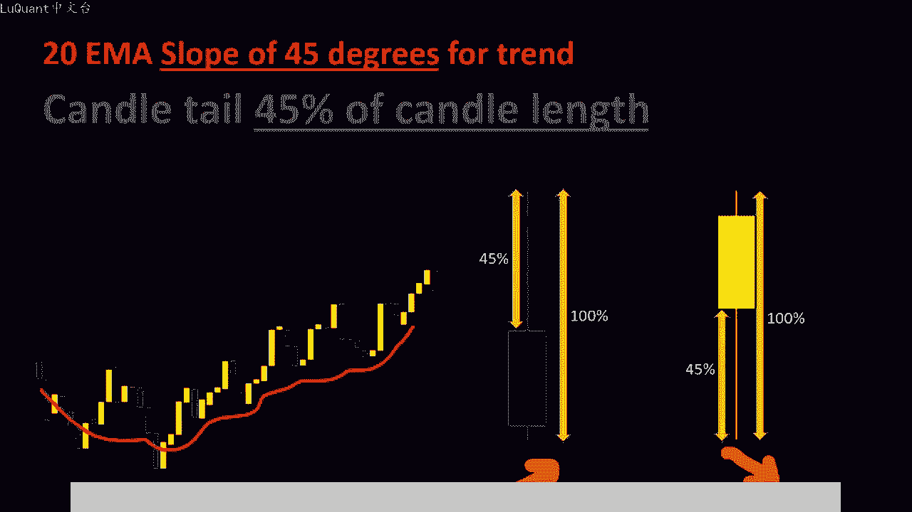
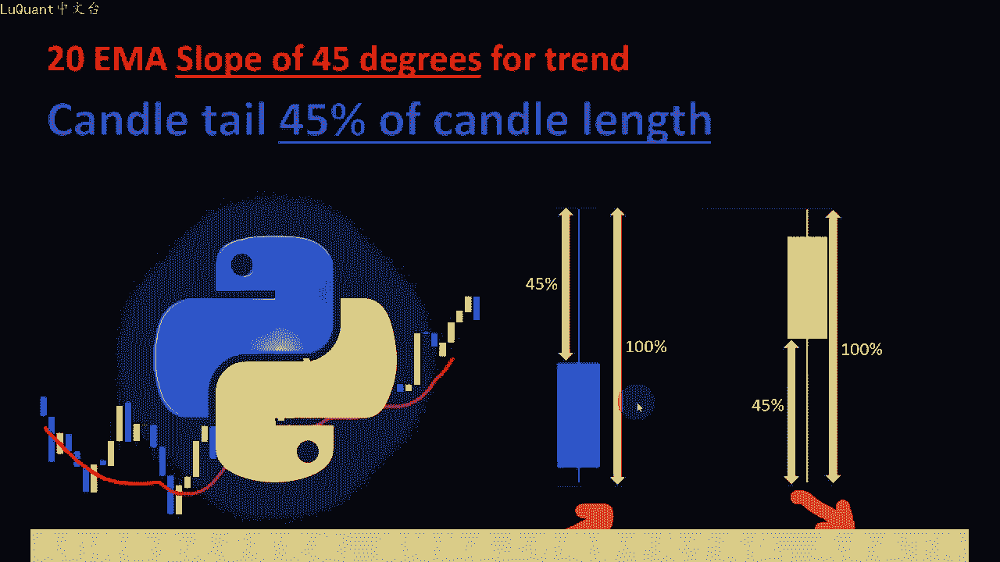
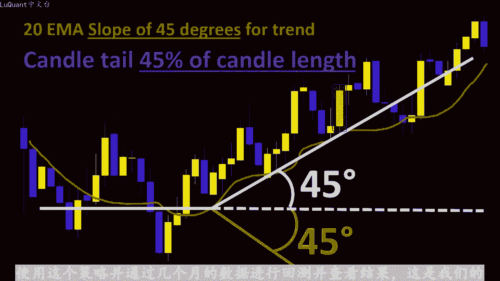
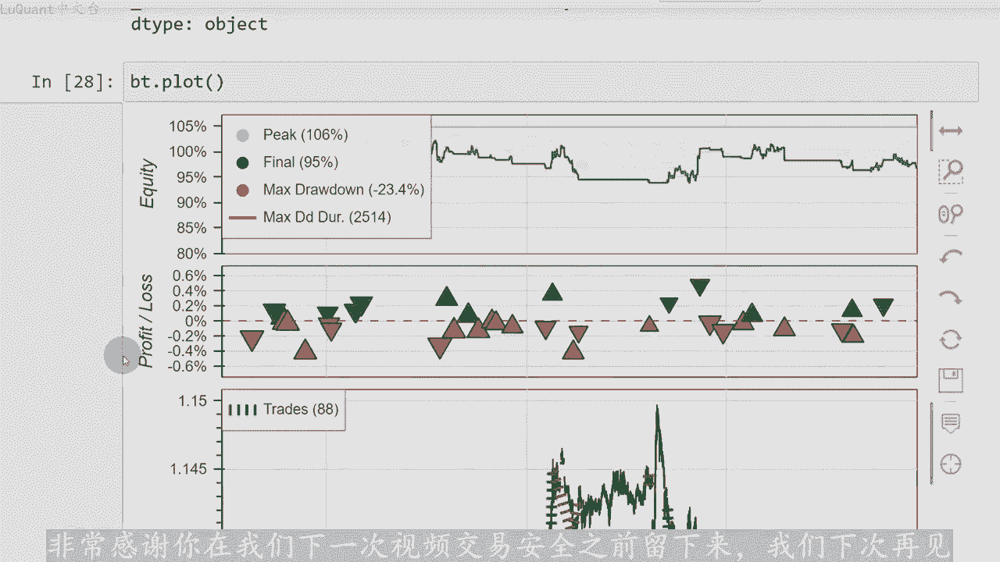

# python量化37：Retracement Bar - P1 - LuQuant - BV1wj421Z7cg

大家好，这个视频是我们在上一个视频中介绍的霍夫曼库存条回撤方法的延续。如果您对代码感兴趣，您可以从下面描述中的链接下载jupyter笔记本文件，以了解该策略本身。我不会自。检查所有细节。

正如之前简要解释的那样，我们正在寻找定义价格趋势的特定倾斜角度，同时寻找特定形状的蜡烛，其中尾部至少占之前整个蜡烛体积的40%。我们详细介绍了视频，并解释了如何在pyyon中检测这些柱形图。在本视频中。

我们将在交易策略中使用这些柱形图回测我们的系统，并检查该策略的结果。我们将寻找这些柱形图上升趋势或下降趋势中蜡烛的特定性。

我们将检查是否有突破，该蜡烛在上升趋势中处于高位或者在下降趋势中处于低位。在本例中，我们有一个上升趋势，我们正在此处检测该霍富慢回撤线。如果上尾长于整个蜡烛交易量的45%，这意味着。

上升趋势中，卖家试图做空市场并对抗上升趋势。但在接下来的蜡烛中，我们可以看到，收盘价高于最高价霍夫曼丑闻的前一个蜡烛，这意味着买家在市场上仍然更强。并且更有可能继续推高价格。在pyython中。

我们将读取每根蜡烛的收盘价，并检查其之前的相邻蜡烛是否有现在霍夫曼回撤线与任何算法交易程序一样，我们将具。可调整的参数，这是我们的第一个参数。在寻找霍夫曼酒吧时，我应该检查多少根蜡烛。

它是当前蜡烛之前的6根蜡烛，还是当前蜡烛之前的5根或10根蜡烛。其中我是否有霍夫曼蜡烛线，并查看当。😡，蜡烛是否突破霍富曼蜡烛的高点或低点之上或之下。因此。

我们要考虑的蜡烛数量是一个我们可以对其进行实验的参数，将其保留为我们的pyython代码中的变量。当然，如果我们有突破，如果我们处于上升趋势，我们将建立买入头寸。如您处于下降趋势，则我们将建立卖出头寸。

并设置止损和止盈值，这些值可以与ATR相关或用于例如，我们可以首先考虑之前蜡烛的最高值或最低值来设置止损，具体取决于我们是处于上升趋势还是下降趋势。所有这些都。在pyython代码中详细解释。

现在让我们编写在pyython中使用这个策略，并通过几个月的数据进行回测并查看结果。这是我们的jupiter笔记本文件。我不会详细介绍第一部分，因为他在上一个视频中进行了详细介绍。

我们在视频中简要介绍了霍夫曼酒吧使用外财务模块和15分钟时间范围加在59天的数据。我们重置指数，我们计算指数移动平均线，稍后计算止损和获利值时需要的AT。移动平均线的斜率也可以计算。

然后这部分在这里识别祸夫慢柱，考虑到此时移动平均线的斜率以及蜡烛的形状和测量值。所。如果您对此代码感兴趣，我不会再次详细介绍细节。您可能想查看之前的视频，其中解释了这些细节。

然后这部分用于可视化图表上的信号。这部分在这里我添加了指数移动平均信号，这就。😊，我们要测试蜡烛是否存在的地方在移动平均线之上或之下进行交易。在这种情况下，我们可以说我们有一个上升趋势和一个下降趋势。

它需要一个称为反向蜡烛的参数，该参数等于6。因此，在这种情况下，如果我们有6个连续的蜡烛在移动平均线之上或之下交易区。😡，我们可以说我们有一个上升趋势或下降趋势。

整个单元格中的MI信号只是一个额外的过滤器，用于确认我们已经在这部分中计算出的移动平均线斜率之上的价格趋势。在这。我定义了一个名为霍夫曼制动信号的新函数，它需要两个参数L是当前蜡烛指数。

以及我需要寻找霍夫曼蜡烛模式的后面蜡烛的数量。请记住，我们正在尝试找到一。任何霍夫曼蜡烛线之上或之下的突破，这里的后蜡烛线有点限制了，我要寻找突破的相邻蜡烛线的面积或数量。因此，在这个函数中。

对于L减去后，蜡烛线之间的范围内的每根蜡烛线蜡烛减去一。它是当前蜡烛，回望一定数量的后蜡烛，直到当前蜡烛。所以这是我们数据真的一小部分。如果信号为二，意味着我们有上升趋势，请记住，这里我使用的是L。

这是当前蜡烛的指数。因此我。在当前蜡烛和后蜡烛框架内的任何先前蜡烛中都有上升趋势。我们记得我在这里使用了R指数，它是L减去后蜡烛减去一之间的R当前蜡烛为L应。如果我们的总信号等于2。

则意味着我们在某个点有哈夫曼柱型蜡烛。同时，当前蜡烛当前蜡烛的收盘价指数L大于最高。R2蜡烛图霍夫曼蜡烛图。换句话说，当前蜡烛图在上升趋势中突破霍夫曼蜡烛图。因此，如果在这种情况下。

所有这些条件都得到验证，我们就有一个买入信号。因此我们将返回两个结果再相反。方向上，如果我们有下降趋势，我们有一个向下或倒转的霍夫曼蜡烛图。同时，我们正在突破当前蜡烛的最低值或最低价格。在这种情况下。

我们有一个卖出信号。我们。将返回之一。所以此时我有这个函数，它运行良好，我将把它应用于每一行。这意味着对于我的数据框中的每根蜡烛，我将把结果存储在siri中。然后我我将把这个理论复。到我们的数据框中。

所以任何标题为霍夫曼的列都暂时中断信号。此时我们可以可视化所有内容和信号，我不会在这里详细介绍这些方法，因为这些方法在之前的视频在这里，我们可以验。😊，我们的霍夫曼蜡烛是否被正确检测到。

所以我将向您展示一些例子。如果我放大，那么我们这里有一个明显的上升趋势，所以该点位于蜡烛下方，因为这是一根霍夫曼蜡烛，但是它处于上升趋势中应。一旦我们突破该蜡烛，就像一根蜡烛收盘价高于高点。

我们将检测到买入信号。这就是为什么我们在该蜡烛下方有这个紫色点，因为它收盘价高于由于之前的霍夫曼丑闻等。😡，所以我暂时不会详细介绍这些蜡烛的所有细节，只是为了向您展示代码运行正常，我们没有任何错误。

并且他正在检测我们将要检测的蜡烛想要检测。现在我们可以继续进行回溯测试。我们需要。😡，上升趋势的情况下设置止损。我们在前几根蜡烛中取最低价格，所以这里只有4根蜡烛。在下降趋势中。

我们将止损设置为前四根蜡烛中的最高价格，然后考。止损止盈比率或止盈止损比率，无论您喜欢什么，都可以轻松设置止盈，所以我将定义一个返回霍夫曼突破的信号函数。我像往常一样使用回溯测试模块。

只是为了回溯测试该策略设置止损。止盈的第一种方法将与ATR相关。所以我将4倍的ATR设为设置止损，止盈止损比率等于1。5。因此，我将在考虑到这个特定系数的情况下设置M止盈，并且我们一次允许一笔交。

交易规模为2095的净值而言，我们正在考虑50分之1的保证金或1250的杠杆，现金账户为1万。我们将在3个月的数据中测试这一策略。我们。回报率为51，因此他对于当我们的获胜交易百分比为50。90。

假设50%的净值并没有真正显示出稳定的增长。但这只是3个月的测。我们还可以检查设置止损的不同方式，并采取。当我们考虑到之前蜡烛的最高价或最低价时的利润。所以这就是我要运行的。我们的回报率为-4。8。

所以。对于这个特定的资金管理来说，效果不佳策略。如果我们绘制净值，我们可以看到它并不是真正稳定，它不是净值运动的增加或稳定增加。所以这就是这个视频的内容。请记住，我没有。😡，任何时间尝试优化这个策略。

我只是在尽可能短的时间内编写了这个代码。我只是向您展示了它是如何在pyython中完成的。如果您对它的策略特别感兴趣，您可以尝试复制代码，也许添加一些额外的技术指标，并使其成为可能按照你自己的方式工。

非常感谢你在我们下一次视频交易安全之前留下来，我们下次再。😊。

