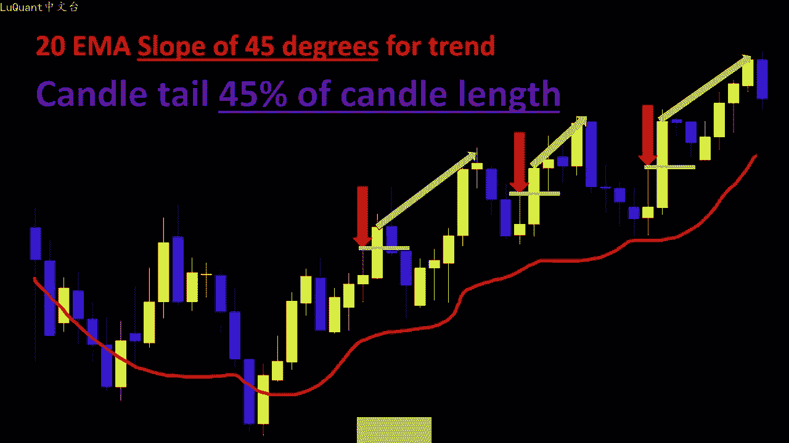
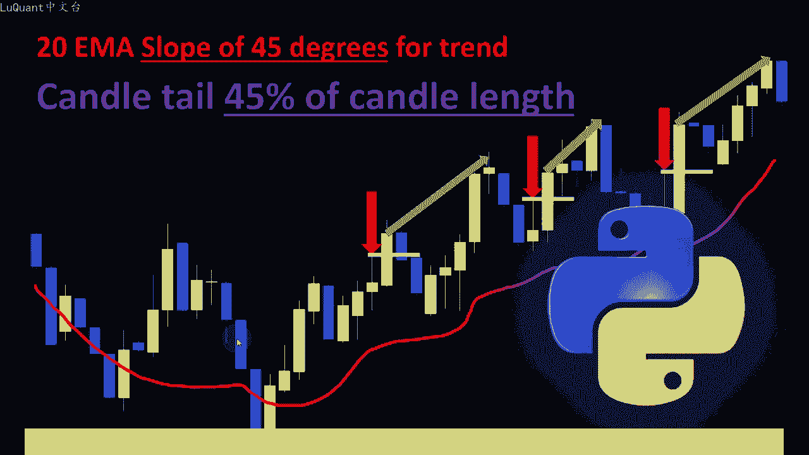
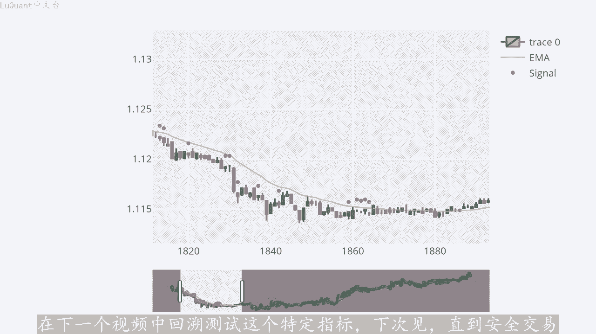

# python量化38：Retracement Bar2 - P1 - LuQuant - BV1Gf421Z7De

您好，在本视频中，我们将介绍哈夫曼的库存回撤栏。如果您对代码感兴趣，我们将了解如何在pyython中自动检测它说明中有一个链接，您可以在其中下载我拥有的joptter笔记本文件用于此视频。

因此第一个规则。检测价格趋势，检查二世帽斜率是否与水平线呈45度。当然，二世帽只是作为开始示例，你也可以尝试不同的周期来进行此移动平均。如果这是水平参考线，我们需要这个特。角度大于45度。

如果您正在追逐下降趋势，则负斜率也会与水平线形成至少45度的角度。并且如果您已经知道这个策略，并相信这个45度神话，我必须对此保持怀。我将向您展示为什么不可能在交易图表上定义这个角度。

当我们用pyython绘制这个指标时，我知道这对其他人来说可能听起来很刻薄。youtube发布了这个指标，但在可变访问尺度上寻找45度角在数选是没有意义的。但算法交易会带来一个解决方案，所以请耐心等待。

我们稍后会检查一下，至于该策略中的第二条规则，我们我们将搜索尾部至少占蜡烛整个长度45的蜡。这是一个典型的事例，其中上尾大于蜡烛整个运动的45，我们也可以考虑相同的形状在相反的方向。

下尾部大于整个蜡烛体积的45%。通常我们。在上升趋势中寻找这种特定形状，而在下降趋势中寻找第二种形状，背后的心理是我们正在寻找当市场上的卖家试图介入，以阻止上升趋势或买。介入已减缓或恢复下降趋势的时刻。

换句话说，如果您在上升趋势中看到这种形状，则意味着部分卖家在相反的情况下，我们有下降趋势，买家正在介入市场，他们正在抵制这。下降趋势。因此您可以看到蜡烛形态可以带来大量信息。

从这里我们可以定义我们的定制策略。一旦我们了解了这个例子中市场上发生的情况，我们就可以识别这些不同的蜡烛。我们的想法。😊，等到市场突破这些高值，因为这里我们有上升趋势，卖家试图恢复市场。

所以当蜡烛收盘价高于霍夫曼蜡烛的高点时，这意味着卖。实际上无法抵抗购买趋势，而买方仍然占据上风，并且趋势很可能会继续向上。因此，如果我们知道这一点，并且我们有了这些信息，我们可以介入多头投寸的买家。

如果我们看看这些假设之后会发生什么。😡，我们可以看到，在大多数情况下，价格将遵循我们的预期，至少这是霍夫曼蜡烛背后的想法，但只有一种方法可以找出该指标的长期结果。那就。

使用我们的pyython代码进行回溯测试。我希望该视频尽可能短。所以在这里我们仅解释如何检测霍夫曼蜡烛，并在我们有一个时生成一个信号。在另一个视频中，我们将在完整的交易策略中使用该指标来进行适当。

回测，这样我们就可以开始使用Y金融模块下载数据。我将Y金融导入为YF和我的数据框，将等于YF download函数，并在15分钟的时间范围内下载59天的欧元美元数。因此，无论如何。

如果我们使用小于60天的短时间范围，我们就会受到限制。如果您想要更多数据。您可以随时以60天为一组下载这些数据，然后将您的数据帧连接并组装成一个。数据真显然，如果您对其他货币。

例如比特币、美元或其他货币感兴趣，您可能会以及下载这些使用外财务模块非常容易。因此，一旦下载了我们的数据，我就会检查我的数据框，以便它已加载，并且我们拥。😊，所有数据现在如果你想保留索引。

我们可以重置索引日期时间，你也可以跳过这一行。但对于这个例子，使用像012这样的整数值，索引更容易只。我们在此数据框中拥有的行数或行数，然后我们可以计算指数移动平均线。

我将使用pada underscore技术分析包，将其作为新列添加到我们的数据框中。因此它是pada underscoreistta，然后。使用em码函数提供蜡烛的收盘价和那么长度等于20。

您也可以将其更改为30或35或任何适合您策略的值。然后我将计算移动平均线的。为此，我们必须考虑移动平均线的点数，考虑移动平均线。例如，我采用20倍移动平均值，并且将考虑到这20个先前的蜡烛来计算近似性。

计算斜率值，并将其存储到我们的数据框中的新列中。其中我正在调用斜率emma，所以我只是在这里验证我们是否将星列添加到我们的数据框中。在这种情况下，我们可以继续并开始计算我们的信号。首先我正在创建一个。

列表。该列表以初始化为包含信号的数据帧的相同长度的零值，然后我定义一个称为斜率限制的新变量，这非常重要。因为这。用水平线替换45度角，换句话说，这是更像是角度的正切，而不是简单的使用角度本身。

因此它可能会改变，限制可能会根据我们要使用的数据真儿改变，所以它不。在所有时间范围内都是45度，这时我将向您展示为什么另一个变量是百分比限制即0。45，这是蜡烛总体积的尾部百分比，它被故意保留为变量。

以便我们可以对其进行使。如果当前蜡烛的斜率小于减去斜率限制，换句话说，如果我们的负斜率超过斜率限制变量，那么我们将为蜡烛放置0。5%或0。35%或35%的尾部。因此我们处于下降趋势。

并且我们超过了一定的角度线。同时，我们有这个特定的霍夫曼蜡烛模式。因此，如果蜡烛的最小部分及蜡烛主体的下部，在开盘价和收盘价之间的差异与蜡烛的最低低。这个差异意味着下围，所有这些都是为了定义蜡烛的低位。

除以最高价减去最低价。这意味着蜡烛的整个范围大于百分比限制。所以如果这个比。大于0。45，那么我们在下降趋势中有一根霍夫曼蜡烛，并且该特定蜡烛的总信号等于一。因此，换句话。如果斜率为正且大于斜率。

我们刚刚在下降趋势中检测到相反方向的霍夫曼蜡烛极限值是我们斜率的阈值。同时我们有unhman蜡烛，但方向相反，意味着蜡烛的最高点减去蜡烛主体的高。除以蜡烛的整个范围。

意味着最高点减去蜡烛的低值大于百分比限制。则我们有一个处于上升趋势的哈夫曼蜡烛。在这种情况下，当我们计算信号并存储时，对于该特定型或该特定蜡烛，我们的总信号等于。此列表中的结果称为所有行的点信号。

所有蜡烛我们将把它们添加到我们的数据框中，作为一个称为tlk信号的新列。此时，我们可以在图表上可视化我们的信号。这部分我们在之前的视频中简要介绍过，我们正在。每个X只定义一个名为点位置的新函数。

我们将检查总信号是否等于一。这意味着，如果我们处于下降趋势，并且我们有一个哈夫曼蜡烛。其中，如果我们在当前蜡烛的高点上方放置一个新点。相反，如果我们处于上升趋势。

我们将在当前蜡烛的当前低点下方放置一个点，我将把这些位置添加到新的数据框列称为点位置。所以。将这个特定的函数作为每行的lam姆da函数应用，这意味着对于每根蜡烛。

这样我们就可以在图表上获得每个哈夫曼蜡烛的信号点的位置。然后我使用绘图线图下划线对象，我将会。数据框的一部分，比方说索引800到1000之间的数据框切片，我们正在绘制每根蜡烛的开盘价、收盘价和收盘价。

这是一个烛台图案。因此我们我们的图表上将有烛台。因此我们在这。添加橙色的ar指数移动平均线，宽度等于一图里的名称等于M。在这里我们添加散点或信号位置点。我们刚刚在上一个单元格中计算过。

如果我们运行这一部分我。可以用这种方式绘制800到1000根指树蜡烛。我们可以看到紫色点显示我们有霍夫曼蜡烛的信号。所以我要做的第一件事，值得一提的是，这些45度神话角度或任。你可以看到的角度。

这远远超出了45度，我的意思是用水平线测量它大约是80度或70度。但如果我们放大，我们注意到角度正在减小，所以现在我刚好低于45度，也许大约45度左右。所以从视觉。😡，我想告诉你的是。

你不能说我们有45度角或50度角或任何角度，因为你的角度您将感知到您将在您面前看到的角度。您将在视觉上估计，这在很大程度上取决于。😡，您正在使用的时间范围以及您的X轴和Y轴的比例。如果我们改变的话。

Y轴刻度或X轴刻度这个角度将会改变。这就是为什么我将它保留为变量的原因。我更喜欢在这种情况下使用。记住我们在这里使用斜率限制，这样我们就保持这个参数打开对于实验。我们不固定45度或我们要使用的任何阈值。

因为它将取决于时间范围和许。其他参数我们可以注意到的第二件事是我们可以检查一些蜡烛，这是真的，这是一根霍夫曼蜡烛。我们有一个上升趋势，根据霍夫曼策略，每当我们突破或蜡烛收盘价高于这些高值时。

在这种情况下更。😡，可能表明趋势将继续向上，我们可以通过以下方式验证这一点检查我们刚刚使用我们的算法检测到的一些事例。例如这里的这个特定信号显示出强劲。霍夫曼蜡烛。

然后我们有一根蜡烛收盘高于这个特定高点，但是我们没有看到持续上升趋势有任何增加，就像任何其他一样，指标有时有效，有时无效。但在某些情况下，看到这根蜡烛。更令人愉快的，例如，这里的蜡烛被这个蜡烛打破了。

我们的收盘价略高于该特定蜡烛，我们可以在此处进行有利可图的交易在其他一些情况。这些信号并不像我们想象的那么令人印象深刻。在这里我们没有一个非常流行的市场。因此，对于那些知道您所知道的策略的人来说。

霍夫曼蜡烛实际上并不是一个值得遵循的好信号，很好，这是一种可以帮助您。😊，趋势市场中选择切入点的策略。因此，当你有像本利这样的横盘图表时，我们不希望使用霍夫曼丑闻，获得良好的交易信号。好吧。

这就是全部这个视频，希望你们喜欢他，请继续关注更多内容，我们将尝试制定策略。在下一个视频中，回溯测试这个特定指标，下次见直导安全教。

