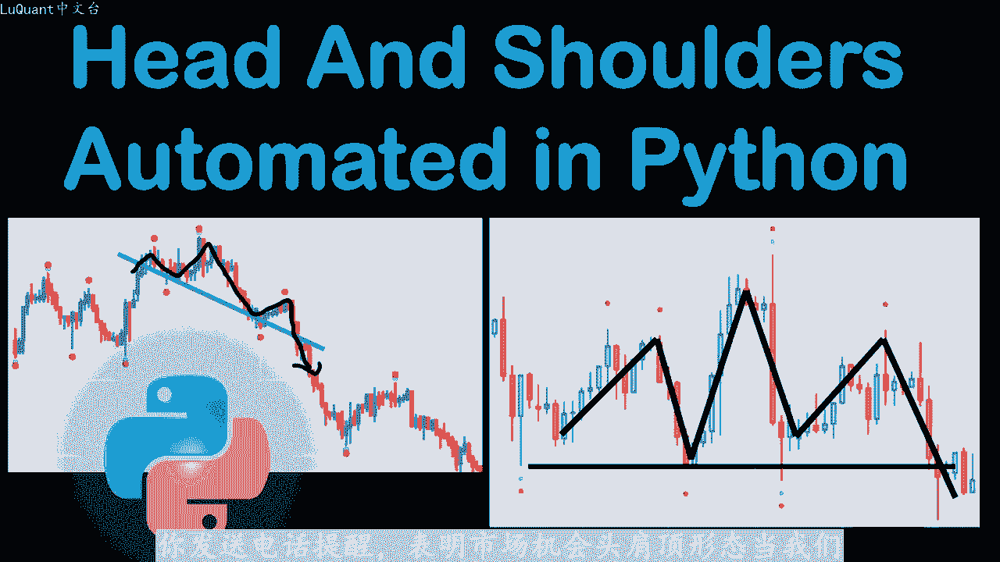
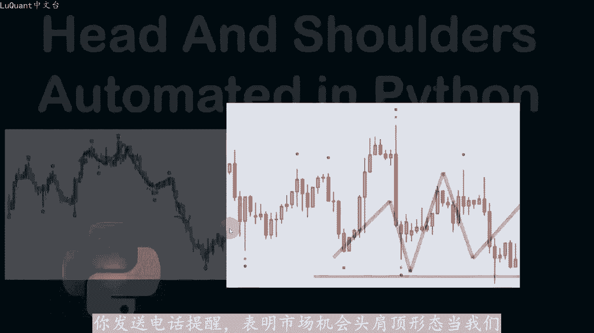
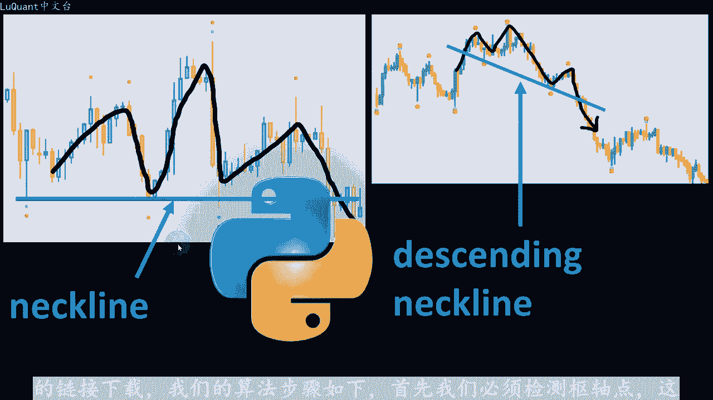
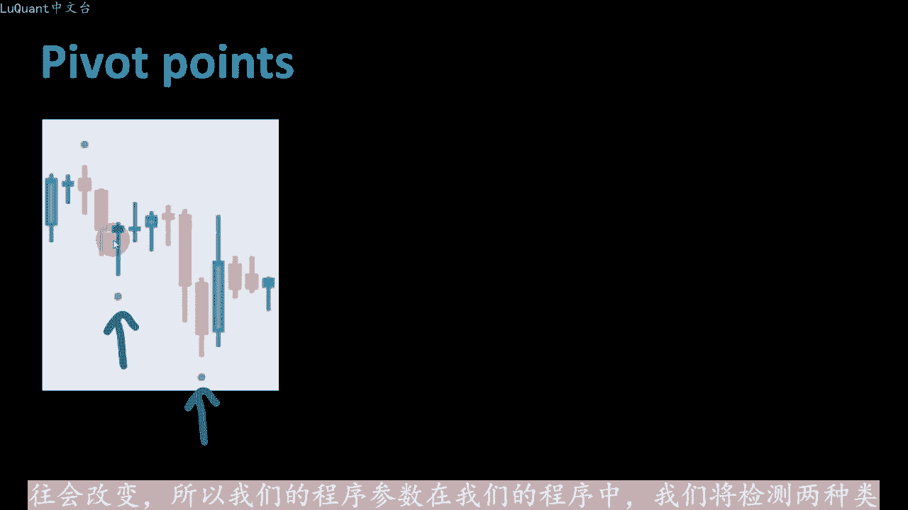
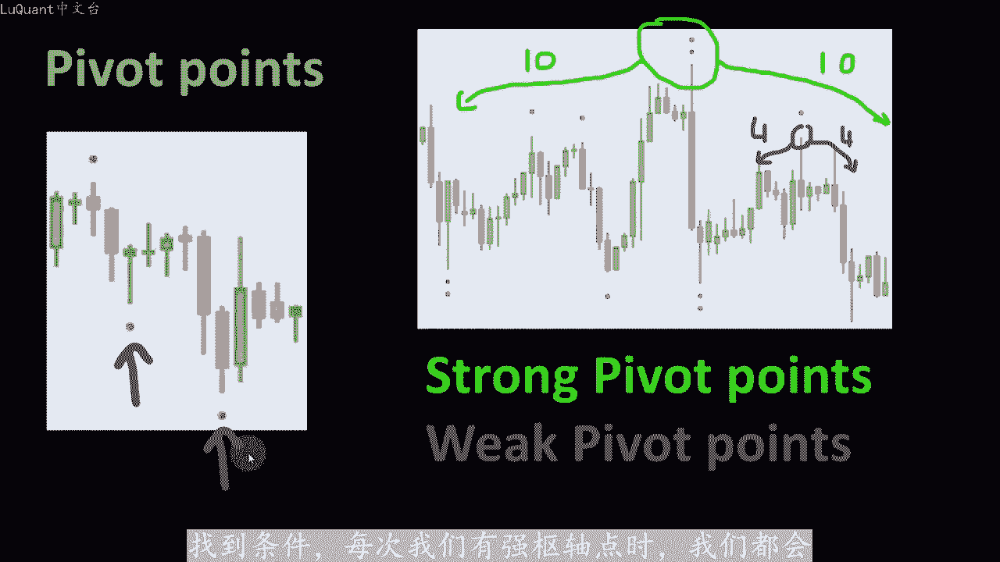
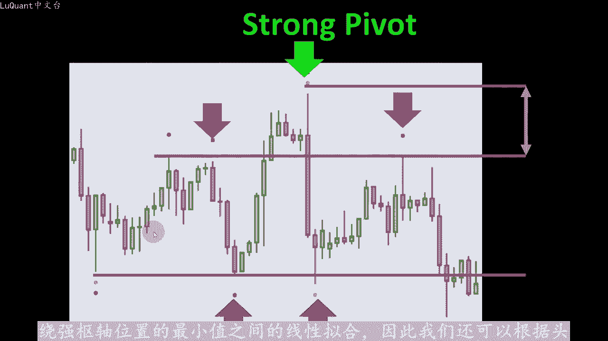
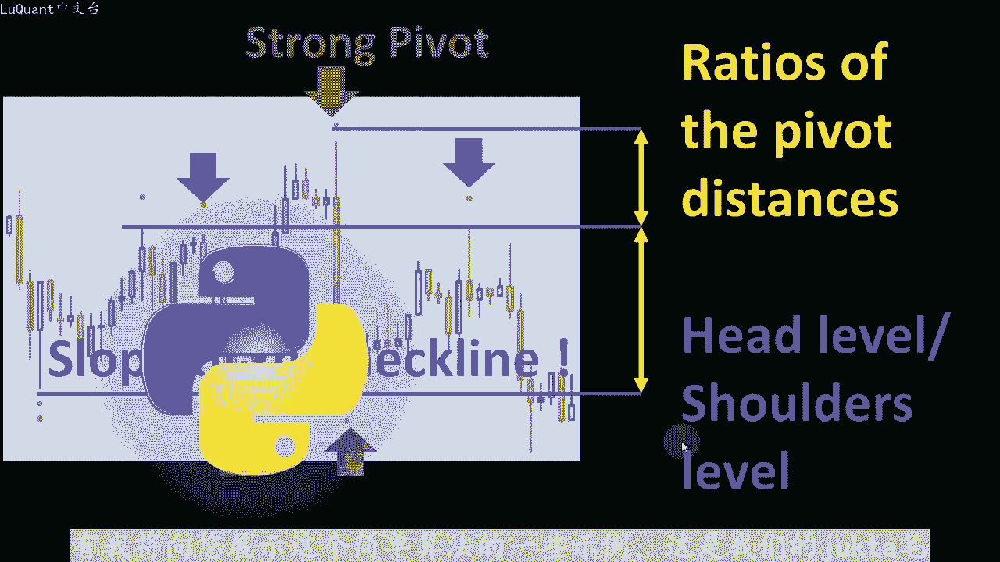
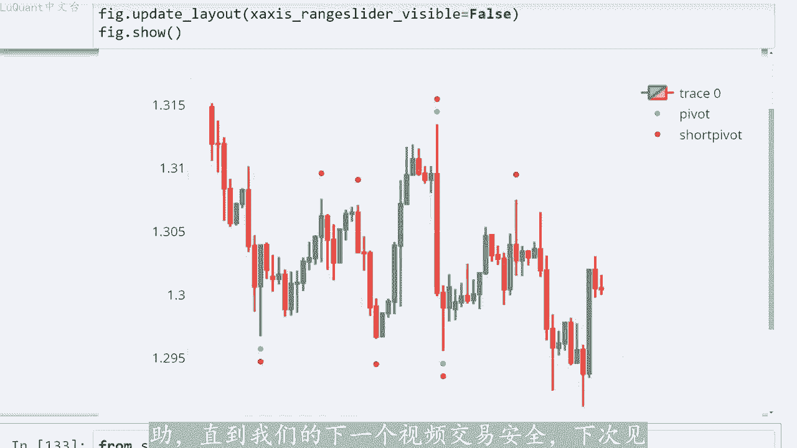

# python量化39：自动化交易的问题 - P1 - LuQuant - BV1rt421G7Q3

头肩顶价格形态的检测可以在pyython中自动进行，这样你就不必一直坐在屏幕后面。理想情况下，你会有一个程序为你读取市场，并向你发送电话提醒，表明市场机会头肩顶形态。当我。

形成一个高点，然后是一个比价格下跌更高的高点，然后是另一个弱于中心峰值的高点。我们将其称为头十就可以看到它。所以我们可以明白为什么它被称为头肩形态通常较低的价格走势会。称为颈线的支撑线上方反弹。

这种形态可能有不同的变化。例如，此图表显示相同的头肩形态，但颈线是负斜率。在这种情况下，我们将其称为颈线下降的领口。在本视频中我们将解。可以自动检测这些模式的算法。

并了解如何用pyython编写所有内容，包含源代码的jupiter笔记本文件，可以从本视频描述中的链接下载。我们的算法步骤如下，首先我们必须检测书轴点。

在之前的视频中也进行了简单的解释，我们正在寻找蜡烛中低于或高于相邻蜡烛的低值或高值。例如，我们有一个低值低于所有邻居值，假设我们感兴趣的蜡烛右侧的三根蜡烛。左侧的三根蜡烛，另一个例子就在这里。

该特定蜡烛的最低值低于右侧的三根蜡烛和三根蜡烛在左边。所以在这种情况下，这些是低输轴点。当我们寻找输轴点时，在这种类型的比较中要考虑的蜡烛树。无论是三个还是四个相邻的蜡烛，还是更多相邻的蜡烛。

都作为代码中的变量留下，所以我们可以进行实验，因为没有完美的设置，市场往往会改变。所以我们的程序参数在我们的程序中，我们将检测两种类型。😡。

书轴点。第一个我将称为强书轴点。因为这些点与宽范围进行比较例如，中心峰值左侧的1个蜡烛和右侧的1个蜡烛。第二种类型被称为弱输轴点，仅仅是因为它们与较。数量的邻居进行比较，因为您可能会猜测。

若输轴点更频繁比强输轴点。因为当我们将中心蜡烛与算法中的少量邻居进行比较时，更有可能找到条件。每次我们有强输轴点时，我们都。

从左一开始搜索弱殊轴，从右侧围绕中心强输轴，我们还将寻找左侧和右侧的最小值。就像我们在本历中看到的那样，此时我们可以开始考虑添加一些参数来改进我们。算法例如，测量强书轴高度与弱书轴水平之间的距离颈线。

被检测为围绕强书轴位置的最小值之间的线性拟合。因此我们还可以根据。

尖的类型来考虑颈线的斜率，我们想要检测的形态。例如，如果我们正在寻找下降的头肩形态，我们可以允许负斜率，或者如果我们想检测上升形态，我们可以在我们的程序中设置颈线正斜率的条件，目前保持斜率几乎等于0。

这样我们就可以检测到高于某个水平，支撑位的正常头肩，当然，这可以更改，这是一个您可以实验的参数。如果您下载了，我们也可以想到的程序书轴距离的比率，例如第一。距离处以到颈线的距离。换句话说。

头部水平高于肩部水平。因此您可以看到这种类型的检测不是很简单，但同时也不是不可能实现。请记住，没有完美的程序因。我们的算法将检测到某些形态，而有些将被简单的跳过。我相信任何程序都可以进一步改进。

以检测市场上的更多机会。因此，我们将编写所有我将向您展示这个简单算法的一些事例。这是我们的jata笔记本文件。我不。

详细介绍单元格，它只是加载数据，我使用的数据与我在之前的视频中使用过清理体积为零的蜡烛，然后重置数据针索引。然后我们定义数轴ID函数，该函数将检测我们的数轴ID的位置内。蜡烛是高书轴，哪些是低书轴？

这是我们之前的视频中也详细介绍了这一点。其中我们介绍了一个检测三角形模式的程序。因此，此时我们可以使用此函数来检测强书轴点。为此我。在左侧使用15个蜡烛，在右侧使用15个蜡烛，以便于高值和低值。

而对于短输轴点或弱输轴点，我们仅在左侧查找5个蜡烛，在右侧仅查找5个蜡烛。此。这两个数据都将作为新列添加到我们的数据框中。我们希望可视化我们的强输轴点和短输轴点或弱输轴点。

这两个点都被添加到我们的数据框中。因为点位置注意到，我们将高数轴。信号放在蜡烛上方，将低输轴点信号放在蜡烛下方。因此，我们正在检测强输轴点和弱输轴点，并将这些位置都添加到我们的数据框中。

这部分内容将不会在本视频中详细介绍。因为我们也。之前的视频中使用过这些函数，因此，如果您对有关如何制作这些函数的详细信息和解释，您可以查看我之前关于自动检测支撑位和阻力位的视频。

此时我们可以选择数据帧的一小部分来绘制我们。😊，绘制烛台的开盘价和阻力位收盘价，我正在使用pl light包，并且我使用函数ad under scatterr添加点到我们的绘图中，使用我们计算。

并添加到我们的强书轴点的坐标。弱输轴点的坐标数据框，这就是我们此时得到的。我们有紫色的强输轴点，注意到它们比红色点出现的频率要低，我们只有一个、两个和三个点，而红色点。频繁，因为它们代表弱点输轴点。

如果我们可以看到这是一个头，这是两个尖，这是由我们在这里解释的程序自动检测到的。因此要检测蜡烛是否是头尖型或者是头尖型形态的一部。我们将在以下范围内查找蜡烛ID假设这里要测试的蜡烛。

我从蜡烛索引12000开始，直到索引长度减去后，蜡烛参数。我使用后蜡烛的原因是对于我正在寻找的每个数轴。假设左边有14根蜡烛，右边有14根蜡烛，以、检查是否有两个最小值和两个最大值。

并且具有定义头肩形态的特定条件。所以我们说这是我将在其中测。当前蜡烛形态存在的窗口的半宽度，这意味着我锁定蜡烛ID点书轴的DF与两个不同，这意味着它不是强书轴，也不是弱书轴。请注意。

我们只测试头尖的一个方。在此函数中未检测到倒转的方向，因此，我们必须为此构建一个不同的函数。无论如何，此时，我们正在测试当前蜡烛是否不是弱数轴或弱数轴强数轴，然后我们可以继续这样我们就可以跳过这个蜡烛。

因为目前我们对它不感兴。😡，但是如果我们刚刚找到一个强书轴点，我们将记录最大值和最小值。我们将创建4个最大值及其坐标以及最小值及其。X轴和Y轴上的坐标的不同数组，这些是空的nP数组。

目前我们还需要四个不同的变量来计算前后的最小值和最大值一根中心书轴蜡烛。因此，当我们找到书轴蜡烛或书轴点。我们会查看之前的后蜡烛数量，此处为14根蜡烛，因此我们会向左查找14根蜡烛，向右查看14根蜡烛。

并检查最小值和最大值，并计算这些。这些是这些最小值和最大值的计数器。所以当我。蜡烛ID是一个书轴点，如本例中的强书轴点。10、我将测试I和范围，从蜡烛ID减去后面的蜡烛直到蜡烛ID位置，加上后蜡烛。

因此，从中央蜡烛ID的左侧和右侧开始，如果我。有一个若输轴点即最小值，我们将追加或添加坐标到这些nP数组中，这样我们就有了最小值的高度和X最小值的位置。同时我们将在I技术之前增加最小值的技术。

如果I小于蜡烛ID，换句话说，如果最小值在之前或之上，则加一中央蜡烛的左侧。如果它位于中央蜡烛的右侧，我们将在中央蜡烛之后增加最小值。同样的事情。如果我们找到一。若输轴点的最大值。

我们将计算坐标并最大值和smax numberP数组。我们将增加蜡烛之前的最大值和中央蜡烛之后的最大值的计数器。这就是我们在蜡烛图左侧和右侧包含这些最大值和最小值的计数器的原。

我们刚刚找到的中心枢轴点是，如果我们找到一个没有任何这些最大值或他们的数轴点，或者在某个点没有最大值或最小值的最小值，那么它是没有用的。因为我们不会找到任何头肩形态的形。记住，为了形成头肩形态。

我们需要这个最大值作为强输轴点。但同时我们需要左侧的弱殊轴点及最小值，并且我们需要两个最大值，一个在强输轴点之前，一个在强输轴点之后。所以如。计术之前的计数器最小值小于一或计数之后的最小值小于一等等。

当我们缺少这些对于形成至关重要的点之一时，之前的最大值和之后的最大值都小于。在这种情况下，我们继续头肩形态，这意味着我们跳到下一个蜡烛ID。因此我们将测试另一根蜡烛。如果情况并非如此。

这意味着我们的强书轴点之前和之后是否有最小值，并且在强书轴点之前和之后是否有最大值。在这种情况下，我们可。😡，使用线性回归函数，将最小值拟合成斜率。

该函数将是我们能够访问最小值的斜率、节距和相关因子及R最小值。因此，现在我们可以找到强数轴点索引及R在最大值中调用这里的头索。它是最大值的小nP数组，并且还将包括头，不仅包括弱数轴点。

而且还将将强数轴添加到此某某最大值和最大值中，以便找到头。我们将使用nP的A max函数。搜索最大数组中的最大值，这就是一切发生的地方。所以这些条件将定义头肩模式，所以我们需要头部索引，意味着头部减。

头部索引的最大值减去一，因此减去头部之前的最大值的级别。因此该级别减去该级别，这里的差异应该大于某个阈值。假设这里我们。更大的值比1。510到-3。您当然可能希望更有选择性。在这种情况下。

您可以增加该值。目前我们坚持使用1。510到-3，这同时适用于欧元美元图表。我们需。最大的意义，头部的水平减去最大值的水平即在中心头部右侧的头部意义之后。

就在这里这个最大值这两个水平之间的差异也应该大于相同的阈值即1。5亿0。-3此时同时我们需要最小值的绝对斜率，这是此处的支撑位。您需要它有点水平，除非您想要头肩顶减少或头肩顶增加，取决于。

试图在数据中查找或检测的模式。因此，为了这个事例，我只是将其保持水平，只是为了看看它是如何工作的。我们将此条件放在最小值斜率的绝对值中小于或等于10到-4。同样在这里可能想要更有选择性。

您可以将十到负或简单的等于0，但这会减少您将获得的案例或编组数量的信号数量。您将能够检测到我只坚。这些条件当然您可以在这些条件之上添加诸如特定比率之类的内容。例如。

有些人更喜欢这种差异小于此处最高点之间差异的3分之1头部和支撑。或头肩形态的颈限。因此，在这些条件下可以添加任何内容。为了这个视频，我坚持使用简单的条件。当我们运行这个函数时，它将搜索蜡烛ID。

其中我们有这些条。我们得到指数15412。所以如果我们回去并绘制它15412，它就是这个特定的蜡烛，它是最高的输轴点或围绕它的强输轴点。我。有一个头尖形态的形态，我们可以尝试寻找不同的形态。

让我们从12000开始。假设我们从零开始，我将运行这个，所以我们得到指数6369，我们可以去返回，并围绕这。😡，特定的蜡烛进行绘制，所以我绘制了6350和60390之间的切片。

这就是我们得到的这是他们通过我们的算法检测到头尖形态的结果确。我们有一个头，我们有两个肩膀，这不是最对称的形态，但它运作良好。我们有这个支撑位，适合不同最低点的斜率几乎是水平的。所以理想的情况是。

如果价格跌破该形态，则交易该形。😡，如果您有更多时间花在完善这两条线上，那么我们就开始下降趋势，或者可以进一步改进这些条件，以便更具选择性并过滤那些错误信号这段代码，但在这一点上。

如果您对这个特定的模式感兴趣，他提供的东西是有希望的。所以这就是我要向您展示的投。😡，视频的全部内容，我希望你们喜欢他。我希望您发现这些信息很有帮助，直到我们的下一个视频交易安全。下次。😡。

