# python量化3：实时交易策略 - P1 - LuQuant - BV1qu4m1T7dj

大家好，欢迎回来。这是我正在使用pyython在市场上进行实时测试的实时交易机器人的股票曲线。因为我们可以看到到目前为止，这是一个积极的趋势，并且每日汇总结果显示，大部分是积极的交易日。

今天我将展示你是一个实时交易机器。😊。

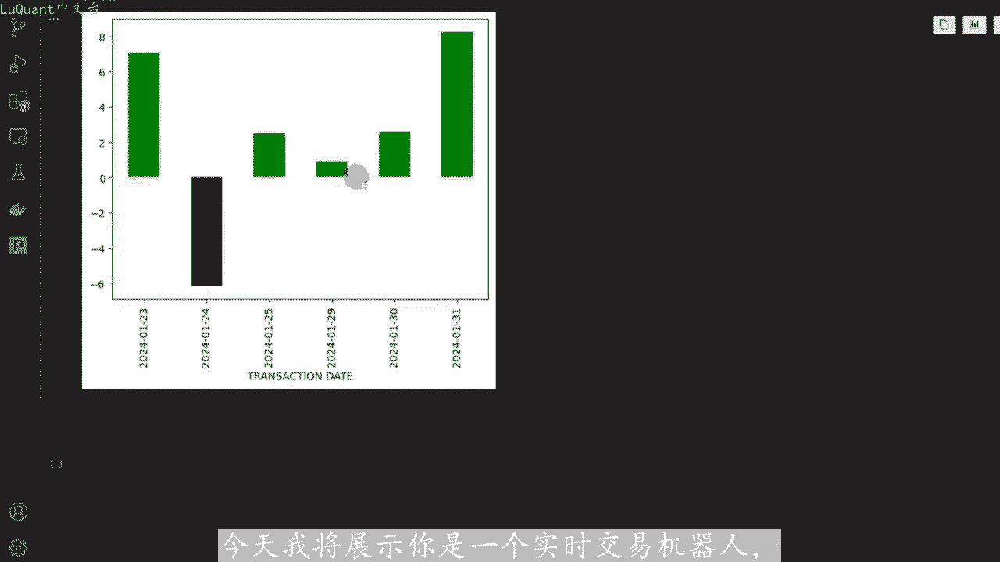

我正在使用我们在上一个视频中介绍的策略来运行它。因此我们可以在考虑点差佣金和所有交易费用的情况下，在市场上实时测试该策略。我们将看到如何在pyython中构建实时交易，必因此，如果这。

您第一次使用此频道，您可以在市场上实时运行自动交易策略。我通常会分享pyython代码，以便您可以从本视频描述中的链接下载今天的代码。这是我们首先对此会议的计划，我们将选择一个经过优化和回溯测试的策略。

其次，我们将在连接到市场的实时交易机器人中实施该测。😡。

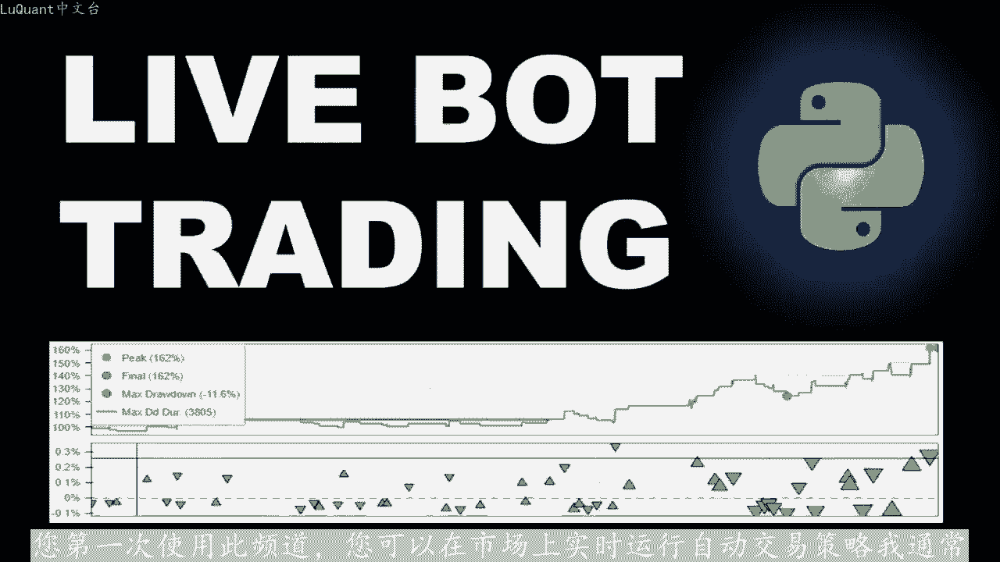

我们将让该策略运行几天，最后我们将评估结果。以便您可以看到，这是一个在实际条件和新数据上测试您拥有的任何策略的好方法。今天我们将使用的策略与我们在上一个视频中优化的策略相。

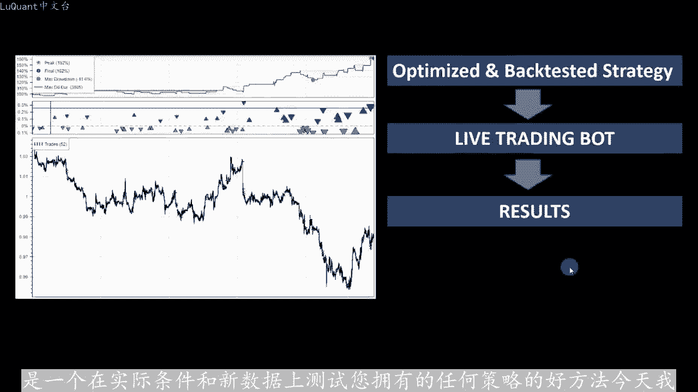

因此，只需快速回顾一下，我们将根据指数移动平均线检测价格趋势，我们将使用布林线，选择我们的切入点，了解更多详情。请查看我之前的视频，它展示了我们如何定义与此策略相关的函数。

以及我们如何优化它回测它已获得最佳参数级。因此在回测中，结果达到61达到的百分比涵盖近35天交易的数据回报。因此，几乎是6周的时间断值损失根据ATR定义的平均通过范围。

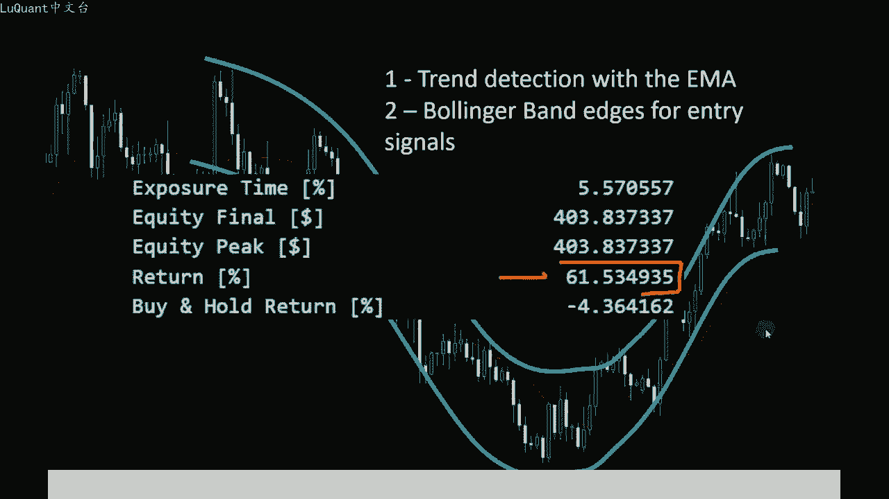

盈值也与止损距离相关，因此间接与ATR也是如此。如果您错过了上一个包含详细信息和策略优化的视频，我将在描述中留下一个链接，以便您可以返回观看视频，并确保您没有错过任何。

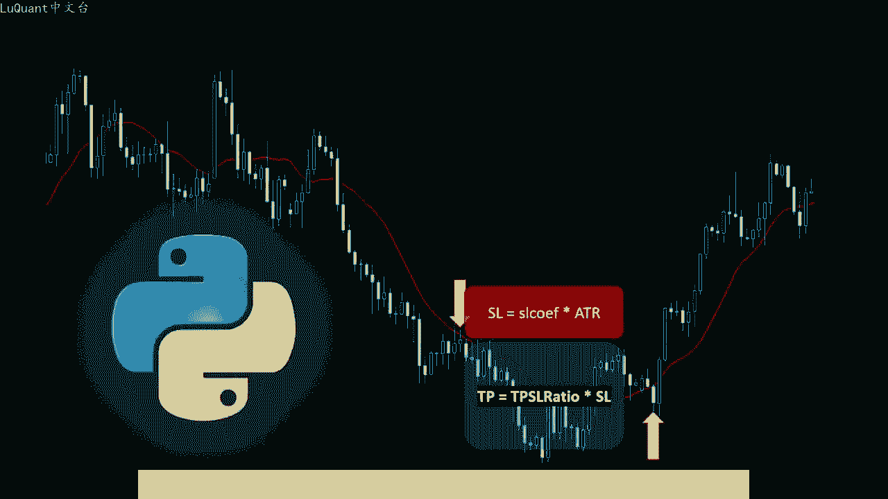

返回的信息通过优化回测，我们可以注意到，在近20天的时间里，我们没有任何利润，只有在测试期结束时，该策略才获得正回报。我展示这一点的原因是为了管理我们需要的预期，请注意几周。😡，几天可能会出现负面结果。

这是交易的本质。但有时我们会很幸运。在实时测试开始时，我们会立即看到一些积极的结果，而无需等待几周或几天。现在让我们看看pyython代码便利函数，并运行我们的实时测试。就在我们开始代码演练之前。

如果您要在不同的资产上测试策略，请分享一些见解，那就太好了。你在评论部分的发现，我很好奇我们能走多远。所以在第一个单元格中，我们导入padas pandas。😊。

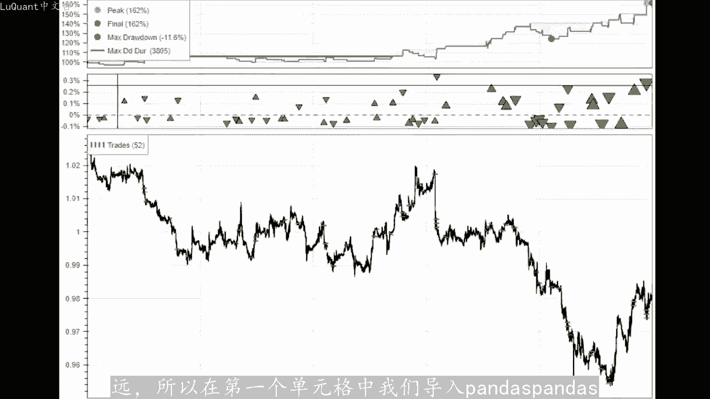

技术分析调度程序。因为这是我们将用来启动这个功能或这个机器人一次每5分钟或每天一次，具体取决于您交易的时间范围。并且我们使用的是wonda，因此我们使用的是onP版本2。等等。因此我们导入所有这些。

然后我定义第一个函数即MI信号，此函数将测试快速MI是否低于慢速M，然后它将返回一，这意味着我们处。下降趋势。反之，如果快速艾高于慢速艾，我们返回二式上升趋势，在任何其他情况下我们返回零。因此。

该函数将采用数据框小数据框，采用当前蜡烛指数和后面蜡烛的数。来考虑慢速和快速em。所以我们需要一部分数据框，包括一些后面的蜡烛，以便能够计算移动平均线第二个函数是总信号。因此它将计算em性。

如果我们有上升趋势，它将测试MI信号低于或如果蜡烛收盘价低于80格带的下边缘。因此，如果当前蜡烛的当前收盘价小于或等于当前蜡烛中的80格。那么在这种情况下，我们返回两个，这是我们的入场信号。

对于相反情况下的多头头寸，我们需要下降趋势和收盘价或蜡烛收盘价高于巴陵格弯区的上边缘。在这种情况下。返回一个，这意味着它是一个单元格信号或在我们返回的任何其他情况下的空头信号零。

所以对于这个紧基于该频道上一个视频的回溯测试，我使用长度为15且标准差为1。5的biner带。您想知道我们为什使用它请访问上一个视频，我们有一些优化，我们正在展示它是如何工作的参数。

以及我们从这组参数获得的最佳结果是什么？现在好，因为我们使用wonda连接到市场，您将需要两件事。第一个。访问令牌。第二个是您当您登录账户时，通常可以在网站或万达平台上生成它。

然后您需要您的账户ID以及您进行交易的账户。现在我们可以定义更多我们将要使用的功能。对于我们的训练。第一个。获取蜡烛恩，所以所有这个函数都会查询anda或您的经纪人的平台。

并且它将下载您放在这里作为参数的蜡烛数量，以便我可以获得最后1个100根蜡烛，最后5式。蜡烛或最后20根蜡烛具体取决于我的交易系统的需要。在这种情况下，我们测试它只是为了查询最后三根蜡烛。

看看它是否正常工作。如果我们这里有te，那么对于蜡烛印刷中的蜡。试穿蜡烛出价打开欧表示，未平仓头寸大于一。在这种情况下嗯返回true，因此我们有三次te，因为我们查询了三根蜡烛。

这就是我如何确保我通过我的访。令牌和账户ID连接，并且一切正常。因为这里用这些来从万达平台抓取蜡烛。所以现在我知道他正在工作，我的代币正在工作，我的账户ID正在工作，我可以继续使用我的代。

然后另一个函数是技术开仓交易，我们将这个函数定义为计算未平仓交易的数量。因为我们需要一次打开一笔交易，所以我们需要计算当前市场上与我们目前使用的账户相关的未平仓交易数。这就是我们的原因定义了这个函数。

它使用API它使用访问令牌账户ID，并且将使用客户端请求请求2表示交易open为这个特定账户进行交易。所。我们在这里使用的账户ID将会返回响应的长度。所以这些交易的长度。

现在这个函数获取蜡烛框架将获取最后的蜡烛。所以它将使用蜡烛或。蜡烛函数是我们在这里预定义的函数，它将把蜡烛的数据转换为带有开盘价、收盘价和低价的padas数据帧的数据帧。因此。

我们只是以一种方式重新格式化数。一个形状以一种易于使用的方式，就像endda数据框一样。然后我们将ATR添加为一个新列。我们正在使用技术分析tendsportta，我们还计算快速移动平均线。

所以长度30的慢速移动平均。长度50的RSI以防需要长度10和80隔带长度15和标准差1。5。所以这是我们预先计算蜡烛所需的几乎所有内容作为经典技术指标的地方。现在我们可。定义交易工作函数。因此。

在这个函数中，我们将把所有内容聚合在一起，并执行我们的交易。所以首先我们将使用获取蜡烛框架，我正在查询70根蜡烛。所以现在我们有了一个数据框。它被称为DF stream。

所以一个数据框架包含蜡烛开盘价、低高收盘价RCH快速和慢速移动平均线。所以一切都是使用这个函数完成的，并且它存储在DFU变量中，然后我们可以进。信号。所以我们调用总信号，我们将数据帧作为参数提供。因此。

当前数据帧包含最后70个蜡烛，然后我们只是当前蜡烛的索引及数据帧stream的长度。因此DEF流。一、然后这个数字七就是数字考虑信号的反向蜡烛的数量。所以上一个视频中更详细的说明了这一点，但简而言之。

我们使用大量反向蜡烛来测试特定条。因此，我们正在寻找艾玛来快速检测趋势。如果例如它低于缓慢的艾玛，我们处于下降趋势，但对于许多反向蜡烛，它必须低于它。就像这里它必须是7个连续的反。

蜡烛这个条件应该是正确的，这就是为什么我们只使用关键字哦。在这种情况下，我们检测到下降趋势，这是避免噪声信号的一种方法。现在我们可以定义与ATR相关的止损，是其等于当前ATR值的1。1。

止盈止损比率为1。5，I我定义的最大点差为1610到-5，这仅与欧元美元相关，并且取决于您的交易账户所使用的账户和精度。但我定。最大点差的原因是因为我不希望我的机器人在点差极大时进行交易。

因此超过此最大点差限制，机器人将不会进行交易。这是我在此处包含的条件。因此，对于空头和多。头寸，然后计算点差当前点差，实时查询未平仓买入价和未平仓卖出价。我正在计算这两者之间的差异，因此。

卖出价和买入价，这就是我。考虑的多头头寸的点差。因此，对于买入头寸，我们需要止损值，因此它将等于蜡烛开盘买价，减去止损，加上ATR距离减去点差，这就是事情与我。在上一个视频中介绍的回溯测试不同的地方。

我们没有考虑到这一点点差。这里我们正在考虑点差，我们正在增加止损距离，点差的数量对于空头头寸同样如此，我们需要一个等于开盘价的止损。因为它是买入价和卖出价之间的最高值，加上与ATR相关的止损。因此。

止损距离加上点差值，现在与止盈相同，止盈等于开盘卖出价，加上止损AT。值距离乘以止盈止损率加上点差。对于空头头寸来说，止盈是蜡烛开盘价，但它是买入价减去止损ATR距离乘以止盈止。率减去点差。

这基本上就是这样。一旦我们有定义了所有这些参数，现在我们只需使用访问令牌，调用客户端API如果信号等于一，并且当前未平仓交易的技术等于0，则意味着我。在市场上没有任何未平仓交易。

并且同时点差小于最大点差限制。我们可以开立一个N-3000单位的空头头寸，我们使用的是欧元美元娃娃，使用空头头寸的只盈ar。和止损值空头头寸也是如此，每当我们有买入信号时，我们都使用正单位。

因此加上3000美元，使用止盈买入止盈或多头止盈以及买。止损或多头止损，以便简单起见。我们使用固定手数大小，因此我们没有使用任何函数或任何公式来根据交易条件更改手数大小，只是为了该视频。到目前为止。

它运行良好，我们将让它继续运行。然后我们可以运行一个prome调度程序函数来启动交易作业函数。该函数就在此处定义，优势从周一到周五。5页到5页，它将运行一次，每5次探测市场一次分钟。

所以在一分钟、6分钟等等。为什么？因为我们使用5分钟时间范围策略，所以没有必要每5分钟运行一次以上。5分钟时间范围内，市场上不会有任何变化，所以我设法下载1个CSV文件，其中包含到目前为止已完成的交易。

现在它运行的时间并不长，所以只有几天的时间。但在此之前，我一直在尝试调整一些猜，特别是关于优的点差实验，但现在它似乎以稳定的方式运行。所以我下载了数据，我做了一些快速分析，这是我们可以看到的权益。

我们有一些下降一些起伏。但总的来说，事情正在炒。😊。

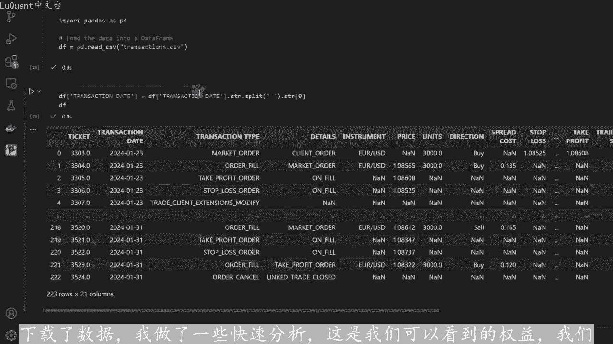

积极的趋势攀升。现在这些是这里以美元为单位。这样我们就可以看到它是如何从144美元的股票攀升到152美元，再跌到144美元。所以今天是美好的一天，它是158美元。如果我没记错的话。

我想我们一天就赚了10美元。😡，这是按交易计算的权益，所以这些是交易，这些不是天数，这是交易数量。这里是每天交易的汇总结。所以这再次以美元计，所以这天大约是7美元，是-6美元。

这是加二半或加3加一美元2美元。今天大约高。

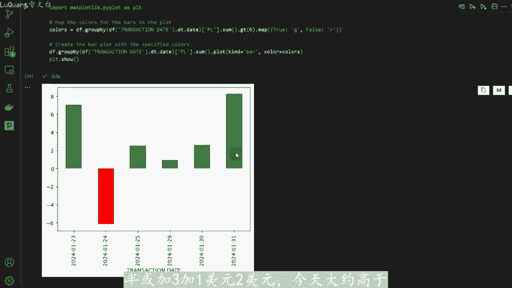

8美元，现在我打算让这个策略至少运行一整月，这样我们就可以收集足够的数据来进行更好的分析。我会在另一个视频中回复你，并向你展示这个策略的落地点。所以今天的全部内容，我希望你。😡。

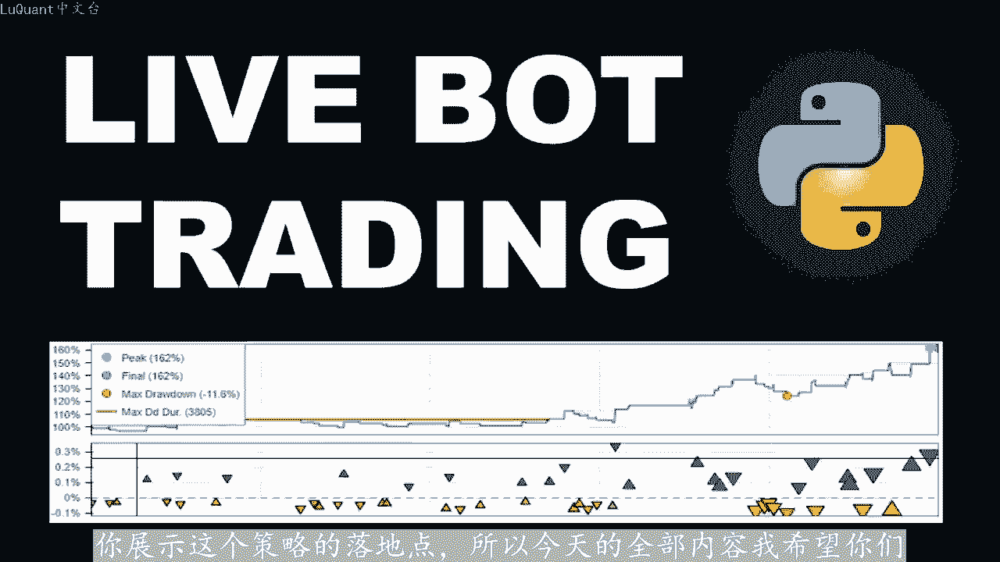

对这个感到满意。从我的角度来看，他看起来不错，我不知道你们是否喜欢这和我一样。但如果您决定冒险，并再次在不同的资产上尝试此代码，请分享您的发现。很高兴知道该策略在不同市场上的表现，直到我们下一次安全教。

😊。

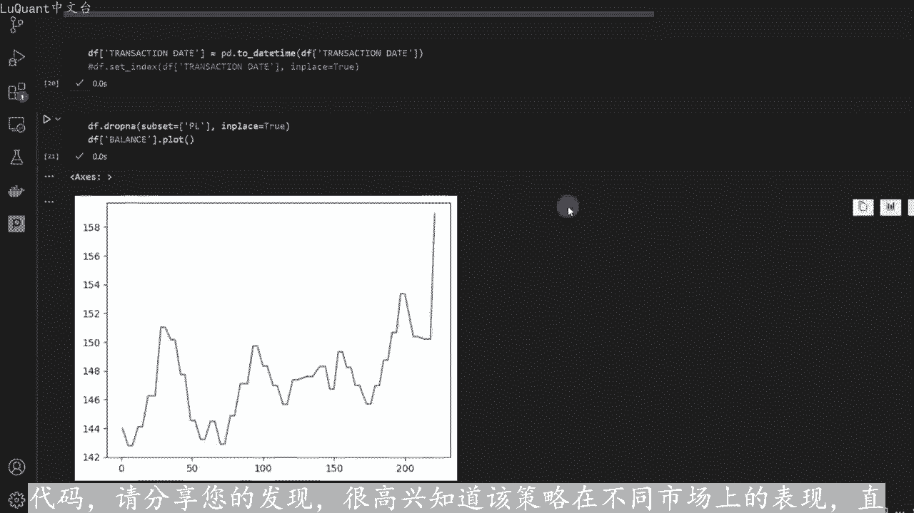

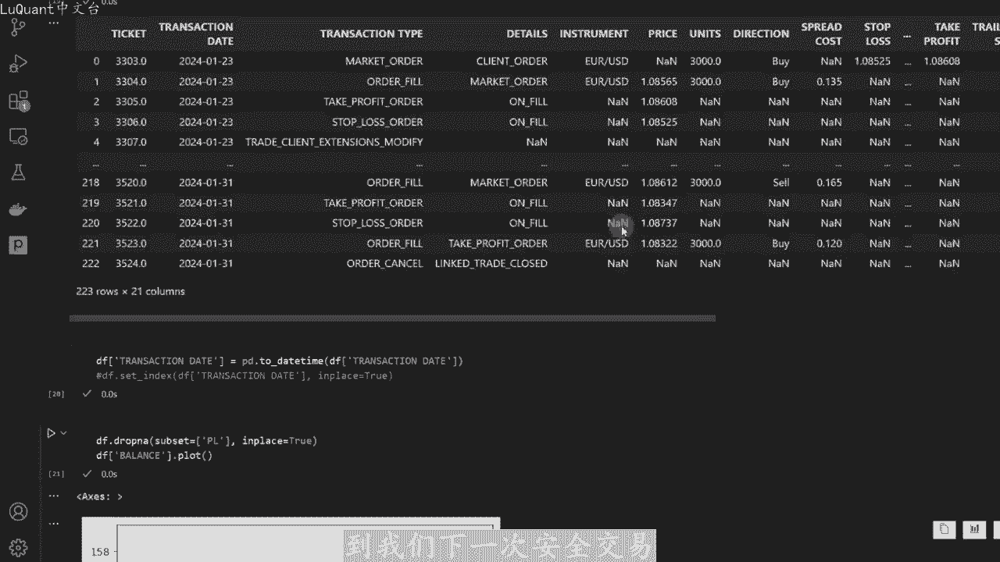

下次再见。