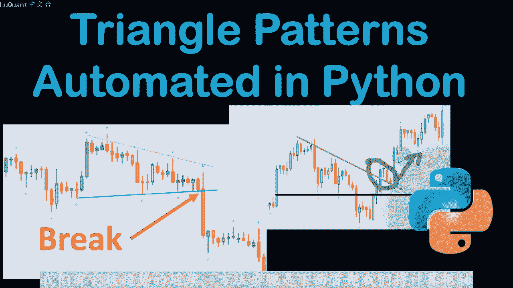
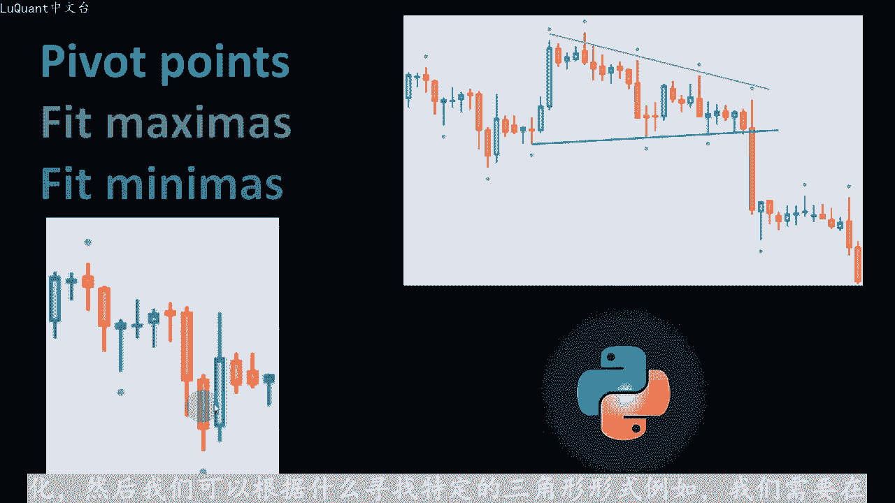
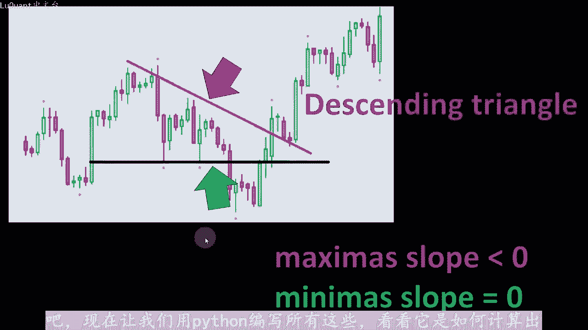
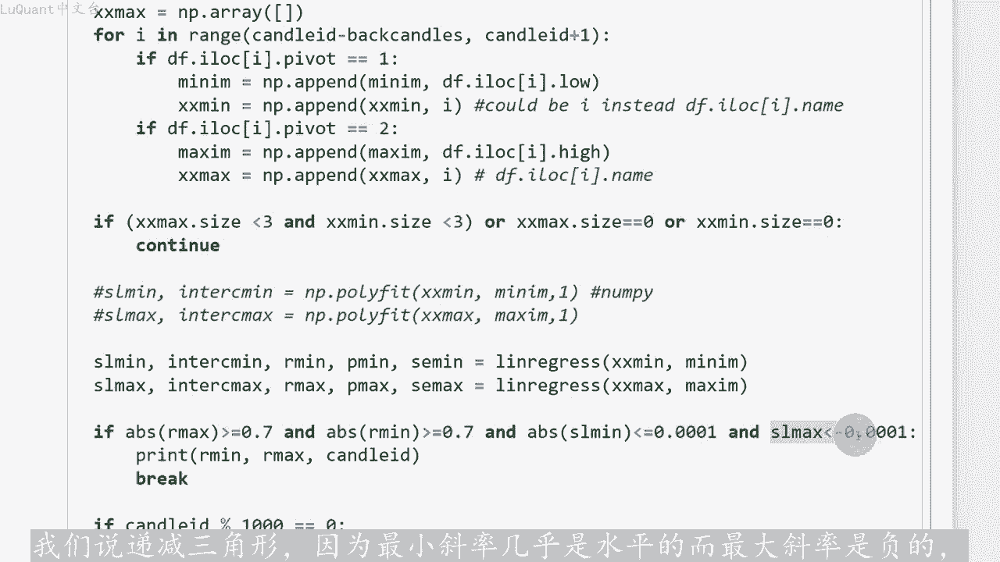
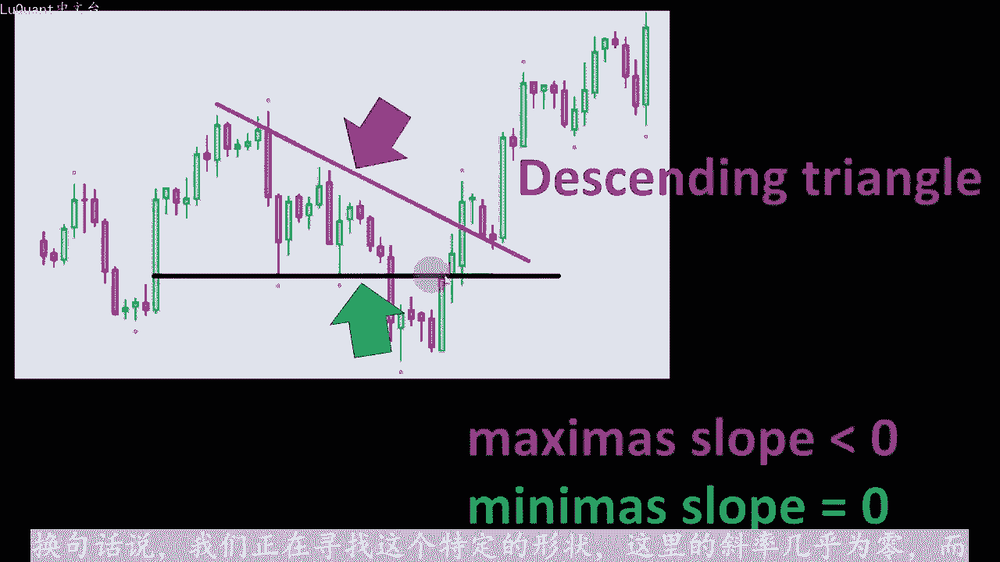
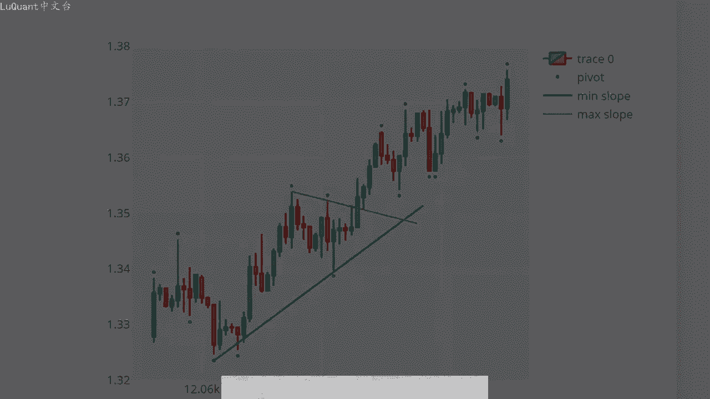

# python量化40：三角价格指标检测 - P1 - LuQuant - BV1gH4y1p7AK

嗨三角形形态检测可以使用特定算法自动化。因此在本视频中，我将介绍一种简单的方法来检测不同形状的价格变动三角形。然后我们将编写一个python代码，并在外汇数据上对其进行测试。最后我们可以会。😊。

发现的结果模式来可视化，我们的结果包含pyython代码的jupyter笔记本文件可以下载。如果您对编码部分感兴趣，您可以在该视频的描述中找到一个链接。显然，我们对这些三角形感兴趣的原因，主要是当他们。

我们的交易策略中需要，例如一些交易者可能会在三角形突破时进行交易。就像这两个事例所示，其中价格将遵循突破方向的未来趋势。在此事例中，价格突破了三角形边。跟随它的下降趋势。

我们可以看到它继续沿着与右力中的突破相同的方向继续，这里价格跟随上升趋势，突破了三角形边缘。我们可以看到我们有突破趋势的延续方法步骤是下面首先我们将计算书。

点，然后我们将在线性斜率中，拟和最大值和最小值输轴点是大于其邻居的价格值。例如，此处该特定蜡烛的最低价低于来自三个蜡烛的最低值。这个中央蜡烛之前和之后的三个蜡烛，我们当然可以采用不同数量的邻居。

例如我们可以考虑左侧的5个蜡烛和右侧的5个蜡烛。这作为一个变量，在我们的代码中进行实验相同的事情，最大值只是我比较高值，并且我们正在寻找一个中心蜡烛，其高度高于中心位置之前和之后所考虑的邻居。因此。

所有这些都可以在pyython中自动化。然后我们可以根据什么寻找特定的三角形形式，例如我们需要。

最大斜率维负时检测到这种形式，并且此时斜率逐渐减小，而最小斜率为正，这意味着斜率增加。在这种情况下，我们有一个收敛三角形。另一个例子是这种特殊形式，可以是检测到最大斜率为最小斜率非常接近于零或水平线。

我们可以将其称为下降三角形。好吧，现在让我们用pyython编写所有这些看看它是如何计算出来的，这就是我们的jupiter笔记本文件，我们首先导入我们的数据。我使。

欧元美元在2003年至2021年之间询问价格，我们有一个时间列，开盘价、收盘价、收盘价和每根蜡烛的交易量。然后像往常一样，我们正在清理成交量等于0，意味着扁。

蜡烛因为这些是银行假日和周末对我们的程序不感兴趣，那么我们可以定义一个名为书轴ID的函数，该函数将识别每根蜡烛。如果它是书轴点，则在这种情况下，它将返回一个它是一个低位书轴，意味着它的下限。

低于左侧和右侧的所有邻居，如果他返回二则同样的事情意味着他是一个高位书轴，意味着他有一个非常高的高点，并且他比他的邻居高，邻居编号是N1N2。

感兴趣的蜡烛左侧或之前的邻居及蜡烛LNR是我正在测试的中央蜡烛之后的蜡烛数量。此时，我们可以在数据帧上调用该函数，并使用3乘3的意思是，我在中央蜡烛的左侧取三根蜡烛。在右侧取三根蜡烛。

以检测它是书轴低点还是书轴高点，并且返回值将添加到名为的星列中。因此此时我们可以考。可视化我们的书轴蜡烛以确保一切正常工作。为此，我定义了一个名为点位置的新函数，因为我想绘制蜡烛，并在上面添加点。

如果他们是书轴高点或书轴低点，那么如。😡，数轴信号等于一，这意味着，如果我在这种情况下有一个书轴低点，我将添加一个新点，该点在图表上的坐标等于低点-10到-3。否则，如果它是书轴高点，意味着信号等于2。

我将把该点放。当前蜡烛的高点上方，这样我们就可以运行这个函数，并将其应用到我们的数据框并存储焦点的位置，放入我称之为点位置的心列中。然后我们可以使用plly包来绘制蜡烛图。所以这部。

我们将要绘制的数据框的一部分，无法一次绘制所有数据。因为这对于我们的图表来说会很麻烦。这部分将绘制蜡烛图。我们正在用蜡烛的开盘价、最低价和收盘价定义一个图形。我们将是。😡，添加下划线散点函数添加点。

使用X值和Y值的索引，我们使用点位置列，因此这就是我们在这里观察到的数据帧中我们选择的切片。可以放大分成更小的部分，以便更清楚的看到点的准确位置。我们可以看到这里有一个点高于所有其他蜡烛。

左边的三根蜡烛和右边的三根蜡烛，这个点就在这里是书。😊，第一位，因为它低于左侧的三根蜡烛和右侧的三根蜡烛，以此类推。因此，如果我们比较所有这些书轴点，它看起来效果很好。当然，如果您想更有选择性。

您可以例如增加您要比较的邻居的数量。不是在左侧取3个，在右侧取3个，我们可以将其增加到5个邻居，以此类推，以便过滤若输轴点。例如我们在右侧看到的那个好吧，现在我将向您展示一个示例。

在我们开始检测三角形之前，我正。😊，考虑索引为5358的蜡烛ID，并且我将回顾该特定蜡烛之前的20个蜡烛。哎，我将扫描所有这些蜡烛直到蜡烛ID只是为了看看该区域是否有三角星形。

所以首先我定义4个nP数组来存储数轴点的坐标，并且对于每个蜡烛I的范围在蜡烛ID减去这20个蜡烛中，每一个的后蜡烛直到蜡烛ID。亦已包含当前蜡烛。因此，如果我们有一个低输轴点。

我会将其坐标存储到最小值和某某最小值中。所以这些是两个专门用于同时存储最小值的nP数组。我正在检查这些后面的蜡烛中是否有一个高位数。这后面20个蜡烛，我将把它们存储到最大值和某某最大值数组中。

然后我我们将使用线性回归函数，将这些最小值和最大值拟合为两个不同的斜率，并且该函。将提供许多不同的参数。此时，我们只对斜率感兴趣，我们称之为最小值的斜率和最大值的斜率。现在我们可以使用绘图来绘制蜡烛图。

我选择数据框的同一切。我们添加数轴点3点，同时我们将添加最小值的斜率，以及我们刚刚使用线性回归函数计算的最大值，线性回归函数区。st包，因此您必须包含ci p sta中的内容。我们将首先导入令回归。

以便添加一行。在我们的图中，我们可以使用添加下划线跟踪函数，我们将提供最小值的X。最小值的Y，但是最小值的Y，现在我们将使用刚刚计算的拟合的最小值的斜率，使用线性回归函数。我们还将使。

线性回归函数提供的最小值的截距。换句话说，我们将最小值点和最大值点拟合到两个不同的斜率中，然后我们使用斜率方程，重新计算更多的点，并从中画一条。现将其放在我们的图表上。

我们可以看到这是一个美丽的三角形收敛三角形，在下降趋势之后出现突破。注意向上到目前为止，我们还没有包含任何我们应该具备的条件。例如上下。应该为负下斜率应该为正。

原因是我已经知道这个特定的蜡烛将向我显示一个三角形。在该区域中。我发现这一点的方法是使用此处的第二个单元格。因此该单元。将检测哪个特定的蜡烛显示出我正在寻找的三角形形式，它看起来与前一个单元格非常相似。

从某种意义上说，我们需要后面的蜡烛编号。因此，我们要在任何蜡烛之前查看20个蜡烛，以检查该区域中是否有三角形形。然后对于每个蜡烛索引的每个蜡烛ID，该索引的范围介于5000到长度之间数据帧。

您可以在这里选择不同的数字。我从数字3000索引开始，甚至为。我们将定义最大值和最小值坐标作为nP数组。然后对于I和蜡烛ID减去，将蜡烛返回到当前蜡烛ID我们将检查是否有书轴低位或书轴高位。我们。

坐标存储到相应的NP数组中，稍后我们将使用该数组来适应两个不同的斜率。但是这次我只想检测至少有三个最小。点或三个最大值点的区域。因此，如果某某最大NP数组大小小于3，则意味着我有少于三个最大值点。

同时我有少于三个最小值点，或者即使我有一个空。最大值点或没有最小值点。在这种情况下，我们将继续我们的for尔循环。这意味着我们将转到下一个蜡烛。因为我们没有足够的最小值和最大值来继续你合并执行操作。

我们打算这样做。如果满足这些条件，那么我们可。使用线性回归函数，将我们拥有的最小值和最大值拟合到两个线性斜率单元中，这部分是最重要的部分。因为这将定义三角形的形状。首先你会发现我使。

22因子的绝对值作为最大值，这在某种程度上是一个相关因子。当我们有完美的正相关时，它更接近于一。当我们有，如果它接近于零则完美负相。意味着这些点距离你和斜率太远。

并且我们对这个特定三角形使用的拟合不太好。所以换句话说，我希望这个绝对值尽可能接近一可能我输入0点。如果我输入0。8，你可以得到更多的选择性，我将检测到更多。比如说完美的形状。

但是我的数据框中的检测会少得多，对于最小拟和意味着同样的事情，最小数轴点的其他型。在我们的例子中，绝对main应大于或等于0。7。请记住max和remain有此处的函数线性回归提供。

因此该函数将提供斜率节距以及拟。度假设我们将其称为相关因子R最小值和R最大值。因此，如果我们看到这些点在某种程度上非常接近线性拟合，则意味着我们施加了非常高。这个二因子的绝对值。

如果我们想要从这个角度更加宽容，我们将允许与相距较远的点进行拟合。我们可以简单的减小这个特定值。那么我们还有一个附加条件，我们需要二因。的斜率最小值绝对值小于或等于0。001。

这意味着它几乎是水平的这也是此限制将影响您选择多少，它是真正水平的孩。允许一点正斜率或负斜率考虑到。所以这里我们正在寻找一个水平的，让我们说递减三角形。因为最小斜率几乎是水平的，而最大斜率是负。

换句话说，我们正在寻找这个特定的形状，这里的斜率几乎为0，而这个是负的。现在，如果我们找到所有这些条件，我们可以打印出R最小值而最大值和蜡烛I。

这是最重要的参数。我想识别我看到的特定形状的蜡烛。现在非常重要的是，我们可以注意到，一旦我们找到这样的蜡烛，程序就会中断。因此，蜡烛ID535。被检测到，并且形状如果我返回到图表。他就在这里5358。

我会放大算法，所以只有这检测到了一个三角形，让我们看。该蜡烛的未来发生了什么？这是55358处的全貌。我们检测到了某种三角形模式。如果我们继续进入未来，我们会看到该模式受到价格的尊重。然后我们。

某种方式实现了这一突破，这可能是我们交易系统的一个有前途的指标。现在让我们尝试更改这些参数，以使其更精确。我们希望有一个较低的斜率，在某种程度上更接近水平系。我将运行这个。所以从索引1万开始。

我们在索引15000处，算法仍然没有找到符合我们在这里实现的条件的任何内容。因此，在位置19225。😡，我们有一个递减的三角形，所以我将采用这个并尝试绘制出来看看。

这就是我们得到的这就是我们的程序正在检测到的。所以我们在这里有一个下降的模式。然后我们在这里有一定的支撑，在这个区域检测到一个小三角形。一旦价格突破在这个三角形中，我们可以看到我们遵循了上升趋势。

因此对于交易来说，检测有点晚了，它是在19225处，这是这根红色蜡烛。将稍微放大这部分，所以这是这根红色蜡烛，但是我们正在寻找三角形的突破。如果我们等待像这两个绿色蜡烛这样的确认蜡烛。

我们可以在这里采取任何多。😡，头寸，这将是一个很好的交易，将止损设置在此处检测到的支撑位处。我们可以尝试找到一个上升三角形。在这种情况下，我将更改这些参数，这样我就不会触及max和arm我们。这样写。

所以现在我们有一个正的最小斜率大于或等于10到4。您当然可以增加斜率，但请记住，您的选择性越强，您从数据中获得的信号就越少，并且绝对斜率最大值。水平的这意味着它应该尽可能接近于零。在这种情况下。

我们不要太有选择性。好吧，然后当我们运行这些条件时，现在我们得到一个蜡烛编号1624。如果我绘制这个特定的蜡。😡，它就是这里的这个蜡烛，我们可以看到我们有一个上升的三角形。

所以我们有这里的阻力位和朝着三角形形状增加的最小值。然后当我们跳跃时。突破三角形边缘阻力位时，价格回撤了一点，然后价格大幅上涨。所以这如果我们在这里的某个时刻同时拥有这两者，那也是一笔不错的交易。

我们可以尝试另一个收敛三角形的例子。所以。将在这里复制这一部分即最小值的斜率为正，同时最大值的斜率是负数，所以它将是-0。001。我要运行这个。但首先。要评论这部分，我们得到蜡烛ID100011。

我们将绘制这个特定的蜡烛，这是三角形。我们在这个阶段此时得到的收敛三角形应。对于这里的绿色蜡烛，我们已经有了信号，我们将等待该三角形的突破，并且一旦价格出现突破。这里，我们可以看到趋势下降。

所以这看起来也是一。很好的信号，我将再尝试一个例子，所以让我们从11000蜡烛开始，我们要测试它它是11113，我们返回这是另一个三角形。好吧，所以这些不是最好的三角形，这不。😡。

我们能得到的最好的三角形算法在数据的某些部分无法正常工作。原因是我们拿了20根蜡烛，所以我们重新测试20根蜡烛。如果我们形成了这个特定的形状，三角形这种情况发生是因为我。

试图将这三个最大值拟合到这个斜率中，现在消除这些信号的方法是对R更有选择性max绝对max条件。因此，如果我们将其增加到0。8升。0。9，我们将更具选择性，这将消除这种情况下的一些错误信号。因此。

现在使用相同的条件级，只需将相关因子更改为以上0。9。我们得到1200008。让我们尝试绘制这个，所以它是12000082，这就是我们所拥有的。我们在这里有一些几乎三角形的东西。

一旦我们突破三角形的边缘，趋势就会继续在突破的同一方。好吧，这就是这个视频的内容。我希望您喜欢这个算法，它相当简单，但同时他允许我们检测那些三角形。如果您有兴趣看到他们在交易策略中的使用。

我们可以进行回测。如果您有任何相。😡，想法请在评论中告诉我，我也有兴趣了解您的反馈，直道我们下一次视频交易安全，下次再。😡。

