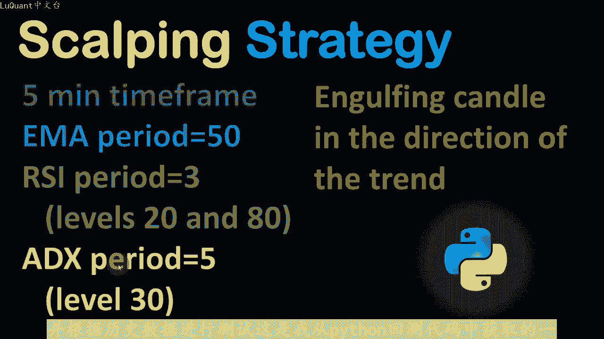
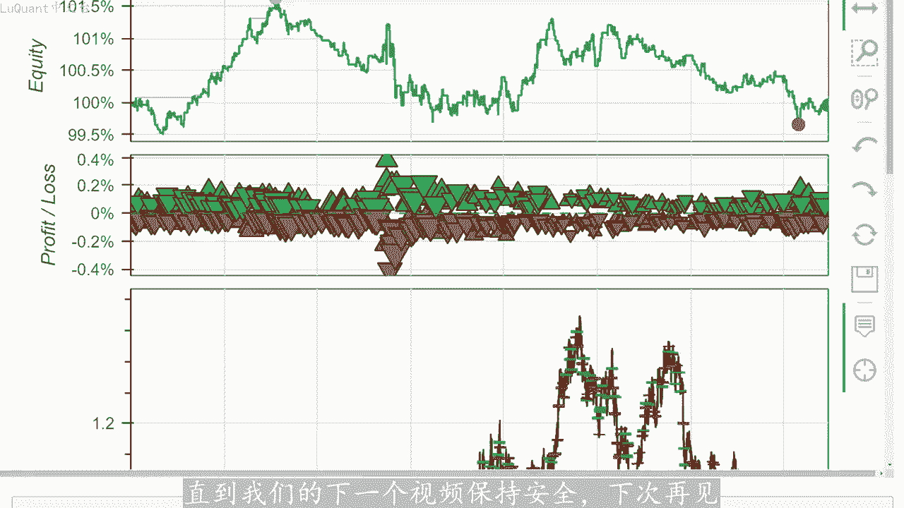

# python量化41：技术指标的综合应用 - P1 - LuQuant - BV1jZ421t71t

大家好，在这个视频中，我们正在测试另一种基于平均方向指数X和相对强弱指标RSI以及其他确认指标的雕刻策略。因为我看到这是在某处宣传的，作为一种盈利策略，用于包头。略低于子点的交易。

我们在此价格图表上看到的红色箭头是由我们将在本事例中的视频中描述的算法自动生成的，这些是卖出信号。我们可以注意到，这可能是一种有前途的方法，因为所有这些信号都遵循价格下降所。😡，理论上。

这些都是获胜交易。如果您对编码部分感兴趣，您可以从描述中的链接下载pyython代码，它是一个joptter笔记本文件。我们将根据三年的数据测试我们的自动化策略。当然，所有这一切的目的是找到一个好的雕。

策略我们可以在pyython中自动化，让代码运行去睡觉，同时变得富有，但它可能不像听起来那么简单。所以我们开始5分钟时间范围，我也会检查其他时间范围，但我将从真。该特定策略的建议开始。

我们需要50指数移动平均线来定义价格趋势。如果价格交易高于趋线，那么我们就处于上升趋势。我们只会在相反的情况下寻找买入头寸，即价格交易低于50日均线。我们处于下跌趋势。我。只会寻找卖出头寸。

那么我们需要周期为3的RSI触发水平为设置为20和80。因此，如果指标低于20则市场超卖，我们将触发买入信号。如果指标高于80，则市场超过两者，将处。卖出信号，该策略还使用平均方向指数。

如果指标超过30，则在5个周期内，我们认为趋势强劲。因此它是某种趋势确认指数，它适用于上升趋势。下降趋势。在这两种情况下，我们都在寻找高于30的水平。当所有这些满足条件后，我们得到了信号的第一部分。

为了获得额外的确认，我正在使用蜡烛形态，沿着趋势方向寻找吞没蜡烛。因此，如果趋势向上，我们将寻。😡，看涨吞没蜡烛，并在下降趋势，我们会寻找看跌趋势。所以当然要考虑很多因素。但幸运的是。

所有这些指标都可以在pyython中自动化，并根据历史数据进行测试。这是我从python回测代码中获取的一个事例。我们有一个明确。

下降趋势算法知道这一点，因为蜡烛收盘价低于5林猫区线，我们在曲线下方有一定数量的蜡烛，这不仅仅是一根蜡烛。在我们决定趋势是否出现之前，我们应该在代码中测试多少个蜡烛位置是上。

还是下降这备留下作为我们可以实验的变量。然后我们在这个例子中检查RSI值，这是一个下降趋势。我们正在寻找卖出信号，然后我们将检查RSI核实高于80，并确认趋势强度。我们还检查X是。高于30。

当满足这些条件时，我们将在此处寻找额外的确认。这是一个看长吞没蜡烛，紧随我们的信号蜡烛出现。因此，如果这是我们的信号被50妈触发的地方，RSSI和ADX我们。确认蜡烛关闭后，进入市场已进行止损。

我们将测试两种方法，要么是与ATR相关的止损距离，例如ATR的2倍或3倍。要么我们可以回顾最高点或前几根蜡烛的最低点。例如，这是一卖出交易。因此我们有一个看跌确认蜡烛。

我们可以在前几根蜡烛的高点中寻找最高点，例如两根或三根蜡烛，同时也考虑到确认蜡烛在这个例子中，我们以确认蜡烛的收盘价进入市。我们的止损值设置在最高点，这恰好是前一个丑闻的高点。

这是当我们的止损设置为信号蜡烛时的信号蜡烛止盈与止损相关。使用一个简单的比率，通常在1到2之间变化。尽管对于雕。策略来说，他相当接近一现在再次查看这些信号，印象非常积极。

因为他确实提前猜测了正确的入场点在哪里。因此，我们在这里有这些卖出信号，大多数情况。价格都会下跌。而我们在这里有这个买入信号，随后价格上涨，考虑到我完全随机的从数据点，这是一个相当积极的信号。

但只有一种方法可以找出答案，让我。😡，对该策略进行最终测试，并让python做出决定。因此，这是我们导入数据的地方，欧元美元烛台5分钟图表，它是2019年之间的要价和2022年。然后我们清理平面数。

即交易量为零的蜡烛，这些是周末和银行假日，所以这些对我们的交易策略不感兴趣。现在我们可以使用pada的下划线技术分析包添加M麦长度等于50。添加到我们的数据帧的RSSI长度等于3X长度等于5。

我还添加了我们稍后将使用的ATR。因此我们的数据帧中有4个附加列RSIADX和ATR，然后。需要测试我们的蜡烛是否交易在五菱帽曲线下方或五菱帽区线上方，以确定我们是否处于下降趋势或价格处于上升趋势。

为此，我们正在测试，假设8个回来，如果我们有8根连。蜡烛位于武林帽区线之上。那么在这种情况下，我们返回两个作为信号，这意味着我们处于上升趋势，反之亦然。因此，如果我们有8根蜡烛交易价格低于武林帽。

在这种情况下。返回一，这意味着我们处于下降趋势，这将被称为我们的em趋势信号。所有这些都作为一个新列添加到我们的数据框中，称为em信号。然后我们到达RSI和ed。因此，在这种情况下，对于每个烛台的每一。

我们将使用先前计算的信号及MI信号来查看它是下降趋势还是上升趋势。因此，如果MI信号是一个则意味着我们处于下降趋势，并且同时时间特定型或特定烛台的RSI高于8。同时，该特定烛台的X高于30。

那么我们有一个等于一的信号，这意味着我们处于下降趋势，这是我们的脉出信号，是我们的脉出信号的入场位置。反之亦然。因此如果我。使用MI信号处于上升趋势，且RSSI值低于20。同时，我们从ADX获得确认。

在这种情况下高于30，我们返回一个等于二的信号。这是我们买入头寸的切入点，并将。作为星列添加到我们的数据框中，称为RSEX信号。然后对于蜡烛确认，我们正在寻找吞没模式。因此，我必须在这里尝试一些东西。

我将它们留在评论中，以便您可以在这些线上进行实验。本质上我们正在寻。下降趋势，例如，在信号蜡烛处，该信号蜡烛是剪去一根蜡烛的形。同时当前蜡烛图是一个吞没蜡烛，所以它首先应该沿着趋势发展。所以我们的开盘。

大于收盘价，因为它是看跌蜡烛，同时当前蜡烛的收盘价低于最低价钱，一根蜡烛的收盘价和开盘价。因此这定义了看跌吞没蜡烛。反之亦然。因此，如果我们处于上升趋势，则意味着RSSEX信号等于该行减去一根蜡烛的2。

同时确认蜡烛当前蜡烛或型蜡烛是看长蜡烛，同时它是吞没蜡烛意味。收盘价大于前一个蜡烛的收盘价或开盘价的最大值。在这种情况下，我们返回蜡烛信号等于2，我将其称为总信号，并将其作为新列添加到我们的数据框。

在图表上，可视化信号非常重要，只是为了检查我们是否没有犯任何错误以及代码是否正确，正在按预期工作。为此，如果是卖出头寸信号，我将在蜡烛上方放置。😡，如果有买入信号，我将在蜡烛下方放置点。

这是在这两个单元格中完成的。第一个是定义参考烛台的点的位置，这里的第二个单元格用于绘制图表、蜡烛以及艾ma以及卖出。买入信号位置，我正在可视化缩影为3000到4000的蜡烛，这就是我们得到的。

我们现在有一个买入信号，我们这里有两个卖出信号，我们这里有一个买入信号，这里有一个买入信号，如果我。仔细看看事情是如何运作的。我们这里有一个买入头寸，这是事实有吞没模式。我们的交易价格高于50日均线。

同时可能因为我们下跌，我们的RSI值低于20。同时我们。ADX高于30，所以我们可以确保我们可以验证这一点，这是索引为3032的蜡烛。我们可以从数据框中打印出来，并用所有值检查这个特定的蜡烛。

所以我们确实有一。等于17的RSI记住这是吞噬或确认蜡烛，这是该特定蜡烛之前的信号蜡烛。因此我们有另一条低于20的边，我们有一个高于30的X，所以它是40。我们的交易高于移动平均线，我们有等于二的信号。

而接下来的蜡烛是吞噬蜡烛。所以这就是为什么我们在这里得到等于二的信号，这是一个确认信号。我们可以在这个特定点买入，这样您就可以看。😡，我们拥有的所有内容，现在编码是正确的。现在无论这是否是一个获胜策略。

他都必须首先进行回溯测试。我们可以在这里看看这个点，确实我们的价格上涨了，我们可以说止损将被设置在最低点。所。😡，最低点是前一个价格的低点，然后价格上涨。想象一下，我们的止盈率为2到3。

那么这是一笔获胜交易。再举一个例子，我们有一个卖出头寸，卖出信号。从数字上看，我们。交易价格低于50日均线，因此我们处于下降趋势，我们正在寻找卖出位置。无论是这根蜡烛还是前一根蜡烛。

RSI显然高于50日均线。同时我们有一个X大于30。如果我们采取这个投。很可能是一个亏损头寸，因为我认为我们不会以接近价格的价格进行雕刻，考虑到我们以该收盘价出售确认蜡烛。所以就在这里。

我认为这可能是一笔亏损交易。此。😡，我们拥有完美的设置，我们在50日均线上方进行交易。我们有一个很好的上升趋势。我们拥有RSI和ADX的所有信号以及正确的头寸。同时，我们有一根看涨吞没蜡烛。

如果我们考虑到这个位置，并。我们有最低的低点，那么这是我们的止损，我们可能非常接近我们的止损，或者我们可能很幸运。如果价差不足以触及我们的止损，我们可能会进行一笔非常小的盈利交易。但请记住。

这是一种倒卖策略。应。😡，风不会很大，现在我们已经验证了我们编写的代码是按预期正常工作，我们可以继续并检查需要计算的价格的止损。因此，我们在这里检查之前的蜡烛，我正在检查之前的两。😡。

蜡烛加上当前的蜡烛，就像我们是在买入，还是在卖出一样，在特定的蜡烛中会考虑该蜡烛的最高价和最低价。并且我们还会考虑前两根蜡烛的最高价和最低价，只是为了检。我要在哪里设置止损，这是一个变量。

您可以在这里放置三根蜡烛或4根蜡烛或您想要的任意数量的蜡烛，只是为了测试并确保安全起见。您将在其中设置止损。一旦设置了止损，我们可以将其做。😡，我们的附加值数据帧，这是一个名为sic node的列。

我在这里添加它，现在我们进行回溯测试，我们正在使用back testing pi包，它非常容易使用。所以到目前为止，我正在将它用于一些视频，我们将用当前股本的百分。进行交易，这就是我的头寸规模。

所以首先我们正在测试与ATR相关的止损，我采用1。3倍的ATR距离，这将是我们的头寸规模。止损距离和止盈止。比率也设置为1。3，我们以100个账户作为起始值进行测试，保证金为50分之1，杠杆为1比50。

让我们检查一下统计数据，-2。3%。经过三年的包头皮交易后防。我们的交易数量为1170笔，因此交易频率确实更接近包头皮风格，我们的胜率约为40。940，所以这不是很引人注目。因。我们得到的结果是。

如果我们绘制了净值，这就是我们得到的。所以一开始净值不断增加，没什么可说的。我的意思是，这些都是非常小的胜利，然后它就下降了。它一直在我们净值的98。5%或98%左右不。😡。

至少这不完全是这样失败的策略，但他也不是获胜的策略。如果你在此基础上添加佣金和交易成本，它不会给我们带来盈利的东西。好吧，让我们使用不同的策略来测试这个策。😡，即最高的高点或最低的低点对于止损。

这将给我们带来大约29%至3%的结果。三年交易次数为1214笔交易剩余。46%，所以这个比较好关于胜率。因此，如果我们看一下盈利图，我们的盈率仍然在下降，它与前一个非常相似。总而言之，使用这些描述的参。

该策略并不是真正有利可图的策略，让我们检查一下更高的时间范围，例如15分钟时间范围，看看它是否效果更好。所以在这里我加载了2019年和2022年欧元美元3年的15分钟数据。

所以这是同组数据只是我们使用15分钟时间，我将运行这个框架。结果如下，三年内的回报率为0。04，所以我们没有损失太多钱，这很好，但到目前为止，这不是一个获胜的策。交易数量为527笔，胜率是43检查净值。

我们有关于净值的上下波动，所以没有什么类似于盈利系统让我们检查止损的其他策略取之前丑闻的最高。和最低点，而不是ATR相关止损。在这里，我们的回报率为-0。17%。因此。

三年内的小额亏损交易数量为546笔，获胜率为50应。从这个角度来看，他的表现更好。因此考虑到更高的阴影和蜡烛的下影线，更适合设置我们的止损，这是我们的权益。因此，对于那些好奇病。

研究更多有关策略的人来说，它现在没有显示更好的系统。您可以下载我的joter笔记本，将放置两个文件，一个用于5分钟时间范围，一个用于15分钟时间范围。尽管我建议您在较高时间范围内进行算法交。例如。

根据经验，15会比5分钟时间范围更容易工作。因此您可能想要更改的第一件事是MI长度。例如我使用指数移动平均线的100MI长度，而不是在这15分钟内使用50MI长。

RSI的长度也可以从三更改为更强大的东西。例如四或5，您可能想对这些参数进行实验，对于X来说同样的事情，而不是使用515分钟。我使用等于7的长度。所以您可能想。更改这些参数，同时您也可以检查这些参数。

这意味着在决定是上升趋势还是下降趋势之前，您要考虑曲线上方或下方有多少个反向蜡烛，止损也是如此。因此您。考虑检查最高点和最低点有多少个反向蜡烛，这些蜡烛的最低阴影来设置您的止损值。在我看来。

最重要的是这部分，蜡烛发出信号，您将如何考虑这一点？您是否希望在某个时刻触发信？然后您会寻找确认，或者您只是放弃确认。也许看爹蜡烛在这种情况下并不重要，或者您可能希望有一个看涨蜡烛。

其信号同时落在看爹蜡烛内，而不是。该蜡烛之前，因此这将是一个确认加上同一根蜡烛上发生的信号，所以这很重要吗？在很多情况下。您可以想象，这是很多场景，您可以通过。查看图表和查看时。

修改此处的特定单元格来尝试所有这些这些信号，看起来可能很有希望。但是当你用3年或45年的数据进行稳健的测试时，你就可以看到，遵循这种策略的长期结果。无论如何，我希望这。信息发现本视频对您有帮助。

我也希望您喜欢编码部分的学习过程，直到我们的下一个视频保持安全，下次再。

