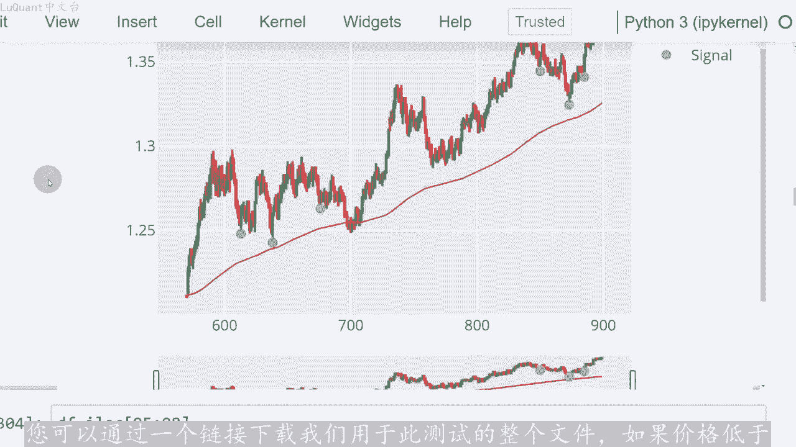
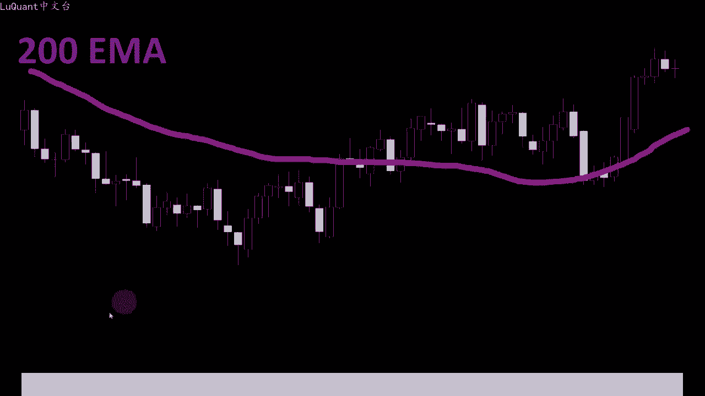
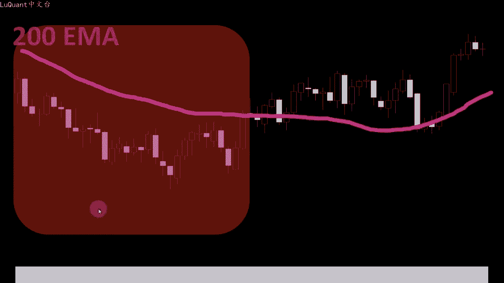
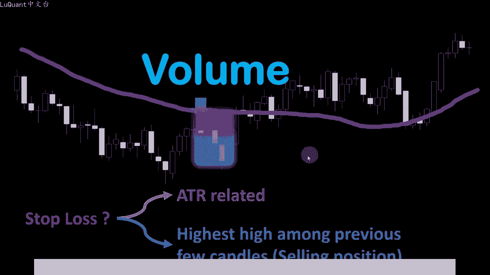
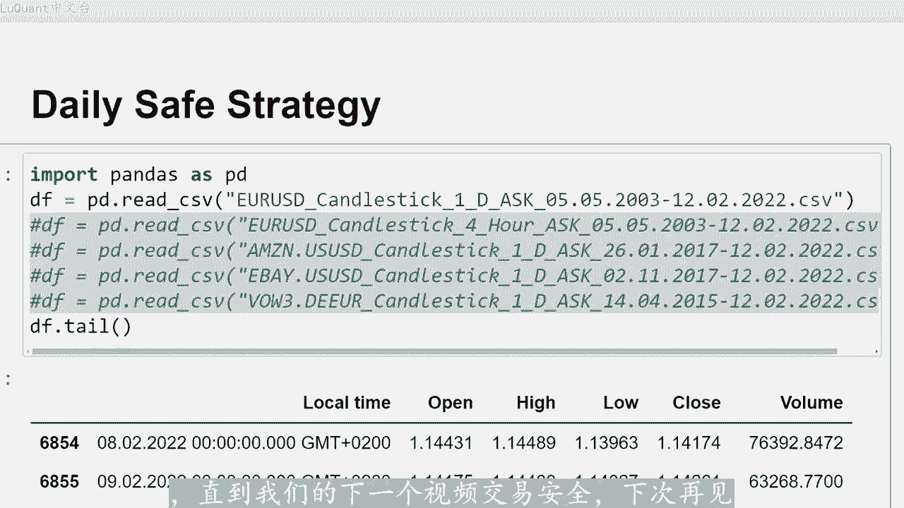

# python量化42：量在价先 - P1 - LuQuant - BV1Az421f7SU

大家好，欢迎今天回来。我们正在测试成交量交易策略，它适用于每日时间范围，并且被称为安全策略。因此，理论上风险很小，我简单的将其称为成交量交易策略。因为它使用以下交易量其他技术指标。因此我们。😊。

编写一段代码，通过覆盖长达18年的数据，自动测试该策略，这将真正让我们了解该策略的执行情况。对于那些对编码感兴趣的人来说，这与往常一样。

您可以在该视频的描述中找到juperernbookpyython文。您可以通过一个链接下载我们用于此测试的整个文件。如果价格低于价格移动，我们将使用200指数移动平均线作为第一个指标这条曲线。

我们将认为我们有一个下降趋势，反之易然。所以如果蜡烛高于200M。

这种情况下，我们有一个上升趋势。第一个规则是当我们有下降趋势时，我们只寻找单元格位置。当我们有一个上升趋势，我们只寻找买入头寸。所以在这个例子中，在左侧我们只寻找单元格头寸，在图表的右侧我。😡。

只寻找买入头寸。第二条规则是我们正在寻找与趋势相反的4根蜡烛。例如，我们有4根连续的蜡烛，价格回撤更接近移动平均线，我们至少需要4根蜡烛，所以可能是5根或6。

甚至更多的蜡烛，但是我们至少需要4根蜡烛。无论如何，我们在这里考虑的蜡烛数量保留为参数或代码的用户。因此，在joptter笔记本中，我们可以随时修改它。但目前我们坚持使用最小值4根蜡烛。然后我们看下面。

蜡烛它应该与趋势方向相同，所以这里我们有一个下降趋势，这个特定的蜡烛是看跌蜡烛，我们将在此时检查交易量蜡烛已经收盘。因此，在交易日结束时，如果成交量大于前一只蜡烛的成交。在这种情况下。

我们有一个卖出信号，因为我们处于下降趋势，所以再次回顾一下这个例子。我们有一个下降趋势，在200MI下方交易时，我们发现连续4根蜡烛图与趋势相反，随后是一根看跌蜡烛图，其成交量大。前一根蜡烛图的成交量。

因此我们认为这是我们的卖出信号。在趋势相反的情况下，意味着如果我们处于上升趋势，我们将寻找至少4个连续的看跌蜡烛，然后是看涨蜡烛，其成交量大于前一根蜡烛的成交量。在这种情况下。😊，有一个买入头寸。

现在棘手的部分是我们如何设置我们在该视频中使用两种不同的方法来测试止损和止盈。我们将测试这两种方法并检查结果。我们可以使用与ATR相关的止损距离。

例如ATR2倍或AT2的3倍ATR来自我们的卖出或买入头寸，或者我们可以简单的考虑在下降趋势中，例如对于卖出头寸。前几根蜡烛中的最高点，我们应该回顾多少根蜡烛以设置值。

这被保留为我们的python程序中的变量，这样我们就可以对其进行测试。但我通常从相同数量的蜡烛开始，这意味着我用来检查我们的交易信号的4根蜡烛。当然，如果您正在寻找上升趋势和买入头寸。

我们就会去寻找前几根蜡烛的最低。现在让我们检查代码，看看它是如何运作的这是我们的jupiter笔记本文件。我们首先导入pandas，因为我们需要这个我们需要名为readunder box的函数。

加在我们的数。

从2003年到2022年的欧元美元每日要价，这是1个CSV文件。我还加载了不同的数据，欧元美元的小视图，一些股票、亚马逊、伊贝和大众股票只是为了稍后尝试这。策略股票市场也是如此。

由于我们使用的是每日数据，所以我们没有想要的那么多行，所以一开始只有6858行。但我们清。蜡烛或蜡烛所在的行时，它会进一步减少交易量等于0。因为这些是周末和银行假日，市场没有变动。

这些对我们的分析不感兴趣，我还将列标题更改为开盘高低收盘时间和交易量，具体取决您正在加载的文件CSV文件有时可能会有所不同，最好采用这种方式。这样我们的程序稍后将了解我们用于这些列的标题。

然后我们可以使用padas下划线技术分析模块做。AI我导入，它已使用M码函数或200长度计算我们的指数移动平均线。因此它是200M码和用于止损和止盈比率的ATR。我们稍后将使用这些作为。

列添加到我们的数据框中，我们有一个名为em的列和另一个名为ATR的列。那么此时我们需要计算emma信号，请记住，如果蜡烛在ma区线上方交易，我们就处于上升趋势。如果我们在am区线下方交易。

则意味着我们处于上升区。处于下降趋势。在这里，我们已经在这个单元格中写下了所有这些。所以我们对每一行的每根蜡烛进行测试。如果我们正在查看的这个特定蜡烛及其之前的邻居，假设四个后面的蜡烛。均线上方交易。

那么我如果一根特定的蜡烛高于或低于DMA，我不会关注该特定的蜡烛，而且还需要查看其邻居，例如至少45根甚至20根目前交易价格。高于或低于DMA的蜡烛才能做出决定。如果我们处于上升趋势或下降趋势。

并且将其作为参数保留，那么这里它是一个变量，我仅使用四来增加小时信号的数量。但如果您想变得更安全，或者如果您使用此策略来获得较低的价格使。范围例如每小时时间范围，例如您可能希望将其增加到10左右。

这意味着，如果您使用每小时图表或每小时时间范围，如果您输入十例如，这意味着您有1根蜡烛，十0根蜡烛在您考虑趋势之前，您的交易价格高于或低。😡，200M吗，换句话说。

您的价格在DMA上方交易10小时或者在MI下方交易10小时，然后再考虑您的趋势。在这里我们使用的是日线，因此，当您说四根反向蜡烛时，这意味。价格已经连续4天在DMA上方交易或在MI下方交易4天。

在这种情况下，我们将为上升趋势分配两根蜡烛，为下降趋势分配三根蜡烛。如果你有两者都是，但在这种情况下，我们有一个错误，但它不会发生。所以我只。打印这个只是为了验证我的代码是否正常工作，没有任何错误。

并且该信号存储在我们的数据帧中的一个新列中称为MI信号。因此，如果是2，那么我们有一个买入信号，我们处于上升趋势。如果是一，我们处于下降趋势，我们正。😡，寻找卖出信号，那么我们有成交量信号，请记住。

要识别我们要去的蜡烛买入或卖出，意味着我们有买入或卖出信号。我们需要该特定蜡烛的交易量高于或大于前一只蜡烛的交易量。在这种情况下，我正。检查一根蜡烛与当前蜡烛进行比较。

所以我我将当前行中的当前蜡烛与前一个蜡烛进行比较。这意味着我仅使用了等于一的V厚蜡烛，意味着蜡烛的交易量等于一。所以在这里我将当前。蜡烛的交易量与前一个蜡烛的交易量进行比较。

我们可以将它与之前的两个蜡烛或之前的三个蜡烛进行比较。这是故意留在这样的变量中。因为如果您将在每小时时间范围或4个小时时间范围内使用它，您可能需要增加。就像您需要当前的一样。

当前蜡烛的交易量大于前两个蜡烛的前两个交易量。在这种情况下，您可以在这里再次输入第二个数字。就像我们在前一个单元格中对MI信号所做的那样，我们将存储此交易。

信号在我们的数据框中的新列中在本例中称为微信号。请记住，这只是一个测试，用于检查当前蜡烛的交易量是否大于前一个蜡烛。在这种情况下，我们将返回一，否则我们将返回零作为信号，然后我们有了价。信号。

所以我们正在寻找四种不同的蜡烛，它们的趋势与趋势相反，这是在这个特定的单元格中完成的。所以我也将这个屁厚蜡烛作为变量供我们更改。如果如果您想。更紧密或更严格的信号，您可以检查此选项。

您可以将其增加到5个或6个。因此，在这种情况下，程序将寻找与趋势相反方向的6个连续蜡烛。这就是为什么这里有这个信号，我们有2个A。语句第一个是，如果我们有下降趋势，我们正在寻找向上的蜡烛。

意味着看涨蜡烛。如果我们有上升趋势，我们正在寻找看跌蜡烛四种不同的看跌蜡烛与当前趋势的方向相。同时，我们希望此处测试的当前蜡烛与趋势方向相同。因此，我们之前的蜡烛与趋势方向相反。而当前蜡烛则沿着趋势。

在这种情况下，我们。为此，信号返回三个不同的值价格信号，如果我们有下降趋势，则为一。如果我们有上升趋势，则为2。如果没有或没有此特定信号，则为零，并且将添加该信号到DF价格信号列下的数据框。现。

我们可以清除数据框中的非数值，重置我们的索引，并继续处理我们的总信号。这将是我们的买入或卖出信号混合，或考虑到之前的三个信号。我们刚刚描述过，对于每根蜡烛，我们都。测试MI信号。

如果它是一个意味着我们有卖出信号，则价格或蜡烛同时交易在MI200区线下方。如果交易量信号等于一英此，我们当前的蜡烛交易量大于之前的蜡烛交易。同时，价格信号等于一，它显示了4根与当前趋势相反的看涨蜡烛。

并且当前蜡烛沿着趋势移动，这意味着它是一个在这种情况下看跌蜡烛，我们的总信号是卖出性。反之亦然。所以当我们这里有所有相反的值时，我们有一个上升趋势，我们的交易量也等于一，价格信号也等于一。在这种情况下。

我们有一个等于二的总信号，这意味着一个购买信号，该总信号也将。😊，添加到我们的数据帧中，一个名为手提包信号的侵略下，就像这样，然后我们清理并重置数据帧的索引。此时我们可以开始在图表上可视化我们的信号。

只是为了检查我们的代码是否正常工作。所以我将定义。😊，名为点位置的新函数，我们之前在之前的视频中使用过这个函数，它只是在我们要绘制的图表。如果我们有卖出信号，则这些点将添加到当前蜡烛上方。如。

我们有买入信号，则将添加到当前蜡烛下方，否则我们没有头寸，没有特定的定位或信号点。并且我将使用绘图谎言模块，我们将选择数据框的一部分因。绘制整个数据框太麻烦，我们将添加我们在图表上使用的emma。

我们将添加信号点位置，我们将这些点命名为信号，这就是这里显示的内容。这。我们数据框的一部分，因此我们有一个明显的上升趋势，蜡烛交易高于200日均线曲线。这些是我们的算法生成的信号点。

此时我们可以验证事情是。正常工作我将放大其中一个信号。因此我们处于上升趋势，我们正在寻找看长蜡烛绿色，一根蜡烛前面有4根不同的蜡烛，同时与趋势相反的方。我无法在此处绘制成交量，这太麻烦了。

但我们有更高的成交量。我们可以通过打印这个特定的内容来验证这一点蜡烛。所以它是蜡烛编号676。如果我们打印这个DF数据数据框，我锁定索引锁定674。677，所以我要打印蜡烛676的体积为1。

661026，所以它比这个在于我们想要的相反，但我还为这个成交量信号添加。一些东西来增加信号的数量。因为我在第一次试验时有两个小信号，我还补充说，如果前一个蜡烛的成交量大于其前一行。

减去两个蜡烛的成交量。那么在这种情况下，我还将反。一个等于一的适当交易量信号，这就是这里发生的情况。事实上，该特定蜡烛的交易量并不比前一个蜡烛更大，但其前一个蜡烛675确实有一个成交量大。

674指数行或蜡烛。因此，在这种情况下，我们有一个有效的成交量，一个有效的成交量信号，这就是这里发生的情况。所以我们可以查看其他信号，这里有850，这里也是同样的情况。我。没有比前一根蜡烛更大的成交量。

所以我们有850是5007333。这里我们有50761些东西，但这一根是849钱，一根蜡烛的成交量比之前。848根蜡烛更大。所以这就是为什么我们触发了850蜡烛的成交量信号。

我只需要在这里执行此技巧来增强成交量信号。因为首先如果我不对成交量信号执行此操作，我会在此处添加此部分。因此如果。😡，不想要它，您可以停止它，但我们将收到很少的信号。无论如何。

在这一点上还不足以构建交易系统。我可以说，代码至少按预期正常工作，我们可以开始设置止损值以。😊，止损我将其添加到我们的数据框中。因为这次我需要使用与之前视频不同的东西。在之前的视频中。

我们总是使用与ATR相关的止损或固定距离止损，甚至在这种情况下使用追踪止损小。一些事情不同的，我将检查4个蜡烛。假设当前蜡烛之前有不同的蜡烛，如果我触发买入或卖出信号，假设这是上升趋势中的买入信号。

例如，我将在这里检。四个或之前四个蜡烛中的最低低点。在这种情况下，如果我们在卖出交易中处于卖出位置，这将是我们的止损。在这种情况下，止损将是之前四个相。蜡烛中的最高高点。

我还包括当前蜡烛的最低价和最高价。因此，如果我们查看此处的图表，例如这个特定信号是买入信号，所以我将查看该蜡烛中的最低值之前的4根蜡烛这。是我们的止损，所以我的止损将就在这个特定交易的此处。

如果我们将此作为买入头寸，作为买入信号，那么这恰好是一个伟大且出色的交易头寸。如果我们在蜡烛收盘后，将止损设置在此。😡，如果我们举另一个例子，例如，当该蜡烛收盘时。

如果我们在该看涨蜡烛的顶部或收盘价直行买入头寸，在这种情况下，止损将是处于丑闻的最低点，所以它将就在这。然后我们可以看到价格在没有触及止损的情况下上涨。所以这里我们还有另一个有趣的交易。

现在我们可以开始回测我们正在采取的策略。首先我使用二0手大小。止损ATR相关止损和止盈值止损将是ATR距离的4倍，止盈止损比率设置为1。5。然后我运行这个我们将获得194%作为回报。记住。

在这里使用了利润率，我使用50分之1作为利润率，我们的胜率约为60，所以我们这里有61%，所以它并不像不好，但交易数量是13笔。所以请记住，我们正在运。😡，大约18年数据的数据框架。

而我们只有13笔交易，让我们看一下权益，所以我们没有不断增加权益，有时价格会下跌向上。但是如果你看一下交易这些交易。在绿色中获胜的交易形状的大小反映了获胜的数量或损失的数量。所以这是一个很大的损失。

在这里它是一个很大的损失，尺寸，322，这个是230所以是的。从这个角度来看。不是一个糟糕的策略，但是我们可以看到，这不是市场上频繁活跃的信号，所以我们必须等待很长时间才能触发仓位。现在我也尝试过。

另一种方法是使用蜡烛的最低低点。😊，最高高点作为止盈或止损值，因此我们将对此进行测试，我们得到90的回报，我们的获胜率约为56%。请记住，利润止损比约为1。5。权益看起来像这样，所以我们增加到180%。

所以总共为80%，它看起来更好。因为如果我们将其与之前。权益描述进行比较，它总是在增加这里的交易数量，我们有13笔交易，而在下一笔交易中大约有23笔交易。所以在这种情况下，我们还有10笔交易。

现在情况并没有那么糟糕。因。即使你的交易很少，并且你有一个很好的系统，你也可以运行它现在针对不同的货币和不同的不相关股票。虽然我不喜欢倒卖，也不喜欢快速交易，但我通常会选择日。😡，图。

每日时间框架或4小时时间框架，这有点像对我来说太慢了。我的意思是，如果我们在18年里每年进行大约20或10笔交易，那并不算多，就像我们每年平均进行一笔交易一样。😡，真的太少了。还有一件事。

即使我们对此进行了回测。我不太相信，因为为了正确回策策略。您需要在50到100笔交易上进行测试。如果我们。十或15甚至2023笔交易上进行测试，则不足以确认该策略的盈利能力。现在这样一个系统。

我测试这个的原因是我看到这个策略被宣传为最安全的策略之一。我真的很。知道他会提供什么结果，因为我真的是保守且非常安全的系统的粉丝，我不喜欢在市场上赌博，我真的喜欢他经过严格的测试。

并且非常肯定以某种方式最小化风险。如果您打算在。😡，小时图表或1小时图表上运行它，您可以尝试一下，但同时你需要记住，你必须调整所有参数。从MI长度开始，你要考虑到后蜡烛线成交量信号、后蜡烛。等等。

所以你必须经历所有这些并检查如何设置止损和止盈比率。因为这些比率可能会根据时间范围而变化。我也在股票市场上尝试过这一点，但同样的问题需。调整一些参数，应该进行微调，以适应每个这些市场。

我只是在这里为你保留了这些评论。只是如果你想测试，并且你很好奇，在不同的时间范围或不同的市场上测试这个这就是。在这个视频中要告诉你的全部内容，我希望你们是发现这些视频很有帮助。如果有的话，请点赞订阅。

如果你有任何想法，请发表评论，直到我们的下一个视频交易安全，下次再。😡。

