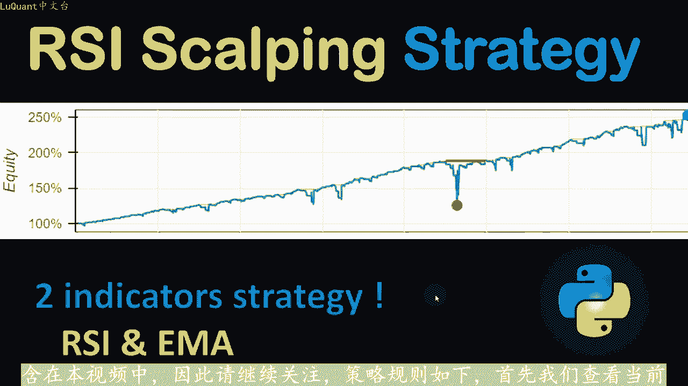
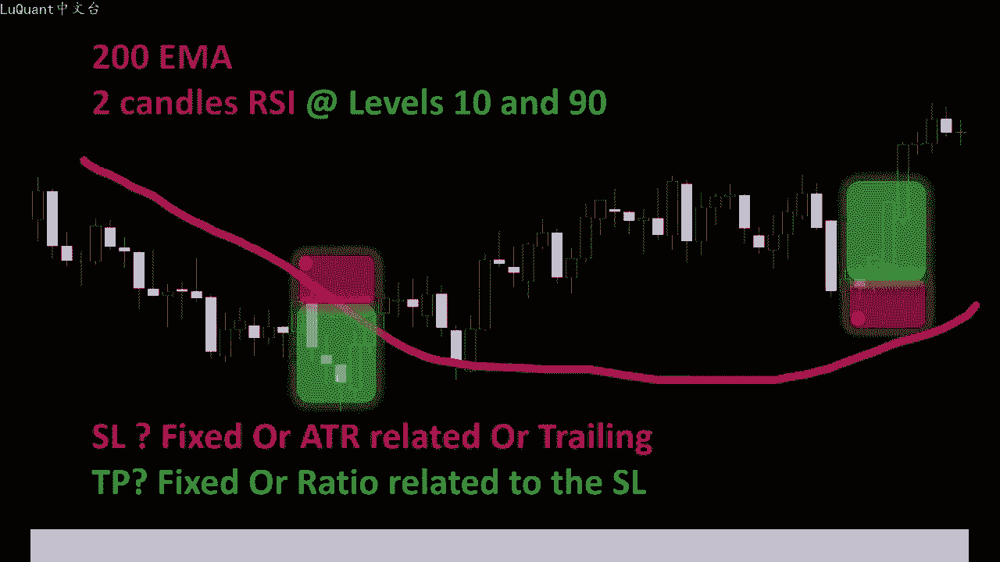
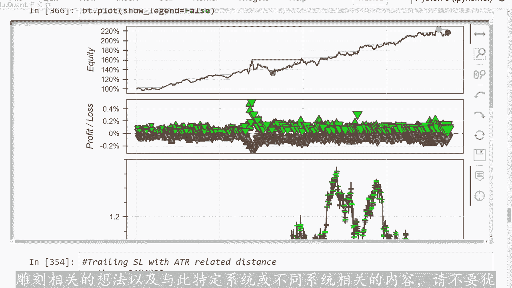
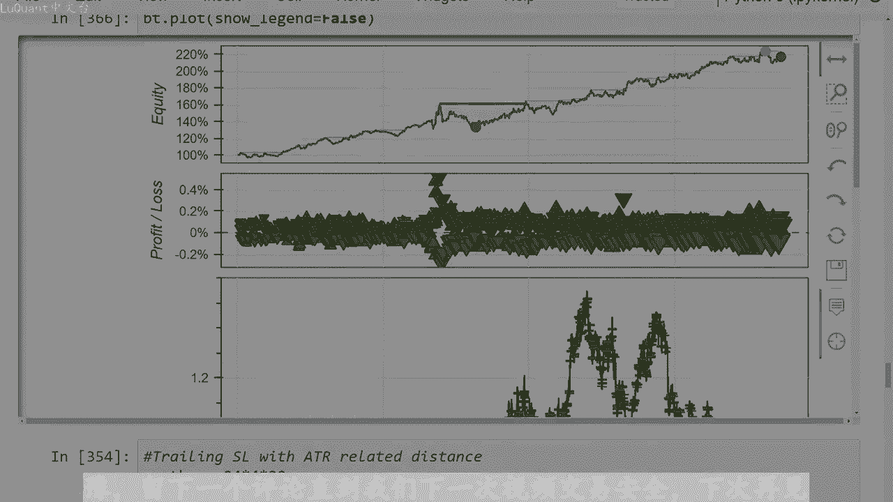

# python量化43：自动化RSI 策略 - P1 - LuQuant - BV1Yt421G7RL

大家好，今天我们将测试基于RSI的包头皮策略。正如您所看到的三年数据的回溯测试显示，经过三年的交易，盈利结果达到了股本增长的250%。这大约是该策略每年使用的50%只。

移动平均线和RSI两个指标以及回溯测试是使用我们的pyython代码进行的。代码可以从视频描述中的链接下载，您会发现三个不同的版本，其中一个与一分钟蜡烛时间框架相。第二个文件适用于15分钟蜡烛图。

第三个文件适用于1小时蜡烛图时间范围，我已在这些不同的时间范围内测试了此策略。所有内容均包含在本视频中，因此请继续关注策略规则如下。首先我们查看当前。

如果价格低于或高于200M码，则我们认为我们处于上升趋势，如该图右侧所示。如果价格低于200M码，则我们认为我们处于下降趋势。因此，如果我们处于下降趋。上升趋势我们只会寻找买入头寸，反之亦然。

如果价格交易低于200M码，那么我们有下降趋势，我们只会寻找卖出头寸。然后我们可以检查两根蜡烛RSI我知道它非常短，但是这就。策略的构建方式，我们现在开始，我应该在这里提到。

这是在一分钟时间范围内描述的策略，但这将为我们的程序生成大量数据。因为我想测试几年内的策略，我。首先开始使用15分钟时间范围进行测试，因此我们可能会更改RSSI长度以优化结果。

因此我们可能会使用三根或4根蜡烛，而不是两根蜡烛。RSSI蜡烛RSSI如果我们要更改时间范围，但无论如何，对于一分钟时间范围，我们将首先使用两。蜡烛RSI并测试RSSI低于10和高于90的水平。因此。

如果我们处于上升趋势，并且我们正在寻找对于根据价格水平和艾码比较的买入头寸，我们将等待低于10的RSI。当当前蜡烛以这种方式收盘时，我们可以执行该头寸。对于卖出交易，我们将等待高于90的RSI值。因此。

我们将有我们的卖出头寸的切入点。例如，此时我们的交易价格低。200M码，并且在这根蜡烛上，我们的RSI达到了90以上的水平。所以我们将这里的这一点只是为了标记我们的入场位置，因此。

该蜡烛将成为我们的入场位置，它也可能是丑。因为此时RSI也超过了90水平，因此，由于该蜡烛的收盘价高于该蜡烛，因此该蜡烛的收盘价高于该蜡烛的收盘价。未来的蜡烛对于我们的交易来说可能是一个更好的入场位置。

然后在该图的右侧，我们。一个上升趋势，因为价格交易在200M上方，此时在这个特定的蜡烛上，我们的RSI水平低于10日。因此我们有了买入交易的入场位置。现在我们到达了棘手的部分，我们必须决定如何设置止损。

止盈值以便我们可以使用固定距离止损或与ATR相关的止损距离，甚至是追踪止损值，也可以是固定距离或与ATR相关。止盈。与我们的仓位保持固定距离，或者与具有一定止盈止损比率的止损距离相关。

以便您可以看到有很多管理方法可以尝试，但我们可以用pyython编写所有这些运行我们的测试1到3年，看看我们的交易账户如何。受到影响，我将在这个视频中做另一件事。我相信这非常重要。

为了检查这个模型的稳健性，我将调整模型。比如说三年的数据，但为了确认盈利结果，我将在我保留在网站上的新数据上对其进行测。😡，以避免任何偏差。好吧，让我们深入研究一下编码，并分析我们的结果。

这是我们的jupiter笔记本文件。我们首先加载数据，我将从2019年到2022年之间的数据开始。所以这大约。

15分钟时间范围内，三年的数据竞价以及欧元对美元的数据。我们的数据看起来像这样，我们有一个数据框架，其中包含当地时间开盘价、收盘价和收盘价。指数以及每根蜡烛的每行交易量。

然后我们可以从相等的交易量中清理数据为0，这意味着这些是周末或银行假日，这些对我们的研究不感兴趣。因为我们在这些特定时刻没有市场变。我们将重置指数并打印数据的尾部框架，只是为了确保我们有足够的数据。

这让我们知道数据框架末尾有多少条道路，我们将导入pandas技术分析模块。因为我们将记。指数移动平均线200使用它M函数计算蜡烛的收盘价长度等于100，然后使用RSI函数计算每根蜡烛的收盘价长度等。

3、因为正如我所说，之前我们使用15分钟时间范围，而不是一分钟，我必须稍微调整一下，以考虑到这一变化。然后我们将使用ATR平均真实范围来计算我。在某些情况下的止损距离情况。

取决于我们要遵循的交易管理策略。所以现在我们的数据框包含更多列，我们在之前的列之上有指数、移动平均线RSI和ATR，我们可以开。计算指数移动平均线信号，所以这是趋势检测。请记住。

如果价格交易高于M码及200M，我们认为我们处于上升趋势。如果价格意味着蜡烛低于200M均线，我们就处于下降趋势，这就。我们的方式现在要检测这个特定策略的趋势。当我们说价格高于或低于200M时。

我们谈论的是哪个价格？我们谈论的是多少根蜡烛，我要等待一根蜡烛串。200艾吗？立即可以认为价格处于上升趋势，或者我应该等待确认。比如说八货1根蜡烛在200均线上方交易，然后我可以说好吧，你确认我。

有上升趋势，或者我们有下降趋势，甚至更多。也许您可以等待20或25根蜡烛，并将其保存在一个参数中。这是一个变量。此处称为回蜡烛。目前我使用8根蜡烛，因此，8根蜡烛每根15分。

这意味着价格已经穿过移动平均线或正在在200MI下方或上方交易至少2个小时。当然您可以稍后更改并对其进行实验。我故意将其保留为变量。这不。代码将检查我们在上方或上方有多少个连续蜡烛。

在这种情况下低于200日均线，我们将选择三个值之一。如果信号等于一，则意味着我们处于下降趋势。如果信。等于2则意味着我们处于上升趋势，意味着蜡烛交易高于200M2。如果它等于3，那就有些棘手了。

这意味着我们遇到了错误，因为您不能同时在200毫米移动线上方和下方进行交。特别是如果您在这里考虑的有8根反向蜡烛以及所有这些信号，现在添加到我们的数据框中名为MI信号的列中。记住，这只是趋势检测信号。

不是我们的最终信号，所以我们仍然需要考。RSI这是下一步，我称之为总信号。所以再在这一阶段，如果M信号等于一则表示我们有下降趋势，同时RSI高于或等。90这意味着我们有一个迈出头寸的切入点。

因此我们的总信号值将等于一，我将把它存储在名为总信号的列表中。该列表是我刚刚在单元格开头定义。那么如果我有上升趋势，则意味着MA信号等于2。同时RSI等于2低于值时。在这种情况下。

我们有一个买入头寸的切入点，我的总信号将等于2。所以最。我将把总信号放入我的数据框中的一个新列中，我就这样调用了t信号。在这个阶段，我们可以对数据执行一次清理。因为有时记住数据真开头的RSI。

数据真开头的移动平均线无法具有准确的值，它可能不是数值。在这种情况下，我们可以从数据框中清除这些数值并重置我们的索引。现在我们可以开始交易测试。但在尝试策略的回溯测试之前。我通常喜欢在图表上可视化信号。

并检查我的指标如何，或者我的自定义指标表现良好。因此，我将在数据框中再添加一。称为点位置。如果总信号为一，作为脉出信号，我将在略高于高点的位置，放置一个点。当前蜡烛的高点在相反的方向上。

如果总信号是一个绑定位置，在这种情况下，我将。当前蜡烛的低点下方放置一个点，只是为了在图表上的图形上可视化内容，现在取决于关于我想要想象的蜡烛数量，它不能太混乱。因为它对我们来说不是很清楚，也可能太空。

因为它无法显示足够的案例，研究模型如何表现我的指标。首先我定义了一个新单位，成为月份，它是24乘以4乘以30，意思是30天乘以24小时乘以4，因为我们有4。烛台每个烛台为15分钟行成1小时。

所以这是一个月单位，然后七始索引只是我想要开始绘图的行。因此，如果我在这里放置60。000则意味着该图上的第一根蜡烛将是67K67000，具体取决于我的数据框。请记住，最后一个。

我们的数据真的元素是74000，所以我们应该小心不。超过我们的数据帧的限制，所以我现在要把它放回零例如，我们将从数据的开头开始真意味着索引为0。我将切片数据帧的DF图会。数据真的一部分。

该部分从开始ID开始，现在为0，并已开始ID加上相关内容的整数转换结束几个月，所以可以是0。4个月2个月3。30个月好吧，这是一种做事的方法，它不是你可以用不同的方法来使用这些函数的唯一方法。

但现在最重要的是，我要绘制蜡烛图，我将绘制200M吗。将在买入和卖出位置添加三点图，所以这就是信号。我们添加到数据框中的总信号，这就是我们的信号，这就是我们得到的这是我们的结果。我们有2。

艾玛我们有这些蜡烛在曲线上方交易，所以理论上我们处于上升趋势。同时这些点将只示我们有RSI的位置或蜡烛低于时的值，这些是我们的买。信号，因此我们可以放大并查看事物的表现。例如，这里的MI是下降趋势。

我们的价格或蜡烛低于200MI的曲线。同时，一旦RSI块。90至90关口，我们有不同的卖出信号在这里卖出头寸。所以您可能已经注意到这些是错误信号。因为如果我们在这里卖出，我们将穿越200M码。

稍后进入上升区。所以也许我们会在下跌之前触及我们的止损，并触及我们的止盈，具体取决于您如何管理您的交易。无论如何，对于上升趋势点，我们在这里有一个信号。但话又说回来，第二个信号是一个正确的信号。应。

我们有一个很大的上升趋势，价格大幅上涨，但没有真正下跌太多。所以我们不太可能触及该特定交易的止损值。所以这里的信号非常好。那么我们有这个信号，这也是一。很好的信号，因为我们有稍后价格上涨。

也是一个很好的信号。所以目前这个信号还不是很清楚，所以我们可以尝试放大，这是对这一特定交易的放大。我们在这里有一个信号。如果我们。在丑闻的结束部分，同时拥有这两种情况。

这意味着只有当止盈距离我们的仓位足够接近时，我们才有机会进行获胜交易。但如果我们的止盈止损比率为等。2、例如，最有可能的是，我们会在触及广泛的止盈值之前触及止损。因为任何策略可能有效，有时可能不起作用。

有时会产生良好的结果，有时可能不是处理这种情况的最佳方法。在很长一段时间内进行回测并检查最终结果。所以一开始我在一个月、3个月或6个月内回测该策略。但后来我注意到有时他会给出积极的结果。有。

会给出消极的结果，这是最好的方法。要了解该特定策略在几年内的结果或每年的平均结果，需要在整个数据集上对其进行测试。因此，数据况。清理后大约有74。75000根蜡烛，大约需要30个月左右。

所以我将从起始ID等于零开始，我们将在整个数。真为期30个月的整个数据集上测试我们的策略。我不会详细介绍我们一直在使用的这个函数，在我之前的视频中一遍又一遍的进行回溯测试的单元格相同。

所以我会跳出来告诉您头寸的初始大小将在20左右。因此这是高风险的，但如果您投入大约100美元现金。那么这是高风险的，我不想测试这个策略是否能够让。没有太大风险的情况下，快速致富。

所以100的保证金为1到50。我们每笔交易都交易20的权益。我没有激活我们在之前的视频中已经解释过马丁格尔方法。如果信号是两个，那么我们就有买入信号，并且我们没有任何未平仓交易。请记住。

我们一次只允许一笔未平仓交易。因此我们将执行买入在这里进行买入交易，止损据。固定为45点，只盈距离也固定为45点。所以这是我们的第一个测试。请记住，我们正在用不同的交易管理方法来测试这些。

这是第一个方法。我们对买入头寸和卖出头寸都使用固。距离止损和止盈，并对100个账户进行回溯测试。因此，我们的收入为52，收益利润为52%，最大回撤为62。百分号，这是需要考虑的事情。

如果您用20的净值进行交易，胜率是52，这并没有那么糟糕，也不是很引人注目。最重要的是，如果我们检查净值图，我们会在某。😡，时刻出现上升，我们在这里有一个峰值，那么我们有一个亏损的一年。

这可能几乎是我们数据的3分之1。假设我们最后6个月的交易，过去半年只不过是或多或少的亏损。😊，重要的是要知道，它可能不是来自信号，可能来自于我们管理交易的方式。所以请记住。

我们在3年期间采取了45点相同的距离来止损和获利。所。现在我们可以尝试不同的东西，我将尝试完全相同的方法，经过30个月的时间处理我们的20个股票头寸。但这次我将使用ATR和止盈止损比率作。盈距离因此。

止损和止盈现在与两个参数相关，其中一个是当前价格的ATR和止盈的第二个，它与止盈止损比率有关。开始将这两个参数设置为1。3，因此我们的止损距离位于AT2的1。3倍以内，只因为1。3乘以止损距离。

我将在整个数据帧上运行这三年的数据这。是我们的结果，我们有116%的回报，所以这个看起来更可取，我们有49的胜率，所以与之前的情况相比，实际上并没有太大的改善。最大回。是-17。

所以这比我们之前得到的-60%好得多。现在我们通过权益图表来看一下，这个确实比之前的好得多。前一个例子，所以在这种情况下使用ATR给出。过去三年中，持续获胜的策略，请记住。

我们使用的是2019年到2022年的数据。在这里我们达到了220%左右的最大值。我们可以通过增加一点来扩展这一点保证金或增加止盈。使用止盈止损比率和ATR相关止损距离的参数。所以我现在不打算讨论这个。

因为当你有3到4个时，这是一个真正的迷宫。如果你想修改每一个参数，这会让我们的是。太长，所以你是否有耐心，并且在三年内使用这一策略。有时你可能能够压缩到300%或400%。另一种方法是使用。

ATR距离相关的追踪止损。因此我将使用与我们已经描述过的完全相同的方法，例如20股股票头寸和100美元现金，比方说50美元以上作为保证金，因此，1到50的杠。账户我将定义止损追踪距离。

该距离等于当前价格ATR的1。5倍，我们将使用追踪止损。因此这是一个止损，只要价格朝着盈利的方向发展，就会跟随价。但是，当价格曲线回到亏损的方向时，这个特定的止损将不再移动，并且它将被处罚。

如果我们之前有过波动，我们会以一定的利润平仓在此之前。这部分代码并没有太大变化。当我们测试这一点时，我们在3年内得到了67个回报，虽然不多，每年大约20个，但也不错，我们不丢失。我们交易期间净值的斜率。

因此我们可以看到，不断攀升的净值是一种正向变化的净值。我们有很长一段时间会出现回撤。如果模型通常无法正常工作，您必须要有耐心在算法交易中，你不会一次运行一种测。你会运行至少4到5种不同策略的不同账户。

当其中一个失败或两个失败时，你会希望其他三个能够弥补这些损失，他们仍然获胜。所以通常如果你。正的净值用于交易的算法，你总是可以算出，无论发生什么，全局结果都将是积极的。因为你同时运行不同的算法。这。

通常在大公司中是如何完成的？这通常是专业算法交易者的完成方式。所以无论如何，它并不是那么糟糕的策略，但是它不像使用ATR止损并以。比利霍利那样引人注目，正如我们之前看到的那样。

现在我是好奇我们是否会在三年不同的年份测试完全相同的参数，相同的策略一切都相同。这关系到我们模型的稳健性，让我们回。😡，开头将一组不同的数据加载到我们的数据框中。2019至2022。

现在我要评论这一行并取消注释这一行，其中加载的数据是在2016年和2019年之。这又是同一段时间，就像三年的数据，只是从2016年开始，我们我将运行这个我将运行所有单元格，就像他们运行前一组数据一样。

只是为了向您展。差异如果您更改我们运行相同策略的时间，那么第一个策略是第一个使用45点固定距离进行止损和止盈值的管理策略显示，三年的回报率为90%。让我们检查获胜率为52，所以这几乎就像之前的情况一样。

就像我们对前一组数据的最大回撤一样，是51，前一组数据约为60所。从这个角度来看，这并不奇怪，让我们检查一下权益曲线，以便权益曲线显示在某个点上的利润。或者当我们接近某个点时，从某个点开始的利润。

根据我们。2019年测试过的数据。所以当我们在2018年第二学期时，我们可以说他开始获胜。但在此之前的近两年半时间里，我们什么都没有，没有获胜，没有获胜，权益没有增。😡，我们有胜利、损失等等。

正如您在这里看到的，我们已经等待了两年半，但没有看到任何结果。所以很可能这个策略对于最近的数据很有效，但对于之前的数据却不太有效，让我们检查一下气。😡，交易管理止损和止盈距离，看看它给出了什么。

这是第二个策略。其中我们的ATR与止损和止盈值的止盈和止损比率相关，这些是我们得到的结果92总回。我感兴趣的是胜率，它是47，也像前一组数据一样。所以这里没有什么真正令人惊讶的，最大回撤-23。

非常接近前一组数据，这又是我们的静值曲线。我们数据的最后3分之1开始就可以开始看到盈利净值。所以就像在2018年这个策略现在开始正常工作。对于第三种方法，我们使用追踪止损，我们可以使。1。

5距离ATR作为止损距离，我们将检查结果是回报的40。我们可以再次检查股本。我们有这个数据的第三部分显示正股。回报蛋，然后前两年的第一部分没有显示任何利润，所以我们可以做什么？关于这个策略。我想说的是。

在15分钟的时间范围内运行这个方法效果很好，但它从2018年开始，一直有效到2022年到目前为。我不知道这个方法还能有效多久，我的意思是你今年仍然可以尝试它。然后几个月后，该策略可能会停止工作。

但目前它运行良好，尤其是在过去的两三年内，然。我想也许因为该策略是为一分钟的时间框架内的一分钟烛台而构建的。也许我是在15分钟的时间范围内运行它它不应该在该时间范围内工作。

所以让我们在一分钟的烛台上尝试一下。在这种情况下。😊，不会详细介绍它的细节，它与之前的代码完全相同。但是我们在这个特定的时间范围内面临技术挑战，因为蜡烛的数量很多，所以行数也很多。

所以如果我在这里打印尾部，我们可以看到我们有一。😊，巨大的数字可能是我们的机器或我们的程序无法像以前那样顺利运行。因此我们有1578359行，解决方案之一就是简单。分割此数据框的部分内容。

假设从0到3万分钟的蜡烛来测试您的策略。所以在这种情况下，可能是一个月或与一个月非常相似的时间。然后如果您有一些积极的东西，一个获胜。策略您可以在数据真的不同部分上的不同3万根蜡烛上运行它。

所以现在让我们查看结果并检查它是什么。现在我们得到了信号，他工作的很好，就像我们需要的那样。😡，这种情况下，对于RSI来说，我放了3个，但你也可以放两个，然后自己尝试一下。但是对于结果我们可以看到。

我们有一些东西对于第一个固定距离40。点值损和获利大约是6。8%，在这种情况下，这可能会发生变化。因为我们改变了时间框架，但是我我真的改变了很多，而且我没有发现任何盈利组合45次。😊，这部分的最佳选择。

如果您足够好奇，您可能会发现一些不同的东西，您可以运行jupyter笔记本文件，并自己进行实验并留下评论。如果您发现一些有趣的东西，请告诉我们胜率约为54，这还不错，这是一个不错。

胜率最大亏损约为-12，所以这也不是很糟糕。但如果我们看一下胜率图，我们在前3分之1处有一些胜利，假设一个。后我们出现了回撤，我们出现了亏损，它并不像我们希望的那么引人注目。所以现在是一个月后。

如果我采取不同的月份，那么在这种情况下，这可能是一笔亏损的交易，这是一种亏损的策略。另一种止损和止盈方法是使用于AT。😡，相关的止盈止损比率，这个方法的回报率为负1。2%，所以这是一种损失。

在这个特定月份和我们所处的第三个月是一种损失使用追踪止损距离。我们得到。付3%的回报，所以他也损失了3%的净值7始部分。好吧，所以他没有我们期望的那么壮观，但我还是要把这个文件放进。

下面描述中的链接您也可以下载它，它的时间范围为一分钟，您可以对其进行实验，检查不同月份的情况。我不会在这个上花费更多时间。我很好奇的，第三个时间范围是1小时图表还好，所以15分。或多或少效果很好。

一分钟有点难以控制。但是如果我们在时间范围内上升，通常从算法的角度来看，事情往往会更容易。所以一小时图表应该更容易管理。我们加载了数。检查了信号，它与之前的程序完全相同。

只是我们使用了适合当前时间范围的不同参数。我在这里使用的RSSI等于4，它是RSSI长度，然后我们将检。结果20作为第一个策略的回报，其中我们有固定的止损距离和止盈值。现在再次当您更改时间范围时。

您可能需要相应的修改这些距离，而不是45项我们之前使用过的点。在这种情况下，我将使用100点，因为我们处于较高的时间范围，这是我们可以看到的净值图一开始有小幅上升，但随后下降，所以超过3个多年的数。

除了这个开始，我们无法获得盈利期，然后我们有与ATR相关的止损和止盈距离。其中我们还有44非常低的盈利交易，亏损负6%或策略和这。全益图好吧。现在我们可以再次检查第三个策略，其追踪止损为3。4。

现在请记住，这些值和这些结果高。依赖于我们首先考虑的RSI长度，而不是RSI等于4，我将把它恢复到3。就像我们在之前的时间范围中使用的那样，为了完成此视频。再次运行此视频，我们将一期检查结果。

以便我们有回报率为负86%，这是一个巨大的损失。这是我们的股本有一些小上涨，没什么可提及的，但整个趋势正在下降。所以。😡，绝对是一个亏损的交易。在这种情况下，对于ATR相关管理来说，这是一个亏损的系统。

我们的回报率为14。如果我们往下看，我们有一些更可以接受的东西，但这仍然不是一个真正的交易系统，这不是一。您想要投入资金的交易系统处理止损的第三种方法是追踪止损，提供-8。6%的回报。

这是我们的股票曲线，这绝对是一个亏损的系。我们能得到的最好结果就是这条美丽的曲线，这是一条上升趋势的股票，不受市场变化的影响，它只是不断获胜在3年的时间里。通常当我遇到这样的事情时，我喜。扩大风险。

看看我们可以从这样的获胜策略中挤出多少。所以我将在这里改变保证金，并测试我们是否采用101%和我们在三年内达到了450%左右的回报率。所。在这种情况下，这是更值得的。现在记住更多的杠杆。

意味着更大的风险，并且不要忘记我们正在用我们的20股本进行交易。好吧。抱歉，视频太长了，长篇分析，这就是我要告诉您的此视频的全部内容。如您发现该信息有帮助，请不要忘记点赞和订阅。

如果您有任何其他与雕刻相关的想法，以及与此特定系统或不同系统相关的内容，请不要犹豫，留下一个评论，直导我们下一次视频交易安全，下次再。😡。

