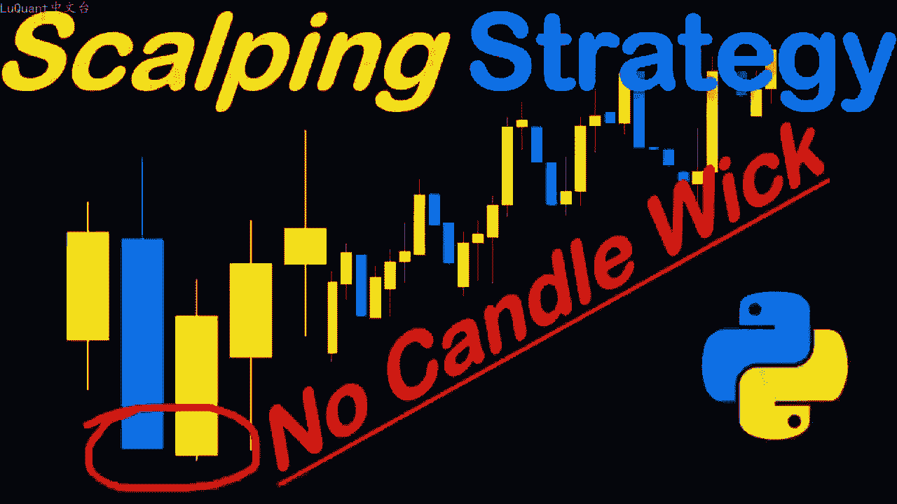
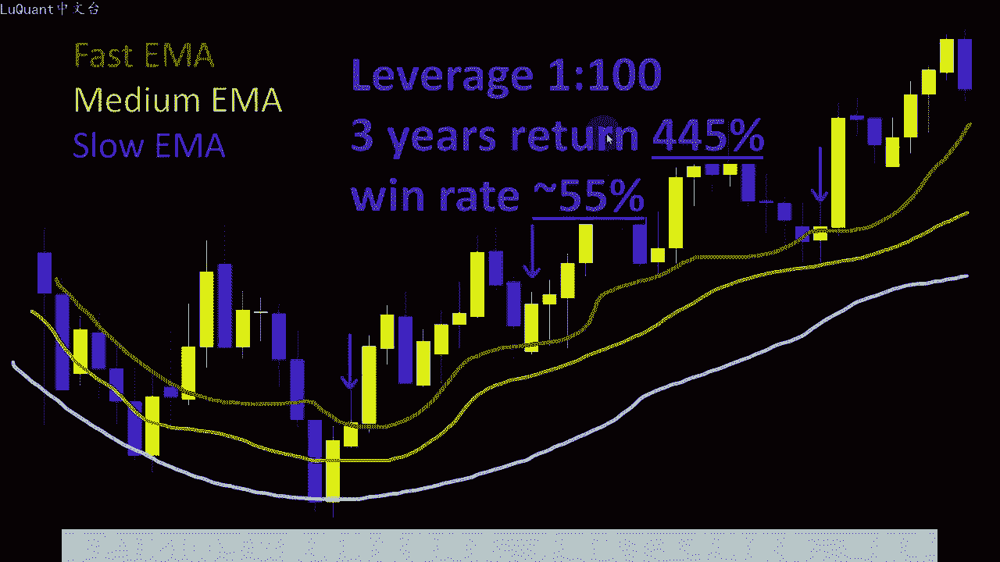
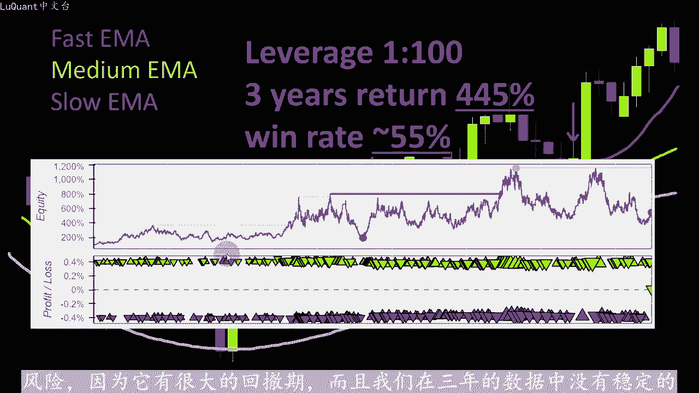
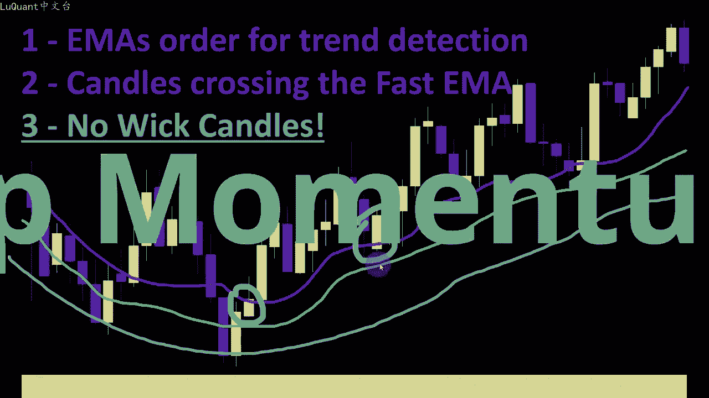
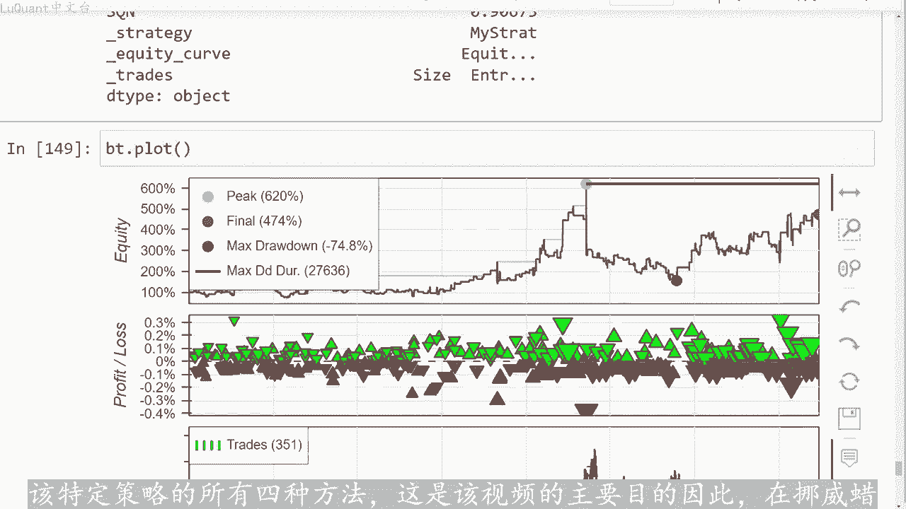
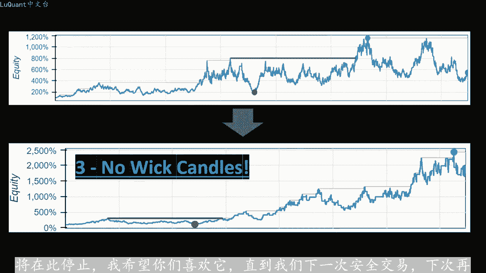

# python量化44：蜡烛图 - P1 - LuQuant - BV1km421J7br

在本视频中，我们将推断我们在前两个视频中介绍的简单雕刻策略。因此，如果您对详细信息和pyython代码感兴趣，我将在简要说明中为您留下一个链接，我们将使用三个据点指数移动平均线为快。

中等和慢速。如果他们按一定顺序排列，我们可以估计价格趋势是向上还是向下。在本例中，快速移动平均线高于中等移动平均线，中等移动平均线高于慢速移动平均线。并且在在这种情况下，如果订单反转。

则表示我们处于上升趋势，这意味着我们处于下降趋势。😡，上升趋势中，我们仅寻找买入头寸。在下降趋势中，我们仅寻找卖出头寸，以确定买入切入点。我们正在寻找开盘蜡烛低于并收盘于相反方向的快速移动平均线。

我们想要进。一个空头头寸，我们正在寻找一根开盘价高于且收盘低于快速移动平均线的蜡烛，在本例中我们有上升趋势。因此，我们正在寻找买入头寸这根蜡烛的开盘价低于快速移动平均线收盘价高快速移动平均线。

这根蜡烛的开盘价低于快速移动平均线，收盘价高于快速移动平均线。这根蜡烛就在这里，所以我们有三个不同的买入头寸信号的三个例子，我们已经对此进行了测试。我们在之前的视频中介绍了策略，并尝试优化我们的参数。

并简要介绍了我们使用杠。账户1比100可以获得的最佳结果，并测试了三年的数据，回报率为445%，胜率为55%。这些结果可能看起来值得一提的是，我们还调查了股票曲线。我们可以看到这种策略有一定。

风险因为它有很大的回撤期。而且我们在三年的数据中没有稳定的积极攀升。所以我想到了一个我很好奇的想法，我决定我们可以在我们已经使用的策略之上测试这个想法。😊。

仍将使用三个移动平均线顺序进行趋势检测，并将蜡烛穿过快速均线作为入场信号。但是我们在蜡烛上添加了一个条件，如果它是上升趋势，并且我们正。寻找买入位置，那么穿过快速均线也应该没有尾部或非常短的尾部。

那么蜡烛应该有非常短的下尾部。而在相反的方向上，我们正在寻找没有高纬部的蜡烛。在这个例子中，我们可以识别出这两根蜡烛，其中我们有上升趋势，蜡烛正在趋势方向上穿越快速移动平均。😡，同时，他们的尾部非常低。

确认了强劲的上升势头，显然像往常一样，这是唯一的方法。知道这是否是有效的信号改进，是在很长一段时间内对这些条件进行回溯测试。因此，在本视频中，我们将测试这一天。

到我们的策略中的内容，并比较添加第三个条件之前和之后的结果。我们将在pyython中执行此操作。您可以从描述中的链接下载源代码，这是一个jupiter笔记本文件。我希望您会喜欢这个。

这是我们的jupiter笔记本文件。因为我们已。分析过它，并在前两个视频中使用了相同的代码，我不会去通过所有细节，我不会花太多时间来简单介绍一下。

我们将导入2019年至2022年欧元美元15分钟图表数据。这时。😡，我们需要三年的数据进行测试，清理成交量为零的蜡烛，然后重置数据框的索引，将三个移动平均线添加到数据框，同时添加ATR。

因为我们将其用于同时止损和获利我屎。50100和150移动平均线的斜率。因此我们不仅要考虑移动平均线的顺序，而且三个移动平均线应该指向同一方向。因此，如果这是上升趋势，我们需要三个正斜率。

如果是下降趋势，我们还需。三个负斜率。因此，我们仅使用指数移动平均线生成第一个信号，这意味着，如果他们处于相同的顺序，并指向相同的方向，我们的第一个信号是它是上升趋势或下降趋势。

我们再次将信号作为MI信号添加到我们的数。况中如果速度太快，我们会在之前的视频中以较慢的速度查看详细信息。一旦我们使用移动平均线确定了趋势，我们就可以生成我们所说的总信号检测烛台一。趋势相同的方向。

穿过快速移动平均线。因此此时我不会在此处添加灯芯限制条件。因此这部分被注视，我们所说的总信号被添加为在这部分我们的数据框中增加了一个新链。我们可以在图表上可视化我们的信号。

所以这是我们如何做到这一点的一个事例。😡，点是我们可以在这里看到的买入和卖出信号，所以我不会详细介绍这个视频的详细信息，只是为了与我们的新条件进行比较。我们将在一段时间内添加回测部分。

我们将测试我们拥有的整个数据。😊，它几乎是三个多年的数据，我使用30股本的初始规模设置止损和止盈值的三种不同方式。第一种是固定方式。所以这里我使用45点作为止损距离，使用45点作为止损距离。对于止。

距离我从100美元的账户和1%的保证金或1比100的杠杆开始，因此，设置止损和止盈值有不同的方法，这些可能会影响在这种情况下，我们将观察到的结果，我使用了三种不同的方。第一种是固定的45点。

然后我们使用了另一种方法，使用与ATR相关的止损和止盈。这意味着止损距离与这里的ATR值是ATR值的2倍。止盈是根据止损。比率设置的这里是1。2，这意味着止盈距离是止损距离的1。2倍。另一种方法是。

我们使用追踪，也使用ATR距离进行止损。所以这是一个没有止盈的追踪止。我添加的第四个是从价格观察到的止损，这意味着我正在检查信号之前的6根蜡烛蜡烛。如果我们处于买入位置，我正在检查这些蜡烛的最低值。

如果我们处于卖出位置，我正在检查这些蜡烛的最高值，并且我。😡，其设置为止损距离。所以从技术上讲，我这样做的方式，我将后面蜡烛图的最小或最大值添加到数据框中的一个新列中，我将其称为止损信号。

稍后当我回来测试我的策略。当然，一旦我们有我们还需要设置我们的止损距离，这是使用我在此处测试中设置为1。2的止盈止损比率来完成的。这样您就可以看到，我已经测试了许多不同的方法来设置止损和采取力。

和交易管理现在让我们检查结果添加第三个条件并开始比较。因此，首先使用固定距离止损和止盈值，我们得到了445%的回报。我们在这里可以看到，盈率几乎为50。

三年数据中的交易数量百分比为375股本曲线不是很稳定。我们可以看到，我们有很大的回撤，我们可以继续使用与ATR相关的止损和获利的第二种方法使用我们的比。获得74%的回报率和47%的胜率。

并且股票也显示出回撤，不是一条积极或稳定的曲线，但它给人的印象是它比之前的止损和获利回撤追。止损方法稍微安全一些，同样使用ATR距离，我们得到的回报为-39，所以这是一种失败的策略，这是一种失败的方法。

胜率约为36%。所以这是我们迄今为止尝试过的最糟糕。交易数量因为我们可以看到，我们可以继续进行。下一个，我们可以看到，无论如何，股票看起来非常糟糕，因为它几乎有一年半没有回报。

然后我们在某个时候有非常高的回报算法，由于某种原因起作用，市场上表现良。😊，然后我们有一个很大的回撤，我们不希望在算法交易中避免这种情况，使用价格或蜡烛的止损也是我们尝试过的另一种方法。

在这里我们有一个回报率为负89，胜率百分比为40。权益显示出非常嘈杂的行为，平均赋斜率，因此这是一个失败的策略。现在我将通过添加我们刚刚解释的第三个条件来修改总信号，观看此视频。因此。

在下降趋势的情况下，我们需。蜡烛的较高值减去开盘价，即蜡烛主体的最高值，此差值应低于或等于我们称为弱限制的参数。此时，我将弱限制设置为210到5。这在很大程度上取决于您使用的货币类型。

以及您正在下载的数据。如果在上升趋势的情况下，是5位或4位小数精度，则意味着当信号等于2。那么我们有一根从快速移动平均线下方到上方的交叉蜡。同时，我们需要该蜡烛的开盘价减去最低值。

这意味着下尾或下影线距离小于或等于我们的灯芯限制。所以我们的弱限制只是一。我们可以修改和实验的可变参数。所以我从210到-5作为第一次尝试。所以我们注意到的第一件事是我们的信号数量较少。

我们在图表上绘制的紫色点，这是正常的。因为我们刚刚添加了一个新条件。😊，让我们看一下结果，现在我们正在使用固定距离止损和获利进行第一次回溯测试。现在我们有返回百分比为1805。因此请记住。

我们使用了相同的条件，我没有在代码中进行任何修。除了我们添加了第三个条件，及蜡烛在趋势方向上穿过快速移动平均线的短灯芯。因此获胜率在这种情况下高达59%。最重要的是，权益图在3年内显示出不断增加。斜率。

因此当然我们总会有回撤期和一些非盈利年份，但总体而言，我们的斜率不断增加。我们可以在这里看到。因此从这个角度来看，在该特定策略上添加此条件的效果非。😊，积极第二个策略也使用了ATR相关的止损和止盈距离。

这里我们的回报率为249%，因此它比以前的值，我们的胜率百分比同时为5%。如果我们看一下净值曲线，我们也再次看到正净值的上升趋势，我们总是会时不时的出现回撤期。但总体而言。

我们看到净值有所增加3年期间的利润。ATR相关距离的追踪止损是使用先前条件的一种亏损方法。因此，现在我们在三年内的回报率为394%，净值显示的盈率为42。5%上升趋势。但随后我们有一个很大。回撤期。

所以这并不是一个很好的方法，但无论如何添加第三个条件的效果，意味着低烛新蜡烛，使该策略成为一个获胜策略。在此之前，它是一个完全失败的策。策略我们的最终方法是使用价格或蜡烛的止损，我们的回报率为373%。

因此请记住，这是在亏损方法之前的亏损策略。当我们在没有低权重条件的情况下尝试它时，他给出了。70左右的值或负80%。所以这里我们有正373%，胜率为49，在添加第三个条件之前约为36%。

最重要的是权益凸显。第一个时期有所增加，然后我们出现回撤，然后是第二个时期第三阶段的增长，让我们说这不是一个理想的策略，绝对不是一个好的交易系统。但是该视频显示了低更新条件的重要性。它改进。

该特定策略的所有四种方法，这是该视频的主要目的。因此，在挪威蜡烛中添加第三个条件，提高了我们的权益。从这种行为到这种行为，我们可以看到，权益不断增加，这看起来比之前。

行为要好得多，并且也带来了更高的回报。因此，我们达到了以上两个这里的百分之千作为最高回报值，请记住，该视频的目的不是向您展示完整的交易系统。它只是为了展示此特定条件在添加。简单策略时的效果。

因此也许您可以考虑将其添加到您的系统，这可能不是我们可以研究的唯一有趣的蜡烛模式。但对于这个视频，我们将再次停止。我希望你们喜欢它，直到我们下一次安全交易，下次再。😡。

