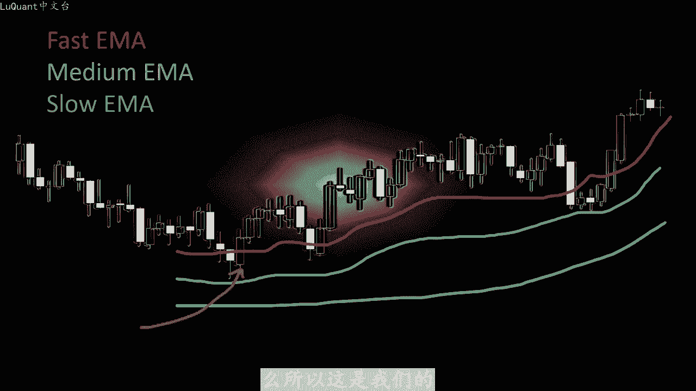
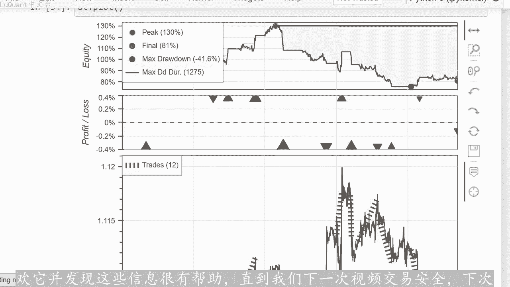

# python量化45：简单EMA1 - P1 - LuQuant - BV1FJ4m1E7bm

大家好，欢迎今天我们开始测试雕刻策略。我知道你们中的许多人最近一直在要求这样做，我必须承认我通常会避免第时间框架和雕刻。因为我发现这是一种冒险的方法，而且大多会让人紧张。但当涉及到算法方。😡。

事情可能会更容易，因为我们可以测试我们的策略，并确切的知道我们可以期望什么样的结果，所以希望不会出现丑陋的意外。因为我们的模型已经像往常一样进行了回溯测试，pyython代码可以从以下位置下。

视频描述中的链接，如果您对编码部分感兴趣，如果不是您可能只是喜欢该视频，并与我们一起检查我们的策略可能会给出什么样的结果。所以作为开始，我选择了一些相对简单的东西，我们将使用三个指数一。

平均线一个是快的，另一个是中等的，第三个是慢的。我们将使用这些移动平均线来检测我们的趋势。当他们按照一定的顺序排列时，比如快速高于中等、高于慢。😡，移动平均线。

那么我们有上升趋势和相反的顺序表明现在是下降趋势，只是为了确保趋势，我还添加了一个条件，即这些曲线的斜率应该指向同一方。所以当这三个曲线具有正值时，我们正在讨论上升趋势斜率。在下降趋势的情况下。

三条曲线的斜率应为负值，意味着向下。当我们有明确的趋势信号时，将寻找入场点。因此，当价格穿过快速移动平均线时，如下所示在这个例子中，我们正在寻找买入头寸。我们有一根蜡烛，其开盘价低于快速移动平均线收盘。

高于该曲线，这表明上升趋势的持续，这将是我们的入场点。在本利中是我们的买入头寸利息。我们可以在pyon中对所有这些进行编码，并首先回测该策略无需太。优化。因为我想让这个视频简短一些。

但我会制作另一个视频来尝试优化我们的参数，看看我们是否可以管理我们的交易获胜组合。现在让我们看看如何用pyython编写所有这些以及回溯测试结果显示什么。所以这是我们。

木星笔记本文件，我正在使用欧元美元货币2019年至2022年之间的15分钟烛台。所以这意味着我们拥有近三年的数据。当然，如果您想进一步测。该策略你也可以下载更多数据，例如6年的数据等等。

但在caco网站下，当您下载分钟烛台时，您最多只能下载三年的数据。因此您必须以三年为一个批次下载这些数。并相应的连接您的数据针，以便我们在这里所做的事情，我认为三年就足够了。所以我们有了我们的数据针。

我们的数据帧中有1005000行，请记住，每个行代。一个烛台，它是15分钟蜡烛，我正在清理数据框架中的交易量为0，这意味着这些是周末和休息日期间的蜡烛。所以我们没有市场变动。我们对此类数据没有兴趣。

并且在此。😡，我们可以导入pas underscoresp技术分析模块，并计算三个不同的移动平均线。我将其称为M50100和150。我使用第一个的长度及快速移。平均线长度等于50。

然后长度等于100和150，代表慢速移动平均线。正如我在算法部分开头所描述的那样，我还添加了移动平均线的斜率，这是在这个单元格中完成。这里我将其放入一个称为回滚 n的参数中，其中默认情况下等于10。

这意味着我们采用10个不同蜡烛的移动平均值来计算斜率。因此，所有这一切只是为了告诉您，这是我们也可以为我们。策略处理的一个参数。换句话说，如果我取十意味着我正在计算最后十根蜡烛的移动平均线的平均斜率。

因此，该参数将确定。考虑上升趋势或下降趋势之前，我希望建立趋势的时间有多长。所以现在我们的数据框看起来像这样，我们有开盘价、高低收盘价、交易量、三个不同的移动平均线以及三个不同移动平均线的斜率。

我们可以注意。这些斜率的大小和值是根据以下计算得出的指数，而不是根据交易时间好吧。所以现在在这个阶段，我们可以检查我们的条件。我们可以说，如果我们的快。😊，移动平均线低于中期移动平均线。

并且中期移动平均线也低于慢速。移动平均线移动平均线，然后我们的对齐显示出下降趋势。除此之外，我们希望三个移动平均线的。为负，因此我添加条件F斜率M250为负。

且F斜率M100为负值以及斜率M2150也是负值。对于相反的趋势方向，我们。快速移动平均线高于100移动平均线及中等移动平均线，而中等移动平均线高于慢速移动平均线。这组条件将显示上升趋势。同时我们希。

移动平均线的三条曲线的斜率为正，并且这些斜率是在此处的这些条件下设置的。因此，现在我们有了两组条件选择或结果，这些条件可以是一个或两个一个表。下降趋势两个表示上升趋势，我使用numping模块。

将这些条件分配到我们的数据框中的一列中，我将其称为指数移动平均信号。默认情况下的直信号等于0。意味着如果不满足这些条件或不满足其中任何条件，那么我们将得到一个等于零的信号。

这意味着我们不知道趋势是上升趋势还是下降趋势，因此这将是我们的指数移动平均线信号。它是我。添加到数据框中的另一列，但这还不是全部。我们还有一个信号来执行买入或卖出头寸。我们必须寻找正在开盘和收盘的蜡烛。

穿过快速移动平均曲线。因此我们。首先，创建一个称为总信号的列表，它等于0，它具有与数据帧相同的长度，并且对于数据帧中的每一行，我们将检查是否有指数移动，平均线信号等于一，表示卖出信号。同时我。

当前蜡烛的开盘价高于当前蜡烛的M50，收盘价低于当前蜡烛的M50或当前行。在这种情况下，我们有一根蜡。开盘价高于快速移动平均线，收盘价低于快速移动平均线，这将是我们的入场点。我们的总信号将等于一。

在这种情况下，相反的条件是当我们。M信号等于二表示上升趋势时，我们将寻找开盘价低于快速移动平均线，且收盘价高于快速移动平均线的蜡烛。在这种情况下，我们的总信号等于二表示一个购买信号和一。切入点。

因此所有这些都被分配到一个列表中。然后该列表作为一列添加到我们的数据框中。我在这里放置的标题是总信号。我们在这个阶段的数据框。如下所示，开盘价收盘价成交量栏，三个移动平均线。

移动平均线的三个斜率指示趋势的移动平均线信号是否是上升趋势和下降趋势，以及指示我们。入场点的总信号以便更好的查看我们的信号。我们可以在图表上可视化这些，所以我将定义一个名为点位置的新函数。

如果某个蜡烛的总信号等于一，这意味着我们有一个卖出信号。😊，在上面绘制一个点蜡烛，否则如果我没有买入信号，我们将在蜡烛下方绘制一个点，否则我们不必包含任何我们不绘制的任何内容。

我将把它添加到我们数据的一列中这些。信号的点位置，我将在蜡烛100和蜡烛2350之间绘制所有这些，这是我们的图表，我们有三个移动平均线，我们有子。点显示我们的卖出和买入信号。

所以也许最好放大并花更短的时间。假设从2000到2350，总共有350个。这里我们有一个下降趋势，因为我们有一定的对齐方式，移动平均线的斜率是负的，我们是寻找从上到下穿过快速移动平均线的交叉蜡烛。

这将表明卖出信号这。我们的系统检测到的卖出信号，您可以看到这些是完美的信号。因为如果我们将这些信号视为卖出信号信号，随后价格下跌，请记住，下跌不一定是大幅下跌。因为我们正试图在这里进行雕刻，以便我们的。

😊，银足够接近我们的卖出头寸，但是这里的这个信号是错误的信号。我们满足条件三个移动平均线，在同一方向上对其我们此时有负斜率，但之后价格没有下。我们的价格有小幅上涨，可能在这种情况下。

我们正在触及我们在这张图的结尾处达到这个大跌幅之前的止损。这样你就可以看到信号工作正常。这张图上没有奇怪的信号这。😡，我们构建的系统就像这里的注释一样，请注意，我们将立即打开一笔交易。

因此这四个信号将作为一个信号执行。这意味着，一旦我们打开了一个单元格头寸。我们。不允许并行打开另一个头寸。所以现在我们可以尝试回测这个策略，我们定义我们的信号及总信号。

然后我导入back testing pipe包，并定义我的策略类。该策略。继承自测试包的策略类，我的起始大小是0。3，这意味着现在是我的30美元有点太多了。但如果你想用50或100美元进行雕。

这是可以接受的。我的意思是，在最坏的情况下，你会损失50美元，这并不多。所以我们不讨论这里的大金额，我们想用小金额来雕刻，因为这将使我们能够增加利润，并更快的改善我们的权益。所以我要3。😡。

我将跳过这与央相关的部分，我们不会在这个视频中使用，也不会在这个策略中使用。特别是当我们使用三十的权益时，因此，如果我们有一个等于二的信号，那么它是一个买入信号和一个入场。

同时也是我们的买入信号和入场点的长度。当前未平仓交易为0，这意味着我们没有未平仓交易。因此我们一次只有一笔交易，参考当前蜡烛的收盘价进行止损和止盈。我们将采。40点和40点也是为了止盈。

所以他们与我们的头寸价格的距离相同。那么我将买入执行，买入头寸，考虑到止损、止盈和手术大小。对于卖出信号来说也是如此。其中，如果我。采用相同的止损和止盈距离以及相同的手速进行回溯测试。

我的保证金为11%，所以我正在考虑使用杠杆来提高我们策略的回报。因为我。考虑100现金作为起始账户价值，这些是我们获得30%回报的结果，所以还不错，我们的胜率是66。6%，所以它也相对较。

我们可以尝试更长时间的测试该策略，因为记住我们在这里只使用了350根蜡烛，所以假设我们要使用1000根蜡烛，最多2350行，我将重。执行这些信号。所以这里我们有20个回报，到目前为止。

这也是一个获胜策略，要尝试不同的时间段。假设我们要在1万到10。350之间。这些是蜡烛行的缩影，所以我将再次执行回溯测试。这里我们有回报为复14，所以我认为这个策略有一些潜力，因为它在很多情况下显示。

正回报，但也有一些时期你会得到负回报。只要记住，我们采取了一个非常简单的策略。我们只是使用三个移动平均线，并在蜡烛穿过快。移动平均限时查看蜡烛，因此，在这种情况下，没有来自不同信号的确认。

我认为这个策略可能会有很多改进，但这是我们可能会关注的东西。在下一个视频中尝试优化诸如止盈止损比率之类的东。在这种情况下，可能使用ATR或者可能使用追踪止损，可能会更改其他参数。例如手术大小等等。

以便您可以看到，我们可以改变很多参数来尝试优化这。策略，这将是我们下一个视频的主题，只是为了让这个视频尽可能短。好吧，这就是我在这个视频中要告诉你的全部内容。我希望你们喜欢他，并发现这些信息很有帮助。

直到我们下一次视频交易安全，下次再。😡。

