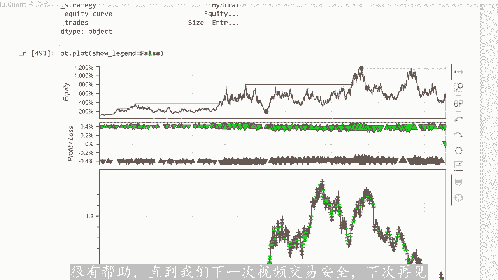

# python量化46：简单EMA2 - P1 - LuQuant - BV18m411k72n

您好，该视频是上一个视频的延续。我们只是尝试优化之前简要介绍的雕刻策略，我们将研究在计。移动平均线的斜率时要考虑的蜡烛数量，这是称为的参数回滚N需要一定数量的蜡烛。我们计算这些移动平均线的平均斜率。

因此我们可以考虑2010或5或任何数量的蜡烛。我们。对此进行处理，我们还将检查是否可以添加一些条件。例如，在移动平均线斜率上，我们可以尝试测试斜率小于-十道。似或某个斜率限制的条件，而不是简单的复获证。

因此，我们将研究这些参数，为了尝试为我们的趋势识别创建更好的过滤器，最后我们将尝试不同的交易管理方法，考虑固定值。和止盈值追踪止损和与ATR相关的止损和止盈，看看这是否会是一个奖励雕刻系统。

现在在这方面，该系统并不是真正的快速雕刻风格，因为我们正在研究15分钟。时间框架，所以它更像是日交易策略，但是可以在较低的时间框架上研究相同的系统。尽管它可能是一个由于市场噪音，控制起来有点困难。

正如我已经提到的这是上一个视频的延续。因此，如果您还没有观看我们的策。😊，说明那么在返回并检查优化之前，先检查该视频，可能是明智的选择。我们在这个视频中展示好吧，让我们从我们的代码开始。

这是我们的jupiter笔记本文件。我们正在创建一个数据框。此时我们正在清理数据，我们正在计。三个不同的移动平均线和移动平均线的斜率，这就是我们开始测试我们的策略的地方。所以首先我将采用1根蜡烛。

这意味着我将采。1根不同蜡烛的移动平均线来平均快速中速和慢速移动平均线的斜率。如果一切正常，我将执行此检查，并且我将执行我们在上一个视频中介绍的信号。因此，我们到目前为止正在处理入口点的总信号。

现在在这里进行我们的测。😡，介绍了一些我们可以考虑的东西，4根蜡烛将构成1小时，因为这些是15分钟的蜡烛，我们每天有24小时和30天，所以这一根构成一个月。所以这是一个测试单元，只是为了选。

我们的一部分数据框，假设我们从第37000行开始，我们将选择数据框的一部分即起始缩引37000，然后直到起始缩引加上3个月。三倍长度。换句话说，我们正在测试这三个月的数据。

我们可以选择两个月、5个或10个月。所以这将时我们更容易选择数据框的部分或切片。当然。是非常近似的，因为我们已经从零开始清理数据交易量丑闻，但是它或多或少的提供了一个工作时间范围。

所以我加载了三个不同月份的数据。我们可以看到这段时间内的ar信号。开始回溯测试，我们的初始批量大小是30，我们将分别考虑40点和45点作为止损和止盈。现在我们可以开始回溯测试我的保证金。11%。

所以杠杆账户现金为100作为开始，我们可以开始测试这个在这里我们在我们考虑的时间段内获得了107%的回报。所以这是我们现在考虑的三个。当然，为了模型的稳健性，我们必须在不同的切片上测试策略。很多时候。

例如我可以将此处的起始缩引更改为47，但仍然需要3个月。假。我要执行此操作，这将需要一些时间，因为3个月的数据量很大，所以现在已经完成了，可以检查它是否正常工作的信号，让我们继续尝试再次运行回溯测试。

因此，在我们考虑的其他时间段内，我们有30%的回。😊，我们可以尝试尽可能多的时间来确保交易是安全的。我们以67为例，没有错误消息，我可以重新测试所有内。并检查回报。这里我们有负26-27的回报。

因此您可以看到某些时间段将提供正回报，其他一些时间段将提供负回报。现。我要做的只是为了能够测试更长的时间段，我无法绘制数据真的很大一部分，这花费了太多时间。而且减慢我的joptter笔记本速度。

所以我只是选择我们感兴趣的数据帧的一部分，让我们。10个月为例，让我们从所引7000开始，甚至12个月来考虑一整年，我们可以尝试执行此操作。现在我们每年的回报率为1%。这并不多，实际上非常好。

因为您将开始时的金额翻倍，但这并不多。因为按照这种交易频率，我们有很多过去的交易交易数量为190。通常我们可以有更好的东西，所以胜率约为51%，这还不错，但也不是很引人注目。我可以绘制例如数据的净值。

我们可以看到什。我们的账户发生了这样的情况，我们的资金高达10%，几乎40%，我们可以上涨。然后我们在这里大幅下跌，我们不知道发生了什么，然后我们的净值开始再次上升到200，所以这不是一个非常糟糕。😡。

策略，但现阶段还没有太多优化。我们可以从这些蜡烛和绿色和红色交易中非常清楚的注意到，我们可以看到绿色是盈利交易，红色是亏损交易。所以。明显，当我们有一个明确的交易时。

趋势意味着当我们在市场上出现快速波动时，就像这部分一样。我们在这里可以看到，我们有绿色的彩色交易，这意味着我们有获胜的交易。😊，而当我们有水平市场时，我们有红色交，就像我们没有的那样。

有一个非常清晰的趋势，这意味着移动平均线可能以某种方式对齐，但这不是真正的趋势，而是假趋势。但是当市场围绕某些点波动时，请注意，就像这里就。这里我会说，就在这里这里我们有一个水平市场，事情不是很清楚。

这就是我们的算法混乱的地方。所以当我们总体上仍然有一个趋势市场时，我们刚刚提出的这个策略效果很。😡，他给了我们一些积极的回报，加上100单一年中股票的波动，对于一个良好的交易系统来说并不是非常理想。

所以我们在这个阶段要做的就是增。我们正在考虑测试的蜡烛的数量，移动平均线，这是这个参数，我们将采用30根蜡烛。例如，我只是选择数字，我们可以再次回溯测试这部分，但我们可。😡，启动回溯测试。

我们的回报为124，所以它稍微好一点，与之前的测试相比，让我们检查一下净值。这样我们一开始有一些更稳定的东西，然后静值不断增。达到700%和700左右。但接下来有一段回撤期，让我们检查一下发生了什么。

所以我们在这些之间损失了我们的利润。这里有两个点，这个峰值和这部分就在这里。因为我们有一。😡，水平市场如果是上升趋势还是下降趋势，我们会给出有关趋势的错误信号。我们可以看到，在交易期间的这一部分。

我们大部分交易都是亏损的。所以我们知道我们的算法，我们知道缺点，我们知道算法的优。😡，我们知道它会在哪里搞砸有两种解决方案，要么我们尝试添加一些过滤器，这会有点困难。例如更多指标。

要么我们简单的当我们直观的看到，我们有一个流行市场时，打开算法。我们不会让算法每天24小时运行，我们只是在那里协助算法，只是检查何时应该处罚，何时不处罚。趋势一个明显的趋势。

我们可以让算法运行12小时回来检查市场上发生了什。😡，如果市场不是很流行。那么我们关闭我们的算法好吧，所以我将尝试增加一个更多时间检查后面蜡烛参数的值，并检查我们是否可以采用非。大的东西。

比如说40左右检查他是否解决了问题，这里我们有248%的回报，因此我们增加了我们不会损失太多资产的回报。再考虑。我们正在损失大部分利润的这个窗口。所以如果我们能够确保算法可以跳过这个窗口。

甚至可能不在这个窗口中进行交易。我们此时可以赚取大约600到700%的利润。还值得一提的是，今年上半。我们测试器的第一部分可能也是水平的，就像净值没有太大改善一样。如果我们此时观察市场。

所有这些你都可以看到它是水平的市场趋势不是很清楚。但只有当我们开始出。市场变化的峰值时，我们才开始看到权益部分有所改善。这再次证明我们的算法非常适合趋势市场，但它并不适用现在在水平市场上关于止盈。

止损值表现良好，我们当然可以增加止盈或止损值，并看看改变这些对我们交易的影响。这些是我们的统计数据。我们现在的回报是负的，所以-2。这只是为了向您展示我们的模型对这些只有多么敏感。

以及管理交易和交易中的资金管理有多么重要。很多人都认为，如果您有完美的交易信号，如果您有获胜性。一个好的百分比就足以获胜并拥有盈利策略。实际上超过一半的策略是使用良好的资金管理或交易管理系统。因此。

在这里我们可以尝试将这些更改为70点。7570乘以75，然后再试一次，我们现在得到了-61，所以我们的策略突然变成了亏损策略，似乎该策略不行。止损和止盈的大距离。所以我认为我们最好采用较小的值。

例如35乘以35，例如35835点，这里我们有29点，几乎是利润的30%。所以至。我们知道我们不应该过多增加止盈和止损距离，因为这是15分钟的时间范围。在这种情况下，它不会对我们的盈利策略来说是积极的。

所以让我们回到40。😡，和45再次尝试，这里我们的回报约为101，所以看起来40点45点是止损距离太短之间的最佳点指盈。这两个参数的距离太宽，现在另一个想法可能是尝试使用与ATR相关的止损和止盈。

我们在程序中的某个时刻包含了ATR，它是我们数据框中的一列。所以我们运行了这个对。移动平均线，我们还有一列，我将使用这个值来计算止损距离。该距离将与ATR相关，因此它将是AT2距离的2倍。1。

5倍ATR距离取决于您想要相对于蜡烛的最后收盘价将止损设置多远。所以让我们从1。5开始，然后我们有止盈止损比率，我将其设置为1。5，我们可。首先从一开始，这意味着我们的止损和止盈值距离相等。

我将运行这些。当然，这些包含在我们的买入交易执行和卖出交易执行中，所以我将运行这。我们有大约6个6个月内的回报率。所以如果我把它放回到12个月，今年我们有57%，所以我们有挣回报，看看股本。

我们可以再次绘制股本。这就是我们所拥有的现在我们有很大的亏损。当然，我们可以改变止盈和止损的比率，以及止损AT2距离。所以此时我们可以尝试利。等于2倍ATR的止损和止盈止损比率暂时保持为一。

我们需要当时更改一个参数来验证对结果的影响。因此这里我们有86%的回报。之前的结果有所改进。所以如果我将其增加到2。5，再检查一次，我们得到了246的返回。所以这很好。如果此时我们回落到83。

我们可以进行3。所以我认为大约两次是这个特定参数的最佳点。现在我们要进行要更改止盈止损比率，我将设置为1。2，我们大约为95。所以这是一个轻微的改进。这意味着我们可以进一步设置1。5止。

止损比率现在我们回到45，让我们回到1。2，我将保留这些我们的利润约为95，所以没有什么特别引人注目的，但它仍然是一个获胜策。我们可以尝试的另一种方法是使用追踪止损。

所以我们将使用ATR正如我们几分钟前所做的那样。但此时我们使用的是追踪止损，没有止盈，我们将跟随价格并设置止损。只要价格持续变化，止损值就会随价格而修改，朝着好的方向运行。这为我们提供了356%的回报。

所以我们测试了12个月，我们得到了350%的回报。几乎我将从2。😡，000开始。这是一个不同的12个月期间，我们将运行这个并检查结果。所以这里我们有2866的回报。所以在这种情况下工作的很好。

让我们尝试在不同的时间段开始3万。如果我们测试整个策略，我们的回报率为445%。我们在数据框中包含的整整三年的数据。我将把灵作为开始，让我们举个例子，这里我们。回报率为负39，所以从这个角度来看。

这不是一个获胜的策略。所以在某些时候，我们必须决定我们要将哪种交易管理纳入我们的交易系统中。我们需要选择稳健的东西，不仅能带来高。😡，得正回报回报，而且在三年内也能保持稳健或更多，以便获得确定的结果。

并避免在运行交易系统时出现丑陋的意外情况。这样我们就可。使用45点，这似乎是我们使用过的最稳定的系统，对固定止损和获利距离再进行一次测试大约30个月。在这三年期间，我们的回报率为445%，这是我。

三年期间的股本，我们可以看到，我们已经提取了股本回报率，我们在某种程度上达到了10100%的回报率，这很好巨大的。但随后我们又出现了一次下降，只有我们能够提高该系统中的过滤能。并尝试限制这些下降周期。

所以请记住，我们在这个视频中采取了一些非常简单的东西。我们采取了三个移动平均线，这就是我们有一个蜡烛穿过快速移动平均线，所以它不是一个复杂的系统，它真的非常简。😡，非常基本。好吧。

这就是我在这个视频中要向您展示的所有内容。我真的想坚持这样一个事实，及优化策略是非常缓慢的事情，要有耐心，很难忍受，甚至可能会。😊，心理上耗尽精力，最后会让你感到疲倦。如果你想提高测试技能。

那么需要一两周甚至更长时间的时间。但是如果你喜欢学习过程，然后他已经令人满意。我希望你们发现这些信。😡，很有帮助，直道我们下一次视频交易安全，下次再。

