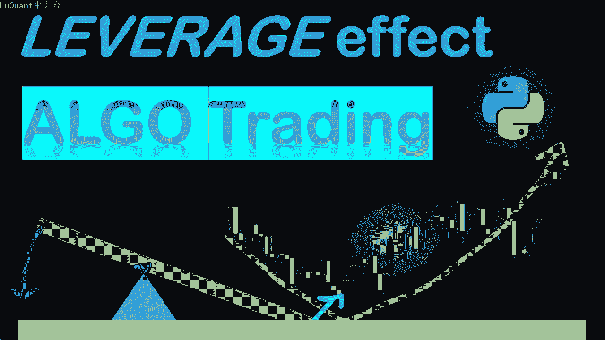
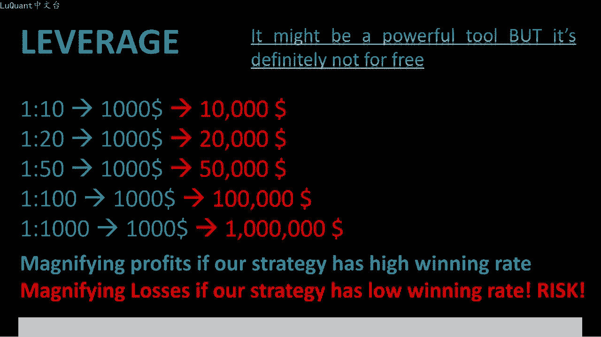
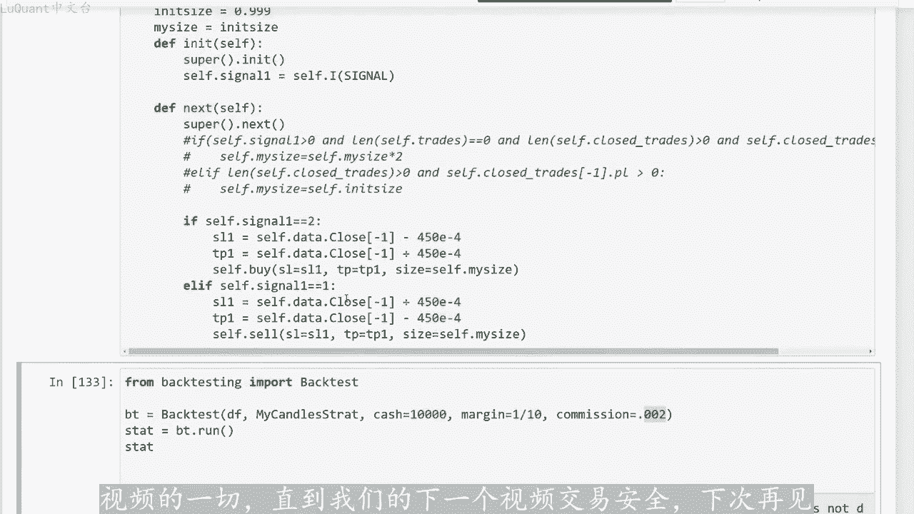
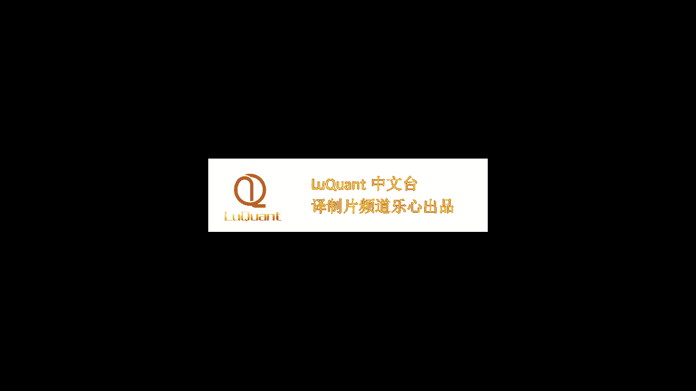

# python量化47：杠杆效应 - P1 - LuQuant - BV1Ht421G77R

大家好，欢迎再次来到我的频道。今天我们将在这个频道上首次讨论杠杆。我们将把它引入我们的交易系统。尽管我对此非常怀疑，因为我发现这是一种有风险的方法。然而，这些视频主要用于目的。

所以在您确切了解杠杆交易系统的全部内容之前，我并不是真的建议您遵循杠杆交易系统。因此，我们将采用我们在之前的视频中已经介绍过的以前使用过的交易策略。我们将测试利用我们的账户和使用算。

交易来放大我们的利润的效果，简而言之，如果您选择杠杆账户，它将按以下方式工作，通常您的杠杆比率将在一比10到亿之间千分之1。尽管更有可能是10分之1。😊。

到50分之1，这意味着，如果您有1个1000美元的账户，您将被允许买卖高达1万美元的头寸。如果您再次采用10分之1的比率，如果您增加杠杆，假设达到50分之1。

这意味着您的账户中具有相同金额的1000美元，您将可以使用最多5万美元进行购买。以此类推，您可能有权使用的杠杆类型取决于您的经纪商所在国家及其法规和其他财。还取决于您所处理的账户类型。

但是更有可能找到低杠杆账户，通常在10分之1到50分之1之间，尽管有些例外可能会高达千分之1。而且我自己也尝试过这种类型的账户。他。成为上升账户，我只在那里存了100美元。

我可以进行高达10万美元的交易。所以你可以看到它是一个非常强大的工具，但它不是免费的事物的呈现方式总是非常温和。你必须意识。尽管这种杠杆作用，增加了你获胜的能力，但它也增加了消灭你的账户的风险。

这是初学者通常会被更大的交易者或经纪商所利用需要记住的两条规则，如果您的策略具有高胜率。杠杆可以帮助放大力。😊，但如果您的策略具有低胜率，它会放大您的损失，现在什么样的比率是高或低。

将取决于许多其他参数，例如策略类型、止损、止盈值和我们的资金管理计划。因此请始终记住杠。是有价格的。即如果您被允许以100倍的价格买入或卖出头寸，您拥有的资金量意味着您的资金只是为了弥补损失。

这种损失可能会很快发生。因为您的交易金额是该特定金额的100。因此，在本视频中，我们将使用pyython来回测我们的策略，在上一个视频中使用使用普通账户检查收益，然后将杠杆账户引入我们的算法交易策略中。

我们将回溯所有这些检。结果并查看使用杠杆账户的优势和风险，这里的优势，我们可以按照我们想要的方式更改任何参数，并查看对回报率的影响。因此，我们将使用计算能力来测试和了。

使用杠杆账户的优点和缺点。因此，我们将使用于我们在上一个视频中使用的相同的pyon代码。我们在上一个视频中讨论了交易中的央方法，第一个单元格用于加载数据并清理数据重置索引等等。

今天不会花太多时间在代码上，因为我们在之前的视频以及其他视频中看到了它，我们使用了与此代码几乎相同的部分。因此，我们使用支撑和阻力函数来检测支撑和阻力。我们也有函数一组函数来检测我们是否有吞没模式。

看涨或看跌吞没蜡烛。此外，如果我们在烛台模式中有任何拒绝模式，我们有几个函数来检测我们的价格是。在一定范围内接近阻力位和支撑位。因此，我们将使用我们在上一个视频中也使用过的策略。

即如果我们在阻力位或支撑位附近出现拒绝烛台模式，我们会将其视为区。反转信号，并且我们我们将采取相应的行动。如果我们有看跌趋势反转，我们将产生一个卖出信号。如果我们有看涨趋势反转。

我们将在我们尝试过的上一个视频中产生买入信。包括这里发生的央方法，所以如果您对央方法感兴趣。您不妨返回上一个视频并观看这部分。所以目前我要发表评论，我们的初始头寸大。是大约10。

所以这意味着我们正在使用账户金额的时进行交易。如果我们运行这个特定策略，并且我们对数据进行回测，我们将获得10%。利润回报，因此这是正回报，这意味着我们的策略是一个获胜策略。

这也可以在我们在这里看到的权益图上看到，所以我们的正斜率总是在增加。所以现在开始工作是一个很好的策。😡，理想情况下，当我们不使用保证金时，这意味着我们可以用我们账户中的所有资金进行交易。

所以如果我在这里输入9990。999，实际上这意味着我将用我账户中的所有资金进行交易，我将。😡，他从一种货币转换为另一种货币，我们使用欧元兑美元。所以这意味着我用我账户的所有金额购买欧元或美元。

具体取决于我检测到的内容。我们可以看到我们的回。率为116。换句话说，我们的账户净值增加了一倍，我们获得了更多的收益。除此之外，我们的胜率非常有趣，我们有71点。百分号，所以这非常有趣，胜率。

这就是我们可以使用杠杆账户的地方。这对于请记住，因为如果您的胜率较低，低于5。并且您正在通过使用良好的资金管理策略或使用良好的止损和止盈比率或距离来弥补这一点。换句话说，您的交易管理的很好。

这是一件好事。因为最终您将获。正回报，但是如果您在算法交易中使用它，并且您打算使用杠杆账户，它可能不会对您有利。所以请记住，如果您的胜率较低，并且一个杠杆账户，你可能。增加你的风险。

但这里的情况并非如此，这是一个很好的掩示。我想向你展示，当我们有很高的胜率时，我们将在这里设置保证金参数。假设我们要开始使。1比10的杠杆账户测试我们的交易。所以我将重新测试这一点。

我们将看看我们赚取了多少回报，回报立即跃升至70140%。换句话。用11000美元作为开始。如果我开始用我的账户中的1万美元进行交易，我们将达到337。8万美元的净值风。最终净值约为724000美元。

所以现在这确实是巨大的。请记住我们的数据框包含2003年至2021年之间的价格数据。换句话说。几乎是18年的交易。所以如果您想知道每年赚多少钱，我们可以除以我们超过18年的百分比。

所以我将7140除以18，几乎是400%。换句话说，每年我们将赚取年初存入金额的4倍，这是由于我们首先在这里使用的两个参数。当然这是我们使用杠。账户10分之1的保证金，所以我们不是处理1万美元。

而是处理10万美元，只需将1万存入账户。但还有另一个参数，这就是我们正在处理的这个参。换句话说，我们所拥有的总金额是在欧元和美元之间来回转换的1万笔资金。我认为我们没有消灭账户这一事实。

只是因为我们在这里很幸运。如果我们更改任何这些参数，例如更改止损和止盈值，我们将使用完全相同的参数重新测试我们的策略。这样我们仍然可以获得21000的回报。这也。巨大的也是我们的胜利比率增加到77。

9%，这意味着大约78%再次使用此策略获胜。我们可以尝试另外两个止盈和止损值，并再次检查一。我们仍然有17000作为回报。在这种情况下，如果您只以10分之1的保证金投资1万美元。

那么最终的股本约为1731000美元。现在增加保证金是我们愿意做20分之1的事情。例如。如果我们再次测试，我们会得到同样巨大的东西。因此，我们将获得巨额金额作为获胜交易的回。获胜率约为66%。

因此看看我们是否再增加一次。假设保证金为40分之1是非常有趣的。我们仍然以50分之1的胜率获胜。所以他或多或少表现的很好，但正。我们所看到的我们开始获得较低的回报，因此我们只有1%325%左右。

这不是我们在之前的试验中得到的，并且保证金为11%，我们会得到-100，所以账户会被清。所以你可以看到，在某些时候，如果我们采用10分之1，会给我们带来非常诱人的结果。但是当我们增加保证金时。

跟上损失额会越来越困难损。让我们把这些值放回450，第一次在我们的交易中添加佣金。比如说现在是4，显然取决于佣金百分比。我。在这里放弃了您的回报可能会减少。所以在这种情况下。

如果我们以很小的百分比佣金运行，而不是47140。我们。回报将下降到1%0800%，所以它仍然是一个积极的和非常好的结果。但是佣金和掉漆费用大大减少了您要支付的所有费用。您在测试交易策略时。

必须考虑到这一点。所。这又是关于杠杆的，我希望你们喜欢他，这就是我要告诉你的关于这个视频的一切，直到我们的下一个视频交易安全，下次再。😡。

