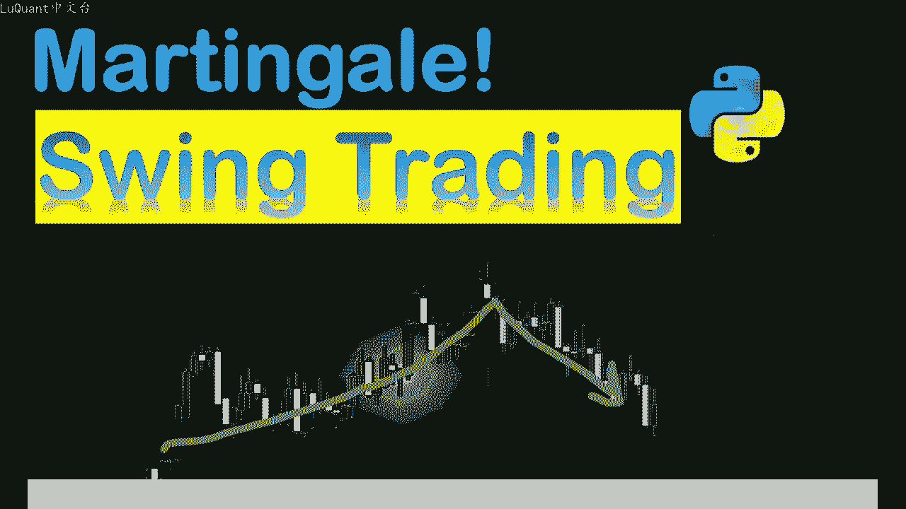
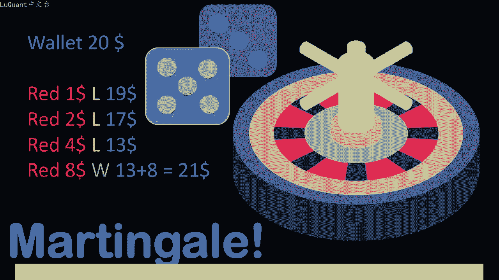
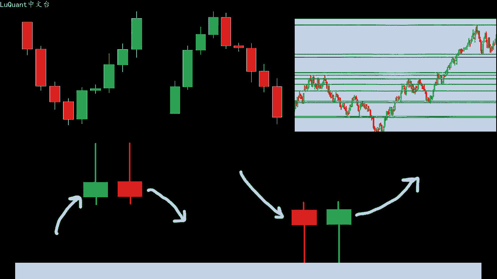
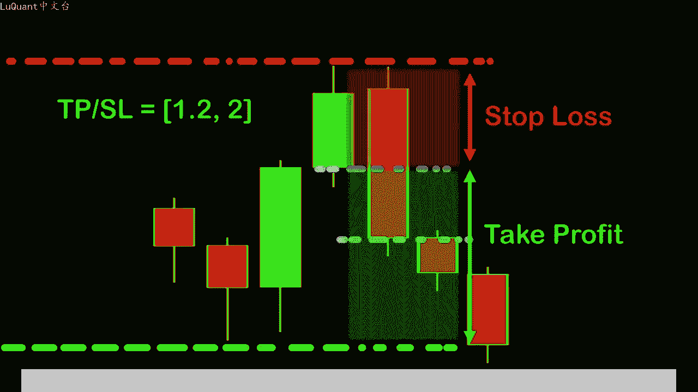
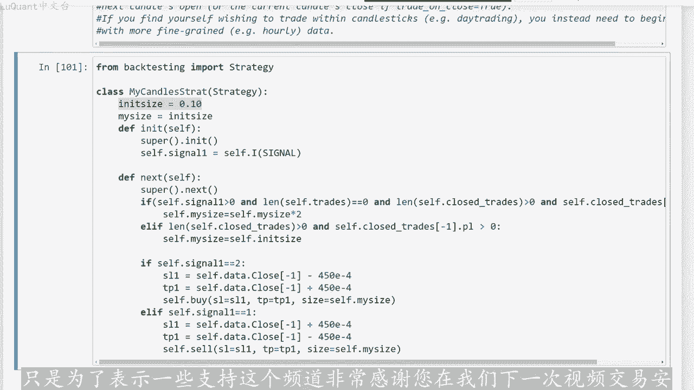

# python量化48：Martingale摆动交易策略 - P1 - LuQuant - BV1i6421F7Go

大家好，欢迎光临。今天我们正在研究央法与获胜交易策略相结合的效果。如果您还没有观看之前有关央法的视频，以及本频道上描述我们即将采用的策略的其他视频，要在此处使用支撑。和阻力位以及蜡烛形态。

我将在该视频的描述中添加一些链接。因此您可能有兴趣，首先观看这些链接，以便更好的理解我们在该视频中的方法，以及我用于回测的pyython代码对。那些刚加入我们的人来说，可以从说明中的链接下载该策略。

央方法包括每次我们结束亏损交易时，将我们的头寸规模加倍。这样我们希望在某个时候一场大胜利将弥补之前的所有损。在上一个视频中，我们详细解释了这种方法，并将其应用于完全随机的策略。

该策略平等的选择交易是买入还是卖出。现在我不打算详细说明此处的结果，经过回溯测试，并在上一个视频中显。但该视频的不同之处在于，我们将应应用于获胜交易策略。我们的策略将识别支撑位和阻力位。

以及是否有任何特定的蜡烛形态，非常接近任何支撑或阻力价格。

我们将认为可能会发生趋势逆转，并相应的执行我们的交易，将根据我们的比率选择止损和止盈值，我们将其称为止盈止损比率。因此，这是简而言之为新人回顾一。

如果您想支持这个频道，也不要忘记点赞和订阅。当然，如果您有任何想法，您也可以与我们分享这些想法。现在这个策略已经在下面发表评论了，在之前的视频中进行了测试。我们已经看到他提供了正回报这里的想法。😡。

尝试增加利润，将央方法添加到这个特定的策略中。好吧，让我们看看这一切在pyython中是如何运作的，并得出我们的结论。我也会尝试。为了保持这个视频简短，所以我不会详细介绍之前视频中已经看到的代码部。

所以首先我们已经加载并清理了我们的数据。所以我使用2003年到2021年的欧元美元每日数据视频，我正在检查我的数据真是否。正确加在，因此我正在打印数据针的尾部，然后我们将拥有支撑和阻力函数。

我们将使用它们来再次检测程序中的支撑和阻力水平。如果您想。这些功能的详细解释，他们在之前的视频中进行了详细介绍，我将在该视频的描述中添加一些链接，以便您可以返回并检查代码。如果您对编码部分感兴趣。

那么我们还有其他功能被称为吞噬。😊，是心形并且接近阻力位，且接近支撑位。因此，我们将使用这些函数来检测特定的蜡烛形态，并且我们将使用其他两个函数来检测这些形态是否接近阻力位或者接近支撑位。这就。

我们生成信号的地方，如果它是买入或卖出信号，它会发生在该单元格特定单元格中。因此，如果我们在特定行中有吞没模式，则看跌吞没模式等于一英此，这意味。我们正在寻找卖出价格，或者如果我们有不同的烛台模式。

也显示卖出信号，并且这些信号发生在阻力位附近。在这种情况下，我们将得出结论，我们有卖。信号，并且我们的信号将在相反的情况下。如果我们有一个接近支撑位的看涨吞没模式或看涨拒绝模式。

则我们得出的结论是我们有一个买。信号，并且我们的信号值将等于2。在所有其他情况下，我们的信号等于0，这意味着我们没有不会在该特定行绑定或出售的信号。因此，我们执行这些函数生成信号，并将信号存储在数据框。

所以现在我们。一个额外的列，看起来像这样，这是我们的数据框，我们有零表示没有特定信号，亦表示卖出信号。我们有一个等于我们有买入信号时的信号。此时我可以包含backag testing。

包以便对策略进行回溯测试。因此我们必须定义一个名为signign node的函数，该函数将返回数据框中每一行的信号值，这就是我将在蜡烛策略中使用的内容。在这里包含的类。

所以它是一个自定义类继承自back testingpyy模块的策略类。我们的头寸交易头寸的初始大小将低。一所以它是0。05，这意味着它是5%，我们目前持有的股票的数量。

所以我们每次都用我们账户中的5%进行交易。这部分是我们。决定我们的交易投寸规模的地方。所以如果我们有一个买入信号或一个卖出信号，所以无论如何，在这种情况下，我们有一个积极的信号。同时。

当前未平仓交易的场。等于0。因此，我们没有任何未平仓交易，这意味着我们将要开仓交易。因为我们有信号，并且没有为平仓交易。同时，我们以平仓交易的长度为证，这意味着我们已经通过了之前。

交易并平仓了其中一些交易。在这种情况下，我们将测试最后一笔交易是亏损还是盈利。那么自我点平仓交易元素是否负一，这意味着这些平仓交易的最后一个元素点PL点立。损失是持有利润或损失金额的变量。

在这个特定的交易中，如果它是负数，则意味着我们有一笔亏损交易，这就是我们将使用央方法的地方。因此，如果我们最后一笔交易是一笔亏损交易，我们将把基。到来的交易规模乘以2倍。因此，在执行当前头寸之前。

我们将把头寸规模乘以2。否则如果我们有一笔获胜交易，则这就是我们平仓交易的位置减去最后一个圆。最后一笔平仓交易的点PL为正值，我们正在重置我们的交易头寸规模为初始规模，即我们净值的5%。如果信号等于2。

我们就有买。头寸。因此我们将参考最后收盘价，设置止损和止盈最后一根蜡烛。我们将通过一个买入头寸，考虑到手术的大小。此时我们将检。我们是否有一个脉出头寸，一个脉出信号？在这种情况下。

我们将通过一个脉出头寸，同时考虑到手术的大小、止损和止盈值，以及采用央方法的头寸大小。因此，在现阶段，我将在此处对这些线进行评。因此，我们不会在以下位置使用央方法。首先。我们将按原样执行头寸。

并测试在这种情况下它会给出什么，以确保我们从该策略中获得正回报。因此我们从。万美元开始账户价值，不考虑佣金，我们只需要测试策略，然后我们可以稍后添加佣金，我们将运行这个我们可以检查回报率即5%买入病史。

回报率是5。12，所以这与我们的策略几乎相似。请记住，在这种情况下，我们的获胜率很高，这意味着我们的信号非常好，运行良好。因此我们有60。百分号的获胜交易最佳交易约为4。25%，最差交易为负数4。13。

所以这不是一个坏策略，它运作良好，信号很好。因为我们有相对较高的胜。但是在这种情况下，我们的回报并不完美，因为我们没有使用高头寸价值，这是显示增加的净值图随着时间的推移，这些是交易。

所以我们有盈利的交易也。亏损的交易等等，没有什么特别的。所以我要尝试做的第一件事是增加我们的收入，就是增加这个百分比。如果我们交易的话会怎样？我们拥有的一半。所以0。5这意味着每次50很明显。我们。😡。

提高回报率，所以现在是61%。因为我们投入更多资金，我们用更多资金进行交易，但风险会更高。在这种情况下，我们甚至可以用99进行交易。我们不使用任何杠杆，我们不使。😡，任何保证金杠杆。因此。

我们可以用我们所有的资金进行交易，使用这种方式没有很大的风险。我们可以将回报增加到115。在我们数据框中的整个数据上。好吧，所以这考虑。一定的止盈和止损值距离，所以我们也不会忘记这些参数。

以及我们现在为每笔交易放在桌子上的一定百分比。如果我们想使用央方法，那么我。不能将其保持在99，我们不能将所有资金投入交易。然后如果这是一笔亏损交易，则将其加倍。因为该加倍超出了范围。因此。

在这种情况下，如果我们打算使用央，我们必须将该金额减少。5%，现在我们将回到数据框中包含的数据的大约5%的回报率。现在我将放回央方法，它将被激活，我将执行单元。我们将比较结果。

所以现在我们使用此策略得到9。49。所以请记住，我唯一改变的是我激活了央部分，这立即提高了我们的会。5%到9点49%。现在我将绘制这些图，以便直观的看到现在发生的情况。它必须在权益部分上看到。

因为我们有一个轻微的斜率增加。斜率正在增加，但是当我们这里有这些回撤，所以我们有连续亏损，然后我们有一个大头寸，可以在某个时候弥补所有亏损交易，所以这可以避。我们连续2到3笔亏损交易的情况。

然后突然出现一笔大交易，赢回我们在过去2到3笔交易中失去的所有损失。正如我们在股票上看到的那样，总体上显示出更好的结果。因此我。的回报率几乎翻了一番，从5%上升到9。5%。现在改变止盈和止损的值。

看看这是否会增加我们。整体回报。所以在这种情况下不会增加。所以我们有一些东西我们将回落到4。8%，只是为了确保我们意识到这些也是重要的参数，是策略的一部分。我实质会说，这是我们策略的重要组成部分。具。

😡，取决于您如何设置止损，以及将止盈值设置在哪里。所以我要现在保持450点。我将在视频描述中放置一个链接，以便您可以下载此代码。自行进行实验，这样一切看起来都非常好非常好。

所以这个马丁格尔的事情加倍了我们这个特定策略的回报。但是如果我们可以进行实验，立。增加交易部分的百分比假设为实。那么如果我的每笔交易都用10%的资金进行交易。那么在这种情况下。

我们可以看到我们的程序中有一个错误，原因是在某个时候我们出现了很大的亏损。似乎会清空我们的账户。因为如果你在某个时候用十进行交易，并且你输了。那么我们投寸金额增加了一倍。

所以我们用大约20%的账户进行交。那么我们还会再次损失一次。如果我们将这个金额加倍，我们已经在用我们账户的40%进行交易，再加上我们账户之前损失的部分。所以正如您所看到的，如果您连续4次或5次交易失败。

我们。清除我们的账户。并且如果程旭在某个时刻试图通过交易，我们没有足够的资金来通过此类交易。如果我们的账户有60美元，那么这是不可能的。因为我们在之前的交易中损失了很多钱。而。账户很快就会被清空，因此。

央方法有其自身的风险，这里仅出于教育目的，而显示我并不鼓励你要使用它，你必须研究你的策略。如果你打算使用这种方法，你必须研究你的资金管。😡。

这就是我在这里向你展示他如何通过交易抹掉这个特定账户1万美元的原因，初始大小的10%，并使用马丁格尔。好吧，这就是我要告诉你的这个特定视频的全部内容。我希望你们喜欢他，并发。这些信息很有帮助。

如果是的话，请留下一个喜欢的评论，或者订阅，只是为了表示一些支持这个频道。非常感谢您在我们下一次视频交易安全之前停留这么久，我们下次再。😊。

